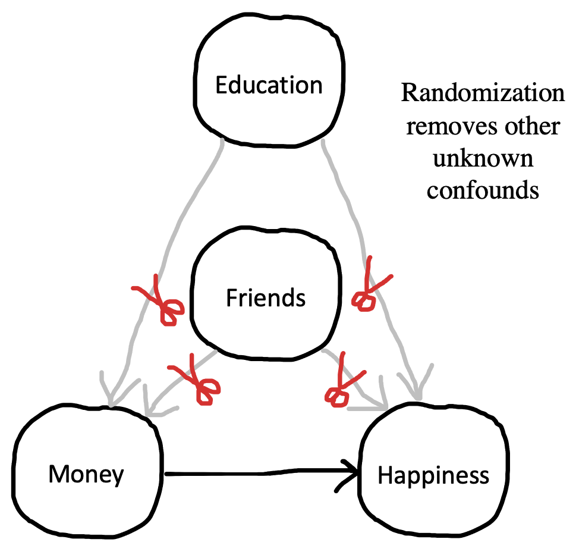

# (PART) Preliminaries {-}

# Experiments {#experiments}

::: {.box .learning_goals}
* Define what an experiment is
* Reason about why researchers run experiments
* Analyze the role of randomization in experiments using a causal graphs framework
* Consider constraints on the generalizability of experiments
:::

Welcome to Experimentology! This is a book all about the art of running experiments in psychology. Throughout, we will be guided by a simple idea: 

> The purpose of experiments is to accurately estimate the magnitude of causal effects.  

Starting from this idea, we’ll provide advice about how to navigate things like experimental design, measurement, sampling, and more. Our decisions about each of these will determine how precise our estimate is, and whether it is subject to bias. But before we get to those topics, let's start by thinking about what *why* we might do an experiment.

## Observational studies don't reveal causality

If you’re reading this book, there’s probably something about psychology you want to understand. How is language developed and understood? How is it that we experience emotions like happiness and sadness? Why do humans sometimes work together and other times destroy one another? When psychologists study these centuries-old questions, they often transform them into questions about **causality**.^[Defining causality is one of the trickiest and oldest problems in philosophy, and we won't attempt to solve it here! But from a psychological perspective, we're fond of @lewis1973's "counterfactual" analysis of causality. On this view, the claim that, in some situation, if people *hadn't* been given more money, they  *wouldn't* have experienced an increase in happiness.] As a simple example, consider the age-old question: does money make people happy? This question is -- at its heart -- a question about what interventions on the world we can make. Can I get more money and make myself happier? Can I *cause* happiness with money?

Scientists reason about causal relationships all the time, and it can be helpful to have a way to write down how we think a causal system is structured. For that, we often use a tool called **directed acyclic graphs** [DAGs; @pearl1998]. Figure \@ref(fig:intro-money1) shows an example of a DAG for money and happiness: the arrow represents our idea about the potential causal link between two variables: money and happiness. The direction of the arrow tells us which way the causal relationship goes. 

How could we test our hypothesized effect of money on happiness? Intuitively, many people think of running an **observational study**. We might survey peopled about how much money they make and how happy they are. The result of this study would be a pair of measurements for each participant: [money, happiness].

```{r intro-money1, fig.margin=TRUE, fig.cap="The hypothesized causal effect of money on happiness."}
knitr::include_graphics("images/intro/money1-drawing.png")
```

Now, imagine youur observation study found that money and happiness were related--or statistically **correlated**--to one another: people with more money tended to be happier. Can we conclude that money causes happiness? Not necessarily. The presence of a correlation does not mean that there is a causal relationship! There are many alternative causal models that can explain why two variables can be correlated, and only one of them is the causal relationship from money to happiness that we are interested in.

To describe this situation, we can once again use DAGs (see Figure \@ref(fig:intro-money2)). You could observe a correlation if money makes people happier (DAG #1), but you would still observe that correlation if the opposite were true: if being happy causes people to make more money (DAG #2). Even more puzzling, there could be a correlation but no causal relationship between money and happiness in either direction. Instead, a third variable—often referred to as a **confound**—may be causing increases in money and happiness to co-occur. For example, maybe having more friends causes people to both be happier and make more money (DAG #3). In this scenario, happiness and money would be correlated even though one does not cause the other. In other words, the confound **biases** our estimated causal relationship. The correlation is an estimate of the effect of money on happiness. But, the estimate might be biased upward by the friendship confound; in fact, that bias could be so strong that we might conclude there *was* a causal relationship when there wasn't any.

The state of affairs summarized in Figure \@ref(fig:intro-money2) is why we say "correlation doesn't imply causation." A correlation between two variables *is consistent with* a causal relationship between them, but it's also consistent with other relationships as well.^[People sometimes ask whether *causation implies correlation* (the opposite direction). The short answer is "no." A causal relationship between two variables often means that they will be correlated in the data, but not always. For example, imagine you measured the speed of a car and the pressure on the gas pedal. In general, pressure and speed will be correlated, consistent with the causal relationship between the two. But now imagine you only measured these two variables when someone was driving the car up a hill -- now the speed would be constant but the pressure might be increasing, reflecting the driver's attempts to keep their speed up. So there would be no correlation between the two variables in that dataset, despite the continued causal relationship.]

You can still learn about causal relationships from observational studies, but you have to be more sophisticated about the process. You can't just measure correlations and leap to causality. The "causal revolution" in the social sciences has been fueled by the development of statistical methods for reasoning about causal relationships from observational datasets. In fact, DAGs are one of the key tools that social scientists use to reason about causal relationships. DAGs guide the creation of statistical models to estimate particular causal effects from observational data. We won't talk about these methods here, but if you're interested, we encourage you to check out the suggested readings for this chapter.

```{r intro-money2, fig.margin=TRUE, fig.cap="Three reasons why money and happiness can be correlated."}
knitr::include_graphics("images/intro/money2-drawing.png")
```

## Experiments help us answer causal questions

Imagine that you (a) created an exact replica of our world, (b) gave \$1,000 to everybody in the replica world, and then (c) found a few years later that everyone in the replicate world was happier than their matched self in the original world. This experiment would provide strong evidence that money makes people happier. Let's think through why.

Think about a particular person -- if they are happier in the replica vs. original world, what could explain that difference? Since we have replicated the world exactly but made only one change -- money -- then that change is the only factor that could explain the difference in happiness. We can say that we **held all variables constant** except for money, which we **manipulated** experimentally, observing its effect on some **measure**. This idea -- holding all variables constant except for the specific experimental manipulation -- is the basic logic that underpins the experimental method [as articulated by @mill1859].^[Another way to reason about why we can infer causality here follows the counterfactual logic we described in an earlier footnote. If the definition of causality is counterfactual ("what would have happend if the cause had been different"), then this experiment fulfills that definition. In our impossible experiment, we can literally *see* the counterfactual: if the person had \$1,000 more, here's how much happier they would be!] 

Let's think back to our observational study of money and happiness. One big causal inference problem was the presence of "third variable" confounds like having more friends. More friends could cause you to have more money and also cause you to be happier. The idea of an experiment is to hold everything else constant -- including the number of friends that people have -- so we can measure the effect of money on happiness. By holding number of friends constant, we would be severing the causal links between friends and both money and happiness. This move is graphically conveyed in the DAG in Figure \@ref(fig:intro-money3), where we "snip away" the friend confound.

If we were talking about experiments baking cakes, it's easy to see how we could hold all of the ingredients constant and just vary one thing, like baking temperature. Doing so would allow us to make an experimental test of the effect of baking temperature. But how we can "hold something constant" when we're talking about people? People aren't cakes; no two people are alike and even if you try to "hold the ingredients constant" they don't come out the same! If we take two people and give one of them money, we are often comparing two *different* people, not two instances of the same person with everything held constant. It wouldn't work to *make* the first person have more or fewer friends so they match the second person -- that's not holding anything constant, instead it's another (big, difficult, and potentially unethical) intervention that might itself cause lots of effects on happiness. 

You may be wondering: why don’t we just ask people how many friends they have and use this information to split them into equal groups? You could do that, but this only allows you to control for the confounds you know of. For example, you may split people equally based on their number of friends but not their education attainment. If educational attainment impacts both money and happiness, you run back into issues with confounds. You may then try to split people by both their number of friends and education. But perhaps there’s another confound you’ve missed: sleep quality! Similarly, it also doesn't work to select people who have the same number of friends -- that only holds the friends variable constant and not everything *else* that's different between the two people. So what do we do instead?

```{r intro-money3, fig.margin=TRUE, fig.cap="In principle, experiments allows us to \"snip away\" the friend confound by holding it constant (though in practice, it can be tough to figure out how to hold something constant when you are talking about people as your unit of study)."}
knitr::include_graphics("images/intro/money3-drawing.png")
```

The answer is **randomization**. If you randomly split a large roomful of people into two groups, the groups will, on average, have a similar number of friends. Similarly, if you randomly pick who in your experiment gets to receive money, you will find that the money and no-money groups, on average, have a similar number of friends. In other words, through randomization, the confounding role of friends is controlled. But the most important thing is that it's not *just* the role of friends that's controlled; educational attainment, sleep quality, and all the other confounds are controlled as well. If you randomly split a large group of people into groups, the groups will, on average, be equal in every way (Figure \@ref(fig:intro-money4)).

```{r intro-money4, fig.margin=TRUE, fig.cap="If you randomly split a large group of people into groups, the groups will, on average, be equal in every way."}

```

Randomization is a powerful tool, but there is a caveat: it doesn’t work every time. *On average*, randomization will ensure that your money and no-money groups will be equal with respect to confounds like number of friends, education attainment, and sleep quality. But just as you can flip a coin and sometimes get heads 9 out of 10 times, sometimes you use randomization and still get more highly-educated people in one condition than the other. When you randomize, you guarantee that on average all confounds are controlled and hence these do not bias your estimate.  

In sum, randomization is a remarkably simple and effective way of holding everything constant besides a manipulated variable. In doing so, randomization allows experimental psychologists to make unbiased estimates of causal relationships. Importantly, randomization works both when you do have control of every aspect of the experimental subjects -- like when you are baking a cake -- and even when you don't -- like when you are doing experiments about people. 

## Generalizability 

When we are asking questions about psychology, it’s important to think about who we are trying to study. Do we want to know if money increases happiness in *all people*? In people who live in materialistic societies? In people whose basic needs are not being met? We call the group we are trying to study our **population of interest**, and the people who actually participate in our experiment our **sample**. We'll have a lot more to say about the process of **sampling** in Chapter \@ref(sampling). 

Sometimes researchers take a sample from one population but make a claim about another, usually broader, population. For example, they may run their experiment with a particular sample of U.S. college students but then generalize to all people (their intended population of interest).^[Unfortunately, psychologists pervasively mistakenly assume that research on U.S. college samples generalizes to the rest of the world. To highlight this issue, Henrich et al. (2010) coined the acronym WEIRD. This catchy name describes the oddness of making generalizations about all of humanity from experiments on a sample that is quite unusual because it is Western, Educated, Industrialized, Rich, and Democratic. Henrich and colleagues argue that seemingly "fundamental" psychological like visual perception, spatial cognition, and social reasoning all differ pervasively across populations -- hence, any generalization from an effect estimated with a WEIRD sub-population is unwarranted.] The mismatch of sample and population is not always a problem, but quite often causal relationships are different for different populations. 

In the early 2000’s, some researchers found that gratitude interventions -- like writing a brief essay about something nice that somebody did for you -- increased happiness in studies conducted in Western countries. Based on these findings, some psychologists believed that gratitude interventions could increase happiness in all people. But it seems they were wrong. A few years later, @layous2013culture ran a gratitude experiment in two locations: the U.S. and South Korea. Surprisingly, the gratitude intervention decreased happiness in the South Korean sample. The researchers attributed this negative effect to feelings of indebtedness that people in South Korea more prominently experienced when reflecting on gratitude. In this example, we would say that the findings obtained with the U.S. sample do not **generalize** to people in South Korea. 

Issues of generalizability extend to all aspects of an experiment, not just its sample. For example, even if our hypothetical cash intervention experiment resulted in gains in happiness, we might not be warranted in generalizing to different ways of providing money. Perhaps there was something special about the amount of money we gave or the way we provided it that led to the effect we observed. Without testing multiple different intervention types, we can't make a broad claim. As we'll see in Chapters \@ref(models) and \@ref(design), this issue has consequences for both our statistical analyses and our experimental designs [@yarkoni2020].

Questions of generalizability are pervasive, but the first step is to simply acknowledge and reason about them. For example, @simons2017 has argued that all papers should have a Constraints on Generality statement, wherein people discuss whether they expect their findings to generalize across different samples, experimental stimuli, procedures, and historical and temporal features. This idea reminds us experimenters to be humble: experiments are a powerful tool for understanding how the world works, but there are limits to what any individual experiment can teach us. 

## Experiments: Chapter summary

In this chapter, we defined an experiment as a combination of a manipulation and a measure. We discussed how, when combined with randomization, experiments allow us to make strong causal inferences about psychology. Nonetheless, we highlighted that there are limits to the power of experiments: there are always constraints on the sample, experimental stimuli, and procedure that limit how broadly we can generalize.

Throughout the chapter, we relied on a seemingly simple causal hypothesis: does money increase happiness. But this apparent simplicity masks some big questions: what do we mean when we say "money"? Do we mean all money? What counts as being happy and how do we measure it? When we say "increases in happiness" do we mean that there is a *linear* increase? Things are going to get only more complex when we go beyond this simple hypothesis to try and build a theory that explains how social, cognitive, and physiological processes come together to shape people's happiness. In the next chapter, we'll discuss the process of building such theories. 

::: {.box .exercises}
1. Imagine that you run a survey and find that people who spend more time playing violent video games tend to be more aggressive (i.e., that there is a positive correlation between violent video games and aggression). Following Figure \@ref(fig:intro-money2), list three reasons why these variables may be correlated.

2. Imagine that you wanted to run an experiment that tests whether playing violent video games causes increases in aggression. What would be your manipulation and what would be your measure? How would you control for a potential confound, like age?

3. Imagine that Dr. Brock O'Lee wanted to know if humans prefer vegetables over meat. He randomly assigns 30 U.S. pre-schoolers to be served either asparagus or chicken tenders and then asks them how much they enjoyed their meal. He finds that they enjoyed the meat more and subsequently writes a paper declaring that humans prefer meat over vegetables. List some constraints on the generalizability of this study. Do you believe that results would differ if he sampled (a) a different age group, (b) a different world region, and (c) different vegetables and meats? Do you believe the results will differ in the same study is re-run in 50 years?
::: 

::: {.box .readings}
📚 Suggested readings:

* Cunningham, S. (2021). *Causal Inference: The Mixtape.* Yale Press. Available free online at [http://mixtape.scunning.com]().

* Huntington-Klein, N. (2022). *The Effect: An Introduction to Research Design and Causality.* Chapman & Hall. Available free online from [https://theeffectbook.net]().
:::
