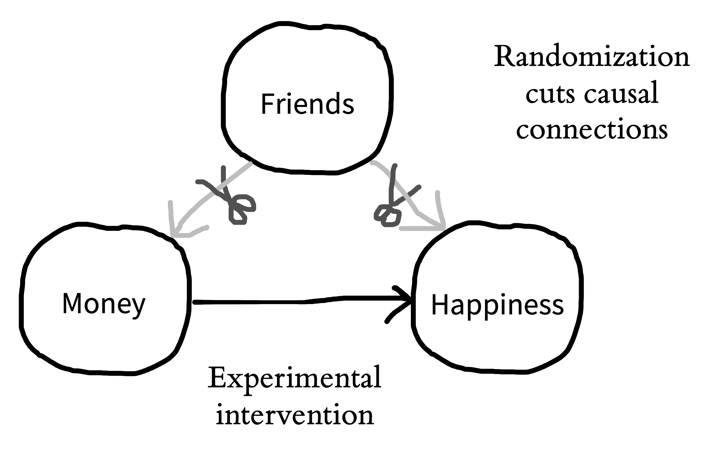
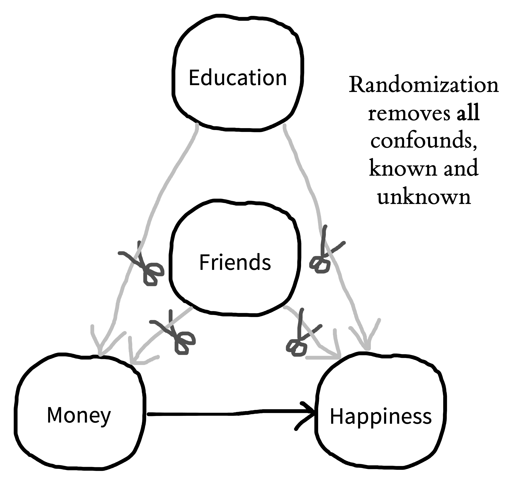

# (PART) Foundations {-}

# Experiments {#experiments}

::: {.box data-box="learning_goals"}
* Define what an experiment is
* Contrast observational and experimental studies using causal graphs
* Understand the role of randomization in experiments 
* Consider constraints on the generalizability of experiments
:::

Welcome to Experimentology! This is a book all about the art of running experiments in psychology. Throughout, we will be guided by a simple idea: 

> The purpose of experiments is to estimate the magnitude of causal effects.^[Perhaps you're already saying, "that's not what I thought experiments were for! I thought they were for testing hypotheses." Bear with us and we hope we'll convince you that our definition is a bit more general, and that testing a hypothesis is one thing you can do with a measurement.]   

\noindent Starting from our core idea, we’ll provide advice about how to navigate things like experimental design, measurement, sampling, and more. Our decisions about each of these will determine how precise our estimate is, and whether it is subject to bias. But before we get to those topics, let's start by thinking about *why* we might do an experiment.

## Observational studies don't reveal causality

If you’re reading this book, there’s probably something about psychology you want to understand. How is language learned? How is it that we experience emotions like happiness and sadness? Why do humans sometimes work together and other times destroy one another? When psychologists study these centuries-old questions, they often transform them into questions about **causality**.^[Defining causality is one of the trickiest and oldest problems in philosophy, and we won't attempt to solve it here! But from a psychological perspective, we're fond of @lewis1973's "counterfactual" analysis of causality. On this view, we can understand the claim that *money causes happiness* by considering a scenario where if people *hadn't* been given more money, they *wouldn't* have experienced an increase in happiness.]

### Describing causal relationships

```{r experiments-money1, fig.margin=TRUE, fig.cap="The hypothesized causal effect of money on happiness."}
knitr::include_graphics("images/experiments/money1-drawing.png")
```
Consider the age-old question: does money make people happy? This question is -- at its heart -- a question about what interventions on the world we can make. Can I get more money and make myself happier? Can I *cause* happiness with money?

How could we test our hypothesized effect of money on happiness? Intuitively, many people think of running an **observational study**. We might survey people about how much money they make and how happy they are. The result of this study would be a pair of measurements for each participant: [money, happiness].

Now, imagine your observational study found that money and happiness were related -- statistically **correlated** with one another: people with more money tended to be happier. Can we conclude that money causes happiness? Not necessarily. The presence of a correlation does not mean that there is a causal relationship! 

Let's get a bit more precise about our causal hypothesis. To illustrate causal relationships, we can use a tool called **directed acyclic graphs** [DAGs; @pearl1998]. Figure \@ref(fig:experiments-money1) shows an example of a DAG for money and happiness: the arrow represents our idea about the potential causal link between two variables: money and happiness.^[In this chapter, we're going to use the term "variables" without discussing why we study some variables and not others. In the next chapter, we'll introduce the term "construct," which indicates a psychological entity that we want to theorize about.] The direction of the arrow tells us which way we hypothesize that the causal relationship goes. 

The correlation between money and happiness we saw in our observational study is consistent with the causal model in Figure \@ref(fig:experiments-money1); however, it is also consistent with several alternative causal models, which we will illustrate with DAGs below.

### The problems of directionality and confounding 

```{r experiments-money2, fig.margin=TRUE, fig.cap="Three reasons why money and happiness can be correlated."}
knitr::include_graphics("images/experiments/money2-drawing.png")
```

Figure \@ref(fig:experiments-money2)) uses DAGs to illustrate several causal models that are consistent with the observed correlation between money and happiness. DAG #1 represents our hypothesized relationship -- money causes people to be happy. But DAG #2 shows an effect in completely the opposite direction! In this DAG, being happy causes people to make more money. 

Even more puzzling, there could be a correlation, but no causal relationship between money and happiness in either direction. Instead, a third variable -- often referred to as a **confound** -- may be causing increases in both money and happiness. For example, maybe having more friends causes people to both be happier and make more money (DAG #3). In this scenario, happiness and money would be correlated even though one does not cause the other. 

A confound (or several) may entirely explain the relationship between two variables (as in DAG #3); but it can also just *partly* explain the relationship. For example, it could be that money does increase happiness, but the causal effect is rather small, and only accounts for a small portion of the observed correlation between them, with the friendship confound (and perhaps others) accounting for the remainder.

In this case, because of the confounds, we say that the observed correlation between money and happiness is a **biased** estimate of the causal effect of money on happiness. The amount of bias introduced by the confounds can vary in different scenarios -- it may only be small, or it may be so strong that we conclude there's a causal relationship between two variables when there isn't one at all.

The state of affairs summarized in Figure \@ref(fig:experiments-money2) is why we say "correlation doesn't imply causation." A correlation between two variables *is consistent with* a causal relationship between them, but it's also consistent with other relationships as well.^[People sometimes ask whether *causation implies correlation* (the opposite direction). The short answer is "also no." A causal relationship between two variables often means that they will be correlated in the data, but not always. For example, imagine you measured the speed of a car and the pressure on the gas pedal / accelerator. In general, pressure and speed will be correlated, consistent with the causal relationship between the two. But now imagine you only measured these two variables when someone was driving the car up a hill -- now the speed would be constant, but the pressure might be increasing, reflecting the driver's attempts to keep their speed up. So there would be no correlation between the two variables in that dataset, despite the continued causal relationship.]

You can still learn about causal relationships from observational studies, but you have to take a more sophisticated approach. You can't just measure correlations and leap to causal conclusions. The "causal revolution" in the social sciences has been fueled by the development of statistical methods for reasoning about causal relationships from observational datasets.^[In fact, DAGs are one of the key tools that social scientists use to reason about causal relationships. DAGs guide the creation of statistical models to estimate particular causal effects from observational data. We won't talk about these methods here, but if you're interested, check out the suggested readings at the end of this chapter.] As interesting as these methods are, however, they are only applicable in certain specific circumstances. In contrast, the experimental method *always* works (though of course there are certain experiments that we can't do for ethical or practical reasons). 

## Experiments help us answer causal questions

Imagine that you (a) created an exact replica of our world, (b) gave \$1,000 to everybody in the replica world, and then (c) found a few years later that everyone in the replica world was happier than their matched self in the original world. This experiment would provide strong evidence that money makes people happier. Let's think through why.

Consider a particular person -- if they are happier in the replica vs. original world, what could explain that difference? Since we have replicated the world exactly, but made only one change -- money -- then that change is the only factor that could explain the difference in happiness. We can say that we **held all variables constant** except for money, which we **manipulated** experimentally, observing its effect on some **measure** -- happiness. This idea -- holding all variables constant except for the specific experimental manipulation -- is the basic logic that underpins the experimental method [as articulated by @mill1859].^[Another way to reason about why we can infer causality here follows the counterfactual logic we described in an earlier footnote. If the definition of causality is counterfactual ("what would have happened if the cause had been different"), then this experiment fulfills that definition. In our impossible experiment, we can literally *see* the counterfactual: if the person had \$1,000 more, here's how much happier they would be!] 

```{r experiments-money3, fig.margin=TRUE, fig.cap="In principle, experiments allows us to \"snip away\" the friend confound by holding it constant (though in practice, it can be tough to figure out how to hold something constant when you are talking about people as your unit of study)."}

```

Let's think back to our observational study of money and happiness. One big causal inference problem was the presence of "third variable" confounds like having more friends. More friends could cause you to have more money and also cause you to be happier. The idea of an experiment is to hold everything else constant -- including the number of friends that people have -- so we can measure the effect of money on happiness. By holding number of friends constant, we would be severing the causal links between friends and both money and happiness. This move is graphically conveyed in the DAG in Figure \@ref(fig:experiments-money3), where we "snip away" the friend confound.

### We can't hold people constant

This all sounds great in theory, you might be thinking, but we can't actually create replica worlds where everything is held constant, so how do we run experiments in the real world? If we were talking about experiments on baking cakes, it's easy to see how we could hold all of the ingredients constant and just vary one thing, like baking temperature. Doing so would allow us to conduct an experimental test of the effect of baking temperature. But how we can "hold something constant" when we're talking about people? People aren't cakes. No two people are alike and, as every parent with multiple children knows, even if you try to "hold the ingredients constant" they don't come out the same! 

If we take two people and give one of them money, we are often comparing two *different* people, not two instances of the same person with everything held constant. It wouldn't work to *make* the first person have more or fewer friends so they match the second person -- that's not holding anything constant, instead it's another (big, difficult, and potentially unethical) intervention that might itself cause lots of effects on happiness. 

You may be wondering: why don’t we just ask people how many friends they have and use this information to split them into equal groups? You could do that, but this kind of strategy only allows you to control for the confounds you know of. For example, you may split people equally based on their number of friends, but not their education attainment. If educational attainment also impacts both money and happiness, you still have a confound. You may then try to split people by both their number of friends and their education. But perhaps there’s another confound you’ve missed: sleep quality! Similarly, it also doesn't work to select people who have the same number of friends -- that only holds the friends variable constant and not everything *else* that's different between the two people. So what do we do instead?^[Many researchers who have seen regression models used in the social sciences assume that "controlling for lots of stuff" is a good way to improve causal inference. Not so! In fact, inappropriately controlling for a variable in the absence of a clear causal justification can actually make your effect estimate *more* biased [@wysocki2022].]

### Randomization saves the day

The answer is **randomization**. If you randomly split a large roomful of people into two groups, the groups will, on average, have a similar number of friends. Similarly, if you randomly pick who in your experiment gets to receive money, you will find that the money and no-money groups, on average, have a similar number of friends. In other words, through randomization, the confounding role of friends is controlled. But the most important thing is that it's not *just* the role of friends that's controlled; educational attainment, sleep quality, and all the other confounds are controlled as well. If you randomly split a large group of people into groups, the groups will, on average, be equal in every way (Figure \@ref(fig:experiments-money4)).

```{r experiments-money4, fig.margin=TRUE, fig.cap="If you randomly split a large group of people into groups, the groups will, on average, be equal in every way."}

```

So, here's our simple experimental design: we randomly assign some people to a money group and some people to a no-money control group! Then we measure happiness. The basic logic of randomization is that, if money causes happiness, we should see more happiness -- on average -- in the money group.^[You may already be protesting that this experiment could be done better. Maybe we could measure happiness before and after randomization, to increase precision. Maybe we need to give a small amount of money to participants in the control condition to make sure that participants in both conditions interact with an experimenter and hence that the conditions are as similar as possible. We agree! These are important parts of experimental design, and we'll touch on them in subsequent chapters.]

Randomization is a powerful tool, but there is a caveat: it doesn’t work every time. *On average*, randomization will ensure that your money and no-money groups will be equal with respect to confounds like number of friends, education attainment, and sleep quality. But just as you can flip a coin and sometimes get heads 9 out of 10 times, sometimes you use randomization and still get more highly-educated people in one condition than the other. When you randomize, you guarantee that, on average, all confounds are controlled. Hence, there is no systematic bias in your estimate from these confounds. But there will stil be some noise from random variation.


::: {.box data-box="depth" data-title="Unhappy randomization?"}
As we've been discussing, random assignment removes confounding by ensuring that -- on average -- groups are equivalent with respect to all of their characteristics. Equivalence for any *particular* random assignment is more likely the larger your sample is, however. Any individual experiment may be affected by **unhappy randomization**, when a particular confound is unbalanced between groups by chance. 

Unhappy randomization is much more common in small experiments than larger ones. To see why, we use a technique called **simulation**. In simulations, we invent data randomly following a set of assumptions: we make up a group of participants and generate their characteristics and their condition assignments. By varying the assumptions we use, we can investigate how particular choices might change the structure of the data. 

To look at unhappy randomization, we created many simulated versions of our money-happiness experiment, in which an experimental group receives money and the control group receives none, and then happiness is measured for both groups. We assume that each participant has a set number of friends, and that the more friends they have, the happier they are. So when we randomly assign them to experimental and control groups, we run the risk of unhappy randomization -- sometimes one group will have substantially more friends than the other. 

```{r experiments-randomization, fig.width=5.5, fig.height=4.5, fig.cap="Simulated data from our money-happiness experiment. Each dot represents the measured happiness effect (vertical position) for an experiment with a set number of participants in each group (horizontal position). Dot color shows how uneven friendship is between the groups. The dashed line shows the true effect.", boxfigure=TRUE}
set.seed(40)
n_sims <- 100

happiness_data <- expand_grid(n_per_group = c(1, 3,10,30,100,300,1000,3000), 
                              sim_num = 1:n_sims) |>
  rowwise() |>
  mutate(condition = list(c(rep("experimental", n_per_group),
                            rep("control", n_per_group))),
         friends = list(rpois(n_per_group * 2, 5)),
         happiness = list(rnorm(n_per_group * 2) + .3 * friends + 
           as.numeric(as.factor(condition)))) |>
  unnest(cols = c(condition, friends, happiness)) |>
  group_by(n_per_group, sim_num, condition) |>
  summarise(happiness = mean(happiness), 
            friends = mean(friends)) |>
  summarise(effect = diff(happiness), 
            friend_asym = friends[1]/friends[2])

ggplot(happiness_data, 
       aes(x = n_per_group, y = effect, col = log(friend_asym))) + 
  geom_jitter(width = .05) + 
  scale_x_log10() + 
  geom_hline(yintercept = 0, lty = 3) +
  geom_hline(yintercept = 1, lty = 2) +
  viridis::scale_color_viridis(name = "Asymmetry in number of friends (log ratio)") + 
  xlab("N per group") + 
  ylab("Happiness (experimental - control)") +
  theme(legend.position = "bottom")
```

Figure \@ref(fig:experiments-randomization) shows the results of this simulation. Each dot is an experiment, representing one estimate of the happiness effect (how much happiness is gained for the amount of money given to the experimental group). For very small experiments (e.g., with 1 or 3 participants per group), dots are very far from the dashed line showing the true effect -- meaning these estimates are extremely noisy! And the reason is unhappy randomization. The upper and lower points are those in which one group had far more friends than the other.

There are three things to notice about this simulation, however. First, the noise overall goes down as the sample sizes get bigger: larger experiments yield estimates closer to the true effect. Second, the unhappy randomization decreases dramatically as well with larger samples. Although individuals still differ just as much in large experiments, the *group* average number of friends is virtually identical for each condition in the largest groups. 

Finally, although the small experiments are individually very noisy, the *average effect* across all of the small experiments is still very close to the true effect. This last point illustrates what we mean when we say that randomized experiments remove confounds. Even though friendship is still an important factor determining happiness in our simulation, the average effect across experiments is correct and each individual estimate is unbiased.
:::

In sum, randomization is a remarkably simple and effective way of holding everything constant besides a manipulated variable. In doing so, randomization allows experimental psychologists to make unbiased estimates of causal relationships. Importantly, randomization works both when you do have control of every aspect of the experiment -- like when you are baking a cake -- and even when you don't -- like when you are doing experiments with people. 


## Generalizability 

When we are asking questions about psychology, it’s important to think about who we are trying to study. Do we want to know if money increases happiness in *all people*? In people who live in materialistic societies? In people whose basic needs are not being met? We call the group we are trying to study our **population of interest**, and the people who actually participate in our experiment our **sample**. 

Sometimes researchers take a sample from one population, but make a claim about another, usually broader, population. For example, they may run their experiment with a particular sample of U.S. college students, but then generalize to all people (their intended population of interest).^[Unfortunately, psychologists pervasively assume that research on U.S. and European samples generalizes to the rest of the world, and it often does not. To highlight this issue, @henrich2010 coined the acronym WEIRD. This catchy name describes the oddness of making generalizations about all of humanity from experiments on a sample that is quite unusual because it is Western, Educated, Industrialized, Rich, and Democratic. Henrich and colleagues argue that seemingly "fundamental" psychological functions like visual perception, spatial cognition, and social reasoning all differ pervasively across populations -- hence, any generalization from an effect estimated with a WEIRD sub-population may be unwarranted.] The mismatch of sample and population is not always a problem, but quite often causal relationships are different for different populations. 

In the early 2000’s, researchers found that gratitude interventions -- like writing a brief essay about something nice that somebody did for you -- increased happiness in studies conducted in Western countries. Based on these findings, some psychologists believed that gratitude interventions could increase happiness in all people. But it seems they were wrong. A few years later, @layous2013culture ran a gratitude experiment in two locations: the U.S. and South Korea. Surprisingly, the gratitude intervention decreased happiness in the South Korean sample. The researchers attributed this negative effect to feelings of indebtedness that people in South Korea more prominently experienced when reflecting on gratitude. In this example, we would say that the findings obtained with the U.S. sample may not **generalize** to people in South Korea. 

Issues of generalizability extend to all aspects of an experiment, not just its sample. For example, even if our hypothetical cash intervention experiment resulted in gains in happiness, we might not be warranted in generalizing to different ways of providing money. Perhaps there was something special about the amount of money we gave or the way we provided it that led to the effect we observed. Without testing multiple different intervention types, we can't make a broad claim. As we'll see in Chapters \@ref(models) and \@ref(design), this issue has consequences for both our statistical analyses and our experimental designs [@yarkoni2020].

Questions of generalizability are pervasive, but the first step is to simply acknowledge and reason about them. Perhaps all papers should have a Constraints on Generality statement, where researchers discuss whether they expect their findings to generalize across different samples, experimental stimuli, procedures, and historical and temporal features [@simons2017]. This kind of statement would at least remind researchers to be humble: experiments are a powerful tool for understanding how the world works, but there are limits to what any individual experiment can teach us. 

## Anatomy of a randomized experiment

Now is a good time for us to go back and consolidate the anatomy of an experiment, since this anatomy is used throughout the book. Figure \@ref(fig:experiments-anatomy) shows a simple two-group experiment like our possible money-happiness intervention. A sample is taken from a larger population, and then participants in the sample are randomly assigned to one of two conditions (the manipulation) -- either the experimental condition, in which money is provided, or the control condition, in which none is given. Then an outcome measure -- happiness -- is recorded for each participant. 

```{r experiments-anatomy, fig.margin=FALSE, fig.cap="Anatomy of a randomized experiment.", out.width = "75%"}
knitr::include_graphics("images/experiments/anatomy.png")
```

We'll have a lot more to say about all of these components in subsequent chapters. We'll discuss measures in Chapter \@ref(measurement), because good measurement is the foundation of a good experiment. Then in Chapter \@ref(design) we'll discuss the different kinds of experimental designs that are possible and their pros and cons. Finally, we'll cover the process of sampling in Chapter \@ref(sampling). 

## Chapter summary: Experiments

In this chapter, we defined an experiment as a combination of a manipulation and a measure. When combined with randomization, experiments allow us to make strong causal inferences, even when we are studying people (who are hard to hold constant). Nonetheless, there are limits to the power of experiments: there are always constraints on the sample, experimental stimuli, and procedure that limit how broadly we can generalize. 

::: {.box data-box="discussion_questions"}
1. Imagine that you run a survey and find that people who spend more time playing violent video games tend to be more aggressive (i.e., that there is a positive correlation between violent video games and aggression). Following Figure \@ref(fig:experiments-money2), list three reasons why these variables may be correlated.

2. Suppose you wanted to run an experiment testing whether playing violent video games causes increases in aggression. What would be your manipulation and what would be your measure? How would you deal with potential confounding by variables like age?

3. Consider an experiment designed to test people's food preferences. The experimenter randomly assigns 30 U.S. preschoolers to be served either asparagus or chicken tenders and then asks them how much they enjoyed their meal. Overall, children enjoyed the meat more; the experimenter writes a paper claiming that humans prefer meat over vegetables. List some constraints on the generalizability of this study. In light of these constraints, is this study (or some modification) worth doing at all? 
::: 

::: {.box data-box="readings"}
* A basic introduction to causal inference from a social science perspective: Huntington-Klein, N. (2022). *The Effect: An Introduction to Research Design and Causality.* Chapman & Hall. Available free online at <https://theeffectbook.net>.

* A slightly more advanced treatment, focusing primarily on econometrics: Cunningham, S. (2021). *Causal Inference: The Mixtape.* Yale Press. Available free online at <https://mixtape.scunning.com>.
:::
