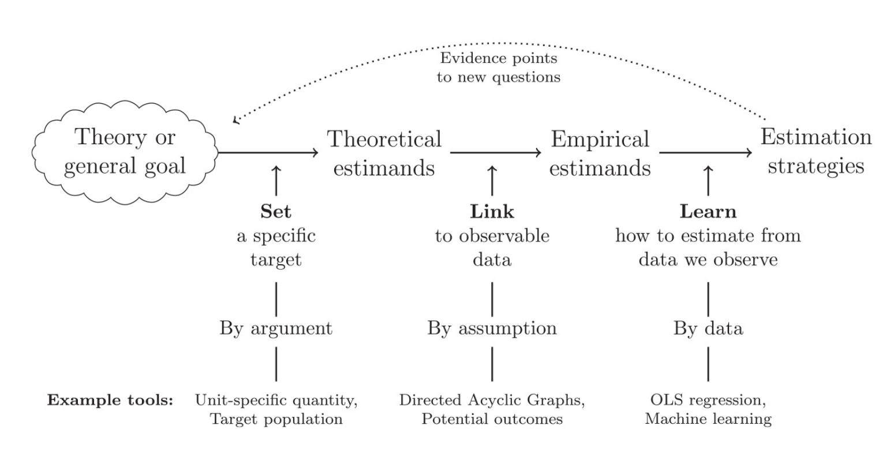

# Theories {#theories}

::: {.box .learning_goals}
* Explore the role of theory in synthesizing observations
* Contrast different philosophical views on scientific theories
* Analyze features of an experiment that can lead to weaker or stronger tests of theory
:::

When you do an experiment, sometimes you just want to see what happens, like a kid knocking down a tower. And sometimes you want to know the answer to a specific applied question, like "will giving a midterm vs. weekly quizzes lead students in a class to perform better on the final." But more often, our goal is to create  **theories** that help us explain and predict new observations. 

What is a theory? We'll argue here that we should think of psychological theories as **causal hypotheses** -- that is, hypotheses about the causal structure of the mind and about the causal relationships between the mind and the world. Theories typically make testable predictions about specific observations. One big role for experiments is in testing theories: measuring particular effects so we can distinguish between theories that include these effects and those that don't. 

This definition sounds a bit more specific than some of what gets called theory in psychology. We distinguish theories in the causal sense from **frameworks** -- broad sets of ideas that guide research but don't make specific contact with particular empirical observations.  

We begin this chapter by talking about the specific enterprise of constructing psychological theories. We'll then discuss how theories make contact with experiments, reviewing a bit of the history of philosophy of science. We next introduce formal and statistical models, which are playing an increasing role in modern psychology as a way of expressing theories. We end by using some of these ideas to discuss how specific experiments can make them better or worse tests of a theory. 

But, as we'll do in most chapters in the book, we'll begin with a case study: in this case, an influential theory of generalization.

::: {.box .case_study}
(TITLE) A universal law of generalization?

How do you take what you know and apply it to a new situation? One answer is that you use the same answer that has worked in similar situations -- but to do this kind of extrapolation, you need a notion of similarity. Early learning theorists tried to measure similarity in experiments with both human and non-human animals. For example, they might condition an association between a stimulus -- say a projected circle of light of a particular size -- and a food reward. After the animal learned this association, they would test generalization by showing circles of different sizes and measuring the strength of the animal's expectation for a reward. These experiments yielded generalization curves: the more similar the stimulus, the more the animals would give the same response, signaling generalization. 

@shepard1987 was interested in unifying the results of these different experiments. The first step in this process was establishing a **stimulus space**. He used a procedure called "multidimensional scaling" to infer how close each stimulus was to each other on the basis of how strong the generalization between the two of them was. When he plotted the strength of the generalization by the distance between stimuli within this space (their similarity), he found the incredibly consistent pattern shown in Figure \@ref(fig:theory-shepard). 


```{r theory-shepard, fig.cap="Figure 1 from Shepard (1987). Generalization gradients for twelve diffent kinds of stimuli.", fig.margin=TRUE}
knitr::include_graphics("images/theory/shepard1987.png")
```

Working backwards from this pattern, Shepard mathematically derived the exponential form of the curves shown in Figure \@ref(fig:theory-shepard), claiming that this described a "universal law" that governed the relationship between similarity and generalization for almost any stimulus, whether it was the size of circles, the color of patches of light, or the similarity between speech sounds. Later work has even extended this same framework to highly abstract dimensions such as the relationships between numbers of different types (e.g., being even, being powers of 2, etc.) [@tenenbaum2000]. 

The pattern shown in Shepard's work is an example of **inductive theory building**. In the vocabulary we're developing, Shepard ran (or obtained the data from) **randomized experiments** in which the **manipulation** was stimulus dimension (e.g., circle size) and the **measure** was an explicit similarity judgment (e.g., how similar is this circle to that one). Then the theory that Shepard proposes links two **constructs** -- latent entities whose relationships the theory specifies: 1) similarity between stimuli and 2) generalization strength. 

Shepard wrote in the conclusion of his 1987 paper, "Possibly, behind the diverse behaviors of humans and animals, as behind the various motions of planets and stars, we may discern the operation of universal laws." While Shepard's dream is an ambitious one, it defines one potential ideal for psychological theorizing. In our discussion below, we'll look at the broader goals of theory building and how theories can be evaluated.
:::


## What makes a psychological theory?

A psychological theory is a set of proposed causal relationships among different **constructs**. We'll discuss the constructs first and then the relationships between them. 

### Psychological constructs 

Constructs are the variables that we want our theory to describe, like "money", "happiness", "similarity", or "generalization strength." These entities can be in the mind of individuals or in the world, and they are the entities whose relationships and dynamics we want to describe. 

The creation of constructs is itself an important part of making a theory. In Shepard's work, one of the big contributions was the development of the construct of similarity -- that data could be used to describe the psychological distance between any pair of stimuli. Since we can't directly observe the workings of the human mind, for many psychological problems, defining the constructs is already difficult.^[Occasionally, defining a single construct is enough to create a theory. *g* (general intelligence) is the classic psychological example of a single-construct theory. The idea behind *g* theory is that the best measure of general intelligence is the shared variance between a wide variety of different tests. The decision to theorize about and measure a single unified construct for intelligence -- rather than say, many different separate kinds of intelligence -- is itself a controversial move.]

Since constructs are not observed directly, to connect our theories to data, our constructs need to be **operationalized**. Operationalization is the process of turning constructs into specific measures (e.g., a survey about happiness) or manipulations (e.g., a gift of some amount of money). We'll have a lot to say about how this is done in Chapters \@ref(measurement) and \@ref(design). 

### The "nomological network" 

Constructs gain their meaning in part via their causal relationships to other constructs. For example, in Shepard's theory, while *similarity* and *generalization* were the two key constructs, the substantive part of the theory was the specific quantitative link between the two that he posited.

This web of constructs and assumptions is what @cronbach1955 referred to as a **nomological network** -- a set of proposals about how different entities are connected to one another. This idea is illustrated by the philosopher of science @hempel1952, who wrote that:

> A scientific theory might... be likened to a complex spatial network: Its terms are represented by the knots, while the threads connecting the latter correspond, in part, to the definitions and, in part to the fundamental and derivative hypotheses included in the theory. The whole system floats, as it were, above the plane of observation and is anchored to it by rules of interpretation.These might be viewed as strings which are not part of the network but link certain points of the latter with specific places in the plane of observation. By virtue of those interpretive connections, the network can function as a scientific theory: From certain observational data, we may ascend, via an interpretive string, to some point in the theoretical network, thence proceed, via definitions and hypotheses, to other points, from which another interpretive string permits a descent to the plane of observation. (p. 36)

```{r theory-shepard-net, fig.cap="A causal model (\"nomological network\") for Shepard's universal law. Unobserved constructs are shaded gray.", fig.margin=TRUE}
knitr::include_graphics("images/theory/shepard_network3.png")
```

One way to sketch this kind of network would be to use the kind of causal graph we used above. So then a nomological network looks like a causal model linking a set of constructs to each other and also to a set of observable measuremens. Shepard's proposal about generalization could be drawn this way (Figure \@ref(fig:theory-shepard-net)), but notice that the arrow connecting distance and generalization is doing a lot of work! Shepard's proposal wasn't just that there was *some* causal link between these two constructs, but that this relationship had a very specific parametric form.^[Calling the theory a "network" sounds like it's a **structural equation model** (SEM) where there are circles and lines and the lines represent something akin to the correlations between the numbers in the circles. That's one way to define a psychological theory, but it's certainly not the only way!]


<!-- ```{r theory-estimand, fig.cap="A framework for how empirical measurements can be integrated into theories, from Lundberg et al., 2021."} -->
<!--  -->
<!-- ``` -->


Having a theory allows you to **explain** observed data and **predict** new data. Both of these are good things for a theory to do. One way to think about theory is that it provides a compression of potentially complex data into much a smaller set of general factors. Thus, a theory is doing its job if it allows you to say things like "factor A was responsible for effect B" (an explanation) or "if I reduce C, then our measure of D should go up." 

Shepard's theory is a good theory because it's both explanatory and predictive. It allows you to give explanations in response to questions like "why is generalization so much lower for shapes that are a bit further apart in psychological space" or broader questions like "why does psychological generalization have an exponential form." And it's predictive in that it suggests how generalization judgments should change in response to a particular manipulation of psychological distance. 

## Specific theories vs. general frameworks

You may be thinking at this point in the chapter, "psychology is full of theories but they don't look that much like the ones you're talking about!" Very few of the theories that bear that label in psychology are describe causal relationships linking explicitly defined constructs. 

Here's an example. @bronfenbrenner1992's ecological systems theory is pictured in Figure \@ref(fig:theory-bronfenbrenner). The key thesis of this theory is that children's development occurs in a set of nested contexts that each affect one another and in turn affect the child. This theory has been immensely influential. Yet if it's read as a causal theory, it's almost meaningless: everything connects to everything, across all levels of description -- very hard to figure out what kind of predictions it makes!

```{r theory-bronfenbrenner, fig.cap="Bronfenbrenner's ecological systems theory. (From SimplyPsychology.org).", fig.margin=TRUE}
knitr::include_graphics("images/theory/bronfenbrenner.png")
```

Ecological systems theory is not really a theory in the sense that we are talking about (and the same goes for many other very interesting ideas in psychology). It's not a testable group of assumptions that allow specific predictions about future observations. We think of these ideas as **frameworks**. They inspire theory without being theories themselves.

Frameworks are often incredibly important. Ideas like Bronfenbrenner's have inspired huge amounts of interesting research. They can also make a big difference to practice. Bronfenbrenner's ideas have shifted practice as well -- for example by supporting a more ecological model in social work [@ungar2002]. They are just one step more abstract than theories, and so they can't be connected with experiments as directly. 

## How do theories make contact with data? Popper's view

How do theories make contact with data? One view that resonates with many scientists is the philosopher Karl Popper's **falsificationism**. For Popper, a scientific theory is a set of statements about the world. These statements embody substantive hypotheses (like "receiving large sums of money makes you happier"). What makes such a statement a scientific hypothesis is that it is falsifiable, for example by an observation that contradicts it (a lottery winner who becomes depressed). 

On Popper's view, theories are never **confirmed**. The statements that made up his theories were universal statements. You could never prove them right; you could only fail to find falsifying evidence. Seeing hundreds of people get happier when they received money wouldn't prove that this statement was universally true; there could still be a counter-example around the corner. 

Popper's viewpoint is appealing. The logic of falsificationism resonates with many scientists, who view themselves as trying to make correct generalizations with increasing scope and then to subject these to increasingly stringent tests. 


On the other hand, it has a number of serious weaknesses that mean that it's not a great tool with which to analyze scientific practices (which is something we'd like to do here). Ideally our philosophy of science should give us a sense of what we are doing when we attempt to construct theories and do experiments.

Here are two 


<!-- We'll then discuss three critiques of this viewpoint: 1) the descriptive challenge posed by @kuhn1962, 2) the challenge of holism, and 3) questions about confirmation that come from modern Bayesian views.^[This is nowhere near a comprehensive introduction to this huge topic. Instead, we're just picking and choosing a couple of topics that help set up discussions we'll be having throughout the rest of the book. For a very readable introduction to the broader field, we recommend @godfrey-smith2009.]  -->

## Theories and data -- a modern viewpoint

**The descriptive challenge.** A highly influential critique of Popper (and other related viewpoints that treat scientific progress as making logical generalizations) comes from the sociological and historical work of @kuhn1962. Kuhn studied scientific revolutions and suggested that they looked nothing like the falsification of a clear generalization via an incontrovertible observation. Instead, Kuhn described scientists as mostly working within **paradigms**. These paradigms are sets of questions, assumptions, methods, phenomena, and explanatory hypotheses that together allow for activities Kuhn described as **normal science** -- that is, testing questions within the paradigm, explaining new observations or modifying theory to fit these paradigms. 

On Kuhn's view, normal science is punctuated by periods of **crisis** and and **revolution** when the working assumptions of the paradigm break down. This doesn't happen just because a single observation is inconsistent with the current set of assumptions (as falsification would suggest). Rather, there will often be a transition to a new paradigm that typically involves a striking success (such as the transition to a heliocentric viewpoint in astronomy). 

For Popper, subsequent theories necessarily contain better generalizations and have greater scope. For Kuhn, that's not necessarily true. Paradigms are **incommensurable** with one another. The new paradigm doesn't necessarily explain all the same things the old one did (or test its hypotheses via the same measures). This is often very disconcerting for scientists because they like the feeling that they are moving towards ever greater truth. 

On the other hand, in psychology, there are clear examples of paradigm shifts where the new paradigm does not subsume the old one. For example, behaviorist psychology produced a series of reliable generalizations about particular phenomena in animal learning (e.g., operant conditioning). The cognitive revolution that followed led to a transition in research topics, experimental methods, and theories, but the cognitivist theories did not typically provide an alternative account of conditioning behaviors. The sense in which behaviorism was overturned was that its scope was narrowed and fewer researchers focused on it as an account of other phenomena in language and mind.

The example of behaviorism is probably a relatively rare example of a true Kuhnian paradigm in psychology.^[If you are interested in a perspective on this paradigm shift, [here's a relevant essay](https://www.psychologicalscience.org/observer/what-happened-to-behaviorism).] Mostly we aren't thinking of the entire discipline changing at once. To deal with this more incremental change, @lakatos1976 defines the notion of **research programs** that are more like little paradigms that can run in parallel with one another. A research program is a set of hypotheses, phenomena, and methods that all cohere together and allow for progress in their explanatory and predictive scope. Psychology -- even experimental psychology -- to us looks more like it has a series of interconnected research programs than one big paradigm. When one research program seems like it's not going anywhere, researchers are free to jump ship to another more promising one. 
x
In sum, there's no one view on the processes of theory testing and revision. If we think of a theory as a posited set of causal relationships, then it's clear that we can't just put this theory in direct contact with evidence. We need to think about its scope of application (in terms of the phenomena and measures its meant to have scope over), as well as the auxiliary hypotheses that link it to specific observations and the alternative theories that we are comparing it to. 


<!-- ^[We might also want to add to the theory some assumptions about how these constructs ground out into measurements. Some philosophers of science distinguish between the "core" assumptions of a theory and the "periphery" -- and we might be tempted to say that specific measurements are peripheral. If we came up with a better measure of the construct, or it turned out that our measure wasn't particularly good, we could replace it without too much damage to the underlying theory.] -->


## Models and theories 

Say we have a set of constructs whose relationship we are interested in. How do we describe this relationship? There is no one single vocabulary for psychological theories. Some relationships are stated qualitatively via **verbal theories** while others are stated quantitatively in **formal theories**. 

Much of the psychology literature from Freud onward consists of verbal theories, including our Dylan Hypothesis. We could even elaborate this hypothesis into Dylan Theory, with some hypothesized mechanism such as "verbal processing resources" that might be exhausted by both listening and writing at the same time. The strength of verbal theories is that they can be expressed and communicated easily. But typically their predictions are at best qualitative in nature. In our discussion of the Dylan Hypothesis, we just expected writing skill to go down while listening, and so we would have accepted any decrement as evidence confirming our hypothesis. 

It's very hard to make a strong test of a theory that makes only qualitative predictions [@meehl1990]. For example, if we fail to see a decrement in writing skill while listening to Dylan, we can typically call on one of our auxiliary assumptions to salvage the issue. Because we have no quantitative expectations about how big a difference our auxiliary variables should make, it's quite plausible they could erase or even reverse our effect. Language is also vague and context sensitive [@grice1975]. While these are arguably positive features from a communication perspective, they can lead to disagreements about the interpretation of a theory unless substantial care is taken in its expression. 

The answer to these issues is to theorize using a framework such as a logical, mathematical, or statistical formalism. From a philosophical perspective, it's perhaps surprising that mathematics is so "unreasonably effective" as a vocabulary for the science [@wigner1990]. But some sort of formalism is necessary for a theory to make quantitative predictions. Indeed, there have been calls for greater formalization of theory in psychology for at least the last 50 years [@harris1976].^[Due to the recent suggestion that we are in a "theory crisis"  (e.g., that psychology lacks theory; cf. Chapter \@ref(replication)), recently there have been a spate of articles advocating for the development of formal theories throughout psychology [@oberauer2019;@smaldino2020].]

There is no one framework that will be right for theorizing across all areas of psychology. Mathematical theories like Shepard's have long been one tool that allows for precise and parametric statement of particular relationships. Yet stating such clear and general laws feels out of reach in many cases. If we had more Shepard-style theorists or theories, perhaps we'd be in a better place. Or perhaps such "universal laws" are simply out of reach for most of human behavior. 

An alternative approach creates and fits models of data that incorporate substantive assumptions about the structure of the data. The structural equation models we referred to above are one example of this approach, where linear regression -- in combination with some assumptions about which measurement is related to what -- is used to infer the strength of relationships. 

Models that start from data are what we use all the time for data analysis. The trouble is, we often don't interpret them as having substantive assumptions about the structure of the data, even when they do! For example, the choice of a linear regression implies a number of assumptions about how measurements are distributed and how they relate to your manipulation. For example, we could fit a simple regression model to our Dylan Hypothesis data, predicting writing skill as a function of condition. This model would yield a coefficient estimate estimating the effect of Dylan on writing skill. If we were drawing our theory, we could then put that estimate on the line between the two constructs.

This simple example raises all kinds of questions. What are the *units* of the relationship we're describing? How do we generalize this theory to other music beyond the Dylan album we used? How specific is our estimate to the writing task we used? Should we expect this estimate to hold for other populations. From our viewpoint, these sorts of questions are not distractions -- they are the critical work of moving from experiment to theory! If we declared success via observing $p<.05$ and moved on, we would not have avoided these questions but rather just ignored them.

Linear models in particular are ubiquitous in the social sciences because they are convenient to fit, but as theoretical models they are deeply impoverished. There is a lot you can do with a linear regression, but in the end, most interesting processes are not linear combinations of factors! In Chapter \@ref(models) we try to draw out this idea further, reconstruing common statistical tests as models that can be repurposed to express contentful scientific hypotheses while recognizing the limitations of their assumptions.

One of the strengths of modern cognitive science is that it provides a very rich set of tools for expressing more complex models. For example, the modern Bayesian cognitive modeling tradition grew out of work like Shepard's; in these models, a system of equations defines a probability distribution that can be used to estimate parameters, predict new data, or make other inferences [@probmods2]. And neural network models -- which are now fueling innovations in artificial intelligence --  have a long history of being used as substantive models of human psychology [@elman1996].

Computational or formal artifacts are not themselves psychological theories, but all of them can be used to create psychological theories via the mapping of constructs onto entities in the model and the use of the principles of the formalism to instantiate psychological hypotheses or assumptions. This book won't go into more details about routes to building computational theories, but if you are interested, we encourage you to explore these frameworks as a way to deepen your theoretical contributions and to sharpen your experimental choices.

## Theory testing in psychology

Say we have a theory like Shepard's universal law (or the Dylan Hypothesis). How should we go about putting it in contact with data? If we wanted to follow Popper's falsification strategy, we should simply go ahead and start deriving predictions from the theory, then checking to see if it is falsified. But without further guidance, this strategy might be pretty boring. In the classic example that's used in the philosophy literature, this is like going around checking each and every swan to see if all swans are white, just hoping to find a black swan to falsify your generalization. Maybe we don't know how to do better with swans but we do with scientific observations. 

The key insight of theory testing is that you should look for observations that are likely for your theory but unlikely for other theories. @meehl1978 calls these "risky tests": gambles where the theory could be wrong.^[Even if you're not a *falsificationist* like Popper, you can still think it's useful to try and falsify theories! Although holism is an important challenge, and so often a single observation is not perfectly probative, it's still a great research strategy to look for those observations that are most inconsistent with a particular theory.] There are four major ingredients of an informative test of theories: the precision of the measurement, the precision of the theoretical prediction, the flexibility of the theory, and the availability of other theoretical alternatives. 

These components together are not always discussed as thoroughly as they should be in psychological theories!^[Much of Meehl's writing is about the failures of theory testing in what he called "soft psychology." It's worth reading his litany of problems [@meehl1990], if only to understand what the hurdles are!] But you can see them all on display in the this schematic justification for an experiment: "We made a precise measurement of behavior in condition P because theory A predicts a specific result X in this condition, whereas theory B predicts Y." Let's discuss each of these pieces. 

First, if the experimental measurement is not precise, then it could be consistent with any number of results. Precision of measurement is a prerequisite for theory testing -- so much so that this type of precision is a major focus of the rest of the book! Many psychology experiments are designed merely to provide directional evidence and to "reject the null hypothesis" of no difference. This kind of evidence is often consistent with many different theories. 

Second, for a test to be "risky" for a theory, the theory needs to have a precise prediction that *could* be wrong. To take an example from Meehl, if your theory predicts that it's going to be rainy in April, seeing confirmation of that prediction is not very surprising or informative. The theory hasn't specified how rainy it should be, so it will be easy to claim many different observations are consistent. Only the most extreme dry weather will appear truly inconsistent. On the other hand, it would be very impressive to see confirmation of a theory that specified which days in April it was going to rain and how much rain fell on each of them. 

```{r fig.margin = TRUE, fig.cap = "A roulette wheel."}
knitr::include_graphics("images/theory/roulette.png")
```

One way to think about theories is that they allow us to make *bets*. If we bet on a spin of the roulette wheel that it will show us red as opposed to black, we have almost a 50% chance of winning the bet. Winning such a bet is not impressive. But if we call a particular number, say 34, and win this bet, that is certainly riskier because we have a much smaller chance of being right.

Consider our running examples. The Dylan Hypothesis makes -- at best -- directional predictions about what should happen in a Dylan interference experiment. Seeing such predictions confirmed is not all that surprising, and hence winning this bet is not likely to be that impressive. On the other hand, Shepard's universal law makes much more specific predictions. Because it states the functional form of the generalization curve, all of the measurements that deviate from that curve more than their measurement error will be inconsistent. Much riskier, and hence much more impressive.

The third ingredient to the risky test idea is that the theory must not be so flexible as to be able to "predict" any data. This issue comes up most commonly when theories are used to "post-dict" data -- that is, to explain them after the fact. It would obviously be ridiculous to say after the fact that those 14 days were precisely the days we thought it would rain in April. That's one reason why we think of preregistrations as a type of bet, where you write down what you think will happen -- perhaps according to your theory -- before you conduct the experiment!

Verbal theories that do not have any formal or computational representation are at risk for this kind of flexibility. Especially when a theory predicts that multiple factors interact with one another, it's easy to say that one or the other was "dominant" in a particular situation. But the same issue can come up in computational theories as well. When a theory has many **free parameters** -- numerical choices that change its predictions and that can be fit to a particular dataset -- then it can often predict a wide range of possible datasets. This kind of flexibility reduces the risk of any particular experimental test, because the theorist can always say after the fact that the parameters were wrong but not the theory itself [@roberts2000]! 

The final ingredient of an informative experimental test of a theory is that there are other theories that do not predict the same thing! Imagine that we observe an effect of Dylan interference on writing quality. Before we declare victory for the Dylan hypothesis and start building our broader Dylan theory, we need to ask whether there are other hypotheses that also predict the same effects. For example, we might wonder whether models of phonological working memory would also predict inference [e.g., @baddeley1974]!

Going back to the idea of a Bayesian view of confirmation, the experiment that teaches us the most is going to be the one where the data are high probability according to one theory and low probability according to all others. We can use this idea try to figure out what the right experiment is by considering which specific experimental conditions derive differences between theories. In fact, this idea has a long history in statistics [@lindley1956] and now goes by the name **optimal experiment design** [@myung2013;@ouyang2018]. The idea is, if you have two or more quantitative models, you can evaluate their predictions across a lot of conditions and pick the most informative one. If your theories aren't as well-developed, this kind of formal analysis may not be possible, but the principle still holds. 

In sum, experiments are not design equal with respect to comparing theories. We should look for experiments that are "risky" and informative tests of theories -- precise measurements of cases where theories make strong predictions that contrast with one another.  

## Theories: Chapter summary

In this chapter, we defined an experiment as a combination of a manipulation and a measure. This combination, along with randomization, licenses strong causal inferences about the structure of the world. Because they provide strong evidence on causality, experiments have a privileged position in building theories, although there are many other sources of information that can help us along the way! 

We've presented theories here as static entities that are presented, tested, confirmed, and falsified. That's a simplification that doesn't take into account the ways that theories -- especially with formal models as their instantiation -- can be flexibly adjusted to accommodate new data [@navarro2019]. Lakatos's idea of research programs, which we referenced above, incorporates this flexibility. The idea is that the research program -- as a combination of core principles, auxiliary assumptions, and supporting empirical assumptions -- is constantly and slowly shifting. Then a productive research program is one where the core principles are being adjusted to describe a larger base of observations. This idea sounds right to us: in our experience, the best theories are always being enlarged and refined in response to new data. 


::: {.box .exercises}
1. Identify an influential theory in your field or sub-field. Can you draw the "nomological network" for it? What are the key constructs and how are the measured? Are the links between constructs well-specified? Or does this description of a theory not fit?
:::
