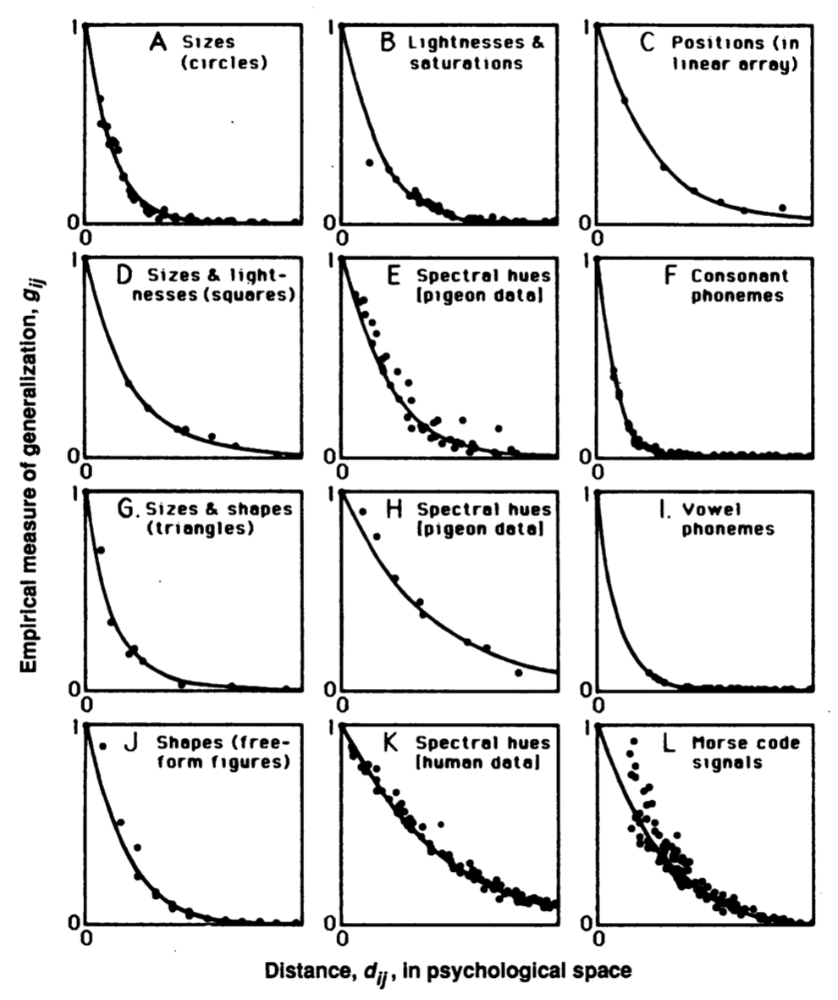
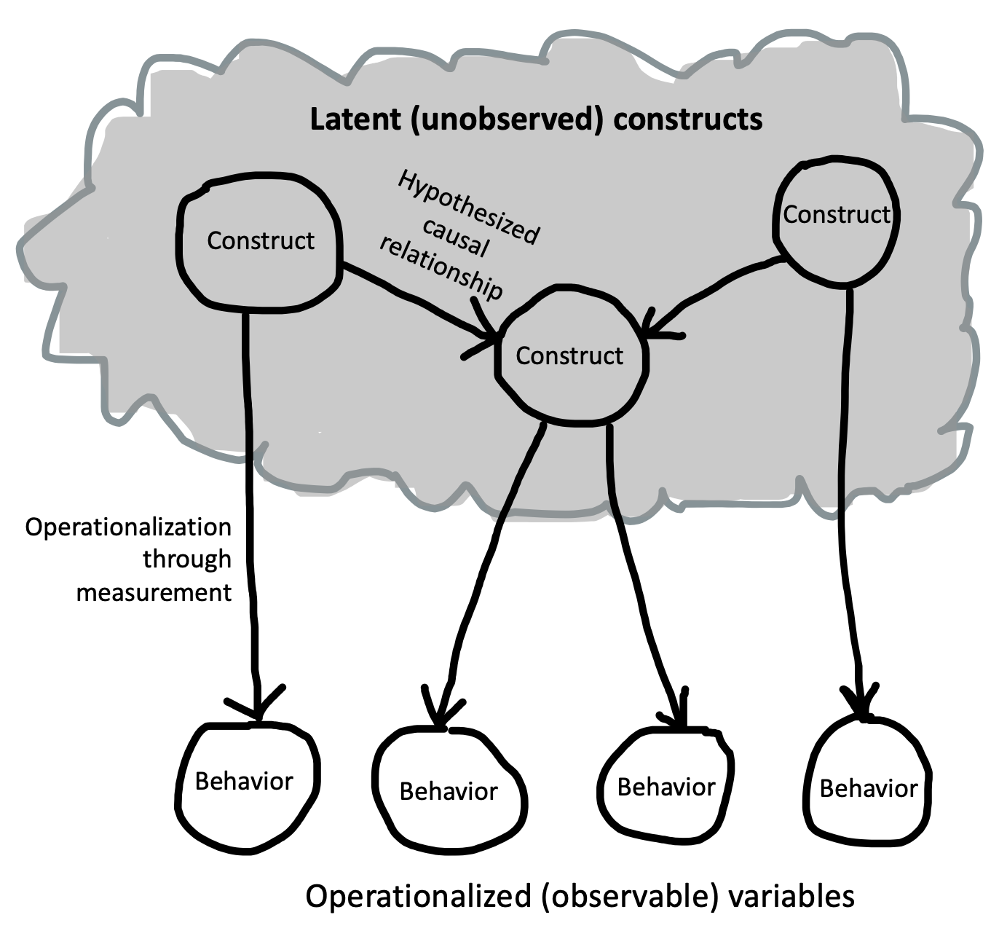
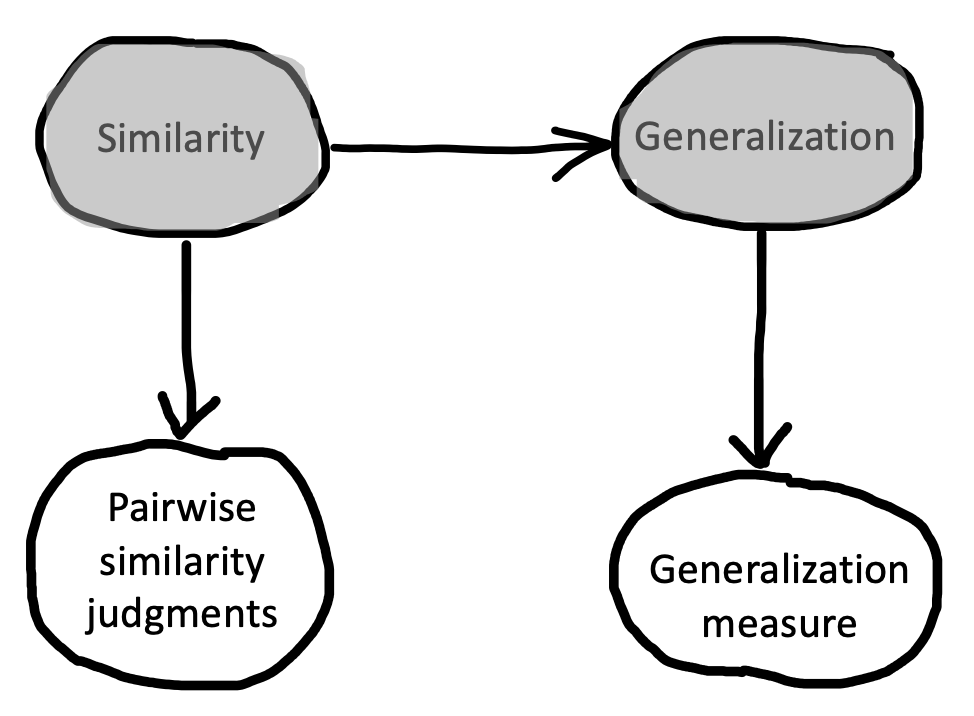
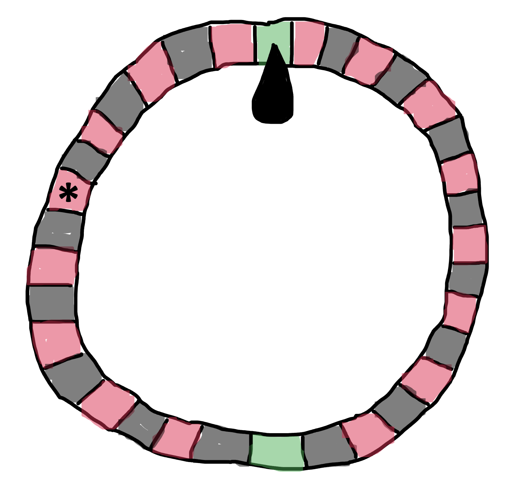

# Theories {#theories}

::: {.box .learning_goals}
* Define theories and their components
* Contrast different philosophical views on scientific theories
* Analyze features of an experiment that can lead to strong tests of theory
* Discuss the role of formalization in theory development
:::

When you do an experiment, sometimes you just want to see what happens, like a kid knocking down a tower made of blocks. And sometimes you want to know the answer to a specific applied question, like "will giving a midterm vs. weekly quizzes lead students in a class to perform better on the final?" But more often, our goal is to create  **theories** that help us explain and predict new observations. 

What is a theory? We'll argue here that we should think of psychological theories as **causal hypotheses** -- that is, hypotheses about the causal structure of the mind and about the causal relationships between the mind and the world. This definition sounds a bit more specific than some of what gets called theory in psychology. We describe the continuum between theories and **frameworks** -- broad sets of ideas that guide research but don't make specific contact with particular empirical observations.

We begin this chapter by talking about the specific enterprise of constructing psychological theories. We'll then discuss how theories make contact with experiments, reviewing a bit of the philosophy of science. We end by using some of these ideas to discuss how specific features of experiments can make them better or worse tests of a theory. As we'll do in most chapters in the book, we'll begin with a case study.

::: {.box .case_study}
(TITLE) A universal law of generalization?

How do you take what you know and apply it to a new situation? One answer is that you use the same answer that has worked in similar situations. To do this kind of extrapolation, however, you need a notion of similarity. Early learning theorists tried to measure similarity in experiments with both human and non-human animals. For example, they might create an association between a stimulus -- say a projected circle of light of a particular size -- and a food reward by repeatedly presenting them together. After the animal learned this association, they would test generalization by showing circles of different sizes and measuring the strength of the animal's expectation for a reward. These experiments yielded generalization curves: the more similar the stimulus, the more the animals would give the same response, signaling generalization. 

@shepard1987 was interested in unifying the results of these different experiments. The first step in this process was establishing a **stimulus space**. He used a procedure called "multidimensional scaling" to infer how close stimuli were to each other on the basis of how strong the generalization between them was. When he plotted the strength of the generalization by the distance between stimuli within this space (their similarity), he found the incredibly consistent pattern shown by the dots (the data) in Figure \@ref(fig:theory-shepard). 


```{r theory-shepard, fig.cap="Figure 1 from Shepard (1987). Generalization gradients for twelve different kinds of stimuli.", fig.margin=TRUE}

```

Working backwards from this pattern, Shepard mathematically derived the exponential form of the curves shown in Figure \@ref(fig:theory-shepard). He argued that this described a "universal law" that governed the relationship between similarity and generalization for almost any stimulus, whether it was the size of circles, the color of patches of light, or the similarity between speech sounds. Later work has even extended this same framework to highly abstract dimensions such as the relationships between numbers of different types [e.g., being even, being powers of 2, etc.; @tenenbaum2000]. 

The pattern shown in Shepard's work is an example of **inductive theory building**. In the vocabulary we're developing, Shepard ran (or obtained the data from) **randomized experiments** in which the **manipulation** was stimulus dimension (e.g., circle size) and the **measure** was an explicit similarity judgment (e.g., how similar is this circle to that one). Then the theory that Shepard proposed linked two **constructs** -- entities whose relationships the theory specifies: 1) similarity between stimuli and 2) generalization strength. 

Shepard wrote in the conclusion of his 1987 paper, "Possibly, behind the diverse behaviors of humans and animals, as behind the various motions of planets and stars, we may discern the operation of universal laws." While Shepard's dream is an ambitious one, it defines an ideal for psychological theorizing. 
:::


## What makes a psychological theory?


```{r theory-nomological-net, fig.cap="A schematic of what a theory might look like.", fig.margin=TRUE}

```

We've proposed that a psychological theory is a set of causal relationships among different **constructs**. Figure \@ref(fig:theory-nomological-net) shows a schematic  psychological theory. We'll discuss the constructs first and then the relationships between them. 

### Psychological constructs 

Constructs are the variables that we want our theory to describe, like "money", "happiness", "similarity", or "generalization strength." These entities can be in the mind of individuals or in the world, and they are the entities whose relationships and dynamics we want to describe. 

The creation of constructs is itself an important part of making a theory. In Shepard's work, one of the big contributions was the development of the construct of similarity -- that data could be used to describe the psychological distance between any pair of stimuli. Since we can't directly observe the workings of the human mind, for many psychological problems, defining the constructs is already difficult.^[Occasionally, defining a single construct is enough to create a theory. *g* (general intelligence) is the classic psychological example of a single-construct theory. The idea behind *g* theory is that the best measure of general intelligence is the shared variance between a wide variety of different tests. The decision to theorize about and measure a single unified construct for intelligence -- rather than say, many different separate kinds of intelligence -- is itself a controversial move.]

Since constructs are not observed directly, they need to be **operationalized**. Operationalization is the process of turning constructs into specific measures. For example, the construct "happiness" could be operationalized as self-reported happiness on a 1 (miserable) to 10 (elated) scale. A construct can also be operationalized through a manipulation: in our money-happiness example, we operationalized "more money" in our theory with a gift of a specific amount of cash. Operationalization is a huge part of the craft of being a psychology researcher -- taking a set of abstract constructs that you're interested in and turning them into a specific experiment with a manipulation and a measure that tests your causal theory. We'll have a lot more to say about how this is done in Chapters \@ref(measurement) and \@ref(design). 

### The "nomological network": relations between constructs

Constructs gain their meaning in part via their own definitions and operationalizations, but also in part through their causal relationships to other constructs. For example, in Shepard's theory (see Case Study), while *similarity* and *generalization* were the two key constructs, the substantive part of the theory was the specific quantitative link between the two that he posited.

This web of constructs and assumptions is what @cronbach1955 referred to as a **nomological network** -- a set of proposals about how different entities are connected to one another. @hempel1952, a philosopher of science, wrote that:

> A scientific theory might... be likened to a complex spatial network: Its terms are represented by the knots, while the threads connecting the latter correspond, in part, to the definitions and, in part to the fundamental and derivative hypotheses included in the theory. The whole system floats, as it were, above the plane of observation and is anchored to it by rules of interpretation.These might be viewed as strings which are not part of the network but link certain points of the latter with specific places in the plane of observation. By virtue of those interpretive connections, the network can function as a scientific theory: From certain observational data, we may ascend, via an interpretive string, to some point in the theoretical network, thence proceed, via definitions and hypotheses, to other points, from which another interpretive string permits a descent to the plane of observation. (p. 36)

```{r theory-shepard-net, fig.cap="A causal model (\"nomological network\") for Shepard's universal law. Unobserved constructs are shaded gray. Observed variables are white.", fig.margin=TRUE}

```

One way to sketch this kind of network would be to use the kind of causal graph we used above. So then a nomological network looks like a causal model linking a set of constructs to each other and also to a set of observable measurements. Shepard's proposal about generalization could be drawn this way (Figure \@ref(fig:theory-shepard-net)), but notice that the arrow connecting distance and generalization is doing a lot of work! Shepard's proposal wasn't just that there was *some* causal link between these two constructs, but that this relationship had a very specific parametric form.^[Calling the theory a "network" sounds like it's a **structural equation model** (SEM) where there are circles and lines and the lines represent something akin to the correlations between the numbers in the circles. That's one way to define a psychological theory, but it's certainly not the only way!] We'll talk more below about how formal or computational models can be used to instantiate theories.

One way to think about theory is that it provides a **compression** of potentially complex data into much a smaller set of general factors. If you have a long sequence of numbers, say [2 4 8 16 32 64 128 256 ...], then the expression $2^n$ serves as a compression of this sequence -- it's a short expression that tells you what numbers are in vs. out of the sequence. In the same way, a theory can compress a large set of observations (maybe data from many experiments) into a small set of relationships between constructs. Shepard's theory is a good theory because it compresses a lot of data from different experiments: it shows that seemingly different generalizations all actually follow the same form (the exponential in Figure \@ref(fig:theory-shepard)). 

Having a theory allows you to **explain** observed data and **predict** new data. Both of these are good things for a theory to do. Shepard's theory is both explanatory and predictive. It's explanatory because it answers questions like "why is generalization so much lower for shapes that are a bit further apart in psychological space?" and "why does psychological generalization have an exponential form?" And it's predictive because it suggests how new generalization judgments should change in response to a particular manipulation of psychological distance. Explanation is an important feature of good theories, but it's also easy to trick yourself by using a vague theory to explain a finding **post-hoc** (after the fact). Thus, the best test of a theory is typically a new prediction, as we discuss below.

## Specific theories vs. general frameworks

You may be thinking at this point in the chapter, "psychology is full of theories but they don't look that much like the ones you're talking about!" Very few of the theories that bear that label in psychology describe causal relationships linking clearly defined and operationalized constructs. 

Here's an example. @bronfenbrenner1992's ecological systems theory is pictured in Figure \@ref(fig:theory-bronfenbrenner). The key thesis of this theory is that children's development occurs in a set of nested contexts that each affect one another and in turn affect the child. This theory has been immensely influential. Yet if it's read as a causal theory, it's almost meaningless: everything connects to everything and the constructs are not operationalized -- its very hard to figure out what kind of predictions it makes!

```{r theory-bronfenbrenner, fig.cap="The diagram often used to represent Bronfenbrenner's ecological systems theory. Note that circles no longer denote discrete constructs; arrows can be interpreted as causal relationships, but all constructs are assumed to be fully connected.", fig.margin=TRUE}
knitr::include_graphics("images/theory/bronfenbrenner2.png")
```

Ecological systems theory is not really a theory in the sense that we are advocating for in this chapter (and the same goes for many other very interesting ideas in psychology). It's not a set of causal relationships between constructs that allow specific predictions about future observations. Ecological systems theory is instead a broad set of ideas about what sorts of theories are more likely to explain specific phenomena. We think  of these kinds of ideas as **frameworks**. They inspire theory without being theories themselves.

Frameworks are often incredibly important. Ideas like Bronfenbrenner's have inspired huge amounts of interesting research. They can also make a big difference to practice. Bronfenbrenner's ideas have shifted practice by supporting a more ecological model in social work, in which individuals' needs are considered not only as the expression of specific psychopathology but also as stemming from a set of overlapping contextual factors [@ungar2002]. 

There's a continuum between precisely specified theories and broad frameworks. Some theories propose interconnected constructs but don't specify the relationships between them, or don't specify how those constructs should be operationalized. So when you read a paper that says it proposes a "theory," it's a good idea to to ask whether it describes specific relations between operationalized constructs. If it doesn't that, it may be more of a framework than a theory.

::: {.box .ethical_considerations}
Strong theory development isn't just about knowledge for knowledge's sake -- it has implications for the technologies and policies built off the theories.

One case study comes from Edward Clarke's infamous theory regarding the deleterious effects of education for women [@clarke1884]. Clarke posited that (1) cognitive and reproductive processes relied on the same fixed pool of energy, (2) relative to men, women's reproductive processes required more energy, and that (3) expending too much energy on cognitive tasks like education depleted women of the energy needed to maintain a healthy reproductive system. Based on case studies, Clarke suggested that education was causing women to become ill, experience fertility issues, and birth weaker offspring. He thus concluded that "boys must study and work in a boy's way, and girls in a girl's way" (p. 18).

Clarke's work is a chilling example of the implication of a poorly-developed theory. In this scenario, Clarke had neither instruments that allowed him to measure his constructs or experiments to measure the causal connections between them. Instead, he merely highlighted case studies that were consistent with his idea (while simultaneously dismissing cases that were inconsistent). His ideas eventually lost favor -- especially as they were subjected to more rigorous tests. But by then, damage had been done. Clarke's arguments inspired fear, were used to attempt to dissuade women from pursuing higher education, and hindered educational policy reform.
:::

## How do theories make contact with data? Popper's view

Another key feature of a theory is that it makes contact with data. How does this process work? One historical view that resonates with many scientists is the philosopher Karl Popper's **falsificationism**. For Popper, a scientific theory is a set of hypotheses about the world. These hypotheses are claims like our Money->Happiness (M->H) hypothesis: "receiving money makes you happier". What makes a statement a scientific hypothesis is that it can be disproved (i.e., it is **falsifiable**) by an observation that contradicts it. For example, observing a lottery winner who immediately becomes depressed would falsify the hypothesis that receiving money makes you happier.

On Popper's view, theories are never **confirmed**. The hypotheses that made up his theories were universal statements. You could never prove them right; you could only fail to find falsifying evidence. Seeing hundreds of people get happier when they received money would not prove that the M->H hypothesis was universally true. There could always be a counter-example around the corner. 

Some aspects of Popper's theory are appealing, but others are not. Many scientists view themselves as trying to make hypotheses that have increasingly broad scope and then searching for evidence that falsifies them. But scientists also like to say that their evidence "supports" or "confirms" their theory, and Popper's falsificationism rejects this kind of talk. A falsificationist says that confirmation is an illusion; that the theory is simply surviving to be tested another day. This strict perspective is unpalatable to many scientists. After all, if we observe that hundreds of people get happier when they receive money, it seems like this should at least increase our confidence in the M->H hypothesis, even if such an observation cannot provide a definitive confirmation.

An alternative perspective comes from the Bayesian tradition that we'll learn more about in Chapters \@ref(estimation) and \@ref(inference). In a nutshell, Bayesians propose that our subjective belief in a particular hypothesis can be captured by a probability, and that our scientific reasoning can then be described by a process of normative probabilistic reasoning [@strevens2006]. The Bayesian scientist distributes probability across a wide range of alternative hypotheses; observations that are more consistent with a hypothesis increase the hypothesis's probability [@sprenger2019]. This view is both intuitively plausible and seems to match people's actual reasoning behaviour, as shown by a body of research that -- full circle! -- builds on Shepard's research on similarity and generalization [e.g., @tenenbaum2001]!

## Theories and data -- a holistic viewpoint

A second point that makes Popper's falsificationism a bad match for working scientists is the observation that no individual hypothesis (a part of a theory) can be falsified independently. Instead, a large series of what are called **auxiliary hypotheses** are usally necessary to link an observation to a theory [@lakatos1976]. In our running example, if giving someone money didn't change their happiness, maybe we wouldn't immediately throw out our M->H theory. Instead, the fault might be in any one of our auxiliary assumptions, like our measurement of happiness, or our choice of how much money to give or when to give it. The idea that individual parts of a theory can't be falsified independently is sometimes called **holism**.

One consequence of holism is that the relationship between data and theory isn't always straightforward. An unexpected observation may not cause us to give up on a main hypothesis in our theory -- but it will often cause us to question our auxiliary assumptions instead (e.g., how we operationalize our constructs). Thus, before abandoning our theory of money causing happiness, we might want to try several happiness questionnaires! 

The broader idea of holism is supported by historical and sociological studies of how science progresses, especially in the work of @kuhn1962. Examining  historical evidence, Kuhn found that scientific revolutions looked *nothing* like the falsification of a theoretical statement via an incontrovertible observation. Instead, Kuhn described scientists as mostly working within **paradigms**: sets of questions, assumptions, methods, phenomena, and explanatory hypotheses. 

Paradigms allow for activities Kuhn described as **normal science** -- that is, testing questions within the paradigm, explaining new observations or modifying theory to fit these paradigms. But normal science is punctuated by periods of **crisis** when the working assumptions of the paradigm break down. This doesn't happen just because a single observation is inconsistent with the current set of assumptions. Rather, there will often be a holistic transition to a new paradigm, typically because of a really striking explanatory or predictive success.

One controversial aspect of Kuhn's theory is that paradigms are described as being **incommensurable** with one another. The new paradigm doesn't necessarily explain all the same things the old one did (or test its hypotheses via the same measures). Although this idea can be disconcerting for some scientists, it does seem to describe some historical shifts in psychology. For example, behaviorist psychology produced a series of reliable generalizations about particular phenomena in animal learning (e.g., operant conditioning). The cognitive revolution that followed led to a transition in research topics, experimental methods, and theories. The cognitivist theories did not typically provide an alternative account of conditioning behaviors, however. Behaviorism as a whole wasn't falsified -- instead, researchers stopped thinking that it could explain everything about the human mind and moved on to theories that they thought were more promising.

The example of behaviorism is probably a relatively rare example of a true Kuhnian paradigm in psychology. Mostly we aren't thinking of the entire discipline changing at once. To deal with this more incremental change, @lakatos1976 defined the influential notion of **research programs** that are more like little paradigms that can run in parallel with one another. A research program is a set of hypotheses, phenomena, and methods that all cohere together and allow for progress in their explanatory and predictive scope. Psychology -- even experimental psychology -- to us looks more like it has a series of interconnected research programs than one big paradigm. When one research program seems like it's not going anywhere, researchers are free to jump ship to another more promising one.

In sum, the lesson of holism is: we can't just put our theories in direct contact with evidence and think that they will be supported or overturned. Instead, we need to think about the scope of our theory (in terms of the phenomena and measures it is meant explain), as well as the auxiliary hypotheses -- operationalizations -- that link it to specific observations.

## Theory testing in psychology

Say we have a theory like Shepard's universal law (or the M->H Hypothesis). How should we go about putting it in contact with data? If we wanted to follow Popper's falsification strategy, we should simply go ahead and start deriving predictions from the theory, then checking to see if any one of these is falsified. But without further guidance, this strategy is very inefficient. In a classic hypothetical example, a theorist thinks all swans are white and has to go around checking each and every swan's color, hoping to find a black swan to falsify this universal statement. 

Fortunately, we can do better for scientific hypotheses than we can for swans [@meehl1990]. Experiments are not equally good at comparing theories. We should design experiments that make precise measurements (1) of conditions where theories make risky predictions (2).  

### Measurements (and theories) need to be precise

Precision is a prerequisite for theory testing. If an experimental measurement in our sample is not precise, then it could be consistent with a wide results in our population of interest.  Many psychology experiments are designed merely to provide directional evidence and to "reject the null hypothesis" of no difference. Directional evidence is often consistent with many different theories. 

But it's not just the measurement that needs to be precise: the prediction must be precise as well. Much psychology consists of verbal theories. Verbal theories make only qualitative predictions, so it is hard to put them to strong tests where they could be convincingly shown to be wrong [@meehl1990]. In our discussion of money and happiness, we just expected happiness to go up as money increased. We would have accepted *any* increase in happiness (even if very small) as evidence confirming our hypothesis -- meaning fully a half of all possible changes in happiness would be evidence for our theory. Especially when a theory predicts that multiple factors interact with one another, it's easy to say that one or the other was "dominant" in a particular situation, meaning you can predict almost any direction of effect. 

Even when theories make numerical predictions, they can still be too flexible to be tested. When a theory has many **free parameters** -- numerical values that can be fit to a particular dataset, changing the theories predictions on a case-by-case basis -- then it can often predict a wide range of possible results. This kind of flexibility reduces the value of any particular experimental test, because the theorist can always say after the fact that the parameters were wrong but not the theory itself [@roberts2000]! 

One important way to remove this kind of flexibility is to make predictions in advance, holding all parameters constant. A preregistration is a great way to do this -- the experimenter derives predictions and specifies in advance how they will be compared to the results of the experiment. We'll talk much more about the process of preregistration in Chapter \@ref(prereg). 

### Theories should make risky predictions


```{r theory-roulette, fig.margin = TRUE, fig.cap = "A roulette wheel. Betting on red is not that risky, but betting all your chips on a particular value (*) is much riskier."}


```

Theories allow us to make *bets*. If we bet on a spin of the roulette wheel in Figure \@ref(fig:theory-roulette) that it will show us red as opposed to black, we have almost a 50% chance of winning the bet. Winning such a bet is not impressive. But if we call a particular number, the bet is riskier because we have a much smaller chance of being right. Cases where a theory has many chances to be wrong are called **risky tests** (or sometimes "severe tests") [@meehl1978].^[Even if you're not a *falsificationist* like Popper, you can still think it's useful to try and falsify theories! Although a single observation is not always enough to overturn a theory, it's still a great research strategy to look for those observations that are most inconsistent with the theory.] 

<!--- in my opinion, this section mixes up two things: (a) competing predictions between theories, and (b) risky predictions. For example, we may predict that money increases happiness--and another theorist may say it decreases happiness. We have competing but equally non-risky predictions. 

Even if there were not other competing theories, couldn't we say that Shepard's universal law is useful because it's predictions are so risky?-->


Consider our running examples. The M->H Hypothesis makes -- at best -- directional predictions about what should happen in a money intervention experiment. Seeing such predictions confirmed is not all that surprising, and hence winning this bet is not likely to be that impressive. On the other hand, Shepard's universal law makes much more specific predictions. Because it states the functional form of the generalization curve, all of the measurements that deviate from that curve more than their measurement error will be inconsistent. Much riskier, and hence much more impressive when confirmed.

An even better state of affairs is if your theory can make a prediction that other theories don't make. If competing theories both predict that money increases happiness to the same extent, then data consistent with that predicted relationship don't differentiate between the theories, no matter how risky the prediction might be. Going back to the idea of a Bayesian view of confirmation, the experiment that teaches us the most is going to be the one where a very specific pattern of data are high probability according to one theory (a risky prediction) and low probability according to all others.^[We can use this Bayesian idea try to figure out what the *right* experiment is by considering which specific experimental conditions derive differences between theories. In fact, this idea has a long history in statistics [@lindley1956] and now goes by the name **optimal experiment design** [@myung2013;@ouyang2018]. The idea is, if you have two or more theories, you can evaluate their predictions across a lot of conditions and pick the most informative one.]

## Models and theories 

Say we have a set of constructs we want to theorize about. How do we describe our ideas about the relationships between them so that we can make precise predictions that can be compared with other theories? As one writer noted, mathematics is  "unreasonably effective" as a vocabulary for the sciences [@wigner1990].^[A pragmatic (or cynical) researcher might wonder if the best way to create a dominant theory in psychology would be to avoid formalism and to create a verbal theory so vague as to be applicable in any circumstance so that its predictions could never be falsified.]  Indeed, there have been calls for greater formalization of theory in psychology for at least the last 50 years [@harris1976].

There is no one framework that will be right for theorizing across all areas of psychology [@oberauer2019;@smaldino2020]. Mathematical theories like Shepard's have long been one tool that allows for precise and parametric statements of particular relationships. Yet stating such clear and general laws feels out of reach in many cases. If we had more Shepard-style theorists or theories, perhaps we'd be in a better place. Or perhaps such "universal laws" are simply out of reach for most of human behavior. 

An alternative approach creates statistical models of data that incorporate substantive assumptions about the structure of the data. We use such models all the time for data analysis. The trouble is, we often don't interpret them as having substantive assumptions about the structure of the data, even when they do [@fried2020]! For example, the choice of a linear regression model for data analysis implies a number of assumptions about how measurements are distributed and how they relate to your manipulation. Structural equation models are another example of this approach, where linear regression -- in combination with some assumptions about which measurement is related to what -- is used to infer the strength of relationships. 

We could fit a simple regression model to our money and happiness data, predicting happiness as a function of whether we gave people money. This model would yield a coefficient estimate estimating the linear effect of money on happiness.^[Linear models are ubiquitous in the social sciences because they are convenient to fit, but as theoretical models they are deeply impoverished. There is a lot you can do with a linear regression, but in the end, most interesting processes are not linear combinations of factors!] If we were drawing our theory, we could then put that estimate on the line between the two constructs. This example raises all kinds of questions. What are the *units* of the relationship we're describing? How do we generalize this theory to other ways of increasing wealth (e.g., giving people brand new cars)? What if we measured happiness differently (e.g., as the number of smiles per day vs. self-reported happiness)? Should we expect this estimate to hold for other populations (e.g., in places with less emphasis on consumerism)? From our viewpoint, these sorts of questions are not distractions -- they are the critical work of moving from experiment to theory [@smaldino2020]! In Chapter \@ref(models), we try to draw out this idea further, reconstruing common statistical tests as models that can be repurposed to express contentful scientific hypotheses while recognizing the limitations of their assumptions.

One of the strengths of modern cognitive science is that it provides a very rich set of tools for expressing more complex models. For example, the modern Bayesian cognitive modeling tradition grew out of work like Shepard's; in these models, a system of equations defines a probability distribution that can be used to estimate parameters, predict new data, or make other inferences [@probmods2]. And neural network models -- which are now fueling innovations in artificial intelligence --  have a long history of being used as substantive models of human psychology [@elman1996]. 

Computational or formal artifacts are not themselves psychological theories, but all of them can be used to create psychological theories via the mapping of constructs onto entities in the model and the use of the principles of the formalism to instantiate psychological hypotheses or assumptions [@guest2021]. This book won't go into more details about routes to building computational theories, but if you are interested, we encourage you to explore these frameworks as a way to deepen your theoretical contributions and to sharpen your experimental choices.

## Chapter summary: Theories

In this chapter, we characterized psychological theories as a set of causal relationships between latent constructs. The role of experiments is to measure these causal relationships and to adjudicate between theories by identifying cases where different theories make different predictions about particular relationships. 

We've presented theories as static entities that are presented, tested, confirmed, and falsified. That's a simplification that doesn't take into account the ways that theories -- especially when instantiated as formal models -- can be flexibly adjusted to accommodate new data [@navarro2019]. Most modern psychological theories are more like a combination of core principles, auxiliary assumptions, and supporting empirical assumptions that is constantly and slowly shifting. A productive "research program" is one where the core principles are being adjusted to describe a larger base of observations [@lakatos1976]. This idea sounds right to us. The best theories are always being enlarged and refined in response to new data. 


::: {.box .discussion_questions}
1. Identify an influential theory in your field or sub-field. Can you draw the "nomological network" for it? What are the key constructs and how are they measured? Are the links between constructs well-specified? Or does this description of a theory not fit?
2. Can you think of an experiment that falsified a theory in your area of psychology? To what extent is falsification possible for the kinds of theories that you are interested in studying? 
:::

::: {.box .readings}
* A fabulous introduction to issues in the philosophy of science can be found in: Godfrey-Smith, P. (2009). Theory and reality. University of Chicago Press.

* Bayesian modeling has been very influential in cognitive science and neuroscience. A good introduction in cognitive science: Lee, M. D. & Wagenmakers, E. J. (2013). *Bayesian Cognitive Modeling: A Practical Course*. Cambridge University Press. Much of the book is available free online at [https://faculty.sites.uci.edu/mdlee/bgm/](). 

* A recent introduction to Bayesian modeling with a neuroscience focus: Ma, W. J., Kording, K. P., & Goldreich, D. (2022). *Bayesian models of perception and action: An introduction*. MIT Press. Free online at [http://www.cns.nyu.edu/malab/bayesianbook.html](). 

:::