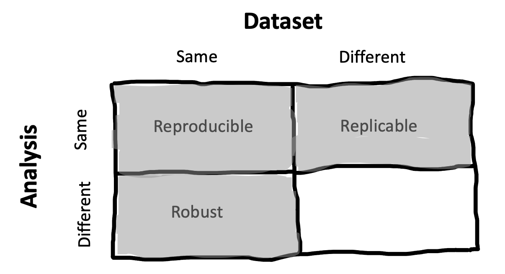
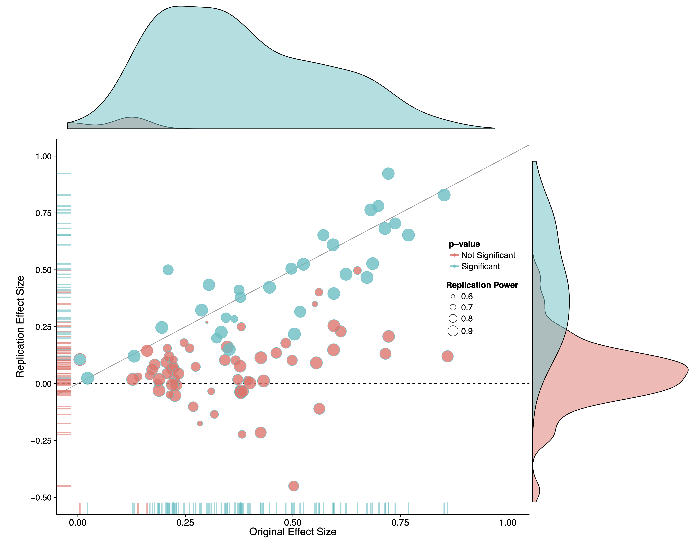
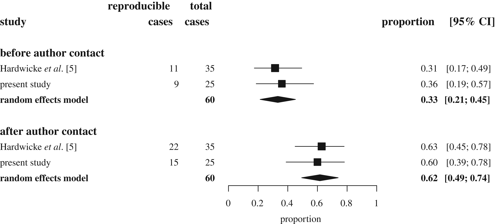
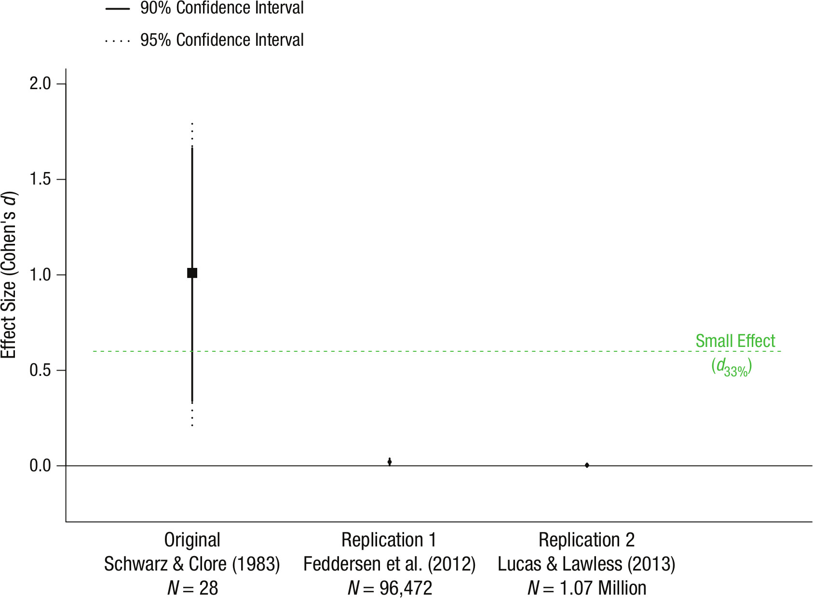
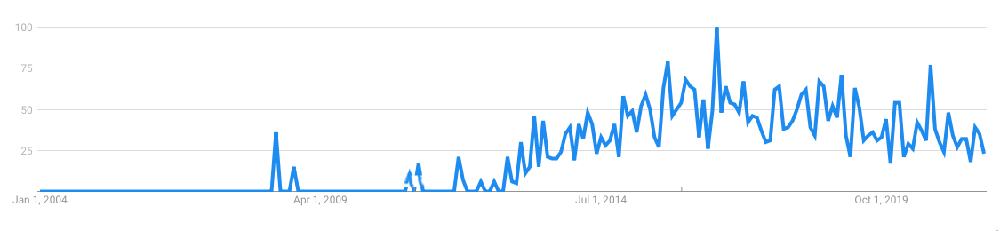
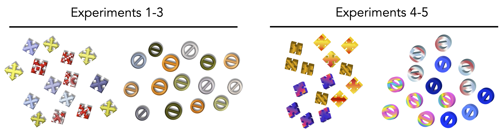
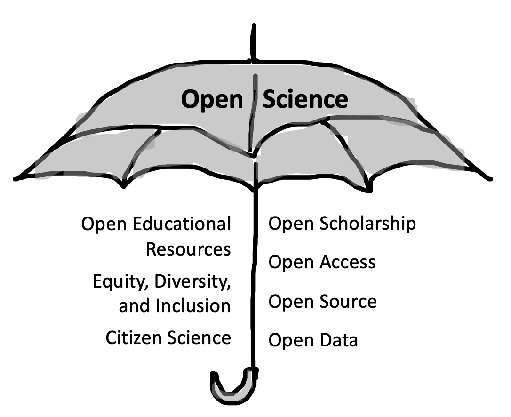

# Replication {#replication}

::: {.box .learning_goals}
* Define and distinguish reproducibility and replicability
* Review the meta-scientific literature on replication and the causes of replication failures
* Reason about the relation of replication to theory building
:::

In the previous chapters, we introduced experiments, their connection with causal inference, and their role in building psychological theory. In principle, repeated experimental work combined with theory building should yield strong research programs that explain and predict phenomena with increasing scope. 

Yet in the last ten years there has been an increasing recognition that this idealized view of science might not be a good description of what we actually see when we look at the psychology literature. Many classic findings may be wrong, or at least overstated. Their statistical tests might not be trustworthy. The actual numbers are even wrong in many papers! And even when experimental findings are "real", they may not reflect deep psychological generalizations.^[And even if they do, they likely don't reflect generalizations that are true about people in general, only some very specific groups of people. We'll get to that part later in the book.] 

How do we know about these problems? A burgeoning field called **meta-science** is providing the evidence. Meta-science is research *about research*, for example investigating how often findings in a literature can be successfully built on, or trying to figure out how widespread some negative practice is. Meta-science allows us to go beyond one-off anecdotes about a particular set of flawed results or rumors about bad practices. Perhaps the most obvious sign that something is wrong is that when independent scientists try to repeat previous studies, they often do not get the same results.

Firstly, let's discuss the different ways in which a scientific finding can be repeated. Figure \@ref(fig:replication-terms) gives us a basic starting point for our definitions. For a particular finding in a paper, if we take the same data, do the same analysis, and get the same result, we call that finding **reproducible** (sometimes, **analytically** or **computationally reproducible**). If we collect *new* data using the same methods, do the same analysis, and get the same result, we call that a **replication** and say that the finding is **replicable**. If we do a different analysis with the same data, we call this a **robustness check** and if we get a similar result, we say that the finding is **robust**.^[You might have observed that a lot of work is being done here by the word "same." How do we operationalize same-ness for experimental procedures, statistical analyses, samples, or results? These are difficult questions that we'll touch on below. Keep in mind that there's no single answer and so these terms are always going to helpful guides rather than exact labels.] We leave the last quadrant empty because there's no specific term for it in the literature -- the eventual goal is to draw **generalizable** conclusions but this will require more work than just having a finding that is reproducible and replicable.


```{r replication-terms, fig.cap="A framework for understanding different terms related to the repeatabilty of scientific findings. Based on [https://figshare.com/articles/Publishing_a_reproducible_paper/5440621](https://figshare.com/articles/Publishing_a_reproducible_paper/5440621).", fig.margin=TRUE}

```


In this chapter, we'll primarily discuss reproducibility and replicability; discussions of robustness and generalizability will be taken up in Chapters \@ref(prereg) and \@ref(sampling) respectively. We'll start out by reviewing some of the key concepts around reproducibility and replicability as well as the key meta-science findings. This literature suggests that when you read an average psychology paper, your default expectation should be that it might not replicate!

We'll then discuss some of the main reasons why findings might not replicate -- especially **analytic flexibility** and **publication bias**. We end by taking up the issue of how reproducibility and replicability relate to theory building in psychology. To summarize, our view is that reproducibility and replicability are critical foundations for theory building -- they are *necessary* but not *sufficient* for good theories. 

::: {.box .case_study}
(TITLE) The Open Science Collaboration

Around 2011, we were teaching our Experimental Methods course for the first time, based on a course model that we had worked on with Rebecca Saxe [@frank2012]. The idea was to introduce students to the nuts and bolts of research by having them run replications.^[One of the current author team was a student in the course that year!] A guy named Brian Nosek was on sabbatical nearby, and over coffee we learned that he was starting up an ambitious project to replicate a large sample of studies published in top psychology journals in 2008.

That year in the course, we chose replication projects from the sample that Nosek had told us about. Four of these projects were perfomed very well and were nominated by the course TAs for inclusion in the broader project. A few years later, when the final group of 100 replication studies was completed, we got a look at the results, shown in Figure \@ref(fig:replication-osc-2015). 

```{r replication-osc-2015, fig.cap="Results from the Open Science Collaboration (2015). Each point represents one of the studies in the sample, with the horizontal position giving the original effect size and the vertical position giving the replication effect size. Dot size represents estimated statistical power. The dotted line represents a perfect replication.", fig.margin=TRUE}

```
The resulting meta-science paper, which we and others refer to as the "replication project in psychology" (RPP), made a substantial impression on both psychologists and the broader research community, defining both a field of psychology meta-science studies and providing a template for many-author  collaborative projects [@osc2015]. But the most striking thing was the result: disappointingly, by several different criteria, only around a third of studies showed the same finding as the original. The others yielded smaller effects that were no significant in the replication sample. This study provided the first large-scale evidence that there were systematic issues with replicability in the psychology literature.

RPP's results -- and their interpretation -- were controversial, however, and much ink was spilled on what these data showed. In particular, critics pointed to different degrees of fidelity between the original studies and the replications; insufficient levels of statistical power in the replications; non-representative sampling of the literature; and difficulties identifying specific statistical outcomes for replication success [@gilbert2016;@anderson2016]. In our view, many of these critiques have merit, and you can't simply interpret the results of RPP as an unbiased estimate of the replicability of results in the literature, contra the title.^[Confusingly, the title of the paper is "Estimating the reproducibility of psychological science", not "the replicability of psychological science". This caused terminological confusion for several years; it seems like at this point people have just decided it was a mistake.]

And yet, RPP's results are still important and compelling, and they undeniably changed the direction of the field of psychology. Many good studies are like this -- they have critical flaws but they lead the way towards other followups that often have greater precision and fewer issues. For several of us personally, working on this project was also transformative in that it showed us the power of collaborative work -- together we could do a study that no one of us had any hope of completing on our own, and potentially make a difference in our field.
:::

## Reproducibility

As one of their primary purposes, scientific papers report measurements, statistical results, and more complex analytic findings and visualizations. For these results to be subject to scrutiny, readers and reviewers need to be able to access some aspects of the set of steps from the original raw measures all the way to the final products. For much of the history of the scientific paper, complete verification of the **provenance** of a particular reported number in a paper was impossible -- at best, a reader was presented with a verbal or mathematical description of the computations that were performed on the raw data, and the raw data themselves were not available.^[In practice, for many years data have been available "on request," and professional societies like the American Psychological Association have [mandated data sharing](https://www.apa.org/ethics/code) for purposes of verification. But in practice data are rarely made available [@wicherts2006]. We believe this is untenable, and we provide a longer argument justifying data sharing in Chapter \@ref(ethics) and discuss some of the practicalities of sharing in Chapter \@ref(management).]

Data sharing is increasing, and we believe this is a very good thing for science as a whole.^[We're focusing on data sharing here, because much experimental research uses relatively straightforward analyses. But the same points apply to code sharing as well! In computational research, the relevant position is nicely summed up by a prescient quote from @buckheit1995: "An article about computational science in a scientific publication is not the scholarship itself, it is merely advertising of the scholarship. The actual scholarship is the complete software development environment and the complete set of instructions which generated the figures."] But because sharing has been relatively limited in the past, the reproducibility of numbers in nearly all published papers cannot be checked. 

Reproducibility is desirable for a number of reasons. Without it:

* Errors in calculation or reporting could lead to disparities between the reported result and the actual result,
* Vague verbal descriptions of analytic computations could keep readers from understanding the computations that were actually performed,
* The robustness of data analyses to alternative model specifications cannot be checked, and
* Synthesizing evidence across studies, a key part of building a cumulative body of scientific knowledge (Chapter \@ref(meta)), is much more difficult. 

Of these reasons, error detection and correction is probably the most pressing. But are errors common? There are plenty of individual instances of errors that are corrected in the published literature [e.g., @cesana-arlotti2018], and we ourselves have made significant analytic errors [@frank2013]. But these kinds of experiences don't tell us about the frequency of error (or the consequences of error for the conclusions that researchers draw).^[There is a very interesting discussion of the pernicious role of scientific error on theory building in @gould1996's "The Mismeasure of Man." Gould examines research on racial differences in intelligence and documents how scientific errors that supported racial differences were often overlooked. Errors are often caught asymmetrically; we are more motivated to double-check a result that contradicts our biases.] This question about frequency is a meta-scientific question that a variety of researchers have attempted to answer over the years. If errors are frequent, that would suggest a need for changes in our policies and practices to reduce their frequency! 

```{r replication-fake-ttest}
t <- t.test(1:10, 2:11)
```

Unfortunately, the lack of data availability creates a problem: it's hard to figure out if calculations are wrong if you can't check them in the first place. One meta-scientific research program has taken a clever approach to this issue. In standard American Psychological Association (APA) reporting format, inferential statistics must be reported with three pieces of information: the test statistic, the degrees of freedom for the test, and the $p$-value (e.g., $t(`r t$parameter`) = `r round(t$statistic, 2)`$, $p = `r round(t$p.value, 3)`$). Yet these pieces of information are redundant with one another. Thus, reported statistics can be checked for consistency simply by evaluating whether they line up with one another -- that is, whether the $p$-value recomputed from the $t$ and degrees of freedom matches the reported value. 

@bakker2011 performed precisely this analysis on a sample of 281 papers, and found that around 18% of statistical results were incorrectly reported. Even more worrisome, around 15% of articles contained at least decision error -- that is, a case where the error changed the direction of the inference that was made (e.g., from significant to insignificant).^[Confirming Gould's speculation, most of the reporting errors that led to decision errors were in line with the researchers' own hypotheses.] @nuijten2016 used an automated method called "statcheck"^[Statcheck is now available as a [web app](http://statcheck.io) and an R package so that you can check your own manuscripts!] to confirm and extend this analysis. They checked $p$-values for more than 250,000 psychology papers in the period 1985--2013 and found that around half of all papers contained at least one incorrect $p$-value! 

These findings provide a lower bound on the number of errors in the literature and suggest that reproducibility of analyses is likely very important. How reproducible are published findings? While there is probably no general way to check reproducibility across the literature, a group of us conducted some more targeted studies of two journals with open-data policies. @hardwicke2018b and @hardwicke2021a identified datasets with reusable data (because not all datasets were complete and comprehensible) and then downloaded the data and attempted to reproduce the main statistical results from 60 of these articles. This process was incredibly labor-intensive, with articles requiring 5--10 hours of work each. Only about a third of articles were completely reproducible without help from the original authors; around 62% were successfully reproduced after -- sometimes extensive -- correspondence (Figure \@ref(fig:replication-hardwicke)). A good number of the remaining papers appeared to have some irreproducible results -- due to typos, missing data, or unclear analytic specifications.^[See @artner2020 for a similar study with a slightly higher reproducibility rate but also a distressingly high rate of decision errors for the primary claims that they assessed.]

<!-- ^[Reproducibility doesn't guarantee correctness. We found some errors in published analyses -- for example, an incorrect formula -- where we could reproduce the published value even though it was incorrect.] Although none of the issues we identified invalidated the conclusions of the original studies, several authors were still motivated to submit corrections to their articles! -->


```{r replication-hardwicke, fig.cap="Analytic reproducibility of results from open-data articles in *Cognition* and *Psychological Science*. From Hardwicke et al. (2021)."}

```

Transparency is a critical imperative for decreasing the frequency of errors in the published literature. Reporting and computation errors are frequent in the published literature, and the identification of these errors depends on the findings being reproducible. If data are not available, then errors usually cannot be found.

<!-- ^[Just a bit of a caveat here. The meta-scientific literature doesn'tprovide strong support for transparency as a policy intervention leading to better reproducibility outcomes? To our knowledge, this experiment hasn't been run yet, perhaps because it would be quite difficult to execute. On the other hand, there is an *association* between data sharing and reporting errors, such that author teams who were less likely to provide data on request also had more reporting errors in their papers [@wicherts2011].]  -->

## Replication

<!-- As we discussed in Chapter \@ref(theories), organized skepticism and independent verifiability of observations are key features of scientific inquiry. Reproducibility is thus a key desideratum for scientific work.  -->
Beyond verifying the analyses reported in a paper, we are often interested in understanding whether the measurements can be replicated. To quote from @popper2005, "the scientifically significant... effect may be defined as that which can be regularly [replicated] by anyone who carries out the appropriate experiment in the way prescribed."

Replications can be conducted for many reasons [@schmidt2009]. One goal can be to verify that the results of an existing study can be obtained again if the study is conducted again in exactly the same way, to the best of our abilities. A second goal can be to gain a more precise estimate of the effect of interest by conducting a larger replication study, or combining the results of a replication study with the existing study. A third goal can be to investigate whether an effect will persist when, for example, the experimental manipulation is done in a different, but still theory-consistent, manner. Alternatively, we might want to investigate whether the effect persists in a different population. Such replications are often efforts to "replicate and extend," and are common both in a sequence of experiments from a single research team or when a new team wants to build on a result from a paper they have read.

Much of the meta-science literature (and attendant debate and discussion) has focused on the first goal of simple verification -- so much so that "replication" has become associated with skepticism or even attacks on the foundations of the field. This dynamic is at odds with the role that replication is given in a lot of philosophy of science, where it is assumed to be a typical part of "normal science."

### Conceptual frameworks for replication

The key challenge of replication is **invariance** -- Popper's stipulation that a replication be conducted "in the way prescribed" in the quote above. That is, what are the features of the world over which a particular observation should be relatively constant, and what are those that are specified as the key ingredients for the effect? Replication is relatively straightforward in the physical and biological sciences, in part because of presupposed theoretical background that allows us to make strong inferences about invariance. If a biologist reports an observation about a particular cell type from an organism, the color of the microscope is presumed not to matter to the observation. 

These invariances are far harder to state in psychology, for both the procedure of an experiment and its sample. Procedurally, should the color of the experimental stimulus matter to the measured effect? In some cases yes, in some cases no.^[A fascinating study by @baribault2018 proposes a method for empirically understanding psychological invariances. Treating a subliminal priming effect as their model system, they sampled thousands of "micro-experiments" in which small parameters of their experimental procedure were randomly sampled. These parameters allowed for measurement of their effect of interest, averaging across this irrelevant variation. It turned out in their case, color did not in fact matter.]  Yet the task of postulating how a scientific effect should be invariant to lab procedures pales in comparison to the task of postulating how the effect should be invariant across different human populations!^[In some sense, the research program of some branches of the social sciences amounts to an understanding of invariances across human cognition. The search for "universal grammar" in linguistics is a project to find what aspects of grammar are shared across all humans [@chomsky1967].]


<!-- If color does not matter, how about the context of presentation for an experiment -- should presentation to a participant at home on a web browser produce the same effect as presentation in a laboratory setting using custom software [@crump2013]?  -->

A lot is at stake in this discussion. If Dr. Frog publishes a finding with US undergraduates and Dr. Toad then "replicates" the procedure in Germany, to what extent should we be perturbed if the effect is different in magnitude or absent?^[Presumably not very much if Dr. Toad gave the original instructions in English instead of in German -- that's another one of these pesky invariances that we are always worrying about!] People have made a number of replication taxonomies to try and quantify the degree of consistency between two experiments. 

One influential one is the distinction between **direct replications**^[These also get called **exact replications** sometimes. We think this term is misleading because similarity between two different experiments is always going to be on a gradient, and where you cut this continuum is always going to be a theory-laden decision. One person's "exact" is another's "inexact."] and **conceptual replications** [@zwaan2018]. Direct replications are those that attempt to reproduce all of the salient features of the prior study, up to whatever invariances the experimenters believe are present (e.g., color of the paint, gender of the experimenter, etc.). In contrast, conceptual replications are typically paradigms that attempt to test the same hypothesis via different operationalizations of the manipulation and/or the measure. We follow Zwaan et al. (2018) in thinking that labeling this second type of experiment as "replications" is a little misleading. Rather, they're alternative tests of the same part of your theory -- such tests can be extremely valuable, but they serve a different goal than replication.

::: {.box .accident_report}
(TITLE) "Small Telescopes" 

We've been discussing the question of invariance with respect to procedure and sample, but we haven't really discussed invariance with respect to the studies' statistical results. To what extent can we consider two statistical results to be "the same"? Several obvious metrics, including those used by RPP, have important limitations [@simonsohn2015]. For example, if one finding is statistically significant and the other isn't, they still could have effect sizes that are actually quite close to one another, in part because one might have a larger sample size than the other.^[This is one reason we are not very fond of binary inferences about statistical inference, as you'll see in Chapter \@ref(inference).] Or you could have two significant findings that nevertheless have very different effect sizes. 

```{r replication-telescopes, fig.cap="The original finding by Schwarz & Clore (1983) and two replications with much larger samples. All three estimates include a 95\\% confidence interval, but these are very small for the two replication studies. From Simonsohn (2015).", fig.margin=TRUE}

```


In a classic study, @schwarz1983 reported that participants (N=28) rated their life satisfaction as higher on sunny days than rainy days, suggesting that they mis-attributed temporary happiness about the weather to longer-term life satisfaction. However, when two more recent studies examined very large samples of survey responses, they yielded estimates of the effect that were much smaller. In one survey, the effect was significant but extremely small; in the other it was essentially zero (Figure \@ref(fig:replication-telescopes)). Using statistical significance as the metric of replication success, you might be tempted to say that the first of these was a successful replication and the second was a failed replication. 

Simonsohn points out that this doesn't make sense, using the vivid analogy of the experimental sample size as a telescope. Following this analogy, Schwarz and Clore had a very small telescope (i.e., a small sample size), and they pointed it in a particular direction and claimed to have observed a planet (i.e., a nonzero effect). Now it might turn out that there was a planet at that location when you look with a much larger telescope (first replication), and it might turn out that there wasn't (second replication). Regardless, however, the original telescope was simply *too small* to have seen whatever was there!

Following Simonsohn's example, numerous metrics for replication success have been proposed [@mathur2020]. The best of these move away from the idea that there is a binary test of whether an individual replication was successful and towards a comparison of the two effects and whether they appear consistent with the same theory. @gelman2018 suggests the "time reversal" heuristic -- rather than thinking of a replication as a success or a failure, consider the alternative world in which the replication study had been performed first and the original study followed it. What would we say then? If we leave behind the idea that the original study has precedence, it makes much more sense to consider the sum total of the evidence across the two. Do they agree or disagree? Taken together, do they support the presence of the effect, or do they present a strong case that it's present only under certain conditions? Using this kind of a test, it seems pretty clear that the weather mis-attribution effect is, at best, a tiny factor in people's overall judgments of their life satisfaction.
:::


### The meta-science of replication

In RPP, replication teams reported subjectively that 39% of replications were successful, with 36% reporting a significant effect in the same direction as the original. How generalizable is this estimate -- and how replicable *is* psychological research more broadly? Based on the discussion above, we hope we've made you skeptical that this is a well-posed question without a lot of additional details. Any answer is going to have to provide details about the scope of this claim, the definition of replication being used, and the metric for replication success. On the other hand, versions of this question have led to a number of empirical studies that help us better understand the scope of replication issues. 

<!-- We'll review these briefly here because we think a good understanding of the meta-science literature on replication can help us decide how worried we should be about the state of the psychology literature.  -->

Many subsequent empirical studies of replication have focused on particular subfields or journals, with the goal of informing particular field-specific practices or questions. For example, @camerer2016 largely adopted the methodological choices of RPP, but applied the procedure to all of the between-subject laboratory articles published in two top economics journals in the period 2011--2014. They found a top-line replication rate of 61% of significant effects in the same direction of the original, higher than in RPP but lower than the naive expectation based on their level of statistical power. Another study attempted to replicate all 21 behavioral experiments published in the journals *Science* and *Nature* from 2010--2015, finding a replication rate of 62% significant effects [@camerer2018].^[This study was notable because they followed a two-step procedure -- after an initial round of replications, they followed up on the failures by consulting with the original authors and pursuing extremely large sample sizes. The resulting estimate thus is less subject to many of the critiques of the original RPP paper.] While these types of studies do not answer all the questions that were raised about RPP, they suggest that replication rates for top experiments are not as high as we'd like them to be, even when greater care is taken with the sampling and individual study protocols. 

Other scientists working in the same field can often predict when an experiment will fail to replicate. @dreber2015 showed that prediction markets (where participants bet small sums of real money on replication outcomes) made fairly accurate estimates of replication success in the aggregate. This result has itself now been replicated several times (e.g., in the Camerer et al., 2018 study described earlier). Maybe even more surprisingly, there's some evidence that machine learning models trained on the text of papers can predict replication success fairly accurately [@yang2020]. All this points to the possibility of isolating consistent factors that lead to replication success or failure. In the next section we consider what these factors are in more depth. 

The meta-science studies reviewed above are remarkably impressive, and provide some clarity on what we should expect from the literature. When this literature is taken together, the chance of a significant finding in a replication study of a generic experiment in social and cognitive psychology is likely somewhere around 56%. Furthermore, the replication effect will be on average 53% as large [@nosek2021].

On the other hand, they have substantial limitations as well. With relatively few exceptions, the studies chosen for replication used short, computerized tasks that mostly would fall into the categories of social and cognitive psychology. Further, and perhaps most troubling from the perspective of theory development, they tell us only whether a particular experimental effect can be replicated. They tell us almost nothing about whether the construct that the effect was meant to operationalize is in fact real! We'll return to the difficult issue of how replication and theory construction relate to one another in the final section of this chapter.  

Some have called the narrative that emerges from the sum of these meta-science studies the "replication crisis." We think of it as a major tempering of expectations with respect to the published literature. Your naive expectation might reasonably be that you could read a typical journal article, select an experiment from it, and replicate that experiment in your own research. The upshot of this literature is that you might well be disappointed. 

::: {.box .ethical_considerations}
(TITLE) Consequences for the study, consequences for the person

"Power posing" is the idea that adopting a more open and expansive physical posture might also change your confidence. @carney2010 reported a striking study of this phenomenon, in which 42 participants were told they were taking part in a study of physiological recording. They then held two poses, each for a minute. In one condition, the poses were expansive (e.g., legs out, hands on head); in another condition, the poses were contractive (e.g., arms and legs crossed). Participants in the expansive pose condition showed increases in testosterone and decreases in salivary cortisol (a stress marker), they took a greater number of risk in a gambling task, and they reported that they were more "in charge" in a survey. This result suggested that a two-minute manipulation could lead to striking physiological and psychological changes -- in turn leading to power posing becoming firmly enshrined as part of the set of recommended strategies in business and elsewhere. The original publication contributed to the rise of the researchers' careers, including becoming a principal piece of evidence in a hugely-popular TED talk by Amy Cuddy, one of the authors.

This result is likely not definitive, however. A replication study with a larger number of participants (N=200) failed to find evidence for physiological effects, even as it did find some effects on participants' own beliefs [@ranehill2015]. And a review of the published literature suggested that many findings appeared to be the result of some sort of publication bias, as far too many of them had *p*-values very close to the .05 threshold [@simmons2017]. In light of this evidence, the first author of the replication study made a public statement that she [does not believe that "power pose" effects are real](https://faculty.haas.berkeley.edu/dana_carney/pdf_my%20position%20on%20power%20poses.pdf).

```{r replication-powerpose, fig.cap="Google trends time series for \"power pose\" from 2004-2021.", fig.margin=TRUE}

```

From the scientific perspective, it's very tempting to take this example as a case in which the scientific ecosystem corrects itself. Although many people continue to cite the original power posing work, we suspect the issues are well-known throughout the social psychology community, and overall interest by the lay public has gone down (see Figure \@ref(fig:replication-powerpose)). But this narrative masks the very real human impacts of the self-correction process, which can raise ethical questions about the best way to address issues in the scientific record. 

The process of debate and discussion around individual findings can be bruising and complicated. In the case of power posing, Cuddy herself was tightly associated with the findings and many critiques of the findings became critiques of the individual. Several commentators used Cuddy's name as a stand-in for low-quality psychological results, likely because of her prominence and perhaps because of her gender and age as well. These comments were harmful to Cuddy personally and her career more generally.^[For further reading, see ["When the Revolution Came for Amy Cuddy"](https://www.nytimes.com/2017/10/18/magazine/when-the-revolution-came-for-amy-cuddy.html).]

Scientists should critique, reproduce, and replicate results -- these are all critical parts of the progress of normal science. But it's important to do this in a way that's sensitive to the people involved. Here are a few guidelines for courteous and ethical conduct: 

* Communicate personally before communicating publicly. As Joe Simmons, one critic in the power-posing debate said, "I wish I'd had the presence of mind to pick up the phone and call [before publishing my critique]" [@dominus2017].
* Always communicate about the work, never the person. Try to use language that is specific to the analysis or design being critiqued, rather than the person who did the analysis or thought up the design.
* Avoid using language that assumes negative intentions, e.g. "the authors misleadingly state that ..."
* Ask someone to read your paper, email, blogpost, or tweet before you hit send. It can be very difficult to figure out the tone of your writing without an external perspective.

As we will argue in the next chapter, we have an ethical duty as scientists to promote good science and critique low quality science. But we also have a duty to our colleagues and communities to be good to one another.
:::

### Causes of replication failure

The general argument of this chapter is that everything is not all right in experimental psychology, and hence that we need to change our methodological practices to avoid negative outcomes like irreproducible papers and unreplicable results. Towards that goal, we have been presenting meta-scientific evidence on reproducibility and replicability. But this evidence has been controversial, to say the least! Do large-scale replication studies like RPP -- or for that matter, smaller-scale individual replications of effects like "power posing" -- really lead to the conclusion that our methods require changes? Or are there reasons why a lower replication rate is actually consistent with a cumulative, positive vision of psychology?^[One line of argument addresses this question through the dynamics of scientific change. There are many versions, but one is given by @wilson2020. The idea is that progress in psychology consists of a two-step process by which candidate ideas are "screened" for publication by virtue of small, noisy experiments and then "confirmed" by large-scale replications. On this kind of view, it's business as usual to find that many randomly-selected findings don't hold up in large-scale replications and so we shouldn't be distressed by results like those of RPP. The key to progress is to finding a small set that *do* hold up, which will lead to new areas of inquiry. We're not sure this is view is either a good description of current practice or a good normative goal for scientific progress, but we won't focus on that critique here. Instead, since book is written for experimenters-in-training, we assume that *you* do not want your experiment to be a false positive from a noisy screening procedure!]

::: {.box .depth}
(TITLE) Context, moderators, and expertise

There are many explanations for failed replications. But the wonderful thing about the idea of meta-science is that these explanations can be tested empirically!

Let's start with the idea that specific experimental operationalizations of a theory might be "context sensitive," especially in subfields, like social psychology, whose theories inherently refer to environmental context [@van-bavel2016]. This critique was made in an especially pointed way in the case of some studies in RPP, where the original experimental materials were tailored to one cultural context but then were deployed in another context [@gilbert2016]. 

Context sensitivity seems like a great explanation because in some sense, it *must* be right. If the context of an experiment includes the vast network of learned associations, practices, and beliefs that we all hold, then there's no question that an experiment's materials tap into this context to one degree or another. For example, if your experiment relies on the association between *doctor* and *nurse* concepts, you would expect this experiment to fail in antiquated English-language connotations where, for example, *nurse* meant something more like *nanny* [@ramscar2016]. 

On the other hand, as an explanation of specific replication failures, context sensitivity has not fared very well when assessed empirically. The "Many Labs" projects were a series of replication projects in which *multiple* labs independently attempted to replicate several original studies. (In contrast, in RPP and similar studies, a single replication was conducted for each original study.) Some of the Many Labs projects assessed variation in replication success across different labs. In ManyLabs 2, @klein2018b replicated 28 findings, distributed across 125 different samples and more than 15,000 participants.^[The top-line replication rate was 54%, consistent with the other evidence we've presented.] ManyLabs 2 found almost no support for the context sensitivity hypothesis as an explanation of replication failure. In general, when effects failed to replicate, they did so when conducted in person as well as when conducted online, and these failures were consistent across many cultures and labs. The size of effects in successful replications were modulated a bit by contextual factors, but heterogeneity in general was not high. 

On the other hand, a review of several Many Labs-style replication projects indicated, on re-analysis, that population effects differed across replication labs by $d=0.21$, even when the replication protocols were very similar to one another [@olsson2020heterogeneity; @errington2021investigating]. Again, this is not a lot of heterogeneity, but it is not negligible given that that many replications estimate effect sizes that are around $d=0.20$ as well [@osc2015]. So context sensitivity is almost certainly present -- and we'll return to the broader issues of generalizability, context, and invariance in the next section -- but so far we have not identified specific forms of context sensitivity that reliably affect replication success. 

```{r replication-lf, fig.cap="Stimuli from Lewis and Frank (2016)."}

```

```{r replication-lf2,fig.cap="Forest plot showing effect sizes and confidence intervals for all of the studies in the paper as well as the two original studies being replicated and the meta-analytic effect (red diamond)."}
knitr::include_graphics("images/replication/lewis-data.png")
```

The observation that direct replications can have non-negligible heterogeneity, and yet we haven't been able to identify contextual moderators, suggests the possible presence of "hidden moderators". That is, when faced with a successful original study and a failed replication, we should look for differences that moderate the effect. We've had several experiences that corroborate this. For example, in @lewis2016, we were unsuccessful in replicating a simple categorization experiment (with a point estimate of $d=0.17$ compared to the original study's reported $d=1.49$). We then made a series of iterative changes to the stimuli and instructions, eventually resulting in a larger (and statistically significant) effect of $d=0.71$-- though still much smaller than the original. Figures \@ref(fig:replication-lf) and \@ref(fig:replication-lf2) shows the stimuli and the resulting effect sizes. Critically, however, each change that we made to the procedure yielded a very small change in the effect -- and the linear impression given by the changes across experiments is likely an artifact, given that, among other things, Experiments 4 and 5 were identical to one another. In sum, the aggregation of several small methodological moderators here led to a substantially increased replication effect size ($d=0.17$ vs. $d=0.71$), but each moderator alone led to only a small increase in effect size. 

Experimenter expertise is a final explanation for replication failure that is often cited [e.g., @schwarz2014]. On this hypothesis, replications fail because the replication experimenters do not have relevant expertise in executing the manipulation. Like context sensitivity, this explanation is almost certainly true for some replications. In our work, we have repeatedly performed experiments that failed due to our own incompetence! Yet as an explanation of the pattern of meta-science findings, the expertise hypothesis hasn't been supported. First, team expertise was not a predictor of replication success in RPP [cf. @bench2017]. More convincingly, Many Labs 5 selected ten findings from RPP with unsuccessful replications and systematically evaluated whether formal expert peer review of the protocols, including by the authors of the original study, would lead to a larger effect sizes. Despite a massive sample size and extremely thorough review process, there was little to no change in the effects for the vetted protocols relative to the original protocol used in RPP [@ebersole2020]. 

Context, moderators, and expertise seem like reasonable explanations for individual replication failures. Certainly, we should expect them to be explanatory! But for these hypotheses to be operationalized in such a way that they carry weight in our evaluation of the meta-scientific evidence, they must be evaluated empirically rather than accepted uncritically. When such evaluations have been carried out, they have failed to support a large role for these factors. 
:::

In RPP and subsequent meta-science studies, original studies with lower $p$-values, larger effect sizes, and larger sample sizes were more likely to replicate successfully [@yang2020]. From a theoretical perspective, this result is to be expected, because the $p$-value literally captures the probability of the data (or any "more extreme") under the null hypothesis of no effect. So a lower $p$-value should indicate a lower probability of a spurious result.^[In Chapter \@ref(inference) we will have a lot more to say about $p < .05$ but for now we'll mostly just treat it as a particular research outcome.] In some sense, the fundamental question about the replication meta-science literature is why the $p$-values *aren't* better predictors of replicability! For example, @camerer2018 computes an expected number of successful replications on the basis of the effects and sample sizes -- and their proportion of successful replications is substantially lower than that number.^[This calculation, as with most other metrics of replication success, assumes that the underlying population effect is exactly the same for the replication and the original. This is a limitation because, as we describe, there could be unmeasured moderators that could produce genuine substantive differences between the two estimates. Such heterogeneity is not uncommon, even if it is relatively small, in multi-site replications in which heterogeneity can be directly estimated [@ebersole2020, olsson2020heterogeneity]. As such, the metrics will typically underestimate replication success when there is heterogeneity within pairs [@mathur2020].]

One explanation is that the statistical evidence that is presented in papers often dramatically overstates the true evidence from a study. That's because of two pervasive and critical issues: **analytic flexibility** (also known as **p-hacking** or **questionable research practices**) and **publication bias**.^[These terms basically mean the same thing and are not used very precisely in the literature. p-hacking is an informal term that sounds like you are doing something bad. Questionable research practices is a more formal-sounding term that is in principle vague enough to encompass many ethical failings but in practice gets used to talk about p-hacking. And analytic flexibility (or "undisclosed analytic flexibility"), the clunky term we mostly favor, describes the actual practice of trying many different things and then pretending you didn't. Critically, undisclosed analytic flexibility describes a state of affairs not a (questionable) intent, so that's why we like it a bit better.] 

Publication bias refers our relative preference for experiments that "work" than those that do not, where "work" is typically defined as yielding a significant result at $p<.05$. Because of this interest, it is typically easier to publish such results. This situation leads to biases in the literature. Intuitively, this bias will lead to a literature filled with papers where $p<.05$. Negative findings will then remain unpublished, living in the proverbial "file drawer" [@rosenthal1979].^[One estimate is that 96% of (non-preregistered) papers report positive findings [@scheel2021]! We'll have a lot more to say about publication bias in Chapters \@ref(prereg) and \@ref(meta)!] In a literature with a high degree of publication bias, many findings will be spurious because experimenters got lucky and published the study that "worked" even if that success was due to chance variation. In this situation, these spurious findings will not be replicable and so the overall rate of replicability in the literature will be lowered. 

The mathematics of the publication bias scenario strikes some observers as implausible: most psychologists don't run dozens of studies and report only one out of each group [@nelson2018]. Instead, a more common scenario is to conduct many different analyses and then report the most successful, creating some of the same effects as publication bias -- a promotion of spurious variation -- without a file drawer full of failed studies. 

::: {.box .accident_report}
(TITLE) When I'm 64?

The way they tell it, Joseph Simmons, Leif Nelson, and Uri Simonsohn wrote their paper on "false positive psychology" as an attempt at catharsis [@simmons2018]. They were fed up with work that they felt exploited flexibility in data analysis to produce findings blessed with *p* < .05 but likely did not reflect replicable effects. They called this practice **p-hacking**: trying different things to get your *p*-value to be below .05. 

Their paper reported on a simple experiment: they played participants either the Beatles song, "when I'm 64," or a control song and then asked them to report their date of birth [@simmons2011]. This manipulation resulted in a significant one and a half year rejuvenation effect. Listening to the Beatles seemed to have made their participants younger!

This result is impossible, of course. But the authors produced a statistically significant difference between the groups that, by definition, was a **false positive** -- a case where the statistical test led them to believe there was a difference between groups despite no difference existing. In essence, they did so by trying many possible analyses and "cherry-picking" the one that produced a positive result. This practice of course invalidates the inference that the statistical test is supposed to help you make.^[We discuss this and related problems in much more depth in Chapters \@ref(inference) and \@ref(prereg).]

Several of the practices they followed included:

* Selectively reporting dependent measures (e.g., collecting several measures and reporting only one),
* Selectively dropping manipulation conditions,
* Conducting their statistical test and then testing extra participants in the case that they did not see a significant finding, and 
* Adjusting for gender as a covariate in their analysis if doing so resulted in a significant effect. 

Many of the practices that the authors followed in their rejuvenation study were (and maybe still are!) commonplace in the research literature. @john2012 surveyed research psychologists on the prevalence of what they called **questionable research practices**. Most participants admitted to following some of these practices -- including exactly the same practices followed by the rejuvenation study. 

For many in the field, "false positive psychology" was a galvanizing moment, leading them to recognize how common practices could lead to completely spurious (or even impossible) conclusions. As Simmons, Nelson, and Simonsohn wrote in their 2018 article, "Everyone knew [p-hacking] was wrong, but they thought it was wrong the way it is wrong to jaywalk. We decided to write 'False-Positive Psychology' when simulations revealed that it was wrong the way it is wrong to rob a bank."
:::

It's our view that publication bias and its even more pervasive cousin, analytic flexibility, are likely to be key drivers of lower replicability. We admit that the meta-scientific evidence for this hypothesis isn't unambiguous, but that's because there's no sure-fire way to diagnose analytic flexibility in a particular paper since we can almost never reconstruct the precise choices that were made in the data collection and analysis process! On the other hand, it is possible to analyze indicators of publication bias in specific literatures and there are several cases where publication bias diagnostics appear to go hand in hand with replication failure.^[Here are two examples. First, in the "power posing" example described above, @simmons2017 noted strong evidence of analytic flexibility throughout the literature, leading them to conclude that there was no evidential value in the literature. Second, in the case of "money priming" (incidental exposures to images or text about money that were hypothesized to lead to changes in political attitudes), strong evidence of publication bias [@vadillo2016] was accompanied by a string of failed replications [@rohrer2015].]

## Replication, reproducibility, theory building, and open science

So, empirical measures of reproducibility and replicability in the experimental psychology literature are low -- lower than we might have naively suspected and lower than we want. How do we address these issues? And how do these issues interact with the goal of building theories? In this last section, we discuss the relationship between replication and theory -- and the role that open and transparent research practices can play.

### Reciprocity between replication and theory

Analytic reproducibility is a  prerequisite for theory building because if the twin goals of theories are to explain and to predict experimental measurements, then an error-ridden literature undermines this goal. If some proportion of all numerical values reported in the literature were simple, unintentional typos, this situation would create an extra level of noise -- irrelevant random variation -- impeding our goal of getting precise enough measurements to distinguish between theories. But in fact, the situation is likely to be worse: errors are much more often in the direction that favors authors' own hypotheses. Thus, irreproducibility not only decreases our precision, it also increases the bias of the literature, creating obstacles to the fair evaluation of theories with respect to data. 

Replicability is also foundational to theory building. Across a wide range of different conceptions of how science works, scientific theories are evaluated with respect to their relationship to the world. They must ground out in specific observations. It may be that some observations are by their nature un-repeatable (e.g., a particular astrophysical event might not be observed again a human lifetime). But for laboratory sciences -- and experimental psychology can be counted among these, to a certain extent at least -- the independent and skeptical evaluation of theories requires repeatability of measurements. 

Some authors have argued (following the philosopher Heraclitus), "you can't step in the same river twice" [@mcshane2014] -- meaning, the circumstances and context of psychological experiments are constantly changing and no observation will be identical to another. This is of course technically true from a philosophical perspective. But that's where theory comes in! As we discussed above, our theories postulate the invariances that allow us to group together similar observations and generalize across them. 

In this sense, replication is critical to theory, but theory is also critical to replication. Without a theory of "what matters" to a particular outcome, we really are stepping into an ever-changing river. But a good theory can concentrate our expectations on a much smaller set of causal relationships, allowing us to make strong predictions about what factors should and shouldn't matter to experimental outcomes.

<!-- To return to an example we discussed earlier, should color matter to  Baribault et al. ran thousands of "micro-experiments" in which they randomly varied minor aspects of their experimental presentation. Must we do this every time we do an experiment? The answer is yes, unless we have a theory that guides the kind of variation we are looking for.  -->

### Deciding when to replicate to maximize epistemic value

As a scientific community, how much emphasis should we place on replication? In the words of @newell1973, "you can't play 20 questions with nature and win". A series of well-replicated measurements does not itself constitute a theory. Theory construction is its own important activity. We've tried to make the case here that a reproducible and replicable literature is a critical foundation for theory building. That doesn't necessarily mean you have to do replications all the time -- that's only critical if you think you *don't* have a very replicable literature and want to check! 

More generally, any scientific community needs to trade off between exploring new phenomena and confirming previously reported effects. In a thought-provoking analysis, @oberauer2019 suggest that perhaps replications also aren't the best test of theoretical hypotheses. In their analysis, if you don't have a theory then it makes sense to try and discover new phenomena and then to replicate them. If you *do* have a theory, you should expend your energy in testing new predictions rather than repeating the same test across multiple replications. 

Analyses such as this one can provide a guide to our allocation of scientific effort. But our goal in this book is somewhat different. Once you decide to do a particular experiment -- replication or otherwise -- we assume that you want to maximize its scientific value. Our recommendations about practice are predicated on the assumption that we want the resulting literature to be reproducible and replicable, not that we necessarily want it to consist of replications! There are many concerns that go into whether to replicate -- including not only whether you are trying to gather evidence about a particular phenomenon, but also whether you are trying to master techniques and paradigms related to it. As we said at the beginning of this chapter, not all replication is for the purpose of verification. 

### Open science

The **open science movement** is a response -- really a set of responses -- to the challenges of reproducibility and replicability. The open science (and now the broader **open scholarship**) movement is a broad umbrella (Figure \@ref(fig:replication-umbrella)), but we take open science to be a set of beliefs, research practices, results, and policies that are organized around the central roles of transparency and verifiability in scientific practice.^[Another part of the open science umbrella involves a democratization of the scientific process through efforts to open access to science. This process involves both removal of barriers to access to the scientific literature but also efforts to remove barriers to scientific training -- especially to groups historically underrepresented in the sciences. The hope is that these processes increase both the set of people and the range of perspectives contributing to the scientific project. We view these changes as no less critical than the transparency aspects of the open science movement, though more indirectly related to the current discussion of reproducibility and replicability.] The core of this movement is the idea of "nullius in verba" (the motto of the British Royal Society), which roughly means "take no one's word for it."^[At least that's a reasonable paraphrase, but there's some interesting discussion about what this quote from Horace really means in a letter by @gould1991.] 


```{r replication-umbrella, fig.margin=TRUE, fig.cap="The broad umbrella of open science (adapted from https://laneblog.stanford.edu/2020/09/01/introducing-the-open-science-reading-group/)."}

```

Transparency initiatives are critical for ensuring reproducibility. As we discussed above, you cannot even evaluate reproducibility in the absence of data sharing. Code sharing can go even further towards helping reproducibility, as code makes the exact computations involved in data analysis much more explicit than the verbal descriptions that are the norm in papers [@hardwicke2018b]. Further, as we will discuss in Chapter \@ref(management), the set of practices involved in preparing materials for sharing can themselves encourage reproducibility by leading to better organizational practices for research data, materials, and code.

Transparency also plays a major role in advancing replicability. This point may not seem obvious at first -- why would sharing things openly lead to more replicable experiments? -- but it is one of the major theses of this book, so we'll unpack it a bit. Here are a couple of routes by which transparent practices lead to greater replication rates. 

1. Sharing of experimental materials enables replications to be more methodologically faithful (Chapter \@ref(management)). As we discussed above, one critique of many replications has been that they differ in key respects from the originals. Sometimes those deviations were purposeful, but in other cases they were simply because the replicators could not use the original experimental materials or scripts. Sharing these, as we encourage you to do, avoids this issue entirely. 

2. Sharing sampling and analysis plans allows replication of key aspects of design and analysis that may not be clear in verbal descriptions, for example exclusion criteria or details of data pre-processing. 

3. Sharing of analytic decision-making via preregistration can lead to a decrease in p-hacking and other practices (Chapter \@ref(prereg)). The strength of statistical evidence in the original study is a predictor of replicability in subsequent studies. If original studies are preregistered, they are more likely to report effects that are not subject to inflation via questionable research practices. 

4. If effects are transparently reported as confirmatory vs. exploratory, subsequent experimenters can make a more informed judgment about which effects are likely to be good targets for replication. 

For all of these reasons, we believe that open science practices can play a critical role in increasing reproducibility and replicability.

## Chapter summary: Replication

So, is there a "replication crisis"? The common meaning of "crisis" is "a difficult time." The data we reviewed in this chapter suggest that there are real problems in the reproducibility and replicability of the psychology literature. But there's no evidence that things have gotten worse. If anything, we are optimistic about the changes in practices that have happened in the last ten years. So in that sense, we are not sure that a crisis narrative is warranted.
 
On the other hand, for @kuhn1962, the term "crisis" had a special meaning: it is a period of intense uncertainty in a scientific field brought on by the failure of a particular paradigm. A crisis typically heralds a shift in paradigm, in which new approaches and phenomena come to the fore. 

In this sense, the replication crisis narrative isn't mutually exclusive with other crisis narratives, including the "generalizability crisis" [@yarkoni2020] and the "theory crisis" [@oberauer2019]. All of these are symptoms of discontent with standard ways of doing business. We share this discontent!  We are writing this book to encourage further changes in experimental methods and practices to improve reproducibility and replicability outcomes -- many of them driven by the broader set of ideas referred to as "open science." These changes may not lead to a paradigm shift in the Kuhnian sense, but we hope that they lead to eventual improvements. In that sense, we tend to side with those who have named the "replication crisis" a "credibility revolution" [@vazire2018]. 

::: {.box .discussion_questions}
1. How would you design a measure of the context sensitivity of an experiment? Think of a measure you could apply *post hoc* to a description of an experiment (e.g., from reading a paper) so that you could take a group of experiments and annotate how context-sensitive they are on some scale.

2. Take the measure you designed above. How would you test that this measure really captured context sensitivity in a way that was not circular? What would be an "objective measure" of context sensitivity?
 
3. What proportion of reproducibility failures do you think are due to questionable practices by experimenters vs. just plain errors? How would you test your hypothesis?
:::


::: {.box .readings}
* Still a very readable and entertaining introduction to the idea of p-hacking: Simmons, J. P., Nelson, L. D., & Simonsohn, U. (2011). False-Positive Psychology: Undisclosed Flexibility in Data Collection and Analysis Allows Presenting Anything as Significant. Psychological Science, 22(11), 1359-1366. [https://doi.org/10.1177/0956797611417632]()

* A recent review of issues of replication in psychology: Nosek, B. et al. (2022). Replicability, Robustness, and Reproducibility in Psychological Science. Annual Review of Psychology, 73, 719-748. [https://doi.org/10.1146/annurev-psych-020821-114157]()
:::