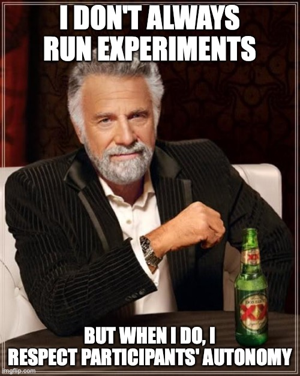

# Ethics {#ethics}

<!-- ```{r ethics-meme} -->
<!--  -->
<!-- ``` -->

::: {.learning-goals}
🍎 Learning goals: 

* Distinguish between consequentialist, deontological, and virtue ethics approaches to research
* Identify key ethical issues in experimental research
* Describe the interactions between ethical issues and research transparency
:::

The fundamental thesis of this book is that experiments are the way to estimate causal effects, which are the foundations of theory. And as we discussed in Chapter \@ref(experiments), the reason why experiments allow for strong causal inferences is because of two ingredients: a manipulation -- in which the experimenter changes the world in some way -- and randomization. Put a different way, experimenters learn about the world by randomly deciding to do things to their participants! Is that even allowed? 

In all seriousness, experimental research raises a host of ethical issues that deserve consideration. What can we and can't we do to participants in an experiment, and what consideration do we owe to them by virtue of their decision to participate? To facilitate our discussion of these issues, we start by briefly introducing the standard philosophical frameworks for ethical analysis. We then use those to discuss problems of experimental ethics, first from the perspective of participants and then second from the perspective of the scientific ecosystem more broadly. 

We have placed this chapter near the beginning of our book because we think it's critical to start the conversation about the your ethical responsibilities as an experimentalist and researcher even before you start planning a study. We'll come back to the ethical frameworks we describe here in Chapter \@ref(consent), which deals specifically with participant recruitment and the informed consent process. We'll also try to think about ethical issues when we discuss topics like allowable types of manipulation (Chapter \@ref(design)), data sharing and privacy (Chapter \@ref(management)), and publication ethics (Chapter \@ref(writing)). 

:::{.case-study}
🔬 Case study: Shock treatment

A decade after surviving prisoners were liberated from the last concentration camp, Adolf Eichmann, one of the Holocaust's primary organizers and leaders, was tried for the role he played [@baade1961]. While reflecting on his rationale for forcibly removing, torturing, and eventually murdering millions of Jews, an unrepentant Eichmann claimed that he was "merely a cog in the machinery that carried out the directives of the German Reich" and that he was not directly responsible [@kilham1974]. This startling admission gave a young researcher an interesting idea: "Could it be that Eichmann and his million accomplices in the Holocaust were just following orders? Could we call them all accomplices?" [@milgram1974]. 

Stanley Milgram aimed to make a direct test of whether people would comply under the direction of an authority figure no matter how uncomfortable or harmful the outcome. He invited participants into the laboratory to serve as a teacher for an activity [@milgram1963]. Participants were told that they were to administer electric shocks of increasing voltage to another participant, the student, in a nearby room whenever the student provided an incorrect response. In reality, the student was a confederate who was in on the experiment and only pretended to be in pain when they received the shocks. Participants were encouraged to continue administering shocks despite clearly audible pleas from students to stop the electric shocks. In one of his studies, nearly 65% of participants administered the maximum voltage to the student. This deeply unsettling result has become, as @ross2011 says, "part of our society’s shared intellectual legacy," informing our scientific and popular conversation in myriad different ways. 

Milgram's study blatantly violates modern ethical norms around the conduct of research. Among other violations, the procedure involved **coercion** that violated participants' right to withdraw from the experiment. This coercion appeared to have negative consequences: Milgram noted that a number of his participants displayed anxiety symptoms and nervousness.^[To be fair, Milgram also conducted a followup survey in which  participants expressed gratitude for participating and did not note long-term negative effects [@milgram1974].] This observation that distressed observers and led to calls for this sort of research to be declared unethical [e.g., @baumrind1964]. The ethical issues surrounding  Milgram's study are complex, and some are relatively specific to the particulars of his study and moment [@miller2009]. But the controversy around the study was an important part of convincing the scientific community to adopt stricter policies that protect study participants from unnecessary harm.
:::

## Ethical frameworks

Was Milgram's experiment ethically wrong -- in the sense that it should not have been performed? Some of us probably have the intuition that is was unethical, due to the harms that the participants might have experienced or the way they were deceived by the experimenter. Others might consider arguments in defense of the experiment, perhaps that we learned from the experiment was sufficiently valuable to justify its being conducted. Beyond simply arguing back and forth, how could we decide this issue?

Ethical frameworks offer tools for analyzing complex situations like the Milgram experiment and trying to make determinations. In this first section, we'll discuss three of the most commonly used ethical frameworks: deontological (rule-based), utilitarian, and virtue ethics. We'll discuss how each of these could be applied to Milgram's paradigm. In subsequent sections, we'll then discuss how these frameworks have led to the ethical guidelines for researchers that are formalized in the ethics review process that research studies must undergo. 

### Consequentialist theories

Ethical theories provide principles for what constitute good actions. The simplest theory of good actions is the **consequentialist** theory: good actions lead to good results. The most famous consequentialist position is the **utilitarian position**, originally defined by the philosopher John Stuart Mill  [@flinders1992]. This view emphasizes decision-making based on the "greatest happiness principle", or the idea that an action should be considered morally good based on the degree of happiness or pleasure people experience because of it, and likewise that an action should be considered morally bad based on the degree of unhappiness or pain people experience by the same action [@mill1859]. 

A consequentialist analysis of Milgram's study considers the study's negative and positive effects and weighs these against one another. Did the study cause harm to its participants? If so, this should be counted against it. On the other hand, did the study lead to knowledge that prevented harm or caused positive benefits? 

Consequentialist analysis can be a straightforward way to justify the risks and benefits of a particular action, but in the research setting it is unsatisfying. Many experiments horrifying experiments would be licensed by a consequentialist analysis and yet feel untenable to us. Imagine a researcher forced you to undergo a risky and undesired medical intervention because the resulting knowledge might benefit thousands of others. This seems like the kind of thing our ethical framework should rule out!

### Deontological  approaches

Harmful research performed against participants' will or without their knowledge -- like the Tuskeegee Syphilis Study discussed below -- is repugnant. Considering such cases makes us think about rules like "researchers must ask before conducting research on people." Principles like this one are now formalized in all ethical codes for research. They exemplify an approach called **deontological** (or duty-based) ethics. Deontology emphasizes the importance of taking ethically permissible actions, regardless of their outcome [@Biagetti2020]. In general, the IRB takes a deontological approach to ethics [@boser2007]. In the context of research, deontology is primarily concerned with four ethical tenets:

 (1) **Respect for autonomy**. This means that people participating in research studies can make their own decisions about their participation, and that those with diminished autonomy (children, neuro-divergent people, etc.) should receive equal protections [@beauchamp2001]. Respecting someone's autonomy also means providing them with all the information they need to make an informed decision about their participation in a research study without coercion. Milgram's study denied participants the right to autonomy by making it difficult to voluntarily end their involvement (participants were told up to four times to continue administering shocks even after they expressed clear opposition). In short, we respect that people can make the best decisions for themselves when provided with appropriate information.

(2) **Beneficence**. This means that researchers are obligated (and not simply suggested) to protect the well-being of participants for the duration of the study. Beneficence is broken down into two actions based on writing from Greek physician, Hippocrates. The first is to do no harm. Researchers must take steps to minimize the risks to participants and to disclose any known risks at the onset. If risks are discovered during participation, researchers must notify participants of their discovery and make reasonable efforts to mitigate these risks, even if that means stopping the study altogether. The second is to maximize potential benefits. This doesn't mean compensating participants with exorbitant amounts of money or gifts, it just means identifying all possible benefits and making them available where possible. Milgram's study may have induced unnecessary harm by not screening participants for existing mental health illnesses before beginning the session and by not debriefing participants immediately following the last shock administration. **If we could give any advice here, it might be not to let participants' thoughts run a muck** 

 (3) **Nonmaleficence**. This principle is similar to beneficence (in fact, beneficence and nonmaleficence were a single principle when they were first introduced in the **Belmont Report**, which we'll discuss later) but differs in it's emphasis on doing/causing no harm. But remember, deontology is about intent, not impact, so harm is sometimes warranted when the intent is morally good. For example, administering a vaccine may cause some discomfort and pain, but the intent is to protect the patient from developing a deadly virus in the future. The harm is justifiable under this framework. Was the harm done in Milgram's experiment justifiable given that it informed our understanding of obedience and conformity? We can't say for sure. What we can say is that in the 10 years following the publication of Milgram's study, the number of papers on (any kind of) obedience increased by nearly 40%, and the nature of these papers expanded from a focus on religious conformity. Additionally, 84% of participants in Milgram's original study were happy to have been involved 

 (4) **Justice**. This means that both the benefits and risks of a study should be equally distributed among all participants. Justice can be based on multiple criteria, including need, effort, contribution, and merit. In human subjects research we do not base justice on effort, contribution, or merit because doing so would violate equal access to participation in research. This is also true in how participants are assigned to study conditions. In general, participants should not be systematically assigned to one condition over another due to features they arrive to the study with, like socioeconomic status, race and ethnicity, or gender. The caveat here is when there is sufficient evidence or presumption that these factors affect people in systematic ways. Even then, distributive justice is of the utmost importance. There is no evidence that Milgram's original study violated this tenet. His participants, all White males ages 20-50, were assigned to the same shock administration task, as there was no control condition.
 
Many scholars believed there was no ethical way to conduct Milgram's experiment while also protecting the integrity of the research goals. Psychologist, Jerry Burger, accepted the challenge. In 2006, Burger recreated a portion of the original experiment, with some critical changes [@burger2007]. Before enrolling in the study, participants completed both a phone screening for mental health concerns, addiction, or extreme trauma, and a formal interview with a licensed clinical psychologist, who identified signs of depression or anxiety. Those who passed these assessments were invited into the lab for a similar learning study. Experimenters clearly explained participation was voluntary and could be reversed at any point, either by the participant themselves or by a trained clinical psychologist who was present for the duration of the session. Additionally, shock administration never exceeded 150 volts (compared to 450 volts in the original study), and experimenters debriefed participants immediately following the end of the session. One year later, no participants expressed any indication of stress or trauma associated with their involvement in the study. We would call this a "win". 

### Virtue-based Approaches

Another way we can approach this ethical dilemma is through a virtue framework. You have probably heard the phrase, "patience is a virtue" more than you care to remember, and that is probably because we have cared a lot about virtues for a very long time. From Aristotle to Voltaire, Churchill to Baldwin, and many others in between, we place a premium on virtuous actions. Before we dive any further, let's first discuss what we mean by virtue. A **virtue** is a trait, a disposition, or a quality that is thought to be a moral foundation [@annas2006]. Someone who regularly collects and hands out coats to refugees in their community may be thought of as having a virtue of compassion while someone else who always seeks to tell the truth no matter the consequences may be thought of as having a virtue of honesty. These virtues are both learned from and revered by a society, which only reinforces their importance.

One essential feature of virtue ethics is that people can learn to be virtuous by observing those actions in others they admire [@morris2016]. Proponents of virtue ethics say this works for two reasons: (1) people are generally good at recognizing morally good traits in others and (2) people receive some fulfillment in living virtuously. This is different from utilitarianism because it focuses on the actions and character of the person rather than on the consequences the action brings to the majority of society. From a research perspective, virtue ethics tells us that in order to behave virtuously, we must make optimal decisions that consider both the context and the situation surrounding the experiment [@dillern2021]. In other words, researchers should evaluate how their studies might influence a participant's behaviors, especially when those behaviors might deviate from what's considered "typical". This process is also meant to be adaptive, meaning that researchers must be continually vigilant about both the changing mental states of their participants during the experimental session and whether the planned procedure is no longer optimal for any reason. Someone who is adhering to virtue ethics in research will make reasonable and appropriate adjustments to individual participants' experiences as needed.

How can we apply this ethical framework to Milgram's experiment? Many virtue ethicists would probably conclude that Milgram's approach was neither optimal (for participants) nor adaptive. Upon noticing increasing levels of participant distress, an experimenter following this framework may have chosen to end the session early or seek to minimize distress from the beginning. Good virtue ethics includes identifying and correcting problems as they arise. Was there room for improvement in Milgram's case?

## Ethical responsibilities to research participants

Milgram's shock experiment was just one of dozens of unethical human subjects studies that garnered the attention and anger of the public in the United States. In 1978, the US National Commission for the Protection of Human Services of Biomedical and Behavioral Research released **The Belmont Report**, which described protections for the rights of human subjects participating in research studies [@adashi2018]. Perhaps the most important message found in the Report was the notion that "investigators should not have sole responsibility for determining whether research involving human subjects fulfills ethical standards. Others, who are independent of the research, must share the responsibility." In other words, ethical research requires both transparency and external oversight. 

### Institutional review boards

A by-product of the Belmont Report, and of calls to reform biomedical and behavioral research involving human subjects, was the creation of **institutional review boards** (IRB) in the United States. While regulatory frameworks and standards vary across national boundaries, ethical review of research is ubiquitous across countries.^[In what follows, we focus on the US regulatory framework as it has been a model for other ethical review systems.]

An IRB is a committee of people who review, evaluate, and monitor human subjects research to make sure that participants' rights are protected when they participate in research [@oakes2002]. IRBs are local; every organization that conducts human subjects or animal research is required to have its own IRB (or to contract with an external one). If you are based at a university, yours likely has its own, and its members are probably a mix of scientists, doctors, professors, and community residents. 

When a group of researchers have a research question they are interested in pursuing with human subjects, they must receive approval from their local IRB before beginning any data collection. The IRB reviews each study to make sure:

(1) A study poses no more than **minimal risk** to participants. This means the anticipated harm or discomfort to the participant is not greater than what would be experienced in everyday life. 

(2) Researchers obtain **informed consent** from participants before collecting any data. This requirement means experimenters must disclose all potential risks and benefits so that participants can make an informed decision about whether or not to participate in the study. Importantly, informed consent does not stop after participants sign a consent form. If researchers discover any new potential risks or benefits along the way, they must disclose these discoveries to all participants. We will elaborate on informed consent in the next section and in Chapter \@ref(consent).
 
(3) All collected information remains confidential. **Confidentiality** is critical, especially when collecting protected information (which we discuss in more depth in Chapter \@ref(management)). Although regulatory frameworks vary, researchers typically have an obligation to their participants to protect all identifying information. 
 
(4) Participants are recruited equitably and without coercion. Before the IRB became a standard oversight, researchers often utilized marginalized and vulnerable populations to test their research questions, and these questions sometimes required extremely invasive procedures. We'll discuss what we mean by marginalized and vulnerable populations in Chapter \@ref(consent)). For now, you should know that participation in research studies should always be made voluntary and that everyone eligible for a study should have equal access to participate. 

### An introduction to risks and benefits

In the last section, we introduced the term "risks and benefits" in the context of informed consent. In this section, we will overview its importance. First, imagine that you were approached about participating in a research study at your local University. You were only told you would be paid $25 in exchange for completing an hour of cognitive tasks on a computer. Now imagine that halfway through the session, the experimenter revealed they would also need to collect a blood sample, "which should only take a couple of minutes." Would you agree to the sample? Would you feel uncomfortable in any way?

By now, we hope you can identify where the experimenter went wrong. People should be made fully aware of the nature of their participation before signing a consent form or beginning a study. This also means they should understand exactly what are the risks and benefits related to their participation. This is not just because informed consent is the right thing to do; it is expected. When people think about why informed consent matters, they tend to highlight the ethical tenet of respect for autonomy. Remember this means that people will make the best decisions for themselves (or their dependents) when presented with all relevant information. Scientists cannot complete the risk-benefit analysis for participants because the particulars will vary across people. Instead, scientists have an obligation to establish what these are, share them with participants, and allow them to draw their own conclusions.

Identifying the risks and benefits of a study also appeals to beneficence. When determining what should be considered a benefit of participation, from whose perspective do we take? In non-clinical research, the answer is a little more straightforward. A study benefit is often related to improving a person's overall wellbeing [@shatz1986]. This means benefits should be explained from the participant's perspective. Benefits can either be direct or indirect, and it is important to specify which type of benefit participants may receive. While some clinical studies and interventions may offer some direct benefit, many of the benefits of basic science research may be indirect. Both have their place in science, but participants ultimately determine the degree to which involvement in a study improves their wellbeing.  

## Ethical responsibilities in analysis and reporting of research 

:::{.case-study}
🔬 Case study: What data?

Dutch social psychologist Diederick Stapel contributed to more than 200 articles on social comparison, stereotype threat, and discrimination, many published in the most prestigious journals. Stapel reported that affirming positive personal qualities buffered against dangerous social comparison, that product advertisements related to a person's attractiveness changed their sense of self, and that exposure to intelligent in-group members boosted a person's performance on future tasks [@stapel2012; @trampe2011; @gordijn2012]. These findings were fresh and noteworthy at the time of publication, and Stapel's papers were cited thousands of times. The only problem? Much of Stapel's data were invented.

When Stapel first began fabricating data, he admitted to making small tweaks to a few points [@stapel2012b]. Changing a single number here and there would turn a flat study into an impressive one. Having achieved comfortable success (and having aroused little suspicion from journal editors and others in the scientific community), Stapel eventually began altering entire data sets and passing them off as his own. Several colleagues began to grow skeptical of his overwhelming success, however, and brought their concerns to the Psychology Department at Tilburg University. By the time the investigation of his work concluded, 58 of Stapel's papers were **retracted**, meaning that the publishing journal withdrew the paper(s) after discovering that its contents were erroneous or invalid.

Everyone agrees that Stapel's behavior was deeply unethical. But should we consider cases of falsification and fraud to be different in kind from other ethical violations in research? Or is it merely the endpoint in a continuum that might include other causes of reproducibility and replicability failures documented in Chapter \@ref(replication)? Lawyers and philosophers grapple with the precise boundary between sloppiness and neglect, and it can be difficult to know which one is at play when a typo changes the conclusion of a scientific paper. Similarly, if a researcher engages in so-called "questionable research practices," at what point should they be considered to have made an ethical violation as opposed to simply performing their research poorly? 

These are hard questions, and we won't provide conclusive answers. But we think you should try to grapple with them, since these situations are not as rare as we would like. We know typos are common! But more negative practices are also surprisingly widespread. In the survey we mentioned in the last chapter, @john2012 found a high rate of questionable research practices. Even more recently, in a high-quality national study of scientists, one in 12 respondents admitted to committing one or more forms of research misconduct and one in three self-identified as committing some sort of questionable research practice [@devrieze2021]. Thus, ethical issues are pervasive -- orienting yourself to them is critical. 
:::

As scientists, we not only have a responsibility to participants, but we are also responsible for what we do with the data and for the kinds of conclusions we draw. Stapel's case (see Case Study: What data?) seems stunning at first glance, but it isn't all that rare. It turns out there are lots of ways to fabricate data, ways that are far more subtle than making up data points. We are sharing these with you here so that you can learn to spot questionable research practices and to avoid using them in your own analysis. 

Let's say you are working with a data set that measures 5th graders' performance on a math test as a function of both executive function and inhibitory control. You hope to find that performance is positively correlated with executive function and negatively correlated with inhibitory control. But after running your analyses, you discover performance and inhibitory control are only weakly related to each other. This undermines your predictions and you really need this result, so you decide to look through individual participant submissions for obvious errors. In doing so, you notice that a few participants scored much lower than everyone else on several measures, but not due to any systematic error. What do you do next? We hope the answer is "nothing", because data that was properly collected is data that should stay put. Looking at data in this way is a form of **data snooping**, and scientists may snoop to remove these data points ad hoc as **outliers** or to drop data points altogether [@rosenthal1994]. This invalidates a truly random sample, which typically contains data points across a normal distribution of results at high, average, and low percentiles. If a few data points are driving an effect, this may warrant more exploration, but it doesn't warrant changing the findings. 

A related form of data malpractice is **p-hacking**, a type of data snooping. P-hacking occurs when researchers make decisions about how to collect or analyze data to achieve significant results [@head2015]. How do we know that p-hacking is a serious problem in science? Enter the **p-curve**, which shows the distribution of p-values across a set of findings and suggests their likelihood of occurring naturally [@simonsohn2014]. <!-- P-Curve Figure **need to find one**--> shows how a set of informative p-values should look. If the established threshold for a statistically significant finding is a p-value < 0.05, we should expect the p-curve to be right-skewed, meaning there are far more smaller p-values than p-values closer to 0.05. P-hacking is evidenced by a left-skewed p-curve, meaning that many of the reported p-values are bunched right around 0.05. This is statistically improbable on it's own, and suggests that some data manipulation was used to push results just below the threshold of significance. One common form of p-hacking is **optional stopping**, which involves collecting data points until the result reaches statistical significance [@de2021]. Analysis decisions should be made independent of data, otherwise you run the risk of drawing a conclusion that isn't really there, also known as a **type II error** [@simmons2011]. Type II errors are dangerous for science because move us further away from the truth and reduce our capacity to answer important questions. If you ever come across a paper with a suspiciously large number of p-values just below the threshold of significance, be extra thorough about the conclusions and consider whether the claims match the data.

The Texas Sharpshooter Fallacy and HARKING

It is possible to commit to a set of hypotheses before collecting data, wait until after data collection to review the results, analyze every data point, and still fall prey to (perhaps unintentional) data malpractice. One unfortunate way to do this is by choosing not to publish at all. Why would someone put forth all the work designing, running, and analyzing a study just to abandon it in the end? The answer lies in something called **publication bias**. Publication bias is the tendency to highlight or publish significant findings while ignoring the findings that are nonsignificant [@rosenthal1979]. Psychologist Robert Rosenthal famously referred to this as the "file drawer problem" because someone may choose to present the small subset of significant results while filing away the overwhelming majority of nonsignificant ones. This is important; choosing not to publish results that fail to reject the null hypothesis or that contradict existing theoretical frameworks is concerning for entire fields of study. Null findings are still findings, and they may greatly improve our understanding about a certain topic. Unfortunately, many disciplines unconsciously promote a culture of publication bias [@ferguson2012]. One study found that of a subset of 100 psychology experiments, 97% of them reported significant findings [@johnson2017]. This was not a happy coincidence. An institutional need to publish significant results pushes science in the wrong direction. Significant results are not what makes good research "good", but transparency, openness, and an adherence to clean data practices. 

Basic principles, APA ethics:
Principle A: Beneficence and Nonmaleficence 
Principle B: Fidelity and Responsibility 
Principle C: Integrity 
Principle D: Justice 
Principle E: Respect for People's Rights and Dignity 

> APA: (a) Psychologists do not fabricate data. (See also Standard 5.01a, Avoidance of False or Deceptive Statements .)
> (b) If psychologists discover significant errors in their published data, they take reasonable steps to correct such errors in a correction, retraction, erratum, or other appropriate publication means.

> Psychologists do not present portions of another's work or data as their own, even if the other work or data source is cited occasionally.

## Ethical responsibilities to the broader scientific community

We end this chapter by providing a somewhat novel argument: that the open science principles that we will describe throughout this book are not only important correctives to issues of reproducibility and replicability, they are also ethical duties. 

The sociologist Robert Merton described a set of norms that science is assumed to follow: communism – that scientific knowledge belongs to the community; universalism – that the validity of scientific results is independent of the identity of the scientists; disinterestedness – that scientists and scientific institutions act for the benefit of the overall enterprise; and organized skepticism – that scientific findings must be critically evaluated prior to acceptance [@merton1979].

If the products of science aren't open, it is very hard to be a scientist by Merton's definition. To contribute to the communal good, papers need to be openly available. And to be subject to skeptical inquiry, experimental materials, research data, analytic code, and software must be all available so that analytic calculations can be verified and experiments can be reproduced. Otherwise, you have to accept arguments on authority rather than by virtue of the materials and data. 

Openness is not only definitionally part of the scientific enterprise, it's also good for science and individual scientists [@gorgelewski]. Open access publications are cited more [@eyesenbach; @gargouri]. Open data also increases the potential for citation and reuse, and maximizes the chances that errors are found and corrected.  

But these benefits means that researchers have a responsibility to their funders to pursue open practices so as to seek the maximal return on funders’ investments. And by the same logic, if research participants contribute their time to scientific projects, the researchers also owe it to these participants to maximize the impact of their contributions [@brakewood2013]. For all of these reasons, individual scientists have a duty to be open – and scientific institutions have a duty to promote transparency in the science they support and publish. 

But how should these duties be balanced against researchers' other responsibilities. For example, how should we balance the benefit of data sharing against the commitment to preserve participant privacy? And, since ransparency policies also carry costs in terms of time and effort, how should researchers consider those costs against other obligations? 

First, open practices should be a default in cases where risks and costs are limited. For example, the vast majority of journals allow authors to post accepted manuscripts in their untypset form to an open repository. This route to “green” open access is easy, cost free, and – because it comes only after articles are accepted for publication – confers essentially no risks of scooping. As a second example, the vast majority of analytic code can be posted as an explicit record of exactly how analyses were conducted, even if posting data is sometimes more fraught. These kinds of “incentive compatible” actions towards openness can bring researchers much of the way to a fully transparent workflow, and there is no excuse not to take them.

Second, researchers should plan for sharing and build a workflow that decreases the costs of openness. 
* consent
* good tools
* good organization
* good privacy practices

Finally, given the ethical imperative towards openness, institutions like funders, journals, and societies need to use their role to promote open practices and to mitigate potential negatives. Scholarly societies have an important role to play in educating scientists about the benefits of openness and providing resources to steer their members towards best practices for sharing their publication and other research products. Similarly, journals can set good defaults, for example by requiring data and code sharing except in cases where a strong justification is given. Finally, funders of research can and do signal their interest in openness through data sharing mandates. 

## Chapter summary: Ethics 

In this chapter, we discussed three of many ethical frameworks and evaluated how they can be applied to our own research through the lens of Milgram's famous prison experiment. Studies like this prompted serious conversations about how best to reconcile experimenter goals with participant well-being. The publication of the Belmont Report and later creation of the IRB in the United States standardized the way scientists approach human subjects research, and sanctioned some much-needed accountability. 

We have also addressed our responsibility to the scientific community, both in how we report our data and how we distribute it. We hope that we have convinced you that, aside from identifiable participant information, data should generally be widely accessible because it keeps science honest generates ideas for future research. Good research is ethical, and the best scientists are thinking about their impact from start to finish. 
