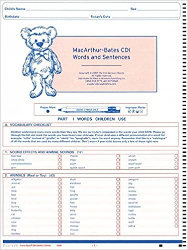

# (PART) Design and Planning {-}

# Measurement {#measurement}

::: {.learning-goals}
🍎 Learning goals: 

* Analyze measurement reliability
* Provide validity arguments
* Reason about tradeoffs between different measures and measure types
* Articulate risks of measurement flexibility and the costs and benefits of multiple measures
* Identify well-constructed survey questions
:::

The goal of an experiment is to make a (maximally precise and unbiased) measurement of a particular causal effect of interest. In this next section of the book, we're going to try to figure out how to do that. This chapter focuses on the topic of measurement.^[As a topic, measurement is actually much less well-discussed in experimental contexts compared with, say, observational studies. As far as we can tell, this is a sociological fact, not a scientific one. No matter whether you can manipulate the world directly (as in an experiment) or whether you are doing observational or quasi-experimental research, good measurement is the name of the game.] To paraphrase @stevens1946, measurement is the practice of putting numbers to things. 

<!-- TODO: LOOK UP PHIL OF SCIENCE REFS ON THIS. -->

No matter where you are working in the sciences, you need to measure things. If you're doing physics or chemistry, you need to be able to measure physical quantities; if you're doing biology you might measure populations or lifespan as well as a host of physical quantities. Proper measurement instruments are incredibly important for this kind of work.^[A lot could be said, of course, about the transformative value of better measurement instruments in the sciences! ] Psychology and the behavioral sciences are no different -- we need proper measurement instruments. The difference is that in psychology, we are typically trying to measure something that's inside the heads of our participants, which we call a **latent construct**. 

Not all measurements are created equal. This point is obvious when you think about physical measurement instruments: a caliper will give you a much more precise estimate of the thickness of a small object than a ruler. One way to see that the measurement is more precise is by repeating it a bunch of times. The measurements from the caliper will likely be more similar to one another, reflecting the fact that the amount of error in each individual measurement is smaller. We can do the same thing with a psychological measurement -- repeat and assess variation -- though as we'll see below it's a little trickier. Measurement instruments that have less error are called more **reliable** instruments.^[Is **reliability** the same as **precision**? Yes, more or less. Confusingly, different fields call these concepts different things [there's a helpful table of these names in @brandmaier2018]. Here we'll talk about reliability as a property of instruments specifically while using the term precision to talk about the measurements themselves.]

When we have a physical quantity of interest, we can assess how well an instrument measures that quantity. But, as we saw in Chapter \@ref(intro), things are much trickier when the construct we are trying to measure can't be assessed directly. We have to measure something observable -- our **operationalization** of the construct -- and then make an argument about how it relates to the construct of interest. We call this argument an argument for the **validity** of the measure.^[We are also going to talk in Chapter \@ref(design) about the validity of manipulations. The way you identify a causal effect on some measure is by operationalizing some construct as well. If this is done badly, the manipulation can be invalid -- meaning the causal effect that's measured doesn't map onto the construct.]  

These two concepts, reliability and validity, provide a conceptual toolkit for assessing how good a psychological measurement instrument is. Let's start by taking a look at an example of the challenge of measuring a particular latent construct, children's early language ability. We can use this example to understand the concepts of reliability and validity. 

::: {.case-study}
🔬 Case study: A reliable and valid measure of children's vocabulary

Anyone who has worked with little children or had children of their own can attest to how variable their early language is. Some children speak clearly and produce long sentences from an early age. Others struggle to produce words but clearly show evidence of understanding. And yet others show deficits in both producing and understanding language. Further, this variation appears to be linked to later outcomes -- children whose very early language processing is slower and whose vocabularies are smaller tend to do worse in school years later [@marchman2008]. Thus, there are many reasons why you'd want to make precise measurements of children's early language ability as a latent construct of interest.^[Of course, you can also ask if early language is a single construct, or whether it is multi-dimensional! For example, does grammar develop separately from vocabulary? It turns out the two are very closely coupled [@frank2021]. This point illustrates the general idea that, especially in psychology, measurement and theory building are intimately related -- you need data to inform your theory, but the measurement instruments you use to collect your data in turn presuppose some theory!]

As with all developmental research, there are many constraints on measurement that are imposed by the age of the children you want to work with. You can't give toddlers a multiple-choice test! So to measure early language ability (to be concrete, let's say for children under two and a half years old), you have roughly three options open. First, you can do some kind of observation of them and transcribe their language production -- this could be a play session in the lab or at home, with an experimenter or with a parent or other caregiver. Second, you could do some kind of direct assessment, e.g. by asking them to point or look at the referent of a word (e.g. "look at the kitty") and record their responses using video, a tablet, or even eye-tracking technology [@frank2016b]. Or, you could ask their parents about their language, for example sending a questionnaire like the MacArthur Bates Communicative Development Inventory (CDI for short), which asks parents to mark words that their child says or understands. CDI forms are basically long checklists of words (and other items, which we'll ignore for now); the first page of an English form is shown in the margin.


```{marginfigure, echo=TRUE}

The first page of the MacArthur-Bates Communicative Development Inventory, a parent report instrument for measuring children's early language.
```

To decide which of these methods to use for a specific study, we need to think through the properties of these measurement instruments -- both in terms of reliability and validity and also in terms of their practicality for a specific research situation. Practicalities matter! For example, observational measurement can be extremely costly in both time and money because it not only requires a visit of some sort (to the home or the lab) but also transcription of speech, which is quite time-consuming -- often taking 5-10 minutes of work to transcribe a single minute of speech. Direct assessment still requires a lab or home visit, but scoring is typically more straightforward. Finally, parent report -- (e)mailing a questionnaire to the parent -- is extremely time- and cost-effective. 

We don't want to use CDI questionnaires if they are a bad measurement instrument. How can we tell? This is where assessment of reliability and validity are critical. In practice, the task of selecting and justifying a measurement instrument comes down to an argument about reliability and validity.


```{r measurement-reliability}
library(wordbankr)
ws <- wordbankr::get_instrument_data(language = "English (American)", 
                                     form = "WS", administrations = TRUE, 
                                     iteminfo = TRUE)

ws_mat <- ws |>
  filter(!longitudinal, type == "word") |>
  mutate(value = value == "produces", 
         even_item = ifelse(num_item_id %% 2 == 0, "even","odd")) |>
  group_by(data_id, even_item) |>
  summarise(prop = mean(value)) |>
  pivot_wider(names_from = even_item, values_from = prop) 

n <- length(unique(ws_mat$data_id))
test_retest <- cor.test(ws_mat$even, ws_mat$odd)$estimate
```

How reliable is the CDI? As we'll discuss more below, there's no single answer to this question. Not only are there multiple ways to compute reliability, but also reliability in practice is going to depend on the population being measured, the fidelity with which the instrument is administered, and other factors. That said, a quick and dirty thing we can do is called a **split half correlation**. We can take a dataset of CDI data [from Wordbank; @frank2017] and split each test in half. Since there are 680 words on the CDI, that means we pretend that each of our `r n` participants took two versions of the CDI, each with 340 items -- one test consists of only the even-numbered items and the other is the odd numbered items. Then we just compute the correlation between each participant's score on the even CDI and the odd CDI. The resulting correlation is very high: $r = `r round(test_retest, digits = 3)`$. So that gives us a sense that CDIs are pretty reliable. 


```{marginfigure, echo=TRUE}

Longitudinal correlations between a child's score on one administration of the CDI and another one several months later. 
```

On the other hand, a stronger test of reliability is a **test-retest** correlation. Our split-half number only tells us about what was happening within a single administration session, but lots of things vary between administration sessions. For example, maybe the child was having a bad day and not producing as much complex language. Comparing correlations across different days removes this source of correlation -- at a cost. The longer you wait between observations the more the child has changed! The figure in the margin shows longitudinal test-retest correlations for two CDIs, showing how correlations start off high and drop off as the gap between observations increases [@frank2021]. Overall, this evidence is comforting. It looks like the CDI shows good reliability ($>.9$) across several methods. 

Given that CDI forms are relatively reliable instruments, are they valid? Well, as a starting point, they certainly have reasonable **face validity** -- they look like they are measuring the construct that they purport to measure. They also arguably have some **ecological validity** in that they measure the child's language (as observed by the parent) in their day-to-day experiences, rather than in a particular lab situation. But how well do they really measure the construct of interest, namely children's early language ability? 

```{marginfigure, echo=TRUE}

Relations between an early form of the CDI (the ELI) and several other measurements of children's early language from both transcripts and direct assessments. Arrows indicate loadings of different measures (boxes) onto a single construct (circle). Numbers give standardized weights [@bornstein1998].
```

A study by @bornstein1998 answered this question via a common measure validation strategy: concurrently administering a variety of measures that are hypothesized to relate to the same construct. The figure in the the margin shows the results of a structural equation model that measures the shared variance between a variety of different measures (critically including examples of the other two methods of assessment we discussed, direct assessment and observational, transcript-based assessments) and a single hypothesized central construct. The relation between the ELI (an early version of the CDI) and the central construct is quite strong: the ELI score correlated closely with the shared variance among all the different measures. Taken together with the reliability evidence, this kind of **concurrent validity** evidence suggests that, if you want to measure early language, the CDI is a pretty good way to do so. 

The story of the CDI is a success story -- it's a relatively inexpensive measure that has some evidence for both reliability and validity. We should celebrate (and also use it as a potential outcome measure in our studies). But there is also plenty more work to do! A critic could very reasonably point out that we haven't shown any evidence that reliability and validity extends across different populations or ages. For any measure, it's important to start by asking whether there is *any* evidence for reliability and validity. But once you have a specific target population in mind, you can also ask how likely it is that the measure will yield reliable and valid data with *that particular population*. Oftentimes you yourself will have to do this measurement work, "checking" that your instruments function appropriately in the particular situation you want to use them. This is sometimes a lot of hard work, but it's an important part of doing good experimental measurement!
:::


## Reliability

```{marginfigure, echo=TRUE}

Precision and bias visualized. The expected precision of measurements from an instrument is its reliabilty. The bias of measurements from an instrument also provide a metaphor for its validity. Figure from @brandmaier2018.
```

Having looked at the CDI as an example, we can now talk more generally about what it means for a measure to be reliable. Reliability is a way of describing the extent to which a measure yields signal relative to noise. Intuitively, if there's less noise, then there will be more similarity between different measurements of the same quantity.^[As the graphic above illustrates, a reliable measure that yields high-precision observations can still be highly biased. We'll talk about bias in a moment when we discuss validity.] Here's the trouble. How do we measure signal and noise? 

### Measurement scales

In the physical sciences, it's common to measure the precision of an instrument by quantifying its coefficient of variation [@brandmaier2018]: 

$$CV = \frac{\sigma_w}{\mu_w}$$
\noindent where $\sigma_w$ is the standard deviation of the measurements within an individual and $\mu_w$ is the mean of those measurements. Imagine we measure the height of a person five times, resulting in measurements of 171cm, 172cm, 171cm, 173cm, and 172cm. Now we can use these measurements to compute the coefficient of variation, which is `r round(sd(c(171,172,171,173,172))/mean(c(171,172,171,173,172)),digits =3)`. Why can't we just do that with psychological measurements? 


```{r measurement-stevens-table}
stevens <- tribble(~Scale, ~Definition, ~Operations, ~Statistics, 
        "Nominal", "Unordered list","Equality","Mode",
        "Ordinal","Ordered list","Greater than or less than", "Median",
        "Interval", "Numerical","Equality of intervals", "Mean, SD",
        "Ratio", "Numerical with zero", "Equality of ratios","Coefficient of variation")

knitr::kable(stevens, caption = "Stevens (1946) table of scale types and their associated operations and statistics.", booktabs = TRUE)
```


Thinking about this question takes us on a detour through the different kinds of measurement scales used in psychological research [@stevens1946]. The height measurements in our example are on what is known as a **ratio** scale: a scale in which numerical measurements are equally spaced and on which there is a true zero point. These scales are common for physical quantities but actually quite infrequent in psychology. More common are **interval** scales, in which there is no true zero point. For example, IQ (and other standardized scores) are intended to capture interval variation on some dimension but 0 is meaningless -- an IQ of 0 does not correspond to any particular interpretation. 

**Ordinal** scales are also commonly used. These are scales that are ordered but are not necessarily spaced equally. For example, levels of educational achievement ("Elementary","High school","Some college","College","Graduate school") are ordered, but there is no sense in which "High school" is as far from "Elementary" as "Graduate school" is from "College." The last type in Stevens' hierarchy is **nominal** scales, in which no ordering is possible either. For example, race is an unordered scale in which multiple categories are present but there is no inherent ordering of these categories. The full hierarchy is presented in \@ref(tab:measurement-stevens-table).

Critically, different summary measures work for each scale type. If you have an unordered list like a list of options for a question about race on a survey, you can present the modal response (the most likely one).It doesn't even make sense to think about what the median was -- there's no ordering! For ordered levels of education, a median is possible but you can't compute a mean. And for interval variables like IQ or "number of correct answers on a math test" you can compute a mean and a standard deviation.^[You might be tempted to think that "number of correct answers" is a ratio variable -- but is zero really meaningful? Does it truly correspond to "no math knowledge" or is it just a stand-in for "less math knowledge than this test requires."] 

But unless you have a ratio scale with a true zero, you can't compute a coefficient of variation. Think about it for IQ scores: currently, by convention, standardized IQ scores are set to have a mean of 100. If we tested someone multiple times and found the standard deviation of their test scores was 4 points, then we could estimate the precision of their measurements as "CV" of 4/100 = .04. But since IQ of 0 isn't meaningful, we could just set the mean IQ for the population to 200. Our test would be the same, and so the CV would be 4/200 = .02. On that logic we just doubled the precision of our measurements by rescaling the test! That doesn't make any sense. 

This digression helps us understand why CV is not a viable measure of the precision of measurements (and hence the reliability of instruments) in psychology: it's because *most psychological measurements are not on ratio scales where CV makes sense*.  

### Paradoxes in reliability

So then how do we measure signal and noise when we don't have a true zero?^[For the most part, we're only going to talk about methods for interval variables here, but there are generalizations of many of these to ordinal and nominal cases. Our goal here isn't to show you all the relevant statistical methods so much as it is to make sure you have a general intuition.] We can still look at the variation between repeated measurements, but rather than comparing that variation between measurements to the mean, we can compare it to some other kind of variation (for example between people). 

This intuition gives us the intra-class correlation coefficient (ICC): 

$$ICC = \frac{\sigma^2_b}{\sigma^2_w + \sigma^2_b}$$
\noindent where $\sigma^2_w$ is the within-subject variance in measurements and $\sigma^2_b$ is the between-subject variance in the measurements. So now instead of comparing variation to the mean, we're comparing variation on one dimension (between person) to total variation (within and between person). 

If you think about it, this is more or less what we were doing when we computed both **split-half** and **test-retest** reliabilities for the CDI in our case study above. In the split half case, we took the correlation between two halves of the test, computed across individuals. That correlation looks at the covariance between the two halves, scaled by the variance *across individuals* of each half. So now we know why that split half reliability number was so high ($r = `r round(test_retest, digits = 3)`$)! We were looking at the comparison of the variation between one individual's answers and the variation between tons of different kids whose answers are all over the place.^[If this intuition about the correlation doesn't make sense, @rodgers1988 give a really nice treatment of different ways of looking at a correlation.] Same thing was true with the test-retest example: we were computing the covariation between this individual's two CDI scores, scaled by the variation across *all the individuals in the sample.*

```{r measurement-reliability-redux}
ws_mat_16 <- ws |>
  filter(!longitudinal, type == "word", age == 16, 
         mom_ed %in% c("Primary","Some Secondary","Secondary")) |>
  mutate(value = value == "produces", 
         even_item = ifelse(num_item_id %% 2 == 0, "even","odd")) |>
  group_by(data_id, even_item) |>
  summarise(prop = mean(value)) |>
  pivot_wider(names_from = even_item, values_from = prop) 

test_retest_16 <- cor.test(ws_mat_16$even, ws_mat_16$odd)$estimate
```

This example leads us to a major issue with calculating reliabilities using the relative approach: *reliability numbers computed in this way are always relative to the variation in the sample*. So if the sample had less variability, reliability would decrease. We can see that in the CDI data by restricting our sample to only 16-month-olds (our prior sample had 16 -- 30-month-olds) with low maternal education. Within this more restricted subset, our reliability drops to $r = `r round(test_retest_16, digits = 3)`$ -- still very high but not quite as high as within the full sample. 

But we can construct a much more worrisome version of the same problem. Say we are very sloppy in our administration of the CDI and create lots of between subjects variability, perhaps by giving different instructions to different families. This practice will actually *increase* our estimate of split-half reliability -- while the within-participant variability will remain the same, the between-participant variability will go up! You could call this a "reliability paradox" -- sloppier data collection can actually lead to higher reliabilities.^[Much of this discussion comes from a nice blogpost by Steve Luck: https://lucklab.ucdavis.edu/blog/2019/2/19/reliability-and-precision. If you get interested in this topic, a fascinating article by @hedge2018 shows why many robust cognitive tasks like the Stroop task nevertheless show low reliability by the definition we've been using here: they don't vary very much between individuals!] 

More generally, we need to be sensitive to the sources of variability we're quantifying reliability over -- both the numerator and the denominator. If we're computing split-half reliabilities, typically we're looking at variability across test questions (from some question bank) vs. across individuals (from some population). Both of these sets matter -- if the population is more variable *or* the questions are less variable, we'll get higher reliability.^[We're not going to cover this, but all the same concepts come up when you quantify the reliability of different observers' ratings of the same stimulus (**inter-annotator reliability**), say for example when you have two coders rate how aggressive a person seems in a video. The most common measure of inter-annotator aggreement is a categorical measure called Cohen's $\kappa$, for categorical aggreement, but you can use ICCs and many other measures, and they fall prey to the same paradoxes we've discussed here for measure reliability.]  

In sum, it's really important to know something about the reliability of the  measurement instrument that you want to use. But it's also a mistake to think that there's one true reliability for that measure. Rather, reasoning about whether a measure is reliable enough for your purposes means you need to think about both the numerator and the denominator for that estimate! 

### Practical advice for computing reliability

All of this theoretical talk about reliabilities is somewhat distressing, and doesn't alleviate the need to compute numbers. What should a practicing researcher do? Here are a few pieces of advice for choosing (and contextualizing) reliability computations. 

First, ignorance is not bliss. If you don't know the reliability of your measures for an experiment, you risk wasting your and your participants' time. As we'll see in Chapter \@ref(sampling), the necessary sample size for your study is intimately related to the degree of within- and between-participant variance -- the same quantities that determine reliability. A higher reliability measure will lead to more precise measurements of a causal effect of interest and hence smaller sample sizes. Low-reliability measures are also a graveyard for individual differences studies. One author (MCF) spent several fruitless months in graduate school running dozens of participants through batteries of language processing tasks and correlating the results across tasks. This exercise was a waste of time because most of the tasks were of such low reliability that, even had they been highly correlated with another task, this relationship would have been almost impossible to detect without a huge sample size.^[One rule of thumb that proves very helpful for individual difference designs of this sort is that the maximal correlation that can be observed between two variables $x$ and $y$ is the square root of the product of their reliabilities: $\sqrt{r_x r_y}$. So if you have two measures that are reliable at .25, the maximal measured correlation between them is .25 as well!]

Second, test-retest reliability is generally more conservative (and hence more useful) than split-half reliability. All the old textbooks knew this, and simply tried to derive other measures as stand-ins.^[Because we are experimentalists, we get to collect new data, so doing a test-retest preliminary study is a totally reasonable option, rather than just blithely moving forward with our planned experiment.] In test-retest reliability, your within-participant reliability computation includes variation across different testing sessions (and sometimes different versions of a test, since some tests are hard to repeat). Since others participants' scores are produced by different test sessions as well, adding in this extra variability makes the comparison to between-participant variability much fairer. It's hard work to do real test-retest reliability estimates, but if you plan on using a measure more than once, it will likely be worth-while, not least because your estimates of reliability may make your measure more likely to be adopted by others.^[Don't be fooled by the use of Cronbach's $\alpha$, a commonly reported measure for reliability. $\alpha$ is just split-half reliabilty averaged across all possible splits. It has all the same problems of split-half reliability. What's more, people often report $\alpha$ as an index of internal consistency on the idea that it reflects the relatedness of test items to one another. This is just wrong [@sijtsma2009]!]

Third, if you have multiple measurement items as part of your instrument and they vary substantially, make sure you evaluate how they contribute to the reliability of the measure. This could happen because you have an inventory comprised of different survey items or because you have multiple vignettes or test stimuli that vary in content or difficulty. In this common situation, some of these items may not contribute to the reliability of your measure -- and some may even detract. This could be because some items don't measure the same construct as the rest, as we'll discuss below, or it could be because they are noisy. There are many statistical methods that you can use to find such items and remove them from your measure, ranging from the simple (e.g., visualizing distributions to scan for floor and ceiling effects and looking for items that do not correlate with others) to the more complex (e.g., structural equation models). The development of measurement models  for binary tests, item response theory [@embretson2013] can be used to find test items that show limited discrimination between participants of high and low ability. 

## Validity

In Chapter \@ref(intro), we talked about the process of theory building as a process of describing the relationships between constructs. But for the theory to be tested, the constructs must be measured so that the posited relationships between them can be probed.^[If you can't measure a construct, then its role in the theory may be more questionable. But there can be a role for unmeasured -- and unmeasurable -- entities in a theory!] Measurement and measure construction is therefore intimately related to theory construction, and the notion of validity is central. 

A valid measure is one that measures the construct of interest.^[In the target diagram above, invalidity is pictured as bias -- the holes in the target are tightly grouped but in the wrong place. That can be a helpful guide to thinking about validity, but it also breaks the target metaphor. If distance on the target is variation in the measurement, then the "bias" pictures actually show bias in the measurement, e.g. systematic over- or under-estimation of the trsue quantity.]    That sounds simple, but really, how can you tell, given that the construct of interest is unobserved? The answer -- given by @cronbach1955 -- is that there is no single test of the validity of a measure. Rather, the measure is valid if there is evidence that it fits into the nomological network (the theory). 

If you look in a standard research methods textbook, there will be names for a large and somewhat variable number of different kinds of validity. These terms are used in very confusing ways! Below are some definitions, but keep in mind that these these are just names for specific ways that a measure might not match up with a construct, and they are not an exhaustive list.  

* **Face validity**: The measure looks like the construct, such that intuitively it is reasonable that it measures the construct. Example: Even if a child's height is correlated with their early language ability, we might be skeptical of this measure due to its lack of face validity.
* **Ecological validity**: The measure incorporates how the construct is used in people's lives. Example: Language measures that look at the diversity of language used in children's productions at home might be more ecologically valid than a processing measure from a tablet-based game.   
* **Internal validity**: Usually used negatively. A "challenge to internal validity" is a description of a case where the measure is administered in such a way as to weaken the relationship between measure and construct.^[Sometimes this concept is described as only being relevant to the validity of a manipulation, e.g. when the manipulation of the construct is confounded and some other psychological variable is manipulated as well.] Example: CDI instructions are given using confusing or overly complex language, leading lower-educated parents to misinterpret the questionnaire and hence for the measure to underestimate language ability in some children. 
* **Convergent validity**: The classic strategy for showing validity is to show that a measure relates (usually, correlates) with other putative measures of the same construct. When these relationships are measured concurrently, this is sometimes called **concurrent validity**. This evidence is most convincing when the other measures themselves have validity evidence.^[This idea of convergent validity is precisely the circularity of Cronbach and Meehl's "nomological network" idea -- a measure is valid if it relates to other valid measures, which themselves are only valid if the first one is! The measures are valid because the theory works, and the theory works because the measures are valid.] Example: CDI scores correlate with word-recognition eye-tracking experiments. 
* **Predictive validity**. If the measure predicts other later measures of the construct; often used in lifespan and developmental studies where it is particularly prized for a measure to be able to predict meaningful life outcomes in the future. Example: relation of CDI scores at age 2 to reading scores during elementary school.^[Both concurrent/convergent and 
* **Divergent validity**. If the measure can be shown to be distinct from measure(s) of a different construct, this evidence can help establish that the measure is specifically linked to the target construct. Example: CDI scores are more related to word recognition reaction times than reaction times in a visual search task. 

\noindent As we mentioned above, some of these forms of validity can also be used as descriptions of the validity of a manipulation (rather than a measure).^[We discuss this issue in more depth in Chapter \@ref(design).] 

In our opinion, the most compelling way to think about validity is not to enumerate different varieties of validity as though they are separable from one another. Instead, the users of a measure should make an argument about why a measure is valid, calling on various different sources of support [@kane1992]. 

The idea of "argument-based validity" is really just a reminder for researchers -- especially including experimentalists, who have a worrisome tendency to make up ad hoc measures on the fly -- to think hard about validity and report their thinking about it. Simply reasoning about what construct you want to measure, how your measure relates to the construct, and whether your measure is a valid measure of the construct will go a long way towards ensuring that you make good decisions about measurement. On the flip side, @flake2020 describe what they call "questionable measurement practices" -- a suite of practices that can undermine the contribution of a study by reducing validity. 

Table \@ref(tab:flake-questions) gives our adaptation of the set of questions they offer up to try and provoke thoughtful reporting of measurement practices. One big thing on their mind is that researchers have been known to modify their scales and their scale scoring practices (say, omitting items from a survey or rescaling responses) after data collection. This doesn't have to be a bad thing -- sometimes it is justified -- but it clearly needs to be disclosed, and it may call statistical inferences into question (see Chapter \@ref(prereg)). 

```{r flake-questions}
# 
# Questions about validity. From @flake2020.
flake <- tribble(~Question, ~`Information to Report`,
                 "What is your construct?", "Define construct, describe theory and research.",
                 "What measure did you use to operationalize your construct?", "Describe measure and justify operationalization.",
                 "Did you select your measure from the literature or create it from scratch?","Justify measure selection and review evidence on reliability and validity  (or disclose the lack of such evidence).",
                 "Did you modify your measure during the process?", "Describe and justify any modifications; note whether they occurred before or after data collection.",
                 "How did you quantify your measure?", "Describe decisions underlying the calculation of scores on the measure; note whether these were established before or after data collection and whether they are based on standards from previous literature.")

knitr::kable(flake, caption = "Questions about measurement that every reseacher should answer in their paper. Adapted from Flake & Fried (2020).", booktabs = TRUE)
```


::: {.accident-report}
⚠️ Accident report: Talk about flexible measurement!

The Competitive Reaction Time Task (CRTT) is a lab-based measure of aggression. Participants are told that they are playing a reaction-time game against another player and are asked to set the parameters of a noise blast that will be played to their opponent. Unfortunately, in an analysis of the literature using CRTT, @elson2014 found that different papers using the CRTT use dramatically different methods for scoring the task. Across trials, both the volume and duration of the noise blast were sometimes analyzed. Sometimes these scores were transformed (via logarithms) or thresholded. Sometimes they were combined into a single score. Elson was so worried by this flexibility, he created a website, [http://flexiblemeasures.com](), to document the variation he observed. 

```{marginfigure, echo=TRUE}

Data on the number of publications using CRTT and the number of different quantifications of CRTT, plotted cumulatively until 2016. Image from [http://flexiblemeasures.com]().
```

As of 2016, Elson had found 130 papers using the CRTT. And across these papers, he documented an astonishing 157 quantification stratgies. One paper reported ten different strategies for extracting numbers from this measure! More worrisome still, in their work, Elson and colleagues found that these decisions made a major difference to whether the findings of studies were statistically significant. 

This examination of the use of the CRTT measure has several implications. First, and most troublingly, there may have been undisclosed flexibility in the analysis of CRTT data across the literature, with investigators taking advantage of the lack of standardization to try many different analysis variants and report the one most favorable to their own hypothesis. Second, it is unknown which quantification of CRTT behavior is in fact most reliable and valid. Since some of these variants are presumably better than others, researchers are effectively "leaving money on the table" by using suboptimal quantifications. Finally, as a consequence, when if reserachers adopt the CRTT, they find much less guidance from the literature on what quantification to adopt. 
:::

## How to select a good measure?

Ideally you want a measure that is reliable and valid. How do you get one? An important first principle is to use a pre-existing measure. Perhaps someone else has done the hard work of compiling evidence on reliability and validity, and in that case you will most likely want to piggyback on that work. Standardized measures are typically broad in their application and so the tendency can be to discard these because they are not tailored for our studies specifically. But the benefits of a standardized measure are substantial. Not only can you justify the measure using the prior literature, you also have an important index of population variability by comparing absolute scores to other reports.^[Comparing absolute measurements is a really important trick for "sanity-checking" your data. If your participants are way less accurate than the ones in the paper you're following up, that may be a signal that something has gone wrong.] If you don't use someone else's measure, you'll need to make one up yourself. Most experimenters go down this route at some point, but if you do, remember that you will need to figure out how to estimate its reliability and how to make an argument for its validity!

### What to measure? 

We can measure almost anything about experimental participants' behavior or even their physiology. We could do an experiment on children's exploratory play and measure the number of times they interact with another child [@ross1989], or an experiment on aggression where we measure the amount of hot sauce [@lieberman1999]. Yet most of the time we choose a relatively small set to focus on: asking survey questions, collecting choices and reaction times, and measuring physiological variables like eye-movements. Besides following these conventions, how do we choose the right measurement type for a particular experiment? 

There's no hard and fast rule about what aspect of behavior to measure, but here we will focus on two dimensions that can help us organize the broad space of possible measure targets.^[Some authors differentiate between "self-report" and "observational" measures. This distinction seems simple on its face, but actually gets kind of complicated. Is a facial expression a "self-report"? Language is not the only way that people communicate with one another -- many actions are intended to be communicative [@shafto2012].] The first of these is the continuum between simple and complex behaviors (visualized in the margin figure). The second is the focus on explicit, voluntary behaviors vs. implicit or involuntary behaviors.  

```{marginfigure, echo=TRUE}

Often choosing a measure can be consolidated into a choice along a continuum from simple measures that provide a small amount of information but are quick and easy to repeat and those that provide much richer information but require more time. 
```

The simplest measurable behaviors tend to be button presses, for example:

* pressing a key to advance to the next word in a word-by-word self-paced reading study [e.g., @warren2002]
* selecting "yes" or "no" in a lexical decision task [e.g., @ratcliff2004]
* making a forced choice between different alternatives to indicate which has been seen before [e.g., @fiser2001]

These specific measures -- and many more like them -- are the bread and butter of many cognitive psychology studies. Because they are quick and easy to explain, these tasks can be repeated over many trials. They can also be executed with a wider variety of populations including with young children and sometimes even with non-human animals with appropriate adaptation. (A further benefit of these paradigms is that they can yield useful reaction time data, which we discuss further below).  

In contrast, a huge range of complex behaviors have been studied by psychologists, including:

* open-ended verbal interviews 
* written expression, e.g. via handwriting or writing style
* body movements, including gestures, walking, and dance [@kirsh2010]
* artifact building 

 <!-- TODO: add citations [bargh, goldin meadow, judy fan citation] -->

There are many reasons to study these kinds of behaviors. First, the behaviors themselves may be examples of tasks of interest (e.g., in studies of tower building). Or, as in the case of studies of skilled typing [@rumelhart1982], the behavior may stand in for other even more complex behaviors of interest. Researchers may also feel that the ecological validity of their measure makes up for the complexity of converting the behavior into a numerical measurement. Of course, that is the major issue with studying complex behaviors: they typically afford a huge variety of different measures. So any experiment that uses a particular measurement of a complex behavior will typically need to do significant work up front to justify the choice of that measurement and provide some assurance about its reliability. Further, it is often much more difficult to have a participant repeat a complex behavior many times under the same conditions -- imagine asking someone to build a block tower hundreds of times! Thus, the choice of a complex behavior is often a choice to forego a large number of simple trials for a small number of more complex trials. 

Our view is that complex behaviors can be useful to study either at the beginning or the end of a set of experiments. At the beginning of a set of experiments, they can provide inspiration about the richness of the target behavior and insight into the many factors that influence it. And at the end of a set of experiments, they can provide an ecologically valid measure to complement a reliable but more artificial, lab-based behavior. But as the primary measure across a multi-experiment set they are often unweildy. As a rule of thumb, the more complex the behavior, the more it will vary across individuals and the more environmental and situational factors will affect it. These can be important parts of the phenomenon, but they will also be nuisances that are difficult to get under experimental control. 

The second dimension of organization for measures is the difference between implict and explicit measures. An explicit measure provides a measurement of a behavior that a participant has conscious awareness of -- for example, the answer to a question. In contrast, implicit measures provide measurements of psychological processes that participants are unable to report (or occasionally, unwilling to).^[Implicit/explicit is likely more of a continuum, but one cut-point is whether the participants' behavior is considered intentional: that is, participants *intend* to press a key to register a decision, but they likely do not intend to react in 300 as opposed to 350 milliseconds due to having seen a prime.] Implicit measures, especially reaction time, have long been argued to reflect internal psychological processes [@donders1969]. They also have been proposed as measures of qualities such as racial bias that participants may have motivation not to disclose [@greenwald1998]. 

There are also of course a host of physiological measurements available. Some of these measure eye-movements, heart rate, or skin conductance, which can be linked to aspects of cognitive process. Others reflect underlying brain activity via the signals associated with MRI, MEG, NIRS, and EEG measurements. These methods are outside the scope of this book, though we note that the measurement concerns we discuss here are entirely germane [e.g., @zuo2019].

Many tasks produce both accuracy and reaction time data. Often these trade off with one another in a classic **speed-accuracy tradeoff**: the faster participants respond, the less accurate they are. For example, to investigate racial bias in policing, @payne2001 showed US college students a series of pictures of tools and guns, proceeded by a prime of either a White face or a Black face. In a first study, participants were faster to identify weapons when primed by a Black face but had similar accuracies. A second study added a response deadline to speed up judgements: this manipulation resulted in equal reaction times across conditions but greater errors in weapon identification after Black prime faces. These studies likely revealed the same phenomenon -- some sort of bias to associate Black faces with weapons -- but the design of the task moved participants along a speed accuracy tradeoff, yielding effects on different measures. One way of describing the information processing underlying this tradeoff is given by drift diffusion models, which allow joint analysis of accuracy and reaction time [@voss2013]. Used appropriately, drift diffusion models can provide a way to remove speed-accuracy tradeoffs and extract more reliable signals from tasks where accuracy and reaction time are both measured (see @johnson2017 for an example of DDM on a weapon-decision task). 

The choice of what to measure is not an easy one, and depends on a host of concerns -- first and foremost the construct being studied. That said, we have a bias towards simple, explicit behaviors as a starting point. Work using these measures, which are often the least ecologically valid, can then be enriched with implicit measures or measurements of more complex behaviors. In this discussion, however, we have only briefly touched on the most popular simple, explicit tool in the psychologist's toolkit: survey questions. Our next section deals with survey measures in more detail. 

### Survey measures

Whole books have been written about how to design good survey questions. We are not primarily focused here on survey research, but sometimes such questions are an important part of experimental measurement so we'll share a few best practices, primarily derived from @krosnick2010. 

Treat survey questions as a conversation. This is mostly common sense, but the easier your items are to understand, the better. Don't repeat variations on the same question unless you want different answers! Try to make the order reasonable. The more you include "tricky" items the more you invite tricky answers to straightforward questions. We'll talk in Chapter \@ref(collection) about manipulation checks and their strengths and weaknesses.

Open-ended survey questions can be quite rich and informative, especially when an appropriate coding scheme is developed in advance and responses are categorized into a relatively small number of types. On the other hand, they present practical obstacles because they require coding (often by multiple coders to ensure reliability of the coding). Further, they tend to yield nominal data, which are often less useful for quantitative theorizing. Our view is that open-ended questions are a useful tool to add nuance and color to the interpretation of an experiment.

Especially given their ubiquity in commercial survey research, Likert scales with a fixed number of response items are a simple and conventional way of gathering data on attitude and judgement questions. Bipolar scales are those in which the endpoints represent opposites, for example the continuum between "strongly dislike" and "strongly like." Unipolar scales have one neutral endpoint, like the continuum between "no pain" and "very intense pain." Survey best practices suggest that reliability is maximized when bipolar scales have seven points and unipolar scales have five. Labeling every point on the scale with verbal labels is preferable to labeling only the endpoints.^[One important question is whether to treat data from Likert scales as ordinal or interval. It's extremely common (and convenient) to make the assumption that Likert ratings are interval, allowing the use of standard statistical tools like means, standard deviations, linear regression, and the like. The risk in this practice comes from the possibility that scale items are not evenly spaced -- for example, on a scale labeled "never","seldom", "occasionally","often","always," the distance from "often" to "always" may be larger than the distance from "seldom" to "occasionally." In practice, you can choose to use regression variants that are appropriate, e.g. ordinal logistic regression and its variants, or they can attempt to assess and mitigate the risks of treating the data as interval. If you choose the second option, it's definitely a good idea to look carefully at the raw distributions for individual items (see Chapter \@ref(visualization)) to see if their distribution appears approximately normal and not highly skewed or censored. You should also consider the names you give to your scale up front to try to minimize these issues.] Recently some researchers have begun to use "visual analog scales" (or sliders) as a solution. We don't recommend these -- the distribution of the resulting data is often anchored at the starting point or endpoints, and a meta-analysis shows that are quite a bit lower than Likert scales in reliability (REF Krosnick).

```{marginfigure}
1 
Strongly agree 

A standard Likert scale, following best practices. 
```

It rarely helps matters to add a "don't know" or "other" option to survey questions. These are some of a variety of practices that encourage **satisficing**, where survey takers give answers that are good enough but don't reflect substantial thought about the question. Another behavior that results from satisficing is "straight-lining" -- that is, picking the same option for every question. In general, the best way to prevent straight-lining is to make surveys relatively short, engaging, and well-compensated. The practice of "reverse coding" to make the expected answers to some questions more negative can block straight-lining, but at the cost of making items more confusing [often by introducing pragmatically infelicitous negation; @nieuwland2008]. Some obvious formatting options can reduce straight-lining as well, for example placing scales further apart or on subsequent (web) pages. 

In sum, survey questions can be a helpful tool for eliciting graded judgments about explicit questions. The best way to execute them well is to try and make them as clear and easy to answer as possible. 

## The temptation to measure lots of things

If one measure is good, shouldn't two be better? Many experimenters add multiple measurements to their experiments.^[As usual, we want to qualify that we are only talking about randomized experiments here! In observational studies, often the point is to measure the associations between multiple measures so you typically *have* to include more than one. We've also done plenty of descriptive studies -- these can be very valuable. In a descriptive context, often the goal is to include as many measures as possible so as to have a holistic picture of the phenomenon of interest.] The logic is often simple: more data are better. Sometimes the measures are multiple measures of the same construct; other times these are measures of distinct constructs. 

How should you navigate this issue? The decision whether to include multiple measures is an aesthetic and practical issue as well as a scientific one. Throughout this book we have been advocating for a viewpoint in which experiments should be as simple as possible. For us, the best experiment is one that shows that a simple and valid manipulation affects a single, reliable and valid measure. So we'll try to talk you out of using multiple measures here, but if we fail, then maybe multiple measures are appropriate for your experiment. 

First, make sure that including more measures doesn't compromise each individual measure. This can happen via fatigue or carryover effects. For example, if a brief attitude induction is followed by multiple questionnaire measures, it is a good bet that there is likely to be "fade-out" of the intervention. Further, even if a condition manipulation has a long duration effect on participants, survey fatigue may lead to less meaningful responses to later questions [@herzog1981].

Second, consider whether you have a strong prediction for each measure, or whether you are simply looking for more ways to see an effect of your manipulation. As we've discussed, we think of an experiment as a "bet." On that viewpoint, theories are best tested by observing measurements that they predict but that are low probability according to others. The more measures you add, the more bets you are making but the less value you are putting on each. In essence, you are hedging your bets and so the success of any one bet is less convincing.^[On the other hand, if you can successfully win a whole series of bets, that can be very convincing evidence!]

Third, if you include multiple measures in your experiment, you need to think about how you will intepret divergent results. Imagine you have experimental participants engage in a brief written reflection that is hypothesized to affect a construct (vs a control writing exercise, say listing meals). If you include two measures of the connstruct of interest and one shows a larger effect, what will you conclude? It may be tempting to assume that the one that shows a larger effect is the "better measure" but the logic is circular -- it's only better if the manipulation affected the construct of interest, which is what you were testing in the first place! Including multiple measures because you're uncertain which one is more related to the construct indulges in this circular logic, since the experiment often can't resolve the situation.^[Except where the manipulation is has been independently investigated with another measure and there is good evidence that it affects the construct!] A much better move in this case is to do a preliminary study of the reliability and validity of the two measures so as to be able to select one as the experiment's primary endpoint. 

The more expensive the experiment, the less likely it is to be repeated to gather a new measurement of the effects of the same manipulation. Thus, larger studies present a stronger rationale for including multiple measures. In contrast, short studies are often easier to repeat multiple times with multiple measures. 

If you do include multiple measures, selective reporting of significant or hypothesis-aligned measures becomes a risk. For this reason, preregistration and appropriate reporting of all outcomes becomes even more important. This issue has received a lot of attention in the medical literature. Clinical trials often involve interventions that can have effects on many different measures; imagine a cancer treatment that might affect mortality rates, quality of life, tumor growth rates, etc. Further, such trials are extremely expensive. So there is a strong rationale for including more measures. On the othe

A final reason to consider multiple measures is if you intend the design of your study to provide differential validity evidence for your experimental manipulation. That is, if you want to show that your induction affects one construct but not another, it will be critical to measure both constructs. 

## Chapter summary

In olden times, all the psychologists went to the same conferences and worried about the same things. But then a split formed between different groups. Educational psychologists and psychometricians thought a lot about how different problems on tests had different measurement properties. They began exploring how to select good and bad items, and how to figure out people's ability abstracted away from specific items. This led to a profusion of interesting ideas about measurement and modeling, but these ideas mostly got adopted in observational research.  

Cognitive and social psychologists, on the other hand, spurned measure validation and item-level variation. Cognitive psychologists did lots of trials, all generated from the same basic template. They measured quantities of interest with high precision just by generating tons of trials, but they didn't really worry about tests of measure validity or experimental reliability. Social psychologists also didn't worry as much about these issues and spent more time on issues of ecological validity in their experiments. 

These sociological differences between fields has led to an unfortunate divergence, where experimentalists often do not recognize the value of the conceptual tools developed in observational fields, and hence fail to reason about the reliability and validity of their measures in ways that can help them make better experimental measurements. The fundamental insight of the psychometric perspective is that the constructs we study as psychologists are latent, rather than observed. So when we attempt to measure these constructs, we need to understand the properties of our measures and how we hypothesize that they connect to the constructs of interest. As we said in our discussion of reliability, ignorance is not bliss. Even if you fail to make explicit assumptions about how your measure functions and how it connects to your construct of interest, your adoption of defaults still constitutes a choice. Much better to think these choices through!


<!-- For example, by treating your experimental items as interchangeable, you may  -->


<!-- CLIPPINGS -->
<!--  And if we are computing test-retest reliability, then we really need to think about what it means to give the same test twice -- how similar are these two versions of the same test? -->

<!-- what does it mean to measure the same quantity more than once? This question has an obvious answer for physical characteristics -- imagine using a ruler to measure your height twice -- but is much more subtle for psychological constructs. After all, you shouldn't give the same test to your students twice and expect to see the same scores the second time!  -->

<!-- Psychophysicists always knew that they needed to infer a latent relationship. As they got better at doing this, they fit models that included parameters of the decision process (for example, a "lapse" parameter to capture inattention) as well as the quantities of interest. And because they typically fit these curves within individual subjects, these parameters were participant-level estimates. But the models that fit these curves were often specific to particular metric relationships and not appropriate for increasingly complicated domains. -->

<!-- @clark1973 scolded them about the problematic statistical inferences that could result from forgetting to model items and this guidance has reappeared in recent exhortations to Keep It Maximal! [@barr2013]. But as far as I can tell, no one really talks about modeling items in more detail *in order to learn more about what is in people's heads*. -->
