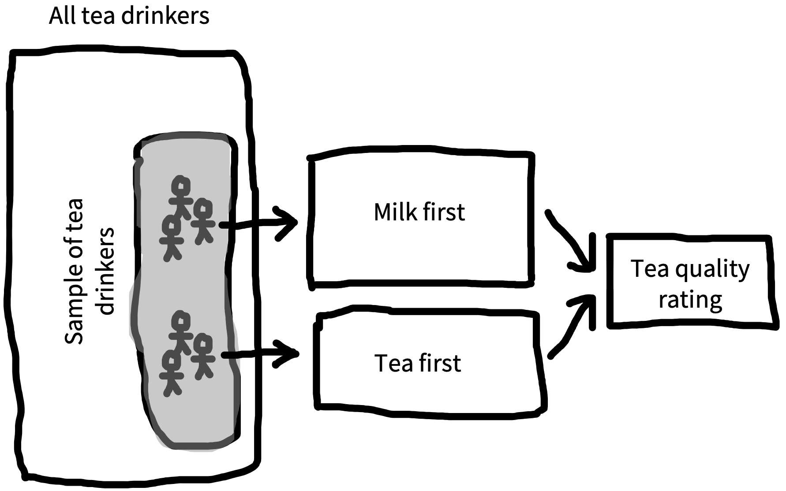

# (PART) Statistics {-}

# Estimation {#estimation}

::: {.box data-box="learning_goals"}
- Estimate the causal effect of an experiment
- Discuss differences between frequentist and Bayesian estimation
- Reason about standardized effect sizes and their strengths and weaknesses 
:::

In the first section of this book, our goal was to set up some of the theoretical ideas that motivate our approach to experimental design and planning. We introduced our key thesis, namely that experiments are about measuring causal effects. We also began to discuss some of our key themes, including precision of measurement, reduction of bias, and generalization across populations. 

In this next section of the book -- treating statistical topics -- we will integrate these ideas with an analytic toolkit for **estimating** effects, **quantifying the size and precision** of these estimates (this chapter), making **inferences** about the evidence for such effects (Chapter \@ref(inference)), and making **models** for estimation and inference in more complex settings (Chapter \@ref(models)). Although this book is not a statistics text, we hope that these chapters provide some practical foundations for beginning the statistical analysis of your experimental data.


::: {.box data-box="case_study" data-title="The Lady Tasting Tea"}
The birth of modern statistical inference arose from the age old conundrum of how to best make a cup of tea. Sir Ronald Fisher was apparently at a party when a lady declared that she could tell the difference when tea was added to milk vs. milk to tea. Rather than taking her at her word, Fisher devised an experimental and data analysis procedure to test her claim.

The basic schema of the experiment was that the lady would have to judge a set of new cups of tea and sort them into milk-first vs. tea-first sets. Her data would then be analyzed to determine whether her level of correct choice exceeded that expected by chance. While this process now sounds like a quotidian experiment that might be done on a cooking reality show, it seems unremarkable in hindsight only because it set the standard for the way science was done going forward.

The important and unusual element of the experiment was its treatment of potential design confounds such which cup of tea was prepared first, which cup of tea was presented first, or the material that the cups were made out of. Prior experimental practice would have been to try to equate all of the cups as closely as possible, decreasing the influence of confounds. Fisher recognized that this strategy was insufficient because of the presence of unobserved confounders. Only by randomizing all other aspects of the experiment could he make strong causal inferences about the treatment (milk then tea vs. tea then milk). We discussed the causal power of random assignment in Chapter \@ref(experiments) -- this experiment is a key touchstone in the popularization of randomized experiments!
:::


## Estimating a quantity

If experiments are about estimating effects, how do we actually use our experimental data to make these estimates? For our example we'll design a slightly more modern version of Fisher's experiment, shown in Figure \@ref(fig:estimation-expt).^[An important piece of context for the work of Ronald Fisher, Karl Pearson, and other early pioneers of statistical inference is that they were all strong proponents of eugenics. Fisher was the founding Chairman of the Cambridge Eugenics Society. Pearson was perhaps even worse, an avowed Social Darwinist who believed fervently in Eugenic legislation. These views are repugnant.] 


```{r estimation-expt, fig.cap="The structure of our tea tasting experiment.", fig.width=5}

```

Our causal theory is that the tea quality is affected by milk-tea ordering, so we'll test that by rating tea quality both milk-first and tea-first, represented by a DAG like the one in Figure \@ref(fig:estimation-dag). Our intended population to generalize to is the set of all tea drinkers, and towards that goal we sample a set of tea-drinkers. In practice, we might do a field trial in a cafe in which we approach patrons and ask them to participate in our experiment in exchange for a free cup of tea. Although this sample size is probably too small to get precise estimates, for the purpose of this example, we'll sample 18 tea drinkers -- nine in each condition. 


```{r estimation-dag, fig.cap="A directed acyclic graph representing our causal theory of tea quality.", fig.margin=TRUE}
knitr::include_graphics("images/estimation/tea-dag.png")
```

As our manipulation, we follow Fisher in randomly assigning participants (who of course should give consent to participate) into to one of our two conditions: milk-first and tea-first.^[Technically, randomized experiments were not invented by Fisher. Perhaps the earliest example of a (somewhat) randomized experiment was a trial of scurvy treatments in the 1700s [@dunn1997]. @peirce1884 also report a strikingly modern use of randomized stimulus presentation (via shuffling cards). Nevertheless, Fisher's statistical work popularized randomized experiments throughout the sciences, in part by integrating them with a set of analytic methods.] This design is a between-participants design (so each participant gets only one cup of tea). They receive their cup of tea and taste it. Then as our measure, we ask for a rating of the tea on a continuous scale from 1 (terrible) to 7 (delicious).^[Right now we're going to assume that our ratings are just simple numerical values and not worry about the fact that they come from a rating scale that is bounded (e.g., can't go above 7). If you're curious about **Likert scales** (the name for discrete numerical rating scales), we'll talk a bit more about them in Chapter \@ref(measurement).]


```{r estimation-data, fig.margin=TRUE, fig.cap="Schematic data from the tea tasting experiment.", out.width="80%"}
knitr::include_graphics("images/estimation/data.png")
```

A sample dataset from our experiment is shown in Figure \@ref(fig:estimation-data). Eventually, we'll want to estimate the effect of milk-first preparation on quality ratings (our effect of interest). But for now, our goal will be to estimate the quality of the tea when it is milk-first [the better way, according to some data; @kennedy2003]. More formally, we want to use our **sample** of 9 milk-first tea judgments to estimate a number that we can't directly observe, namely the true perceived quality of all possible milk-first cups. We'll call this number a **population parameter** for reasons that will become clear in a moment.

We'll try to go easy on notation but some amount will hopefully make things clearer. We will use $\theta_{\textrm{M}}$ ("theta") to denote the parameter we want to estimate (the **population parameter**) and $\widehat{\theta}_{\textrm{M}}$, its **sample estimate**.^[Statisticians use "hats" like this to denote estimates from a specific sample. One way to remember this is that the "person in the hat" is wearing a hat to dress up as the actual quantity. Feel free to ignore this mnemonic; it helps us.]

### Maximum likelihood estimation

OK, you are probably saying, if we want our estimate of milk-first quality, shouldn't we just take the average rating across the 9 cups of milk-first tea? The answer is yes. But let's unpack that choice: taking the sample mean as our estimate $\widehat{\theta}_{\textrm{M}}$ is an example of an estimation approach called **maximum likelihood estimation**. In general terms, maximum likelihood estimation is a two-step process.

First, we assume a **model** for how the data were generated.^[This sense of "model" is actually a formal instantiation of the type of causal model we discussed in Chapter \@ref(experiments). As you get deeper into causal modeling, typically what you do is define a causal "story" for the statistical process that generated a dataset, using both DAGs and the kinds of probability distributions we define below.] This model is specified in terms of certain population parameters. In our example, the model is as simple as they come: we just assume there is some average level of tea quality and that the measurements vary around it.


```{r estimation-ml, fig.margin= TRUE, fig.cap="The best-fitting normal distribution for data from the milk-first condition.", fig.width=5}
knitr::include_graphics("images/estimation/maximum-likelihood.png")
```

Let's take a look at the data from the milk-first condition, shown in Figure \@ref(fig:estimation-ml)). Our observations are clustered around the mean, but they also show some variation. Some are higher and some are lower. Variation of this type is a feature of every data set. This variation can be summarized via a **probability distribution**, a mathematical entity that describes the properties of possible datasets. 

The only probability distribution we'll discuss here is the ubiquitous **normal distribution** (also sometimes called a "Gaussian distribution"). A normal distribution has two **parameters** (numbers that define its shape), a **mean** and a **standard deviation**. These two parameters define the shape of the curve. The mean describes where its center goes, and the standard deviation describes how wide it is.^[Now we can see that the population parameter that we are trying to estimate is a number that describes the shape of the population distribution.] Using a probability distribution to describe our dataset gives us a way of summarizing our observations through the parameters of the distribution and encoding an assumption about what future observations might look like.

How do we fit a normal distribution to our data? We try to find the values of the population parameters that make our observed data as likely as possible. Let's start with the mean. 

```{r estimation-ml2, fig.margin= TRUE, fig.cap="Comparison of the best-fitting normal distribution and a substantially worse curve.", fig.width=5}
knitr::include_graphics("images/estimation/maximum-likelihood2.png")
```
<!-- MM: For the likelihood of each point, maybe show this as a rug plot on the Y-axis instead? Current presentation seems to suggest likelihood is the vertical "distance" between each point and the curve.  -->

For example, if our sample mean is $\widehat{\theta}_{\textrm{M}} = 4.5$, what underlying value of $\widehat{\theta}_{\textrm{M}}$ would make these data most likely to occur? Well, suppose the underlying parameter were $\widehat{\theta}_{\textrm{M}}=2.5$. Then it would be pretty unlikely that our sample mean would be so much bigger. So $\widehat{\theta}_{\textrm{M}}=2.5$ is a poor guess for the population parameter based on these data (Figure \@ref(fig:estimation-ml2)). Conversely, if the parameter were $\widehat{\theta}_{\textrm{M}}=6.5$, it would be a bit unlikely that our sample mean would be so much *smaller*. The value of $\widehat{\theta}_{\textrm{M}}$ that makes these data most likely is just 4.5 itself: the sample mean! That is why the sample mean in this case is the maximum likelihood estimate.

The second parameter of the normal distribution is the standard deviation. The standard deviation is just exactly what its name says: the average deviation between the mean and any given observation. We won't discuss how to estimate the standard deviation for your sample here; you can do this computation easily in any software package. What's important for now is just that the standard deviation gives us a way to describe the width of the normal distribution. Together, the mean and standard deviation fully describe a particular normal distribution, allowing us to summarise our knowledge about the data using just two parameters.

<!-- Let's visualize our milk-first tea ratings. Since ratings on our scale are discrete, Figure \@ref(fig:estimation-milk-first) shows them as a histogram. Our estimate of the mean, $\widehat{\theta}_{\textrm{M}}$, is shown as a blue dashed line. -->

```{r estimation-data2}
source("helper/tea_helper.R")

sigma <- 1.25
n_total <- 48

tea_data <- make_tea_data(n_total, sigma)
```

<!-- ::: {.box data-box="code"} -->
<!-- In this chapter and the subsequent statistics and visualization chapters of the book, we'll try to facilitate understanding and using these concepts in practice by giving the R code we use in our examples in these code boxes. We'll assume that you have some knowledge of base R and the Tidyverse -- go ahead and take a look at Appendix \@ref(tidyverse) if you haven't already.  -->

<!-- Since we're going to be working with lots of data from the tea tasting example, we wrote a function called `make_tea_data` that creates a `tibble` with some (made up) data from our modern tea-tasting experiment.  -->

<!-- ```{r eval=FALSE, echo=TRUE} -->
<!-- tea_data <- make_tea_data(n_total, sigma) -->
<!-- ``` -->

<!-- Here's what the first few rows of those data look like: -->

<!-- ```{r} -->
<!-- knitr::kable(head(tea_data), digits = 2) -->
<!-- ``` -->
<!-- ::: -->

<!-- ```{r estimation-milk-first, fig.cap="Ratings of the quality of milk-first tea, with the best fitting normal distribution shown in blue (mean shown by the dashed line)."} -->
<!-- ggplot(td, aes(x = rating)) + -->
<!--   geom_histogram(aes(y = ..count..), binwidth = 1) + -->
<!--   xlim(1,7) + -->
<!--   geom_vline(xintercept = mean(td$rating), lty = 2, col = "blue") + -->
<!--   stat_function(fun = function(x) -->
<!--     {dnorm(x, mean = mean(td$rating), sd = sd(td$rating)) * 24}, -->
<!--     col = "blue") + -->
<!--   ylab("Number of ratings") + -->
<!--   xlab("Quality rating (1-7)") -->

<!-- ``` -->


### Bayesian estimation

The  maximum likelihood estimation example above describes a common approach to estimating parameters, where the researcher completely puts aside their prior expectations about what these values might be. This approach is an example of a **frequentist** statistical approach, an approach that focuses on the long-run performance of estimation procedures.

Often this approach makes sense, especially when we have no prior expectations about the values we are estimating. But sometimes we *do* have relevant beliefs about the value. For example, before we perform our tea experiment, we don't know exactly what $\theta_{\textrm{M}}$ will be, but it seems a bit unlikely that tea would be consistently rated as either horrible (1) or perfect (7). We have what you might call *weak prior expectations* about the kinds of ratings we'll receive.

These kind of expectations are most useful when we have a very small amount of data. For example, if our very first participant in the experiment rated their tea as terrible, we wouldn't want to jump to the conclusion that the tea was actually bad. Instead, we might speculate that the participant was having a bad day or just brushed their teeth. On the other hand, if all of our participants gave bad ratings to their tea, the data would be more persuasive; in that case, we might want to tell the cafe that they are serving substandard tea. With a little data, our prior expectations should moderate our conclusions; as we get more, we should put greater weight on the data.


```{r estimation-bayes, fig.margin= TRUE, fig.cap="Bayes rule, annotated."}
knitr::include_graphics("images/estimation/bayes.png")
```


How do we quantify this tradeoff between our prior expectations and our current observations? We can do this via **Bayesian estimation** of $\widehat{\theta}_{\textrm{M}}$. Bayesian estimation provides a principled framework for integrating prior beliefs and data. These estimation techniques can be very helpful in cases where data are sparse or prior beliefs are strong.

In Bayesian estimation, we observe some data $d$, consisting of the set of responses in the experiment. Now we can use **Bayes' rule**, a tool from basic probability theory, to estimate this number (Figure \@ref(fig:estimation-bayes)). Each part of this equation has a name, and it's worth becoming familiar with them. The thing we want to compute ($p(\theta_{\textrm{M}} |\text{data})$) is called the **posterior probability** -- it tell us what we should believe about the population parameter on tea quality, given the data we observed.^[We're making the posterior `r colorize("purple","purple")` to indicate the combination of likelihood (`r colorize("red","red")`) and prior (`r colorize("blue","blue")`).]
<!-- TODO: colormatch text to figure -->

The first part of the numerator is $p(\text{data}|\theta_{\textrm{M}})$, the probability of the data we observed given our hypothesis about the participant's ability. This part is called the **likelihood**.^[Speaking informally, "likelihood" is just a synonym for probability, but in Bayesian estimation, "likelihood" is a technical term specifically referring to probability of the data given our hypothesis. This ambiguity can get a bit confusing.] This term tells us about the relationship between our hypothesis and the data we observed -- so if we think the tea is of high quality (say $\theta_{\textrm{M}} = 6.5$) then the probability of a bunch of low ratings will be fairly low.

The second term in the numerator, $p(\theta_{\textrm{M}} )$, is called the **prior**. This term encodes our beliefs about the likely distribution of tea quality. Intuitively, if we think that the tea is likely of high quality, we should require more evidence to convince us that it's bad. In contrast, if we think it's probably bad, a few examples of low ratings might serve to convince us.

```{r estimation-bayes-curves, fig.cap="Bayesian inference about tea ratings with a strong prior on low values.", fig.margin=TRUE}

knitr::include_graphics("images/estimation/bayes-curves.png")
```

Figure \@ref(fig:estimation-bayes-curves) gives an example of the combination of prior and data. In this example, we look at what difference the prior makes after observing 9 ratings.  If we go in assuming that the tea is likely to be bad, the posterior estimate will be pushed downward (purple line) relative to the maximum likelihood estimate (red line).^[Note that this prior is operating only over on ratings -- estimates of tea quality. Later on when we talk about comparing milk-first and tea-first ratings to get an estimate of the experimental effect, we could consider putting a prior on tea *discrimination* (e.g., the experimental effect).]


```{r estimation-bayes-curves-weak, fig.cap="Bayesian inference about tea ratings with a weak prior on low values.", fig.margin=TRUE}

knitr::include_graphics("images/estimation/bayes-curves-weak.png")
```

Priors aren't usually as strong as the one shown above. Figure \@ref(fig:estimation-bayes-curves-weak) shows how the picture shifts when we have a weaker prior reflecting a flatter, more widely spread belief about the distribution of ratings. Now the posterior mean (purple) is closer to the maximum likelihood mean (red). This situation is more common -- the prior encodes a weak assumption that ratings won't cluster around the ends of the scale.

```{r estimation-bayes-curves-moredata, fig.cap="Bayesian inference about tea ratings with a a strong prior on low values and more data.", fig.margin=TRUE}

knitr::include_graphics("images/estimation/bayes-curves-moredata.png")
```

The effect of the prior is also decreased when you have more data. Take a look at Figure \@ref(fig:estimation-bayes-curves-moredata): now the posterior distribution is much more peaked and also much closer to the data -- the prior makes much less difference.   

Bayesian estimation is most important when you have strong beliefs and not a lot of data. That can be a case where you have just a few participants in your experiment, but it's also good -- and perhaps more common -- to use Bayesian methods when you have a lot of data, but maybe not that much data about particular units that you care about. For example, you might have a large dataset about the effects of an educational intervention but not that much data about how it affects a particular subgroup. In general, though, Bayesian estimates and maximum likelihood estimates will exactly coincide either under a flat prior (a prior that makes any value equally likely) or as you get infinite data.

## Estimating and comparing effects

We've now covered estimating a single parameter (the mean for people who had milk-first tea) using both frequentist and Bayesian methods. But recall that what we really wanted to do was to estimate the causal effect we were interested in, namely the milk-first vs. tea-first effect.^[This method doesn't have to be used only with a causal effect, it can be any between-group difference. In the current example, we can say with certainty that this effect is a causal because our experiment uses random assignment.] In this section, we'll discuss how to estimate the effect, and then how to use **effect size** measures to compare effects across experiments (as well as some of the pros and cons of doing so). 

### Estimating the treatment effect 

Let's refer to the causal effect we care about as our **treatment effect**.^[This is the effect of our manipulation -- what we sometimes call an "intervention" as well. "Treatment" is a term that comes from medical statistics but is used more broadly in statistics now.] In practice, estimating $\beta$ is going to be a pretty straightforward extension to what we did before.

In the maximum likelihood framework, we could posit that ratings in each group (milk-first and tea-first) follow a normal distribution, but that these normal distributions might have different means and standard deviations. Extending the notation introduced above, let's term the parameters for the tea-first group $\theta_{\textrm{T}}$ and $\sigma$. To estimate the treatment effect, we are positing a **model** in which the milk-first ratings are normally distributed with mean $\theta_{\textrm{M}} = \theta_{\textrm{T}} + \beta$ and with standard deviation $\sigma$.^[For simplicity, we're assuming that the standard deviations in each tea group are equal.] This equation says that milk-first ratings have the same distribution as tea-first ratings, except that their average is shifted by $\beta$. Setting our model up this way then lets us compute $\hat{\beta}$, our estimate of the treatment effect in our sample.


```{r estimation-data-difference, fig.margin=TRUE, fig.cap="Estimating the average treatment effect from the tea-tasting data."}
knitr::include_graphics("images/estimation/data-difference.png")
```

As in the one-sample case (i.e., estimating the mean of just the milk-first group), maximum likelihood estimation would then proceed by finding the value of $\beta$ that makes the data most likely under the assumed model. As you'd probably expect, this estimate $\widehat{\beta}$ turns out to be simply the difference in sample means, $\theta_{\textrm{M}} - \theta_{\textrm{T}}$. You can see this difference pictured in Figure \@ref(fig:estimation-data-difference).

In the Bayesian framework, we would again specify a prior $p(\beta)$ that encodes our prior beliefs about the size and direction of the treatment effect. If we have no prior beliefs at all, then we could  specify a flat prior, $p(\beta) \propto 1$.^[This equation says that the probability of any value of $\beta$ is "proportional to" 1, meaning that it's constant ("flat") regardless of what value $\beta$ takes.].  If we believe the treatment effect is likely to favor milk-first pouring ($\beta>0$), we could specify the prior is a normal distribution centered at some positive value (e.g., $\beta=0.5$); the standard deviation of this prior would encode how certain we are about our prior beliefs. And if we have no prior beliefs about the direction of the treatment effect, but we think it is unlikely to be very large, we could specify a normal prior centered at 0, which has the effect of "shrinking" the estimates closer to 0.^[The measures of variability that we discuss here account for statistical uncertainty reflecting the fact that we have only a finite sample size. If the sample size were infinite, there would be no uncertainty of this kind. Statistical uncertainty is only one kind of uncertainty, though. A more holistic view of the overall credibility of an estimate should also account for other things outside of the model, like study design issues and bias.]

As in our example above, maximum likelihood estimates and Bayesian estimates are going to be pretty similar if we have a lot of data. They will only diverge when we have strong priors or relatively little data. The reason we are setting up these two different frameworks, however, is that they will provide very different inferential tools in the next chapter.

### Measures of effect size

Once we have measured something, we need to make a decision about how to describe this effect to the world. Sometimes we are working with fairly intuitive relationships that are easy to describe. A researcher might say, for example, that people who received milk-first tea drank the tea, on average, 5 minutes quicker than people who received tea-first tea (i.e., that $\widehat{\beta} = 5$ minutes). Time is measured in units like minutes and seconds and so we all have a shared understanding of what 5 minutes means.

But what about our participants' ratings of tea quality, which were provided on an arbitrary 7-point rating scale that we devised? What does it mean to that participants who drank milk-first tea rated it 1 point higher than participants who drank tea-first tea (i.e., that $\widehat{\beta} = 1$ point)? And how is this difference comparable to, for instance, a 1-point change on a scale that has similar anchors ("terrible" and "delicious") but uses a 100-point rating system?

```{r estimation-es-calc, fig.cap="Schematic effect size computation.."}
knitr::include_graphics("images/estimation/es-calc.png")
```

To provide a common language for describing these relationships, some researchers use *standardized effect sizes.* A common standardized effect size is Cohen's *d*, which provides a standardized estimate of the difference between two means. There are many different ways to calculate Cohen's *d* [@lakens2013], but all approaches are usually some variant of the following formula:

$$
d = \frac{\theta_{\textrm{M}} - \theta_{\textrm{T}}}{\sigma_{\text{pooled}}}
$$

\noindent where the difference between means ($\theta_{\textrm{T}}$ and $\theta_{\textrm{M}}$) is divided by the pooled standard deviation $\sigma_{\text{pooled}}$.^[We're dropping the hats in this section because we're now working with a whole bunch of estimates, so everything would have a hat!] Intuitively, what you're doing is taking the study effect ($\beta$) and dividing it -- scaling it -- by the variation we saw between individuals in the study. 

Let's compute this measure for our tea-drinking study. We can just plug in the estimates we see in Figure \@ref(fig:estimation-data-difference) and compute the standard deviation of our observed data:

$$d = \frac{\theta_{\textrm{M}} - \theta_{\textrm{T}}}{\sigma_{\text{pooled}}} = \frac{4.5- 3.5}{1.25} = \frac{1}{1.25} = 0.80$$
\noindent In other words, the effect size of the difference between the two conditions is .8 standard deviations. 

We previously said that people who drank milk-first tea had quality ratings that were, on average, 1 point higher on a 7-point scale ($\beta = 1$ point). Cohen's *d* translates the arbitrary units of our rating scale into a **unit-less** effect size that is measured in terms of the variation in the data. You may find yourself wondering: "why would I ever describe things in terms of standard deviations?" The key benefit is that it allows us to compare the size of the effect to studies that use different measures.

Let's say that we ran a replication of our tea study with two changes: (1) we studied patrons in a US cafe instead of a UK cafe, and (2) we used a 100-point quality rating scale instead of a 7-point scale. Imagine that, just as we found that participants in the UK rated the milk-first tea 1-point higher on a 7-point quality scale, US participants rated the milk-first tea 1-point higher on a *100-point* quality scale. It seems clear that these effects are different because of the difference in scale. But how different? 

It might at first seem reasonable just to normalize by the length of the scale. So maybe the UK experimental participants showed a 1/7 rating effect and the US participants showed a 1/100 rating effect. The trouble with this move is that it presupposes that participants from two different populations are using two different scales in exactly the same way! For example, maybe US participants made very clumpy judgments that were mostly centered around 50 (perhaps because of a lack of milk tea experience). Standardized effect sizes get around this kind of issue by scaling according to the variability of the data.

Let's compute the effect size for the cross-cultural replication. We'll imagine that participants who drank milk-first tea gave an average rating of 50/100 and participants who drank tea-first tea rated it 49 on average. But if their variability was also relatively lower, perhaps the standard deviation of their ratings was only 5. Using the formula above, we find 

$${d_{US}} = \frac{\theta_{\text{T}} - \theta_{\text{M}}}{\sigma_{\text{pooled}}} = \frac{50 - 49}{5} = \frac{1}{5}=  0.2$$

\noindent A Cohen's *d* of .2 means that US cafe patrons rated their tea .2 standard deviations higher when it was milk-first, much smaller than the .8 standard deviation difference in the UK patrons. 

There are no hard and fast rules for interpreting what makes a big effect or a small effect, but people often refer back to standard suggested by @cohen1992. On those standards, $d = 0.8$ is a "large effect", and $d = 0.2$ is a "small effect." But these effect size interpretation norms are somewhat arbitrary. More broadly, though US and UK patrons had the same raw score change in quality ratings ($\widehat{\beta} = 1$), standardizing the differences allowed us to communicate that the difference was much larger among the UK patrons.

Cohen's *d* is one of many standardized effect sizes that researchers can use. Just as Cohen's *d* standardizes differences in group means, there are also ways of standardizing relationships between categorical variables (e.g., odds ratio), how well a predictor variable explains an outcome variable (e.g., Pearson's *r*, $r^2$, or $\eta^2$), and more. We'll be using effect sizes throughout the book, but in most cases -- for example, sample size planning in Chapter \@ref(sampling) and meta-analysis in Chapter \@ref(meta) -- we'll be using Cohen's *d* as our example.^[If you'd like to learn more about other varieties of effect size, take a look at @fritz2012.] 

### Pros and cons of standardizing effect sizes

There are some pros and cons of standardizing effect sizes. Sure, it helps communicate that a 1-point change on a 7-point scale is not the same as a 1-point change on a 100-point scale. But is it any better to say that the first change represents a 0.80 standard deviation difference and the second a 0.08 standard deviation difference? 

Effect sizes allow us to compare results across studies more easily. Across studies, researchers use different measures, different study designs, and different populations. Standardization gives us a "common language" to describe estimated relationships in these varied contexts. This language is helpful when we want to aggregate and compare effects across studies via meta-analysis. And it is also helpful when planning new studies. When trying to figure out how many participants to run in a study, almost all techniques for sample size planning use standardized effect sizes to determine how much data would be needed to reliably detect an effect.

Standardizing effect sizes has limitations, though. For example, if two interventions produce the same absolute change in the same outcome measure, but are studied in different populations in which the variability on the outcome differs substantially, the interventions would produce different standardized mean differences. 

Imagine we conducted our tea experiment again, but this time with (decaf) tea, and focusing on children. Maybe milk-first tea tastes the same amount better than tea-first tea for kids and for adults. But kids are, as a rule, more variable in their responding than adults. This higher level of variability would lead us to observe a smaller effect size in kids vs. adults. Recall that our UK adult SD was 1.25, and our effect size was $d = .8$. Imagine that children's SD is 2.5. In this scenario, even if tea led to the same 1-point absolute change in ratings among adults and children, the standardized effect size for kids would look half as big:

$${d_{kids}} = \frac{\theta_{\text{T}} - \theta_{\text{M}}}{\sigma_{\text{pooled}}} = \frac{5- 4}{2.5} = \frac{1}{2.5} =  .4$$

\noindent This example highlights some of the challenges with standardization. If we focused on the fact that both adults and children show a 1-point change in ratings levels ($\widehat{\beta} = 1$), we would conclude that milk-first tea ordering is as much better for adults as kids. If we focused on the standardized effect sizes, however, we would conclude that the milk ordering effect is twice as big for adults.

So which is better: describing raw measures or standardized effect sizes? In general our response is "Why not both?" But if you wanted to pick one or the other, we recommend considering what type of measurement you are using. With measures that yield common measurement units that are likely to be reported in many studies already, use raw scores. For example, if your study uses physical units such as milliseconds (e.g., for reaction times) or counts (e.g., for a study tracking an outcome like number of words), these measurements can be quite useful to compare across studies. Reporting raw measurements also can allow you to check whether your measurements make sense -- for example, a reaction time of 70 milliseconds is inhumanly fast, while a reaction time of 10 seconds might be extremely slow (at least, for many speeded tasks).

In contrast, we recommend using standardized effect sizes for cases where the measurement is relatively unlikely to be comparable with other studies in its original form, or unlikely to be meaningful on its own. For example, reporting the effect of an intervention on raw math test scores is only meaningful if the reader knows how many items are on the test, how difficult it is, and so forth. In such a case where there it is hard for a reader to be "calibrated" to the specific measurement units you are using, standardized effect sizes may be the best way to report your finding.

## Chapter summary: Estimation

In this chapter, we introduced the idea of estimating both individual measurements and treatment effects from observed data. These ideas are simple but they lay the foundations for hypothesis testing and modeling (our next two chapters). Further, we set up the distinction between Bayesian and frequentist approaches, which we will expand in the next chapter since these traditions provide different inferential tools.

::: {.box data-box="discussion_questions"}
1. In this chapter you learned about estimation, and in this book more generally, we try to model "estimation talk" -- describing the goal of an experiment as providing a maximally precise estimate of a causal effect. Psychology as a field has often been criticized for focusing too much on hypothesis testing and too little on estimation. Find an article in the journal Psychological Science that reports on an experiment or series of experiments and read the abstract. Does it mention an estimate of any particular quantity? If it does not, do you think this is a weakness of the abstract?

2. Try the same exercise with a paper in the New England Journal of Medicine or Journal of the American Medical Association. Find a paper and check if there is a mention of any specific quantity being estimated. (We suspect there will be!) Consider this contrast between the medical article and the psychology article. What do you make of this difference between fields? 
:::

::: {.box data-box="readings"}
* A great narrative introduction to the history and practice of statistics: Salsburg, D. (2001). *The lady tasting tea: How statistics revolutionized science in the twentieth century*. Macmillan.

* An open source statistics textbook that follows a similar approach as Chapters \@ref(estimation) -- \@ref(models): Poldrack, R. (2022). *Statistical thinking for the 21st century*. Available free online at <https://statsthinking21.org>.
:::
