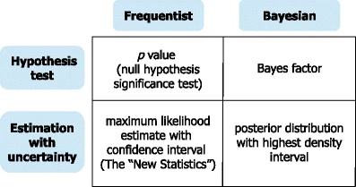

# Statistical inference {#inference}

::: {.learning-goals}
🍎 Learning goals: 

* Discuss differences between frequentist and Bayesian perspectives
* Reconceptualize statistical “tests” as models of data
* Build intuitions about how specific “tests” (e.g., t-tests) relate to more general frameworks (e.g., regression, mixed effects models)
* Identify which models are best suited for which research questions 
* Reason about effect effect size as estimated by statistical models
:::

We've been arguing that experiments are about measuring effects. You might ask then, why does this book even need a chapter about statistical inference? Why can't we just report our measurements and be done? 

Statistical inference is critical to experimental methods because experiments -- especially experiments with human participants -- tend to yield noisy and variable data. Statistical methods allow us to make sense of the data and ask critical questions of it, like:

1. How likely is it that this pattern of measurements was produced by chance variation? 
2. Do these data provide more support for one hypothesis or another? 
3. How big is the effect of a manipulation, and how precise is our estimate of that effect?
4. What portion of the variation in the data is due to a particular manipulation (as opposed to variation between participants, stimulus items, or other manipulations)?

Question (1) is associated with one particular type of statistical testing -- **null hypothesis significance testing** (NHST) in the **frequentist** statistical tradition. NHST has become synonymous with data analysis. This equivalence has been to the detriment of both data analysis and statistics more generally. The instinct to "go test your data for significance" before visualizing your data and trying to understand how it relates to the various sources of variation in your design (participants, items, manipulations, etc.) is in our view one of the most unhelpful things an experimenter can do. $p < .05$ or not, a test of this sort gives you literally *one bit*^[In the information theoretic sense, as well as the common sense!] of information about your data. The kinds of visualizations we advocate in Chapter \@ref(viz) give you a much richer sense of what happened in your experiment!

In this chapter, we will describe NHST, the conventional method that many students still learn (and many scientists still use) as their primary method for engaging with data. All practicing experimentalists need to understand NHST both to read the literature and also to apply this method in appropriate situations -- for example, tests of interventions where the key question for informing practice is whether there is a significant difference between a treatment condition and an appropriate control. But we will also try to contextualize NHST as a very special case of a broader set of strategies around modeling and inference. Further, we will note how some of the pathologies of NHST have almost certainly 62been a driver of the replication crisis. 

```{marginfigure, echo=TRUE}

Clarifying the distinctions between Bayesian and Frequentist paradigms and the ways that they approach inference and estimation. For many settings, we think the estimation mindset is more useful. From Krushke and Liddell (2018). 
```

What should replace NHST? There has been a recent move towards the use of Bayes Factors to quantify the evidence in support of a hypothesis. Bayes Factors can help answer questions like (2). We introduce these tools, and believe that they have broader applicability than the NHST framework and should be known by students. Both NHST and Bayes Factors are examples of what are called **inference** strategies, which are centered around drawing conclusions from data: significant or not, hypothesis one or hypothesis two.^[An important but subtle point is that "inference" is an ambiguous term. We are using it in the sense of drawing conclusions from data. But the term is used more broadly as well in the phrase "statisical inference," which is often contrasted with purely descriptive approaches. In this usage, "inference" means making generalizations from data that extend beyond the current set of observations. We do want to do that!]

We contrast inference strategies with **estimation** and **modeling** stratgies, which are more suited towards questions (3) and (4) [@krushke2018]. The goal of these strategies is to yield a precise estimate of the relationships underlying observed variation in the data. Critically, one of these estimates is the causal effect of the experimental manipulation(s). That explains our affection for these approaches: if a good theory predicts these kinds of causal effects, it makes sense that we'd want to estimate them precisely! Estimating one quantity in isolation is not maximally effective, though, since often there will be variation in the estimate that has to do with other known sources. If it's helpful to have an example, imagine the Stroop effect, which has a fairly consistent effect on both fast and slow readers [@haaf2017]. But estimates of this effect will be more precise if we take into account that some readers are slower or faster, rather than just averaging across all this variation.]

This isn't a statistics book and we won't attempt to teach the full array of important statistical concepts that will allow students to build good models of a broad array of datasets. (Sorry!).^[If you're interested in going deeper, here are two books that have been really influential for us. The first is @gelman2006, which teaches regression and multi-level modeling from the persepective of data description and modeling. The second is @mcelreath2018. a course on building Bayesian models of the causal structure of your data. Honestly, neither is an easy book to sit down and read (unless you are the kind of person who reads stats books on the subway for fun) but both really reward detailed study. We encourage you to get together a reading group and go through the exercises together. It'll be well worth while in its impact on your statistical and scientific thinking.] Instead, we're going to focus on the case wherethere is a single binary manipulation (experimental treatment vs. control) and we want to estimate its effect. In Chapter \@ref(models), we'll generalize this approach to model other sources of variability.  We'll start by looking at a case study that established modern statistical inference. 

::: {.case-study}
🔬 Case study: The lady tasting tea

The birth of modern statistical inference came from a single, epochal act of mansplaining.^[An important piece of context for the work of Ronald Fisher, Karl Pearson, and other early pioneers of statistical inference is that they were all strong proponents of eugenics. Fisher was the founding Chairman of the Cambridge Eugenics Society. Pearson was perhaps even worse, an avowed social darwinist who believed fervently in Eugenic legislation. These views are repugnant.] Sir Ronald Fisher was apparently at a party when a lady declared that she could tell the difference between cups when the tea was added to the milk vs. the milk to the tea. Rather than taking her at her word, Fisher devised an experimental and data analysis procedure to test her claim.^[If you're interested in this history, we recommend @salzburg2001's delightful book, "The Lady Tasting Tea" about the origins of modern statistics.]

The basic schema of the experiment was that the lady would have to judge a set of new cups of tea (a two-alternative forced choice measure). Her data would then be analyzed to determine whether her level of correct choice exceeded that expected by chance. While this process now sounds like a quotidian experiment that might be done on a cooking reality show, in fact this is one of those touchstones that feels unremarkable because it literally established the way science was done for the next century. 

The first element of the experiment that was unusual was its treatment of design confounds such as pouring order or cup material. Prior experimental practice would have been to assume that the best practice would have been to try to equate all of the cups as closely as possible, decreasing the influence of confounders. Fisher recognized that this strategy was insufficient and that random assignment was critical for making strong causal inferences about the treatment (milk then tea vs. tea then milk).^[We just asserted the causal power of random assignment in Chapter \@ref(intro) but here's where it originates!]

The second innovation was the idea of creating a model of what might happen during the experiment: specifically, a **null model** in which the nameless lady chose cups by chance rather than because of some tea sensitivity. The goal of the analysis was then to compute the probability of the lady's choices under this null model. Fisher then declared that it is "usual and convenient for experimenters to take 5 percent as a standard level of convenience," establishing the .05 cutoff that has become gospel throughout the sciences.^[Actually, right after establishing .05 as a cutoff, Fisher then writes that "in the statistical sense, we thereby admit that no isolated experiment, however significant in itself, can suffice for the experimental demonstration of any natural phenomenon... in order to assert that a natural phenomenon is experimentally demonstrable we need, not an isolated record, but a reliable method of procedure. In relation to the test of significance, we may say that a phenomenon is experimentally demonstrable when we know how to conduct an experiment which will rarely fail to give us a statistically significant result." In other words, Fisher was all for replication!] 

With apologies to Fisher, we'll design a slightly more modern version of his experiment using a forced-choice judgmeent measure. We present participants with a series of cups of tea (in random order, of course). Half are prepared with milk first, half tea first. Then the participant must give a judgement. The null model is based on the idea that, if the participant knows nothing then they should choose at random between the two possibilities. Hence, we can use a simple binomial distribution to show expected chance performance for different sets of trials.^[We quantify our measure as the proportion of correct trials, since trials here are interchangeable.] 

These null distributions are shown in Figure \@ref(fig:null_model). We show cases with 6, 12, 24, and 48 trials, and highlight a significance threshold -- the threshold above which you would fall only 5% of the time if you were guessing by chance.^[Note that we are effectively doing a "one-tailed" test here, since we're attending only to the right hand side of each plot and ignoring cases where the participant is exactly flipped in their judgments.] Conventionally, if you cross this threshold, you can say you "reject the null."

```{r null_model, fig.cap="Probability of observing a particular number of trials correct under the null model of no sensitivity to tea preparation order. Each facet gives a different number of trials. The red line indicates a significance threshold above which data have less than a 5\\% chance of appearing."}
n_sims <- 10000
null_model <- expand_grid(n = c(6,12,24,48),
                          sim = 1:n_sims) %>%
  group_by(n) %>%
  mutate(correct = rbinom(n = n_sims, size = n, prob = .5)/n, 
         cutoff = quantile(correct, .95)) %>%
  group_by(n, correct) %>%
  summarise(n_correct = n(), 
            cutoff = cutoff[1]) %>%
  group_by(n) %>%
  mutate(prop_correct = n_correct / sum(n_correct))

ggplot(null_model, aes(x = correct, y = prop_correct)) + 
  geom_bar(stat = "identity") + 
  facet_wrap(~n) + 
  geom_vline(aes(xintercept = cutoff + .01), col = "red", lty = 2) + 
  ylab("Probability") + xlab("Proportion correct responses")
# dbinom(x = 8, size = 8, prob = .5)
```

Examining these null distributions reveals an intuitive regularity. The more trials a participant completes, the lower the threshold for significance becomes. With 6 trials, you  need to get all `r qbinom(.95, size = 6, prob = .5, lower.tail = TRUE)` correct for that result to have a probability of less than 5% probable under the null model. With 12, you need to observe `r qbinom(.95, size = 12, prob = .5)+1` (`r qbinom(.95, size = 12, prob = .5)+1 / 12`%) or more. With 24 and 48, you need  `r qbinom(.95, size = 24, prob = .5)+1` (`r qbinom(.95, size = 24, prob = .5)+1 / 24`%) and  `r qbinom(.95, size = 48, prob = .5)+1` (`r qbinom(.95, size = 48, prob = .5)+1 / 48`%) respectively.^[You can calculate these numbers by looking at what's called the **quantile function** of the binomial binomial: the function that tells you how many correct trials out of the total number corresponds to a particular probability.] With greater numbers of trials, the expectation based on chance becomes more precise and so we are able to reject then null based on smaller deviations from chance. Even here in the original case of null hypothesis significance testing, it is clear that our goals matter. If we're merely testing a hypothesis informally at a garden party, perhaps we don't want to subject our friend to dozens of trials. But if the stakes were higher and a more precise estimate was necessary, maybe we'd want to do a more extensive experiment! 

Something very important is missing from this way of evaluating tea tasting. If we think back to our goals as experimentalists, we are hoping to use the logic of random assignment to measure causal effects of interest. Here, the effect we're measuring is something like the effect of tea preparation on taste perception (maybe not the most consequential question, but...). Yet our statistical paradigm is misaligned with our goal! All of this talk of significance and rejecting the null doesn't tell us about either how big the effect is, or how precisely we have measured it! That's why we are going to be advocating throughout for estimation as the key goal for our statistical analysis, with the varieties of inference (significance testing included) as a secondary goal. 
:::

## A probabilistic framework 

An alternative way to frame our statistical practice is to start from the idea of estimation.

Let's say we want to estimate some quantity, we'll call it $h$ -- our belief about the participant's accuracy.^[You can't get away from measurement and psychometrics! We said we were really interested in the effect of tea ordering on tea perception. But this number that we're estimating is something more like this particular participant's accuracy, and that's not the same thing that we actually wanted. To get from what we're estimating to our effect of interest, we'd need to establish some **linking hypotheses** about how the participant's accuracy can be derived from the participant's perception and the properties of the stimulus. That's perhaps not worth doing in this toy example, but more generally it's a critical part of getting from your measure to your construct of interest!] We observe some data $d$, consisting of the set of correct and incorrect responses in the experiment. Now we can use **Bayes' rule**, a tool from basic probability theory, to estimate this number. 

Bayes' rule says:

$$
\color{purple}{p(h | d)} = \frac{\color{red}{p(d | h)} \color{blue}{p(h)}}{p(d)}.
$$
\noindent Each part of this equation has a name, and it's worth becoming familiar with them. The thing we want to compute ($p(h|d)$) is called the **posterior probability** -- it tell us what we should believe about the participant's ability given the data we observed. We then break that down into two terms in the numerator.^[We're making the posterior \textcolor{purple}{purple} to indicate the combination of likelihood (\textcolor{red}{red}) and prior (\textcolor{blue}{blue}).]

The first part of the numerator is $p(d|h)$, the probability of the data we observed given our hypothesis about the participant's ability. This part is called the **likelihood**.^[Speaking informally, "likelihood" is just a synonym for probability, but this is a technical meaning for the term, which can get a bit confusing.] This term tells us about the relationship between our hypothesis and the data we observed -- so if we think the participant has high ability (say $h = .9$) then the probability of a bunch of low accuracy observations will be fairly low. 

The second term in the numerator, $p(h)$, is called the **prior**. This term encodes our beliefs about how likely our participant is to have different levels of ability. Intuitively, if we think that they are very unlikely to have high tea discrimination ability, we should require more evidence to convince us of a particular level of discrimination. In contrast, if we think they are likely to have this ability, we should be easier to convince. 

```{r bayes_demo, fig.cap="Examples of Bayesian inference about tea discrimination ability under three different priors (facets). Blue lines give the prior probability distribution, red lines give the likelihood of the data, and purple lines give the posterior distribution from combining likelihood and prior."}
bayes <- expand_grid(x = seq(0,1,.01), a = c(1, 3, 6)) %>%
  mutate(b = case_when(a == 1 ~ 1, 
                       a == 3 ~ 3, 
                       a == 6 ~ 2)) %>%
  rowwise %>%
  mutate(h = dbeta(x = x, shape1 = a, shape2 = b),
         d_given_h = dbeta(x = x, shape1 = 9, shape2 = 3),
         h_given_d = dbeta(x = x, shape1 = a + 9, shape2 = b + 3)) %>%
  group_by(a,b) %>%
  mutate(h = h / sum(h), 
         h_given_d = h_given_d / sum(h_given_d), 
         d_given_h = d_given_h / sum(d_given_h), 
         map = x[h_given_d == max(h_given_d)],
         label = case_when(a == 1 ~ "Flat",
                           a == 3 ~ "Prior: no discrimination",
                           a == 6 ~ "Prior: discrimination"), 
         label = fct_relevel(label, "Flat", "prior: no discrimination"))

ggplot(bayes, aes(x = x, y = h)) + 
  geom_line(col = "blue") +
  geom_line(aes(y = h_given_d), col = "purple") +
  geom_line(aes(y = d_given_h), col = "red") +
  geom_vline(xintercept = .5, lty = 2) + 
  geom_vline(aes(xintercept = map), col = "purple", lty = 3) + 
  facet_wrap(~label) + 
  ylab("Probability") +
  xlab("Discrimination level")
```

Figure \@ref(fig:bayes-demo) gives an example of the combination of prior and data.^[The model we use for this example is called a **Beta-Binomial conjugate model** and is a very convenient model for working with count data representing successes and failures.] For the sake of this example, we assume that we have run 12 tea discrimination trials and observed 9 successes and 3 failures. The evidence alone -- with no prior -- suggests a discrimination estimate of $9/12 = .75$.^[Technically this is known as the **maximum a posteriori** estimate, or the MAP. We won't use that term though.] When we use a flat prior, we get the same estimate of `r bayes$map[bayes$label == "Flat"][1]`. In contrast, if we go in assuming that discrimination is likely to be absent or weak, we are biased downward in our eventual estimate of `r bayes$map[bayes$label == "Prior: no discrimination"][1]`; if we go in assuming good discrimination, we end up biased upwards to `r bayes$map[bayes$label == "Prior: discrimination"][1]`.

Fisher's original framwork for significance testing focused only on the **null hypothesis** of no discrimination. In contrast, the Bayesian estimation method here focuses on the magnitude of accuracy.^[If you're reading carefully, you might have noticed that we *could* have discovered that the estimate of accuracy was very similar to chance -- more about this below.]  The intuition we'd like you to get is that, if you are an experimentalist who cares about the magnitude of causal relationships (and we hope you are), then Fisher's statistical approach isn't ideally suited to your goals. 

<!-- TODO: HERE WOULD BE A GREAT PLACE FOR AN INTERACTIVE -->

## Inference


### What is a Bayes factor

Bayes factors defined as model comparison between null model and other model.


### What is a p-value? 

P-values only give us the probability of the data given the hypothesis. 

So if H1 is very unlikely, low p-value still doesn’t mean we should change our belief. 


Define decision-theoretic framework:

```{r}
# Truth of the hypothesis
# 
# 
# 
# 
# TRUE
# FALSE
# Test outcome
# FALSE
# False negative (MISS)
# True negative
# (Correct Rejection)
# TRUE
# False positive 
# (False Alarm)
# True positive
# (HIT)
```


::: {.accident-report}
⚠️ Accident report: Feeling the future? 


ESP example (Wagenmakers et al. 2011):
Assume p(h1) is 10x-20:
:::

### Philosophical views of probability


Philosophy
Bayes: Data are the data, what can we infer? (subjective)
Frequentist: Do the same thing again and again, what happens (objective truth)
Prior information
Bayes theorem
“Data fixed” vs. “model fixed”

Bayesians don’t have to care about optional stopping

Differences in philosophy
Bayesian stats are good for:
Cases where you have a lot of prior knowledge
E.g., statistics for voter prediction in elections
Cases where you want to deal with uncertainty in a principled way
E.g., integrating knowledge about measurement error into your model
Null models
Cases where you want to decide in favor of null
(though you can do this in frequentist perspectives)
Small N data
Many frequentist tests are based on guarantees in the limit. Guarantees don’t hold at N=3 or 5 or even 10. 
Frequentist good for:
Decision theory (cf. bayesian decision theory)
Absence of assumptions (“more objective”)
Often easier to state and solve models

## When inference is and isn't appropriate

First discussion of overfitting. See Chapter \@ref(prereg). 


### P-values: the root of all evil? 

P-value misconceptions

```{r}
dozen <- tribble(~` `, ~Misconception,
                 1,	"If P = .05, the null hypothesis has only a 5% chance of being true.",
                 2,	"A nonsignificant difference (eg, P ≥.05) means there is no difference between groups.",
                 3,	"A statistically significant finding is clinically important.",
                 4,	"Studies with P values on opposite sides of .05 are conflicting.",
                 5,	"Studies with the same P value provide the same evidence against the null hypothesis.",
                 6,	"P = .05 means that we have observed data that would occur only 5% of the time under the null hypothesis.",
                 7,	"P = .05 and P ≤.05 mean the same thing.",
                 8,	"P values are properly written as inequalities (eg, \\'P ≤.02\\' when P = .015)",
                 9,	"P = .05 means that if you reject the null hypothesis, the probability of a type I error is only 5%.",
                 10,	"With a P = .05 threshold for significance, the chance of a type I error will be 5%.",
                 11,	"You should use a one-sided P value when you don't care about a result in one direction, or a difference in that direction is impossible.",
                 12,	"A scientific conclusion or treatment policy should be based on whether or not the P value is significant.")

knitr::kable(dozen, 
             booktabs = TRUE, 
             caption = "A \"dirty dozen\" p value misconceptions. From Goodman (2008).")
```


Despite all these reasons to be worried about p-values, for many practicing scientists (at least at time of writing) there is no right answer. Even if we'd like to be Bayesian all the time because the paradigm makes philosophical and practical sense, there are a number of obstacles. First, though tools like `Stan`, `BayesFactor`, and `brms` make fitting Bayesian models easier (more about this below and in the next chapter), it's still on average quite a bit harder to fit a Bayesian model than it is a frequentist one. Second, because Bayesian analyses are less familiar, it may be an uphill battle to convince advisors, reviewers, and funders to use them. So as a group, we are still mostly Bayesian when we can be -- and frequentist when it's not practical. One reason we don't feel so bad about this stance is that, a lot of them time we're not so worried about making binary inferences, whether they are at $p < .05$ or $BF > 3$ or whatever the threshold is. 

## Inference and estimation for two-group designs

Throughout this book we've taken the position that the goal of experiments is to estimate a causal effect of interest, ideally as part of some theory of how different constructs relate to one another. All this talk of hypotheses and inferences above is only indirectly related to that goal. 


- Intuition builder: For very large n, or flat prior, Bayes and frequentist coincide. 


### Simple models of between-group differences

Introducing simple inference models:

- The chi-squared test for inferring whether two samples come from the same distribution
- The t-test for inferring whether a single group’s effect differs from 0
- The t-test for inferring whether two groups differ from one another
- The paired t-test as a first glimpse at how we might account for participant-level random effects (see Chapter 7).


::: {.accident-report}
⚠️ Accident report: Once you have the basic t-test under your belt, it might feel natural to compare each group to 0 and conclude that one group is different from 0 and the other one isn’t. But “the difference between significant and not significant is not necessarily itself statistically significant” (Nieuwenhuis, Forstmann, and Wagenmakers 2011). 
:::


How to go from theory to hypotheses to statistical model


## Effect size

With all our talk about estimation above, we didn't say nuch about what precisely was being estimated. 

Effect size: a common language for describing group differences. Pros and cons of this approach. Pro: comparability across studies. Con: loss of information about measures and real-world predictions; dependence on baseline variability. 

Effect sizes (ES):
Cohen’s = m1 - m2 / SD
Units of ES easy to compare across studies
Good for comparison 
Example: school interventions to improve achievement
Necessary for meta-analysis
Example: MA of infant consonant discrimination (cross method comparison)
Necessary for power analysis 
Negative: not related to any real units
Many measures of ES, e.g. r2, n2 (eta), log odds

Precision

Error bar:
 - standard deviation (why is this bad)?
- SEM
- CI

CIs for inference

Confidence intervals:
95% of these regions will contain the TRUE parameter
	Remember frequentists - there is a TRUE parameter

https://istats.shinyapps.io/ExploreCoverage/

But this is not our typical interpretation, which is that 95% chance parameter is in this interval
	That’s the BAYESIAN interpretation

Bayesian Estimation

Find the posterior distribution of the parameter of interest
	You can take its mean
	Its HPD (highest posterior density)

Confidence in confidence intervals: 
https://link.springer.com/article/10.3758/s13423-015-0947-8


::: {.interactive}
⌨️ Interactive box: non-parametric simulations where you can shuffle data across groups a bunch of times and see what kind of distribution it produces by chance
:::

