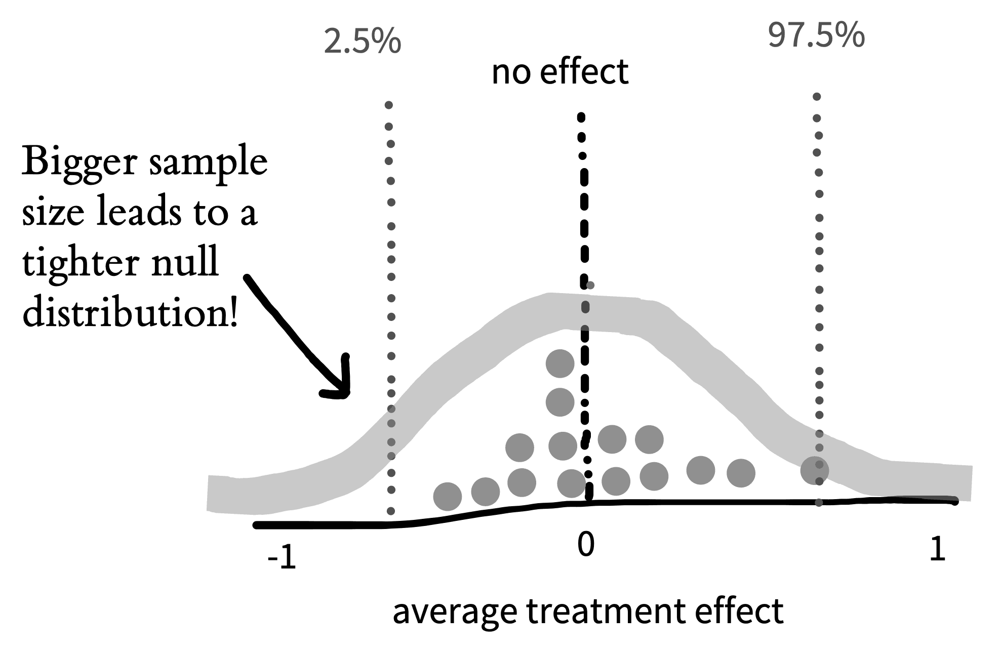

# Inference {#inference}

::: {.box data-box="learning_goals"}
-   Discuss the purpose of statistical inference
-   Define *p*-values and Bayes Factors
-   Consider common fallacies about inference (especially for *p*-values)
-   Reason about sampling variability 
-   Define and reason about confidence intervals
:::

We've been arguing that experiments are about measuring effects. You might ask then, why does this book even need a chapter about statistical inference? Why can't we just report our estimates and be done? The answer is that we are not typically interested in the characteristics of our sample specifically. **Statistical inference** is the process of going beyond the specific characteristics of the sample that you measured to make generalizations about the broader **population**. 

Inference methods allow us to ask questions like:

1.  How likely is it that this pattern of measurements was produced by chance variation?
2.  Do these data provide more support for one hypothesis or another?
3.  How big is the effect of a manipulation, and how precise is our estimate of that effect?
4.  What portion of the variation in the data is due to a particular manipulation (as opposed to variation between participants, stimulus items, or other manipulations)?

Question (1) is associated with one particular type of statistical inference method -- **null hypothesis significance testing** (NHST) in the **frequentist** statistical tradition. NHST has become synonymous with data analysis, such that in the vast majority of research papers (and research methods courses), all of the reported analyses are tests of this type. Yet the equivalence of NHST -- in particular, the dichotomous inference that something is "significant" or not -- and the idea of data analysis more generally has been quite problematic.

The instinct to "go test for significance" before visualizing your data and trying to understand sources of variation (participants, items, manipulations, etc.) is one of the most unhelpful things an experimenter can do. Whether $p < .05$ or not, a test of this sort gives you literally *one bit* of information about your data.^[In the information theoretic sense, as well as the common sense!] Considering effect sizes and their variation more holistically, including using the kinds of visualizations we advocate in Chapter \@ref(viz), gives you a much richer sense of what happened in your experiment!

In this chapter, we will describe NHST, the conventional method that many students still learn (and many scientists still use) as their primary method for engaging with data. All practicing experimentalists need to understand NHST, both to read the literature and also to apply this method in appropriate situations. For example, NHST may be a reasonable tool for testing whether an intervention leads to a difference between a treatment condition and an appropriate control, although it still doesn't tell you about the size of the intervention effect! But we will also try to contextualize NHST as a very special case of a broader set of modeling and inference strategies. Further, we will continue to flesh out our account of how some of the pathologies of NHST have been a driver of the replication crisis.

```{r inference-krushke, fig.margin=TRUE, fig.cap="Clarifying the distinctions between Bayesian and Frequentist paradigms and the ways that they approach inference and estimation. For many settings, we think the estimation mindset is more useful. Adapted from Kruschke and Liddell (2018). "}
knitr::include_graphics("images/inference/krushke2.png")
```

What should replace NHST? Figure \@ref(fig:inference-krushke) shows one way of organizing different inferential approaches. There has been a recent move towards the use of Bayes Factors to quantify the evidence in support of different candidate hypotheses. Bayes Factors can help answer questions like (2). We introduce these tools, and believe that they have broader applicability than the NHST framework and should be known by students. On the other hand, Bayes Factors are not a panacea. They have many of the same problems as NHST when they are applied dichotomously.

Instead of dichotomous frequentist or Bayesian inference, we advocate for **estimation** and **modeling** strategies, which are more suited towards questions (3) and (4) [@cumming2014;@kruschke2018]. The goal of these strategies is to yield an accurate and precise estimate of the relationships underlying observed variation in the data. One of these estimates is the causal effect of the experimental manipulation(s), which we introduced in the last chapter. That explains our affection for these approaches: if a good theory predicts these kinds of causal effects, it makes sense that we'd want to estimate them precisely! What we'll do in this chapter is build on that estimation strategy to understand what we learn about the population parameters we're trying to estimate from our sample data. 

This isn't a statistics book and we won't attempt to teach the full array of important statistical concepts that will allow students to build good models of a broad array of datasets. (Sorry!).^[If you're interested in going deeper, here are two books that have been really influential for us. The first is @gelman2006b and its successor @gelman2020, which teach regression and multi-level modeling from the perspective of data description. The second is @mcelreath2018, a course on building Bayesian models of the causal structure of your data. Honestly, neither is an easy book to sit down and read (unless you are the kind of person who reads stats books on the subway for fun) but both really reward detailed study. We encourage you to get together a reading group and go through the exercises together. It'll be well worth while in its impact on your statistical and scientific thinking.] But we do want you to be able to reason about inference and modeling. In this chapter, we'll start by making some inferences about our tea-tasting example from the last chapter, using this example to build up intuitions about inference and estimation. Then in Chapter \@ref(models), we'll start to look at more sophisticated models.

## Sampling variation

In Chapter \@ref(estimation), we introduced Fisher's tea-tasting experiment and discussed how to estimate means and differences in means from our observed data. These so-called "point estimates" represent our best guesses about the population parameters given the data and possibly also given our prior beliefs. We can also report how much statistical uncertainty is involved in these point estimates.[^inference-7] Quantifying and reasoning about this uncertainty is an important goal: in our original study we only had 9 participants in each group, which will only provide a low precision (i.e., highly uncertain) estimate of the population. By contrast, if we repeated the experiment with 500 participants in each group, the data would be far less noisy, and we would have much less uncertainty, even if the point estimates happened to be identical.

### Standard errors

[^inference-7]: The measures of variability that we discuss here account for statistical uncertainty reflecting the fact that we have only a finite sample size. If the sample size were infinite, there would be no uncertainty of this kind. Sampling-based uncertainty is only one kind of uncertainty, though: a more holistic view of the overall credibility of an estimate should also account for study design and bias, among other things


```{r inference-sampling-small, fig.margin = TRUE, fig.cap= "Sampling distribution for the treatment effect in the tea-tasting experiment, given many different repetitions of the same experiment, each with N=9 per group."}
knitr::include_graphics("images/inference/sampling-small.png")
```

To characterize the uncertainty in an estimate, it helps to picture what is called its **sampling distribution**, which is the distribution of the estimate across different, hypothetical samples. That is, let's imagine -- purely hypothetically -- that we conducted the tea experiment not just once, but hundreds or even thousands of times. This idea is often called **repeated sampling** as a shorthand. For each hypothetical sample, we use similar recruitment methods to recruit a new sample of participants, and we estimate $\widehat{\beta}$ in that sample. Would we get exactly the same answer each time? No, simply because the samples will have some random variability. If we plotted these estimates, $\widehat{\beta}$, across thousands of samples, we would get the sampling distribution in Figure \@ref(fig:inference-sampling-small). 

```{r}
source("helper/tea_helper.R")
```

::: {.box data-box="code"}
In this chapter and the subsequent statistics and visualization chapters of the book, we'll try to facilitate understanding and using these concepts in practice by giving the R code we use in constructing our examples in these code boxes. We'll assume that you have some knowledge of base R and the Tidyverse -- go ahead and take a look at Appendix \@ref(tidyverse) if you haven't already. Although our figures are all drawn by hand, they are based on actual simulation results!

Since we're going to be working with lots of data from the tea tasting example, we wrote a function called `make_tea_data` that creates a `tibble` with some (made up) data from our modern tea-tasting experiment. You can find the function at [this link](https://raw.githubusercontent.com/langcog/experimentology/main/helper/tea_helper.R) if you want to follow along.

```{r echo=TRUE}
tea_data <- make_tea_data(n_total = 18)
```

Here's what the first few rows of those data look like:

```{r}
knitr::kable(head(tea_data), digits = 2)
```
:::

Now imagine we also did thousands of repetitions of the experiment with $n=200$ per group instead of $n=9$ per group. Figure \@ref(fig:inference-sampling-big) shows what the sampling distribution might look like in that case. Notice how much narrower the sampling distribution becomes when we increase the sample size, showing our decreased uncertainty. More formally, the standard deviation of the sampling distribution itself, called the **standard error**, decreases as the sample size increases.

```{r inference-sampling-big, fig.margin = TRUE, fig.cap= "Comparing sampling distributions for the treatment effect with smaller and larger size samples."}
knitr::include_graphics("images/inference/sampling-big.png")

```


::: {.box data-box="code"}
To do this simulation, we're using a special tidyverse function from the `purrr` library: `map`. `map` is an extremely powerful function that allows us to run another function (in this case, the `make_tea_data` function that we introduced last chapter) many times with different inputs. Here we create a tibble made up of a set of 1000 runs of the `make_tea_data` function.

```{r eval=FALSE, echo=TRUE}
samps <- tibble(sim = 1:1000) |>
  mutate(data = map(sim, ~make_tea_data(n_total = 18))) |>
  unnest(cols = "data")
```

Next, we just use the `group_by` and `summarise` workflow from Appendix \@ref(tidyverse) to get the estimated treatment effect for each of these 1000 simulations.

```{r eval=FALSE, echo=TRUE}
tea_summary <- samps |>
  group_by(sim) |>
  summarise(delta = mean(rating[condition == "milk first"]) -
              mean(rating[condition == "tea first"]))
```

This tibble gives us what we need to make our histogram.
:::

The sampling distribution is not the same thing as the distribution of tea ratings in a single sample. Instead, it's a distribution of *estimates across samples of a given size*. Internalizing this distinction is a crucial component to understanding all statistical models and tests. 
<!-- If we were in the classroom with you, we would pound our fist on the lecture podium for emphasis! -->

### The central limit theorem

We talked in the last chapter about the normal distribution, a convenient and ubiquitous tool for quantifying the distribution of measurements. A shocking thing about sampling distributions for many kinds of estimates -- and for *all* maximum likelihood estimates -- is that they become normally distributed as the sample size gets larger and larger. This result holds even for estimates that are not even remotely normally distributed in small samples! 

For example, say we are flipping a coin and we want to estimate the probability that it lands heads ($p_H$). If we draw samples each consisting of only $n=2$ coin flips, Figure \@ref(fig:inference-coin-2) is the sampling distribution of the estimates ($\widehat{p}_H$). This sampling distribution doesn't look normally distributed at all -- it doesn't have the characteristic "bell curve" look! $\widehat{p}_H$ can only take on the values 0, 0.5, or 1 in a sample of only 2 coin flips. 

```{r inference-coin-2, fig.margin = TRUE, fig.cap="Samping distribution of samples from a biased coin with N=2 flips in each sample. Bar height shows the proportion of flips resulting in a particular mean."}
knitr::include_graphics("images/inference/cl-2.png")
```


```{r inference-coin-ns, fig.margin = TRUE, fig.cap="Sampling distribution for 2, 8, 32, and 128 flips."}
knitr::include_graphics("images/inference/cl-ns.png")
```

::: {.box data-box="code"}
For this simulation, we use the `map` function. We set up a tibble with the different values we want to to try (which we call `n_flips`). Then we make use of the `map` function to run `rbinom` (random binomial samples) for each value of `n_flips`.

One trick we make use of here is that `rbinom` takes an extra argument that says how many of these random values you want to generate. Here we generate `nsamps = 1000` samples, giving us 1000 independent replicates at each `n`. But returning an array of 1000 values for a single value of `n_flips` results in something odd: the value for each element of `flips` is an array. To deal with that, we use the `unnest` function, which expands the array back into a normal tibble.

```{r eval=FALSE, echo=TRUE}
n_samps <- 1000
n_flips_list <- c(2, 8, 32, 128)

sample_p <- tibble(n_flips = n_flips_list) |>
  group_by(n_flips) |>
  mutate(flips = map(n_flips, ~rbinom(n = n_samps, size = n_flips, prob = .7))) |>
  unnest(cols = c(flips)) |>
  mutate(p = flips / n_flips)
```

:::

But look what happens as we draw increasingly larger samples in Figure \@ref(fig:inference-coin-ns): We get a normal distribution! This tendency of sampling distributions to become normal as $n$ becomes very large reflects a deep and elegant mathematical law called the **Central Limit Theorem**. The practical upshot is that the Central Limit Theorem directly helps us characterize the uncertainty of sample estimates. For example, when the sample size is reasonably large (approximately $n>30$ in the case of sample means) the standard error (i.e., the standard deviation of the sampling distribution) of a sample mean is approximately $\widehat{SE} = \sigma/\sqrt{n}$. That is why the sampling distribution becomes narrower as the sample size increases.

## From variation to inference

Let's go back to Fisher's tea-tasting experiment. The first innovation of that experiment was the use of randomization to recover an estimate of the causal effect of milk ordering. But there was more to Fisher's analysis than we described. 

The second innovation of the tea-tasting experiment was the idea of creating a model of what might happen during the experiment. Specifically, Fisher described a hypothetical **null model** that would arise if the nameless lady had chosen cups by chance rather than because of some tea sensitivity. In our tea-rating experiment, the null model describes what happens when there is no difference in ratings between tea-first and milk-first cups. Under the null model, the treatment effect ($\beta$) is zero. 

Even with an actual treatment effect of zero, across repeated sampling, we should see some variation in $\beta$, our *estimate* of the treatment effect. Sometimes we'll get a small positive effect, sometimes a small negative one. Occasionally just by chance we'll get a big effect. That's the same sampling variation we described above. 

Fisher's innovation was to quantify the probability of observing various values of $\hat{\beta}$, given the null model. Then, if the observed data were very low probability under the null model, we could declare that the null was rejected. How unlikely must the observed data be, in order to reject the null? Fisher declared that it is "usual and convenient for experimenters to take 5 percent as a standard level of convenience," establishing the .05 cutoff that has become gospel throughout the sciences.^[Actually, right after establishing .05 as a cutoff, Fisher then writes that "in the statistical sense, we thereby admit that no isolated experiment, however significant in itself, can suffice for the experimental demonstration of any natural phenomenon... in order to assert that a natural phenomenon is experimentally demonstrable we need, not an isolated record, but a reliable method of procedure. In relation to the test of significance, we may say that a phenomenon is experimentally demonstrable when we know how to conduct an experiment which will rarely fail to give us a statistically significant result." In other words, Fisher was all for replication!]

Let's take a look at what the null model might look like. We already tried out repeating our tea-tasting experiment thousands of times in our discussion of sampling above. Now in Figure \@ref(fig:inference-null-model), we do the same thing but we assume that the **null hypothesis** of no treatment effect is true. The histogram shows the distribution of treatment effects $\hat{\beta}$ we observe: some a little negative, some a little positive, and a few substantially positive or negative, but mostly zero. 

Let's apply Fisher's standard. If our observation has less than a 5% probability under the null model, then the null model is likely wrong. The red dashed lines on Figure \@ref(fig:inference-null-model) show the point below which only 2.5% of the data are found and the point above which only 2.5% of the data are found. These are called the **tails** of the distribution. Because we'd be equally willing to accept milk-first tea or tea-first tea being better, we consider both positive and negative observations as possible.^[Because we're looking at both tails of the distribution, this is called a "two-tailed" test.]

```{r inference-null-model, fig.margin = TRUE, fig.cap="One example of the distribution of treatment effects under the null model (with N=9 per group). The red regions indicate the part of the distribution in  which less than 5\\% of observations should fall."}
knitr::include_graphics("images/inference/p-region.png")

```

::: {.box data-box="code"}
To simulate our null model, we can do the same kind of thing we did before, just specifying to our `make_tea_data` function that the true difference in effects is zero!

```{r eval=FALSE, echo=TRUE}
null_model <- expand_grid(sim = 1:n_sims, 
                          n = 18) |>
  rowwise() |>
  mutate(data = map(n, ~make_tea_data(n_total = n, delta = 0))) |>
  unnest(cols = c(data))
```

Now again we can `group_by` and `summarise` to get the distribution of treatment effects under the null hypothesis. 

```{r eval=FALSE, echo=TRUE}
null_model_summary <- null_model |>
  group_by(n, sim) |>
  summarise(delta = mean(rating[condition == "milk first"]) - 
              mean(rating[condition == "tea first"]))
```
:::

That's the logic of Fisherian NHST: if the observed data fall in the region that has a probability of less than .05 under the null model, then we reject the null. So then when we observe some particular treatment effect $\hat{\beta}$ in a single (real) instance of our experiment, we can compute the probability of these data or any data more extreme than ours under the null model. This probability is our $p$-value, and if it is small, it gives us license to conclude that the null is false.

As we saw before, the larger the sample size, the smaller the standard error. That's true for the null model too! Figure \@ref(fig:inference-null-model2) shows the expected null distribution for a bigger experiment. 

```{r inference-null-model2, fig.cap="Example distribution of treatment effects under the null model for a larger experiment.", fig.margin=TRUE}

```
::: {.box data-box="code"}

We can do a more systematic simulation of the null regions for different sample sizes by simply adding a parameter to our simulation. 

```{r eval=FALSE, echo=TRUE}
n_sims <- 10000

null_model_multi_n <- expand_grid(sim = 1:n_sims, 
                          n = c(12,24,48,96)) |>
  rowwise() |>
  mutate(data = map(n, ~make_tea_data(n_total = n, delta = 0))) |>
  unnest(cols = c(data))

null_model_summary_multi_n <- null_model_multi_n |>
  group_by(n, sim) |>
  summarise(delta = mean(rating[condition == "milk first"]) - 
              mean(rating[condition == "tea first"]))

null_model_quantiles_multi_n <- null_model_summary_multi_n |>
  group_by(n) |>
  summarise(q25 = quantile(delta, .025), 
            q975 = quantile(delta, .975)) 
```

Here is the plotting code to produce a comparable figure to our illustration:

```{r eval=FALSE, echo=TRUE}
ggplot(null_model_summary_multi_n, aes(x =delta)) + 
  geom_histogram(binwidth = .25) +
  geom_vline(data = null_model_quantiles_multi_n, 
             aes(xintercept = q25), col = "red", lty = 2) + 
  geom_vline(data = null_model_quantiles_multi_n, 
             aes(xintercept = q975), col = "red", lty = 2) + 
  facet_wrap(~n) +
  xlim(-2.5, 2.5) + 
  ylab("Frequency") + xlab("Difference in rating")
```

:::

The more participants in the experiment, the tighter the null distribution becomes, and hence the smaller the region in which we should expect a null treatment effect to fall. Because our expectation based on the null becomes more precise, we will be able to reject the null based on smaller treatment effects. In inference of this type, as with estimation, our goals matter. If we're merely testing a hypothesis out of curiosity, perhaps we don't want to measure too many cups of tea. But if we were designing the tea strategy for a major cafe chain, the stakes would be higher and a more precise estimate might necessary; in that case, maybe we'd want to do a more extensive experiment! 

One last note: You might notice an interesting parallel between Fisher's paradigm for NHST and Popper's falsificationist philosophy (introduced in Chapter \@ref(theories)). In both cases, you never get to accept the actual hypothesis of interest. The only thing you can do is observe evidence that is inconsistent. The added limitation of NHST is that the only hypothesis you can falsify is the null!


## Making inferences

In the tea-tasting example we were just considering, we were trying to make an inference from our sample to the broader population. In particular, we were trying to test whether milk-first tea was rated as better than tea-first tea. Our inferential goal was a clear, binary answer: is milk-first tea better? 

By defining a $p$-value, we got one procedure for giving this answer. If $p < .05$, we reject the null. Then we can look at the direction of the difference and, if it's positive, declare that milk-first tea is "significantly" better. Let's compare this procedure to a different process that builds on the Bayesian estimation ideas we described in the previous chapter. We can then come back to NHST in light of that framework. 

### Bayes Factors


```{r inference-bf, fig.cap="The Bayes Factor (BF).", fig.margin=TRUE}
knitr::include_graphics("images/inference/bf.png")
```

Bayes Factors are a method for quantifying the support for one hypothesis over another, based on an observed dataset. Informally, we've now talked about two different distinct hypotheses about the tea situation: our participant could have *no* tea discrimination ability -- leading to chance performance. We call this $H_0$. Or they could have some non-zero ability -- leading to greater than chance performance. We call this $H_1$. The Bayes Factor is simply the likelihood of the data (in the technical sense used above) under $H_1$ vs. under $H_0$ (Figure \@ref(fig:inference-bf)). The Bayes Factor is a ratio, so if it is greater than 1, the data are more likely under $H_1$ than they are under $H_0$ -- and vice versa for values between 1 and 0. A BF of 3 means there is three times as much evidence for $H_1$ than $H_0$, or equivalently 1/3 as much evidence for $H_0$ as $H_1$.[^inference-10] 

[^inference-10]: Sometimes people refer to the BF in favor of $H_1$ as the $BF_{10}$ and the BF in favor of $H_0$ as the $BF_{01}$. This notation strikes us as a bit confusing because a reader might wonder what the 10 in the subscript means.

```{r inference-jeffreys, fig.margin=TRUE}
jeffreys <- tribble(~`BF range`, ~`Interpretation`,
                    "< 1", "Negative evidence (supports H0)",
                    "1 -- 3", "Barely worth mentioning",
                    "3 -- 10", "Substantial",
                    "10 -- 30", "Strong",
                    "30 -- 100", "Very strong",
                    "> 100", "Decisive")

kable(jeffreys, #booktabs = TRUE, 
      caption = "Jeffreys' (1961/1998) interpretation guidelines for Bayes Factors.")
```

There are a couple of things to notice about the Bayes Factor. The first is that, like a p-value, it is inherently a continuous measure. You can artificially dichotomize decisions based on the Bayes Factor by declaring a cutoff (say, BF \> 3 or BF \> 10), there is no intrinsic threshold at which you would say the evidence is "significant." Many people follow guidelines from @jeffreys1998, shown in Table \@ref(tab:inference-jeffreys). On the other hand, cutoffs like BF > 3 or $p < .05$ are not very informative. So although we provide this table to guide interpretation, we caution that you should always report and interpret the actual Bayes Factor, not whether it is above or below some cutoff. 

The second thing to notice about the Bayes Factor is that it doesn't depend on our prior probability of $H_1$ vs. $H_0$. We might think of $H_1$ as very implausible. But the BF is independent of that prior belief. So that means it's a measure of how much the evidence should shift our beliefs away from our prior. One nice way to think about this is that the Bayes Factor computes how much our beliefs -- whatever they are -- should be changed by the data [@morey2011].

In practice, the thing that is both tricky and good about Bayes Factors is that you need to define an actual model of what $H_0$ and $H_1$ are. That process involves making some assumptions explicit. We won't go into how to make these models here -- this is a big topic that is covered extensively in books on Bayesian data analysis.[^inference-12] Below and in Chapter \@ref(models) we will provide some guidance for how to compute Bayes Factors for simple experimental designs. The goal here is just to give a sense of how they work.

[^inference-12]: Two good ones are @gelman1995 (a bit more statistical) and @kruschke2014 (a bit more focused on psychological data analysis). An [in-prep web-book by Nicenboim et al.](https://vasishth.github.io/bayescogsci/book/) also looks great.

<!-- That's the Bayes Factor.  -->

<!-- ```{r inference-milk-first, fig.cap="Ratings of the quality of milk-first tea."} -->
<!-- sigma <- 1.25 -->
<!-- n_total <- 48 -->

<!-- tea_data <- make_tea_data(n_total, sigma) -->

<!-- ggplot(tea_data, aes(x = rating, fill = condition)) +  -->
<!--   geom_dotplot(position = position_dodge(),  -->
<!--                aes(y = ..count..)) +  -->
<!--   xlim(1,7) +  -->
<!--   ylab("Number of ratings") +  -->
<!--   xlab("Quality rating (1-7)") +  -->
<!--   theme(axis.text.y=element_blank(), -->
<!--         axis.ticks.y=element_blank())  -->

<!-- tea_bf <- BayesFactor::ttestBF(x = tea_data$rating[tea_data$condition == "milk first"], -->
<!--                                y = tea_data$rating[tea_data$condition == "tea first"],  -->
<!--                                paired = FALSE) -->

<!-- tea_data_large <- make_tea_data(n_total *2, sigma) -->
<!-- tea_bf_large <- BayesFactor::ttestBF(x = tea_data_large$rating[tea_data_large$condition == "milk first"], -->
<!--                                y = tea_data_large$rating[tea_data_large$condition == "tea first"],  -->
<!--                                paired = FALSE) -->
<!-- ``` -->

::: {.box data-box="code"}
Bayes Factors are delightfully easy to compute using the `BayesFactor` R package. All we do is feed in the two sets of ratings to the `ttestBF` function!

```{r eval=FALSE, echo=TRUE}
tea_bf <- ttestBF(x = tea_data$rating[tea_data$condition == "milk first"],
                  y = tea_data$rating[tea_data$condition == "tea first"],
                  paired = FALSE)
```

:::


### *p*-values

Now let's turn back to NHST and the $p$-value. We already have a working definition of what a $p$-value is from our discussion above: it's the **probability of the data (or any data that would be more extreme) under the null hypothesis**. How is this quantity related to either our Bayesian estimate or the BF? Well, the first thing to notice is that the $p$-value is very close (but not identical) to the likelihood itself.^[The likelihood -- for both Bayesians and frequentists -- is the probability of the data, just like the $p$-value. But unlike the $p$-value, it doesn't include the probability of more extreme data as well.] 

Next we can use a simple statistical test, a $t$-test, to compute $p$-values for our experiment. In case you haven't encountered one, a $t$-test is a procedure for computing a $p$-value by comparing the distribution of two variables using the null hypothesis that there is no difference between them.^[$t$-tests can also be used in cases where one sample is being compared to some baseline.] The $t$-test uses the data to compute a **test statistic** whose distribution under the null hypothesis is known. Then the value of this statistic can be converted to $p$-values for making an inference. 

```{r inference-t-test}
set.seed(42)
tea_data <- make_tea_data(n_total = 48)
tea_t <- t.test(x = tea_data$rating[tea_data$condition == "milk first"],
                y = tea_data$rating[tea_data$condition == "tea first"], 
                paired = FALSE, var.equal = TRUE)

```

::: {.box data-box="code"}
The standard `t.test` function is built into R via the default `stats` package. Here we simply make sure to specify the variety of test we want by using the flags `paired = FALSE` and `var.equal = TRUE` (denoting the assumption of equal variances). 

```{r eval=FALSE, echo=TRUE}
tea_t <- t.test(x = tea_data$rating[tea_data$condition == "milk first"],
                y = tea_data$rating[tea_data$condition == "tea first"], 
                paired = FALSE, var.equal = TRUE)
```
:::

Imagine we conduct a tea-tasting experiment with $N=48$ and perform a $t$-test on our experimental results. In this case, we see that the difference between the two groups is significant at $p<.05$: `r papaja::apa_print(tea_t)$statistic`. 

The expression `r papaja::apa_print(tea_t)$statistic` is a standard American Psychological Association report of a $t$-test. The first part of this report on the test gives the $t$ value, qualified by the **degrees of freedom** for the test in parentheses. We won't focus much on the idea of degrees of freedom here, but for now it's enough to know that this number quantifies the amount of information given by the data, in this case 48 datapoints minus the two means (one for each of the samples).

Let's compare $p$ values and default Bayes Factors. In Table \@ref(tab:p-bf-comparison), you can see a set of simulated experiments with varying total numbers of participants and varying average treatment effects. Both $p$ and BF go up with more participants and larger effects. In general, BFs tend to be a bit more conservative than $p$-values, such that $p<.05$ can sometimes translate to a BF of less than 3 [@benjamin2018]. 

```{r p-bf-comparison}
set.seed(11)
options(scipen = 999) # remove scientific notation here

expand_grid(N = c(12,24,48,96), 
       Effect = c(.5, 1, 1.5)) |>
  rowwise() |>
  mutate(data = map2(N, Effect, 
                     ~make_tea_data(n_total = N, delta = Effect))) |>
  unnest(cols = c(data)) |>
  group_by(N, Effect) |>
  summarise(`p value` = printp(t.test(x = rating[condition == "milk first"],
                             y = rating[condition == "tea first"], 
                             paired = FALSE, 
                             var.equal = TRUE)$p.value),
         BF = round(extractBF(
           BayesFactor::ttestBF(x = rating[condition == "milk first"],
                                y = rating[condition == "tea first"], 
                                paired = FALSE))$bf,1)) %>%
  kable(#booktabs = TRUE,
        digits = 3, align = "rrrr", caption = "Comparison of p-value and BF for several different (randomly-generated) tea-tasting scenarios.")
```

The critical thing about $p$-values, though, is not just that they are a kind of data likelihoods. It is that they are used in a *specific inferential procedure*. The logic of NHST is that we make a binary decision about the presence of an effect. If $p < .05$, the null hypothesis is rejected; otherwise not. As @fisher1949 wrote,

> It should be noted that the null hypothesis is never proved or established, but is possibly disproved, in the course of experimentation. Every experiment may be said to exist only in order to give the facts a chance of disproving the null hypothesis. (p. 19)

The main problem with $p$-values from a scientific perspective is that researchers are usually interested in not just rejecting the null hypothesis but also in the evidence for the alternative (the one we are interested in). The Bayes Factor is one approach to quantifying positive evidence. This issue with the Fisher approach to $p$-values has been known for a long time, though, and so there is an alternative approach. 

### The Neyman-Pearson approach

```{r inference-power-alpha, fig.cap="Standard decision matrix for NHST.", fig.margin=TRUE}
knitr::include_graphics("images/inference/power-alpha.png")
```

One way to "patch" NHST is to introduce a decision-theoretic view, shown in Figure \@ref(fig:inference-power-alpha).^[A little bit of useful history here is given in @cohen1990.] On this view, called the Neyman-Pearson view, there is a real $H_1$, albeit one that is not specified. Then the true state of the world could be that $H_0$ is true or $H_1$ is true. The $p<.05$ criterion is the threshold at which we are willing to reject the null, and so this constitutes our **false positive** rate $\alpha$. But we also need to define a **false negative** rate, which is conventionally called $\beta$ (You may have seen the notation "$\beta$" used for regression coefficients, which we'll see again in Chapter \@ref(models). Those are not to be confused with false negative rates.) 

Setting these rates is a decision problem: If you are too conservative in your criteria for the intervention having an effect, then you risk a false negative, where you incorrectly conclude that it doesn't work. And if you're too liberal in your assessment of the evidence, then you risk a false positive.^[To make really rational decisions, you could couple this chart to some kind of utility function that assessed the costs of different outcomes. For example, you might think it's worse to proceed with an intervention that doesn't work than to stay with business as usual. In that case, you'd assign a higher cost to a false positive and accordingly try to adopt a more conservative criterion. We won't cover this kind of decision analysis here, but @pratt1995 is a classic textbook on statistical decision theory if you're interested.] In practice, however, mostly people leave $\alpha$ at .05 and try to control their false negative rate by increasing their sample size. 

As we saw in Figure \@ref(fig:inference-null-model), the greater the sample, the better your chance of rejecting the null for any given non-null effect. But these chances will depend also on the effect size you are using. This formulation gives rise to the idea of classical power analysis, which we cover in Chapter \@ref(sampling). Most folks who defend binary inference using $p$-values are interested in using the Neyman-Pearson approach. In our view, this approach has its place (it's especially useful for power analysis) but it still suffers from the substantial issues that plague all binary inference techniques, especially those that use $p$-values. 

::: {.box data-box="depth" data-title="Nonparametric resampling under the null"}

Hypothesis testing requires knowing the null distribution. In the examples above, it was easy to use statistical theory to work out the null distribution using knowledge of the binomial or normal distribution. But sometimes we don't know what the null distribution would look like. What if the ratings data from our tea-tasting experiment was very skewed, such that there were many low ratings and a few very high ratings (as in Figure \@ref(fig:inference-skewed))?  

```{r inference-permutation-1, fig.margin = TRUE, fig.cap="A small tea-tasting  experiment with a skewed distribution of ratings."}
knitr::include_graphics("images/inference/skewed.png")
```

With skewed data like this, we couldn't proceed with a $t$-test in good conscience because, with only $n=18$, we can't necessarily trust that the Central Limit Theorem has "kicked in" sufficiently for the test to work despite the skewness. Put another way, we can't be sure that the null distribution is normal (Gaussian) in this case.

An alternative way to approximate a null distribution is through nonparametric resampling. **Resampling** means that we're going to draw new samples *from our existing sample*, and **nonparametric** means that we will do this in a way that obviates assumptions about the shape of the null distribution -- in contrast to **parametric** approaches that do rely on such assumptions).

The idea is that, if the treatment truly had no effect on the outcome, then the observations would be **exchangeable** between the treatment and control groups. That is, there would not be systematic differences between the treatment and control groups. This may or may not be true in our observed sample (after all, that's why we're doing a hypothesis test in the first place), but we can draw new samples from our existing sample in a manner that forces exchangability. 

To perform this kind of test with our tea-tasting data, we would randomly permute the column holding the ratings in our dataset -- shuffling them -- while leaving the column of condition assignments fixed. If we did this thousands of times and computed the treatment effect in each case, the result would be a null distribution: what we might expect the treatment effect to look like if there was *no* condition effect. We could then compare our *actual* treatment effect to this nonparametric null distribution. If it was smaller than the 2.5th percentile, or larger than the 97.5th percentile, we would reject the null with $p < .05$, just the same as if we had used a $t$-test.
:::

## Inference and its discontents

In prior sections of this chapter, we reviewed NHST and Bayesian approaches to inference. Now it's time to step back and think about some of the ways that inference practices -- especially those related to NHST -- have been problematic for psychology research. We'll begin with some issues surrounding $p$-values and then give a specific accident report related to the process of "$p$-hacking." We end by discussing the foundations for thinking about probability in light of these issues.

### Problems with the interpretation of *p*

$p$-values are basically likelihoods. The likelihood of the data under the null hypothesis is a critical number to know -- for computing the Bayes Factor among other reasons. But it doesn't tell us a lot of things that we might like to know! 

For example, $p$-values don't tell us the probability of the data under any positive hypothesis that we might be interested in -- that's the posterior probability $p(H_1 | d)$. When our tea-tasting $t$-test yielded `r papaja::apa_print(tea_t)$statistic`, that's *not* the probability of the null hypothesis being true! And it's definitely not the probability of milk-first tea being better. 

What can you conclude when $p>.05$? According to the classical logic of NHST, the answer is "nothing"! That is, a failure to reject the null does not mean that you can *accept* the null. Even if the probability of the data (or some more extreme data) under $H_0$ is high, their probability might be just as high or higher under $H_1$.[^inference-18] But many practicing researchers make this mistake. @aczel2018 coded a sample of articles from 2015 and found that 72% of negative statements were inconsistent with the logic of their statistical paradigm of choice -- most were cases where researchers said that an effect was not present when they had simply failed to reject the null.

[^inference-18]: Of course, weighing these two against one another brings you back to the Bayes Factor.


```{r dirty-dozen}
dozen <- tribble(
  ~` `, ~Misconception,
  1,	"If *p* = .05, the null hypothesis has only a 5% chance of being true.",
  2,	"A nonsignificant difference (eg, *p* ≥.05) means there is no difference between groups.",
  3,	"A statistically significant finding is clinically important.",
  4,	"Studies with *p* values on opposite sides of .05 are conflicting.",
  5,	"Studies with the same *p* value provide the same evidence against the null hypothesis.",
  6,	"*p* = .05 means that we have observed data that would occur only 5% of the time under the null hypothesis.",
  7,	"*p* = .05 and *p* ≤.05 mean the same thing.",
  8,	"*p* values are properly written as inequalities (eg, \\'*p* ≤.02\\' when *p* = .015)",
  9,	"*p* = .05 means that if you reject the null hypothesis, the probability of a false positive error is only 5%.",
  10,	"With a *p* = .05 threshold for significance, the chance of a false positive error will be 5%.",
  11,	"You should use a one-sided *p* value when you don't care about a result in one direction, or a difference in that direction is impossible.",
  12,	"A scientific conclusion or treatment policy should be based on whether or not the *p* value is significant."
  )

knitr::kable(dozen, 
             # booktabs = TRUE, 
             caption = "A \"dirty dozen\" *p* value misconceptions. Adapted from Goodman (2008).")
```


These are not the only issues with $p$-values. In fact, people have so much trouble understanding what $p$-values *do* say that there are whole articles written about these misconceptions. Table \@ref(tab:dirty-dozen) shows a set of misconceptions documented and refuted by @goodman2008. 

Let's take a look at just a few. Misconception 1 is that, if $p= .05$, the null has a 5% chance of being true. This misconception is a result of confusing $p(H_0 | \text{data})$ (the posterior) and $p(\text{data} | H_0)$ (the likelihood -- also known as the $p$-value). Misconception 2 -- that $p > .05$ allows us to *accept* the null -- also stems from this reversal of posterior and likelihood. And misconception 3 is a misinterpretation of the $p$-value as an effect size (which we learned about in the last chapter): a large effect is likely to be clinically important, but with a small enough sample size, you can get a small $p$-value even for a very small effect. We won't go through all the misconceptions here, but we encourage you to challenge yourself to work through them (as in the exercise below). 

Beyond these misconceptions, there's another problem. The $p$-value is a probability of a certain set of events happening (corresponding to the observed data or any "more extreme" data, that is to say, data further from the null). Since $p$-values are probabilities, we can combine them together across different events. If we run a null experiment -- an experiment where the expected effect is zero -- the probability of a dataset with $p < .05$ is of course .05. But if we run two such experiments, we can get $p < .05$ with probability `r round(2*.05 - .05*.05,2)`. By the time we run 20 experiments, we have an `r round(1 - .95^20,2)` chance of getting a positive result.

It would obviously be a major mistake to run 20 null experiments and then report only the positive ones (which, by design, are false positives) as though these still were "statistically significant." The same thing applies to doing 20 different statistical tests within a single experiment. There are many statistical corrections that can be made to adjust for this problem, which is known as the problem of **multiple comparisons**.[^inference-19] But the the broader issue is one of transparency: unless you *know* what the appropriate set of experiments or tests is, it's not possible to implement one of these corrections![^inference-20]

[^inference-19]: The simplest and most versatile one, the Bonferroni correction, just divides .05 (or technically, whatever your threshold is) by the number of comparisons you are making. Using that correction, if you do 20 null experiments, you would have a `r round((1 - .95^20)/20)` chance of a false positive, which is actually a little conservative.

[^inference-20]: This issue is especially problematic with $p$-values because they are so often presented as an independent set of tests, but the problem of multiple comparisons comes up when you compute a lot of independent Bayes Factors as well. "Posterior hacking" via selective reporting of Bayes Factors is perfectly possible [@simonsohn2014].

<!-- P goes to 0 as data goes to infinity. -->

::: {.box data-box="accident_report" data-title="Do extraordinary claims require extraordinary evidence?"}

In a blockbuster paper that inadvertently kicked off the replication crisis, @bem2011 presented nine experiments showing evidence for precognition -- that is, sensing the future. In the first of these experiments, Bem showed each of a group of 100 undergraduates 36 two-alternative forced choice trials in which they had to guess which of two locations on a screen would reveal a picture immediately before the picture was revealed. By chance, participants should choose the correct side 50% of the time of course. Bem found that, specifically for erotic pictures, participants' guesses were 53.1% correct. This rate of guessing was unexpected under the null hypothesis of chance guessing ($p = .01$). Eight other studies with a total of more than 1,000 participants yielded apparently supportive evidence, with participants appearing to show a variety of psychological effects even before the stimuli were shown! On this basis, should we conclude that precognition exists?

Probably not. @wagenmakers2011 gave an influential critique of Bem's findings, arguing that 1) Bem's experiments were exploratory in nature, 2) that Bem's conclusions were a-priori unlikely, and 3) that the level of statistical evidence from his experiments was quite low. We find each of these arguments alone compelling; together they present a knockdown case.

First, we've already discussed the need to be skeptical about situations where experimenters have the opportunity for analytic flexibility in their choice of measures, manipulations, samples, and analyses. Flexibility leads to the possibility of cherry-picking those set of decisions from the "garden of forking paths" that lead to a positive outcome for the researcher's favored hypothesis. And there is plenty of flexibility on display even in Experiment 1 of Bem's paper. Although there were 100 participants in the study, they may have been combined post hoc from two distinct samples of 40 and 60, each of which saw different conditions. The 40 made guesses about the location of erotic, negative, and neutral pictures; the 60 saw erotic, positive non-romantic, and positive romantic pictures. The means of each of these conditions was presumably tested against chance (at least 6 comparisons, for a false positive rate of `r round(1 - .95^6,2)`), and had positive romantic pictures been found significant, an interpretation would have been available about this condition.

Second, as we discussed, a $p$-value close to .05 does not necessarily provide strong evidence against the null hypothesis. Wagenmakers et al. computed the Bayes Factor for each of experiments in Bem's paper and found that, in many cases, the amount of evidence for $H_1$ was quite modest under a default Bayesian $t$-test. Experiment 1 was no exception: the BF was `r round(1/.61,2) # they reported bf_01`, giving "anecdotal" support for the hypothesis of some non-zero effect, even before the multiple-comparisons problem mentioned above.

Finally, since precognition is not attested by any compelling prior scientific evidence -- and many researchers have tried to provide this evidence -- perhaps we should assign a low prior probability to Bem's $H_1$, a non-zero precognition effect. Taking a strong Bayesian position, Wagenmakers et al. suggest that we might do well to adopt a prior reflecting how unlikely precognition is, say $p(H_1) = 10^{-20}$. And if we adopt this prior, even a very well-designed, highly informative experiment (with a Bayes factor conveying substantial or even decisive evidence) would still lead to a very low posterior probability of precognition.

Wagenmakers et al. concluded that, rather than supporting precognition, the conclusion from Bem's paper should be psychologists should revise how they think about analyzing their data![^inference-21]
:::

[^inference-21]: If you are intrigued by this set of issues, you might enjoy Slate Star Codex's post on ESP research, ["The Control Group is Out of Control"](https://slatestarcodex.com/2014/04/28/the-control-group-is-out-of-control/). We don't agree with everything in it, but it's definitely thought-provoking and contains many interesting links.

### Philosophical (and empirical) views of probability

Up until now we've presented Bayesian and frequentist tools as two different sets of computations. But in fact, these different tools derive from fundamentally different interpretations of what a probability even is. Very roughly, frequentist approaches tend to believe that probabilities quantify the long-run frequencies of certain events. So, if we say that some outcome of an event has probability .5, we're saying that if that event happened thousands of times, the long run frequency of the outcome would be 50% of the total events. In contrast, the Bayesian viewpoint doesn't depend on this sense that events could be exactly repeated. Instead, the **subjective Bayesian** interpretation of probability is that it quantifies the person's degree of belief in a particular outcome.[^inference-22]

[^inference-22]: This is really a very rough description. If you're interested in learning more about this philosophical background, we recommend the Stanford Encyclopedia of Philosophy entry on "interpretations of probability": <https://plato.stanford.edu/entries/probability-interpret/>.

You don't have to take sides in this deep philosophical debate about what probability is. But it's helpful to know that people actually seem to reason about the world in ways that are well described by the subjective Bayesian view of probability. Recent cognitive science research has made a lot of headway in describing reasoning as a process of Bayesian inference (for review, see @probmods2) where probabilities describe degrees of belief in different hypotheses. These hypotheses in turn are a lot like the theories we described in Chapter \@ref(theories): they describe ways that different abstract entities connect with one another [@tenenbaum2011]. You might think that scientists are different from lay-people in this regard, but one of the striking findings from the literature on probabilistic reasoning and judgment is that expertise doesn't matter that much. Statistically-trained scientists make many of the same reasoning mistakes as their un-trained students [@kahneman1979]. Even children seem to reason intuitively in a way that looks a bit like creating probabilistic models [@gopnik2012].

These cognitive science findings help to explain some of the problems that people (scientists included) have reasoning about $p$-values. If you are an intuitively Bayesian reasoner, the quantity that you're probably tracking is how much you believe in your hypothesis (its posterior probability). So, many people treat the $p$-value as the posterior probability of the null hypothesis.[^inference-23] That's exactly what fallacy \#1 -- "If *p* = .05, the null hypothesis has only a 5% chance of being true." -- states. It's not. Written in math, $p(\text{data} | H_0)$ (the likelihood that lets us compute the p-value) is not the same thing as $p(H_0 | \text{data})$ (the posterior that we want). Pulling from our accident report above, even if the probability of the data given the null hypothesis of ESP is low, that doesn't mean that the probability of ESP is high.

[^inference-23]: @cohen1994 is a great treatment of this issue.

## Estimating precision

Our last section presented an argument against using $p$-values for making *dichotomous* inferences. But we still want to move from what we know about our own limited sample to some inference about the population. How should we do this? 

### Confidence intervals

One thing we often want to do is to make an inference about how similar our estimate from our own sample is to the population parameter of interest. For example, how close is our tea-tasting effect estimate to the true effect of tea ordering in the population? We don't know what the true effect is, but our knowledge of sampling distributions lets us make some guesses about how precise our estimate is. 

The **confidence interval** is a convenient frequentist way to summarize the variability of the sampling distribution -- and hence how precise our point estimate is. The confidence interval represents the range of possible values for the parameter of interest that are plausible given the data. More formally, a 95% confidence interval for some estimate (call it $\widehat{\beta}$, as in the our example) is defined as a range of possible values for $\beta$ such that, if we did repeated sampling, 95% of the intervals generated by those samples would contain the true parameter, $\beta$. 


<!-- ```{r inference-tea-se} -->
<!-- tea_ratings <- tea_data$rating[tea_data$condition == "tea first"] -->
<!-- milk_ratings <- tea_data$rating[tea_data$condition == "milk first"] -->
<!-- n_tea <- length(tea_ratings) -->
<!-- n_milk <- length(milk_ratings) -->
<!-- sd_tea <- sd(tea_ratings) -->
<!-- sd_milk <- sd(milk_ratings) -->
<!-- tea_sd_pooled <- sqrt(((n_tea-1)*sd_tea^2 + (n_milk-1)*sd_milk^2) / -->
<!--                         (n_tea + n_milk - 2)) -->


<!-- tea_se <- tea_sd_pooled * sqrt((1/n_tea) + (1/n_milk)) -->

<!-- delta_hat <- mean(milk_ratings) - mean(tea_ratings) -->
<!-- tea_ci_lower <- delta_hat - tea_se *1.96 -->
<!-- tea_ci_upper <- delta_hat + tea_se *1.96 -->
<!-- ``` -->

Confidence intervals are constructed by estimating the middle 95% of the sampling distribution of $\widehat{\beta}$. Because of our hero, the Central Limit Theorem, we can treat the sampling distribution as normal for reasonably large samples. Given this, it's common to construct a 95% confidence intervals $\widehat{\beta} \pm 1.96 \widehat{SE}$.^[This type of CI is called a "Wald" confidence interval.] If we were to conduct the experiment 100 times and calculate a confidence interval each time, we should expect 95 of the intervals to contain the true $\beta$, whereas we would expect the remaining 5 to not contain $\beta$.[^inference-8] 

[^inference-8]: In case you don't have enough tea to do the experiment 100 times to confirm this, you can do it virtually [here](https://istats.shinyapps.io/ExploreCoverage/).

Confidence intervals are like betting on the inferences drawn from your sample. The sample you drew is like one pull of a slot machine that will pay off (i.e., have the confidence interval contain the true parameter) 95% of the time. Put more concisely: 95% of 95% confidence intervals contain the true value of the mean.

```{r inference-condition-cis, fig.margin=TRUE, fig.cap = "Confidence intervals on each of the two condition estimates, as well as on the condition difference."}
knitr::include_graphics("images/inference/cis.png")
```


::: {.box data-box="code"}
Computing confidence intervals analytically is pretty easy. Here we first compute the standard error for the difference between conditions. The only tricky bit here is that we need to compute a pooled standard deviation.

```{r eval=FALSE, echo=TRUE}
tea_ratings <- tea_data$rating[tea_data$condition == "tea first"]
milk_ratings <- tea_data$rating[tea_data$condition == "milk first"]
n_tea <- length(tea_ratings)
n_milk <- length(milk_ratings)
sd_tea <- sd(tea_ratings)
sd_milk <- sd(milk_ratings)

tea_sd_pooled <- sqrt(((n_tea-1)*sd_tea^2 + (n_milk-1)*sd_milk^2) / 
                        (n_tea + n_milk - 2))

tea_se <- tea_sd_pooled * sqrt((1/n_tea) + (1/n_milk))
```

Once we have the stard error, we can get the estimated difference between conditions and compute the confidence intervals by multiplying the standard error by 1.96. 

```
delta_hat <- mean(milk_ratings) - mean(tea_ratings)
tea_ci_lower <- delta_hat - tea_se *1.96
tea_ci_upper <- delta_hat + tea_se *1.96
```
:::


For visualization purposes, we can show the confidence intervals on individual estimates (left side of Figure \@ref(fig:inference-condition-cis)). These tell us about the precision of our estimates of each quantity relative to the population estimate. But we've been talking primarily about the CI on the treatment effect $\widehat{\beta}$ (right side of Figure \@ref(fig:inference-condition-cis)). This CI allows us to make an inference about whether or not it overlaps with zero -- which is actually equivalent in this case to whether or not the $t$-test is statistically significant. 

### Confidence in confidence intervals? 

In practice, confidence intervals are often misinterpreted by students and researchers alike [@hoekstra2014]. In Hoekstra et al.'s example, a researcher conducts an experiments and reports "The 95% confidence interval for the mean ranges from 0.1 to 0.4". All of the statements in Table \@ref(tab:inference-ci-false), though tempting to make, are *technically false*.

```{r inference-ci-false}
ci <- tribble(
  ~` `, ~` `,
  1, "The probability that the true mean is greater than 0 is at least 95%.",
  2, "The probability that the true mean equals 0 is smaller than 5%.",
  3, "The 'null hypothesis' that the true mean equals 0 is likely to be incorrect.",
  4, "There is a 95% probability that the true mean lies between 0.1 and 0.4.",
  5, "We can be 95% confident that the true mean lies between 0.1 and 0.4.",
  6, "If we were to repeat the experiment over and over, then 95% of the time the true mean falls between 0.1 and 0.4."
)

knitr::kable(ci, 
             # booktabs = TRUE, 
             caption = "Confidence interval misconceptions for a confidence interval [0.1,0.4]. Adapted from Hoekstra et al. (2014).")
```


The problem with all of these statements is that, in the frequentist framework,  there is only true value of the parameter, and the variability captured in confidence intervals is about the *samples*, not the parameter itself.[^inference-9] For this reason, we can't make any statements about the probability of the value of the mean or of our confidence in specific numbers. To reiterate, what we *can* say is: if we were to repeat the procedure of conducting the experiment and calculating a confidence interval many times, in the long run, 95% of those confidence intervals would contain the true mean. 


[^inference-9]: In contrast, Bayesians think of parameters themselves as variable rather than fixed.

The Bayesian analog to a confidence interval is a **credible interval**. Recall that for Bayesians, parameters themselves are considered probabilistic (i.e., subject to random variation), not fixed. A 95% credible interval for an estimate, $\widehat{\beta}$, represents a range of possible values for $\beta$ such that there is a 95% probability that $\beta$ falls inside the interval. Because we are now wearing our Bayesian hats, we are "allowed" to talk about $\beta$ as if it were probabilistic rather than fixed. In practice, credible intervals are constructed by finding the posterior distribution of $\beta$, as in Chapter \@ref(estimation), and then taking the middle 95%, for example. 

Credible intervals are nice because they don't give rise to many of the inference fallacies surrounding confidence intervals . They actually do represent our beliefs about where $\beta$ is likely to be, for example. Despite the technical differences between credible intervals and confidence intervals, in practice -- with larger sample sizes and weaker priors -- they turn out to be quite similar to one another in many cases. On the other hand, they can diverge sharply in cases with less data or stronger priors [@morey2016]. 

## Chapter summary: Inference

Inference tools help you move from characteristics of the sample to characteristics of the population. This move is a critical part of generalization from research data. But we hope we've convinced you that inference doesn't have to mean deriving a particular binary decision on the basis of your data. Instead a strategy that seeks to estimate measurements and then make inferences about precision and uncertainty is often much more helpful as a building block for theory.

The problem with binary inferences is that they creates a fragile scientific ecosystem. By the logic of statistical significance, either an experiment "worked" or it didn't. Because everyone would usually rather have an experiment that worked than one that didn't, inference criteria like $p$-values often become a target for selection, as we discussed in Chapter \@ref(replication).^[More generally, this is probably an example of Goodhart's law, which states that when a measure becomes a target, it ceases to be a good measure [@strathern1997]. Once the outcomes of statistical inference procedures become targets for publication, they are subject to selection biases that make them less meaningful.]

If you want to quantify evidence for or against a hypothesis, it's worth considering whether Bayes Factors address your question better than $p$-values. In practice, $p$-values are hard to understand and many people misuse them -- though to be fair, BFs are misused plenty too. These issues may be rooted in basic facts about how human beings reason about probability.

Despite the reasons to be worried about $p$-values, for many practicing scientists (at least at time of writing) there is no one right answer as to whether to reject $p$-values. Even if we'd like to be Bayesian, there are a number of obstacles. First, though new computational tools make fitting Bayesian models and extracting Bayes Factors much easier than before (more about this below and in the next chapter), it's still on average quite a bit harder to fit a Bayesian model than it is a frequentist one. Second, because Bayesian analyses are less familiar, it may be an uphill battle to convince advisors, reviewers, and funders to use them. 

As a group, some of us are more Bayesian than frequentist, while others are more frequentist than Bayesian -- but all of us recognize the need to move flexibly between statistical paradigms. Furthermore, a lot of the time we're not so worried about which paradigm we're using. The paradigms are at their most divergent when making binary inferences, whether they are at $p < .05$ or $BF > 3$. 
In sum, the practicing experimentalist should see binary inference tools as only one part of a bigger toolkit for data analysis. This toolkit should also include estimation approaches from the previous chapter as well as the methods for quantifying precision and uncertainty that we introduced above. Further, for more complex situations, the toolkit needs to include some tools for building models. Towards this goal, the next chapter provides some initial tools for how to use models for estimation and inference about experimental effects.

::: {.box data-box="discussion_questions"}
1. Step away from the computer. Can you write the definition of a $p$-value and a Bayes Factor? 

2. Take three of Goodman's (2008) "dirty dozen" in Table \@ref(tab:dirty-dozen) and write a description of why each is a misconception. (These can be checked against the original article, which gives a nice discussion). 
:::

::: {.box data-box="readings"}
* A fun, polemical critique of NHST: Cohen, J. (1994). The earth is round (p < .05). American Psychologist, 49, 997–1003. <https://doi.org/10.1037/0003-066X.49.12.997>.

* A nice introduction to Bayesian data analysis: Kruschke, J. K., & Liddell, T. M. (2018). Bayesian data analysis for newcomers. Psychonomic bulletin & review, 25(1), 155-177. <https://doi.org/10.3758/s13423-017-1272-1>.
:::
