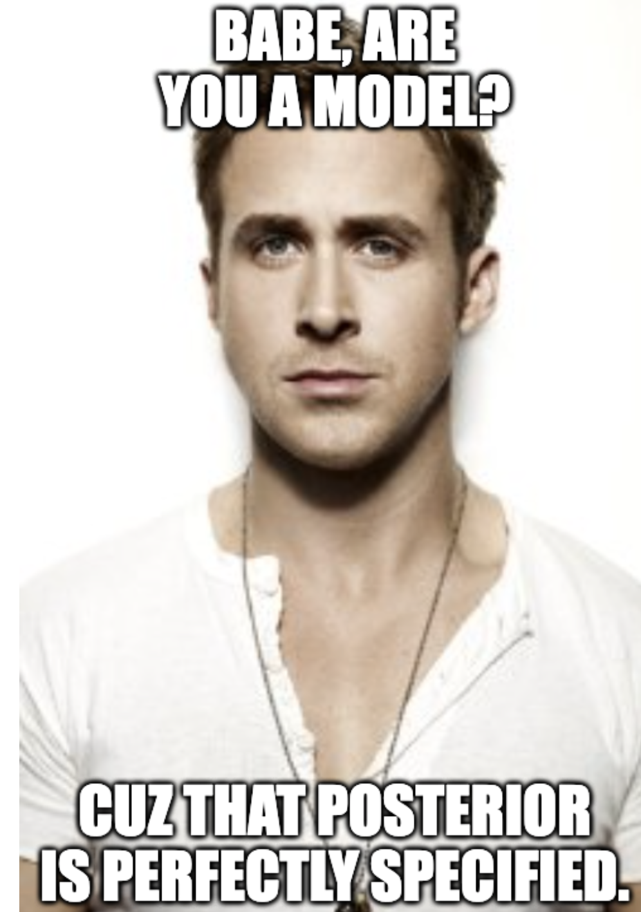

# Models {#models} 


<!-- ```{r models-meme} -->
<!--  -->
<!-- ``` -->

::: {.learning-goals}
🍎 Learning goals: 

* Reconceptualize statistical “tests” as models of data
* Build intuitions about how specific “tests” (e.g., t-tests) relate to more general frameworks (e.g., regression, mixed effects models)
* Identify which models are best suited for which research questions 
* Describe what it means to ‘control for’ something
* Explore what kinds of clustered variance are present in our designs
* Select models appropriate for different kinds of dependent variables
:::

In the previous two chapters, we introduced concepts surrounding estimation of an experimental effect and inference about its relationship to the effect in the population. The tools we introduced are very general, but they are limited in their applicability. Once you get beyond the world of two-condition experiments in which each participant contributes one data point from a continuous measure, the simple $t$-test is not sufficient.  

In some statistics textbooks, the next step would be to present a whole host of other statistical tests that are designed for other special cases. We could even show a decision-tree: what if you have repeated measures? Or categorical data? Or three conditions? But this isn't a statistics book, and even if it were, we don't advocate that approach. The idea of finding a specific narrowly-tailored test for your situation is part and parcel of the dichotomous NHST approach that we tried to talk you out of in the last chapter. If all you want is your $p<.05$, then it makes sense to look up the test that can allow you to compute a $p$ value in your specific case. But we prefer an approach that is more focused on getting a good estimate of the magnitude of the causal effect -- and the relation of that estimate to the population mean. 

In this chapter, we begin to explore how to to go about making these estimates and making inference about them -- and that brings us to the world of **statistical models**. A statistical model is a way of writing down a set of assumptions about how particular data are generated. Statistical models are the bread and butter tools for estimating particular **parameters** of interest -- like the magnitude of a causal effect associated with an experimental manipulation -- and making inferences about their relationship to the population parameter. 

For example, a simple statistical model might assume that observed datapoints are generated via with the flip of a weighted coin. Then the process of estimation is to assess the most likely weight of the coin given the data. This model can then be used to make inferences about whether the coin's weight differs from some null model (a fair coin, perhaps). 

This example sounds a lot like the kinds of simple inferential tests we talked about in the previous chapter; not very "model-y." But things get more interesting when there are multiple parameters to be estimated, as in many real-world experiments. In the tea-tasting scenario we've belabored over the past two chapters, a real experiment might involve multiple people tasting different types of tea in different orders, all with some cups randomly assigned to be milk-first or tea-first. What we'll learn to do in this chapter is to make a model of this situation that allows us to reason about the magnitude of the milk-order effect while also estimating variation due to different people, orders, and tea types. 

We'll begin by discussing the ubiquitous framework for building statistical models, **linear regression**, building up connections between regression and the $t$-test. This section will discuss how to add covariates to regression models, and when linear regression does and doesn't work. In the next section, we'll discuss the **generalized linear model**, an innovation that allows us to make models of a broader range of data types. We'll then briefly introduce **mixed models**, which allow us to model clustering in our datasets (such as clusters of observations from a single individual or single stimulus item). We'll end with some opinionated practical advice on model building. 


::: {.case-study}
🔬 Case study: Stimulus-specific effects

Imagine you're a psycholinguist who has the hypothesis that nouns are processed faster than verbs. You run an experiment where you pick out ten verbs and ten nouns, then measure a large sample of participants' reading time for each of these. You find strong evidence for the predicted effect and publish a paper on your claim. The only problem is that, at the same time, someone else has done exactly the same study -- with different nouns and verbs -- and published a paper making the opposite claim. The problem in this example is that each effect is driven by the specific experimental items that were chosen [@clark1973]. Out of hundreds of thousands of possible words, why these in particular? 

The problem of generalization from sample to population is not new -- as we discussed in Chapter \@ref(inference), we are constantly doing this kind of inference with the samples of people that participate in our experiments. Our classic statistical techniques are designed to generalize from sample to population and we are typically sensitive to the weakness of generalizations made from very small samples of experimental participants. Not so with stimuli.^[@clark1973, from whom this example is adapted, calls this the "language-as-fixed-effect" fallacy. This is a great label for folks who already know about fixed vs. random effects, but it doesn't highlight how it connects to the broader set of issues of generalizability that we highlight here and in Chapter \@ref(sampling), so we'll mostly use the label "stimulus generalizability."]

Stimulus generalizability problems have reared their head across a surprising range of different areas of psychology. In one example, hundreds of papers were written about a phenomenon called the "risky shift" -- in which groups deliberating about a decision would produce riskier decisions than individuals. Unfortunately, this phenomenon appeared to be completely driven by the specific choice of vignettes that groups deliberated about, with some producing a risky shift and others producing a more conservative shift [@westfall2015]. 

Another example comes from the memory literature, where a classic paper by @baddeley1975 suggested that words that take longer to pronounce ("tycoon" or "morphine") would be remembered worse than words that took a shorter amount of time ("ember" or "wicket") even when they had the same number of syllables. This effect also appears to be driven by the specific sets of words chosen in the original paper; the effect is robustly replicable with that set but not generalizable across other sets [@lovatt2000].

The implication of these examples is clear: experimenters need to take care in both their experimental design and analysis to avoid overgeneralizing from their stimuli to a broader construct. Three primary steps can help experimenters avoid this pitfall:

1. To maximize generality, use samples of experimental items -- words, pictures, or vignettes -- that are comparable in size to your samples of participants.
2. When replicating an experiment, consider taking a new sample of items as well as a new sample of participants. 
3. When experimental items are sampled random from a broader population, use a statistical model -- such as the ones described below -- that includes this sampling process. 
:::

## Regression models

There are many types of statistical models, but this chapter will focus primarily on regression, a broad and extremely powerful class of models. A regression model relates a dependent variable to one or more independent variables. Dependent variables are sometimes called **outcome variables**, and independent variables are sometimes called **predictor variables**, **covariates**, or **features**. We will see that many common statistical estimators (like the sample mean) and methods of inference (like the $t$-test) are actually simple regression models. Understanding this point will help you see many statistical methods as special cases of the same underlying framework, rather than as unrelated, ad hoc methods. 

### Regression for estimating a simple treatment effect


```{r models-helper}
source("helper/tea_helper.R")
tea_data <- make_tea_data(n = 24)
```

<!-- : Treatment effect estimation in a two-group experiment -->

<!-- MBM to MCF: Estimation chapter actually foreshadows *Welch's* t-test because it describes unequal vars. Inference chapter generically refers to a t-test without making distinction. Let's discuss. -->

Let's start with one of these special cases, namely estimating a treatment effect, $\beta$, in a two-group design. In Chapter \@ref(estimation), we solved this exact challenge for the tea-tasting experiment. We posited a model in which the milk-first ratings were normally distributed with mean $\theta_{milkfirst} = \theta_{teafirst} + \beta$ and with standard deviation $\sigma_{milkfirst}$.^[Here's a quick reminder that "model" here is a way of saying "set of assumptions about the data generating procedure." So saying that some equation is a "model" is the same as saying, we think this is where the data came from. We can "turn the crank" -- generate data through the process that's specified in those equations, e.g., pulling numbers from a normal distribution with mean $\theta_{milkfirst}$ and standard deviation $\sigma_{milkfirst}$. In essence, we're committing to the idea that this process will give us data that are substantively similar to the ones we have already.]

Let's now write that model as a regression model, that is, as a model relating each participant's tea rating, $Y_i$, given that participant's treatment assignment, $X_i$. $X_i=0$ represents the control (milk-first) group and $X_i=1$ represents the treatment (tea-first) group. Here, $Y_i$ is the dependent variable, and $X_i$ is the independent variable. $i$s are an index variable for each of the participants. To make this concrete, you can see some sample tea-tasting data (N=24 for simplicity) below, with the index $i$, the condition and its predictor $X_i$, and the rating $Y$.

```{r models-datatable}
tea_data |> 
  mutate(i = 1:n(),
         X = ifelse(condition == "tea first", 1, 0)) |>
  rename(`rating (Y)` = rating) |>
  select(i, condition, X, `rating (Y)`) |>
  DT::datatable(rownames=FALSE, 
                caption = "Example tea tasting data in a regression format.")
```

Here's the model:

<!-- MBM to MCF: Let's discuss whether to switch to standard notation (e.g., betas) in this chapter or to stick with notation more like the previous chapter. I might lean toward using standard notation here and syncing earlier chapter with that notation. -->
<!-- MM: Not sure if align environment is supported in RMD. Might need to use this: https://stackoverflow.com/questions/47912278/align-environment-in-r-markdown-which-works-for-both-docx-and-pdf-output --> 
\begin{align}
\label{eq:ols_ttest}
Y_i &= \theta_{milkfirst} + \beta X_i + \epsilon_i \\
\end{align}

A model like this is called a **linear regression of Y on X**. $\theta_{milkfirst} + \beta X_i$ is called the **linear predictor**, and it describes the expected value of an individual's tea rating, $Y_i$, given that participant's treatment group $X_i$ (the single independent variable in this model). That is, for a participant in the control group ($X_i=0$), the linear predictor is just equal to $\theta_{milkfirst}$, which is indeed the mean for the control group that we specified above. On the other hand, for a participant in the treatment group, the linear predictor is equal to $\theta_{milkfirst} + \beta$, which is the mean for the treatment group that we specified. In regression jargon, $\beta$ is a **regression coefficient**, representing the association of the independent variable $X_i$ with the outcome $Y_i$.

The term $\epsilon_i$ is the **error term**, referring to random variation of participants' ratings around the group mean.^[Formally, we'd write $\epsilon_i \sim N(0, \sigma^2)$. The tilde means "is distributed as", and what follows is a normal distribution with mean 0 and variance $\sigma^2$.] Note that this is a very specific kind of "error"; it not to "error" due to bias, for example. Instead, you can think of the error terms as capturing the "error" that would be associated with predicting any given participant's rating based on just the linear predictor. If you predicted a control group participant's rating as $\theta_{milkfirst}$, that would be a good guess -- but you still expect the participant's rating to deviate somewhat from $\theta_{milkfirst}$ due to "error". In our regression model, the linear predictor and error terms together say that participants' ratings scatter randomly (in fact, normally) around their group means with standard deviation $\sigma$. And that is exactly the model we posited in Chapter \@ref(estimation).
<!-- [NOT TRUE BECAUSE PREVIOUS MODEL USED UNEQUAL VARIANCES.]  -->


```{r models-ols-plot, fig.cap= "(left) Best-fitting regression coefficients for the tea-tasting experiment. (right) Much worse coefficients for the same data."}
tea_data <- tea_data |>
  group_by(condition) |>
  mutate(cond_mean = mean(rating), 
         bad_cond_mean = ifelse(condition == "milk first", 
                                cond_mean + 1.5, cond_mean - 1.5))

j <- .1
p1 <- ggplot(tea_data, 
       aes(x = condition, y = rating)) + 
  geom_pointrange(aes(xmin = condition, xmax = condition,
                   ymin = cond_mean, ymax = rating, y = rating), 
                  position = position_jitter(width = j, height = 0), 
                  alpha = .5,
                  lty = 3) + 
  geom_segment(aes(x = as.numeric(as.factor(condition)) - j, 
                   xend = as.numeric(as.factor(condition)) + j,
                   y = cond_mean, 
                   yend = cond_mean), col = "blue") +
  geom_text(data = data.frame(x = c(2 + j + .1, 1 + j + .1),
                              y = c(mean(tea_data$rating[tea_data$condition == "tea first"]), 
                                  mean(tea_data$rating[tea_data$condition == "milk first"])),
                              label = c("Θ+β", "Θ")),
            mapping = aes(x = x, y = y, label = label),
            col = "blue", 
            inherit.aes = FALSE) + 
  xlab("Condition") + 
  ylab("Rating") + 
  ggtitle("Best fitting regression coefficients")

p2 <- ggplot(tea_data, 
       aes(x = condition, y = rating)) + 
  geom_pointrange(aes(xmin = condition, xmax = condition,
                   ymin = bad_cond_mean, ymax = rating, y = rating), 
                  position = position_jitter(width = j, height = 0), 
                  alpha = .5,
                  lty = 3) + 
  geom_segment(aes(x = as.numeric(as.factor(condition)) - j, 
                   xend = as.numeric(as.factor(condition)) + j,
                   y = bad_cond_mean, 
                   yend = bad_cond_mean), col = "blue") +
  geom_text(data = data.frame(x = c(2 + j + .1, 1 + j + .1),
                              y = c(mean(tea_data$rating[tea_data$condition == "tea first"]) - 1, 
                                  mean(tea_data$rating[tea_data$condition == "milk first"]) + 1),
                              label = c("Θ+β", "Θ")),
            mapping = aes(x = x, y = y, label = label),
            col = "blue", 
            inherit.aes = FALSE) + 
  xlab("Condition") + 
  ylab("Rating") + 
  ggtitle("Much worse coefficients")

cowplot::plot_grid(p1,p2)
```

Now we have the model. How do we estimate the regression coefficients $\theta_{milkfirst}$ and $\beta$? The usual method is called **ordinary least squares (OLS)**. Here's the basic idea. For any given regression coefficient estimates $\widehat{\theta}_{milkfirst}$ and $\widehat{\beta}$, we would obtain different **predicted values**, $\widehat{Y}_i = \theta_{milkfirst} + \beta X_i$ for each participant. Some regression coefficient estimates will yield better predictions than others. OLS estimation is designed to find the values of the regression coefficients that optimize these predictions, meaning that the predictions are as close as possible to participants' true outcomes, $Y_i$.^[Specifically, OLS minimizes squared error loss, in the sense that it will choose the regression coefficient estimates whose predictions minimize $\sum_{i=1}^n \left( Y_i - \widehat{Y}_i\right)^2$, where $n$ is the sample size. A wonderful thing about OLS is that those optimal regression coefficients (generically termed $\widehat{\mathbf{\beta}}$) turn out to have a very simple closed form: $\widehat{\mathbf{\beta}} = \left( \mathbf{X}'\mathbf{X} \right)^{-1} \mathbf{X}'\mathbf{y}$. We are using more general notation here because there could be multiple independent variables. Therefore, $\widehat{\mathbf{\beta}}$ is a vector, $\mathbf{X}$ is a matrix of independent variables for each subject, and $\mathbf{y}$ is a vector of participants' outcomes. As more good news, the standard error for $\widehat{\mathbf{\beta}}$ has a similarly simple closed form.]

Figure \@ref(fig:models-ols-plot) gives a graphical illustration of the tea tasting data for each condition (the dots) along with the model predictions for each condition $\theta_{milkfirst}$ and $\theta_{milkfirst} + \beta$ (blue lines). The distance of each point to the predictions (the thing that OLS wants to minimize) is shown by the dotted lines. Another name for these errors is **residuals**: they are the "residual variation" that is not predicted by the model.

The left-hand plot shows the best coefficient values -- the ones that move the model as close as possible to each point, minimizing the total squared length of the dashed lines. The right-hand plot shows a substantially worse solution. The amazing thing about OLS is that it is a simple way to find the best solution for a wide range of useful models.^[You'll notice that we haven't talked at all about $p$-values in this chapter. Regression models can be used to produce $p$-values on specific coefficients, representing inferences about the likelihood of a particular coefficient magnitude relative to some null hypothesis. You can also compute Bayes Factors on specific regression coefficients. We won't talk much about either of these computations though. As we said, we're not really trying to teach you statistics, just how to think about data!]

### Adding predictors

The regresson model we just wrote down is the same thing as the $t$-test from Chapter \@ref(inference). But the beauty of regression modeling is that much more complex estimation problems than this can also be written as regression models, essentially by extending what we did above. For example, we might want to add another predictor variable, such as the age of the participant.^[The ability to estimate multiple coefficients at once is a huge strength of regression modeling, so much so that sometimes people use the label **multiple regression** to denote that there is more than one predictor + coefficient pair.]

Let's add this new independent variable and a corresponding regression coefficient to our model:

\begin{align}
\label{eq:ols_one_covariate}
Y_i &= \theta_{milkfirst} + \beta X_{i1} + \theta_{age} X_{i2}  + \epsilon_i \\
\end{align}
<!-- \epsilon_i &\sim N(0, \sigma^2) -->
<!-- WHY ARE WE USING THETA FOR THE CONTINUOUS PREDICTORS INSTEAD OF BETA? -->

Now that we have multiple independent variables, we've labeled them $X_{i1}$ (treatment group) and $X_{i2}$ (age) for clarity.

To illustrate how to interpret the regression coefficients in this model, let's use the linear predictor to compare the model's predicted tea ratings for two hypothetical participants who are both in the treatment group: 20-year-old Alice and 21-year old Bob. Alice's linear predictor tells us that her expected rating is $\theta_{milkfirst} + \beta + \theta_{age} \cdot 20$. In contrast, Bob's linear predictor is $\theta_{milkfirst} + \beta + \theta_{age} \cdot 21$. We could therefore calculate the expected difference in ratings for 21-year-olds versus 20-year olds by subtracting Alice's linear predictor from Bob's, yielding just $\theta_{age}$. How simple! 

In fact, we would get the same result if Alice and Bob were instead 50 and 51 years old, respectively. Try this yourself. This equivalence illustrates a key point about linear regression models in general: *the regression coefficient represents the mean (i.e., expected) difference in $Y_i$ when comparing participants who differ by 1 unit of the corresponding independent variable* (here, comparing participants who differ by 1 year of age). In "Practical modeling considerations" below, we discuss whether and when to "control for" additional variables (i.e., when to add them to your model) .

### When does linear regression work?

Linear regression modeling with OLS is an incredibly powerful technique for creating models to estimate the influence of multiple predictors on a single dependent variable. In fact, OLS is in a mathematical sense the *best* way to fit a linear model!^[There is a precise sense in which OLS gives the *very best* predictions we could ever get from any model that posits linear relationships between the independent variables and the outcome. That is, you can come up with any other linear model you want, and yet if the assumptions of OLS are fulfilled, predictions from OLS will always be less noisy than those of your model. This is because of an elegant mathematical result called the Gauss-Markov Theorem.] But OLS only "works" -- in the sense of yielding good estimates -- if three big conditions are met. 

1. **The predictor relationships being modeled must be linear.** In our comparison of Alice's and Bob's expected outcomes based on their 1-year age difference, we were able to interpret the coefficient $\theta_{age}$ as the average difference in $Y_i$ when comparing participants who differ by 1 year of age, *regardless* of whether those ages are 20 vs. 21 or 50 vs. 51. But that's not always true: plenty of things vary **non-linearly** with age -- for example, imagine growth in height over age! Linear regression will give bad answers in such cases.^[One way to accommodate **nonlinearities** is to modify the linear predictor to include polynomial terms, such as $age^2$, which then allow us to fit a curve rather than just a straight line. It is always a good idea to use visualizations like scatterplots to look for possible problems with linearity.]

<!-- [Suggested Figure. Panel A: Scatterplot showing a nice linear relationship with OLS fit superimposed. Panel B: Scatterplot showing a nonlinear relationship with OLS fit, OLS fit with x^2 term, and LOESS superimposed.] -->

2. **Errors must be independent.** In our example, observations in the regression model (i.e., rows in the dataset) were sampled independently: each participant was recruited independently to the study and each performed a single trial. On the other hand, suppose we have repeated-measures data in which we sample participants, and then obtained multiple measurements for each participant. Within each participant, measurements would likely be correlated (perhaps due to their general level of tea enjoyment). This correlation in turn invalidates inferences from a model that does not include it. 

<!-- Usually, outcome measurements within a participant will be correlated: if we measure 10 participants' blood pressures every day for a week, some participants will typically have high values whereas others will typically have low values, even though any given participant will also have some variation in their own measurements over time.[^models-3] To help identify such situations, it can be helpful to plot the distribution of **residuals** for each participant (or a random sample thereof) to see whether this distribution seems to differ across participants.  -->

<!-- [^models-3] To be specific, it is not the blood pressure values ($Y_i$) themselves that must be independent, but rather the error terms ($\epsilon$). The error terms are what is "left over" after accounting for systematic variation that is predicted by the independent variables. If, in principle, we managed to include in the linear predictor all variables that might explain individual differences in typical blood pressure (e.g., genetic factors, sex, age, etc.), then the errors would be independent even though the outcomes themselves are not. However, as a heuristic, considering possible sources of correlation in the outcomes themselves is often a reasonable proxy for thinking about the error terms. -->


<!-- [Suggested Figure. Violin plots, or similar, showing residuals for different subjects. The residuals exhibit non-independence.] -->

3. **Errors must be normal and unrelated to the predictor.** Imagine older people have very strong tea-ordering preferences while younger people do not. In that case, the models' error term would be more variable for older participants than younger ones. This issue is called **heteroskedasticity**. It is a good idea to plot each independent variable versus the residuals to see if the residuals are more variable for certain values of the independent variable than for others.
 
 <!-- This is often the case for highly skewed outcome variables. For example, if we regressed participants' incomes on their years of education, we will find that higher education is associated with higher income. However, because income is highly right-skewed in many samples (some people have extremely high incomes), income will typically be more variable for individuals with more education than for those with less education. For this reason, if we predicted incomes for individuals with 16 years of education (i.e., they completed 4-year college and then stopped) and also for individuals with 8 years (i.e., they completed middle school and then stopped), the errors in the former predictions will probably be more variable than the errors in the latter predictions.  -->

<!-- [Suggested Figure. X vs. residuals, showing heteroskedasticity.] -->

If any of these three conditions are violated, estimates and inferences from your model may be suspect. 

## Generalized linear models

So far we have considered continuous outcome measures, like tea ratings. What if we instead had a binary outcome, such as whether a participant liked or didn't like the tea, or a count outcome, such as the number of cups a participant chose to drink? These and other non-continuous outcomes often violate the assumptions of OLS, in particular because they often induce heteroskedastic errors. For example, count outcomes are often right-skewed because a count cannot be less than 0, creating heteroskedasticity for the same reasons discussed above when we considered skewed continuous outcomes. Binary outcomes inherently violate heteroskedasticity because the variance of a binary variable depends directly on the success probability; this means that the errors will be more variable for individuals whose covariate values place their expected success probability closer to 0.50.[^models-4] 

Happily, there are regression models closely related to OLS that can handle non-continuous outcomes. These models are called **generalized linear models** (GLM), and OLS is one of many members of this large class of models. To see the connection, let's first write an OLS model more generally in terms of what it says about the expected value of the outcome:

\begin{align}
\label{eq:ols_general_form}
E[Y_i] &= \beta_0 + \sum_{j=1}^p \beta_j X_j
\end{align}
where $p$ is the number of independent variables, $\beta_0$ is the intercept, and $\beta_j$ is the regression coefficient for the $j^{th}$ independent variable.

The linear predictor of a GLM (i.e., $\beta_0 + \sum_{j=1}^p \beta_j X_j$) looks exactly the same as for OLS, but instead of modeling $E[Y_i]$, a GLM models some **transformation**, $g(.)$, of the expectation:[^models-5] 

\begin{align}
\label{eq:glm_general_form}
g( E[Y_i] ) &= \beta_0 + \sum_{j=1}^p \beta_j X_j 
\end{align}

It turns out that by choosing a transformation of $E[Y_i]$ that is suitable for the outcome type, we can still fit a linear model. This transformation is called the **link function**. For example, $g(x) = log(x)$ is usually a suitable link function for count or binary outcomes; the model is then called a **log-binomial** regression. When using this link function, exponentiating the coefficients (i.e., taking the inverse of the link function) yields **risk ratios**. A risk ratio (e.g., $\exp(\beta_j)$) represent the *multiplicative* increase in the probability of $Y_i=1$ that is associated with a one-unit increase in the relevant predictor variable (e.g., $X_j$).

Another common link function for binary data is the logit link, $g(x) = \log \left( \frac{x}{1 - x} \right)$; the model is then called **logistic regression**. The term $\frac{x}{1 - x}$ is called an **odds** and represents the probability of an event occurring divided by the probability of its not occurring. Exponentiating the coefficients would yield **odds ratios**, which are the *multiplicative* increase in the odds of $Y_i=1$ that is associated with a one-unit increase in the relevant predictor variable.

GLMs differ from OLS not only in their link functions, but also in how they handle the error terms; however, we won't cover that here. We have only scratched the surface of GLMs here, but the take-home point is simply that they are usually the tool of choice for fitting regression models with non-continuous outcomes. 


[^models-4] Specifically, the variance of a binary variable with success probability $p$ is simply $p(1-p)$, which is maximized at $p=0.50$. 

[^models-5] Note that GLMs involve transforming the *expectation* of the outcome, not the outcome itself! That is, we are not just taking the outcome variable in our dataset and transforming it before fitting an OLS model, but rather we are fitting a different model entirely, one that posits a fundamentally different relationship between the predictors and the expected outcomes.


## Accommodating clustering in our models

As noted above, another common situation in which the assumptions of OLS are violated is when the error terms are not independent, for example in repeated-measures data in which participants' error terms across time points are likely to be clustered. We will discuss two classes of methods for accommodating clustering in regression. 

### Linear mixed models

The first class of methods is **linear mixed models** (LMM). In this approach, we modify the linear predictor itself to model differences across clusters. Suppose we modified the original tea-tasting experiment (without the age covariate) to collect repeated ratings from each participant, such that each participant tastes 5 milk-first and 5 tea-first cups. Then we could fit a LMM as follows:

\begin{align}
\label{eq:lmm}
Y_i &= \theta_{milkfirst} + \gamma_i + \beta X_{it} + \epsilon_{it} \\
\gamma_i \sim N(0, \tau^2) \\
\epsilon_{it} &\sim N(0, \sigma^2) \\
\end{align}

where $Y_{it}$ is participant $i$'s rating in trial $t$ and $X_{it}$ is the participant's assigned treatment in trial $t$ (i.e., milk-first or tea-first). Compare this model to the basic OLS model in Equation (\ref{eq:ols_ttest}). Here we've introduced another intercept coefficient, $\gamma_i$, and it's unlike the original intercept $\theta_{milkfirst}$ in that $\gamma_i$ varies across participants. As such, $\gamma_i$ is a **random intercept**, whereas $\theta_{milkfirst}$ is a **fixed intercept**. Specifically, we have assumed that each participant has their own typical "baseline" tea rating -- some participants generally like tea more than others -- and that these baseline ratings are normally distributed across participants. Thus, ratings are correlated within participants because ratings cluster around each participant's *unique* baseline tea rating. LMMs can be further extended to model clustering of the independent variables' effects across subjects. To do so, we could introduce **random slopes** ($\gamma_i$) to the model, which represent differences across participants in the effects of independent variables:

\begin{align}
\label{eq:lmm}
Y_i &= \theta_{milkfirst} + \gamma_i + \beta X_{it} + \gamma_j + X_{i1} + \epsilon_{it} \\
\gamma_i \sim N(0, \tau^2) \\
\epsilon_i &\sim N(0, \sigma^2) \\
\end{align}

LMM is powerful and is a very common approach in psychology, but it does have limitations. Its validity relies on our ability to correctly specify the structure of the random intercepts and errors. This is particularly problematic when the correlation structure of the errors is misspecified, for example if observations within a participant are more correlated for participants in the treatment group than in the control group; in such cases, LMM estimates can be substantially biased [@bie2021fitting]. It can be difficult to verify if the model specification is reasonable, especially with a small number of clusters or observations. Even if the model is correctly specified, LMM can severely underestimate standard errors (e.g., yielding too-small $p$-values) if the number of clusters is not large.[^models-6]

### An alternative approach: Generalized estimating equations

A second class of methods that helps resolve these issues is **generalized estimating equations** (GEE). In this approach, we leave the linear predictor alone. We do not add random intercepts or slopes, nor do we assume anything about the distribution of the errors (i.e., we no longer assume that they are normal, independent, and homoskedastic). We instead provide the model with an initial "guess" about how we think the errors might be related to one another; for example, in a repeated-measures experiment, we might guess that the errors are exchangeable, meaning that they are correlated to the same degree within each participant but are uncorrelated across participants. Instead of *assuming* that our guess is correct, as does LMM, GEE estimates the correlation structure of the errors empirically, using our guess as a starting point, and it uses this correlation structure to arrive at point estimates and inference for the regression coefficients. Remarkably, as the number of clusters and observations become very large, GEE will *always* provide unbiased point estimates and valid inference, *even if* our guess about the correlation structure was bad. Additionally, with simple finite-sample corrections [@mancl2001covariance], GEE seems to provide valid inference at smaller numbers of clusters than does LMM. The price paid for these nice safeguards against model misspecification is that, in principle, GEE will typically have less statistical power than LMM *if* the LMM is in fact correctly specified, but the difference may be surprisingly slight in practice [@bie2021fitting]. For these reasons, we tend to prefer GEE with finite-sample corrections over LMM as the default model for clustered data. In general, we tend to favor LMM over GEE only when the number of observations and clusters are quite large, and when careful diagnostics also indicate that distributional assumptions are fulfilled.

[MBM to MCF: Above is what I usually say as my default recommendation for GEE vs. LMM, but happy to discuss and modify if you don't agree. I also haven't touched the marginal vs. conditional interpretation issue since this has been about LMM and not GLMM.]

[^models-6] How many clusters are enough for LMM to behave well? This is an active area of research, and the answer will depend on the number of observations in each cluster and the model structure. However, some empirical findings suggest that, at least for certain models, LMM can considerably underestimate standard errors even with, for example, 20 clusters each with 100 observations [@bie2021fitting].
 


## How do you use models to analyze data? 

Estimating one quantity in isolation is often not the best thing to do. In almost any experiment, there will be variation in the estimate that has to do with other known sources. Imagine the Stroop effect, which has a fairly consistent effect on both fast and slow readers [@haaf2017]. But estimates of this effect will be more precise if we take into account that some readers are slower or faster, rather than just averaging across all this variation. That's why we need models that take into account different sources of variation. 

**Make a simple model** that includes all of the key parts of the design (link to visualization). 

**don't muck up your causal inference**


**check the model against the data**

**interpret the predictions of the model**


### When does it makes sense to include covariates in a model?

- adjusting models for unhappy randomization?

Going back to our example, now we have two variables – age and order – that are no longer confounded with our primary relationship of interest (i.e., Dylan and writing). But they may still be related to our outcome measure. Here's what the picture looks like, repeated from above.


Even if they are not confounding our experimental manipulation, age and experimental condition order may still be correlated with our outcome measure, writing skill. How does this work? Well, the average treatment effect of Dylan on writing is still given by the regression Y ~ X.  But we also know that there is some variance in Y that is due to X' and Z.

That's because age and order are covariates: they may – by virtue of their potential causal links with the outcome variable – have some correlation with outcomes, even in a case where the predictor is experimentally manipulated. This should be intuitive for the external (age) covariate, but it's true for both: they may account for variance in Y over and above that controlled by the experimental manipulation of X.

What should we do about our covariates?

Option 1. Nothing! We are totally safe in ignoring all of our covariates, regressing Y on X and treating the estimate as an unbiased estimate of the the effect (the ATE). This is why randomization is awesome. We are guaranteed that, in the limit of many different experiments, even though people with different ages will be in the different Dylan conditions, this source of variation will be averaged out.

The first fallacy of covariates is that, because you have a known covariate, you have to adjust for it. Not true. You can just ignore it and your estimate of the ATE is unbiased. This is the norm in cognitive psychology, for example: variation between individuals is treated as noise and averaged out. Of course, there are weaknesses in this strategy – you will not learn about the relationship of your treatment to those covariates! – but it is sound.

Option 2. If you have a small handful of covariates that you believe are meaningfully related to the outcome, you can plan in advance to adjust for them in your regression. In our Dylan example, this would be a pre-registered plan to add Z as a predictor: Y ~ X + Z. If age (Z) is highly correlated with writing ability (Y), then this will give us a more precise estimate of the ATE, while remaining unbiased.

When should we do this? Well, it turns out that you need a pretty strong correlation to make a big difference. There's some nice code to simulate the effects of covariate adjustment on precision in this useful blogpost on covariate adjustment; I lightly adapted it. Here's the result:


Root mean squared error (RMSE; lower RMSE means greater precision, in other words) is plotted as a function of the sample size (N). Different colors show the increase in precision when you control for covariates with different levels of correlation with the outcome variable. For low levels of correlation with the covariate, you don't get much increase in precision (pink and red lines). Only as the correlation is .6 or above do we see noticeable increases in precision; and it only really makes a big difference with correlations in the range of .8.

Considering these numbers in light of our Dylan study, I would bet that age and writing skill are not correlated with writing skill > .8 (unless we're looking at ages from kindergarten to college!). I would guess that in an adult population this correlation would be much, much lower. So maybe it's not worth controlling for age in our analyses.

And the same is probably true for order, our other covariate. Although perhaps we do think that our order has a strong correlation with our skill measure. For example, maybe our experiment is long and  there are big fatigue effects. In that case, we would want to condition.

So these are are options: if the covariate is known to be very strong, we can condition. Otherwise we should probably not worry about it.

What shouldn't we do with our covariates?

Don't condition on lots and lots of covariates because you think they are theoretically important. There are lots of things that people do with covariates that they shouldn't be doing. My participantal hunch is that this is because a lot of researchers think that covariates (especially demographic ones like age, gender, socioeconomic status, race, ethnicity, etc.) are important. That's true: these are important variables. But that doesn't mean you need to control for them in every regression. This leads us to the second fallacy.

The second fallacy of covariates is that, because you think covariates are in general meaningful, it is not harmful to control for them in your regression model. In fact, if you control for meaningless covariates in a standard regression model, you will on average reduce your ability to see differences in your treatment effect. Just by chance your noise covariates will "soak up" variation in the response, leaving less to be accounted for by the true treatment effect! Even if you strongly suspect something is a covariate, you should be careful before throwing it into your regression model.

Don't condition on covariates because your groups are unbalanced. People often talk about "unhappy randomization": you randomize adults to the different Dylan groups, for example, but then it turns out the mean age is a bit different between groups. Then you do a t-test or some other statistical test and find out that you actually have a significant age difference. But this makes no sense: because you randomized, you know that the difference in ages occurred by chance, so why are you using a t-test to test if the variation is due to chance? In addition, if your covariate isn't highly correlated with the outcome, this difference won't matter (see above). Finally, if you adjust for this covariate because of such a statistical test, you can actually end up biasing estimates of the ATE across the literature. Here's a really useful blogpost from the Worldbank that has more details on why you shouldn't follow this practice.

Don't condition on covariates post-hoc. The previous example is a special case of a general practice that you shouldn't follow. Don't look at your data and then decide to control for covariates! Conditioning on covariates based on your data is an extremely common route for p-hacking; in fact, it's so common that it shows up in Simmons, Nelson, & Simonsohn's (2011) instant classic False Positive Psychology paper as one of the key ingredients of analytic flexibility. Data-dependent selection of covariates is a quick route to false positive findings that will be less likely to be replicable in independent samples.

Don't condition on a post-treatment variable. As we discussed above, there are some reasons to condition on highly-correlated covariates in general. But there's an exception to this rule. There are some variables that are never OK to condition on – in particular, any variable that is collected after treatment. For example, we might think that another good covariate would be someone's enjoyment of Bob Dylan. So, after the writing measurements are done, we do a Dylan Appreciation Questionnaire (DAQ). The problem is, imagine that having a bad experience writing while listening to Dylan might actually change your DAQ score. So then people in the Dylan condition would have lower DAQ on average. If we control for DAQ in our regression (Y ~ X + DAQ), we then distort our estimate of the effects of Dylan. Because DAQ and X (Dylan condition) are correlated, DAQ will end up soaking up some variance that is actually due to condition. This is bad news. Here's a nice paper that explains this issue in more detail.

Don't condition on a collider. This issue is a little bit off-topic for the current post, since it's primarily an issue in observational designs, but here's a really good blogpost about it.

Covariates and confounds are some of the most basic concepts underlying experimental design and analysis in psychology, yet they are surprisingly complicated to explain. Often the issues seem clear until it comes time to do the data analysis, at which point different assumptions lead to different default analytic strategies. I'm especially concerned that these strategies vary by culture, for example with some psychologists always conditioning on confounders, and others never doing so. (We haven't even talked about mediation and moderation!). Hopefully this post has been useful in using the vocabulary of causal models to explain some of these issues.


<!-- ## Connection to Bayesian approaches -->

<!-- * Say that what we have covered so far is essentially just the likelihood; formalize the intuition from "Estimation" about Bayesian inference to show how a prior affects the model specification -->


## Chapter summary: Models


<!-- structure in your data so that you can better estimate the particular effects of interest. -->
<!-- *** The advice not to model covariates that aren't very correlated with your outcome is very frequentist, with the idea being that you lose power when you condition on too many things. In contrast, Gelman & Hill (2006) give more Bayesian advice: if you think a variable matters to your outcome, keep it in the model. This advice is consistent with the idea of modeling experimental covariates, even if they don't have a big correlation with the outcome. In the Bayesian framework, including this extra information should (maybe only marginally) improve your precision but you aren't "spending degrees of freedom" in the same way. -->


<!-- ## FROM PREVIOUS STRUCTURE: Inference and estimation for two-group designs -->

<!-- Throughout this book we've taken the position that the goal of experiments is to estimate a causal effect of interest, ideally as part of some theory of how different constructs relate to one another. All this talk of hypotheses and inferences above is only indirectly related to that goal.  -->

<!-- - Intuition builder: For very large n, or flat prior, Bayes and frequentist coincide.  -->


<!-- ### Simple models of between-group differences -->

<!-- Introducing simple inference models: -->

<!-- - The chi-squared test for inferring whether two samples come from the same distribution -->
<!-- - The t-test for inferring whether a single group’s effect differs from 0 -->
<!-- - The t-test for inferring whether two groups differ from one another -->
<!-- - The paired t-test as a first glimpse at how we might account for participant-level random effects (see Chapter 7). -->


<!-- ::: {.accident-report} -->
<!-- ⚠️ Accident report: Once you have the basic t-test under your belt, it might feel natural to compare each group to 0 and conclude that one group is different from 0 and the other one isn’t. But “the difference between significant and not significant is not necessarily itself statistically significant” (Nieuwenhuis, Forstmann, and Wagenmakers 2011).  -->
<!-- ::: -->


<!-- How to go from theory to hypotheses to statistical model -->

<!-- Re-casting the t-test as a regression model  -->

<!-- ::: {.interactive} -->
<!-- ⌨️ Interactive box: Visualizing how different tests are variants of linear models. -->
<!-- ::: -->

<!-- - Discrete data and logistic regression. Same thing, different linking function. (lead-in to GLM: probit, Poisson, beta, etc.). -->

<!-- Multilevel regression models of a difference between two groups, controlling for experimental items and subject -->

<!--   - Sidebar: what should you control for? Different subcultures in psychology either post-hoc control for or look for moderation by demographic factors. We discuss the consequences of these decisions for both precision and causal inference.  -->

<!-- Causality revisited: what can and can’t be concluded from an experiment -->

<!-- ::: {.accident-report} -->
<!-- ⚠️ Accident report: Mediation going wrong: even when you have a randomized experiment, you can still mess up your causal inference (Montgomery, Nyhan, and Torres 2018).  -->
<!-- ::: -->

<!-- - Dropping subjects who fail a manipulation check can be problematic (Aronow, Baron, and Pinson 2019). -->
<!-- - Mediation requires more confounding assumptions than causal inference about total effects, and these assumptions may be violated even in randomized experiments.  -->


<!-- ### Homeless -->

<!-- ⌨️ Interactive box: non-parametric simulations where you can shuffle data across groups a bunch of times and see what kind of distribution it produces by chance -->


<!-- ::: {.interactive} -->
<!-- ⌨️ Interactive: Nonparameteric resampling under the null -->

<!-- As we've seen above, hypothesis testing hinges on approximating the null distribution of the statistical estimate. In the examples above, it was easy to use statistical theory to work out the null distribution: for example, in Figure \@ref(fig:inference-null-model), we knew that the null distribution must be binomial since we had a binary outcome, and the binomial distribution parameter $p$ must be 0.5, because that is what the null says.  -->

<!-- But sometimes we don't know what the null distribution would look like. Suppose we want to estimate group differences in a highly skewed continuous outcome, like salary, but we had a small sample size (e.g., $n=10$ per group): -->

<!-- ```{r inference-permutation-1, eval=FALSE} -->
<!-- print(d) -->

<!-- set.seed(451) -->
<!-- n.per.group = 10 -->
<!-- d = data.frame( Y = c( rexp( n = n.per.group, rate = 4 ), -->
<!--                        rexp( n = n.per.group, rate = 4 ) + 0.3 ), -->
<!--                 Group = c( rep( "Control", n.per.group ), -->
<!--                            rep ( "Treatment", n.per.group ) ) ) -->

<!-- colors = c("black", "orange") -->
<!-- ggplot( data = d, -->
<!--         aes(x = Y, group = Group ) ) + -->

<!--   #geom_histogram( aes(fill = Group), alpha = 0.4 ) + -->
<!--   geom_dotplot( aes( fill=Group ), alpha=0.4, binwidth = .05 ) + -->
<!--   scale_y_continuous(NULL, breaks = NULL) + -->

<!--   theme_bw() + xlab("Y") + -->
<!--   ylab("")  -->
<!-- ``` -->

<!-- We can't proceed with a t-test in good conscience because, with only $n=20$, we can't necessarily trust that the Central Limit Theorem has "kicked in" sufficiently for the test to work despite the skewness. Stated otherwise, we can't be sure that the null distribution is normal in this case.  -->

<!-- When we can't rely on theory, another way to approximate a null distribution is through nonparameteric resampling. "Resampling" means that we're going to cleverly draw new samples *from our existing sample*, and "nonparametric" means that we will do this in a way that obviates assumptions about the shape of the null distribution (in contrast to parameteric approaches that do rely on such assumptions). -->

<!-- The central idea is that, if the treatment truly had no effect on the outcome, then the observations would be *exchangeable* between the treatment and control groups. That is, there would not be systematic differences between the treatment and control groups. This may or may not be true in our observed sample (after all, that's why we're doing a hypothesis test in the first place), but we could draw new samples from our existing sample in a manner that forces exchangeability. In this case, we could randomly permute the column of outcomes in our dataset while leaving the column of treatment assignments fixed: -->

<!-- ```{r inference-permutation-2, eval=FALSE} -->
<!-- # show construction of a single permuted dataset -->
<!-- # library(modelr) -->
<!-- # library(purrr) -->
<!-- perm.reps = 100 -->
<!-- perms = permute(data = d, n = perm.reps, Y) -->

<!-- # show the first permuted dataset -->
<!-- print( perms$perm[[1]]$data ) -->

<!-- #@WHY ARE THESE ALL THE SAME?? -->
<!-- cbind( perms$perm[[1]]$data$Y, perms$perm[[2]]$data$Y ) -->
<!-- # c.f. package example for debugging -->
<!-- perms2 <- permute(mtcars,  1000, mpg) -->
<!-- cbind( perms2$perm[[1]]$data$mpg, perms2$perm[[2]]$data$mpg ) -->
<!-- # also the same??  -->

<!-- # get group mean differences for each permutation via OLS -->
<!-- ols = map(perms$perm, ~ lm(Y ~ 1, data = .)) -->
<!-- ATEs = lapply( ols, function(.ols) as.numeric( coef(.ols)["(Intercept)"] ) ) -->

<!-- # now plot the ATEs to show the null sampling distribution -->
<!-- ``` -->
<!-- ::: -->