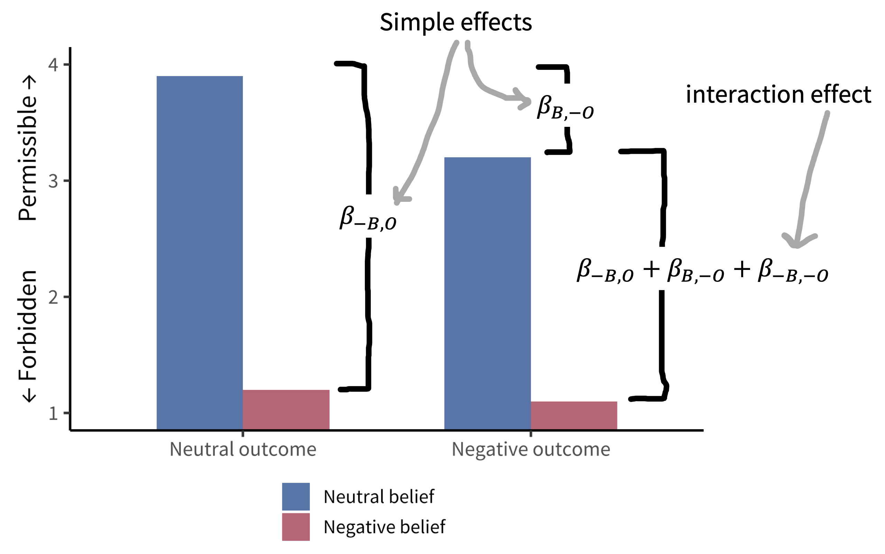
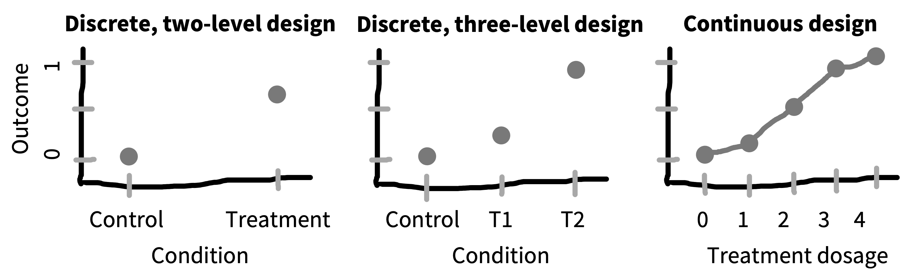

# Design of experiments {#design}

```{r design-meme}
knitr::include_graphics("images/design/meme.jpg")
```


::: {.learning-goals}
🍎 Learning goals: 

* Describe key elements to designing a manipulation
* Define randomization and counterbalancing strategies for removing confounds
* Discuss strategies to design experiments that are appropriate to the populations of interest
:::

The key thesis of our book is that experiments should be designed to yield precise and unbiased measurements of a causal effect. But the causal effect of what? The manipulation, in a word. In an experiment we intervene on the world and measure the effects of that manipulation. We then compare that measurement to a case where the intervention has not occurred. The previous chapter covered the topic of measurement; here we discuss manipulations.  

We refer to different intervention states as **conditions** of the experiment. These conditions instantiate specific **factors** of interest. The most common experimental design is the comparison between a **control** condition, in which the intervention is not performed, and an **experimental** (or sometimes, **treatment**) condition in which the intervention is performed. But many other experimental designs are possible. The goal of this chapter is to introduce some of these and give you some tools for considering their tradeoffs.  In the first part of the chapter, we'll introduce some common experimental designs and the vocabulary for describing them. 

To be useful, a measure must be a valid measure of a construct of interest. The same is true for a manipulation -- it must validly relate to the causal effect of interest. In the next part of the chapter, we'll discuss issues of **manipulation validity**, including both issues of ecological validity and **confounding**. We'll talk about how practices like **randomization** and **counterbalancing** can help remove nuisance confounds.^[This section will draw on our introduction of causal inference in Chapter \@ref(intro), so if you haven't read that, now's the time.] 

We'll end the chapter by discussing some aspects of strategy in experimental design. How do you design an experiment to test a theory? What sorts of experimental designs are maximally efficient? To preview our general approach: we think that your default experiment should have one or a maximum of two factors and should manipulate those factors continuously and within-subjects. This strategy is most likely to yield precise estimates of a particular effect that can be used to constrain future theorizing.

## Experimental designs

Experimental designs are so fundamental to so many fields that they are discussed in many different ways. As a result, the terminology can get quite confusing. Here we'll try to stay consistent by describing an experiment as a relationship between some **manipulation** in which participants are randomly assigned to an experimental condition to evaluate its effects on some **measure**.^[The alternative terminology used in psychology is that of an **independent variable** (the manipulation, which is causally prior and hence "independent" of other causal influences) and a **dependent variable** (the measure, which causally depends on the manipulation, or so we hypothesize). This terminology seems transparently terrible.] An alternative is the terms that are often used in econometrics: the **treatment** (manipulation) and the **outcome** (measure).^[This terminology has some fairly medical connotations -- it sounds like the treatment is something substantial and lasting, and the outcome is meaningful. That's not always the case in experiments that investigate psychological mechanisms. For example, in a cognitive psychology context, it sounds a bit weird to us to say that the "treatment" was reading scrambled words and the "outcome" was lexical decision reaction times.] We'll sometimes use "treatment" language here as well. 

In this section, we'll discuss a number of dimensions on which experiments vary. First, they vary in how many factors they incorporate and how these factors are crossed -- we begin with the two-factor experiment and then discuss generalizations. Second, they vary in how many conditions and how many measures are given to each participant. Third, their manipulations can be discrete or continuous. 

### A two-factor experiment

The classical "design of experiments" framework has as its goal to separate observed variability in the dependent measure into 1) variability due to the manipulation(s) and (2) other variability, including measurement error and participant-level variation. This framework maps nicely onto the statistical framework described in Chapters \@ref(estimation) -- \@ref(models). We are modeling the distribution of our measure using information about the condition structure of our experiment as our predictors. 

Different experimental designs will allow us to estimate condition effects more and less effectively. Recall in Chapter \@ref(estimation), we estimated the effect of our manipulation by a simple subtraction: $\Delta = \theta_{treatment} - \theta_{control}$ (where $\Delta$ is the effect estimate, and $\theta$s indicate the estimates for each condition). This logic works just fine also if there are two distinct treatments in  a three condition experiment: each treatment can be compared to control separately.  For treatment 1, $\Delta_{T_1} = \theta_{T_2} - \theta_{control}$ and $\Delta_{T_1} = \theta_{T_2} - \theta_{control}$.

That logic is going to get more complicated if we have more than one distinct factor of interest, though. Let's look at a simple example. @young2007 were interested in how moral judgments depend on both the beliefs of actors and the outcomes of their actions. They presented participants with vignettes in which they learned, for example, that Grace visits a chemical factory with her friend and goes to the coffee break room where she sees a white powder that she puts in her friend's coffee. They then manipulated both Grace's beliefs and the outcomes of her actions following the schema in Figure \@ref(fig:design-young-design). Participants (N=10) used a four-point Likert scale to rate whether the actions were morally forbidden (1) or permissible (4). 

```{r design-young-design, fig.cap="The 2x2 crossed design used in Young et al. (2007).", fig.margin = TRUE}
knitr::include_graphics("images/design/young2007-design.png")
```
Young et al.'s design has two factors -- belief and outcome -- each with two levels (negative and neutral).^[Note that neither of these is necessarily a "control" condition: the goal is simply to compare these two levels of the factor -- negative and neutral -- to estimate the effect due to the factor.] These factors are **fully crossed**: each level of each factor is combined with each level of each other. That means that we can estimate a number of effects of interest. The experimental data are shown in Figure \@ref(fig:design-young-data). 


```{r design-young-data, fig.cap="Moral permissability as a function of belief and outcome. Results from Young et al. (2007).", fig.margin = TRUE}

```

This fully-crossed design makes it easy for us to estimate quantities of interest. Let's say that our **reference** group (equivalent to the control group for now) is neutral belief, neutral outcome, which we'll notate $B,O$. Now it's easy to use the same kind of subtraction we did before to estimate a variety of effects. For example, we can look at the effect of negative belief in the case of a neutral outcome: $\Delta_{-B,O} = \theta_{-B,O} - \theta_{B,O}$. The effect of a negative outcome is computed similarly as $\Delta_{B,-O} = \theta_{B,-O} - \theta_{B,O}$. 

But now there is a complexity: these two **simple effects** (effects of one variable at a particular level of another variable) make a prediction. They predict that the combined effect $\Delta_{-B,-O}$ should be equal to the sum of $\Delta_{-B,O}$ and $\Delta_{B,-O}$.^[If you're interested, you can also compute the **average** or **main** effect of a particular factor via the same subtractive logic. For example, the average effect of negative belief ($-B$) vs. a neutral belief ($B$) can be computed as $\Delta_{-B} = \frac{(\theta_{-O, -B} + \theta_{O, -B}) - (\theta_{-O, B} + \theta_{O, B})}{2}$.] As we can see from the graph, that's not right: if it were, the negative belief, negative outcome condition would be below the minimum possible rating. Instead, we observe an **interaction** effect (sometimes called a **two-way interaction** when there are two factors): The effect when both factors are present is different than the sum of the two simple effects.^[If you're reading carefully, you might be thinking that this all sounds like we're talking about the analysis of variance (ANOVA), not about experimental design per se. But these two topics are actually the same topic under the hood: the question is how to design an experiment so that these statistical models can be used to estimate particular effects -- and combinations of effects -- that we care about.] Critically, without a fully-crossed design, we can't estimate this interaction and we would have made an incorrect prediction. 

### Generalized factorial designs

We can refer to Young et al.'s design, in which there are two factors with two levels each as a **2x2 design** (pronounced "two by two"). 2x2 designs are incredibly common and useful, but they are only one of an infinite variety of such designs that can be constructed. 

Say we added a third factor to Young et al.'s design such that Grace either feels neutral towards her friend or is angry on that day. If we fully crossed this third affective factor with the other two (belief and outcome), we'd have a 2x2x2 design. This design would have eight conditions: $(A, B, O)$, $(A, B, -O)$, $(A, -B, O)$, $(-A, B, O)$, $(A, -B, -O)$, $(-A, B, -O)$, $(-A, -B, O)$, $(-A, -B, -O)$. These conditions would in turn allow us to estimate both two-way and three-way interactions, enumerated in Table \@ref(tab:design-three-way).

```{r design-three-way}
tribble(~Effect, ~`Term Type`,
        "Affect", "Main effect",
        "Belief", "Main effect",
        "Outcome", "Main effect",
        "Affect X Belief", "2-way interaction",
        "Affect X Outcome", "2-way interaction",
        "Belief X Outcome", "2-way interaction",
        "Affect X Belief X Outcome", "3-way interaction") |>
  knitr::kable(caption = "Possible effects in a hypothetical 2x2x2 experimental design with affect, belief, and outcome as factors.", booktabs = TRUE)
```
Three-way interactions are hard to think about! The affect X belief X outcome interaction tells you about the difference in moral permissibility that's due to all three factors being present as opposed to what you'd predict on the basis of your estimates of the two-way interactions. In addition to being hard to think about, higher order interactions tend to be hard to estimate, because estimating them accurately requires you to have a stable estimate of all of the lower-order interactions [@mcclelland1993]. For this reason, we recommend against experimental designs that rely on higher-order interactions unless you are in a situation where you both have strong predictions about these interactions and are confident in your ability to estimate them appropriately.^[We'll talk about how to understand sample size requirements of this type next in Chapter \@ref(sampling).]

Three-way interactions are just the beginning, though. If you have three factors with two levels each, you can estimate 7 total effects of interest, as in Table \@ref(tab:design-three-way). If you have four factors with two levels each, you get 15. Four factors with three levels each gets you a horrifying 80 different effects!^[The general formula for $N$ factors with $M$ levels each is $M^N-1$.] This way lies madness, at least from the perspective of estimating and interpreting individual effects in a reasonable sample. 

So what should you do if you really do care about four or more factors -- in the sense that you want to estimate their effects and include them in your theory? The simplest strategy is to start your research off by measuring them independently by running a series of single-factor experiments. These experiments can yield a basis for judging which factors are most important for your outcome and hence which should be prioritized for experiments to estimate interactions.^[Another strategy is to use fancier methods. For example, the literature on optimal experiment design contains methods for choosing the most informative sequence of experiments to run in order to estimate the parameters in a model [e.g., @myung2009]. Going down this road typically means having an implemented computational theory of your domain, but it can be a very productive strategy for exploring a complex experimental space with many factors.]

### Between- vs. within-participant designs

Once you have a sense of the factor or factors you would like to manipulate in your experiment, the next step is to consider how these will be presented to participants, and how that presentation will interact with your measurements. The biggest decision to be made is whether each participant will experience only one level of a factor -- a **between-participants** design -- or whether they will experience multiple levels -- a **within-participants** design. Figure \@ref(fig:design-between) shows a very simple example of between-participants design with four participants (two assigned to each condition), while Figure \@ref(fig:design-within) shows a within-participants version of the same design.^[The within-participants design is counterbalanced for the order of the conditions; we cover the issue of counterbalancing below.]

```{r design-between, fig.cap="A between-participants design."}
g <- DiagrammeR::grViz("digraph {
  graph [layout = dot, rankdir = LR]
  
  node [shape = rectangle, style = filled, fillcolor = white]        
  a [label = 'Participant 1']
  b [label = 'Participant 2']
  c [label = 'Participant 3']
  d [label = 'Participant 4']
  
  node [fillcolor = pink]
  c1a [label = 'Experimental Manipulation']
  c1b [label = 'Experimental Manipulation']
  
  node [fillcolor = lightblue]
  c2a [label = 'Control Manipulation']
  c2b [label = 'Control Manipulation']
  
  node [fillcolor = white]
  m1 [label =  'Measure']
  m2 [label =  'Measure']
  m3 [label =  'Measure']
  m4 [label =  'Measure']
  
  # edge definitions with the node IDs
  a -> c1a -> m1
  b -> c1b -> m2
  c -> c2b -> m4
  d -> c2a -> m3
  }")

g$width <- "50%"
g$height <- "100%"
g
```


```{r, fig.cap="A within-participants design, counterbalanced for order."}
g <- DiagrammeR::grViz("digraph {
  graph [layout = dot, rankdir = LR]
  
  node [shape = rectangle, style = filled, fillcolor = white]        
  a [label = 'Participant 1']
  b [label = 'Participant 2']
  c [label = 'Participant 3']
  d [label = 'Participant 4']
  
  node [fillcolor = pink]
  c1a [label = 'Experimental Manipulation']
  c2a [label = 'Experimental Manipulation']
  c3a [label = 'Experimental Manipulation']
  c4a [label = 'Experimental Manipulation']
  
  node [fillcolor = lightblue]
  c1b [label = 'Experimental Manipulation']
  c2b [label = 'Experimental Manipulation']
  c3b [label = 'Experimental Manipulation']
  c4b [label = 'Experimental Manipulation']
  
  node [fillcolor = white]
  m1a [label =  'Measure']
  m2a [label =  'Measure']
  m3a [label =  'Measure']
  m4a [label =  'Measure']
  m1b [label =  'Measure']
  m2b [label =  'Measure']
  m3b [label =  'Measure']
  m4b [label =  'Measure']
  
  # edge definitions with the node IDs
  a -> c1a -> m1a -> c1b -> m1b
  b -> c2a -> m2a -> c2b -> m2b
  c -> c3b -> m3a -> c3a -> m3b
  d -> c4b -> m4a -> c4a -> m4b
  }")

g$width <- "50%"
g$height <- "100%"
g
```


The decision whether to measure a particular factor between- or within-participants is consequential because people vary. Imagine we're estimating our treatment effect as before, simply by computing $\widehat{\Delta} = \widehat{\theta}_{T} - \widehat{\theta}_{C}$ with each of these estimates from different populations of participants. In this scenario, our estimate $\widehat{\Delta}$ contains three components: 1) the true differences between $\theta_{T}$ and $\theta_{C}$, 2) sampling-related variation in which participants from the population ended up in the samples for the two conditions, and 3) measurement error. Component #2 is present because any two samples of participants from a population will differ in their average on a measure -- this is precisely the kind of sampling variation we saw in the null distributions in Chapter \@ref(inference). 

When our experimental design is within-participants, component #2 is not present, because participants in both conditions are sampled from the *same* population. If we get unlucky and all of our participants are lower than the population mean on our measure, that unluckiness affects our conditions equally. We discuss the specific consequences for sample size calculations in the next chapter but the consequences are fairly extreme. Between-participants designs typically require between two and eight times as many participants as within-participants designs! 

Given these advantages, why would you consider using a between-participants design? A within-participants design is simply not possible for all experiments. For example, consider a medical intervention like an experimental surgical procedure. Patients likely cannot receive both two procedures, and so no within-participant comparison of procedures is possible. 

Most treatment conditions in the behavioral sciences are not so extreme, but it may be impractical or inadvisable to deliver multiple conditions. @greenwald1976 distinguishes three types of undesirable effects: **practice**, **sensitization**, and **carry-over** effects^[We tend to think of all of these as being forms of carry-over effect, and sometimes use this as a catch-all description. Some people also use the picturesque description ["poisoning the well"](https://statmodeling.stat.columbia.edu/2017/11/25/poisoning-well-within-person-design-whats-risk/) -- earlier conditions "ruin" the data for later conditions.]: 

* Practice effects occur when administering the measure or the treatment will lead to improvement. Imagine a curriculum intervention for teaching a math concept via a novel presentation  -- it would be hard to convince participating schools to teach the same topic to students twice, and the effect of the second round of teaching would likely be quite different than the first! 
* Sensitization effects occur when seeing two versions of an intervention mean that you might respond differently to the second than the first because you have compared them and noticed the contrast. Greenwald's example is of a study on room lighting -- if the experimenters are constantly changing the lighting, participants may become aware that this is the point of the study. 
* Carry-over effects refer to the case where one treatment might have a longer-lasting effect than the measurement period. For example, imagine a study in which one treatment was to make participants frustrated with an impossible puzzle; if a second condition were given after this first one, participants might still be frustrated, leading to spill-over. 

All of these issues can lead to real concerns with respect to within-subject designs. On the other hand, following [Gelman's](https://statmodeling.stat.columbia.edu/2017/11/25/poisoning-well-within-person-design-whats-risk/) guidance, we worry that the desire for effect estimates that are completely unbiased by these concerns may lead to the overuse of between-participant designs. As we mentioned above, these designs come at a major cost in terms of power and precision. An alternative approach is simply to acknowledge the possibility of carry-over type effects and plan to analyze these within your statistical model (for example by estimating the interaction of condition and order).

We summarize the state of affairs from our perspective in Figure \@ref(design-between-within). From our perspective, within-participant designs should be preferred whenever possible.

```{r design-between-within, fig.cap="Pros and cons of between- vs. within-participant designs. We recommend within-participant designs when possible.", fig.margin=TRUE}
knitr::include_graphics("images/design/between-within.png")
```

### Repeated measurements and experimental items

We just discussed decision-making about whether to administer multiple *manipulations* to a single participant. The exactly analogous decision comes up for *measures*! And our take-home will be similar: unless there are specific difficulties that come up, it's usually a very good idea to take multiple measurements from each participant, in what is called -- sensibly -- a **repeated measures** design.^[We're of course talking about taking mutliple measurements of the same construct! This is different from taking multiple measures of different constructs. As we discussed in Chapter \@ref(measurement), we tend to be against measuring lots of different things in a single experiment -- in part because of the concerns that we're articulating in this chapter: if you have time, it's better to make more precise measures of the one construct you care about most. Measuring one thing well is hard enough. Much better to do that than to measure many constructs badly.]

In the last subsection, we described how variability in our estimates in a between-participants design depend on three components: 1) true condition differences, 2) sampling variation between conditions, and 3) measurement error. (The within-participants design is good because it doesn't have #2). Repeated measures designs help with measurement error. The more times you measure, the lower your measurement error. This is the the same thing as reliability, which we covered in Chapter \@ref(measurement). If you have a perfectly reliable measure, there is no measurement error. Repeated measurements increase reliability. 

The simplest way you can do a repeated measures design is by administering your treatment and then administering your measure -- multiple times. This scenario is pictured in a between-participants design in Figure \@ref(fig:design-rm-between). Somtimes this works quite well. For example, imagine a transcranial magnetic stimulation (TMS) experiment: participants receive neural stimulation for a period of time, targeted at a particular region. Then they perform some measurement task repeatedly until it wears off. The more times they perform it, the better the estimate of whatever effet (when compared to a control of TMS to another region, say).

```{r design-rm-between, fig.cap="A between-participants, repeated-measures design."}
g <- DiagrammeR::grViz("digraph {
  graph [layout = dot, rankdir = LR]
  
  node [shape = rectangle, style = filled, fillcolor = white]        
  a [label = 'Participant 1']
  b [label = 'Participant 2']
  c [label = 'Participant 3']
  d [label = 'Participant 4']
  
  node [fillcolor = pink]
  c1a [label = 'Experimental Manipulation']
  c1b [label = 'Experimental Manipulation']
  
  node [fillcolor = lightblue]
  c2a [label = 'Control Manipulation']
  c2b [label = 'Control Manipulation']
  
  node [fillcolor = white]
  m1a [label =  'Measure']
  m2a [label =  'Measure']
  m3a [label =  'Measure']
  m4a [label =  'Measure']
  m1b [label =  'Measure']
  m2b [label =  'Measure']
  m3b [label =  'Measure']
  m4b [label =  'Measure']
  m1c [label =  'Measure']
  m2c [label =  'Measure']
  m3c [label =  'Measure']
  m4c [label =  'Measure']
  
  # edge definitions with the node IDs
  a -> c1a -> m1b -> m1a -> m1c
  b -> c1b -> m2b -> m2a -> m2c
  c -> c2b -> m3b -> m3a -> m3c
  d -> c2a -> m4b -> m4a -> m4c
  }")

g$width <- "50%"
g$height <- "100%"
g
```

The catch is exactly analogous to the between-participants design: some measures can't be repeated without altering the response. To take an obvious example, we can't give the same math problem twice! The general solution to this problem that is typically used is the **experimental item**. In the case of a math assessment, you create multiple problems that you believe test the same concept but have different numbers or other superficial characteristics. This practice is widespread, and we will have a lot to say about it in the next chapter, because the use of multiple experimental items can license generalizations across a population of items in the same way that the use of multiple participants can ideally license generalizations across a population of people [@clark1973]. 

One variation on the repeated measures, between-participants design is a specific version where the measure is administered both before (pre-) and after (post-) intervention, as in Figure \@ref(fig:design-pre-post). This design is sometimes known as a **pre-post** design. It is extremely common in cases where the intervention is larger-scale and harder to give within-participants, such as in a field experiment where a policy or curriculum is given to one sample and not to another. The pre measurements can be used to subtract participant-level variability out and recover a more precise estimate of the treatment effect. Recall that our treatment effect in a pure between participants design is $\widehat{\Delta} = \widehat{\theta}_{T} - \widehat{\theta}_{C}$. In a pre-post design, we can do better by computing $\widehat{\Delta} = (\widehat{\theta_{T_{post}}} - \widehat{\theta_{T_{pre}}}) - (\widehat{\theta_{C_{post}}} - \widehat{\theta_{C_{pre}}})$. We could rephrase this as "how much more did the treatment group go up than the control group?^[This estimate is sometimes called a "difference in differences" and is very widely used in the field of econometrics, both in experimental and quasi-experimental cases [@cunningham21].]

```{r design-pre-post, fig.cap="A between-participants, pre-post design."}
g <- DiagrammeR::grViz("digraph {
  graph [layout = dot, rankdir = LR]
  
  node [shape = rectangle, style = filled, fillcolor = white]        
  a [label = 'Participant 1']
  b [label = 'Participant 2']
  c [label = 'Participant 3']
  d [label = 'Participant 4']
  
  node [fillcolor = pink]
  c1a [label = 'Experimental Manipulation']
  c1b [label = 'Experimental Manipulation']
  
  node [fillcolor = lightblue]
  c2a [label = 'Control Manipulation']
  c2b [label = 'Control Manipulation']
  
  node [fillcolor = white]
  m1a [label =  'Measure']
  m2a [label =  'Measure']
  m3a [label =  'Measure']
  m4a [label =  'Measure']
  m1b [label =  'Measure']
  m2b [label =  'Measure']
  m3b [label =  'Measure']
  m4b [label =  'Measure']
  
  # edge definitions with the node IDs
  a -> m1a -> c1a -> m1b
  b -> m2a -> c1b -> m2b
  c -> m3a -> c2b -> m3b
  d -> m4a -> c2a -> m4b
  }")

g$width <- "50%"
g$height <- "100%"
g
```

Of course, repeated measurements are not limited to between-participants designs! The bread and butter of perception, psychophysics, and cognitive psychology is the type of within-participants repeated measure design shown in Figure \@ref(fig:design-rm-within). When both manipulations and measures can be repeated, these designs afford high measurement precision even with small sample sizes; they are recommended whenever they are possible. 


```{r design-rm-within, fig.cap="A within-participants repeated-measures design with multiple trials."}
g <- DiagrammeR::grViz("digraph {
  graph [layout = dot, rankdir = LR]
  
  node [shape = rectangle, style = filled, fillcolor = white]        
  a [label = 'Participant 1']
  b [label = 'Participant 2']
  c [label = 'Participant 3']
  d [label = 'Participant 4']
  
  node [fillcolor = pink]
  c1a [label = 'Experimental Manipulation']
  c1b [label = 'Experimental Manipulation']
  c3a [label = 'Experimental Manipulation']
  c3b [label = 'Experimental Manipulation']
  
  node [fillcolor = lightblue]
  c2a [label = 'Control Manipulation']
  c2b [label = 'Control Manipulation']
  c4a [label = 'Control Manipulation']
  c4b [label = 'Control Manipulation']
  
  node [fillcolor = white]
  m1a [label =  'Measure']
  m2a [label =  'Measure']
  m3a [label =  'Measure']
  m4a [label =  'Measure']
  m1b [label =  'Measure']
  m2b [label =  'Measure']
  m3b [label =  'Measure']
  m4b [label =  'Measure']
  
  # edge definitions with the node IDs
  a -> c1a -> m1a -> c4a -> m1b
  b -> c1b -> m2a -> c4b -> m2b
  c -> c2b -> m3a -> c3b -> m3b
  d -> c2a -> m4a -> c3a -> m4b
  }")

g$width <- "50%"
g$height <- "100%"
g
```


### Discrete and continuous experimental manipulations 

Most experimental designs in most subfields of psychology use discrete condition manipulations: treatment vs. control. In our view, this decision is often a lost opportunity. In our framework, the goal of an experiment is to estimate a causal effect; ideally, this estimate can be generalized to other contexts and used as a basis for theory. Measuring not just one effect but instead a **dose-response** relationship -- how the measure changes as the strength of the manipulation is changed -- has a number of benefits in helping to achieve this goal. 

Many manipulations can be **titrated** -- that is, their strength can be varied continuously -- with a little creativity on the part of an experimenter. A curriculum intervention can be applied at different levels of intensity, perhaps by changing the number of sessions in which it is taught. For a priming manipulation, the frequency or duration of prime stimuli can be varied. Two stimuli can be morphed continuously so that categorization boundaries can be examined.^[These methods are extremely common in perception and psychophysics research, in part because the dimensions being studied are often continuous in nature. For exmaple, imagine trying to estimate a subject's visual contrast sensitivity *without* continuously manipulating the contrast of the stimulus, eliciting judgments at many different levels.] 

```{r design-dose-schema, fig.cap="Three schematic designs. (A) Control and treatment are two levels of a nominal variable. (B) Control is compared to ordered levels of a treatment. (C) Treatment level is an interval or ratio variable such that points can be connected and a parametric curve can be extrapolated."}

```

Dose-response designs are useful because they provide insight into the shape of the function mapping your manipulation to your measure. Knowing this shape can inform your theoretical understanding! Consider the examples given in Figure \@ref(design-dose-schema). If you only have two conditions in your experiment, then the most you can say about the relationship between your manipulation and your measure is that it produces an effect of a particular magnitude; in essence, you are assuming that condition is a nominal variable. If you have multiple ordered levels of treatment, you can start to speculate about the nature of the relationship between treatment and effect magnitude. But if you can measure the strength of your treatment, then you can start to describe the nature of the relationship between the strength of treatment and strength of effect via a parametric function (e.g., a linear regression, a sigmoid, or other function).^[These assumptions are theory-laden, of course -- the choice of a linear function or a sigmoid is not necessary: nothing guarantees that simple, smooth, or monotonic functions are the right ones. The important point from our perspective is that choosing a function makes explicit your assumptions about the nature of the treatment-effect relationship.] These parametric functions can in turn allow you to generalize from your experiment, making predictions about what would happen under intervention conditions that you didn't measure directly!

This all can feel a bit abstract, so let's consider an example. @brennan1966 were interested in the relationship between visual complexity and infants' looking preferences. Do infants uniformly prefer complex stimuli, or do they search for stimuli at an appropriate level of complexity for their processing abilities. To test this hypothesis, they exposed infants in three different age groups (3, 8, and 14 weeks, N=30) to black and white checkerboard stimuli with three different levels of complexity (2x2, 8x8, and 24x24). Their findings are plotted in Figure \@ref(design-dose-ex): the youngest infants preferred the simplest stimuli, while infants at an intermediate age preferred stimuli of intermediate complexity, and the oldest infants preferred the most complex stimuli. These findings help to motivate the theory that infants attend preferentially to stimuli that provide appropriate learning input for their processing ability [@kidd2012].^[@brennan1966's experiment uses a quantitative manipulation of complexity (checkerboard density). But they treat this manipulation as an ordinal -- rather than an interval -- variable, presumably because they do not know precisely how checkerboard density translates into changes in the psychological construct they care about, namely complexity. Does doubling the number of squares on the board double complexity, or do you have to double the number of squares on each side? Does complexity saturate, such that a 128x128 checkerboard is not much more complex? These are just a few of the questions that the dose-response approach raises.]

```{r design-dose-ex, fig.cap = "Infants' looking time, plotted by stimulus complexity and infant age. Data from Brennan et al., 1966.", fig.margin=TRUE}
brennan <- tribble(~age, ~complexity, ~looking_time, 
                   3, "2x2", 80.9,
                   3, "8x8", 52.3,
                   3, "24x24", 23.5,
                   8, "2x2", 54.2, 
                   8, "8x8", 112.0,
                   8, "24x24", 74.9,
                   14, "2x2", 43.3,
                   14, "8x8", 69.7,
                   14, "24x24", 91.0) |>
  mutate(complexity = fct_relevel(complexity, "2x2", "8x8"))

ggplot(brennan, aes(x = age, y = looking_time, col = complexity)) + 
  geom_point() + 
  geom_line(aes(group = complexity)) +
  xlim(0,15) + 
  xlab("Age (weeks)") + 
  ylab("Total fixation time (sec)") +
  scale_color_discrete(name = "Stimulus complexity")

# from fig 1 via web-digitizer
# 0.9157088122605361, 80.92485549132948 
# 1.9731800766283523, 52.3121387283237
# 2.9846743295019156, 23.526011560693647
# 4.049808429118774, 14.855491329479776
# 0.946360153256705, 54.21965317919076
# 1.9042145593869733, 111.96531791907515
# 2.9540229885057467, 74.85549132947978
# 4.03448275862069, 10.346820809248555
# 0.9540229885057467, 43.294797687861276
# 1.9425287356321839, 69.65317919075144
# 2.93103448275862, 90.98265895953757


```

If your goal is simply to detect whether an effect is zero or non-zero, then dose-response designs do not achieve the maximum statistical power. For example, if @brennan1966 simply wanted to achieve maximal statistical power, they probably should have only tested two age groups and two levels of complexity (say, 3 and 14 week infants and 2x2 and 24x24 checkerboards). That would have been enough to show an interaction of complexity and age, and their greater resources devoted to these four (as opposed to nine) conditions would mean more precise estimates of each (simulated in Figure \@ref(fig:design-dose-ex-2)). But their findings would be less clearly supportive of the view that infants prefer stimuli that are appropriate to their processing ability. By seeking to measure intermediate conditions, they provided a stronger constraint on their theory. 

```{r design-dose-ex-2, fig.cap = "Imagining the data from Brennan et al. 1966 if they had omitted intermediate conditions in search of the most extreme effect.", fig.margin=TRUE}
brennan_minimal <- tribble(~age, ~complexity, ~looking_time, 
                   3, "2x2", 80.9,
                   3, "24x24", 23.5,
                   14, "2x2", 43.3,
                   14, "24x24", 91.0) |>
  mutate(complexity = fct_relevel(complexity, "2x2", "8x8"))

ggplot(brennan_minimal, aes(x = age, y = looking_time, col = complexity)) + 
  geom_point() + 
  geom_line(aes(group = complexity)) +
  xlim(0,15) + 
  xlab("Age (weeks)") + 
  ylab("Total fixation time (sec)") +
  scale_color_discrete(name = "Stimulus complexity")
```

<!-- Continuous and discrete variables -->

<!-- Dose response relationships  -->


<!-- ::: {.case-study} -->
<!-- 🔬 Case study: Still suspicious? -->

<!-- The “suspicious coincidence” effect (Xu and Tenenbaum 2007) with non-replication by Spencer et al. (2011) resolved by Lewis & Frank (2018) “still suspicious” paper.  -->
<!-- ::: -->

## Manipulation validity


### Threats to manipulation validity

 - Manipulations must correspond to the construct whose causal effect is being estimated.
 
  - Demand characteristics. How did concerns about demand characteristics emerge? What proposed mechanisms cause demand characteristics to influence participant behavior? What evidence do we have that demand characteristics impact participant behavior? And what strategies can we use to mitigate demand characteristics?

Ecological validity
  
### Confounding


Let's consider an alternate experiment now. Suppose we did the same basic procedure, but now with a "within-subjects" design where participants do both the Dylan treatment and the control, in that order. This experiment is flawed, of course. If you observe a Dylan effect, you can't rule out the idea that participants got tired and wrote worse in the control condition because it always came second.

Order (Dylan first vs. control first; notated X') is an experimental confound: a variable that is created in the course of the experiment that is both causally related to the predictor and potentially also related to the outcome. Here's how the causal model now looks:


We've reconstructed the same kind of confounding relationship we had with age, where we had a variable (X') that was correlated both with our predictor (X) and our outcome (Y)! So...


In the causal language we have been using, counterbalancing allows us to snip out the causal dependency between order and Dylan. Now they are unconfounded (uncorrelated) with one another. We've "solved" a confound in our experimental design. Here's the picture:


These are not covariates! Covariates are related but don't have causal force in this design because of randomization. We can use them in our analysis to make our estimates more precise (see Chapter \@ref(models)), but we won't worry about them here. If someone says to you, "participant gender is a confound in your experiment", if you've done random assignment to condition appropriately (acoss genders), you should say "no it's not."

### Removing nuisance confounds

 What should we do with our experimental confounds? 

Option 1. Randomize. Increasingly, this is my go-to method for dealing with any confound. Is the correct answer on my survey confounded with response side? Randomize what side the response shows up on! Is order confounded with condition? Randomize the order you present in! Randomization is much easier now that we program many of our experiments using software like Qualtrics or code them from scratch in JavaScript.

The only time you really get in trouble with randomization is when you have a large number of options, a small number of participants, or some combination of the two. In this case, you can end up with unbalanced levels of the randomized factors (for example, ten answers on the right side and two on the left). Averaging across many experiments, this lack of balance will come out in the wash. But in a single experiment, it can really mess up your data – especially if your participants notice and start choosing one side more than the other because it's right more often. For that reason, when balance is critical, you want option 2.

Option 2. Counterbalance. If you think a particular confound might have a significant effect on your measure, balancing it across participants and across trials is a very safe choice. That way, you are guaranteed to have no effect of the confound on your average effect. In a simple counterbalance of order for our Dylan experiment, we manipulate condition order between subjects. Some participants hear Dylan first and others hear Dylan second. Although technically we might call order a second "factor" in the experiment, in practice it's really just a nuisance variable, so we don't talk about it as a factor and we often don't analyze it (but see Option 3 below).

Counterbalancing doesn't always work, though. It gets trickier when you have too many levels on a variable (too many Dylan songs!) or multiple confounding variables. For example, if you have lots of different nuisance variables – say, condition order, what writing prompt you use for each order, which Dylan song you play – it may not be possible to do a fully-crossed counterbalance so that all combinations of these factors are seen by equal numbers of participants. In these kinds of cases, you may have to rely on partial counterbalancing schemes or latin squares designs, or you may have to fall back on randomization.

Option 3. Do Options 1 and 2 and then model the variation. This option was never part of my training, but it's an interesting third option that I'm increasingly considering.** That is, we are often faced with the choice between A) a noisy between-participants design and B) a lower-noise within-participants design that nevertheless adds noise back in via some obvious order effect that you have to randomize or counterbalance. In a recent talk by Andrew Gelman, he suggested that we try to model these as covariates, to reduce noise. This seems like a pretty interesting suggestion, especially if the correlation between them and the outcome is substantial.***

## Strategy

### How to design a manipulation to test a theory.

Simplicity as a key design principle

  - E. O. Wilson’s advice: iteration on a repeatable measurement.
  - Statistical and interpretability concerns for complex interaction designs.
  - Nuisance variables: counterbalancing and randomization.

The temptation to manipulate lots of things

Again, we advocate for simplicity.

The advice is out there to


### Connecting with theory


  - The ethics of the “dead on arrival” experiment – why appropriate experimental design is an ethical imperative (we “waste” participant contributions otherwise).
 “risky tests”: those that will best help adjudicate between theories. @meehl1978
  
  Optimal experiment design in psychophysics and beyond – how to use quantitative models to select the stimulus that maximizes your chances of a theory-informing result.


::: {.ethics-box}
🌿 Ethics box: Including the population being sampled in the design process. 
:::

Multi-experiment design strategy: start simple? 