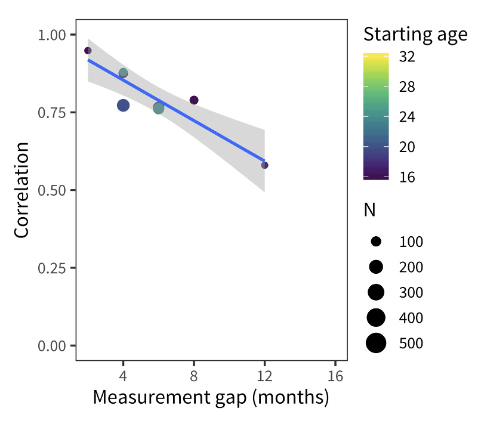
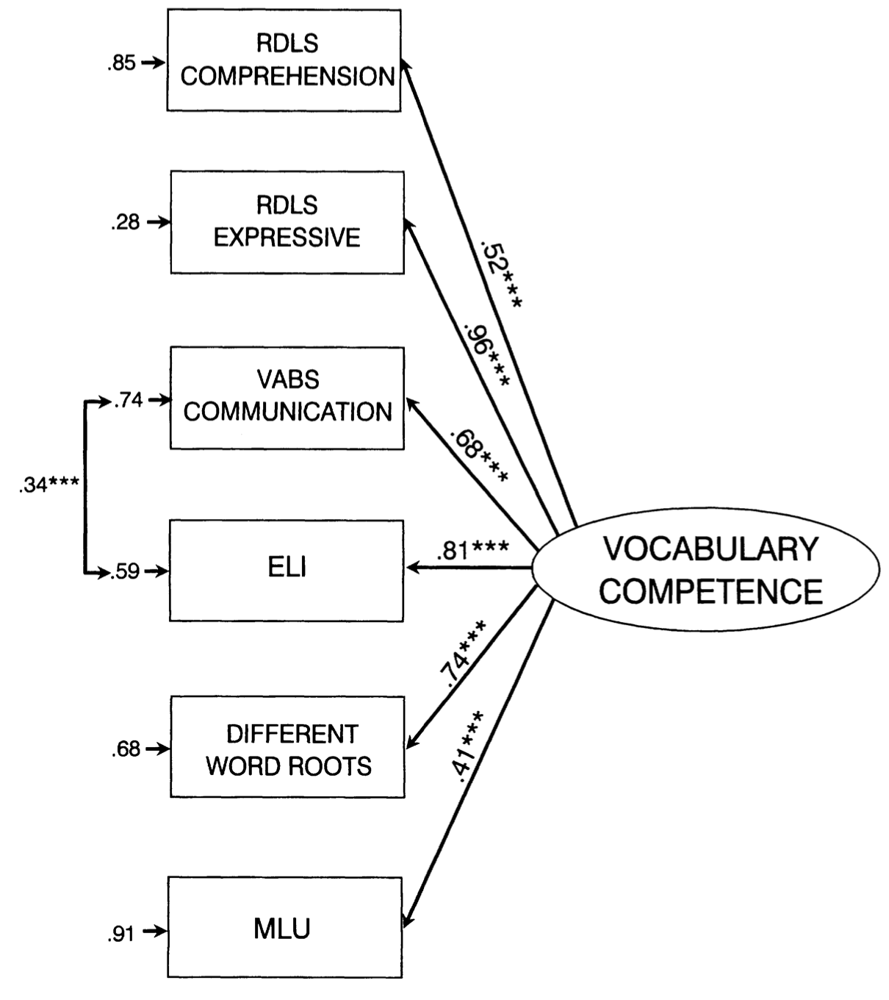
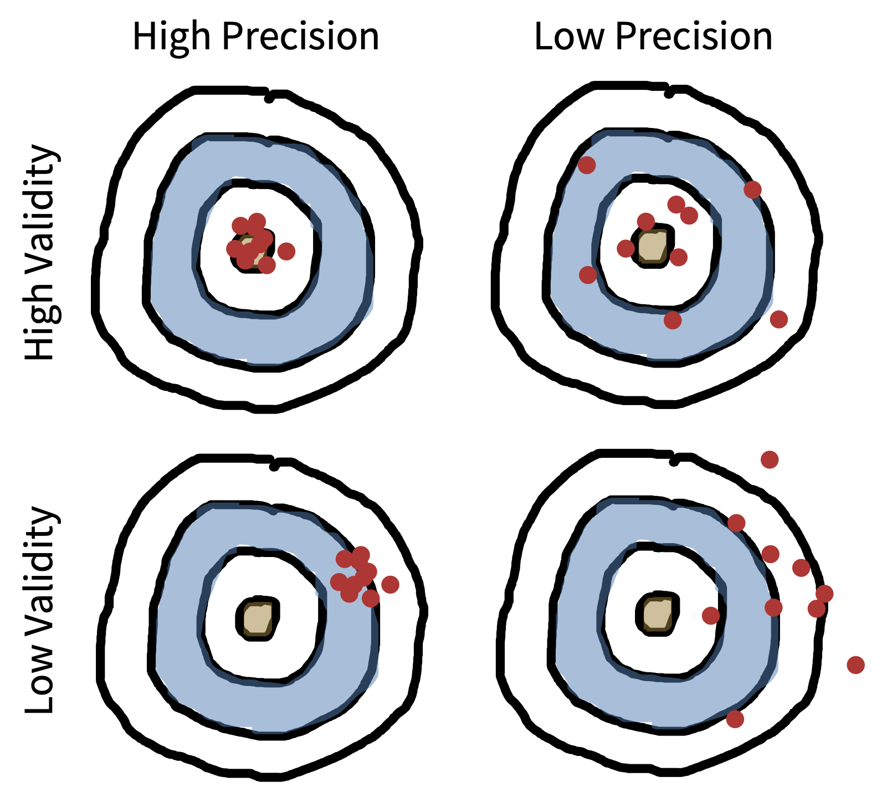
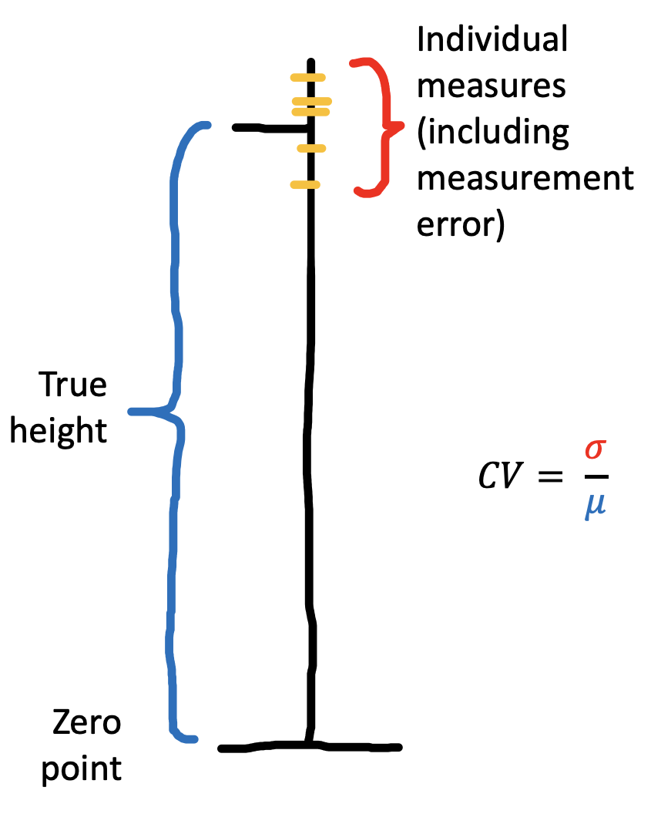
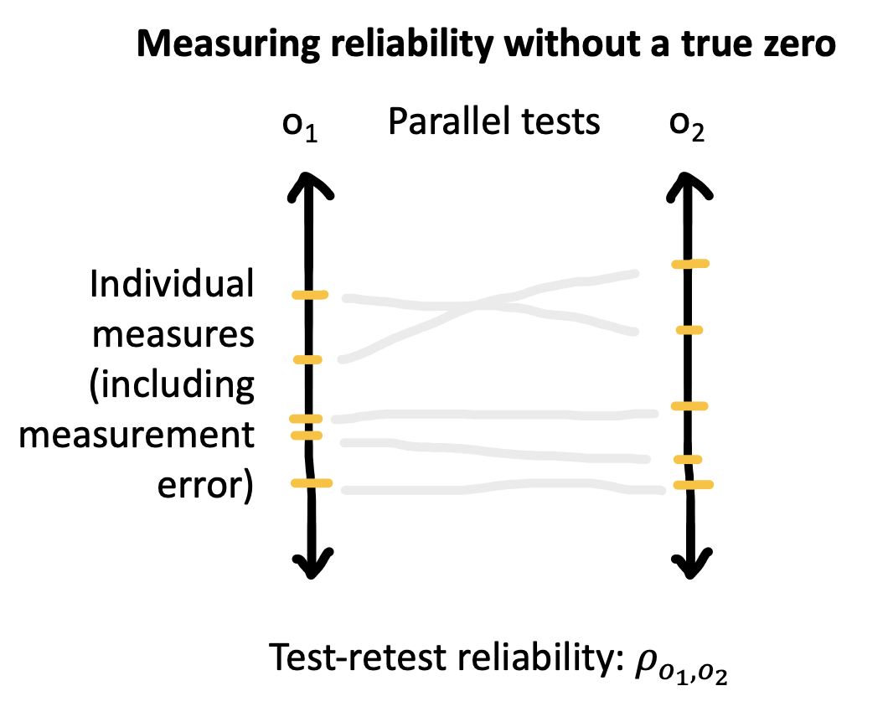
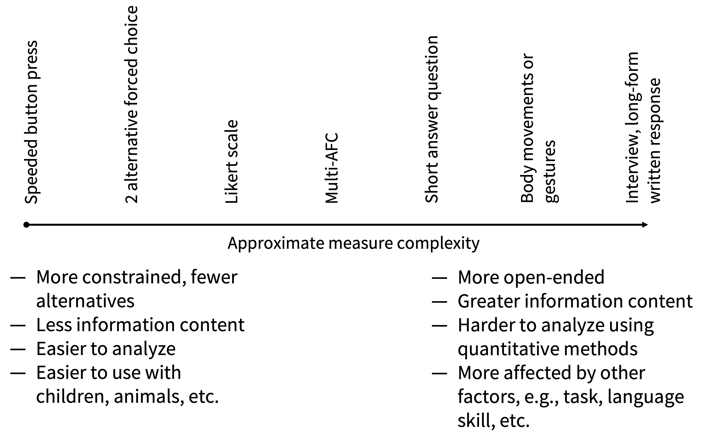
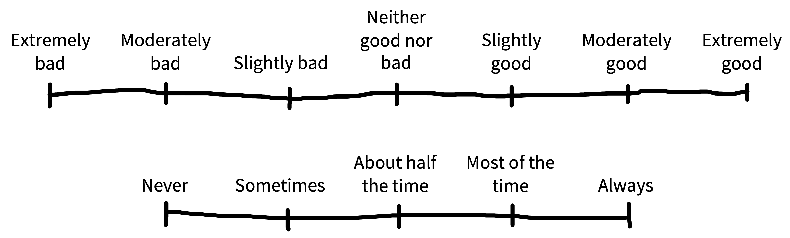

# (PART) Design {-}

# Measurement {#measurement}

::: {.box data-box="learning_goals"}
* Discuss the reliability and validity of psychological measures 
* Reason about tradeoffs between different measures and measure types
* Identify the characteristics of well-constructed survey questions
* Articulate risks of measurement flexibility and the costs and benefits of multiple measures
:::

<!-- > "In every quantitative paper we read, every quantitative talk we attend, and every quantitative article we write, we should all ask one question: *what is the estimand*? The estimand is the object of inquiry -- it is the precise quantity about which we marshal data to draw an inference. Yet, too often social scientists skip the step of defining the estimand. Instead, they leap straight to describing the data they analyze and the statistical procedures they apply. Without a statement of the estimand, it becomes impossible for the reader to know whether those procedures were appropriate." [@lundberg2021]  -->

Throughout the history of science, advances in measurement have gone hand in hand with advances in knowledge.^[As such, measurement is a perennially controversial topic in philosophy of science. For an overview of competing frameworks, see @sep-measurement-science or @maul2016philosophical, which focuses specifically on measurement in psychology.] Telescopes revolutionized astronomy, microscopes revolutionized biology, and patch clamping revolutionized physiology. But measurement isn't easy. Even the humble thermometer, allowing reliable measurement of temperature, required centuries of painstaking effort to perfect [@chang2004inventing]. Psychology and the behavioral sciences are no different -- we need reliable instruments to measure the things we care about. In this next section of the book, we're going to discuss the challenges facing measurement in psychology, and the properties that distinguish good instruments from bad.

What does it mean to measure something? Intuitively, we know that a ruler measures the quantity of length, and a scale measures the quantity of weight [@kisch1965scales]. But what does it mean to measure a psychological construct -- a hypothesized theoretical quantity inside the head? According to @stevens1946, measurement is simply the practice of assigning numbers to things. But, to paraphrase @campbell1938symposium, not every assignment of numbers is measurement!  Roughly speaking, we want the numbers we assign to behave like the constructs we're assigning them to (in the ways that matter). And not all measurement instruments are created equal. 

This point is obvious when you think about physical measurement instruments: a caliper will give you a much more precise estimate of the thickness of a small object than a ruler. One way to see that the measurement is more precise is by repeating it a bunch of times. Compared to the ruler, the measurements from the caliper will likely be more similar to one another, reflecting the fact that the amount of error in each individual measurement is smaller. We can do the same thing with a psychological measurement -- repeat and assess variation -- though as we'll see below it's a little trickier. Measurement instruments that have less error are called more **reliable** instruments.^[Is **reliability** the same as **precision**? Yes, more or less. Confusingly, different fields call these concepts different things [there's a helpful table of these names in @brandmaier2018]. Here we'll talk about reliability as a property of instruments specifically while using the term precision to talk about the measurements themselves.]

When we have a physical quantity of interest, we can assess how well an instrument measures that quantity. But things are much trickier when the construct we are trying to measure can't be assessed directly. We have to measure something observable -- our operationalization of the construct -- and then make an argument about how the measure relates to the construct of interest — which we cannot observe directly. This is an argument for the **validity** of measurements from the instrument.^[We are also going to talk in Chapter \@ref(design) about the validity of manipulations. The way you identify a causal effect on some measure is by operationalizing some construct as well. If this is done badly, the manipulation can be invalid -- meaning the causal effect that's measured doesn't map onto the construct.]  

These two concepts, reliability and validity, provide a conceptual toolkit for assessing how good a psychological measurement instrument is. 

::: {.box data-box="case_study" data-title="A reliable and valid measure of children's vocabulary"}

Anyone who has worked with little children, or had children of their own, can attest to how variable their early language is. Some children speak clearly and produce long sentences from an early age, while others struggle; this variation appears to be linked to later school outcomes [@marchman2008]. Thus, there are many reasons why you'd want to make precise measurements of children's early language ability as a latent construct of interest.^[Of course, you can also ask if early language is a single construct, or whether it is multi-dimensional! For example, does grammar develop separately from vocabulary? It turns out the two are very closely coupled [@frank2021]. This point illustrates the general idea that, especially in psychology, measurement and theory building are intimately related -- you need data to inform your theory, but the measurement instruments you use to collect your data in turn presuppose some theory!]

Because bringing children into a lab can be expensive, one popular option for measuring child language is the MacArthur Bates Communicative Development Inventory (CDI for short), a form which asks parents to mark words that their child says or understands. CDI forms are basically long checklists of words (the first page of an English form is shown in Figure \@ref(fig:measurement-cdi). But are parental reports a reliable or valid measure of children's early language?

```{r measurement-cdi, fig.margin=TRUE, fig.cap="The first page of the MacArthur-Bates Communicative Development Inventory, a parent report instrument for measuring children's early language."}
knitr::include_graphics("images/measurement/cdi.jpg")
```

```{r measurement-psycho-cors, fig.margin=TRUE, fig.cap="Longitudinal correlations between a child's score on one administration of the CDI and another one several months later. From Frank et al. (2021). "}

```

One test of the reliability of the CDI is a **test-retest** correlation, where we compute the correlation within children between two different administrations of the form. Unfortunately, this analysis has one issue: the longer you wait between observations the more the child has changed! Figure \@ref(fig:measurement-psycho-cors) displays longitudinal test-retest correlations for two CDIs, showing how correlations start off high and drop off as the gap between observations increases [@frank2021]. 

```{r measurement-cdi-validity, fig.margin=TRUE, fig.cap="Relations between an early form of the CDI (the ELI) and several other measurements of children's early language from both transcripts and direct assessments. Arrows indicate loadings of different measures (boxes) onto a single construct (circle). Numbers give standardized weights [@bornstein1998]."}

```


Given that CDI forms are relatively reliable instruments, are they valid? That is,  do they really measure the construct of interest, namely children's early language ability? @bornstein1998 collected many different measures of children's language -- including the ELI (an early CDI form) and other "gold standard" measures like transcribed samples of children's speech. Figure \@ref(fig:measurement-cdi-validity) shows the results of a structural equation model that measures the shared variance between these measures and a hypothesized central construct ("vocabulary competence"). The ELI (CDI) score correlated closely with the shared variance among all the different measures, suggesting that it was a valid measure of the construct. 

The combination of reliability and validity evidence suggests that CDI are a useful (and relatively inexpensive source) of data about children's early language, and indeed they have become one of the most common assessments for this age group!

<!-- The story of the CDI is a success story -- it's a relatively inexpensive measure that has some evidence for both reliability and validity. We should celebrate (and also use it as a potential outcome measure in our studies). But there is also plenty more work to do! A critic could very reasonably point out that we haven't shown any evidence that reliability and validity extends across different populations or ages. For any measure, it's important to start by asking whether there is *any* evidence for reliability and validity. But once you have a specific target population in mind, you can also ask how likely it is that the measure will yield reliable and valid data with *that particular population*. Oftentimes you yourself will have to do this measurement work, "checking" that your instruments function appropriately in the particular situation you want to use them. This is sometimes a lot of hard work, but it's an important part of doing good experimental measurement! -->
:::


## Reliability

```{r measurement-brandmaier, fig.margin=TRUE, fig.cap="Reliability and validity visualized. The reliability of an instrument is its expected precision. The bias of measurements from an instrument also provide a metaphor for its validity."}

```

Reliability is a way of describing the extent to which a measure yields signal relative to noise. Intuitively, if there's less noise, then there will be more similarity between different measurements of the same quantity, illustrated in Figure \@ref(fig:measurement-brandmaier) as a tighter grouping of points on the bulls-eye. But how do we measure signal and noise? 

::: {.box data-box="depth" data-title="Early controversies over psychological measurement"}

> "Psychology cannot attain the certainty and exactness of the physical sciences, unless it rests on a foundation of [...] measurement" [@cattel1890mental].

It is no coincidence that the founders of experimental psychology were obsessed with measurement [@heidelberger2004nature].
It was viewed as the primary obstacle facing psychology on its road to becoming a legitimate quantitative science.
For example, one of the final pieces written by Hermann von Helmholtz (Wilhelm Wundt's doctoral advisor), was a 1887 philosophical treatise entitled "Zahlen und Messen" ("Counting and Measuring"; see @darrigol2003number).
In the same year, @fechner1987my explicitly grappled with the foundations of measurement in "Uber die psychischen Massprincipien" ("On Psychic Measurement Principles").

Many of the early debates over measurement revolved around the emerging area of *psychophysics*, the problem of relating objective, physical stimuli (e.g. light or sound or pressure) to the subjective sensations they produce in the mind.
For example, @fechner1860elemente was interested in a quantity called the "just noticeable difference", the smallest change in a stimulus that can be discriminated by our senses. 
He argued for a lawful (logarithmic) relationship: a logarithmic change in the intensity of, say, brightness  corresponded to a linear change in the intensity people reported (up to some constant).
In other words, sensation was *measurable* via instruments like just noticeable difference. 

It may be surprising to modern ears that the basic claim of measurability was controversial, even if the precise form of the psychophysical function would continue to be debated.
But this claim led to a deeply rancorous debate, culminating with the so-called Ferguson Committee, formed by the British Association for the Advancement of Science in 1932 to investigate whether such psychophysical procedures could count as quantitative 'measurements' of anything at all [@moscati2018measuring]. 
It was unable to reach a conclusion, with physicists and psychologists deadlocked:

> Having found that individual sensations have an order, they [some psychologists] assume that they are *measurable*. Having travestied physical measurement in order to justify that assumption, they assume that their sensation intensities will be related to stimuli by numerical laws [...] which, if they mean anything, are certainly false. [@ferguson1940]

The heart of the disagreement was rooted in the classical definition of quantity requiring strictly *additive* structure.
An attribute was only considered measurable in light of a meaningful concatenation operation. 
For example, weight was a measurable attribute because putting a bag of three rocks on a scale yields the same number as putting each of the three rocks on separate scales and then summing up those numbers (in philosophy of science, attributes with this concatenation property are known as "extensive" attributes, as opposed to "intensive" ones.)
Norman Campbell, one of the most prominent members of the Ferguson Committee, had recently defined *fundamental* measurement in this way [e.g. see @campbell1928account], contrasting it with *derived measurement* which was some function of fundamental measures.
According to the physicists on the Ferguson Committee, measuring mental sensations was impossible because they could never be grounded in any *fundamental* scale with this kind of additive operation.
It just didn't make sense to break up holistic sensations into parts the way we would weights or lengths: they didn't come in "amounts" or "quantities" that could be combined [@cattell1962relational]. 
Even the intuitive additive logic of @donders1969's "method of subtraction" for measuring the speed of mental processes was viewed skeptically on the same grounds by the time of the committee (e.g. in an early textbook, @woodworth1938 claimed "we cannot break up the reaction into successive acts and obtain the time for each act.")

The primary target of the Ferguson Committee's investigation was the psychologist S. S. Stevens, who had claimed to measure the sensation of loudness using psychophysical instruments.
Exiled from classical frameworks of measurement, he went about developing an alternative "operational" framework [@stevens1946], where the classical ratio scale recognized by physicists was only one of several ways of assigning numbers to things (see \@ref(tab:measurement-stevens-table) below).
Stevens' framework quickly spread, leading to an explosion of proposed measures. 
However, operationalism remains controversial outside psychology [@michell1999measurement].
The most extreme version of Steven's stance ("measurement is the assignment of numerals to objects or events according to rule") permits researchers to *define* constructs operationally in terms of a measure [@hardcastle1995ss]. 
For example, one may say that the construct of intelligence is simply *whatever it is* that IQ measures. 
It is then left up to the researcher to decide which scale type their proposed measure should belong to.

In Chapter \@ref(theories), we outlined a somewhat different view, closer to a kind of constructive realism [@giere2004models; @putnam1999threefold].
Psychological constructs like working memory or theory of mind are taken to exist independent of any given operationalization, putting us on firmer ground to debate the pros and cons associated with different ways of measuring the same construct.
In other words, we are not free to assign numerals however we like. 
Whether a particular construct or quantity is measurable on a particular scale should be treated as an empirical question. 

The next major breakthrough in measurement theory emerged with the birth of mathematical psychology in the 1960s, which aimed to put psychological measurement on more rigorous foundations.
This effort culminated in the three-volume Foundations of Measurement series [@krantz2006additive; @suppes2007foundations; @luce2007foundations], which has become the canonical text for every psychology student seeking to understand measurement in the non-physical sciences.^[It is worth noting that 20th century physics has also seriously challenged the classical additive understanding of measurement. For example, velocities are revealed to be non-additive under general relativity, and properties of quantum particles are only measurable under a complex probabilistic framework.]
One of the key breakthroughs was to shift the burden from measuring (additive) constructs themselves to measuring (additive) *effects* of constructs in conjunction with one another:

> When no natural concatenation operation exists, one should try to discover a way to measure factors and responses such that the 'effects' of different factors are additive. [@luce1964simultaneous].

This modern viewpoint broadly informs the view we describe here. 
:::

### Measurement scales


```{r measurement-cv, fig.margin=TRUE, fig.cap="Computing the coefficient of variation (CV). Yellow lines represent individual measurements."}

```

In the physical sciences, it's common to measure the precision of an instrument by quantifying its coefficient of variation [@brandmaier2018]: 

$$CV = \frac{\sigma_w}{\mu_w}$$
\noindent where $\sigma_w$ is the standard deviation of the measurements within an individual and $\mu_w$ is the mean of those measurements (Figure \@ref(fig:measurement-cv)). 


Imagine we measure the height of a person five times, resulting in measurements of 171cm, 172cm, 171cm, 173cm, and 172cm. These are the combination of the person's true height (we assume they have one!) and some **measurement error**. Now we can use these measurements to compute the coefficient of variation, which is `r round(sd(c(171,172,171,173,172))/mean(c(171,172,171,173,172)),digits =3)`. Why can't we just do that with psychological measurements? 


```{r measurement-stevens-table}
stevens <- tribble(~Scale, ~Definition, ~Operations, ~Statistics, 
        "Nominal", "Unordered list","Equality","Mode",
        "Ordinal","Ordered list","Greater than or less than", "Median",
        "Interval", "Numerical","Equality of intervals", "Mean, SD",
        "Ratio", "Numerical with zero", "Equality of ratios","Coefficient of variation")

knitr::kable(stevens, caption = "Stevens (1946) table of scale types and their associated operations and statistics.", booktabs = TRUE)
```


Thinking about this question takes us on a detour through the different kinds of measurement scales used in psychological research [@stevens1946]. The height measurements in our example are on what is known as a **ratio** scale: a scale in which numerical measurements are equally spaced and on which there is a true zero point. These scales are common for physical quantities but actually quite infrequent in psychology. More common are **interval** scales, in which there is no true zero point. For example, IQ (and other standardized scores) are intended to capture interval variation on some dimension but 0 is meaningless -- an IQ of 0 does not correspond to any particular interpretation.^[It can actually be shown in a suitably rigorous sense that ratio and interval scales (and another lying in between) are the *only* scales possible for the real numbers [@narens1986measurement].] 

**Ordinal** scales are also commonly used. These are scales that are ordered but are not necessarily spaced equally. For example, levels of educational achievement ("Elementary","High school","Some college","College","Graduate school") are ordered, but there is no sense in which "High school" is as far from "Elementary" as "Graduate school" is from "College." The last type in Stevens' hierarchy is **nominal** scales, in which no ordering is possible either. For example, race is an unordered scale in which multiple categories are present but there is no inherent ordering of these categories. The full hierarchy is presented in Table \@ref(tab:measurement-stevens-table).

Critically, different summary measures work for each scale type. If you have an unordered list like a list of options for a question about race on a survey, you can present the modal response (the most likely one). It doesn't even make sense to think about what the median was -- there's no ordering! For ordered levels of education, a median is possible but you can't compute a mean. And for interval variables like "number of correct answers on a math test" you can compute a mean and a standard deviation.^[You might be tempted to think that "number of correct answers" is a ratio variable -- but is zero really meaningful? Does it truly correspond to "no math knowledge" or is it just a stand-in for "less math knowledge than this test requires"?] 

Now we're ready to answer our initial question about why we can't quantify reliability using the coefficient of variation. Unless you have a ratio scale with a true zero, you can't compute a coefficient of variation. Think about it for IQ scores: currently, by convention, standardized IQ scores are set to have a mean of 100. If we tested someone multiple times and found the standard deviation of their test scores was 4 points, then we could estimate the precision of their measurements as "CV" of 4/100 = .04. But since IQ of 0 isn't meaningful, we could just set the mean IQ for the population to 200. Our test would be the same, and so the CV would be 4/200 = .02. On that logic we just doubled the precision of our measurements by rescaling the test! That doesn't make any sense. 

<!-- This digression helps us understand why CV is not a viable measure of the precision of measurements (and hence the reliability of instruments) in psychology: it's because *most psychological measurements are not on ratio scales where CV makes sense*.   -->

### Measuring reliability

So then how do we measure signal and noise when we don't have a true zero? We can still look at the variation between repeated measurement, but rather than comparing that variation between measurements to the mean, we can compare it to some other kind of variation, for example, variation between people. In what follows, we'll discuss reliability on interval scales, but many of the same tools have been developed for ordinal and nominal scales.
<!--  ^[Perhaps becaThese tools often get used for  observers' ratings of the same stimulus (**inter-annotator reliability**), say for example when you have two coders rate how aggressive a person seems in a video. The most common measure of inter-annotator agreement is a categorical measure called Cohen's $\kappa$, for categorical agreement, but you can use ICCs and many other measures. They all fall prey to the same paradoxes we've discussed here for measure reliability.] -->

Imagine that you are developing an instrument to measure some cognitive ability. We assume that every participant has a true ability, $t$, just the same way that they have a true height in the example above. Every time we measure this true ability with our instrument, however, it gets messed up by some measurement error. Let's specify that error is normally distributed with a mean of zero -- so it doesn't **bias** the measurements, it just adds noise. The result is our observed score, $o$.^[The approach we use to introduce this set of ideas is called **classical test theory**. There are other -- more modern -- alternative approaches, but CTT (as it's called) is a good starting point for thinking through the concepts.] 

Taking this approach, we could define a relative version of the coefficient of variation. The idea is that the reliability of a measurement is the amount of variance attributable to the true score variance (signal), rather than the observed score variance (which includes noise). If $\sigma^2_t$ is the variance of the true scores and $\sigma^2_o$ is the variance of the observed scores, then this ratio is

$$
R = \frac{\sigma^2_t}{\sigma^2_o}.
$$
When noise is high, then the denominator is going to be big and $R$ will go down to 0; when noise is low, the numerator and the denominator will be almost the same and $R$ will approach 1. 

This all sounds great, except for one problem: we can't compute reliability using this formula without knowing true ability scores and their variance. But if we knew those, we wouldn't need to measure anything at all! To get around this fundamental issue, there are two main approaches to computing reliability from data. 

```{r measurement-trt, fig.margin=TRUE, fig.cap="Computing test-retest reliability."}

```

**Test-retest reliability**. Imagine you have two parallel versions of your instrument that are the same difficulty and hence reflect the same true score for each participant you assess. In that case, you can use these two measurement to compute the reliability of the instrument by simply computing the correlation between the two scores. The logic is that, if both variants reflect the same true score, then the shared variance (**covariance**) between them is just $\sigma^2_t$, the true score variance, which is the variable that we wanted but didn't have. Test-retest reliability is thus a very convenient way to measure reliability (Figure \@ref(fig:measurement-trt)). 

**Internal reliability**. If you don't have two parallel versions of an instrument, or you can't give the test twice for whatever reason, then you have another option. Assuming your instrument has multiple items -- e.g., multiple survey questions or multiple math problems -- then you can split the test in pieces and treat the scores from each of these sub-parts as parallel versions of the instrument. The simplest way to do this is to split the instrument in half and compute the correlation between participants' scores on the two halves -- this quantity is called **split half reliability**.^[The problem is that each half is... half as long as the original instrument. To get around this, there is a correction called the Spearman-Brown correction that can be applied to estimate the expected correlation for the full-length instrument.] 

Another method for computing the internal reliability (the **consistency** of a test) is to treat each item as a sub-instrument and compute the average split-half correlation over all splits. This method yields the statistic **Cronbach's alpha**. Alpha is a widely reported statistic, but it is also widely misinterpreted [@sijtsma2009]. First, it is actually a lower bound on reliability rather than a good estimate of reliability itself. And second, it is often misinterpreted as evidence that an instrument yields scores that are "internally consistent," which it does not; it's not an accurate summary of dimensionality. Alpha is a standard statistic, but it should be used with caution.


<!-- you can get the same alpha value from a low-reliability one-factor scale or a high-reliability three-factor  [@sijtsma2009]!] -->


<!-- . The upshot is that *reliability is relative*: a reliability measure is going to depend on the circumstances in which it is being computed, including the variability of the sample.  -->

<!-- Let's see how this intuition of relativity plays out. We can define reliability formally using the intra-class correlation coefficient (ICC):  -->

<!-- $$ICC = \frac{\sigma^2_b}{\sigma^2_w + \sigma^2_b}$$ -->
<!-- \noindent where $\sigma^2_w$ is the within-subject variance in measurements and $\sigma^2_b$ is the between-subject variance in the measurements. So now instead of comparing variation to the mean, we're comparing variation on one dimension (between person) to total variation (within and between person).^[ICCs are tricky and there are several different flavors available depending on the structure of your data and what you're trying to do with them. @mcgraw1996 and @gwet2014 provide extensive guidance on how to compute and interpret this statistic in different situations.] -->


::: {.box data-box="depth" data-title="Reliability paradoxes!"}

There's a major issue with calculating reliabilities using the approaches we described here: reliability will always be relative to the variation in the sample. So if a sample has less variability, reliability will decrease! 

Let's think about the CDI data we were talking about earlier, which showed high test-retest reliability. Now imagine we restricted our sample to only 16 -- 18 month-olds (our prior sample had 16 -- 30-month-olds) with low maternal education. Within this more restricted subset, overall vocabularies would be lower and more similar to one another, and so the average amount of change *within* a child would be larger relative to the differences *between* children. That would make our test-retest reliability score go down, even though we would just be computing it on a subset of the same data.

We can construct a much more worrisome version of the same problem. Say we are very sloppy in our administration of the CDI and create lots of between-participants variability, perhaps by giving different instructions to different families. This practice will actually *increase* our estimate of split-half reliability -- while the within-participant variability will remain the same, the between-participant variability will go up! You could call this a "reliability paradox" -- sloppier data collection can actually lead to higher reliabilities.^[If you get interested in this topic, take a look at @luck2019. There's also a fascinating article by @hedge2018 that shows why many highly replicable cognitive tasks like the Stroop task nevertheless have low reliability: they don't vary very much between individuals!] 

More generally, we need to be sensitive to the sources of variability we're quantifying reliability over -- both the numerator and the denominator. If we're computing split-half reliabilities, typically we're looking at variability across test questions (from some question bank) vs. across individuals (from some population). Both of these sampling decisions affect reliability -- if the population is more variable *or* the questions are less variable, we'll get higher reliability.
:::


### Practical advice for computing reliability

Ignorance is not bliss. If you don't know the reliability of your measures for an experiment, you risk wasting your and your participants' time. A higher reliability measure will lead to more precise measurements of a causal effect of interest and hence smaller sample sizes.^[Low-reliability measures also limit your ability to detect correlations between measurements. One of us spent several fruitless months in graduate school running dozens of participants through batteries of language processing tasks and correlating the results across tasks. This exercise was a waste of time because most of the tasks were of such low reliability that, even had they been highly correlated with another task, this relationship would have been almost impossible to detect without a huge sample size. One rule of thumb that's helpful for individual difference designs of this sort is that the maximal correlation that can be observed between two variables $x$ and $y$ is the square root of the product of their reliabilities: $\sqrt{r_x r_y}$. So if you have two measures that are reliable at .25, the maximal measured correlation between them is .25 as well! This kind of method is now frequently used in cognitive neuroscience (and other fields as well) to compute the so-called **noise ceiling** for a measure: the maximum amount of signal that in principle *could* be predicted [@lage-castellanos2019].] 

Test-retest reliability is generally the most conservative practical measure of reliability. Test-retest reliability estimates include not only measurement error but also participants' state variation across different testing sessions and variance due to differences between versions of your instrument. These real-world quantities are absent from internal reliability estimates, which may make you erroneously think that there is more signal present in your instrument than there is.^[Even though alpha is a theoretical lower bound on reliability, in practice, test-retest accuracy often ends up lower than alpha because it incorporates all these other sources of variation.] It's hard work to measure test-retest reliability estimates, but if you plan on using an instrument more than once or twice, it will likely be worthwhile!

Finally, if you have multiple measurement items as part of your instrument, make sure you evaluate how they contribute to the reliability of the instrument. Perhaps you have several questions in a survey that you'd like to use to measure the same construct; perhaps multiple experimental vignettes that vary in content or difficulty. Some of these items may not contribute to your instrument's reliability -- and some may even detract. At a bare minimum, you should always visualize the distribution of responses across items to scan for **floor and ceiling effects** -- when items always yield responses bunched at the bottom or top of the scale, limiting their usefulness -- and take a look at whether there are particular items on which items do not relate to the others. If you are thinking about developing an instrument that you use repeatedly, it may be useful to use more sophisticated psychometric models to estimate the dimensionality of responses on your instrument as well as the properties of the individual items [@furr2021;@embretson2013]. 

## Validity

In Chapter \@ref(theories), we talked about the process of theory building as a process of describing the relationships between constructs. But for the theory to be tested, the constructs must be measured so that you can test the relationships between them! Measurement and measure construction is therefore intimately related to theory construction, and the notion of validity is central. 

A valid instrument measures the construct of interest. In Figure \@ref(fig:measurement-brandmaier), invalidity is pictured as bias -- the holes in the target are tightly grouped but in the wrong place.^[This metaphor is a good rough guide but it doesn't  distinguish an instrument that is systematically biased (for example, by estimating scores too low for one group) and one that is invalid (because it measures the wrong construct).] How can you tell if a measure is valid, given that the construct of interest is unobserved? There is no single test of the validity of a measure [@cronbach1955]. Rather, a measure is considered valid if there is evidence that it fits into the nomological network -- the network of predicted relationships with other constructs and their measures. 

Validity is typically established via an argument that calls on different sources of support [@kane1992]. Here are some of the ways that you might support the relationship between a measure and a construct:

* **Face validity**: The measure looks like the construct, such that intuitively it is reasonable that it measures the construct. 
* **Ecological validity**: The measure incorporates how the construct is used in people's lives.  
* **Internal validity**: Usually used negatively. A "challenge to internal validity" is a description of a case where the measure is administered in such a way as to weaken the relationship between measure and construct.^[Sometimes this concept is described as only being relevant to the validity of a manipulation, e.g. when the manipulation of the construct is confounded and some other psychological variable is manipulated as well.] 
* **Convergent validity**: The classic strategy for demonstrating validity is to show that a measure relates (usually, correlates) with other putative measures of the same construct. When these relationships are measured concurrently, this is sometimes called **concurrent validity**. This evidence is most convincing when the other measures themselves have validity evidence.^[This idea of convergent validity is precisely the circularity of Cronbach and Meehl's "nomological network" idea -- a measure is valid if it relates to other valid measures, which themselves are only valid if the first one is! The measures are valid because the theory works, and the theory works because the measures are valid.] 
* **Predictive validity**. If the measure predicts other later measures of the construct; often used in lifespan and developmental studies where it is particularly prized for a measure to be able to predict meaningful life outcomes in the future. 
* **Divergent validity**. If the measure can be shown to be distinct from measure(s) of a different construct, this evidence can help establish that the measure is specifically linked to the target construct. 

### Validity arguments in practice

Let's take a look at how we might make an argument about the validity of the CDI, the vocabulary instrument that we used for our case study. 

First, the CDI is face valid -- it is clearly about early language ability. In contrast, even though a child's height would likely be correlated with their early language ability, we should be skeptical of this measure due to its lack of face validity. In addition, the CDI shows good concurrent and predictive validity. Concurrently, the CDI correlates well with evidence from transcripts of children's actual speech and from standardized language assessments (as discussed in the case study above). And predictively, CDI scores at age 2 actually relate to reading scores during elementary school [@marchman2008].

On the other hand, users of the CDI must avoid challenges to the internal validity of the data they collect. For example, some CDI data are compromised by confusing instructions or poor data collection processes [@frank2021]. Further, advocates and critics of the CDI argue about its ecological validity. There is something quite ecologically valid about asking parents and caregivers -- who are experts on their own child -- to report on their child's abilities. On the other hand, the actual experience of filling out a structured form estimating language ability might be more familiar to some families from high education backgrounds than it would be for others from lower education backgrounds. Thus, a critic could reasonably say that comparisons of CDI scores across socioeconomic strata would be an invalid usage. 

### Avoid questionable measurement practices!

Experimentalists sometimes have a tendency to make up ad hoc measures on the fly. It's fine to invent new measures, but the next step is to think about what evidence there is that it's valid! Table \@ref(tab:flake-questions) gives a set of questions to guide thoughtful reporting of measurement practices [adapted from @flake2020]. 

```{r flake-questions}
# Questions about validity. From @flake2020.
flake <- tribble(~Question, ~`Information to Report`,
                 "What is your construct?", "Define construct, describe theory and research.",
                 "What measure did you use to operationalize your construct?", "Describe measure and justify operationalization.",
                 "Did you select your measure from the literature or create it from scratch?","Justify measure selection and review evidence on reliability and validity  (or disclose the lack of such evidence).",
                 "Did you modify your measure during the process?", "Describe and justify any modifications; note whether they occurred before or after data collection.",
                 "How did you quantify your measure?", "Describe decisions underlying the calculation of scores on the measure; note whether these were established before or after data collection and whether they are based on standards from previous literature.")

knitr::kable(flake, caption = "Questions about measurement that every reseacher should answer in their paper. Adapted from Flake \\& Fried (2020).") #, booktabs = TRUE)
```


One big issue to be careful about is that researchers have been known to modify their scales and their scale scoring practices (say, omitting items from a survey or rescaling responses) after data collection. This kind of post-hoc alteration of the measurement instrument can sometimes be justified by features of the data, but it can also look a lot like $p$-hacking! If researchers modify their measurement strategy after seeing their data, this decision needs to be disclosed, and it may undermine their statistical inferences. 


::: {.box data-box="accident_report" data-title="Talk about flexible measurement!"}

The Competitive Reaction Time Task (CRTT) is a lab-based measure of aggression. Participants are told that they are playing a reaction-time game against another player and are asked to set the parameters of a noise blast that will be played to their opponent. Unfortunately, in an analysis of the literature using CRTT, @elson2014 found that different papers using the CRTT use dramatically different methods for scoring the task. Across trials, both the volume and duration of the noise blast were sometimes analyzed. Sometimes these scores were transformed (via logarithms) or thresholded. Sometimes they were combined into a single score. Elson was so worried by this flexibility, he created a website, <https://flexiblemeasures.com>, to document the variation he observed. 

```{r crtt, fig.margin=TRUE, fig.cap="Data on the number of publications using CRTT and the number of different quantifications of CRTT, plotted cumulatively until 2016. Image from https://flexiblemeasures.com."}
knitr::include_graphics("images/measurement/CRTT.png")
```

As of 2016, Elson had found 130 papers using the CRTT. And across these papers, he documented an astonishing 157 quantification strategies. One paper reported ten different strategies for extracting numbers from this measure! More worrisome still, Elson and colleagues found that when they tried out some of these strategies on their own data, different strategies led to very different effect sizes and levels of statistical significance. They could effectively make a finding appear bigger or smaller depending on which scoring they chose.

This examination of the use of the CRTT measure has several implications. First, and most troublingly, there may have been undisclosed flexibility in the analysis of CRTT data across the literature, with investigators taking advantage of the lack of standardization to try many different analysis variants and report the one most favorable to their own hypothesis. Second, it is unknown which quantification of CRTT behavior is in fact most reliable and valid. Since some of these variants are presumably better than others, researchers are effectively "leaving money on the table" by using suboptimal quantifications. Finally, as a consequence, when researchers adopt the CRTT, they find much less guidance from the literature on what quantification to adopt. 
:::

## How to select a good measure?

Ideally you want a measure that is reliable and valid. How do you get one? An important first principle is to use a pre-existing measure. Perhaps someone else has done the hard work of compiling evidence on reliability and validity, and in that case you will most likely want to piggyback on that work. Standardized measures are typically broad in their application and so the tendency can be to discard these because they are not tailored for our studies specifically. But the benefits of using a standardized measure are substantial. Not only can you justify the measure using the prior literature, you also have an important index of population variability by comparing absolute scores to other reports.^[Comparing absolute measurements is a really important trick for "sanity-checking" your data. If your participants are way less accurate than the ones in the paper you're following up, that may be a signal that something has gone wrong.] 

If you don't use someone else's measure, you'll need to make one up yourself. Most experimenters go down this route at some point, but if you do, remember that you will need to figure out how to estimate its reliability and also how to make an argument for its validity!

We can assign numbers to almost anything people do. We could run an experiment on children's exploratory play and count the number of times they interact with another child [@ross1989], or run an experiment on aggression where we quantify the amount of hot sauce participants serve [@lieberman1999]. Yet most of the time we choose from a relatively small set of operational variables: asking survey questions, collecting choices and reaction times, and measuring physiological variables like eye-movements. Besides following these conventions, how do we choose the right measurement type for a particular experiment? 

There's no hard and fast rule about what aspect of behavior to measure, but here we will focus on two dimensions that can help us organize the broad space of possible measure targets.^[Some authors differentiate between "self-report" and "observational" measures. This distinction seems simple on its face, but actually gets kind of complicated. Is a facial expression a "self-report"? Language is not the only way that people communicate with one another -- many actions are intended to be communicative [@shafto2012].] The first of these is the continuum between simple and complex behaviors. The second is the focus on explicit, voluntary behaviors vs. implicit or involuntary behaviors.  

### Simple vs. complex behaviors

```{r measurement-considerations, fig.margin=TRUE, fig.cap="Often choosing a measure can be consolidated into a choice along a continuum from simple measures that provide a small amount of information but are quick and easy to repeat and those that provide much richer information but require more time."}

```

Figure \@ref(fig:measurement-considerations) shows a continuum between simple and complex behaviors. The simplest measurable behaviors tend to be button presses, for example:

* pressing a key to advance to the next word in a word-by-word self-paced reading study 
* selecting "yes" or "no" in a lexical decision task 
* making a forced choice between different alternatives to indicate which has been seen before 

These specific measures -- and many more like them -- are the bread and butter of many cognitive psychology studies. Because they are quick and easy to explain, these tasks can be repeated over many trials. They can also be executed with a wider variety of populations including with young children and sometimes even with non-human animals with appropriate adaptation. (A further benefit of these paradigms is that they can yield useful reaction time data, which we discuss further below).  

In contrast, a huge range of complex behaviors have been studied by psychologists, including:

* open-ended verbal interviews 
* written expression, e.g. via handwriting or writing style
* body movements, including gestures, walking, or dance 
* drawing or artifact building 

There are many reasons to study these kinds of behaviors. First, the behaviors themselves may be examples of tasks of interest (e.g., studies of drawing that seek to understand the origins of artistic expression). Or, the behavior may stand in for other even more complex behaviors of interest, as in studies of typing that use this behavior as a proxy for lexical knowledge [@rumelhart1982]. 

Complex behaviors typically afford a huge variety of different measurement strategies. So any experiment that uses a particular measurement of a complex behavior will typically need to do significant work up front to justify the choice of that measurement strategy -- e.g., how to quantify dances or gestures or typing errors -- and provide some assurance about its reliability. Further, it is often much more difficult to have a participant repeat a complex behavior many times under the same conditions. Imagine asking someone to draw hundreds of sketches as opposed to pressing a key hundreds of times! Thus, the choice of a complex behavior is often a choice to forego a large number of simple trials for a small number of more complex trials. 

Complex behaviors can be especially useful to study either at the beginning or the end of a set of experiments. At the beginning of a set of experiments, they can provide inspiration about the richness of the target behavior and insight into the many factors that influence it. And at the end of a set of experiments, they can provide an ecologically valid measure to complement a reliable but more artificial, lab-based behavior. 

The more complex the behavior, however, the more it will vary across individuals and the more environmental and situational factors will affect it. These can be important parts of the phenomenon, but they can also be nuisances that are difficult to get under experimental control. Simple measures are typically easier to use and hence easier to deploy repeatedly in a set of experiments where you iterate your manipulation to test a causal theory.

### Implicit vs. explicit behaviors

A second important dimension of organization for measures is the difference between implicit and explicit measures. An explicit measure provides a measurement of a behavior that a participant has conscious awareness of -- for example, the answer to a question. In contrast, implicit measures provide measurements of psychological processes that participants are unable to report (or occasionally, unwilling to).^[Implicit/explicit is likely more of a continuum, but one cut-point is whether the participants' behavior is considered intentional: that is, participants *intend* to press a key to register a decision, but they likely do not intend to react in 300 as opposed to 350 milliseconds due to having seen a prime.] Implicit measures, especially reaction time, have long been argued to reflect internal psychological processes [@donders1969]. They also have been proposed as measures of qualities such as racial bias that participants may have motivation not to disclose [@greenwald1998]. 
There are also of course a host of physiological measurements available. Some of these measure eye-movements, heart rate, or skin conductance, which can be linked to aspects of cognitive process. Others reflect underlying brain activity via the signals associated with MRI, MEG, NIRS, and EEG measurements. These methods are outside the scope of this book, though we note that the measurement concerns we discuss here are entirely germane [e.g., @zuo2019].

Many tasks produce both accuracy and reaction time data. Often these trade off with one another in a classic **speed-accuracy tradeoff**: the faster participants respond, the less accurate they are. For example, to investigate racial bias in policing, @payne2001 showed US college students a series of pictures of tools and guns, proceeded by a prime of either a White face or a Black face. In a first study, participants were faster to identify weapons when primed by a Black face but had similar accuracies. A second study added a response deadline to speed up judgments: this manipulation resulted in equal reaction times across conditions but greater errors in weapon identification after Black prime faces. These studies likely revealed the same phenomenon -- some sort of bias to associate Black faces with weapons -- but the design of the task moved participants along a speed accuracy tradeoff, yielding effects on different measures.^[One way of describing the information processing underlying this tradeoff is given by drift diffusion models, which allow joint analysis of accuracy and reaction time [@voss2013]. Used appropriately, drift diffusion models can provide a way to remove speed-accuracy tradeoffs and extract more reliable signals from tasks where accuracy and reaction time are both measured (see @johnson2017 for an example of DDM on a weapon-decision task).]

Simple, explicit behaviors are often a good starting point. Work using these measures --  often the least ecologically valid -- can then be enriched with implicit measures or measurements of more complex behaviors.  

::: {.box data-box="depth" data-title="Survey measures"}

Sometimes the easiest way to elicit information from participants is simply to ask. Survey questions are an important part of experimental measurement, so we'll share a few best practices, primarily derived from @krosnick2010. 

Treat survey questions as a conversation. The easier your items are to understand, the better. Don't repeat variations on the same question unless you want different answers! Try to make the order reasonable. The more you include "tricky" items the more you invite tricky answers to straightforward questions.^[We'll talk in Chapter \@ref(collection) about manipulation checks and their strengths and weaknesses.]

Open-ended survey questions can be quite rich and informative, especially when an appropriate coding (classification) scheme is developed in advance and responses are categorized into a relatively small number of types. On the other hand, they present practical obstacles because they require coding (often by multiple coders to ensure reliability of the coding). Further, they tend to yield nominal data, which are often less useful for quantitative theorizing. Open-ended questions are a useful tool to add nuance and color to the interpretation of an experiment.


```{r measurement-likert, fig.margin=TRUE, fig.cap="Likert scales based on survey best practices: a bipolar opinion scale with seven points and a unipolar frequency scale with five points. Both have all points labeled."}

```


Especially given their ubiquity in commercial survey research, Likert scales with a fixed number of response items are a simple and conventional way of gathering data on attitude and judgment questions (Figure \@ref(fig:measurement-likert)). Bipolar scales are those in which the endpoints represent opposites, for example the continuum between "strongly dislike" and "strongly like." Unipolar scales have one neutral endpoint, like the continuum between "no pain" and "very intense pain." Survey best practices suggest that reliability is maximized when bipolar scales have seven points and unipolar scales have five. Labeling every point on the scale with verbal labels is preferable to labeling only the endpoints.^[One important question is whether to treat data from Likert scales as ordinal or interval. It's extremely common (and convenient) to make the assumption that Likert ratings are interval, allowing the use of standard statistical tools like means, standard deviations, linear regression, and the like. The risk in this practice comes from the possibility that scale items are not evenly spaced -- for example, on a scale labeled "never","seldom", "occasionally","often","always," the distance from "often" to "always" may be larger than the distance from "seldom" to "occasionally." 
In practice, you can choose to use regression variants that are appropriate, e.g. ordinal logistic regression and its variants, or you can attempt to assess and mitigate the risks of treating the data as interval. If you choose the second option, it's definitely a good idea to look carefully at the raw distributions for individual items (see Chapter \@ref(viz)) to see if their distribution appears approximately normal and not highly skewed or censored. You should also consider the names you give to your scale up front to try to minimize these issues.]  Recently some researchers have begun to use "visual analog scales" (or sliders) as a solution. We don't recommend these -- the distribution of the resulting data is often anchored at the starting point or endpoints [@matejka2016], and a meta-analysis shows that their reliability is quite a bit lower than Likert scales [@krosnick2010].

It rarely helps matters to add a "don't know" or "other" option to survey questions. These are some of a variety of practices that encourage **satisficing**, where survey takers give answers that are good enough but don't reflect substantial thought about the question. Another behavior that results from satisficing is "straight-lining" -- that is, picking the same option for every question. In general, the best way to prevent straight-lining is to make surveys relatively short, engaging, and well-compensated. The practice of "reverse coding" to make the expected answers to some questions more negative can block straight-lining, but at the cost of making items more confusing [often by introducing pragmatically infelicitous negation; @nieuwland2008]. Some obvious formatting options can reduce straight-lining as well, for example placing scales further apart or on subsequent (web) pages. 

In sum, survey questions can be a helpful tool for eliciting graded judgments about explicit questions. The best way to execute them well is to try and make them as clear and easy to answer as possible. 
:::

## The temptation to measure lots of things

If one measure is good, shouldn't two be better? Many experimenters add multiple measurements to their experiments, reasoning that more data is better than less. But that's not always true!

The decision whether to include multiple measures is an aesthetic and practical issue as well as a scientific one. Throughout this book we have been advocating for a viewpoint in which experiments should be as simple as possible. For us, the best experiment is one that shows that a simple and valid manipulation affects a single, reliable and valid measure.^[In an entertaining article called "things I have learned (so far)", @cohen1990 quips that he leans so far in the direction of large numbers of observations and small numbers of measures, that some students think his perfect study has 10,000 participants and no measures.] If you are tempted to include more than one measure, see if we can talk you out of it.^[As usual, we want to qualify that we are only talking about randomized experiments here! In observational studies, often the point is to measure the associations between multiple measures so you typically *have* to include more than one. Additionally, some of the authors of this book have advocated for measuring multiple outcomes in longitudinal observational studies, which could reduce investigator bias, encourage reporting null effects, enable comparison of effect sizes, and improve research efficiency [@vanderweele2020outcome]. We've also done plenty of descriptive studies -- these can be very valuable. In a descriptive context, often the goal is to include as many measures as possible so as to have a holistic picture of the phenomenon of interest.]

First, make sure that including more measures doesn't compromise each individual measure. This can happen via fatigue or carryover effects. For example, if a brief attitude manipulation is followed by multiple questionnaire measures, it is a good bet that there is likely to be "fade-out" of the effect over time, so it won't have the same effect on the first questionnaire as the last one. Further, even if a manipulation has a long duration effect on participants, survey fatigue may lead to less meaningful responses to later questions [@herzog1981].

Second, consider whether you have a strong prediction for each measure, or whether you are simply looking for more ways to see an effect of your manipulation. As we've discussed in Chapter \@ref(theories), we think of an experiment as a "bet." On that viewpoint, theories are best tested by observing measurements that they predict but that are low probability according to others. The more measures you add, the more bets you are making but the less value you are putting on each. In essence, you are hedging your bets and so the success of any one bet is less convincing.

Third, if you include multiple measures in your experiment, you need to think about how you will interpret inconsistent results. Imagine you have experimental participants engage in a brief written reflection that is hypothesized to affect a construct (vs a control writing exercise, say listing meals). If you include two measures of the construct of interest and one shows a larger effect, what will you conclude? It may be tempting to assume that the one that shows a larger effect is the "better measure" but the logic is circular -- it's only better if the manipulation affected the construct of interest, which is what you were testing in the first place! Including multiple measures because you're uncertain which one is more related to the construct indulges in this circular logic, since the experiment often can't resolve the situation. A much better move in this case is to do a preliminary study of the reliability and validity of the two measures so as to be able to select one as the experiment's primary endpoint. 

Finally, if you do include multiple measures, selective reporting of significant or hypothesis-aligned measures becomes a real risk. For this reason, preregistration and transparent reporting of all measures becomes even more important. 

There are some cases where more measures are better. The more expensive the experiment, the less likely it is to be repeated to gather a new measurement of the effects of the same manipulation. Thus, larger studies present a stronger rationale for including multiple measures. Clinical trials often involve interventions that can have effects on many different measures; imagine a cancer treatment that might affect mortality rates, quality of life, tumor growth rates, etc. Further, such trials are extremely expensive and difficult to repeat. Thus, there is a strong rationale for including more measures in such studies.


<!-- In contrast, short studies are often easier to repeat multiple times using different measures each time without any worry about fatigue or contamination effects. -->

<!-- A final reason to consider multiple measures is if you intend the design of your study to provide differential validity evidence for your experimental manipulation. That is, if you want to show that your induction affects one construct but not another, it will be critical to measure both constructs.  -->

## Chapter summary: Measurement

In olden times, all the psychologists went to the same conferences and worried about the same things. But then a split formed between different groups. Educational psychologists and psychometricians thought a lot about how different problems on tests had different measurement properties. They began exploring how to select good and bad items, and how to figure out people's ability abstracted away from specific items. This led to a profusion of interesting ideas about measurement and modeling, but these ideas rarely percolated into day-to-day practice in other areas. 
For example, cognitive psychologists collected lots of trials and measured quantities of interest with high precision, but worried less about measure validity or experimental reliability. 
Social psychologists spent more time worrying about issues of ecological validity in their experiments, but often used *ad hoc* scales with poor psychometric properties. 

These sociological differences between fields has led to an unfortunate divergence, where experimentalists often do not recognize the value of the conceptual tools developed to aid measurement, and hence fail to reason about the reliability and validity of their measures in ways that can help them make better inferences. The fundamental insight of the psychometric perspective is that the constructs we study as psychologists are latent, rather than directly observed. So when we attempt to measure these constructs, we need to understand the properties of our instruments and how we hypothesize that they connect to the constructs of interest. As we said in our discussion of reliability, ignorance is not bliss. Even if you fail to make explicit assumptions about how your measure functions and how it connects to your construct of interest, your adoption of defaults still constitutes a choice. Much better to think these choices through!


<!-- ::: {.box data-box="accident_report"} -->
<!-- failure of measurement invariance in IQ example (the use of precious stone names as vocabulary items) leading to potentially spurious conclusions (Wicherts and Dolan 2010). -->
<!-- ::: -->

::: {.box data-box="discussion_questions"}
1. Let's go back to our example on the relationship between money and happiness. How many different kinds of measures of happiness can you come up with? Make a list with at least five.

2. Choose one of your measures of happiness and come up with a validation strategy for it, making reference to at least three different types of validity. What data collection would this validation effort require?
:::


::: {.box data-box="readings"}
* A classic textbook on psychometrics that introduces the concepts of reliability and validity in a simple and readable way: Furr, R. M. (2021). *Psychometrics: an introduction*. SAGE publications.

* A great primer on questionnaire design: Krosnick, J.A. (2018). Improving Question Design to Maximize Reliability and Validity. In: Vannette, D., Krosnick, J. (eds) The Palgrave Handbook of Survey Research. Palgrave Macmillan, Cham. <https://doi.org/10.1007/978-3-319-54395-6_13>.

* Introduction to general issues in measurement and why they shouldn't be ignored: Flake, J. K., & Fried, E. I. (2020). Measurement schmeasurement: Questionable measurement practices and how to avoid them. Advances in Methods and Practices in Psychological Science, 3(4), 456-465. <https://doi.org/10.1177/2515245920952393>.
:::
