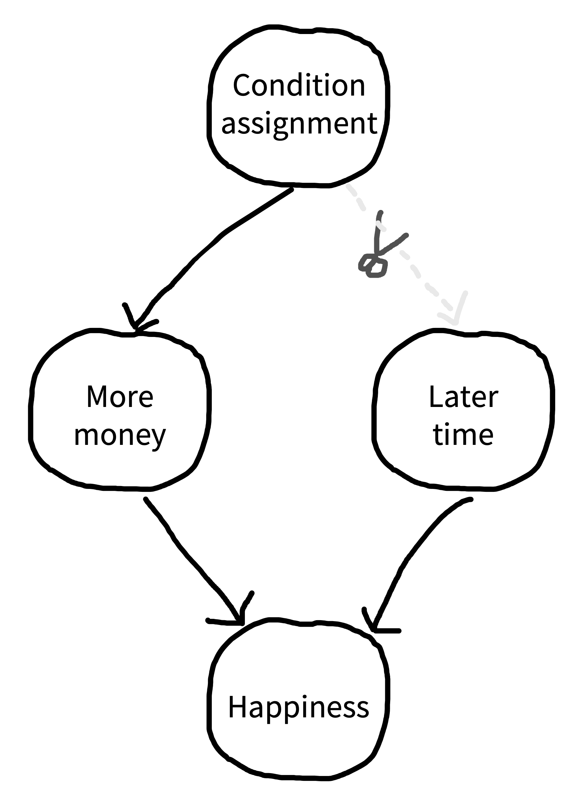

# Design {#design}

::: {.box data-box="learning_goals"}
* Describe key elements to designing a manipulation
* Define randomization and counterbalancing strategies for removing confounds
* Discuss strategies to design experiments that are appropriate to the populations of interest
:::

The key thesis of our book is that experiments should be designed to yield precise and unbiased measurements of a causal effect. But the causal effect of what? The manipulation! In an experiment we manipulate (intervene on) some aspect of the world and measure the effects of that manipulation. We then compare that measurement to a situation where the intervention has not occurred. 

We refer to different intervention states as **conditions** of the experiment. These conditions instantiate specific **factors** of interest. The most common experimental design is the comparison between a **control** condition, in which the intervention is not performed, and an **experimental** (sometimes called **treatment**) condition in which the intervention is performed. But many other experimental designs are possible. The goal of this chapter is to introduce some of these and give you some tools for considering their tradeoffs.  In the first part of the chapter, we'll introduce some common experimental designs and the vocabulary for describing them. 

To be useful, a measure must be a valid measure of a construct of interest. The same is true for a manipulation -- it must validly relate to the causal effect of interest. In the next part of the chapter, we'll discuss issues of **manipulation validity**, including both issues of ecological validity and **confounding**. We'll talk about how practices like **randomization** and **counterbalancing** can help remove nuisance confounds.^[This section will draw on our introduction to causal inference in Chapter \@ref(experiments), so if you haven't read that, now's the time.] 

<!-- We'll end the chapter by discussing some aspects of strategy in experimental design. How do you design an experiment to test a theory? What sorts of experimental designs are maximally efficient?  -->

To preview our general take-home points from this chapter: we think that your default experiment should manipulate one or two factors -- usually not more -- and should manipulate those factors continuously and within-participants. Although such designs are not always possible, they are typically the most likely to yield precise estimates of a particular effect that can be used to constrain future theorizing. We'll start by considering a case study in which a subtle confound led to difficulties interpreting an experimental result. 

::: {.box data-box="case_study" data-title="Automatic theory of mind? "}

In an early version of our course, student Desmond Ong set out to replicate a thought-provoking finding: both infants and adults seemed to show evidence of tracking other agents' belief state, even when it was irrelevant to the task at hand [@kovacs2010]. In the paradigm, an animated character would watch as a self-propelled ball came in and out from behind a screen. At the end of the video, the screen would swing down and the participant had to respond whether the ball was present or absent, with their reaction time as the key dependent variable. The experimental design fully crossed two factors: whether the participant believed the ball was present or absent (P+/P-) and whether the animated agent *would have believed* the ball was present or absent (A+/A-) based on what it saw. 

```{r design-kovacs-original, fig.cap="Original data from Kovacs et al. (2010). Error bars show 95\\% confidence intervals.", fig.margin = TRUE}
knitr::include_graphics("images/design/kovacs-original.png")
```

Both the original experiments and the replication that Desmond ran showed a significant effect of the agent's beliefs on participants' reaction times, suggesting that what the -- totally irrelevant -- agent thought about the ball was leading them to react more or less quickly to the presence of the ball. Figure \@ref(fig:design-kovacs-original) shows the original data (N=24). But although both studies showed an effect of agent belief, the replication and several variations also showed a crossover **interaction** of participant and agent belief. The participants were slower when the agents *and* the participants believed that the ball was behind the screen (Figure \@ref(fig:design-kovacs-replication)). That finding wasn't consistent with the theory that tracking inconsistent beliefs slowed down reaction times. If participants were tracking their own beliefs about the ball *and* the agent's, they should have been fastest in the P+/A+ condition, not slower.

```{r design-kovacs-replication, fig.cap="Data from a series of replications of Kovacs et al. (2010), including versions on the web (Experiments 1a and 1b) and in lab (Experiment 1c), as well as several variations on the format of responding (Experiments 2 and 3; 2AFC = two alternative forced choice) and an experiment where a large wall (occluder) kept the agent from seeing the ball at all (Experiment 4)."}
knitr::include_graphics("images/design/kovacs-replication.png")
```

A collaborative team working on this paradigm identified a key issue [@phillips2015]. There was a **confound** in the experimental design -- another factor that varied across conditions besides the target factors (the agent's and participant's belief states). The confound was an attention check (discussed further in Chapter \@ref(collection)): participants had to press a key when the agent left the scene to show that they were paying attention. This attention check appeared a few seconds later in the videos for the P+/A+ and P-/A- trials -- the ones that yielded the slow reaction times -- than it did for the other two. When the attention check was removed or when its timing was equalized across conditions, reaction time effects were eliminated, suggesting that the original pattern of findings may have been due to the confound. 

If the standard for replication is significance of specific statistical tests at *p<.05*, then this experiment replicated successfully. But the effect estimates were inconsistent with the proposed theoretical explanation. A finding can be replicable without providing support for the underlying theory! 

<!-- One barrier to carrying out this replication work was the unavailability of the original stimulus videos from @kovacs2010. To carry out the work, Ong had to team up with another group of researchers who had learned how to generate complex animated videos. Once the work was complete, critics commented that that the new videos might have been different from the original ones.^[The original videos showed [the same effect](http://babieslearninglanguage.blogspot.com/2015/05/an-update-on-automatic-belief-encoding.html) in a followup study. The original group also published a replication and extension using neural measures and eliminating the attention check altogether -- that version showed no reaction time effect [@kovacs2014].]  -->

There's an important caveat to this story. The followup work *only* revealed that there was a confound in one particular experimental operationalization, and did not provide evidence against automatic theory of mind in general. Indeed, others have suggested that different versions of this paradigm *do* reveal evidence for theory of mind processing once the confound is eliminated [@el-kaddouri2020].
<!-- We're not sure; the only thing we're sure of at the present is that it's better not to have a confound in your experiment.^[As a teaser, this case might be an example of a broader pattern that we believe is quite common in the behavioral sciences of **being right for the wrong reason**. That is, experimenters perform an experiment to test a particular hypothesis. The hypothesis is correct, and the experimenters observe a positive result and report on it. Unfortunately, the experiment is imperfect and does not warrant the conclusion -- yet the conclusion is nevertheless correct. This pattern resembles what are called "Gettier cases" in philosophy, after a famous argument about the nature of knowledge [@gettier2012]: is it really knowledge if you are right but your justification is wrong?] -->

:::

## Experimental designs

Experimental designs are fundamental to many fields; unfortunately the terminology used to describe them can vary, which can get quite confusing! Here we'll try to stay consistent by describing an experiment as a relationship between some **manipulation** in which participants are randomly assigned to an experimental condition to evaluate its effects on some **measure**. An alternative is the terms that are often used in econometrics: the **treatment** (manipulation) and the **outcome** (measure).^[Terminology here is hard. In psychology people sometimes say there's an **independent variable** (the manipulation, which is causally prior and hence "independent" of other causal influences) and a **dependent variable** (the measure, which causally depends on the manipulation, or so we hypothesize). This terminology seems transparently terrible. In contrast, the econometric "treatment" and "outcome" seems fairly medical -- it sounds like the treatment is something substantial and lasting, and the outcome is meaningful. That's not always the case in experiments that investigate psychological mechanisms. For example, in a cognitive psychology context, it sounds a bit weird to us to say that the "treatment" was reading scrambled words and the "outcome" was lexical decision reaction times.] 

In this section, we'll discuss a number of dimensions on which experiments vary. First, they vary in how many factors they incorporate and how these factors are crossed -- we begin with the two-factor experiment and then discuss generalizations. Second, they vary in how many conditions and how many measures are given to each participant. Third, their manipulations can be discrete or continuous. 

### A two-factor experiment

The classical "design of experiments" framework has as its goal to separate observed variability in the dependent measure into 1) variability due to the manipulation(s) and (2) other variability, including measurement error and participant-level variation. This framework maps nicely onto the statistical framework described in Chapters \@ref(estimation) -- \@ref(models). We are modeling the distribution of our measure using information about the condition structure of our experiment as our predictors. 

Different experimental designs will allow us to estimate condition effects more and less effectively. Recall in Chapter \@ref(estimation), we estimated the effect of our manipulation by a simple subtraction: $\beta = \theta_{T} - \theta_{C}$ (where $\beta$ is the effect estimate, and $\theta$s indicate the estimates for each condition, treatment $T$ and control $C$). This logic works just fine also if there are two distinct treatments in  a three condition experiment: each treatment can be compared to control separately.  For treatment 1, $\beta_{T_1} = \theta_{T_2} - \theta_{C}$ and $\beta_{T_2} = \theta_{T_2} - \theta_{C}$. That logic is going to get more complicated if we have more than one distinct factor of interest, though. Let's look at a simple example. 

@young2007 were interested in how moral judgments depend on both the beliefs of actors and the outcomes of their actions. They presented participants with vignettes in which they learned, for example, that Grace visits a chemical factory with her friend and goes to the coffee break room where she sees a white powder that she puts in her friend's coffee. They then manipulated both Grace's beliefs and the outcomes of her actions following the schema in Figure \@ref(fig:design-young-design). Participants (N=10) used a four-point Likert scale to rate whether the actions were morally forbidden (1) or permissible (4). 

```{r design-young-design, fig.cap="The 2x2 crossed design used in Young et al. (2007).", fig.margin = TRUE}
knitr::include_graphics("images/design/young2007-design2.png")
```
Young et al.'s design has two factors -- belief and outcome -- each with two levels (negative and neutral).^[Note that neither of these is necessarily a "control" condition: the goal is simply to compare these two levels of the factor -- negative and neutral -- to estimate the effect due to the factor.] These factors are **fully crossed**: each level of each factor is combined with each level of each other. That means that we can estimate a number of effects of interest. The experimental data are shown in Figure \@ref(fig:design-young-data). 


```{r design-young-data, fig.cap="Moral permissability as a function of belief and outcome. Results from Young et al. (2007), annotated with the estimated effects. Simple effects measure differences between the individual conditions and the neutral belief, neutral outcome condition. The interaction measures the difference between the predicted sum of the two simple effects and the actual observed data for the negative belief, negative outcome condition."}
knitr::include_graphics("images/design/young2007-data2.png")
```

This fully-crossed design makes it easy for us to estimate quantities of interest. Let's say that our **reference** group (equivalent to the control group for now) is neutral belief, neutral outcome, which we'll notate $B,O$. Now it's easy to use the same kind of subtraction we did before to estimate a variety of effects. For example, we can look at the effect of negative belief in the case of a neutral outcome: $\beta_{-B,O} = \theta_{-B,O} - \theta_{B,O}$. The effect of a negative outcome is computed similarly as $\beta_{B,-O} = \theta_{B,-O} - \theta_{B,O}$. 

But now there is a complexity: these two **simple effects** (effects of one variable at a particular level of another variable) make a prediction. They predict that the combined effect $\beta_{-B,-O}$ should be equal to the sum of $\beta_{-B,O}$ and $\beta_{B,-O}$.^[If you're interested, you can also compute the **average** or **main** effect of a particular factor via the same subtractive logic. For example, the average effect of negative belief ($-B$) vs. a neutral belief ($B$) can be computed as $\beta_{-B} = \frac{(\theta_{-O, -B} + \theta_{O, -B}) - (\theta_{-O, B} + \theta_{O, B})}{2}$.] As we can see from the graph, that's not right: if it were, the negative belief, negative outcome condition would be below the minimum possible rating. Instead, we observe an **interaction** effect (sometimes called a **two-way interaction** when there are two factors): The effect when both factors are present is different than the sum of the two simple effects, so we need an interaction coefficient $\beta_{-B,-O}$.^[If you're reading carefully, you might be thinking that this all sounds like we're talking about the analysis of variance (ANOVA), not about experimental design per se. These two topics are actually the same topic! The question is how to design an experiment so that these statistical models can be used to estimate particular effects -- and combinations of effects -- that we care about.] 

In other words, the effect of negative beliefs (intent) on subjective moral permissibility depends on whether the action caused harm. Critically, without a fully-crossed design, we can't estimate this interaction and we would have made an incorrect prediction. 

### Generalized factorial designs

Young et al.'s design, in which there are two factors with two levels each, is called a **2x2 design** (pronounced "two by two"). 2x2 designs are incredibly common and useful, but they are only one of an infinite variety of such designs that can be constructed. 

Say we added a third factor to Young et al.'s design such that Grace either feels neutral towards her friend or is angry on that day. If we fully crossed this third affective factor with the other two (belief and outcome), we'd have a 2x2x2 design. This design would have eight conditions: 
$(A, B, O)$, $(A, B, -O)$, $(A, -B, O)$, $(A, -B, -O)$, $(-A, B, O)$, $(-A, B, -O)$, $(-A, -B, O)$, $(-A, -B, -O)$. 
These conditions would in turn allow us to estimate both two-way and three-way interactions, enumerated in Table \@ref(tab:design-three-way).

```{r design-three-way}
tribble(~Effect, ~`Term Type`,
        "Affect", "Main effect",
        "Belief", "Main effect",
        "Outcome", "Main effect",
        "Affect X Belief", "2-way interaction",
        "Affect X Outcome", "2-way interaction",
        "Belief X Outcome", "2-way interaction",
        "Affect X Belief X Outcome", "3-way interaction") |>
  knitr::kable(caption = "Possible effects in a hypothetical 2x2x2 experimental design with affect, belief, and outcome as factors.", booktabs = TRUE)
```
Three-way interactions are hard to think about! The affect X belief X outcome interaction tells you about the difference in moral permissibility that's due to all three factors being present as opposed to what you'd predict on the basis of your estimates of the two-way interactions. In addition to being hard to think about, higher order interactions tend to be hard to estimate, because estimating them accurately requires you to have a stable estimate of all of the lower-order interactions [@mcclelland1993]. For this reason, we recommend against experimental designs that rely on higher-order interactions unless you are in a situation where you both have strong predictions about these interactions and are confident in your ability to estimate them appropriately.

Three-way interactions are just the beginning, though. If you have three factors with two levels each, you can estimate 7 total effects of interest, as in Table \@ref(tab:design-three-way). If you have four factors with two levels each, you get 15. Four factors with three levels each gets you a horrifying 80 different effects!^[The general formula for $N$ factors with $M$ levels each is $M^N-1$.] This way lies madness, at least from the perspective of estimating and interpreting individual effects in a reasonable sample. 

::: {.box data-box="depth" data-title="Estimation strategies for generalized factorial designs"}

So what should you do if you really do care about four or more factors -- in the sense that you want to estimate their effects and include them in your theory? The simplest strategy is to start your research off by measuring them independently in a series of single-factor experiments. This kind of setup is natural when there is a single reference level for each factor of interest, and such experiments can provide a basis for judging which factors are most important for your outcome and hence which should be prioritized for experiments to estimate interactions. 

On the other hand, sometimes there is no reference level for a factor. For example, in the @kovacs2010 paradigm, it's not clear whether a positive or negative belief is the reference level. That's not a problem in a fully-crossed design like theirs, but this situation can pose a problem because if you have more than two such factors. Ideally you would want to run independent experiments, but you have to choose some level for all of the other variables -- you can't just assume that one level is "neutral." 

One solution that lets you compute main effects but not interactions is called a **Latin square**. Latin squares are a good solution for three-factor designs, which is the level at which a fully-crossed design typically gets overwhelming.^[There's a variant called the "Greco-Latin square" for four factors, in case you need that.] A Latin square is an $n x n$ matrix in which each number occurs exactly once in each row and column, e.g. $$\begin{bmatrix} 
	1 & 2 & 3 \\
	2 & 3 & 1\\
	3 & 1 & 2 \\
	\end{bmatrix}$$
	
This Latin square for $n=3$ gives the solution for how to balance factors across a 3x3x3 experiment. The row number is one factor, the column number is the second factor, and the number in the cell is the third factor. So one condition would be (1,1,1), the first level of all factors, shown in the upper left cell. Another would be (3,3,2), the lower right cell.  Although a fully-crossed design would require 27 cells to be run, the Latin square has only nine. Critically, the combinations of all each factor is balanced across the nine cells so that the average effect of each level of the three factors can be estimated.^[You can check and see that no interactions can be estimated, because no factor co-occurs with two different levels of another factor.] 

There are also fancier methods available. For example, the literature on optimal experiment design contains methods for choosing the most informative sequence of experiments to run in order to estimate the parameters in a model [e.g., @myung2009]. Going down this road typically means having an implemented computational theory of your domain, but it can be a very productive strategy for exploring a complex experimental space with many factors.
:::

### Between- vs. within-participant designs

Once you have a sense of the factor or factors you would like to manipulate in your experiment, the next step is to consider how these will be presented to participants, and how that presentation will interact with your measurements. The biggest decision to be made is whether each participant will experience only one level of a factor -- a **between-participants** design -- or whether they will experience multiple levels -- a **within-participants** design. Figure \@ref(fig:design-between) shows a very simple example of between-participants design with four participants (two assigned to each condition), while Figure \@ref(fig:design-within) shows a within-participants version of the same design.^[The within-participants design is counterbalanced for the order of the conditions; we cover the issue of counterbalancing below.]

```{r design-between, fig.cap="A between-participants design.", fig.margin = TRUE}
# g <- DiagrammeR::grViz("digraph {
#   graph [layout = dot, rankdir = LR]
#   
#   node [shape = rectangle, style = filled, fillcolor = white]        
#   a [label = 'Participant 1']
#   b [label = 'Participant 2']
#   c [label = 'Participant 3']
#   d [label = 'Participant 4']
#   
#   node [fillcolor = pink]
#   c1a [label = 'Experimental Manipulation']
#   c1b [label = 'Experimental Manipulation']
#   
#   node [fillcolor = lightblue]
#   c2a [label = 'Control Manipulation']
#   c2b [label = 'Control Manipulation']
#   
#   node [fillcolor = white]
#   m1 [label =  'Measure']
#   m2 [label =  'Measure']
#   m3 [label =  'Measure']
#   m4 [label =  'Measure']
#   
#   # edge definitions with the node IDs
#   a -> c1a -> m1
#   b -> c1b -> m2
#   c -> c2b -> m4
#   d -> c2a -> m3
#   }")
# 
# g$width <- "50%"
# g$height <- "100%"
# # g
knitr::include_graphics("images/design/between2.png")
```


```{r design-within, fig.cap="A within-participants design, counterbalanced for order.", out.width = "75%"}
# g2 <- DiagrammeR::grViz("digraph {
#   graph [layout = dot, rankdir = LR]
#   
#   node [shape = rectangle, style = filled, fillcolor = white]        
#   a [label = 'Participant 1']
#   b [label = 'Participant 2']
#   c [label = 'Participant 3']
#   d [label = 'Participant 4']
#   
#   node [fillcolor = pink]
#   c1a [label = 'Experimental Manipulation']
#   c2a [label = 'Experimental Manipulation']
#   c3a [label = 'Experimental Manipulation']
#   c4a [label = 'Experimental Manipulation']
#   
#   node [fillcolor = lightblue]
#   c1b [label = 'Control Manipulation']
#   c2b [label = 'Control Manipulation']
#   c3b [label = 'Control Manipulation']
#   c4b [label = 'Control Manipulation']
#   
#   node [fillcolor = white]
#   m1a [label =  'Measure']
#   m2a [label =  'Measure']
#   m3a [label =  'Measure']
#   m4a [label =  'Measure']
#   m1b [label =  'Measure']
#   m2b [label =  'Measure']
#   m3b [label =  'Measure']
#   m4b [label =  'Measure']
#   
#   # edge definitions with the node IDs
#   a -> c1a -> m1a -> c1b -> m1b
#   b -> c2a -> m2a -> c2b -> m2b
#   c -> c3b -> m3a -> c3a -> m3b
#   d -> c4b -> m4a -> c4a -> m4b
#   }")
# 
# g2$width <- "100%"
# g2$height <- "100%"
# # g2
knitr::include_graphics("images/design/within2.png")
```


The decision whether to measure a particular factor between- or within-participants is consequential because people vary. Imagine we're estimating our treatment effect as before, simply by computing $\widehat{\beta} = \widehat{\theta}_{T} - \widehat{\theta}_{C}$ with each of these estimates from different populations of participants. In this scenario, our estimate $\widehat{\beta}$ contains three components: 1) the true differences between $\theta_{T}$ and $\theta_{C}$, 2) sampling-related variation in which participants from the population ended up in the samples for the two conditions, and 3) measurement error. Component #2 is present because any two samples of participants from a population will differ in their average on a measure -- this is precisely the kind of sampling variation we saw in the null distributions in Chapter \@ref(inference). 

When our experimental design is within-participants, component #2 is not present, because participants in both conditions are sampled from the *same* population. If we get unlucky and all of our participants are lower than the population mean on our measure, that unluckiness affects our conditions equally. We discuss the specific consequences for sample size calculations in the next chapter but the consequences are fairly extreme. Between-participants designs typically require between two and eight times as many participants as within-participants designs!^[If you want to estimate how big an advantage you get from within-participants data collection, you need to know how correlated (reliable) your observations are. [Here's one analysis of this issue](https://daniellakens.blogspot.com/2016/11/why-within-subject-designs-require-less.html) that suggests that the key relationship is that $N_{within} = N_{between} (1-\rho) /2$ where $\rho$ is the correlation between the measurement of the two conditions within individuals. The more correlated they are, the smaller your within-participants $N$.]

Given these advantages, why would you consider using a between-participants design? A within-participants design is simply not possible for all experiments. For example, consider a medical intervention like an experimental surgical procedure. Patients likely cannot receive both two procedures, and so no within-participant comparison of procedures is possible. 

Most treatment conditions in the behavioral sciences are not so extreme, but it may be impractical or inadvisable to deliver multiple conditions. @greenwald1976 distinguishes three types of undesirable effects: **practice**, **sensitization**, and **carry-over** effects^[We tend to think of all of these as being forms of carry-over effect, and sometimes use this as a catch-all description. Some people also use the picturesque description ["poisoning the well"](https://statmodeling.stat.columbia.edu/2017/11/25/poisoning-well-within-person-design-whats-risk/) -- earlier conditions "ruin" the data for later conditions.]: 

* Practice effects occur when administering the measure or the treatment will lead to improvement. Imagine a curriculum intervention for teaching a math concept  -- it would be hard to convince a school to teach the same topic to students twice, and the effect of the second round of teaching would likely be quite different than the first! 
* Sensitization effects occur when seeing two versions of an intervention mean that you might respond differently to the second than the first because you have compared them and noticed the contrast. Consider a study on room lighting -- if the experimenters are constantly changing the lighting, participants may become aware that lighting changes is the point of the study! 

* Carry-over effects refer to the case where one treatment might have a longer-lasting effect than the measurement period. For example, imagine a study in which one treatment was to make participants frustrated with an impossible puzzle; if a second condition were given after this first one, participants might still be frustrated, leading to spill-over. 

All of these issues can lead to real concerns with respect to within-participant designs. But we worry that the desire for effect estimates that are completely unbiased by these concerns may lead to the overuse of between-participant designs [@gelman2017]. As we mentioned above, these designs come at a major cost in terms of power and precision. An alternative approach is simply to acknowledge the possibility of carry-over type effects and plan to analyze these within your statistical model (for example by estimating the interaction of condition and order).^[Even when one factor must be varied between participants, it is often still possible to vary others within subjects, leading to a **mixed** design in which some factors are between and others within.]

We summarize the state of affairs from our perspective in Figure \@ref(fig:design-between-within). We think that within-participant designs should be preferred whenever possible.

```{r design-between-within, fig.cap="Pros and cons of between- vs. within-participant designs. We recommend within-participant designs when possible.", fig.margin=TRUE}
knitr::include_graphics("images/design/between-within.png")
```

### Repeated measurements and experimental items

We just discussed decision-making about whether to administer multiple *manipulations* to a single participant. An exactly analogous decision comes up for *measures*! And our take-home will be similar: unless there are specific difficulties that come up, it's usually a very good idea to take multiple measurements from each participant, in what is called -- sensibly -- a **repeated measures** design.^[We're of course talking about taking multiple measurements of the same construct! This is different from taking multiple measures of different constructs. As we discussed in Chapter \@ref(measurement), we tend to be against measuring lots of different things in a single experiment -- in part because of the concerns that we're articulating in this chapter: if you have time, it's better to make more precise measures of the one construct you care about most. Measuring one thing well is hard enough. Much better to measure one thing well than to measure many constructs badly.]

In the last subsection, we described how variability in our estimates in a between-participants design depend on three components: 1) true condition differences, 2) sampling variation between conditions, and 3) measurement error. (The within-participants design is good because it doesn't have #2). Repeated measures designs also help reduce measurement error. The more times you measure, the lower your measurement error -- leading to greater measure reliability!

The simplest way you can do a repeated measures design is by administering your treatment and then administering your measure multiple times. This scenario is pictured in a between-participants design in Figure \@ref(fig:design-rm-between). Sometimes this works quite well. For example, imagine a transcranial magnetic stimulation (TMS) experiment: participants receive neural stimulation for a period of time, targeted at a particular region. Then they perform some measurement task repeatedly until it wears off. The more times they perform it, the better the estimate of whatever effect (when compared to a control of TMS to another region, say).

```{r design-rm-between, fig.cap="A between-participants, repeated-measures design.", out.width = "75%"}
# g3 <- DiagrammeR::grViz("digraph {
#   graph [layout = dot, rankdir = LR]
#   
#   node [shape = rectangle, style = filled, fillcolor = white]        
#   a [label = 'Participant 1']
#   b [label = 'Participant 2']
#   c [label = 'Participant 3']
#   d [label = 'Participant 4']
#   
#   node [fillcolor = pink]
#   c1a [label = 'Experimental Manipulation']
#   c1b [label = 'Experimental Manipulation']
#   
#   node [fillcolor = lightblue]
#   c2a [label = 'Control Manipulation']
#   c2b [label = 'Control Manipulation']
#   
#   node [fillcolor = white]
#   m1a [label =  'Measure']
#   m2a [label =  'Measure']
#   m3a [label =  'Measure']
#   m4a [label =  'Measure']
#   m1b [label =  'Measure']
#   m2b [label =  'Measure']
#   m3b [label =  'Measure']
#   m4b [label =  'Measure']
#   m1c [label =  'Measure']
#   m2c [label =  'Measure']
#   m3c [label =  'Measure']
#   m4c [label =  'Measure']
#   
#   # edge definitions with the node IDs
#   a -> c1a -> m1b -> m1a -> m1c
#   b -> c1b -> m2b -> m2a -> m2c
#   c -> c2b -> m3b -> m3a -> m3c
#   d -> c2a -> m4b -> m4a -> m4c
#   }")
# 
# g$width <- "50%"
# g3$height <- "80%"
# g3
knitr::include_graphics("images/design/rm-between2.png")
```

The catch is exactly analogous to the between-participants design: some measures can't be repeated without altering the response. To take an obvious example, we can't give the exact same math problem twice and get two useful measurements of mathematical ability! The general solution to this problem that is typically used is the **experimental item**. In the case of a math assessment, you create multiple problems that you believe test the same concept but have different numbers or other superficial characteristics. This practice is widespread because the use of multiple experimental items can license generalizations across a population of items in the same way that the use of multiple participants can ideally license generalizations across a population of people [@clark1973]. 

::: {.box data-box="accident_report" data-title="Stimulus-specific effects"}

Imagine you're a psycholinguist who has the hypothesis that nouns are processed faster than verbs. You run an experiment where you pick out ten verbs and ten nouns, then measure a large sample of participants' reading time for each of these. You find strong evidence for the predicted effect and publish a paper on your claim. The only problem is that, at the same time, someone else has done exactly the same study -- with different nouns and verbs -- and published a paper making the opposite claim. The problem in this example is that each effect is driven by the specific experimental items that were chosen [@clark1973]. Out of hundreds of thousands of possible words, why these in particular? 

The problem of generalization from sample to population is not new -- as we discussed in Chapter \@ref(inference), we are constantly doing this kind of inference with the samples of people that participate in our experiments. Our classic statistical techniques are designed to generalize from a sample of participants to a population of participants, so we typically think hard about weakness of generalizations made from very small samples of experimental participants. We're much less sensitized to the same pattern for stimuli, where a small sample of stimuli lead us to make improper generalizations about the population of stimuli.^[@clark1973, from whom this example is adapted, calls this the "language-as-fixed-effect" fallacy. This is a great label for folks who already know about fixed vs. random effects, but it doesn't highlight how it connects to the broader set of issues of generalizability that we highlight here and in Chapter \@ref(sampling), so we'll mostly use the label "stimulus generalizability."] 
<!-- [MM: I don't understand preceding 2 sentences. I can't tell whether what's at stake is "classical" generalization from sample to population (because of the "very small samples") or generalization in the context of moderators. The latter seems more consistent with what's below. But the former is what the models discussed here can accommodate.] -->

Stimulus generalizability problems have reared their head across a surprising range of different areas of psychology. In one example, hundreds of papers were written about a phenomenon called the "risky shift" -- in which groups deliberating about a decision would produce riskier decisions than individuals. Unfortunately, this phenomenon appeared to be completely driven by the specific choice of vignettes that groups deliberated about, with some producing a risky shift and others producing a more conservative shift [@westfall2015]. 

Another example comes from the memory literature, where a classic paper by @baddeley1975 suggested that words that take longer to pronounce ("tycoon" or "morphine") would be remembered worse than words that took a shorter amount of time ("ember" or "wicket") even when they had the same number of syllables. This effect also appears to be driven by the specific sets of words chosen in the original paper; the effect is very replicable with that particular set but not generalizable across other sets [@lovatt2000].

The implication of these examples is clear: experimenters need to take care in both their experimental design and analysis to avoid overgeneralizing from their stimuli to a broader construct. Three primary steps can help experimenters avoid this pitfall:

1. To maximize generality, use samples of experimental items -- words, pictures, or vignettes -- that are comparable in size to your samples of participants.
2. When replicating an experiment, consider taking a new sample of items as well as a new sample of participants. 
3. When experimental items are sampled random from a broader population, use a statistical model (such as those described in Chapter \@ref(models)) that includes this sampling process. 
:::

One variation on the repeated measures, between-participants design is a specific version where the measure is administered both before (pre-) and after (post-) intervention, as in Figure \@ref(fig:design-pre-post). This design is sometimes known as a **pre-post** design. It is extremely common in cases where the intervention is larger-scale and harder to give within-participants, such as in a field experiment where a policy or curriculum is given to one sample and not to another. The pre measurements can be used to subtract participant-level variability out and recover a more precise estimate of the treatment effect. Recall that our treatment effect in a pure between participants design is $\beta = \theta_{T} - \theta_{C}$. In a pre-post design, we can do better by computing $\beta = (\theta_{T_{post}} - \theta_{T_{pre}}) - (\theta_{C_{post}} - \theta_{C_{pre}})$. This equation says "how much more did the treatment group go up than the control group?^[This estimate is sometimes called a "difference in differences" and is very widely used in the field of econometrics, both in experimental and quasi-experimental cases [@cunningham2021].]

```{r design-pre-post, fig.cap="A between-participants, pre-post design.", out.width = "60%"}
# g4 <- DiagrammeR::grViz("digraph {
#   graph [layout = dot, rankdir = LR]
#   
#   node [shape = rectangle, style = filled, fillcolor = white]        
#   a [label = 'Participant 1']
#   b [label = 'Participant 2']
#   c [label = 'Participant 3']
#   d [label = 'Participant 4']
#   
#   node [fillcolor = pink]
#   c1a [label = 'Experimental Manipulation']
#   c1b [label = 'Experimental Manipulation']
#   
#   node [fillcolor = lightblue]
#   c2a [label = 'Control Manipulation']
#   c2b [label = 'Control Manipulation']
#   
#   node [fillcolor = white]
#   m1a [label =  'Measure']
#   m2a [label =  'Measure']
#   m3a [label =  'Measure']
#   m4a [label =  'Measure']
#   m1b [label =  'Measure']
#   m2b [label =  'Measure']
#   m3b [label =  'Measure']
#   m4b [label =  'Measure']
#   
#   # edge definitions with the node IDs
#   a -> m1a -> c1a -> m1b
#   b -> m2a -> c1b -> m2b
#   c -> m3a -> c2b -> m3b
#   d -> m4a -> c2a -> m4b
#   }")
# 
# g4$width <- "70%"
# g4$height <- "100%"
# # g4
knitr::include_graphics("images/design/pre-post2.png")
```

Of course, repeated measurements are not limited to between-participants designs! All within-participants designs are repeated measures designs, which are the bread and butter of most research in perception, psychophysics, and cognitive psychology. When both manipulations and measures can be repeated, these designs afford high measurement precision even with small sample sizes; they are recommended whenever they are possible. 

### Discrete and continuous experimental manipulations 

Most experimental designs in psychology use discrete condition manipulations: treatment vs. control. In our view, this decision often leads to a lost opportunity. In our framework, the goal of an experiment is to estimate a causal effect; ideally, this estimate can be generalized to other contexts and used as a basis for theory. Measuring not just one effect but instead a **dose-response** relationship -- how the measure changes as the strength of the manipulation is changed -- has a number of benefits in helping to achieve this goal. 

Many manipulations can be **titrated** -- that is, their strength can be varied continuously -- with a little creativity on the part of an experimenter. A curriculum intervention can be applied at different levels of intensity, perhaps by changing the number of sessions in which it is taught. For a priming manipulation, the frequency or duration of prime stimuli can be varied. Two stimuli can be morphed continuously so that categorization boundaries can be examined.^[These methods are extremely common in perception and psychophysics research, in part because the dimensions being studied are often continuous in nature. For example, imagine trying to estimate a participant's visual contrast sensitivity *without* continuously manipulating the contrast of the stimulus, eliciting judgments at many different levels.] 

Dose-response designs are useful because they provide insight into the shape of the function mapping your manipulation to your measure. Knowing this shape can inform your theoretical understanding! Consider the examples given in Figure \@ref(fig:design-dose-schema). If you only have two conditions in your experiment, then the most you can say about the relationship between your manipulation and your measure is that it produces an effect of a particular magnitude; in essence, you are assuming that condition is a nominal variable. If you have multiple ordered levels of treatment, you can start to speculate about the nature of the relationship between treatment and effect magnitude. But if you can measure the strength of your treatment, then you can start to describe the nature of the relationship between the strength of treatment and strength of effect via a parametric function (e.g., a linear regression, a sigmoid, or other function).^[These assumptions are theory-laden, of course -- the choice of a linear function or a sigmoid is not necessary: nothing guarantees that simple, smooth, or monotonic functions are the right ones. The important point from our perspective is that choosing a function makes explicit your assumptions about the nature of the treatment-effect relationship.] These parametric functions can in turn allow you to generalize from your experiment, making predictions about what would happen under intervention conditions that you didn't measure directly!

```{r design-dose-schema, fig.cap="Three schematic designs. (left) Control and treatment are two levels of a nominal variable. (middle) Control is compared to ordered levels of a treatment. (right) Treatment level is an interval or ratio variable such that points can be connected and a parametric curve can be extrapolated."}
knitr::include_graphics("images/design/dose-response2.png")
```

<!-- This all can feel a bit abstract, so let's consider an example. @brennan1966 were interested in the relationship between visual complexity and infants' looking preferences. Do infants uniformly prefer complex stimuli, or do they search for stimuli at an appropriate level of complexity for their processing abilities. To test this hypothesis, they exposed infants in three different age groups (3, 8, and 14 weeks, N=30) to black and white checkerboard stimuli with three different levels of complexity (2x2, 8x8, and 24x24). Their findings are plotted in Figure \@ref(fig:design-dose-ex): the youngest infants preferred the simplest stimuli, while infants at an intermediate age preferred stimuli of intermediate complexity, and the oldest infants preferred the most complex stimuli. These findings help to motivate the theory that infants attend preferentially to stimuli that provide appropriate learning input for their processing ability [@kidd2012].^[@brennan1966's experiment uses a quantitative manipulation of complexity (checkerboard density). But they treat this manipulation as an ordinal -- rather than an interval -- variable, presumably because they do not know precisely how checkerboard density translates into changes in the psychological construct they care about, namely complexity. Does doubling the number of squares on the board double complexity, or do you have to double the number of squares on each side? Does complexity saturate, such that a 128x128 checkerboard is not much more complex? These are just a few of the questions that the dose-response approach raises.] -->

<!-- ```{r design-dose-ex, fig.cap = "Infants' looking time, plotted by stimulus complexity and infant age. Data from Brennan et al., 1966.", fig.margin=TRUE} -->
<!-- brennan <- tribble(~age, ~complexity, ~looking_time,  -->
<!--                    3, "2x2", 80.9, -->
<!--                    3, "8x8", 52.3, -->
<!--                    3, "24x24", 23.5, -->
<!--                    8, "2x2", 54.2,  -->
<!--                    8, "8x8", 112.0, -->
<!--                    8, "24x24", 74.9, -->
<!--                    14, "2x2", 43.3, -->
<!--                    14, "8x8", 69.7, -->
<!--                    14, "24x24", 91.0) |> -->
<!--   mutate(complexity = fct_relevel(complexity, "2x2", "8x8")) -->

<!-- ggplot(brennan, aes(x = age, y = looking_time, col = complexity)) +  -->
<!--   geom_point() +  -->
<!--   geom_line(aes(group = complexity)) + -->
<!--   xlim(0,15) +  -->
<!--   xlab("Age (weeks)") +  -->
<!--   ylab("Total fixation time (sec)") + -->
<!--   scale_color_discrete(name = "Stimulus complexity") -->

<!-- # from fig 1 via web-digitizer -->
<!-- # 0.9157088122605361, 80.92485549132948  -->
<!-- # 1.9731800766283523, 52.3121387283237 -->
<!-- # 2.9846743295019156, 23.526011560693647 -->
<!-- # 4.049808429118774, 14.855491329479776 -->
<!-- # 0.946360153256705, 54.21965317919076 -->
<!-- # 1.9042145593869733, 111.96531791907515 -->
<!-- # 2.9540229885057467, 74.85549132947978 -->
<!-- # 4.03448275862069, 10.346820809248555 -->
<!-- # 0.9540229885057467, 43.294797687861276 -->
<!-- # 1.9425287356321839, 69.65317919075144 -->
<!-- # 2.93103448275862, 90.98265895953757 -->


<!-- ``` -->

<!-- If your goal is simply to detect whether an effect is zero or non-zero, then dose-response designs do not achieve the maximum statistical power. For example, if @brennan1966 simply wanted to achieve maximal statistical power, they probably should have only tested two age groups and two levels of complexity (say, 3 and 14 week infants and 2x2 and 24x24 checkerboards). That would have been enough to show an interaction of complexity and age, and their greater resources devoted to these four (as opposed to nine) conditions would mean more precise estimates of each (simulated in Figure \@ref(fig:design-dose-ex-2)). But their findings would be less clearly supportive of the view that infants prefer stimuli that are appropriate to their processing ability. By seeking to measure intermediate conditions, they provided a stronger constraint on their theory.  -->

<!-- ```{r design-dose-ex-2, fig.cap = "Imagining the data from Brennan et al. 1966 if they had omitted intermediate conditions in search of the most extreme effect.", fig.margin=TRUE} -->
<!-- brennan_minimal <- tribble(~age, ~complexity, ~looking_time,  -->
<!--                    3, "2x2", 80.9, -->
<!--                    3, "24x24", 23.5, -->
<!--                    14, "2x2", 43.3, -->
<!--                    14, "24x24", 91.0) |> -->
<!--   mutate(complexity = fct_relevel(complexity, "2x2", "8x8")) -->

<!-- ggplot(brennan_minimal, aes(x = age, y = looking_time, col = complexity)) +  -->
<!--   geom_point() +  -->
<!--   geom_line(aes(group = complexity)) + -->
<!--   xlim(0,15) +  -->
<!--   xlab("Age (weeks)") +  -->
<!--   ylab("Total fixation time (sec)") + -->
<!--   scale_color_discrete(name = "Stimulus complexity") -->
<!-- ``` -->

## Choosing your manipulation

In the previous section, we reviewed a host of common experimental designs. These designs provide a palette of common options for combining manipulations and measures. But your choice must be predicated on the specific manipulation you are interested in! In this section, we discuss considerations for experimenters as they design their manipulation, especially regarding internal and external validity.  

### Internal validity threats: Confounding 

First and foremost, manipulations must correspond to the construct whose causal effect is being estimated. If they do not, they are **confounded**. This term is used widely in psychology, but it's worth revisiting what it means. An **experimental confound** is a variable that is created in the course of the experimental design that is both causally related to the predictor and potentially also related to the outcome. As such, it is a threat to **internal validity**. 

Let's go back to our discussion of causal inference in Chapter \@ref(experiments). Our goal was to use a randomized experiment to estimate the causal effect of money on happiness. But just giving people money is a big intervention that involves contact with researchers -- as we'll discuss, contact alone can lead to an experimental effect even if your manipulation fails. For that reason, many studies that provide money to participants either give a small amount of money or a large amount of money. This keeps researcher contact consistent in both conditions, implying that the difference in outcomes between these two conditions should be due to the amount of money received (unless there are other confounds!).

Suppose you were designing an experiment of this sort and you wanted to follow our advice above and use a within-participants design. You could measure happiness, give participants $100, wait a month and measure happiness again, give participants $1000, wait a month, and then measure happiness for the third time. This design has an obvious experimental confound (Figure \@ref(fig:design-money1)): the order of the monetary gifts. Maybe happiness just went up over time, irrespective of getting the second gift.

When we designed a within-participants experiment, we introduced an order confound: if Dylan was always played first, then we didn't know whether a change in our measure was caused by Dylan directly (the path straight from $X$ to $Y$) or by some order-related factor, say unfamiliarity with the task (the "indirect" path from $X$ to the confound $X'$ and then to $Y$). If the confound remains, as with the timing confound in the @kovacs2010 case study discussed above, then any experimental effect could be attributed to the confound only and not to the causal factor of interest. 

```{r design-money1, fig.margin=TRUE, fig.cap="Confounding order and condition leads to "}
knitr::include_graphics("images/design/money1.png")
```

If you think your experimental design might have a confound, you should think about ways to remove it. For example, **counterbalancing** order across participants is a very safe choice. Some participants get \$100 first and others get \$1000 first. That way, you are guaranteed that the order of conditions will have no effect of the confound on your average effect. The effect of this counterbalancing is that it "snips" the causal dependency between condition assignment and later time. We notate this on our causal diagram with a scissors icon (Figure \@ref(fig:design-money2)).^[In practice, counterbalancing is like adding an additional factor to your factorial design! But because the factor is a nuisance factor, we don't discuss it as a true condition manipulation. Despite that, it's a good practice to check for effects of these sorts of nuisance factors in your preliminary analysis. Even though your average effect won't be biased by it, it introduces variation that you might want to understand to interpret other effects and plan news studies.] Time can still have an effect on happiness, but the effect is independent from the effect of condition and hence your experiment can still yield an unbiased estimate of the condition effect. 

```{r design-money2, fig.margin=TRUE, fig.cap="Confounding between order and condition can be removed by counterbalancing or randomization."}

```

Counterbalancing gets trickier when you have too many levels on a variable or multiple confounding variables. In that case, it may not be possible to do a fully-crossed counterbalance so that all combinations of these factors are seen by equal numbers of participants. You may have to rely on partial counterbalancing schemes or Latin square designs (see Depth box above; in this case, the Latin squares are used to create orderings of stimuli such that the position of each treatment in the order is controlled across two other confounding variables). 

Another option for such tricky cases is **randomization**, that is, choosing which level of a nuisance variable to administer to the participant via a random choice. Randomization is increasingly common now that many experimental interventions are delivered by software. If you *can* randomize experimental confounds, you probably should. The only time you really get in trouble with randomization is when you have a large number of options, a small number of participants, or some combination of the two. Then you can end up with unbalanced levels of the randomized factors. Averaging across many experiments, a lack of balance will come out in the wash, but in a single experiment, it can lead to unfortunate bias in numbers. 
<!-- For that reason, counterbalancing is a more conservative option for experiments with small samples (or if you have confounding factors with large numbers of levels).  -->

A good approach to thinking through your experimental design is to walk through the experiment step by step and think about potential confounds. For each of these confounds, consider how it might be removed via counterbalancing or randomization. As the case study of @kovacs2010 shows, confounds are not always obvious, especially in complex paradigms. There is no sure-fire way to ensure that you have spotted every one -- sometimes the best way to avoid them is simply to present your candidate design to a skeptical friend. 
  
### Internal validity threats: Placebo, demand, and expectancy

A second class of important threats to internal validity comes from cases where the research design is confounded by a set of factors internal to the research ecosystem. In some cases, these create confounds that can be controlled; in others they must simply be understood and guarded against. @rosnow1997 called these "artifacts": systematic errors related of research *on* people, and *by* people.

A **placebo** effect is a positive effect on the measure that comes as a result of participant expectation for a treatment being given in the context of research. Giving an inactive sugar pill leads some patients to report a reduction in whatever symptom they are being treated for. Placebo effects are a major concern in medical research as well as a fixture in experimental designs in medicine [@benedetti2020]. The key idea is that treatments must not simply be compared to a baseline of no treatment but rather to a baseline in which the psychological aspects of treatment are present. In the terms we have been using, the experience of receiving a treatment (independent of the content of the treatment) is a confounding factor when you simply compare treatment to no treatment conditions. 

<!-- In the psychological context, such one class of effects have sometimes been referred to as **Hawthorne** effects, after historical experiments in which a group of workers who were being studied at the Western Electrical Company supposedly were more productive on the basis of being studied. This story is in fact more complex than its textbook description [@rosenthal1984], but the generalization is true. The simple fact of being part of an experiment can alter behavior in the same way that receiving medical treatment can alter a response to treatment. Thus, experimenters who are interested in measuring a positive response to some treatment must be careful to provide an **active control** that removes the "key ingredient" while still maintaining the general study framework.  -->

::: {.box data-box="accident_report" data-title="Brain training?"}

Can doing challenging cognitive tasks make you smarter? In the late 2000s and early 2010s, a large industry for "brain training" emerged. Companies like Lumos Labs, CogMed, BrainHQ, and CogniFit offered games -- often modeled on cognitive psychology tasks -- that claimed to lead to broad gains in memory, attention, and problem solving. 


```{r design-jaeggi, fig.margin=TRUE, fig.cap="The primary outcome graph for Jaeggi et al. (2008)."}
knitr::include_graphics("images/design/jaeggi.png")
```

These companies were basing their claims in part on a scientific literature reporting that concerted training on difficult cognitive tasks could lead to benefits that **transferred** to other cognitive domains. Among the most influential of these was a study by @jaeggi2008. They conducted four experiments in which participants (N=70 across the studies) were assigned to either working memory training via a difficult dual N-back task or a no-training control, with training varying from 8 days all the way to 19 days. Their finding excited a tremendous amount of interest because they reported not only gains in performance on the specific training task but also on a matrix reasoning task (which is considered to be a good measure of general intelligence) the participants had not received training on. While the control group's scores on these tasks improved, presumably just from being tested twice, there was a condition by time (pre- vs. post) interaction such that the scores of the trained groups (consolidated across all four training experiments) grew significantly more over the training period (Figure \@ref(fig:design-jaeggi)). These findings were interpreted as supporting transfer -- whereby training on one task leads to broader gains -- a key goal for "brain training."

```{r design-jaeggi-disagg, fig.margin=TRUE, fig.cap="The four sub-experiments of Jaeggi et al. (2008), now disaggregated. Panels show 8- (A), 12- (B), 17- (C), and 19-session (D) studies. Note the different scales and measures. RAPM = Raven's Advanced Progressive Matrices; BOMAT = Bochumer Matrizentest. From @redick2013."}
knitr::include_graphics("images/design/jaeggi-disaggregated.png")
```


This finding spurred immense interest in the scientific community, but the consensus did not support these early findings. Careful readers of the original paper noticed a number of the signs of analytic flexibility that we mentioned in Chapters \@ref(replication) and \@ref(inference) in the original paper, including the post-hoc consolidation of experiments to yield $p = .025$ on the key interaction [@redick2013]. When data were disaggregated, it was clear that the measures and effects had differed in each of the different sub-experiments (Figure \@ref(fig:design-jaeggi-disagg)). 

Several replications by the same group addressed some of these issues, but still failed to show convincing evidence for far transfer with an active control group [@simons2016]. Further, a careful replication (N=74) with an active control group and a wide range of outcome measures failed to find any transfer effects from working-memory training [@redick2013]. A meta-analysis of 23 studies concluded that their findings cast doubt on working memory training for increasing cognitive functioning [@melby-lervag2013]. In one convincing and broad test of the cognitive transfer theory, a BBC show ("Bang Goes The Theory") encouraged its listeners to participate in a six week online brain training study. More than 11,000 listeners completed the pre- and post-tests and at least two training sessions. Neither focused training of planning and reasoning nor broader training on memory, attention and mathematics led to transfer to un-trained tasks.  

Placebo effects are one plausible explanation for the positive findings in this literature. @foroughi2016 recruited participants to participate via two different advertisements. The first advertised that "numerous studies have shown working memory training can increase fluid intelligence" (placebo group) while the second simply offered experimental credits (control group). After a single training session, the placebo group showed significant improvements to their matrix reasoning abilities. Participants in the placebo group realized gains from training out of proportion with any they could have realized through training. Further, those participants who responded to the placebo group ad tended to endorse statements about the malleability of intelligence, suggesting that they might have been especially likely to self-select into the intervention. 

Summarizing the voluminous literature on brain training, @simons2016 wrote that "Despite marketing claims from brain-training companies of 'proven benefits'... we find the evidence of benefits from cognitive brain training to be 'inadequate.'"
:::

If placebo effects reflect what participants expect from a treatment then **demand characteristics** reflect what participants think *experimenters* want and their desire to help the experimenters achieve that goal [@orne1962]. Demand characteristics are often raised as a reason for avoiding within-participants designs -- if participants become alert to the presence of an intervention, they may then respond in a way that they believe is helpful to the experimenter. Typical tools for controlling or identifying demand characteristics include using a cover story to mask the purpose of an experiment, using a debriefing procedure to probe whether participants typically guessed the purpose of an experiment, and (perhaps most effectively) creating a control condition with similar demand characteristics but missing a key component of the experimental intervention. 

The final entry into this list of internal validity threats comes from what are called **experimenter expectancy effects**, where the experimenter's behavior biases participants in a way that results in the appearance of condition differences where no true difference exists. The classic example of such effects comes from the animal learning literature and the story of Clever Hans the horse. Hans appeared able to do  arithmetic by tapping out solutions with his hoof; however on deeper investigation, it became apparent that he was being cued by his trainer to stop tapping when the desired answer was reached. 

In any experiment delivered by human experimenters who know what condition they are delivering, condition differences can result from experimenters imparting their expectations. Figure \@ref(fig:design-rosenthal) shows the results of a meta-analysis estimating the size of expectancy effects across a range of domains. These magnitudes are shocking. There is no question that experimenter expectancy is sufficient to "create" many interesting phenomena artifactually if we are not on guard against it. The mechanisms of expectancy are an interesting research topic in their own right, but in many cases expectancies appear to be communicated non-verbally in much the same way that Clever Hans learned [@rosnow1997]. 

```{r design-rosenthal, fig.cap="Magnitudes of expectancy effects. From @rosenthal1994.", fig.margin=TRUE}
knitr::include_graphics("images/design/rosenthal2004.png")
```

In medical research, designs where neither patients nor experimenters know which condition the patients are in are the gold standard, and results from other designs are treated with suspicion because of their vulnerability to demand and expectancy effects^[These are commonly referred to as **double blind** designs (though the term *masked* is preferred by some).]. In psychology, the most common modern protection against expectancy is the delivery of interventions by a computer platform that can give instructions in a coherent and uniform way across conditions. 

In the case of interventions that must be delivered by experimenters, ideally experimenters should be unaware of which condition they are delivering. On the other hand, the logistics of maintaining experimenter ignorance can be quite complicated in psychology.  For this reason, many researchers opt for lesser degrees of control, for example, choosing to standardize delivery of an intervention via a script. These designs are sometimes necessary for practical reasons but should be scrutinized closely. "How can you rule out experimenter expectancy effects?" is an uncomfortable question that should be asked more frequently in seminars and paper reviews.

### External validity of manipulations

The goal of a specific experimental manipulation is to operationalize a particular causal relationship of interest. Just as the relationship between measure and construct can be more or less valid, so too can the relationship between manipulation and construct. How can you tell? Just like in the case of measures, there's no one royal road to validity. You need to make a validity argument [@kane1992].^[One caveat is that the validity of a manipulation incorporates the validity of the manipulation *and* the measure. You can't really have a good estimate of a causal effect if the measurement is invalid.] 

<!-- Let's see how these arguments might look for some of the examples we've discussed in this chapter.  -->

For testing the effect of money on happiness, our manipulation was to give participants $1000. This manipulation is clearly face valid. But how often do people just receive a windfall of cash, versus getting a raise at work or inheriting money from a relative? Is the effect caused by *having* the money, or *receiving* the money with no strings attached? We might have to do more experiments to figure out what aspect of the money manipulation was most important. Even in straightforward cases like this one, we need to be careful about the breadth of the claims we make. 

Sometimes validity arguments are made based on the success of the manipulation in producing some change in the measurement. In the the implicit theory of mind case study we began with, the stimulus contained an animated Smurf character, and the argument was that participants took the Smurf's beliefs into account in making their judgments. This stimulus choice seems surprising -- not only would participants have to track the implicit beliefs of other *people*, they would also have to be tracking the beliefs of depictions of non-human, animated characters. On the other hand, based on the success of the manipulation, the authors made an *a fortiori* argument: if you track an animated Smurf's beliefs, then you *must* be tracking the beliefs of real humans. This example reveals how arguments about manipulation validity can be **theory-laden**. 

Let's look at one last example to think more about the theory-ladenness of manipulation validity. @walton2011 conducted a short intervention in which college students (N=92) read about social belonging and the challenges of the transition to college and then reframed their own experiences using these ideas. This intervention led to long-lasting changes in grades and well-being. While the intervention undoubtedly had a basis in theory, part of our understanding of the validity of the intervention comes from its efficacy: sense of belonging *must* be a powerful factor if intervening on it causes such big changes in the outcome measures.^[On the other hand, if the manipulation *doesn't* produce a change in your measure, maybe the manipulation is invalid, but the construct still exists. Sense of belonging could still be important even if my particular intervention failed to alter it!] The only danger is when the argument becomes circular -- a theory is correct because the intervention yielded a success, and the intervention is presumed to be valid because of the theory. The way out of this circle is through replication and generalization of the intervention. If the intervention repeatably produces the outcome, as has been shown in replications of the sense of belonging intervention [@walton2020], then the manipulation becomes an intriguing target for future theories. The next step in such a research program is to understand the limitations of such interventions (sometimes called **boundary conditions**). 

## Summary: Experimental design

In this chapter, we started by examining some common experimental designs that allow us to measure effects associated with one or more manipulations. Our advice, in brief, was: "keep it simple!" The failure mode of many experiments is that they contain too many manipulations, and these manipulations are measured with too little precision. 

Start with just a single manipulation, and measure it carefully. Ideally this measurement should be done via a within-participants design unless the manipulation is completely incompatible with this design. And if this design can incorporate a dose-response manipulation, it is more likely to provide a basis for quantitative theorizing. 

How do you ensure that your manipulation is valid? A careful experimenter needs to consider possible confounds and ensure that these are controlled or randomized. They must also consider other artifacts including placebo, demand, and expectancy effects. Finally, they must begin thinking about the relation of their manipulation to the broader theoretical construct whose causal role they hope to test. 

::: {.box data-box="discussion_questions"}
1. Choose a classic study in your area of psychology. Analyze the design choices: how many factors were manipulated? How many measures were taken? Did it use a within-participants or between-participants design? Were measures repeated? Can you justify these choices with respect to tradeoffs (e.g., spill-over effects, fatigue, etc.)?

2. Consider the same study. Design an alternative version that varies one of these design parameters (e.g., drops a manipulation or measure, changes within- to between-participants, etc.). What are the pros and cons of this change? Do you think your design improves on the original?
:::


::: {.box data-box="readings"}
* Much of this material is covered in more depth in the classic text on research methods: Rosenthal, R. & Rosnow, R. L. 2008. *Essentials of Behavioral Research: Methods and Data Analysis*. Third Edition. New York: McGraw-Hill. <http://dx.doi.org/10.34944/dspace/66>.
:::
