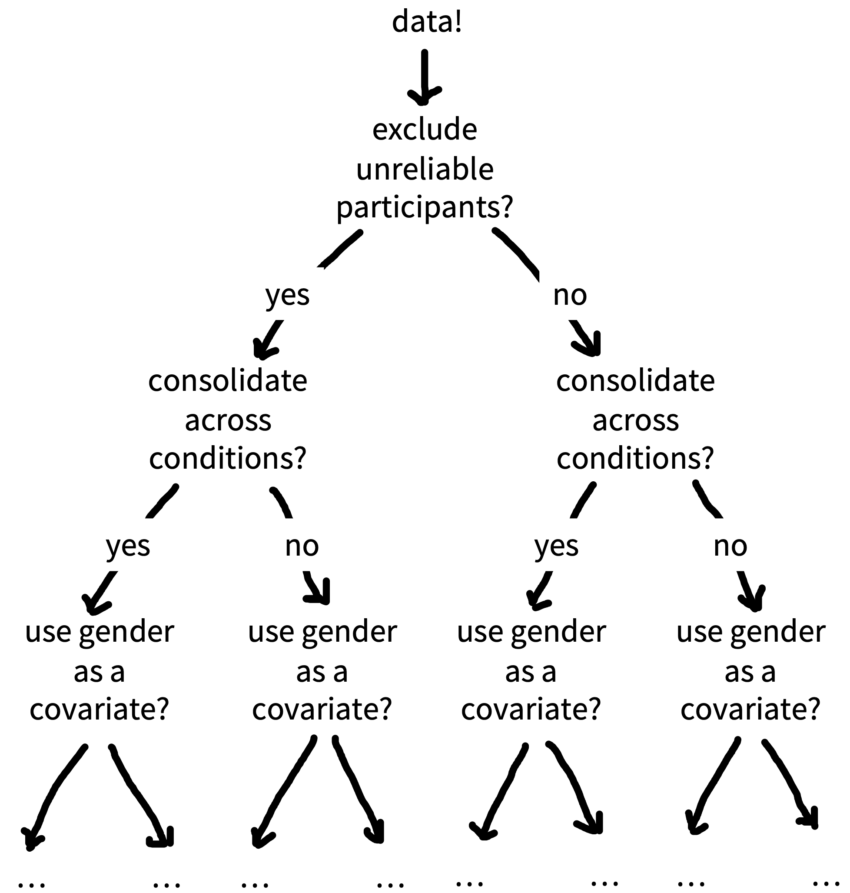

# Preregistration {#prereg}

::: {.learning-goals}
🍎 Learning goals: 

- Recognize the dangers of researcher degrees of freedom in "the garden of forking paths"
- Understand the differences between exploratory and confirmatory modes of research
- Learn how preregistration and other tools can counter bias and help others to evaluate your work by increasing transparency

:::

> The first principle is that you must not fool yourself--and you are the easiest person to fool...After you've not fooled yourself, it's easy not to fool other scientists. You just have to be honest in a conventional way after that. 
>
> `r tufte::quote_footer('--- Richard Feynman [-@feynman1974]')`

This may surprise you coming from the authors of a textbook about research methods, but there is no single "correct" way to design and analyze an experiment[^1]. In fact, for most research decisions, there are many justifiable options. For example, will you stop data collection after 20, 200, or 2000 participants? Will you remove outlier values and how will you define them? Will you conduct subgroup analyses to see whether the results are affected by sex, or age, or some other factor? Consider a simplified, hypothetical case where you need to make five analysis decisions and have five justifiable options for each decision — this alone would result in 3125 (5^5) unique ways to analyze your data! In this chapter, we will find out why flexibility in the design, analysis, reporting, and interpretation of experiments (also referred to as "researcher degrees of freedom"), can lead to scientists fooling themselves and fooling each other. We will also learn about how preregistration (and other tools) can be used to protect our research from bias and provide the transparency that other scientists need to effectively evaluate our work.

[^1]: Though there are plenty of incorrect ways to design and analyse experiments and we hope we can help you to avoid these!

## Lost in a garden of forking paths

```{r forking-paths, fig.cap="Garden of forking paths (placeholder image I hacked together, replace with an illustration?)", fig.margin=TRUE}

```

One way to visualize researcher degrees of freedom is as a vast decision tree or "garden of forking paths" (Figure \@ref(fig:forking-paths); @gelman2014). Each node represents a decision point and each branch represents a justifiable choice. Each unique pathway through the garden terminates in an individual result. Because scientific observations typically consist of both noise (random variation unique to this sample) and signal (regularities that will reoccur in other samples), some of these pathways will inevitably lead to results that are misleading (e.g., inflated effect sizes, exaggerated evidence, or false positives)[^2]. The more potential paths there are in the garden that you might explore, the higher the chance of encountering misleading results[^3]. Statisticians refer to this as a *multiplicity* problem. 

[^2]: The signal-to-noise ratio is worse in situations (alas, common in psychology) that involve small effect sizes, high variation, and large measurement errors [@ioannidis2005]. Researcher degrees of freedom may be constrained to some extent by strong theory [@oberauer2019], community norms, or replication studies, though these constraints may be more implicit than explicit, and still leave plenty of room for flexible decision-making.

[^3]: In frequentist terminology, you are increasing the chance of making a 'Type I error' or 'false positive' finding.

As noted in Chapter \@ref(inference), multiplicity can be addressed to some extent with statistical countermeasures, like the Bonferroni correction; however, these adjustment methods need to account for every path that you *could have* taken [@gelman2014; @degroot2014]. When you navigate the garden of forking paths *during data analysis*, it is easy to forget, or even be unaware of every path that you could have taken, so these methods can longer be used effectively. Additionally, when a researcher navigates the garden of forking paths during data analysis, their decisions can be biased because they are receiving feedback on how different choices affect the results (*results-dependent* decision making). If a researcher is seeking a particular kind of result (which is likely - see Box 1), then they are more likely to follow the branches that take them in that direction. You could think of this a bit like playing a game of hot!🔥 or cold!☃️. Each time the researcher reaches a decision point, they try one of the branches and get some feedback on how it affects the results. If the feedback is hot!🔥 (i.e., the result is in line with their preferences) then they take that branch. If the answer is cold!☃️, they try a different branch. If they reach the end of a complete pathway, and the results are cold!☃️, maybe they even retrace their steps and try some different branches earlier in the pathway. This strategy create a risk of bias[^4] because the results of the study are being systematically skewed towards the researcher's preferences[^5]. 

[^4]: We say "risk of bias" rather than just "bias" because in most scientific contexts, we do not have a known ground truth to compare the results to. So in any specific situation, we do not know the extent to which results-dependent analyses have actually biased the results.

[^5]: Another way to think of this is in terms of 'regression to the mean'. When a sample statistic is selected because it crosses some threshold (e.g., statistical significance), then it is more likely to provide a biased estimate that decreases upon subsequent measurement - in other words, it regresses to the mean.

In the most egregious cases, a researcher may try multiple pathways until they obtain a desirable result[^6] and then *selectively report* that result, neglecting to mention that they have tried several analysis strategies. You may remember an example of this when participants apparently became younger when they listened to "When I'm 64" by The Beatles in Chapter \@ref(ethics). Another nice example is when a group of enterprising researchers 'discovered' brain activity in a dead Atlantic Salmon (Figure \@ref(fig:salmon); @bennett2009).  Deliberately taking advantage of researcher degrees of freedom and selectively reporting results is known by various names, like p-hacking, cherry picking, data dredging, and it is unethical because it involves hiding highly relevant information. But you should also be aware that results-dependent analysis incurs a risk of bias even if the researcher doesn't explicitly try multiple pathways and honestly reports everything they did. For example, if each branch they took was hot!🔥, they may reach the end of the pathway with the result they desire without realizing that, had the results been different, they would have followed other pathways [@gelman2014; @degroot2014]. Its surprisingly easy to convince yourself after the fact that you made the decisions you did for principled reasons that had nothing to do with the results (see 'motivated reasoning', Box 1). In sum, engaging in results-dependent analysis increases the chances that you will fool yourself by inadvertently stumbling across misleading results - and if you are not honest about what you did, you can fool others too.

[^6]: "If you torture the data long enough, it will confess" [@good1972]

```{r salmon, fig.cap="By deliberately exploiting analytic flexibility in the processing pipeline of fMRI data, Bennet et al. (2009) were able to identify 'brain activity' in a dead Atlantic Salmon during cognitive perspective taking task.", fig.margin=TRUE}
knitr::include_graphics("images/prereg/salmon.jpeg")
```

## Exploratory and confirmatory research

But hang on a minute! Isn't it a good thing to seek out interesting results if they are there in the data? Shouldn't we "let the data speak"? The answer is yes! Examining the data from multiple angles is an important activity, sometimes referred to as "exploratory research". This is a great way to generate new hypotheses and identify unexpected patterns. But, with exploratory research you need to (a) be aware of the increased risk of bias and calibrate your confidence in the results accordingly; (2) be honest with other researchers about your analysis strategy so they are also aware of the risk of bias and can calibrate their confidence in the results accordingly. Note that "exploratory research" is not the same as p-hacking, which is dishonest because it involves withholding information.

Exploratory research can be contrasted with confirmatory research, where we 


Consider also that there are multiple ways to *explain* your results - any single result can be explained by multiple different theories (known as the Duhem-Quine problem) We might call these "explanatory degrees of freedom".

Grid image.
Means (selective reporting) motive (pressure to publish etc) opportunity (RDFs)


HARking - essentially expands the GFP.


::: {.interactive}
⌨️ Interactivity box: The perils of p-hacking “Hack your way to scientific glory” (p-hacking exercise).
:::

## Only human: Cognitive biases and pressure to polish

The chrysalis effect: when ugly truth becomes a beautiful fiction

```{r chrysalis, fig.cap="The chrysalis effect", fig.margin=TRUE}
knitr::include_graphics("images/prereg/chrysalis.png")
```

There's a storybook image of the scientist as an objective, rationale, and dispassionate arbiter of truth [@veldkamp2017]. But in reality, scientists are only human: they have egos, career ambitions, and rent to pay.
cognitive bias and extrinsic motivations

Unfortunately, the scientific ecosystem in which we do our research is tainted with bad incentives.


The allocation of funding, awards, and publication prestige is based on research findings being impressive over being right7–9. Typically, this manifests as a preference for novel, positive, and ‘statistically significant’ findings over incremental, negative, or null findings7,23–25. There is additional pressure to produce articles with concise, coherent, and compelling narratives, encouraging selective reporting of research methods and results23,24,26 in order to hide the messy realities of scientific inquiry beneath a veneer of artificial perfection27.


## Reducing bias and increasing transparency with preregistration and friends

> When not planned beforehand, data analysis can approximate a projective technique, such as the Rorschach, because the investigator can project on the data his own expectancies, desires, or biases and can pull out of the data almost any ‘finding’ he may desire.
>

> `r tufte::quote_footer('--- Theodore X. Barber [-@barber1976]')`

Other related tools e.g., Registered reports, blind/masked analysis, cross validation, sensitivity analysis (Hardwicke and Wagenmakers 2021)

```{r prereg-evidence, fig.cap="Preregistration may be effective (Kaplan)", fig.margin=TRUE}
knitr::include_graphics("images/prereg/prereg-evidence.png")
```


::: {.case-study}
🔬 Case study: tale of two RCTs (Frank 2016)
:::

## Exploratory and confirmatory research: Pregistration offers the best of both worlds


## How to preregister

- Intro to Open Science Framework as one tool for timestamping your hypotheses, different kinds of preregistration templates.

Reporting preregistered work – distinguishing exploratory and confirmatory analyses, acknowledging departures from original plan

::: {.accident-report}
⚠️ Accident report: Amending your preregistration is better than not doing it at all. 
:::

```{r reg-reports, fig.cap="Registered Reports (https://www.cos.io/initiatives/registered-reports)", fig.margin=TRUE}
knitr::include_graphics("images/prereg/registered-reports.png")
```


## other things
Preregistration of secondary data analysis (and caveats about causal inference). Not our main topic, but important. 

Barriers to adoption of preregistration. 

Limitations of the preregistration approach, especially with respect to iterative theory building (e.g., Navarro critique).

From reviewer: "A mention of what preregistration is not meant for. When teaching preregistration to new graduate students or undergraduates, I find that students often get hung up on trying to “guess” the outcome of their experiment correctly, even when they have little theoretical or empirical background for their predictions. Preregistration isn’t about testing our precognition skills, though, so I find it helpful to address this issue early on."

Why preregister? (Hardwicke and Wagenmakers 2021)

- Reduce bias – addresses the problem of researcher degrees of freedom by reducing exposure to potentially biasing information and reduces selective reporting?
- Calibrate confidence – helps to gauge risk of bias thereby enabling proper interpretation of confirmatory vs exploratory results.
- Increase transparency – it’s not a straightjacket that prevents you from doing anything else, it’s a snapshot of your current thinking
- Front-load careful thinking – forces you to sit down and be careful about your thinking, often catch conceptual issues and save time in the long-run

::: {.exercise}
P-hack your way to scientific glory!
:::

::: {.exercise}
Preregister your next experiment! 
:::
