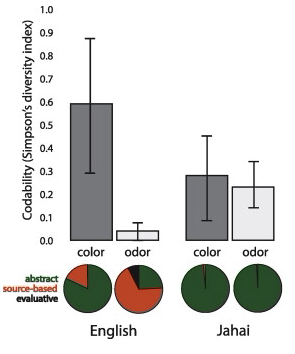

# Sampling {#sampling}

::: {.learning-goals}
🍎 Learning goals: 

* Learn how to choose an appropriate sample size
* Generalize notion of sample size to other axes of generalizability 
* Reason about limitations of different samples
:::

As we keep reminding you, experiments are designed to yield measurements of a causal effect. But a causal effect of what, and for whom? These are questions that are often given surprisingly little air time in our papers. Titles in our top journals read "Daxy thinking promotes fribbles," "Doing fonzy improves smoodling," or "Blicket practice produces more foozles than smonkers."^[Titles changed to protect the original authors. These researchers might very well have said more specific things in the text of their paper.] Each of these uses **generic language** to state a claim that is implied to be generally true [@dejesus2019],^[Generic language is a fascinating linguistic phenomenon. When we say things like "mosquitoes transmit malaria," we don't mean that *all* mosquitos do it, only something like "it's a valid and diagnostic generalization about mosquitoes in contrast to other relevant insects or other creatures that they are spreaders of malaria" [@tessler2019].] but for each of these, we could reasonably ask "doing fonzy improves smoodling *for whom*?" Is it everyone? Or a particular set of people? And similarly, we might want to ask "*how much* and *what kind* of fonzy reading?" These are questions about the **generalizability of research**.^[Imagine for a second what a non-generic version of one of these titles might look like: "Reading one particular selection of fonzy for fifteen minutes in the lab improved 36 college students' smoodling scores on a questionnaire." It seems pretty clear that we wouldn't let the authors get away with a fully general version of their claim: "Doing [*any*] fonzy improves smoodling [*for anyone*]." That's just a bad generalization.]

We've already run into generalizability in our treatment of statistical estimation and inference. When we estimated a particular quantity (say, the effect of fonzy), we did so in our own sample. But we then used inferential tools to reason about how this **sample**'s estimate related to the **population** as a whole. How do we link up these statistical tools for generalization to the scientific questions we have about the generalizability of our findings? That's the question of this chapter. 

The first key set of decisions in experiment planning is what population to sample from and how to sample. We'll start by talking about the basics of **sampling theory**: different ways of sampling and the generalizations they do and don't license. In this context, we also discuss **stimulus sampling**, a pervasive and under-appreciated challenge to the generalizability of behavioral research. A second set of key decisions is about **sample size** planning. We'll start with classic **power analysis** but then introduce several other ways that an experimenter can plan and justify their sample size. In the final section, we'll consider some of the broader issues that come up in sampling, including several sampling biases that can lead to biases in the experimental effect. We'll end with a discussion of some broader questions about generalizability in behavioral research. 

::: {.case-study}
🔬 Case study: Is everyone as bad at describing smells as I am? 

Since Darwin, scientists have assumed that smell is a vestigial sense in humans -- one that we don’t even bother to encode in language. In English we don't even have consistent words for odors. We can say something is "stinky," "fragrant, or maybe "musty," but beyond these, all our words for smells are about the *source* of the smell, not the qualities of it. Bananas, roses, and skunks all have distinctive smells, but we don't have any vocabulary for naming what is common or uncommon about them. And when we make up ad-hoc vocabulary, it's typically quite inconsistent [@majid2014]. The same situation applies across many languages.

So, would it be a good generalization about human beings -- all people -- that olfaction as a sense is de-emphasized relative to vision? This inference has a classic sample-to-population structure. We notice that, within several samples of participants using widely-spoken languages, we observe limited and inconsistent vocabulary for smells, as well as poor discrimination. We use these samples to license an inference to the population -- in this case, the entire human population. 

```{r sampling-majid2014, fig.margin=TRUE, fig.cap="Data from Majid and Burenhult (2014) on the consistency of color and odor naming in English and Jahai speakers. Higher values indicate more consistent descriptions. Pie charts indicate the type of language being used."}

```

But these inferences about the universal lack of olfactory vocabulary are likely based on choosing the wrong sample. Multiple hunter-gatherer groups appear to have large vocabularies for consistent smell description. For example, the Jahai, a hunter-gatherer group on the Malay Peninsula, have a vocabulary that includes at least twelve words for distinct odors, for example /cŋεs/, which names odors with a "stinging smell" like gasoline, smoke, or bat droppings. When Jahai speakers are asked to name odors, they produce shorter and much more consistent descriptions than English speakers -- in fact, their smell descriptions were as consistent as their color descriptions (Figure \@ref(fig:sampling-majid2014)). Further studies implicate the hunter-gatherer lifestyle as a factor: while several hunter-gatherer groups show good odor naming, nearby horticulturalist groups don't [@majid2018].

Generalizations about humans are tricky. If you want to estimate the average odor naming ability, you could take a random sample of humans and evaluate their odor naming. Most of the individuals in the sample would likely speak English, Mandarin, Hindi, or Spanish. Almost certainly, none of them would speak Jahai, which spoken by only a little more than a thousand people and is listed as [Threatened](https://www.ethnologue.com/language/jhi) by Ethnologue. Your estimate of low odor naming stability would be a good guess for the majority of the world's population. 

On the other hand, it's more complicated to jump from a statistical generalization about average ability to a richer claim, like "as humans evolved, they lost olfactory ability and gained visual ability." Such claims about *what humans are like* require much more care and much stronger evidence [@piantadosi2014]. From a sampling perspective, human behavior and cognition show immense and complex **heterogeneity** -- variability of individuals and variability across clusters. As a result, naive random samples will have very high variance, leading to problematic generalizations. Put simply, if we want to know what people in general are like, we can't just choose a bunch of English speakers on a college campus in the United States. 
:::

## Sampling theory

The basic idea of sampling is simple: you want to estimate some measurement for a large or infinite population by measuring a sample from that population.^[There are some tools for dealing with estimation in smaller populations where your sample is a substantial fraction of the population (e.g., a survey of your department where you get responses from half of the students). We won't discuss those here; our focus is on generalizing to large populations of humans.] Sampling strategies are split into two categories: **probability sampling** -- in which every member of the population has some chance of being selected -- and **non-probability sampling** -- in which there are some members of the population that simply cannot be selected. 

Classical sampling theory is built around the idea of **probability sampling**. There is some **sampling frame** containing every member of the population -- think of a giant phone book with every adult human's name in it. Then we use some kind of **sampling strategy**, maybe at the simplest just a completely random choice, to select $N$ humans from that sample frame, and then we collect our measure with them. This scenario is the one that informs all of our statistical results about how sample means converge to the population mean (as in Chapter \@ref(inference)). 

Unfortunately, we essentially *never* do sampling of this sort in psychological research. Gathering random samples from the large populations that we'd like to generalize to is far too difficult and expensive. Consider the problems involved in doing some experiment with a sample of *all adult humans*, or even *adult English-speaking humans who are located in the United States*. As soon as you start to think about what it would take to collect a probability sample of this kind of population, the complexities get overwhelming. How will you find their names (what if they aren't in the phone book)? How will you contact them (what if they don't have email)? How will they do your experiment (what if they don't have an up-to-date web browser)? What if they don't want to participate? 

For survey research -- think about election polling -- there are many sophisticated techniques for dealing with these issues; although this field is still imperfect, it has advanced considerably in trying to predict complex and dynamic behaviors. One of the basic ideas is the construction of **representative samples**: samples that resemble the population in their representation of one or several sociodemographic characteristics like gender, income, race and ethnicity, age, political orientation. These samples can be constructed by random sampling, but they can also be constructed through non-probability methods like recruiting quotas of individuals from different groups. 

Our view is that these methods are important for much social science research, but less so for experimental psychology research.^[Readers can come up with counter-examples, but our guess is that they will prove the rule more generally. For example, a recent study tested the generality of growth mindset interventions for US high school students using a national sample [@yeager2019]. This large-scale study sampled more than 100 high schools from a sampling frame of all registered high schools in the US, then randomly assigned students within schools that agreed to participate. They then checked that the schools that agreed to participate were representative of the broader population of schools. This study is great stuff, but we hope you agree that if you find yourself in this kind of situation -- planning a multi-investigator 5 year consortium study on a national sample -- you might want to consult with a statistician and not use an introductory book like this one.] First, many experiments simply cannot be deployed flexibly to arbitrary people in the same way as survey questions. Second, the characteristics on which particular psychological constructs vary -- and hence on which you might want a sample to be representative -- are often much less clear 

## Stratified sampling

We'll spend a little bit of time on stratified sampling here because it's such a generally useful tool. 


Imagine you are interested in a particular behavior. 

```{r}
rare_prop = .2
common_mean = -.25
rare_mean = 1
pop = 10000
population <- tibble(measure = c(rnorm(mean = common_mean , n = pop * (1-rare_prop)),
                                 rnorm(mean = rare_mean, n = pop * rare_prop)),
                     group = c(rep("common", pop * (1-rare_prop)), 
                               rep("rare", pop * rare_prop)))

sims <- expand_grid(n_total = c(20, 50, 100, 200, 500, 1000), 
            sim = 1:100, 
            sample = c("Stratified","Random")) |>
  rowwise() |>
  mutate(data = ifelse(sample == "random", 
                       list(sample_n(population, n_total)),
                       list(bind_rows(sample_n(filter(population, group == "common"), 
                                               n_total * (1 - rare_prop)),
                                      sample_n(filter(population, group == "rare"),
                                               n_total * rare_prop))))) |>
  unnest(cols = c(data)) |>
  group_by(n_total, sim, sample) |>
  summarise(mean = mean(measure)) 


ggplot(sims, aes(x = n_total, y = mean)) + 
  geom_jitter(width = 10, height = 0, alpha = .2) + 
  facet_wrap(~sample) + 
  geom_hline(yintercept = mean(population$measure), lty = 2) + 
  stat_summary(col = "red", 
               fun.y = mean,
               fun.ymin = function(x) mean(x) - sd(x), 
               fun.ymax = function(x) mean(x) + sd(x))
  

```


### Generalization and the goals of sampling


The goal of sampling is generalization: but who do we want to generalize to?

  - Ubiquitous convenience sampling
  - The WEIRD framework (and its weaknesses)
  - Representative sampling and stratification for variance reduction
  - Ethical implications of representation in experimental samples


### Beyond participants: sampling items 

  - What if your effect is generalizable across participants but not across stimuli (Clark 1973).


## Sample size planning 

How many people will your sample contain? As we learned in Chapter \@ref(replication), continuing to collect data until you observe a  $p < .05$ in an inferential test is a good way to get a false positive. To avoid this situation, you need some kind of plan for when you will stop collecting data! Your **stopping rule** can then be a key part of your preregistration, so as to be transparent that your choice of stopping rule didn't invalidate your statistical inference (see Chapter \@ref(prereg)). 

The simplest stopping rule is "I'll collect data until I get to a target $N$" -- all that's needed in this case is a value for $N$. Classically, this value was computed using **power analysis**, which can provide a value for which you have a good chance of rejecting the null hypothesis given a particular expected effect size. But standard power analysis relies on knowing what size effect you are expecting, which is often an unrealistic assumption. If we knew what size effect we expected, wouldn't we already have the information that we are conducting the experiment to get?

```{r sampling-stopping-rules}
tribble(~` `, ~Method, ~`Stopping Rule`, ~Example,
        1, "Power analysis", "Stop at N for known probability of rejecting the null given known effect size", "Randomized trial with strong expectations about effect size", 
        2, "Smallest effect size of interest", "Stop at N for known probability of rejecting the null for effects greater than some minimum", "Measurement of unknown but important effect",
        3, "Resource constraint", "Stop collecting data after a certain amount of time or after a certain amount of resources are used", "Time-limited field work",
        4, "Precision analysis", "Stop at N that provides some known degree of precision in measure", "Experimental measurement to compare with predictions of cognitive models",
        5, "Sequential analysis", "Stop when a known inferential criterion is reached", "Intervention trial designed to accept or reject null with maximal efficiency") |>
        knitr::kable(caption = "Example classes of experimental stopping rules.")
```
There are many different stopping rules that can be used to justify a sample size (Table \@ref(tab:sampling-stopping rules)). Each of these can provide a valid justification for a particular sample size, but they are most useful in different situations. We'll first introduce classic power analysis both because it is a common standard and because it illustrates some of the concepts used in others (e.g., **smallest effect size of interest** or SESOI analysis). We'll then discuss alternative approaches.

### Classic power analysis

Let's start by reviewing the null-hypothesis significance testing paradigm that we introduced in Chapter \@ref(inference). 

  - Classic power analysis 
  
### Alternative approaches to sample size planning

- Smallest effect size of interest (SESOI analysis)
  - Precision-based sample size planning (Bland 2009; Lash and Kaufman 2015) (malcolmbarrett.shinyapps.io/precisely)
  - Simulation based 
  - Sequential analysis (Schönbrodt et al. 2017)


sample calculations for within/between subjects
http://daniellakens.blogspot.com/2016/11/why-within-subject-designs-require-less.html
https://www.ncbi.nlm.nih.gov/pmc/articles/PMC6640316/

### Repeated measures designs: more people or more items? 

DeBolt and Oakes
Westfall

## Issues in sampling 

### Sampling biases

- Attrition/survivorship bias (connection to directed acyclic graphs [DAGs] as described earlier)
  - Selection bias (connection to DAGs again)


### Heterogeneity and stratification

Where sampling goes wrong:


### Limitations statements


## Summary: Sampling

What’s the generalization goal? (population)
How does your sampling scheme relate to this population? 
Unless you are doing true probability sampling, you need to consider how bias introduced by the sampling method could relate to the observed effect
No mechanistic procedure for this
Depends on the claim you want to test
And crucially, the generalization that you want to make from it


:::{.exercise}
Form an argument about this controversial position: We want to understand human cognition generally, but it’s a more efficient research strategy to start by studying certain features of cognition (perception, for example) in WEIRD convenience populations and then later check our generalizations in non-WEIRD groups. 
:::

:::{.exercise}
Form an argument about this controversial position: The most influential experiments aren’t generalizations of some number to a population, they are demonstration experiments that show that some particular effect is possible under some circumstances (think Milgram’s conformity studies, where people apparently shocked a confederate at an experimenter’s prompting), so often specific population sampling is secondary.
:::

:::{.exercise}
Form an argument about this controversial position: Nothing you learn from US college undergraduates is likely to generalize to the US population as a whole, so we should dramatically decrease the use of this convenience population. 
:::

:::{.exercise}
Form an argument about this controversial position: We can’t ever make generalizations about the human mind because so much of the historical human population is simply inaccessible to us (we can’t do experiments on ancient Greek psychology). Psychological samples are also sampling a particular moment in time.
:::