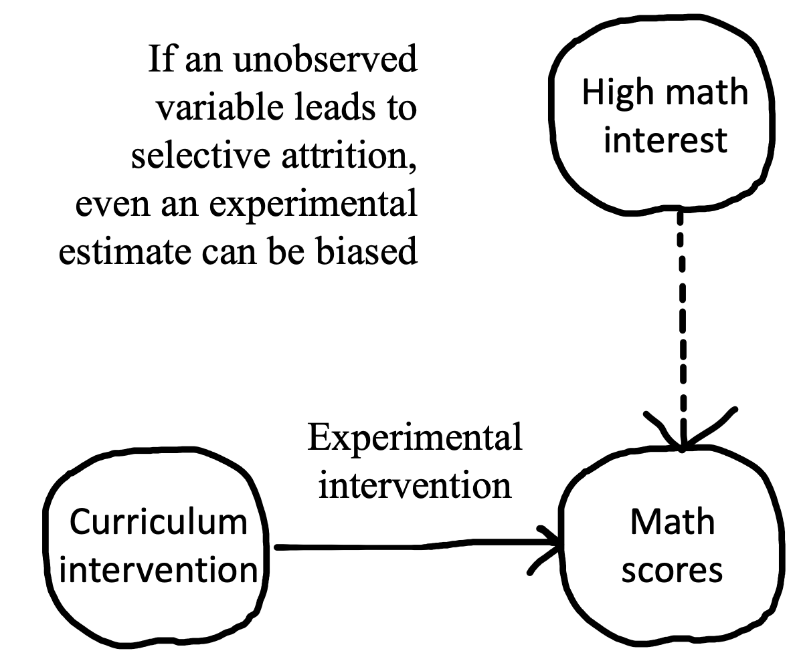

# Sampling {#sampling}

::: {.box .learning_goals}
* Discuss sampling theory and stratified sampling
* Reason about limitations of different samples, especially convenience samples
* Consider sampling biases and how they affect your inferences
* Learn how to choose and justify an appropriate sample size for your experiment
:::


As we keep reminding you, experiments are designed to yield measurements of a causal effect. But a causal effect of what, and for whom? These are questions that are often given surprisingly little air time in our papers. Titles in our top journals read "Daxy thinking promotes fribbles," "Doing fonzy improves smoodling," or "Blicket practice produces more foozles than smonkers."^[Titles changed to protect the original authors. These researchers might very well have said more specific things in the text of their paper.] Each of these uses **generic language** to state a claim that is implied to be generally true [@dejesus2019],^[Generic language is a fascinating linguistic phenomenon. When we say things like "mosquitoes transmit malaria," we don't mean that *all* mosquitoes do it, only something like "it's a valid and diagnostic generalization about mosquitoes in contrast to other relevant insects or other creatures that they are spreaders of malaria" [@tessler2019].] but for each of these, we could reasonably ask "doing fonzy improves smoodling *for whom*?" Is it everyone? Or a particular set of people? And similarly, we might want to ask "*how much* and *what kind* of fonzy reading?" These are questions about the **generalizability of research**.

Imagine for a second what a non-generic version of one of these titles might look like: "Reading one particular selection of fonzy for fifteen minutes in the lab improved 36 college students' smoodling scores on a questionnaire." We wouldn't let the authors get away with a fully general version of their claim: "Doing [*any*] fonzy improves smoodling [*for anyone*]." That's just a bad generalization from the evidence we actually have.

We've already run into generalizability in our treatment of statistical estimation and inference. When we estimated a particular quantity (say, the effect of fonzy), we did so in our own sample. But we then used inferential tools to reason about how the estimate in this **sample** related to the parameter in the **population** as a whole. How do we link up these *statistical* tools for generalization to the *scientific* questions we have about the generalizability of our findings? That's the question of this chapter. 

The first key set of decisions in experiment planning is what population to sample from and how to sample. We'll start by talking about the basics of **sampling theory**: different ways of sampling and the generalizations they do and don't license. In this context, we also discuss **stimulus sampling**, a pervasive and under-appreciated challenge to the generalizability of behavioral research. The second section of the chapter will then deal with **sampling biases** that can compromise our effect estimates. A final set of key decisions is about **sample size** planning. In the third part of the chapter we'll address this issue, starting with classic **power analysis** but then introduce several other ways that an experimenter can plan and justify their sample size. 

::: {.box .case_study}
(TITLE) Is everyone as bad at describing smells as I am? 

Since Darwin, scientists have assumed that smell is a vestigial sense in humans -- one that we don’t even bother to encode in language. In English we don't even have consistent words for odors. We can say something is "stinky," "fragrant, or maybe "musty," but beyond these, all our words for smells are about the *source* of the smell, not the qualities of it. Bananas, roses, and skunks all have distinctive smells, but we don't have any vocabulary for naming what is common or uncommon about them. And when we make up ad-hoc vocabulary, it's typically quite inconsistent [@majid2014]. The same situation applies across many languages.

So, would it be a good generalization about human beings -- all people -- that olfaction as a sense is de-emphasized relative to vision? This inference has a classic sample-to-population structure. Within several samples of participants using widely-spoken languages, we observe limited and inconsistent vocabulary for smells, as well as poor discrimination. We use these samples to license an inference to the population -- in this case, the entire human population. 

```{r sampling-majid2014, fig.margin=TRUE, fig.cap="Data from Majid and Burenhult (2014) on the consistency of color and odor naming in English and Jahai speakers. Higher values indicate more consistent descriptions. Pie charts indicate the type of language being used."}
knitr::include_graphics("images/sampling/majid2014.png")
```

But these inferences about the universal lack of olfactory vocabulary are likely based on choosing the wrong samples! Multiple hunter-gatherer groups appear to have large vocabularies for consistent smell description. For example, the Jahai, a hunter-gatherer group on the Malay Peninsula, have a vocabulary that includes at least twelve words for distinct odors, for example /cŋεs/, which names odors with a "stinging smell" like gasoline, smoke, or bat droppings. When Jahai speakers are asked to name odors, they produce shorter and much more consistent descriptions than English speakers -- in fact, their smell descriptions were as consistent as their color descriptions (Figure \@ref(fig:sampling-majid2014)). Further studies implicate the hunter-gatherer lifestyle as a factor: while several hunter-gatherer groups show good odor naming, nearby horticulturalist groups don't [@majid2018].

Generalizations about humans are tricky. If you want to estimate the average odor naming ability, you could take a random sample of humans and evaluate their odor naming. Most of the individuals in the sample would likely speak English, Mandarin, Hindi, or Spanish. Almost certainly, none of them would speak Jahai, which spoken by only a little more than a thousand people and is listed as [Threatened](https://www.ethnologue.com/language/jhi) by Ethnologue. Your estimate of low odor naming stability would be a good guess for the *majority* of the world's population. 

On the other hand, it's more complicated to jump from a statistical generalization about average ability to a richer claim, like "as humans evolved, they lost olfactory ability and gained visual ability." Such claims about universal aspects of the human experience require much more care and much stronger evidence [@piantadosi2014]. From a sampling perspective, human behavior and cognition show immense and complex **heterogeneity** -- variability of individuals and variability across clusters. Put simply, if we want to know what people in general are like, we have to think carefully about which people we include in our studies.
:::

## Sampling theory

The basic idea of sampling is simple: you want to estimate some measurement for a large or infinite population by measuring a sample from that population.^[There are some tools for dealing with estimation in smaller populations where your sample is a substantial fraction of the population (e.g., a survey of your department where you get responses from half of the students). We won't discuss those here; our focus is on generalizing to large populations of humans.] Sampling strategies are split into two categories: **probability sampling** -- in which every member of the population has some chance of being selected -- and **non-probability sampling** -- in which there are some members of the population that simply cannot be selected. We'll begin by discussing probability sampling, then we'll talk about a useful technique for sampling called **stratified sampling**. With this discussion in hand, we'll turn back to non-probability samples and their strengths and limitations.

### Classical probability sampling

Classical sampling theory is built around the idea of **probability sampling**. There is some **sampling frame** containing every member of the population -- think of a giant phone book with every adult human's name in it. Then we use some kind of **sampling strategy**, maybe at the simplest just a completely random choice, to select $N$ humans from that sample frame, and then we collect our measure with them. This scenario is the one that informs all of our statistical results about how sample means converge to the population mean (as in Chapter \@ref(inference)). 

Unfortunately, we very rarely do sampling of this sort in psychological research. Gathering true probability samples from the large populations that we'd like to generalize to is far too difficult and expensive. Consider the problems involved in doing some experiment with a sample of *all adult humans*, or even *adult English-speaking humans who are located in the United States*. As soon as you start to think about what it would take to collect a probability sample of this kind of population, the complexities get overwhelming. How will you find their names -- what if they aren't in the phone book? How will you contact them -- what if they don't have email? How will they do your experiment -- what if they don't have an up-to-date web browser? What if they don't want to participate at all? 


Instead, the vast majority of psychology research has been conducted with **convenience samples**: non-probability samples that feature individuals who can be recruited easily, such as college undergraduates or workers on crowdsourcing platforms like Amazon Mechanical Turk (see Chapter \@ref(collection)). We'll turn to these below. 

For survey research, on the other hand -- think of election polling -- there are many sophisticated techniques for dealing with sampling; although this field is still imperfect, it has advanced considerably in trying to predict complex and dynamic behaviors. One of the basic ideas is the construction of **representative samples**: samples that resemble the population in their representation of one or several sociodemographic characteristics like gender, income, race and ethnicity, age, political orientation.  

Representative samples can be constructed by probability sampling, but they can also be constructed through non-probability methods like recruiting quotas of individuals from different groups. These methods are critical for much social science research, but they have been used less frequently in experimental psychology research and aren't necessarily a critical part of the beginning experimentalist's toolkit.^[Readers can come up with counter-examples of recent studies that focus on representative sampling, but our guess is that they will prove the rule more generally. For example, a recent study tested the generality of growth mindset interventions for US high school students using a national sample [@yeager2019]. This large-scale study sampled more than 100 high schools from a sampling frame of all registered high schools in the US, then randomly assigned students within schools that agreed to participate. They then checked that the schools that agreed to participate were representative of the broader population of schools. This study is great stuff, but we hope you agree that if you find yourself in this kind of situation -- planning a multi-investigator 5 year consortium study on a national sample -- you might want to consult with a statistician and not use an introductory book like this one.] There is one exception that we think you should know about, however. 

### Representative samples and stratified sampling

Imagine you're interested in a particular measure in a population -- say, attitudes towards tea drinking across US adults -- but you think that this measure will vary with one or more characteristics such as whether the adults are frequent, infrequent, or non-coffee drinkers. Even worse, your measure might be more variable within one group: perhaps most frequent and infrequent coffee drinkers feel OK about tea, but as a group non-coffee drinkers tend to hate it (most don't drink any caffeinated beverages). 

A simple random sample from this heterogeneous population *will* converge asymptotically to the correct population average for tea-drinking attitudes. But it will do so more slowly than ideal because any given sample may over- or under-sample non-drinkers just by chance. In a small sample, if you happen to get too many non-coffee drinkers, your estimate of attitudes will be biased downward; if you happen to get too few, you will be biased upwards. All of this will come out in the wash eventually, but any individual sample (especially a small one) will be noisier than ideal. 

```{r sampling-stratified, fig.cap="Illustration of stratified sampling. The left panel shows the sampling frame. The upper frames show the sampling frame stratified by a participant characteristic and a stratified sample. The lower frame shows a simple random sample, which happens to omit one group completely by chance."}
knitr::include_graphics("images/sampling/stratified-sample2.png")
```

**Stratified sampling** is a very useful trick that makes your effect estimates more precise in cases like this one [@neyman1992]. If you know the proportion of frequent, infrequent, or non-coffee drinkers in the population, you can sample within those subpopulations to ensure that your sample is representative along this dimension. This situation is pictured in Figure \@ref(fig:sampling-stratified), which shows how a particular sampling frame can be broken up into groups for stratified sampling (top). The result is a sample that matches the population proportions on a particular characteristic. In contrast, a simple random sample (bottom) can over- or under-sample the subgroups by chance.

```{r sampling-stratified-sim, fig.cap="Simulation showing the potential benefits of stratification. Each dot is an estimated mean for a sample of a particular size, sampled randomly or with stratification. Red points show the mean and standard deviation of sample estimates.", fig.margin=TRUE}
# rare_prop1 = .3
# rare_prop2 = .1

common_mean = -1
rare_mean1 = 0
rare_mean2 = 2.5
pop = 10000
population <- tibble(measure = c(rnorm(mean = common_mean , n = pop * .5, sd= .25),
                                 rnorm(mean = rare_mean1, n = pop * .3, sd= .25),
                                 rnorm(mean = rare_mean2, n = pop * .2, sd= 2)),
                     group = c(rep("common", pop * .5), 
                               rep("rare1", pop * .3),
                               rep("rare2", pop * .2)))

sims <- expand_grid(n_total = c(10, 25, 50, 100, 250), 
            sim = 1:100, 
            sample = c("Stratified","Random")) |>
  rowwise() |>
  mutate(data = ifelse(sample == "Random", 
                       list(sample_n(population, n_total)),
                       list(bind_rows(sample_n(filter(population, group == "common"), 
                                               n_total * .5),
                                      sample_n(filter(population, group == "rare1"),
                                               n_total * .3),
                                      sample_n(filter(population, group == "rare2"),
                                               n_total * .2))))) |>
  unnest(cols = c(data)) |>
  group_by(n_total, sim, sample) |>
  summarise(mean = mean(measure)) 


ggplot(sims, aes(x = n_total, y = mean)) + 
  geom_jitter(width = 3, height = 0, alpha = .2) + 
  facet_grid(sample~.) + 
  geom_hline(yintercept = mean(population$measure), lty = 2) + 
  stat_summary(col = "red", 
               fun = mean, 
               fun.min = function (x) mean(x) - sd(x), 
               fun.max = function (x) mean(x) + sd(x)) + 
  ylab("Mean") +
  xlab("Total sample size (N)")
```

Stratified sampling can lead to substantial gains in the precision of your estimate. These gains are most prominent when either the groups differ a lot in their mean or when they differ a lot in their variance.^[There are several important refinements of stratified sampling in case you think these methods are important for your problem. In particular, **optimal sampling** can help you figure out how to over-sample groups with higher variance.] On the other hand, if the characteristic on which you stratify participants doesn't relate to your measure at all, then stratified sampling converges just as fast as random sampling (though it's a bit more of a pain to implement). Figure \@ref(fig:sampling-stratified-sim) shows a simulation of the scenario in Figure \@ref(fig:sampling-stratified), in which each coffee preference group has a different tea attitude mean, and the smallest group has the biggest variance. Although the numbers here are invented, it's clear that estimation error is much smaller in the stratified group and estimation error declines much more quickly as samples get larger. 

Stratification is everywhere, and it's useful even in convenience samples. For example, researchers who are interested in development typically stratify their samples across ages (e.g., recruiting equal numbers of two- and three-year-olds for a study of preschoolers). You can estimate developmental change in a pure random sample, but you are guaranteed good coverage of the range of interest when you stratify. 

If you have a measure that you think varies with a particular characteristic, it's not a bad idea to consider stratification. But don't go overboard -- you can drive yourself to distraction finding the last left-handed non-binary coffee drinker to complete your sample. Focus on stratifying when you know the measure varies with the characteristic of interest. 

## Convenience samples, generalizability, and the WEIRD problem

Now let's go back to the question of generalizability. How generalizable are the experimental effect estimates that we obtain in experiments that are conducted exclusively with convenience samples? We'll start by laying out the worst version of the problem of generalizability in experimental psychology. We'll then try to pull back from the brink and discuss some reasons why we might not want to be in despair despite some of the true generalizability issues that plague the psychology literature.

### The worst version of the problem 

Psychology is the study of the human mind. But from a sampling theory standpoint, not a single estimate in the published literature is based on a sample from the human population. So no estimate can be generalized to the object of study. And the situation is worse than that. Here are three of the most severe issues that have been raised regarding the generalizability of psychology research. 

1. **Convenience samples**.  Earlier, we dropped a little bombshell: almost all research in experimental psychology is performed with convenience samples. This issue has led to the remark that "the existing science of human behavior is largely the science of the behavior of sophomores" [McNemar, 1946, quoted in @rosenthal1984]. The samples we have easy access to just don't represent the populations we want to describe! There is a twitter account devoted to finding biology papers that make big claims about curing diseases and appending the qualifier "in mice" to them. We might consider whether we need to do the same to psychology papers. Would "Doing fonzy improves smoodling *in sophomore college undergraduates in the Western US*" make it into a top journal? 

2. **The WEIRD problem**. Not only are the convenience samples that we study not representative of the local or national contexts in which they are recruited, those local and national contexts are also very far from the broader human experience (see \@ref(experiments). @henrich2010 coined the term WEIRD (Western, Educated, Industrialized, Rich, and Democratic) to sum up some of the ways that typical participants in psychology experiments differ from the typical human experience. Participants from WEIRD cultures likely think, speak, reason, and perceive differently than those from other backgrounds. The vast over-representation of WEIRD participants in the literature has led some researchers to suggest that published results simply reflect "WEIRD psychology" -- a small and idiosyncratic part of a much broader universe of human psychology.^[The term WEIRD has been very useful in drawing attention to the lack of representation of the breadth of human experiences in experimental psychology. But one negative consequence of this idea has been the response that what we need to do as a field is to sample more "non-WEIRD" people. The imposition of a binary distinction -- in which every culture outside the WEIRD moniker is the same in some major respect -- is unfair and not useful [@syed2020]. A better starting point is to consider the way that cultural variation might guide our choices about sampling.]

3. **The item sampling issue**. As we discussed in Chapter \@ref(models), we're typically not just trying to generalize to new people, we're also trying to generalize to new stimuli [@westfall2015]. The problem is that our experiments often use a very small set of stimuli, constructed by experimenters in an ad-hoc way rather than sampled as representatives of a broader population of stimuli that we hope to generalize to with our effect size estimate. What's more, our statistical analyses sometimes fail to take stimulus variation into account (as discussed in Chapter \@ref(models) and \@ref(design)). Unless we know about the relationship of our stimuli to the broader population, our estimates may be based on unrepresentative samples in yet another way. 

In sum, experiments in the psychology literature primarily measure effects from WEIRD convenience samples of people and unsystematic samples of experimental stimuli. Should we throw up our hands and resign ourselves to an ungeneralizable "science" of sample-specific anecdotes?  

### Reasons for hope and ways forward

We think the situation isn't as bleak as the arguments above might have suggested. Underlying each of the arguments above is the notion of **heterogeneity**, the idea that particular experimental effects vary in the population. 

Let's think through a very simple version of this argument. Say we have an experiment that measures the smoodling effect, and it turns out that smoodling is completely universal and invariant throughout the human population. Now, if we want to get a precise estimate of smoodling, we can take *any* sample we want because everyone will show the same pattern. Because smoodling is homogeneous, a biased, non-representative sample will not cause problems. It turns out that there are likely tasks like this! For example, the Stroop task produces a consistent and similar interference effect for almost everyone [@hedge2018].

```{r sampling-heterogeneity, fig.cap="Illustration of the interaction of heterogeneity and convenience samples. Left hand panels show sample composition. Individual plots show the weighted distribution of responses on some measure."}
knitr::include_graphics("images/sampling/heterogeneity.png")
```

Figure \@ref(fig:sampling-heterogeneity) illustrates this argument more broadly. If you have a random sample (top), then your sample mean and your population mean will converge to the same value, regardless of whether the effect is homogeneous (right) or heterogeneous (right). That's the beauty of sampling theory.^[You do get faster convergence if you stratify the sample, though -- that's precisely what our simulation above showed.] If you have a convenience sample (bottom), one part of the population is over-represented in the sample. The convenience sample doesn't cause problems if the effect is homogeneous in the population -- as with the case of smoodling or Stroop. The trouble comes when you have a heterogeneous effect. Because one group is over-represented, you get systematic bias in the sample mean relative to the population mean.

So the problems listed above -- convenience samples, WEIRD samples, and narrow stimulus samples -- only cause problems if effects are heterogeneous. Are they? The short answer is, *we don't know*. Convenience samples are fine in the presence of homogeneous effects, but we only use convenience samples so we may not know which effects are homogeneous! Our metaphorical heads are in the sand.

We can't do better than this circularity without a theory of what should be variable and what should be consistent between individuals.^[Many people have theorized about the ways that culture and language in general might moderate psychological processes [e.g., @markus1991]. What we're talking about is related but slightly different -- a theory not of what's different, but of when there should be any difference and when there shouldn't be. As an example, @tsai2007's "ideal affect" theory predicts that there should be more similarities in the distribution of actual affect across cultures, but that cultural differences should emerge in *ideal affect* (what people want to feel like) across cultures. This theory is a theory of when you should see homogeneity and when you should see heterogeneity.] As naïve observers of human behavior, differences between people often loom large. We are keen observers of social characteristics like age, gender, race, class, and education. For this reason, our first theories of psychology often foreground these characteristics as the primary locus for variation between people. Certainly these characteristics are important, but they fail to explain many of the *in*variances of human psychology as well. An alternative line of theorizing starts with the idea that "lower-level" parts of psychology -- like perception -- should be less variable than "higher-level" faculties like social cognition. This kind of theory sounds like a useful place to start, but there are also plenty of counter-examples in the literature [@henrich2010]. 

Nulti-lab, multi-nation studies can help to address questions about heterogeneity, breaking the circularity we described above and helping us get our heads out of the sand. For example, ManyLabs 2 systematically investigated replicability of a set of phenomena across cultures [@klein2018], finding limited variation in effects between WEIRD sites and other sites. And in a study comparing a set of convenience and probability samples, @coppock2018 found limited demographic heterogeneity in another sample of experimental effects from across the social sciences. So there are at least some cases where we don't have to worry as much about heterogeneity. More generally, large-scale studies like these offer the possibility of measuring and systematically characterizing demographic and cultural variation -- as well as how variation itself varies between phenomena!

## Sampling bias 

In fields like econometrics or epidemiology that use observational methods to estimate causal effects, reasoning about **sampling biases** is a critical part of estimating generalizable effects. That's because the measure that these fields are interested in -- for example, outcomes to do with health and wealth -- vary widely across individuals. So the way you sample can affect your estimated effect. In the kind of experimental work we are discussing, some of these issues are addressed by random assignment, but others are not. 

### The role of random assignment

Imagine you want to measure the association between wealth and happiness through a (non-experimental) survey. As we discussed in Chapter \@ref(experiments), there are plenty of confounds that we can come up with: factors that might make you both wealthier and happier. We can also *create* other sorts of problems if we are careless in our sampling. One prominent problem that we can induce is called **collider bias**. 

```{r sampling-money, fig.margin=TRUE, fig.cap="Four reasons why money and happiness can be correlated in a particular sample: 1. causal relationship, 2. reverse causality, 3. confounding with friendship, and 4. collider bias in your sample."}
knitr::include_graphics("images/sampling/money3-drawing.png")
```

Suppose we recruited our sample from the clients of a social services agency. Unfortunately, both of our variables might have a causal relationship with presence in a social service agency (Figure \@ref(fig:sampling-money): people might be interacting with the agency for financial or benefits assistance, or else for psychological services (perhaps due to depression). In this sample, we might see a *negative* association between wealth and happiness -- on average the people coming for financial assistance would have less wealth and more happiness than the people coming for psychological services -- instead of the *positive* but confounded association we talked about in Chapter \@ref(experiments). The take-home here is that if there is a causal relationship between your variables of interest and presence in your sample, you have **collider bias**.

```{r sampling-money2, fig.margin=TRUE, fig.cap="Random assignment to an experimental intervention removes collider bias (but issues of generalizability remain)."}
knitr::include_graphics("images/sampling/money5-drawing.png")
```

Luckily, random assignment saves the day! Even if we start with a sample that has collider bias, we can sever these outgoing causal links by randomly assigning some part of our sample to receive money (Figure \@ref(fig:sampling-money2)). Then we can simply estimate the intervention's effect via a subtraction (as in Chapter \@ref(estimation)) without risk of collider bias. 

Even though random assignment "works" in samples like this one -- meaning, allows an unbiased estimate of the effect of money on happiness -- doing your study in this sample still raises a number of issues. First, the sample is heterogeneous on both baseline money and happiness, leading to problems with both the manipulation and the measure. A money manipulation may do more for participants who have less money and do less for others who have more, and a happiness measure may be at floor for some participants or ceiling for others. Second, just as we have discussed for other convenience samples, our estimate of the experimental effect may not generalize to individuals who don't share characteristics with the convenience sample. So a money-happiness experiment using this population might still not be a good idea.

### Bias through attrition 

**Attrition** is when people drop out of your study. You should do everything you can to improve participants' experiences (see Chapter \@ref(collection)) but sometimes -- especially when a  manipulation is onerous for participants or an experiment requires longitudinal tracking -- you will still have participants withdraw from the study. 

Attrition on its own can be a threat to the generalizability of an experimental estimate. Imagine you do an experiment comparing a new very intense after-school math curriculum to a control curriculum in a sample of elementary school children over the course of a year. By the end of the year, suppose many of your participants have dropped out. The families who have stayed in the study are likely those who care most about math. Even if you see an effect of the curriculum intervention, this effect may generalize only to children in families who love math. 

```{r sampling-attrition, fig.margin=TRUE, fig.cap="Selective attrition can lead to a bias even in the presence of random assignment."}

```

But there is a further problem with attrition. If one of your conditions leads to more attrition than the other, you can have a bias that confounds your conclusions, even in the presence of random assignment [@nunan2018]! 

Imagine students in the control condition of your math intervention experiment stayed in the sample, but the math intervention itself was so tough that most families dropped out. Now, when you compare math scores at the end of the experiment, you have a confound (Figure \@ref(fig:sampling-attrition)): scores in the math condition could be higher simply because the families that remain in the study have a higher degree of interest in math.^[Using a longitudinal design doesn't help with this issue -- the self-selected high math interest families could coach their kids on the curriculum, leading to greater growth over time even when controlling for baseline math scores.]

You might think this kind of problem isn't something we have to worry about, but it turns out that attrition bias can be pretty common even in short studies, especially when they are conducted online. And this bias can lead to false conclusions. For example, @zhou2016 ran an experiment in which they asked online participants to write about either 4 happy events (low difficulty) or 12 happy events (high difficulty) from the last year and then asked the participants to rate the difficulty of the task. Surprisingly, the high difficulty task was rated as easier than the low difficulty task! Selective attrition was the culprit for this counter-intuitive conclusion: while only 26% of participants dropped out of the low difficulty condition, a full 69% dropped out of the high difficulty task. The 31% that were left were so happy that it was actually quite easy for them to generate 12 happy events, and so they rated the objectively harder task as less difficult. 

Always try to track and report attrition information. That lets you -- and others -- understand whether attrition poses threats to generalizability or even to causal inference more generally.^[If you get interested in this topic, there is a whole field of statistics that focuses on **missing data** and that provides models for reasoning about and dealing with cases where data might not be **missing completely at random** [@little2019 is the classic reference for these tools].]

## Sample size planning 

Now that you have spent some time considering your sample and what population it represents, how many people will your sample contain? As we learned in Chapter \@ref(replication), continuing to collect data until you observe a  $p < .05$ in an inferential test is a good way to get a false positive. To avoid this situation, you need some kind of plan for when you will stop collecting data! Your **stopping rule** can then be a key part of your preregistration, so as to be transparent that your choice of stopping rule didn't invalidate your statistical inference (see Chapter \@ref(prereg)). 

The simplest stopping rule is "I'll collect data until I get to a target $N$" -- all that's needed in this case is a value for $N$. Classically, this value was computed using **power analysis**, which can provide a value for which you have a good chance of rejecting the null hypothesis (given a particular expected effect size). 

Standard power analysis relies on knowing what size effect you are expecting, which is often an unrealistic assumption. If we knew what size effect we expected, wouldn't we already have the information that we are conducting the experiment to get?

```{r sampling-stopping-rules}
tribble(~` `, ~Method, ~`Stopping Rule`, ~Example,
        1, "Power analysis", "Stop at N for known probability of rejecting the null given known effect size", "Randomized trial with strong expectations about effect size", 
        2, "Resource constraint", "Stop collecting data after a certain amount of time or after a certain amount of resources are used", "Time-limited field work",
        3, "Smallest effect size of interest", "Stop at N for known probability of rejecting the null for effects greater than some minimum", "Measurement of unknown but important effect",
        4, "Precision analysis", "Stop at N that provides some known degree of precision in measure", "Experimental measurement to compare with predictions of cognitive models",
        5, "Sequential analysis", "Stop when a known inferential criterion is reached", "Intervention trial designed to accept or reject null with maximal efficiency") |>
        knitr::kable(caption = "Example classes of experimental stopping rules.")
```
There are many different stopping rules that can be used to justify a sample size (Table \@ref(tab:sampling-stopping rules)). Each of these can provide a valid justification for a particular sample size, but they are most useful in different situations. We'll first introduce classic power analysis both because it is a common standard and because it illustrates some of the concepts used in others. 

### Classic power analysis

```{r sampling-neyman-pearson, fig.cap="Standard decision matrix for NHST. The lower-left hand quadrant shows power to reject the null.", fig.margin=TRUE}
knitr::include_graphics("images/sampling/power-alpha.png")
```

Let's start by reviewing the null-hypothesis significance testing paradigm that we introduced in Chapter \@ref(inference). Recall that we introduced a decision-theoretic view of testing in Section 6.3.3, shown again in Figure \@ref(fig:sampling-neyman-pearson). The idea was that we've got some null hypothesis $H_0$ and some alternative $H_1$ -- something like "no effect" and "yes, there is some effect with known size"-- and we want to use data to decide which state we're in. $\alpha$ is our criterion for rejecting the null, conventionally set to $\alpha=.05$. 

But what if $H_0$ is actually false and the alternative $H_1$ is true? Not all experiments are equally well set up to reject the null in those cases. Imagine doing an experiment with $N=3$. In that case, we'd almost always fail to reject the null, even if it were false. Our sample would almost certainly be too small to rule out sampling variation as the source of our observed data. 

Let's try to quantify our willingness to *miss* the effect -- the false negative rate. We'll denote this probability with $\beta$. If $\beta$ is the probability of missing an effect (failing to reject the null when it's really false), then $1-\beta$ is the probability that we *correctly reject the null when it is false*. That's what we call the **statistical power** of the experiment. 

We can only compute power if we know the effect size for the alternative hypothesis. If the alternative hypothesis is a small effect, then the probability of rejecting the null will typically be low (unless the sample size is very large). In contrast, if the alternative hypothesis is a large effect, then the probability of rejecting the null will be higher. 


```{r sampling-power, fig.cap="Illustration of how larger sample sizes lead to greater power."}
knitr::include_graphics("images/sampling/power.png")
```

The same dynamic holds with sample size: the same effect size will be easier to detect with a larger sample size than with a small one. Figure \@ref(fig:sampling-power) shows how this relationship works. A large sample size creates a tighter null distribution (right side) by reducing sampling error. A tighter null distribution means you can reject the null more of the time based on the variation in a true effect. If your sample size is too small to detect your effect much of the time, we call this being **under-powered**.^[You can also refer to a design as **over-powered**, though we object slightly to this characterization, since the value of large datasets is typically not just to reject the null but also to measure an effect with high precision and to investigate how it is moderated by other characteristics of the sample.]
 
Classical power analysis involves computing the sample size $N$ that's necessary in order to achieve some level of power, given $\alpha$ and a known effect size.^[Our focus here is on giving you a conceptual introduction to power analysis, but we refer you to @cohen1992 for a more detailed introduction.] The mathematics of the relationship between $\alpha$, $\beta$, $N$, and effect size have been worked out for a variety of different statistical tests [@cohen2013] and codified in software like G*Power [@faul2007] and the `pwr` package for R [@champely2017]. For other cases (including mixed effects models), you may have to conduct a simulation in which you generate many simulated experimental runs under known assumptions and compute how many of these lead to a significant effect; luckily, R packages exist for this purpose as well, including the `simr` package [@green2016]. 

### Power analysis in practice

Let's do a power analysis for our hypothetical money and happiness intervention. Imagine the experiment is a simple two group design in which participants from a convenience population are randomly assigned either to receive \$1000 and some advice on saving money (experimental condition) vs. just receiving the advice and no money (control condition). We then follow up a month later and collect self-reported happiness ratings. How many people should we have in our study in order to be able to reject the null? The answer to this question depends on our desired values of $\alpha$ and $\beta$ as well as our expected effect size for the intervention. 

For $\alpha$ we will just set a conventional significance threshold of $\alpha = .05$. But what should be our desired level of power? It's been standard in the social sciences to aim for power above 80% (e.g., $\beta < .20$); this gives you 4 out of 5 chances to observe a significant effect. But just like $alpha = .05$, this is a conventional value that is perhaps a little bit too loose for modern standards -- a strong test of a particular effect should probably have 90% or 95% power.^[Really, researchers interested in using power analysis in their work should give some thought to what sort of chance of a false negative they are willing to accept. In exploratory research perhaps a higher chance of missing an effect is reasonable; in contrast, in confirmatory research it might make sense to aim for a higher level of power.]

These choices are relatively easy, compared to the fundamental issue: our power analysis requires some expectation about the effect size for our intervention! This is the **first fundamental problem of power analysis**: if you knew the effect size, you might not need to do the experiment! 

So how are you supposed to get an estimate of effect size? Here are a few possibilities:

* **Meta-analysis**. If there is a good meta-analysis of the effect that you are trying to measure (or something closely related), then you are in luck. A strong meta-analysis will have not only a precise effect size estimate but also some diagnostics detecting and correcting potential publication bias in the literature (see Chapter \@ref(meta)). In this best-case scenario, you can use the meta-analytic effect size estimate as the basis for a power analysis.

* **Specific prior study**. A more complicated scenario is when you have only one or a handful of prior studies that you would like to use as a guide. The trouble is that any individual effect in the literature is likely subject to publication bias (see Chapter \@ref(replication)). Thus, using this estimate likely means your study will be under-powered -- you might not get as lucky as a previous study did!  

* **Pilot testing**. Many people (including us) at some point learned that one way to do a power analysis is to conduct a pilot study, estimate the effect size from the pilot, and then use this effect estimate for power analysis in the main study. _Do not do this_. The trouble is that your pilot study will have a small sample size, leading to a very imprecise estimate of effect size [@browne1995]. If you over-estimate the effect size, your main study will be very under-powered. If you under-estimate, the opposite will be true. Using a pilot for power analysis is a recipe for problems. 

* **General expectations about an effect of interest**. In our view, perhaps the best way you can use power analysis (in the absence of a really strong meta-analysis, at least) is to start with a general idea about the size of effect you expect and would like to be able to detect. It is totally reasonable to say, "I don't know how big my effect is going to be, but let's see what my power would be if it were *medium-sized* (say $d=.5$), since that's the kind of thing we're hoping for with our money intervention." This kind of power analysis can help you set your expectations about what range of effects you might be able to detect with a given sample size. 

That's the first fundamental problem of classic power analysis: not knowing the effect of interest. But there's another issue too. 

The **second fundamental problem of power analysis** is that the real effect size for an experiment may be zero. And in that case, *no* sample size will let you correctly reject the null. Going back to our discussion in Chapter \@ref(inference), the null hypothesis significance testing framework is just not set up to let you *accept* the null hypothesis. If you are interested in a bi-directional approach to hypothesis testing in which you can accept *and* reject the null, you may need to consider Bayesian approaches or **equivalence testing** approaches [@lakens2018], which do not fit the assumptions of classical power analysis.

### Alternative approaches to sample size planning

Let's now consider some alternatives to classic power analysis that can still yield reasonable sample size justifications. 

1. **Resource constraint**. In some cases, there are fundamental resource constraints that limit data collection. For example, if you are doing fieldwork, sometimes the right stopping criterion for data collection is "when the field visit is over," since every additional datapoint is valuable. When pre-specified, these kinds of sample size justifications can be quite reasonable, although they do not preclude being under-powered to test a particular hypothesis.

2. **Smallest effect size of interest (SESOI)**. SESOI analysis is a variant on power analysis that includes some resource constraint planning. Instead of trying to intuit how big your target effect is, you instead choose a level below which you might not be interested in detecting the effect. This choice can be informed by how expensive or time-consuming it might be to test for a very small effect with high power. In practice, SESOI analysis is as simple as conducting a classic power analysis with a particular small effect as the target. 
  
3. **Precision-based sample planning**. As we discussed in Chapter \@ref(inference), the goal of research is not always to reject the null hypothesis! Sometimes -- we'd argue that it should be most of the time -- the goal is to estimate a particular causal effect of interest with a high level of precision, since these estimates are a prerequisite for building theories. If what you want is an estimate with known precision (say, a confidence interval of a particular width), you can compute the sample size necessary to achieve that precision [@bland2009;@rothman2018].^[In our experience, this kind of planning is most useful when you are attempting to gather measurements with sufficient precision to compare between computational models. Since the models can make quantitative predictions that differ by some known amount, then it's clear how tight your confidence intervals need to be.]

4. **Sequential analysis**. Your stopping rule need not be a hard cutoff at a specific $N$. Instead, it's possible to plan a **sequential analysis** using either frequentist or Bayesian methods, in which you plan to stop collecting data once a particular result is reached. For the frequentist version, the key thing that keeps sequential analysis from being $p$-hacking is that you pre-specify particular values of $N$ at which you will conduct tests and then correct your $p$-values for having tested multiple times [@lakens2014]. For Bayesian sequential analysis, you can actually compute a running Bayes factor as you collect data and stop when you reach a pre-specified level of evidence [@schonbrodt2017]. This latter alternative has the advantage of allowing you to collect evidence *for* the null as well as against it.^[Another interesting variant is sequential parameter estimation, in which you collect data until a desired level of precision is achieved [@kelley2018]; this approach combines some of the benefits of both precision-based analysis and sequential analysis.]

```{r sampling-justification}
tribble(~`Element`,~`Justification Text`,
        "Background", "We did not have strong prior information about the likely effect size, so we could not compute a classical power analysis.", 
        "Smallest effect of interest", "Because of our interest in meaningful factors affecting word learning, we were interested in effect sizes as small as d=.5.",
        "Resource limitation", "We were also limited by our ability to collect data only at our on-campus preschool.",
        "Power computation", "We calculated that based on our maximal possible sample size of N=120 (60 per group), we would achieve at least 80% power to reject the null for effects as small as d = .52.") |>
  knitr::kable(caption = "Example sample size justification, referencing elements of SESOI, resource-limitation, and power-based reasoning.")
```

In sum, there are many different ways of justifying your sample size or your stopping rule. The most important things are 1) to pre-specify your strategy and 2) to give a clear justification for your choice. Table \@ref(tab:sampling-justification) gives an example sample size justification that draws on several different concepts discussed here, using classical power computations as one part of the justification. A reviewer could easily follow the logic of this discussion and form their own conclusion about whether this study had an adequate sample size and whether it should have been conducted given the researchers' constraints. 

### Sample sizes for replication studies

Setting the sample size for a replication study has been a persistent issue in the meta-science literature. Naïvely speaking, it seems like you should be able to compute the effect size for the original study and then simply use that as the basis for a classical power analysis. 

This naïve approach has several flaws, however. First, the effect size from the original published paper is likely an overestimate of the true effect size due to publication bias [@nosek2021].^[Imagine the counterfactual world in which the same study had yielded a smaller and perhaps non-significant effect size. Would it still have been published in the same form, and would you still want to replicate? If not, then consider the fact that the authors "got lucky" -- even if the effect is truly present, perhaps this particular experiment happened to observe a larger effect than the true value just by chance.] Second, the power analysis will only yield the sample size at which the replication will have a particular chance of rejecting the null at some criterion. But it's quite possible that the original experiment could be $p<.05$, the replication could be $p>.05$, *and* 3) the original experiment and the replication results are not significantly different from each other. So a statistically significant replication of the original effect size is not necessarily what you want to aim for. 

Faced with these issues, a replication sample size can be planned in several other ways. First, replicators can use standard strategies above such as SESOI or resource-based planning to rule out large effects, either with high probability or within a known amount of time or money. If the SESOI is high or limited resources are allocated, these strategies can produce an inconclusive result, however. A conclusive answer can require a very substantial commitment of resources. 

Second, @simonsohn2015 recommends the "small telescopes" approach. The idea is not to test whether there *is* an effect, but rather where there is an effect *large enough that the original study could have detected it*. The analogy is to astronomy. If a birdwatcher points their binoculars at the sky and claims to have discovered a new planet, we want to ask not just whether there is a planet at that location, but also whether there is any possibility that they could have seen it using binoculars -- if not, perhaps they are right but for the wrong reasons! Simonsohn shows that, if a replicator collects 2.5 times as large a sample as the original, they have 80% power to detect any effect that was reasonably detectable by the original. This simple rule of thumb provides one good starting place for conservative replication studies. 

Finally, replicators can make use of sequential Bayesian analysis, in which they attempt to gather substantial evidence relative to the support for $H_1$ *or* $H_0$. Sequential bayes is an appealing option because it allows for efficient collection of data that reflects whether an effect is likely to be present in a particular sample, especially in the face of the sometimes prohibitively large samples necessary for SESOI or "small telescopes" analyses.  

## Summary: Sampling

Your goal as an experimenter is to estimate a causal effect. But the effect for whom? This chapter has tried to help you think about how you generalize from your experimental sample to some target population. It's very rare to be conducting an experiment based on a probability sample in which every member of the population has an equal chance of being selected. In the case that you are using a convenience sample, you will need to consider how bias introduced by the sample could relate to the effect estimate you observed. Do you think this effect is likely to be very heterogeneous in the population? Are there theories that suggest that it might be larger or smaller for the convenience sample you recruited? 

Questions about generalizability and sampling depend on the precise construct you are studying, and there is no mechanistic procedure for answering them. Instead, you simply have to ask yourself: how does my sampling procedure qualify the inference I want to make based on my data? Being transparent about your reasoning can be very helpful -- both to you and to readers of your work who want to contextualize the generality of your findings. 


:::{.box .exercises}
1. Form an argument about this controversial position: We want to understand human cognition generally, but it’s a more efficient research strategy to start by studying certain features of cognition (perception, for example) in WEIRD convenience populations and then later check our generalizations in non-WEIRD groups. 

2. Form an argument about this controversial position: The most influential experiments aren’t generalizations of some number to a population; they are demonstration experiments that show that some particular effect is possible under some circumstances (think Milgram’s conformity studies, where people apparently shocked a confederate at an experimenter’s prompting), so specific population sampling is often secondary.

3. Form an argument about this controversial position: Nothing you learn from US college undergraduates is likely to generalize to the US population as a whole, so we should dramatically decrease the use of this convenience population. 

4. Form an argument about this controversial position: We can’t ever make generalizations about the human mind because so much of the historical human population is simply inaccessible to us (we can’t do experiments on ancient Greek psychology). Psychological samples are also sampling a particular moment in time.
:::


::: {.box .readings}
📚 Suggested readings:

* Henrich, J., Heine, S. J., & Norenzayan, A. (2010). The WEIRDest people in the world? *Behavioral and Brain Sciences,* 33(2-3), 61-83.

* Cohen, J. (1992) A power primer. *Psychological Bulletin,* 112, 155-9. 
:::
