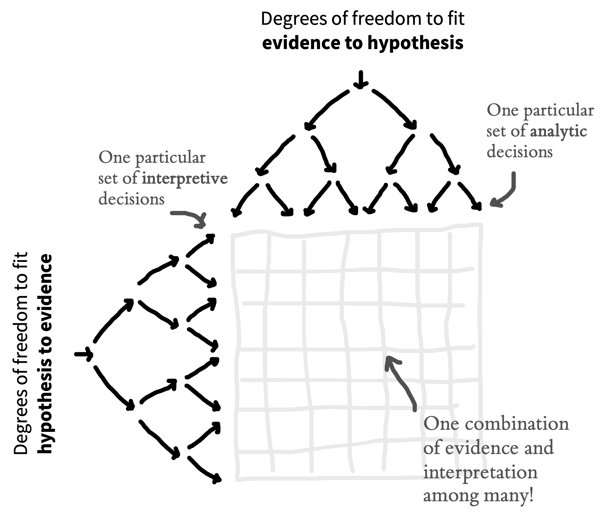

# (PART) Execution {-}

# Preregistration {#prereg}

::: {.box .learning_goals}
- Recognize the dangers of researcher degrees of freedom 
- Understand the differences between exploratory and confirmatory modes of research
- Articulate how preregistration can reduce risk of bias and increase transparency
:::

> When not planned beforehand, data analysis can approximate a projective technique, such as the Rorschach, because the investigator can project on the data his own expectancies, desires, or biases and can pull out of the data almost any "finding" he may desire.
>
> `r tufte::quote_footer('--- Theodore X. Barber [-@barber1976]')`

> The first principle is that you must not fool yourself--and you are the easiest person to fool... After you've not fooled yourself, it's easy not to fool other scientists. You just have to be honest in a conventional way after that. 
>
> `r tufte::quote_footer('--- Richard Feynman [-@feynman1974]')`

Although there are plenty of *incorrect* ways to design and analyse experiments, there is no single *correct* way. In fact, most research decisions have many justifiable choices - sometimes called "researcher degrees of freedom". For example, will you stop data collection after 20, 200, or 2000 participants? Will you remove outlier values and how will you define them? Will you conduct subgroup analyses to see whether the results are affected by sex, or age, or some other factor? 

Consider a simplified, hypothetical case where you have to make five analysis decisions and there are five justifiable choices for each decision — this alone would result in 3125 ($5^5$) unique ways to analyze the data! If you were to make these decisions **post hoc** (after observing the data) then there's a danger your decisions will be influenced by the outcome of the analysis ("data-dependent decision making") and skew towards choices that generate outcomes more aligned with your personal preferences. Now think back to the last time you read a research paper. Of all the possible ways that the data could have been analyzed, how do you know that the researchers did not just select the approach that generated results most favourable to their pet hypothesis?

In this chapter, we will find out why flexibility in the design, analysis, reporting, and interpretation of experiments, combined with data-dependent decision-making, can introduce bias, and lead to scientists fooling themselves and fooling each other. We will also learn about how **preregistration** -- the process of writing down and registering your research decisions before you observe the data -- (and other tools) can be used to protect our research from bias and provide the transparency that other scientists need to properly evaluate and interpret our work [@hardwicke2022].

::: {.box .case_study}
(TITLE) Undisclosed analytic flexibility?

Educational apps for children are a huge market, but relatively few randomized trials have been done to see whether or when they produce educational gains. Filling this important gap, @berkowitz2015 reported a high-quality field experiment of a free educational app, "Bedtime Math at Home," with participants randomly assigned to either math or reading conditions over the course of a full school year. Critically, along with random assignment, the study also included standardized measures of math and reading achievement. These measures allowed the authors to compute effects in grade-level equivalents, a meaningful unit from a policy perspective. The key result reported in the paper is shown in Figure \@ref(fig:prereg-berkowitz). Families who used the math app frequently showed greater gains in math than the control group. 

```{r prereg-berkowitz, fig.cap = "Figure 1 of Berkowitz et al. (2015). Estimated years of math achievement gained over the school year across groups.", fig.margin=TRUE}
knitr::include_graphics("images/prereg/berkowitz-1.png")
```

Although this finding appeared striking, the figure didn't directly visualize the primary causal effect of interest, namely the size of the effect of study condition on math scores. Instead the data were presented as estimated effects for specific levels of app usage, for a matched subgroup of participants (panel A) and the entire group (panel B). 

```{r prereg-frank-berkowitz, fig.cap = "Estimated years of math achievement gained over the school year across groups in the Berkowitz et al. (2016) math app trial. Error bars show 95\\% confidence intervals. Figure reproduced from Frank (2016)." , fig.margin=TRUE}
knitr::include_graphics("images/prereg/ITT.png")
```
Because the authors made their data openly available, it was possible for @frank2016 to do a simple analysis to examine the causal effect of interest. When not splitting the data by usage and adjusting by covariates, there was no significant main effect of the intervention on math performance [Figure \@ref(fig:prereg-frank-berkowitz)]. Since this analysis was not favorable to the primary intervention -- and because it was not reported in the paper -- it could have been the case that the authors had analyzed the data several ways and chosen to present an analysis that was more favorable to their hypotheses of interest.^[The authors responded that their analyses were chosen *a priori* (before observing the data) and based on prior research; they argued that the disagreement about how the data should be analyzed was a question of different approaches [@berkowitz2016; for a longitudinal followup using a similar approach see @schaeffer2018].]

As is true for many papers prior to the rise of preregistration, it's not possible to know definitively whether the reported analysis in @berkowitz2015 was influenced by the authors' desired result. As we'll see below, such data-dependent analyses can lead to substantial bias in reported effects. This uncertainty about a paper's analytic strategy can be avoided by the use of preregistration. In this case, preregistration would have convinced readers that the analyses decisions were not influenced by the data, thereby increasing the value of this otherwise high-quality study.

:::

## Lost in a garden of forking paths

```{r forking-paths, fig.cap="The garden of forking paths: many justifiable but different analytic choices are possible for an individual dataset.", fig.margin=TRUE}
knitr::include_graphics("images/prereg/forking-paths.png")
```

One way to visualize researcher degrees of freedom is as a vast decision tree or "garden of forking paths" [@gelman2014; Figure \@ref(fig:forking-paths)]. Each node represents a decision point and each branch represents a justifiable choice. Each unique pathway through the garden terminates in an individual research outcome. 

Because scientific observations typically consist of both noise (random variation unique to this sample) and signal (regularities that will reoccur in other samples), some of these pathways will inevitably lead to results that are misleading (e.g., inflated effect sizes, exaggerated evidence, or false positives).^[The signal-to-noise ratio is worse in particular situations (alas, common in psychology) that involve small effect sizes, high variation, and large measurement errors [@ioannidis2005]. Researcher degrees of freedom may be constrained to some extent by strong theory [@oberauer2019], community methodological norms and standards, or replication studies, though these constraints may be more implicit than explicit, and can still leave plenty of room for flexible decision-making.] The more potential paths there are in the garden that you might explore, the higher the chance of encountering misleading results.

Statisticians refer to this issue as a **multiplicity** (multiple comparisons) problem. As we talked about in Chapter \@ref(inference), multiplicity can be addressed to some extent with statistical countermeasures, like the Bonferroni correction; however, these adjustment methods need to account for every path that you *could have* taken [@gelman2014; @degroot2014]. When you navigate the garden of forking paths while working with the data, it is easy to forget -- or even be unaware of -- every path that you could have taken, so these methods can no longer be used effectively. 

### Data-dependent analysis

When a researcher navigates the garden of forking paths during data analysis, their choices might be influenced by the data (**data-dependent** decision making) which can introduce bias. If a researcher is seeking a particular kind of result (which is likely -- see the Depth box below), then they are more likely to follow the branches that steer them in that direction. 

You could think of this a bit like playing a game of "hot (🔥) or cold (☃️)" where 🔥 indicates that the choice will move the researcher closer to a desirable overall result and ☃️ indicates that the choice will move them further away. Each time the researcher reaches a decision point, they try one of the branches and get feedback on how that choice affects the results. If the feedback is 🔥 then they take that branch. If the answer is ☃️, they try a different branch. If they reach the end of a complete pathway, and the result is ☃️, maybe they even retrace their steps and try some different branches earlier in the pathway. This strategy creates a risk of bias because it systematically skews results towards researcher's preferences [@hardwicke2022].^[We say "risk of bias" rather than just "bias" because in most scientific contexts, we do not have a known ground truth to compare the results to. So in any specific situation, we do not know the extent to which data-dependent decisions have actually biased the results.]

::: {.box .depth}
(TITLE) Only human: Cognitive biases and skewed incentives

There's a storybook image of the scientist as an objective, rational, and dispassionate arbiter of truth [@veldkamp2017]. But in reality, scientists are only human: they have egos, career ambitions, and rent to pay! So even if we do want to live up to the storybook image, its important to acknowledge that our decisions and behavior are also influenced by a range of cognitive biases and external incentives that can steer us away from that goal. Let's first look at some relevant cognitive biases that might lead scientists astray:

- **Confirmation bias**: Preferentially seeking out, recalling, or evaluating information in a manner that reinforces one's existing beliefs [@nickerson1998].

- **Hindsight bias**: Believing that past events were always more likely to occur relative to our actual belief in their likelihood before they happened ("I knew it all along!") [@slovic1977].

- **Motivated reasoning**: Rationalizing prior decisions so they are framed in a favorable light, even if they were irrational [@kunda1990].

```{r apophenia, fig.cap="Examples of apophenia: Mars Face, Winnie the Pooh Cloud, and Jesus Toast.", fig.margin=TRUE}
knitr::include_graphics("images/prereg/apophenia.png")
```

- **Apophenia**: Detecting seemingly meaningful patterns in noise (Figure \@ref(fig:apophenia)) [@gilovich1985].

```{r chrysalis, fig.cap="The Chrysalis Effect, when ugly truth becomes a beautiful fiction.", fig.margin=TRUE}
# Placeholder image - replace with illustration?
knitr::include_graphics("images/prereg/chrysalis.png")
```

To make matters worse, the incentive structure of the scientific ecosystem often adds additional motivation to get things wrong. The allocation of funding, awards, and publication prestige is often based on the nature of research results rather than research quality [@smaldino2016; @nosek2012]. For example, many academic journals, especially those that are widely considered to be the most prestigious, appear to have a preference for novel, positive, and statistically significant results over incremental, negative, or null results [@bakker2012]. There is also pressure to write articles with concise, coherent, and compelling narratives [@giner-sorolla2012]. This set of forces incentivizes scientists to be "impressive" over being right and encourages questionable research practices. The process of iteratively p-hacking and HARKing one's way to a "beautiful" scientific paper has been dubbed "The Chrysalis Effect" [@oboyle2017; Figure \@ref(fig:chrysalis)].

In sum, scientists' human flaws -- and the scientific ecosystem's flawed incentives -- highlight the need for transparency and intellectual humility when reporting the findings of our research [@hoekstra2020]. 
:::

```{r salmon, fig.cap="By deliberately exploiting analytic flexibility in the processing pipeline of fMRI data, Bennet et al. (2009) were able to identify 'brain activity' in a dead Atlantic Salmon.", fig.margin=TRUE}
knitr::include_graphics("images/prereg/salmon.jpeg")
```

In the most egregious cases, a researcher may try multiple pathways until they obtain a desirable result and then **selectively report** that result, neglecting to mention that they have tried several other analysis strategies.^["If you torture the data long enough, it will confess" [@good1972].] This is sometimes referred to as 'p-hacking', because a common goal is to get p-values to be statistically significant. You may remember an example of this practice in Chapter \@ref(replication), where participants apparently became younger when they listened to "When I'm 64" by The Beatles. Another example of how damaging the garden of forking paths can be comes from the "discovery" of brain activity in a dead Atlantic Salmon! Researchers deliberately exploited flexibility in the fMRI analysis pipeline and avoided multiple comparisons corrections, allowing them to find brain activity where there was only dead fish [Figure \@ref(fig:salmon); @bennett2009]. 

### Hypothesizing after results are known

In addition to degrees of freedom in experimental design and analysis, there is additional flexibility in how researchers *interpret* research results. As we discussed in Chapter \@ref(theories), theories can accommodate even conflicting results in many different ways -- for example, by positing auxiliary hypotheses that explain why a particular datapoint is special. 

The practice of selecting or developing your hypothesis after observing the data has been called "Hypothesizing After the Results are Known", or "HARKing" [@kerr1998]. HARKing is potentially problematic because it expands the garden of forking paths and helps to justify the use of various additional design and analysis decisions (Figure \@ref(fig:grid)). For example, you may come up with an explanation for why an intervention is effective in men but not in women in order to justify a post-hoc subgroup analysis based on sex (see Case Study). The extent to which HARKing is problematic is contested [for discussion see @hardwicke2022]. But at the very least it's important to be honest about whether hypotheses were developed before or after observing the data.

```{r grid, fig.cap="A grid of individual research results. The horizontal axis provides a simplified illustration of the many justifiable design and analysis choices that the scientist can use to generate the evidence. The vertical axis illustrates that there are often several potential hypotheses derived from those theories, which could be constructed or selected when interpreting the evidence. An unconstrained scientist can simultaneously fit evidence to hypotheses and fit hypotheses to evidence in order to obtain their preferred overall result.", fig.margin=FALSE}

```

But hang on a minute! Isn't it a good thing to seek out interesting results if they are there in the data? Shouldn't we "let the data speak"? The answer is yes! But it's crucial to understand the distinction between **exploratory** and **confirmatory** modes of research.^[In practice, an individual study may contain both exploratory and confirmatory aspects which is why we describe them as different "modes."] Confirmation involves making research decisions *before* you've seen the data whereas exploration involves making research decisions *after* you've seen data.

The key things to remember about exploratory research are that you need to (1) be aware of the increased risk of bias arising from data-dependent decision making and calibrate your confidence in the results accordingly; (2) be honest with other researchers about your analysis strategy so they are also aware of the risk of bias and can calibrate *their* confidence in the outcomes accordingly. In the next section, we will learn about how preregistration helps us to make this important distinction between exploratory and confirmation research.

## Reducing risk of bias, increasing transparency, and calibrating confidence with preregistration

You can counter the problem of researcher degrees of freedom and data-dependent decision-making by making research decisions before you have seen the data -- like planning your route through the garden of forking paths before you start your journey [@wagenmakers2012; @hardwicke2022]. If you stick to the planned route, then you have eliminated the possibility that your decisions were influenced by the data.

**Preregistration** is the process of declaring your research decisions in a public registry before you analyze (and often before you collect) the data. Preregistration ensures that your decisions are data-independent, which reduces risk of bias arising from the issues described above. Preregistration also transparently conveys to others what you planned, helping them to determine the risk of bias and calibrate their confidence in the research results. In other words, preregistration provides the context needed to properly evaluate and interpret research, dissuading researchers from engaging in questionable research practices like p-hacking and HARKing, because they can be held accountable to their original plan.

Preregistration does not require that you specify all research decisions in advance, only that you are transparent about what was planned, and what was not planned. This transparency helps to make a distinction between which aspects of the research were exploratory and which were confirmatory (Figure \@ref(fig:continuum)). All else being equal, we should have more confidence in confirmatory results, because there is a lower risk of bias. Exploratory results have a higher risk of bias, but they are also more **sensitive** to serendipitous (unexpected) discoveries. So the confirmatory mode is best suited to testing hypotheses and the exploratory mode is best suited to generating them. Therefore, exploratory and confirmatory research are both valuable activities -- it is just important to differentiate them [@tukey1980]! Preregistration offers the best of both worlds by clearly separating one from the other.

```{r continuum, fig.cap="Preregistration clarifies where research activities fall on the continuum of prespecification. When the preregistration provides little constraint over researcher degrees of freedom (i.e., more exploratory research), decisions are more likely to be data-dependent, and consequently there is a higher risk of bias. When preregistration provides strong constraint over researcher degrees of freedom (i.e., more confirmatory research), decisions are less likely to be data-dependent, and consequently there is a lower risk of bias. Exploratory research activities are more sensitive to serendipitous discovery, but also have a higher risk of bias relative to confirmatory research activities. Preregistration transparently communicates where particular results are located along the continuum, helping readers to appropriately calibrate their confidence. ", fig.margin=F}
knitr::include_graphics("images/prereg/continuum.png")
```

In addition to the benefits described above, preregistration may improve the quality of research by encouraging closer attention to study planning. We've found that the process of writing a preregistration really helps facilitate communication between collaborators, and can catch addressable problems before time and resources are wasted on a poorly designed study. Detailed advanced planning can also create opportunities for useful community feedback, particularly in the context of Registered Reports (see Depth box below), where dedicated peer reviewers will evaluate your study before it has even begun.

::: {.box .depth}
(TITLE) Preregistration and friends: A toolbox to address researcher degrees of freedom

Several useful tools can be used to complement or extend preregistration. In general, we would recommend that these tool are combined with preregistration, rather than used as a replacement because preregistration provides transparency about the research and planning process [@hardwicke2022].

**Robustness checks**. Robustness checks (also called "sensitivity analyses") assess how different decision choices in the garden of forking paths affect the eventual pattern of results. This technique is particularly helpful when you have to choose between several justifiable analytic choices, neither of which seem superior to the other, or which have complementary strengths and weaknesses. For example, you might run the analysis three times using three different methods for handling missing data. Robust results should not vary substantially across the three different choices. 

**Multiverse analyses**. Recently, some researchers have started running large-scale robustness checks called "multiverse" [@steegen2016] or "specification curve" [@simonsohn2020] analyses. These techniques evaluate the factorial intersection of multiple choices for multiple decisions -- like simultaneously evaluating thousands of pathways in the garden of forking paths. Some have argued that these large-scale robustness checks make preregistration redundant; after all, why prespecify a single path if you can explore them all [@rubin2020; @oberauer2019]? But interpreting the results of a multiverse analysis are not straightforward; for example, it seems unlikely that all of the decision choices are equally justifiable [@giudice2021]. Furthermore, if multiverse analyses are not preregistered, then they introduce researcher degrees of freedom, and create an opportunity for selective reporting, which increases risk of bias.

**Held-out sample**. One option to benefit from both exploratory and confirmatory research modes is to split your data into **training** and **test** samples. (The test sample is commonly called the "held out" because it is "held out" from the exploratory process.) You can generate hypotheses in an exploratory mode in the training sample and use that as the basis to preregister confirmatory analyses in the hold-out sample. A notable disadvantage of this strategy is that splitting the data reduces statistical power, but in cases where data are plentiful -- including in much of machine learning -- this technique is the gold standard.

**Masked analysis** (traditionally called "blind analysis"). Sometimes problems, such as missing data, attrition, or randomization failure that you did not anticipate in your preregistered plan can arise during data collection. How do you diagnose and address these issues without increasing risk of bias through data-dependent analysis? One option is masked analysis, which disguises key aspects of the data related to the results (for example, by shuffling condition labels or adding noise) while still allowing some degree of data inspection [@dutilh2019]. After diagnosing a problem, you can adjust your preregistered plan without increasing risk of bias, because your decisions have not been influenced by the results.

**Standard Operating Procedures**. Community norms, perhaps at the level of your research field or lab, can act as a natural constraint on researcher degrees of freedom. For example, there may be a generally accepted approach for handling outliers in your community. You can make these constraints explicit by writing them down in a Standard Operating Procedures document - a bit like a living meta-preregistration [@lin2016]. Each time you preregister an individual study, you can co-register this document alongside it. Make sure you are clear about which document you will follow in the event of a mismatch!

**Open lab notebooks**. Maintaining a lab notebook can be a useful way to keep a record of your decisions as a research project unfolds. Preregistration is bit like taking a snapshot of your lab notebook at the start of the project, when all you have written down is your research plan. Making your lab notebook publicly available is a great way to transparently document your research and departures from the preregistered plan.

```{r reg-reports, fig.cap="Registered Reports (https://www.cos.io/initiatives/registered-reports)", fig.margin=TRUE}
knitr::include_graphics("images/prereg/registered-reports.png")
```

**Registered Reports**. Registered Reports are a type of article format that embeds preregistration directly into the publication pipeline [@chambers2020; Figure \@ref(fig:reg-reports)]. The idea is that you submit your preregistered protocol to a journal and it is peer reviewed, before you've even started your study. If the study is approved, the journal agrees to publish it, regardless of the results. This is a radical departure from traditional publication models where peer reviewers and journals evaluate your study *after* its been completed and the results are known. Because the study is accepted for publication independently of the results, Registered Reports can offer the benefits of preregistration with additional protection against publication bias. They also provide a great opportunity to obtain feedback on your study design while you can still change it!

:::

## How to preregister

High-stakes studies such as medical trials must be preregistered  [@dickersin2012]. In 2005, a large international consortium of medical journals decided that they would not publish unregistered trials. The discipline of economics also has strong norms about study registration (see e.g. [https://www.socialscienceregistry.org]()). But preregistration is actually pretty new to psychology [@nosek2018], and there's still no standard way of doing it -- you're already at the cutting edge!

We recommend using the Open Science Framework (OSF) as your registry. OSF is one of the most popular registries in psychology and you can do lots of other useful things on the platform to make your research transparent, like sharing data, materials, analysis scripts, and preprints. On the OSF it is possible to "register" any file you have uploaded. When you register a file, it creates a time-stamped, read-only copy, with a dedicated link. You can add this link to articles reporting your research. 

One approach to preregistration is to write a protocol document that specifies the study rationale, aims or hypotheses, methods, and analysis plan, and register that document.^[You can think of a study protocol a bit like a research paper without a results and discussion section (here's an example from one of our own studies: https://osf.io/2cnkq/).] The OSF also has a collection of dedicated preregistration templates that you can use if you prefer. These templates are often tailored to the needs of particular types of research. For example, there are templates for general quantitative psychology research ["PRP-QUANT" @bosnjak2021], cognitive modelling [@cruwell2021], and secondary data analysis [@akker2019]. The OSF interface may change, but currently [this guide](https://help.osf.io/hc/en-us/articles/360019738834-Create-a-Preregistration) provides a set of steps to create a preregistration.

Once you've preregistered your plan, you just go off and run the study and report the results, right? Well hopefully... but things might not turn out to be that straightforward. It's quite common to forget to include something in your plan or to have to depart from the plan due to something unexpected. Preregistration can actually be pretty hard in practice [@nosek2019]! 

Don't worry though - remember that a key goal of preregistration is transparency to enable others to evaluate and interpret research results. If you decide to depart from your original plan and conduct data-dependent analyses, then this decision may increase the risk of bias. But if you communicate this decision transparently to your readers, they can appropriately calibrate their confidence in the results. You may even be able to run both the planned and unplanned analyses as a robustness check (see Depth box) to evaluate the extent to which this particular choice impacts the results.

When you report your study, it is important to distinguish between what was planned and what was not. If you ran a lot of data-dependent analyses, then it might be worth having separate exploratory and confirmatory results sections. On the other hand, if you mainly stuck to your original plan, with only minor departures, then you could include a table (perhaps in an appendix) that outlines these changes (for example, see Supplementary Information A of [this article](https://doi.org/10.31222/osf.io/wt5ny)).

## Chapter summary: Preregistration

We've advocated here for preregistering your study plan. This practice helps to reduce the risk of bias caused by data-dependent analysis (the "garden of forking paths" that we described) and transparently communicate the risk of bias to other scientists. Importantly, preregistration is a "[plan, not a prison](https://www.cos.io/blog/preregistration-plan-not-prison)": in most cases preregistered, confirmatory analyses coexist with exploratory analyses. Both are an important part of good research -- the key is to disclose which is which!

::: {.box .discussion_questions}
1. P-hack your way to scientific glory! To get a feel for how data-dependent analyses might work in practice, have a play around with this app: https://projects.fivethirtyeight.com/p-hacking/ Do you think preregistration would affect your confidence in claims made about this dataset?

2. Preregister your next experiment! The best way to get started with preregistration is to have a go with your next study. Head over to https://osf.io/registries/osf/new and register your study protocol or complete one of the templates. What aspects of preregistration did you find most difficult and what benefits did it bring?
:::

::: {.box .readings}
* Nosek, B. A., Ebersole, C. R., DeHaven, A. C., & Mellor, D. T. (2018). The preregistration revolution. *Proceedings of the National Academy of Sciences*, *115*, 2600–2606. [https://doi.org/10.1073/pnas.1708274114]()

* Hardwicke, T. E., & Wagenmakers, E.-J. (2022). Reducing bias, increasing transparency, and calibrating confidence with preregistration. *Nature Human Behaviour*. [https://doi.org/10.31222/osf.io/d7bcu]()
:::
