
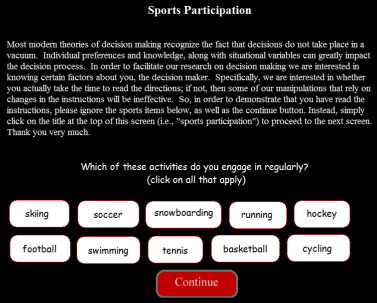

# Data collection {#collection}

::: {.box .learning_goals}
* Outline the key features of informed consent and participant debriefing 
* Identify the additional protections necessary for working with vulnerable populations
* Review best practices for online and in person data collection
* Implement data integrity checks, manipulation checks, and pilot testing
:::

You have selected your measure and manipulation and planned your sample. Your preregistration is set. Now it's time to think about the nuts and bolts of collecting data. While the details of data collection may vary from context to context and sample to sample, this chapter will highlight some general best practices for the data collection process. We organize these practices around two perspectives: the participant and the researcher.

The first section takes the perspective of a participant. We begin by reviewing the importance of informed consent. Consent is a key part of running experiments that respect the autonomy of their participants. When we neglect the impact of our research on the populations we study, we not only violate regulations governing research, but we also establish a pattern of imbalance and distrust that hinders our efforts. In the second section, we begin to shift perspectives, discussing the choice of online vs. in-person data collection and how to optimize the experimental experience for participants in both in-person and online experiments. We then end by taking the experimenter's perspective more fully, asking how we can collect high quality data. We review some best practices in pilot testing, discussing how to structure pilots to get maximal information from participants. We end by reviewing best practices regarding the inclusion of manipulation and attention checks. 

::: {.box .case_study}
(TITLE) The rise of online data collection

Since the rise of experimental psychology laboratories in university settings during the period after World War 2 [@benjamin2000], experiments have typically been conducted by recruiting participants from what has been referred to as the "subject pool." This term denotes a group of people who can be recruited for experiments, typically students from introductory psychology courses [@sieber1989] recruited via the requirement that students complete a certain quantity of experiments as part of their course work.^[At various times, students have raised ethical concerns about these requirements as being coercive of participation in precisely the way that should be off limits for psychology experiments (see Chapter \@ref(ethics)). As a result, most programs now provide some more or less onerous alternative to participation.] The ready availability of this convenience population led inevitably to the massive over-representation of US undergraduates in published psychology research, in turn leading to persistent critiques of this practice as undermining the generalizability psychological research [@sears1986;@henrich2010].

Yet in the period 2005--2015, there has been a revolution in data collection from convenience populations. Instead of focusing on university undergraduates, increasingly, researchers use convenience samples of online workers recruited from crowdsourcing sites like Amazon Mechanical Turk (AMT) and Prolific Academic. Crowdsourcing services were originally designed to distribute micro-payments to workers for business purposes like retyping receipts, but they have become marketplaces to connect researchers with research participants who are willing to complete surveys and experimental tasks for small payments [@litman2017]. As of 2015, more than a third of studies in top social and personality psychology journals were conducted on crowdsourcing platforms (another third were still conducted with college undergraduates) and this proportion is likely continuing to grow [@anderson2019].

Initially, many researchers worried that crowdsourced data from online convenience samples would lead to a decrease in data quality. Yet in study after study, data quality was comparable to in-lab convenience samples [@mason2012;@buhrmester2016]. In one particularly compelling demonstration, a set of browser-based experiments were used to replicate a group of classic phenomena in cognitive psychology, with compelling successes on every experiment except those requiring sub-50 millisecond stimulus presentation [@crump2013]. Further, as we discuss below, researchers have learned to pay greater attention to how to ensure that online participants understand and comply with the instructions in complex experimental tasks.

Since these initial successes, however, attention has moved away from the validity of online experiments to the ethical challenges of engaging with crowdworkers. In 2020, nearly 130,000 people completed MTurk studies [@moss2020]. Of those, 70% identified as White, 56% identified as women, and 48% had an annual household income below $50,000. A sampling of crowd work determined that the average wage earned was just \$2.00 per hour, and less than 5% of workers were paid at least the federal minimum wage [@hara2018]. Further, many experimenters routinely withheld payment from workers based on their performance in experiments. These practices clearly violate ethical guidelines for research with human participants, but are often overlooked by institutional review boards because participants are offered as a "service" rather than being paid directly, or because the platforms were unfamiliar to ethics reviewers. 

With greater attention to the conditions of workers [e.g., @salehi2015], best practices for online researcher have progressed considerably. As we describe below, working with online populations requires attention to both standard ethical issues of consent and compensation, as well as new issues around the "user experience" of participating in research. The availability of online convenience samples can be transformative for the pace of research -- running large studies in a single day rather than many months. But such populations are vulnerable in different ways than university convenience samples, and we must take care to ensure that research online is conducted ethically. 
:::


## Informed consent and debriefing

As we discussed in Chapter \@ref(ethics), experimenters must respect the autonomy of their participants. Respect for agency means that participants must be informed about the risks and benefits of participation before they agree to participate. It also means that researchers must discuss and contextualize the study afterwards through debriefing. We discuss each of these processes in turn, ending with some guidance on the special protections that are required to protect the autonomy of vulnerable populations.

### Getting consent

Before we run any experiment, participants must give consent. In the US regulatory framework, there are clear guidelines about what the process of giving consent looks like. They typically center around the **consent form**: a document that lays out the risks and benefits of the study and asks for participants' signature as a mark of their understanding and consent to participate. Ultimately, your drafted consent form will need to be reviewed by your IRB office, and they can advise you on whether you have adequately described all important information for participants to review. 

```{r collection-consent-requirements}
tribble(~` `, ~Requirements, 
        1, "A statement that the study involves research",
        2, "An explanation of the purposes of the research",
        3, "The expected duration of the subject's participation",
        4, "A description of the procedures to be followed",
        5, "Identification of any procedures which are experimental",
        6, "A description of any reasonably foreseeable risks or discomforts to the subject",
        7, "A description of any benefits to the subject or to others which may reasonably be expected from the research",
        8, "A disclosure of appropriate alternative procedures or courses of treatment, if any, that might be advantageous to the subject",
        9, "A statement describing the extent, if any, to which confidentiality of records identifying the subject will be maintained",
        10, "For research involving more than minimal risk, an explanation as to whether any compensation or medical treatments are available if injury occurs",
        11, "An explanation of whom to contact for answers to pertinent questions about the research and research subjects' rights",
        12, "A statement that participation is voluntary, refusal to participate will involve no penalty, and that subject may discontinue participation at any time without penalty") |>
  knitr::kable(caption = "US Office of Human Research Protections requirements for a consent form (edited for length).")
```

Consent forms have very specific elements that are required, including explanations of the research and its procedures, description of risks and benefits, and explanation that participation is voluntary. Table \@ref(tab:collection-consent-requirements) gives the full list of consent form requirements given by the US Office for Human Research Protections, and Figure \@ref(fig:collection-annotated-consent) shows how these individual requirements are reflected in a real consent form from some of our research. 


```{r collection-annotated-consent, fig.cap="Consent form annotated with how specific text fulfills the requirements in Table 12.1. Categories 5, 8, and 10 were not required for this minimal risk psychology experiment."}

```


Given how much must be stated in a consent form, some experimenters worry about demand characteristics (discussed in Chapter \@ref(design)). In some cases, understanding the precise goals of a study may change the result of the study. But the goal of a consent form is typically not to explain the motivation of the research design as much as the topic of the study and the procedures that a participant will undergo. When providing consent information, researchers should focus on what someone might think or feel as a result of participating in the study. Are there any physical or emotional risks associated? What should someone know about the study that may give them pause about agreeing to participate in the first place? Our advice is to center the *participant* in the consent process rather than the research question. Information about research goals can be provided during debriefing. 

### Prerequisites of consent

In order to give consent, participants must have the cognitive capacity to make decisions (competence), understand what they are being asked to do (comprehension), and know that they have the right to withdraw consent at any time (voluntariness) [@kadam2017]. 

Establishing competence is the first prerequisite of informed consent. Typically we assume competence for adult volunteers in our experiments, but in the case that we are working with children or other vulnerable populations (see below), we may need to consider whether they are legally competent to provide consent. Participants who cannot consent on their own should still be informed about participation in your experiment. If possible, obtain **assent**, or agreement to participate, when a person has no legal ability to consent, and respect their decision if they choose not to assent -- even if you previously obtained consent.

The second prerequisite is comprehension. It is a good practice to review consent forms verbally with participants, especially if the study is involved and takes place in person. The consent form itself must be readable for a broad audience, meaning care should be taken to use accessible language and clear formatting. Consider giving participants a copy of the consent form in advance so they can read at their own pace, think of any outstanding questions they might have, and decide how to proceed without any chance of coercion [@young1990]. 

Finally, participants must understand that their involvement is voluntary, meaning that they are under no obligation to be involved in a study: signing a consent form does not waive their right to withdraw at any time. Experimenters should not only state that participation is voluntary, they should also pay attention to other features of the study environment that might lead to  **structural coercion** [@fisher2013]. For example, high levels of compensation can make it difficult for lower-income participants to withdraw from research. Similarly, factors like race, gender, and social class can lead participants to feel discomfort around discontinuing a study. It is incumbent on experimenters to provide a comfortable study environment and to avoid such coercive factors wherever possible. 

### Debriefing participants

Once a study is completed, researchers should always debrief participants. A debriefing is composed of four parts: (1) participation gratitude, (2) discussion of goals, (3) explanation of deception, and (4) questions and clarification [@allen2017]. Together these serve to contextualize the experience for the participant and to mitigate any potential harms from the study.

1. **Gratitude.** Thank participants for their involvement in research study! Sometimes thanks is enough (for a short experiment), but many studies also include monetary compensation or course credit. Compensation should be commensurate with the amount of time and effort required for participation. Compensation structures vary widely from place to place; typically local IRBs will have guidelines that they ask researchers to comply with.

2. **Discussion of goals.** Researchers should briefly share the purpose of the research study with participants. Why were participants recruited for this study in the first place? What are the researchers hoping to learn by conducting this study? It is important to ensure that participants fully understand the goals of the study, so avoiding technical jargon or confusing language is critical. You might also consider sharing any preliminary findings or where to find the completed write-up at the study's conclusion -- many engaged participants appreciate learning about research findings, even months or years after participation.^[Sharing goals is especially important when some aspect of the study appears evaluative -- participants will often be interested in knowing how well they preformed against their peers. For example, a parent whose child completed a word-recognition task may request information about their child's performance. It is often important to highlight that the goals of the study are not about individual evaluation and ranking.] 

3. **Explanation of deception.** Researchers must reveal any deception during debriefing, regardless of how minor the deception seems to the researcher. This component of the debriefing process can be thought of as "dehoaxing" because it is meant to illuminate any aspects of the study that were previously misleading or inaccurate [@holmes1976]. The goal is both to reveal the true intent of the study and to alleviate any potential anxiety associated with the deception. Experimenters should make clear both where in the study the deception occurred and why the deception was necessary for the study's success. 

4. **Questions and clarification.** Finally, researchers should answer any questions or address any concerns raised by participants. Many researchers use this opportunity to first ask participants about their interpretation of the study, what they thought were the study goals. This practice not only illuminates aspects of the study design that may have been unclear to or hidden from participants, it also begins a discussion where both researchers and participants can communicate about this joint experience. This step is also helpful in identifying negative emotions or feelings resulting from the study [@allen2017]. When participants do express negative emotions, researchers are responsible for sharing resources participants can use to work though the discomfort. 

### Special considerations for vulnerable populations

Regardless of who is participating in research, investigators have an obligation to protect the rights and well-being of all participants. However, some populations are considered especially **vulnerable** because of their decreased agency -- either in general or in the face of potentially coercive situations. Research with these populations receives additional oversight. In this section, we will consider several vulnerable populations.

**Children.** Children are some of the most commonly used vulnerable populations in research because the study of development can contribute both to children's welfare and to our understanding of the human mind. In the US, children under the age of 18 may only participate in research with written consent from a parent or guardian. Unless they are pre-verbal, children should additionally be asked for their assent. The risks associated with a research study focusing on children also must be no greater than minimal unless participants may receive some direct benefit from participating or participating in the study may improve a disorder or condition of which the participant was formally diagnosed. 

**People with disabilities.** There are thousands of disabilities that affect cognition, development, motor ability, communication, and decision-making with varying degrees of interference, so it is first important to remember that considerations for this population will be just as diverse as its members. Roughly 8% of the US population is disabled, which makes it likely that, in the context of a research study, researchers may come into contact with someone who is disabled. No laws  preclude people with disabilities from participating in research. However, those with cognitive disabilities who are unable to make their own decisions  may only participant with written consent from a legal guardian and with their individual assent (if applicable). Those retaining full cognitive capacity but who have other disabilities that make it challenging to participate normally in the research study should receive appropriate accommodations to access the material, including the study's risks and benefits. 

**Incarcerated populations.** Nearly 2.1 million people are incarcerated in the United States alone [@gramlich2021]. Due to early (and repugnant) use of prisoners as a convenience population that could not provide consent, the use of prisoners in research has been a key focus of protective efforts. The US Office for Human Research Protections (OHRP) supports their involvement under very limited circumstances -- typically when the research specifically focuses on issues relevant to incarcerated populations [@ohrp2003]. When researchers propose to study incarcerated individuals, the IRB must reconfigure their board to include at least one active prisoner (or someone who can speak from a prisoner's perspective) and ensure that less than half of the board has any affiliation to the prison system, public or private.  Importantly, researchers must not suggest or promise that participation will have any bearing on prison sentences or parole eligibility, and compensation must be otherwise commensurate with their contribution. A question you might ask when determining whether a study involving incarcerated individuals is appropriate is, "Would a reasonable adult participate if they were not imprisoned?"

**Low-income populations.** Low-income populations are exceptional cases because any one person can easily fall under this category in addition to another. Participants with fewer resources may be more persuaded to participate by monetary incentives, creating a potentially coercive situation. Researchers should consult with their IRB to conform to local standards for non-coercive payment. 

**Crowdworkers.** As discussed above, crowdsourcing services like Amazon Mechanical Turk have become increasingly prominent as a population in psychology research. IRBs do not consider crowdworkers as a specific vulnerable population, but many of the same concerns about diminished autonomy and greater need for protection can arise. Without platform or IRB standards, it is up to individual experimenters to commit to fair pay, which should likely be at a bare minimum the applicable minimum wage (e.g., the US federal minimum wage). Further, in the context of reputation management systems like those of Amazon Mechanical Turk, participants can be penalized for withdrawing from an experiment -- once they have their work "rejected" by an experimenter, it can be harder for them to find new jobs, causing serious long-term harm to their ability to earn on the platform. 

## Designing the "research experience"

Standard ethical frameworks govern certain aspects of human experiments, including the consent process and the approval of risks and benefits for studies. These protections were initially conceptualized for biomedical research in which participation in an experiment carries a significant time commitment as well as substantial risks. In contrast, most lab-based psychology experiments are shorter and less risky, often involving filling out questionnaires, interacting with an experimenter or peer, or giving speeded responses on a computer. And the kinds of experiments that are run in the thousands on crowdsourcing platforms have very different profiles still. They are typically short, carry small amounts of compensation, and carry very limited quantifiable risks. 

For the majority of psychology experiments, the biggest factor that governs whether a participant has a positive or negative experience of an experiment is not its risk profile, since this is minimal.^[There are of course exceptions, including research with more sensitive content. Even in these cases, however, attention to the participant's experience can be important for ensuring good scientific outcomes.] Instead, it is the participants' experience. Did they feel welcome? Did they understand the instructions? Did the software work as designed? Was their compensation clearly described and promptly delivered? These aspects of "user experience" are critical both for ensuring that participants have a good experience in the study (an ethical imperative) and for gathering good data. An experiment that leaves participants unhappy typically doesn't satisfy either the ethical or the scientific goals of research. 

### Ensuring good experiences for in-lab participants

A participant's experience for an in-lab study begins with their recruitment and continues with their transit to the site of the research. It is perhaps obvious but worth stating that each of these experiences contribute to the success of your experiment. If you have participants with incorrect expectations about the topic or compensation for research, or if communication and scheduling is frustrating, then you can expect their attitude towards the study will start out negative. Similarly, if the experience of finding the study location or parking nearby is difficult, their interaction with the experiment may be affected by these challenges.^[For some reason, the Stanford psychology is notoriously difficult to navigate. This seemingly minor issue has resulted in a substantial number of late, frustrated, and flustered participants over the years.] Anything you can do to make these experiences smoother and more predicable -- prompt communication, well-tested directions, reserved parking slots, etc. -- will increase the quality of your data. 

Once a participant enters the lab, every aspect of the interaction with the experimenter can have an effect on their measured behavior. A vast literature also suggests that various aspects of social interaction facilitate compliance -- both in an experimental interaction and beyond [@gass2018]! Creating an environment that facilitates compliance with the experimental procedure -- whether through the simple expedient of making eye-contact with the participant or through the broader range of persuasive strategies [@cialdini2004] -- should lead to a better result as long as it is deployed equally across conditions. 

Standardization is the key concern balancing a warmer and more interactive experience for in-lab experiments. As much as possible, any interaction with participants should be scripted and standardized. Doing otherwise may result in differential treatment for participants with different characteristics, which could in turn result in greater variability in outcomes or even sociodemographic biases reflected in data. Even more importantly, such interactions should be undertaken with condition masked to the experimenter. Otherwise, as we reviewed in Chapter \@ref(design), it is extremely easy for these interactions to result in substantial experimenter expectancy effects! Even if the experimenter must know condition assignment for a participant -- as is sometimes the case -- this information should be revealed at the last possible moment to avoid contamination of other aspects of the experimental session.^[In some experiments, an experimenter delivers a manipulation and hence it cannot be masked from them. In such cases, it's common to have two experimenters such that one delivers the manipulation and another (masked to condition) collect the measurement. This situation often comes up with studies of infancy, since stimuli are often delivered via an in-person puppet show; at a minimum, behavior should be coded by someone other than the puppeteer.]

### Ensuring good experiences for online participants

The design challenges for online experiments are very different than for in-lab experiments. Experimenter expectancy and variability are almost completely eliminated, removing concerns about bias. On the other hand, many Turkers multi-task and do tens of HITs for many hours a day. It can be much harder to induce a particular state of interest when your manipulation is one of dozens the participant has experienced that day and where your interactions with them are mediated by a browser window. When creating an online experimental experience, we consider four issues: (1) design, (2) communication, (3) payment policies, and (4) effective consent and debriefing.^[For extensive further guidance on this topic, see @litman2020.]

**Design for online experiments**. If your web experiment is unpleasant to interact with, participants will likely become confused and frustrated. They will either drop out or provide data that are lower quality. Good experiment design online is a subset of good web and interaction design more generally. A good interface should be clean and well-tested and should offer clear affordances for interaction. As a simple example, if a participant presses a key at an appropriate time, the experiment should offer a response -- otherwise the participant will likely press it again. If the participant is uncertain how many trials are left, they may be more likely to drop out of the experiment. And if they are performing a speeded paradigm, they should receive practice trials to ensure that they understand the controls of the experiment and the instructions prior to beginning the critical blocks of trials. 

**Communication**. Many online studies run through platforms like Mechanical Turk involve almost no contact with participants. When participants do communicate it is very important to be responsive and polite, since -- unlike the typical undergraduate participant -- the work that a crowdworker is doing for your study may be part of how they earn their livelihood. A small issue in the study for you may feel very important for them. For that reason, rapid resolution of issues with studies -- typically through appropriate compensation -- is very important. Increasingly, crowdworkers track the reputation of specific labs and experimenters [@irani2013]. A quick and generous response to an issue will ensure that future crowdworkers do not avoid your studies. 

**Payment policies**. Many crowdworkers doing online experiments use their payments as part of their primary income stream. As a result, unclear or punitive payment policies can have a major impact. We strongly recommend always paying workers if they complete your experiment, regardless of result. This policy is comparable to standard payment policies for in-lab work. We assume good faith in our participants: if someone comes to the lab, they are paid for the experiment, even if it turns out that they did not perform correctly. The major counterargument to this policy is that some online marketplaces have a population of workers who are looking to cheat by being non-compliant with the experiment (e.g., entering gibberish or even using scripts to progress quickly through studies). Our recommendation is to address this issue through instruction, attention, and manipulation checks (as discussed below) such that the easiest way for a participant to complete your experiment is to comply with your instructions. 

```{r collection-online-consent}
knitr::kable(tibble(` ` ="By answering the following questions, you are participating in a study being performed by cognitive scientists in the Stanford Department of Psychology. If you have questions about this research, please contact us at stanfordpsych251@gmail.com. You must be at least 18 years old to participate. Your participation in this research is voluntary. You may decline to answer any or all of the following questions. You may decline further participation, at any time, without adverse consequences. Your anonymity is assured; the researchers who have requested your participation will not receive any personal information about you."), caption = "Sample online consent statement from our course.")
```

**Consent and debriefing**. Finally, because online studies are typically fully automated, participants do not have a chance to interact with researchers around consent and debriefing. Further, engagement with long consent forms may be minimal. In our work we have typically relied on short consent statements like the one from our class, shown in  Table \@ref(tab:collection-online-consent). Similarly, debriefing often occurs through a set of pages that summarize all four components of the debriefing process (participation gratitude, discussion of goals, explanation of deception, and questions and clarification). 

### When to collect data online?

Online data collection is increasingly ubiquitous in the behavioral sciences. Further, the web browser –- alongside survey software like Qualtrics or packages like jsPsych [@de-leeuw2015] –- can be a major aid to transparency in sharing experimental materials. Replication and reuse of experimental materials is vastly simpler if readers and reviewers can click on a link and share the same experience as a participant in your experiment. Furthermore, as we discussed in the Case Study above, a whole host of studies support the validity of data from well-designed online studies [@buhrmester2016;@mason2012;@crump2013].

Still, online data collection is not right for every experiment. Some studies may not be ethically appropriate for being run online: Studies that have substantial deception or that induce negative emotions may require an experimenter present to alleviate concerns and address points of deception rather than relying on a written statement. Beyond this sort of ethical issues, we discuss four broader concerns for online data collection: (1) population availability, (2) the availability of particular measures, (3) the feasibility of particular manipulations, and (4) the length of experiments. 

**Population**. The first key question to answer is whether the population of interest for an experiment is even available online. Initially, convenience samples from Amazon Mechanical Turk were the only group that was easily available. The demographics of this group are more diverse than some might expect [@moss2020]. More recently, new tools have emerged to allow demographic pre-screening of crowd participants, including using sites like Cloud Research and Prolific, which offer more granular participant screening mechanisms as well as greater participant reputation controls [@eyal2021;@peer2021].^[These tools still have significant weaknesses for accessing socio-demographically diverse populations within and outside the US, however -- screening tools can remove participants, but if the underlying population does not contain many participants from a particular demographic, it can be hard to gather large enough samples. For an example of using crowdsourcing and social media sites to gather diverse participants, see @demayo2021.] 

Increasingly, specialty recruitment platforms are growing to meet this challenge. Specialty survey research companies, such as Qualtrics Panels, can be used to recruit samples with specific demographic profiles for simple experiments. And it may initially have seemed implausible that children could be recruited online, but during the COVID-19 pandemic a substantial amount of developmental data collection moved online, with many studies yielding comparable results [e.g., @chuey2021]. Sites like [LookIt](http://lookit.mit.edu) now offer sophisticated platforms for hosting studies for children and families [@scott2017]. Finally, new, non-US crowdsourcing platforms continue to grow in popularity, leading to greater global diversity in the available online populations. 

Online participant recruitment tools continue to grow and change, and it is likely that in the near future, many populations will be accessible online. However, researchers recruiting participants online should keep in mind the fundamental fact that  the specific characteristics that lead a particular person to work part- or full-time on a crowdsourcing platform likely mean that they are not representative of the broader population. Unfortunately, similar caveats hold true for in-person convenience samples (see Chapter \@ref(sampling)). Ultimately, researchers must reason about what their generalization goal is and whether that is consistent with the samples they can access online. 

**Online measures**. Although online data collection was initially restricted to the use of survey measures -- including ratings and text responses -- measurement options have rapidly expanded. The widespread use of libraries like jsPsych [@de-leeuw2015] has meant that millisecond accuracy in capturing response times is now possible within web-browsers; thus, most reaction time tasks are quite feasible [@crump2013]. The capture of sound and video is possible with modern browser frameworks [@scott2017]. Further, even measures like mouse- and eye-tracking are beginning to become available [@maldonado2019;@slim2021]. In general, almost any measure that can be measured in the lab without specialized apparatus can also be collected online. On the other hand, studies that measure a broader range of physiological variables (e.g., heart rate or skin conductance) or a larger range of physical behaviors (e.g., walking speed or pose) are still likely difficult to implement online. 

**Online manipulations**. A third question is whether particular manipulations can be deployed online. Here, greater caution is called for. Manipulations available online are any interaction that can be created within a browser window -- but this restriction excludes many different manipulations that involve real-time social interactions with a human being.^[So called "moderated" experiments -- in which the experimental session is administered through a synchronous video chat have been used widely in online experiments for children but these designs are less common in experiments with adults because they are expensive and time-consuming to administer [@chuey2021].] Synchronous chat sessions can be a useful substitute [@hawkins2020], but these focus the experiment on the content of what is said and exclude the broader set of non-verbal cues available to participants in a live interaction (e.g., gaze, race, appearance, accent, etc.). Creative experimenters can circumvent these limitations by using pictures, videos, and other methods. But more broadly, an experimenter interested in implementing a particular manipulation online should ask how compelling the online implementation is compared with an in-lab implementation. If the intention is to induce some psychological state -- say stress, fear, or disgust -- experimenters must trade off the greater ease of recruitment and larger scale of online studies with the far more compelling experience they can offer in a controlled lab context. 

**The length of online studies**. One last concern is about attention and focus in online studies. Early guidance around online studies tended to focus on making studies short and easy, with the rationale that crowdsourcing workers were used to short jobs. Our sense is that this guidance no longer holds. Increasingly, researchers are deploying long and complex batteries of tasks to relatively good effect [e.g., @enkavi2019] and conducting repeated longitudinal sampling protocols [discussed in depth on @litman2020]. Rather than relying on hard and fast rules about study length, a better approach for online testing is to ensure that participants' experience is as smooth and compelling as possible. Under these conditions, if an experiment is viable in the lab, it is likely viable online. 

## Ensuring high quality data

In the final section of this chapter, we review some key practices surrounding data collection that can help to collect high quality datasets while respecting our ethical obligations to participants. By "high quality," here we especially mean datasets that are uncontaminated by a variety of experimental artifacts due to factors like misunderstanding of instructions, fatigue, incomprehension, or intentional neglect of the experimental task. 

We'll begin by discussing the issue of **pilot testing**; we recommend a systematic procedure for piloting that can maximize the chance of collecting high quality data. next, we'll discuss the practice of checking participants' comprehension and attention and what such checks should and shouldn't be used for. 


### Keep consistent data collection records

As an experimentalist, one of the worst feelings is to come back to your data directory and see a group of data files, `run1.csv`, `run2.csv`, `run3.csv` and not to know for each what experimental protocol was run for each. Was `run1` the pilot? Maybe a little bit of personal archaeology with timestamps and version history can tell you (more on this in Chapter \@ref(management)). But there is no guarantee.

```{r collection-runsheet, fig.margin=TRUE, fig.cap="Part of a run sheet for a developmental study."}
knitr::include_graphics("images/collection/runsheet.png")
```


```{r collection-log, fig.margin=TRUE, fig.cap="Excerpt of a log for an iterative run of online experiments."}
knitr::include_graphics("images/collection/log.png")
```

When you collect data, of course you have to collect the actual data -- in whatever form they take, whether it is paper surveys, videos, or files on a computer. But good data collection also requires records to be kept of the fact of the data being collected.  **Metadata** -- data about your data -- should include relevant features like the date of data collection, the sample that was collected, the experiment version, the research assistants who were present, etc. The details of what features precisely are relevant will vary substantially from study to study -- the important part is that you keep  Figures \@ref(fig:collection-runsheet) and \@ref(fig:collection-log) give two examples from our own research. The key feature is that they provide some persistent metadata about how the experiments were conducted. 


::: {.box .accident_report}
(TITLE) Does data quality vary throughout the semester? 

Every lab that collects empirical data repeatedly using the same population builds up lore about how that population varies. Many researchers who conducted experiments with college undergraduates were taught never to run their studies at the end of the semester. Exhausted and stressed students would likely yield low-quality data, or so the argument went. Until the rise of multi-lab collaborative projects like ManyLabs (see Chapter \@ref(replication)), such beliefs were almost impossible to test.

ManyLabs 3 aimed specifically to evaluate data quality variation across the academic calendar [@ebersole2016]. With 2,696 participants at 20 sites, the study conducted replications of 13 findings. Although only six of these showed strong evidence of replicating across sites, none of the six effects was substantially moderated by being collected later in the semester. The biggest effect they observed was a change in the Stroop effect from $d=.89$ during the beginning and middle of the semester to $d=.92$ at the end. There was some evidence that participants *reported* being less attentive at the end of the semester, but this trend wasn't accompanied by a moderation of experimental effects.

Researchers are subject to the same cognitive illusions and biases as any human. One of these biases is the search to find meaning in the random fluctuations they sometimes observe in their experiments. The intuitions formed through this process can be helpful prompts for generating hypotheses -- but beware of adopting them into your "standard operating procedures" without further examination. Labs that avoided data collection during the end of the semester might have sacrificed 10--20% of their data collection capacity for no reason!
:::

### Best practices for pilot studies

A **pilot study** is a small study conducted before you collect your main sample. Smooth and successful data collection is typically difficult without piloting, at least the first time you do an experiment of a given type. Fundamentally, experiments induce a particular experience in their participants, and careful attention to the nature of that experience^[Even if the experience is somewhat tedious, like searching for a T among Ls for hundreds of trials!] requires iterative development. 

Pilot studies cannot tell you about expected effect size (as we discussed in Chapter \@ref(sampling)). They also cannot tell you about the significance of your main result. What they *can* do is tell you about whether your paradigm works. They can reveal:

* if your code crashes under certain circumstances
* if your instructions confuse a substantial portion of your participants
* if you have a very high dropout rate
* if your data collection procedure fails to log variables of interest
* if participants are disgruntled by the end of the experiment

We recommend that all experimenters perform -- at the very minimum -- two pilot studies before they launch their experiment. 

The first pilot, your **non-naive pilot**, should be a test to ensure that your experiment is comprehensible, that participants can complete it, and that the data are logged appropriately. This last goal means that you must *analyze* the data from the non-naive pilot, at least to the point of checking that the relevant data about each trial is logged.^[At a minimum, for each trial you need to know a subject ID, a trial ID, the state of any manipulation (condition, trial type, etc.), and the value for the measure.] Your friends or parents can do this experiment, or in a pinch you can run yourself a bunch of times (though this isn't preferable because you're likely to miss a lot of aspects of the experience that you are habituated to, especially if you've been debugging the software).

The second pilot, your **naive pilot**, should consists of a test of a small set of participants recruited via the channel you plan to use for your main study. Pilot size will depend on the costliness of running the experiment (in time, money, and opportunity cost) as well as your worries about the paradigm. If we're talking about a short online survey experiment, then running a pilot of 10--20 people is reasonable. A more extensive laboratory study might be better served by piloting just two or three people. The goal of the naive pilot study is to understand properties of the participant experience: for example, were they confused? Did they withdraw before the study finished? You won't have the numbers to make robust statistical inferences about these questions, but even a small number of pilots can tell you that your dropout rate is likely too high: if 5 of 10 pilot participants withdraw you may need to reconsider aspects of your design. It's critical for this pilot that you debrief more extensively with your participants. This debriefing often takes the form of an interview questionnaire after the study is over ("what did you think the study was about?" and "is there any way we could improve the experience of being in the study?" can be helpful questions). 

Piloting -- especially piloting with naive participants to optimize the participant experience -- is typically an iterative process. We frequently launch an experiment for a naive pilot, then recognize from the data or from qualitative feedback that the experience can be improved. We make tweaks and pilot again. Be careful not to over-fit to small differences in pilot data, however -- the samples are small and so inferences will not be robust. The process of piloting should be more like workshopping a manuscript to remove typos and make it read better. If someone has trouble understanding a particular sentence -- whether in your manuscript or in your experiment instructions -- you should edit it to make it clearer!

In the case of especially expensive experiments, it can be a dilemma whether to run a larger pilot to identify difficulties since such a pilot will be costly. In these cases, one possibility can be to preregister a contingent testing strategy. For example, in a planned sample of 100 participants, you could preregister running 20 as a pilot sample with the stipulation that you will look only at their dropout rate -- and not at any condition differences in the target measure. Then the registration can state that, if the dropout rate is lower than 25%, you will collect the next 80 participants and analyze the whole dataset including the initial pilot. This sort of registration can help you split the difference between cautious piloting and conservation of rare or costly data. 

### Measure participant compliance

You've constructed your experiment and piloted it. Your registration is just about ready to go and you have ethics approval and a good consent process. You are almost ready to go -- but there is one more family of tricks for helping to achieve high quality data: integrating measures of participant compliance into your paradigm. Collecting data on participant compliance can help you quantify whether participants understand your task, engage with your manipulation, and pay attention to the full experimental experience. These measures in turn can be used both to modify your experimental paradigm and to exclude specific participants that were especially non-compliance [@hauser2018;@ejelov2020]. 

Below we make recommendations about four types of compliance checks: (1) passive measures, (2) comprehension checks, (3) manipulation checks, and (4) attention checks. We then discuss their use (and misuse) in data analysis. In summary, we believe that passive measures, comprehension checks, and -- in some cases -- manipulation checks all can be quite useful. In contrast, we recommend against the use of attention checks. 

1. **Passive measures of compliance**. Even if you do not ask participants anything extra in an experiment, it is often possible to tell if they have engaged with the experimental procedure simply by how long it takes them to complete the experiment. If you see participants with completion times substantially above or below the median, there is a good chance that they are either multi-tasking or rushing through the experiment without engaging.^[Measurements of per-page or per-element completion times can be even more specific since they can, for example, identify participants that simply did not read an assigned passage.] These measures cost little to implement and should be inserted whenever possible in experiments.^[One variation that we endorse in certain cases is to force participants to engage with particular pages for a certain amount of time through the use of timers. Though, beware, this kind of feature can lead to an adversarial relationship with participants -- in the face of this kind of coercion, many will be apt to pull out their phone and multi-task until the timer runs down.

2. **Comprehension checks**. For tasks with complex instructions or experimental materials (say a passage that must be understood for a judgment to be made about it), it can be very helpful to get a signal that participants have understood. Comprehension checks, which ask about the content of the experimental instructions or materials, are often included for this purpose. For the comprehension of instructions, the best kinds of questions simply query the knowledge necessary to succeed in the experiment, for example, "what key do you press if you want to respond that a word is made up?" In many platforms, it is possible to make participants reread the instructions again until they can answer these correctly. This kind of repetition is nice because it corrects participants' misconceptions rather than allowing them to continue the experiment. If you are querying comprehension of experimental materials, however, you may not want to re-expose participants to the same passage again in order to avoid confounding between comprehension and the amount of exposure that some participants receive.

3. **Manipulation checks**. If your experiment involves more than a very transient manipulation -- for example, if you plan to induce some state in participants or have them learn some content -- then it is very nice to include a measure in your experiment that confirms that your manipulation succeeded [@ejelov2020]. This measure is known as a manipulation check because it measures some prerequisite difference between conditions that is not the key causal effect of interest but is causally prerequisite. For example, if you want to see if anger affects moral judgment, then it makes sense to measure whether participants in your anger induction condition rate themselves as angrier than participants in your control condition. Manipulation checks are very useful in the interpretation of experimental findings because they can decouple the failure of a manipulation from the failure of a manipulation to affect your specific measure of interest.^[@hauser2018 worry that manipulation checks can themselves change the effect of a manipulation -- this worry strikes us as sensible, especially for some types of manipulations like emotion inductions. Their recommendation is to test the efficacy of the manipulation in a separate study, rather than trying to nest the manipulation check within the main study.]

```{r collection-attention-check, fig.margin=TRUE, fig.cap="An attention check trial from Oppenheimer, Mervis, and Davidenko (2009). These trials can catch inattentive participants, but they also may promote an adversarial relationship between particiapant and experimenter."}

```

4. **Attention checks**. A final type of compliance check is a check that participants are paying attention to the experiment at all. One simple technique is to add questions that have a known and fairly obvious right answer (e.g., "what's the capital of the United States."). These trials can catch participants that are simply ignoring all text and "mashing buttons" but will not find participants who are mildly inattentive. A more extreme example comes from @oppenheimer2009, who embedded tricky trials in their experiments like the one shown in Figure \@ref(fig:collection-attention-check).^[The original authors called these "instructional manipulation checks" but this label is a bit confusing because they don't check the manipulation, they are more like a check of careful attention to the instructions.]  Such compliance checks certainly decrease satisficing behavior, in which participants read as quickly as they can get away with. On the other hand, participants may see such trials as indications that the experimenter is trying to trick them, and adopt a more adversarial stance towards the experiment, which may result in less compliance with other aspects of the design [@hauser2018]. Further, our experience is that tricky attention checks are often failed by many participants, even those who are otherwise engaging with the experimental materials. An alternative approach is to design you experiment to be as clear and engaging as possible, assuming that satisficing is the default way that participants will interact.

Data from all of these types of checks are used in many different -- often inconsistent -- ways in the literature. We recommend that you use passive measures and comprehension checks as pre-registered exclusion criteria to eliminate a (hopefully small) group of participants who might be non-compliant with your experiment. If exclusion rates are high, this likely will indicate deeper issues with your design. For manipulation checks, we recommend that you analyze the manipulation check separately from the dependent variable to test whether the manipulation was causally effective [@ejelov2020]. We *do not* recommend that you include any of these checks in your analytic models as a covariate, as including this information in your analysis breaks the causal inference from randomization and introduces bias in your analysis.^[Including this information means you are "conditioning on a post-stratification variable," as we described in Chapter \@ref(models). In medicine, analysts distinguish "intent-to-treat" analysis, where you analyze data from everyone you gave a drug, and "as treated" analysis, where you analyze data depending on how much of the drug people actually took. In general, intent-to-treat gives you the generalizable causal estimate. In our current situation, if you include compliance as a covariate, you are essential doing an "as treated" analysis and your estimate can be biased as a result.] Used appropriately, compliance checks can provide both a useful set of exclusion criteria and a powerful tool for diagnosing potential issues with your experiment during data analysis and correcting them down the road. 

## Chapter summary: Data collection

In this chapter, we took the perspective of both the participant and the researcher. Our goal was to discuss how to achieve a good research outcome for both. On the side of the participant, we highlighted the responsibility of the experimenter to ensure a robust consent and debriefing process. We also discussed the importance of a good experimental experience in the lab and online -- ensuring that the experiment is not only conducted ethically but is also pleasant to participate in. Finally, we discussed how to address some concerns about data quality from the researcher perspective, recommending both the extensive use of non-naive and naive pilot participants and the use of comprehension and manipulation checks. 