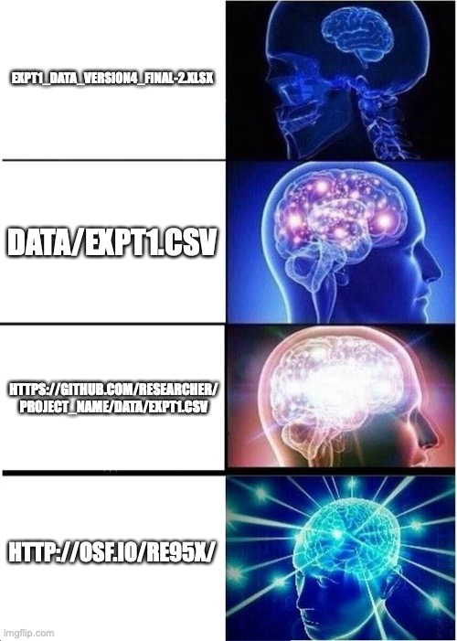
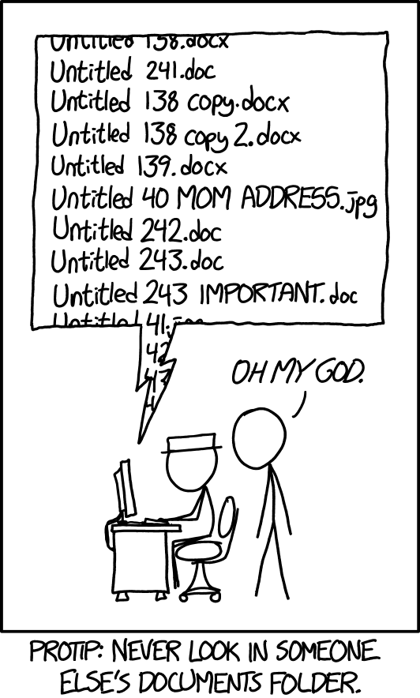
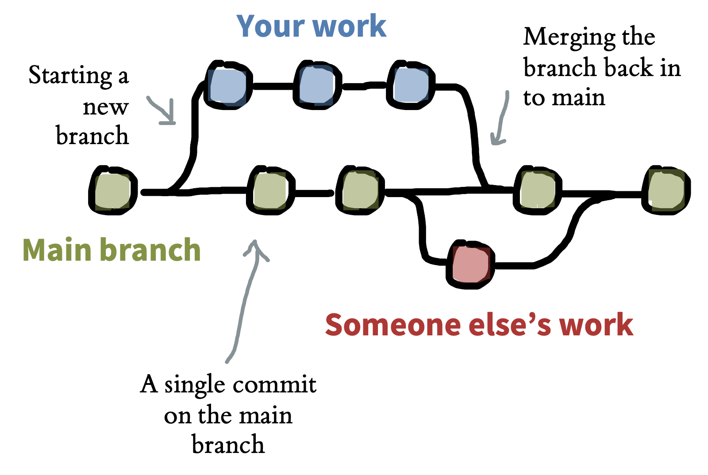
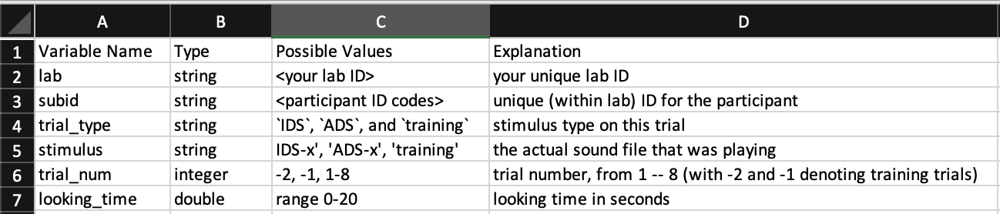

# Project management {#management}

<!-- ```{r management-meme} -->
<!--  -->
<!-- ``` -->

::: {.learning-goals}
🍎 Learning goals: 

* Learn how to manage your research projects efficiently and transparently
* Describe important elements of version control
* Optimize sharing of research products, like data and analysis code, by ensuring they are Findable, Accessible, Interoperable, Reusable (FAIR)
* Understand potential ethical constraints on sharing research products
:::

> Your closest collaborator is you six months ago, but you don't reply to emails. 
>
> `r tufte::quote_footer('--- Karl Broman (2016)')`

```{r versions, fig.cap="Poor file management creates chaos! By xkcd (https://xkcd.com/1459). Shared under CC BY-NC 2.5", fig.margin=TRUE}

```

Have you ever returned to an old project folder to find a chaotic mess of files with names like `analysis-FINAL`, `analysis-FINAL-COPY`, and `analysis-FINAL-COPY-v2`? Which file is actually the final version!? Or perhaps you've spent hours searching for a data file to send to your advisor, only to realize with horror that it was *only* stored on your old laptop -- the one that experienced a catastrophic hard drive failure when you spilled coffee all over it one sleepy Sunday morning. These experiences may make you sympathetic to Karl Broman's quip: good project management practices not only make it easier to share your research with others, they also make for a more efficient and less error prone workflow that will avoid giving your future-self a headache. This chapter is about the process of managing all of the products of your research workflow — methodological protocols, materials ^[We use the term "materials" here to cover a range of things another researcher might need in order to repeat your study, for example, stimuli, survey instruments, and code for computer-based experiments.], data, and analysis scripts -- in ways that maximize their value to you and to the broader research community.

When we talk about research products, we typically think of articles in academic journals, which have been scientists' main method of communication since the scientific revolution in the 1600s.^[The world's oldest scientific journal is the *Philosophical Transactions of the Royal Society*, first published in 1665.] But articles only provide written summaries of research; they are not the original research products. In recent years, there have been widespread calls for increased sharing of research products, such as materials, data, and analysis code [@munafo2017]. When shared appropriately, these other products can be at least as valuable as a summary article. Shared stimulus materials can be reused for new studies in creative ways; shared analysis scripts can allow for reproduction of reported results and become templates for new analyses; and shared data can enable new analyses or meta-analyses. Indeed, many funding agencies, and some journals, now require that research products be shared publicly, except when there are justified ethical or legal constraints, such as with sensitive medical data [@nosek2015]. 

There have been particularly intensive efforts to improve data sharing, which has been associated with benefits in terms of error detection [@hardwicke2021d], creative re-use that generates new discoveries [@voytek2016], increased citations [@piwowar2013], and detection of fraud [@simonsohn2013]. According to surveys, researchers are usually willing to share data in principle [@houtkoop2018], but unfortunately, in practice, they often do not, even if you directly ask them [@hardwicke2018c]! Sometimes it is reported that data have been lost because they were stored on a misplaced or damaged computer or external drive, or team members with access to the data are no longer contactable [@tenopir2020]. As we have discussed in Chapter \@ref(replication), even when data are shared, they are not always formatted in a way that they can be easily understood and re-used by other researchers, or even the original authors! 

Sound project management practices and sharing of research projects are mutually reinforcing goals that bring benefits for both yourself, the broader research community, and scientific progress. One particularly important benefit of good project management practices is that they enable reproducibility. As we discussed in Chapter \@ref(replication), computational reproducibility involves being able to trace the provenance of any reported analytic result in a research report back to its original source. That means being able to recreate the entire analytic chain from data collection to data files, though analytic specifications to the research results reported in text, tables, and figures. If data collection is documented appropriately, and if data are stored, organized, and shared, then the provenance of a particular result is relatively easy to verify. But once this chain is broken it can be hard to reconstruct [@hardwicke2018b]. That's why it's critical to build good project management practices into your research workflow right from the start.

```{r fleetwood, fig.cap="Fleetwood Mac fans can easily remind themsevles that the key principle of computational reproducibility is to *never break the chain* between the data and the reported results.", fig.margin=TRUE}
knitr::include_graphics("images/management/fleetwood_mac.jpg")
```

```{r chain, fig.cap="Illustration of the analytic chain from raw data through to research report.", fig.margin=TRUE}
knitr::include_graphics("images/management/analytic__chain.png")
```

In this chapter, you will learn how to manage your research project both efficiently and transparently. These goals create a virtuous cycle: if you organize your research products well, they are easier to share later, and if you assume that you will be sharing, you will be motivated to organize your work better! We begin by discussing some important principles of project management, including folder structure, file naming, organization, and version control. Then we zoom in specifically on data and discuss best practices for data sharing. We end by discussing the question of what research products to share and some of the potential ethical issues that might limit your ability to share in certain circumstances.^[This chapter -- especially the last section -- draws heavily on @klein2018, an article on research transparency that several of us contributed to.]

::: {.case-study}
🔬 Case study: ManyBabies, ManySpreadsheetFormats!

The ManyBabies project is an example of "Big Team Science" in psychology. A group of developmental psychology researchers (including some of us) were worried about many of the issues of reproducibility, replicability, and experimental methods that we've been discussing throughout this book, so they set up a large-scale collaboration to replicate key effects in developmental science. The first of these studies was ManyBabies 1 [@manybabies2020], a study of infants' preference for baby-talk (also known as Infant Directed Speech). 

The core team expected a handful of labs to contribute, but after a year-long data collection period, they ended up receiving data from 69 labs around the world! The outpouring of interest signaled a lot of enthusiasm from the community for this kind of collaborative science. Unfortunately, it also made for a tremendous data management headache. As the idiosyncratic data formatting preferences of the various labs had to be reorganised to fit into a single standardized analysis pipeline, all kinds of complications and hilarity ensued [@byers-heinlein2020].

All of the formatting changes that individual labs made were reasonable -- altering column names for clarity, combining templates into a single Excel file, changing units (e.g., from seconds to milliseconds) -- but together they created a very challenging **data validation** problem for the core analysis team, requiring many dozens of hours of coding and hand-checking. The data checking was critical: an error in one lab's data was flagged during validation and led to the painful decision to drop those data from the final dataset. In future ManyBabies projects, the group has committed to using data validation software to ensure that data files uploaded by individual labs conforms to a shared standard.^[You can see some of the analysis pipeline and validation process in the [ManyBabies 1 public repository](https://github.com/manybabies/mb1-analysis-public).]
:::

## Principles of project management

A lot of project management problems can be avoided by following a very simple file organisation system. For those researchers that "grew up" managing their files locally on their own computers and emailing colleagues versions of data files and manuscripts with names like `manuscript-FINAL-JS-rev1.xlsx`, a few aspects of this system may seem disconcerting. However, with a little practice, this new way of working will start to feel intuitive and have substantial benefits. Here are the principles:

1. There should be exactly one definitive copy of each document in the project, with its name denoting what it is. For example, `fifo_manuscript.Rmd` or `fifo_manuscript.docx` is the write-up of the "fifo" project as a journal manuscript.
2. The location of each document should be within a folder which serves to uniquely identify the document's function within the project. For example, `/analysis/experiment1/eye_tracking_preprocesssing.Rmd` is clearly the file that performs pre-processing for the analysis of eye-tracking data from Experiment 1. 
3. The full project should be accessible to all collaborators and archived across multiple storage devices, either via a version control platform (e.g., [github.com]()) or cloud provider (e.g., dropbox, box, google drive).
4. The revision history of all text- and text-based documents (minimally, data, analysis code, and manuscript files) should be archived automatically. Automatic versioning is the key feature of all version control systems and is often included by cloud storage providers.

Keeping these principles in mind, we discuss best practices for project organization, version control, and file naming.

### Organizing your project

To the greatest extent possible, all files related to a project should be stored in the same project folder (with appropriate sub-folders), and on the same storage provider.^[There are cases where this is impractical due to the limitations of different software packages. For example, in many cases a team will manage its data and analysis code via github but decide to write collaboratively using google docs, overleaf, or another collaborative platform. (It can also be hard to ask all collaborators to use a version control system they are unfamiliar with.) In that case, the final paper should still be linked in some way to the project repository. The biggest issue that comes up in using a split workflow like this is the need to ensure reproducible written products, a process we cover in Chapter \@ref(writing).] 

Figure \@ref(fig:management-organization-ex) shows an example project stored on the Open Science Framework. The top level folder contains sub-folders for analyses, materials, raw and processed data (kept separately). It also contains the paper manuscript, and, critically, a README file in a text format that describes the project (as well as any other meta-data that the authors would like to be associated with the research products, for example a license, explained below). 

```{r management-organization-ex, fig.cap="Sample top level folder structure for a project. From Klein et al., 2018. Original visible on the [Open Science Framework](https://osf.io/xf6ug/)."}
knitr::include_graphics("images/management/org-ex.png")
```

There's no single established way to organize the sub-folders of a research project, but the broad categories of materials, data, analysis, and writing are typically present. In some projects -- such as those involving multiple experiments or complex data types -- you may have to adopt a more complex structure. In our projects, it's not uncommon to find paths like `/data/raw_data/exp1/demographics`. The key principle here is to create a hierarchical structure in which subfolders uniquely identify the part of the broader space of research products that are found inside them -- that is, `/data/raw_data/exp1` contains all the raw data from Experiment 1, and `/data/raw_data/exp1/demographics` contains all the raw *demographics* data from that particular experiment.^[If you're interested, a more extensive guide to folder organization is found in the [online supplement](https://psych-transparency-guide.uni-koeln.de/folder-structure.html#root-folder) to @klein2018.]

### Versioning

```{r git, fig.cap="Visualisation of Git version control. Source: https://www.nobledesktop.com/learn/git/git-branches.", fig.margin = T}
# NO PERMISSION - make our own?

```

Probably everyone who has ever collaborated electronically has experienced the frustration of editing a document, only to find out that you are editing the wrong version -- perhaps some of the problems you are working on have already been corrected, or perhaps the section you are adding has already been written by someone else. A second source of frustration comes when you take a wrong turn in a project, perhaps by reorganizing a manuscript in a way that doesn't work or refactoring code in a way that turns out to be short-sighted. 

<!-- [TH NOTE - potentially controversial opinion but I think Git is a pretty grim experience for collaborative manuscript writing and inferior to Google Docs. I've never had to "merge changes by hand" on Google Docs and the commenting functionality is far superior - for example, see this comment you are currently reading :) Additionally, Docs automatically stores a version history, no manual commits necessary. On this basis, I propose that we do not recommend it for manuscript writing] -->

These two classes of problems are solved effectively by modern version control systems. Here we focus on the use of git, which is perhaps the most widely used version control system. Git is a great general solution for version control, but many people -- including several of us -- don't love it for collaborative manuscript writing. We'll introduce git and its principles here, while noting that online collaboration tools like Google Docs and Overleaf^[Overleaf is actually supported by git on the backend!] can be easier for writing; we cover this topic in a bit more depth in Chapter \@ref(writing). 

Git is a tool for creating and managing projects, which are called **repositories**. A Git repository is a directory whose revision history is tracked via a series of **commits** -- snapshots of the state of the project. These commits can form a tree with different **branches**, as when two contributors to the project are working on two different parts simultaneously. These branches can later be **merged** either automatically or via manual intervention in the case of conflicting changes. 

Commonly, Git repositories are hosted by an online service like [Github](http://github.com) to facilitate collaboration. With this workflow. a user makes changes to a local version of the repository on their own computer and **pushes** those changes to the online repository. Another user can then **pull** those changes from the online repository to their own local version. The online "origin" copy is always the definitive copy of the project and a record is kept of all changes. Appendix \@ref(git) provides a practical introduction to Git and Github, and there are a variety of good tutorials available online and in print [@blischak2016].

Collaboration using version control tools is designed to solve many of the problems we've been discussing:

* A remotely hosted Git repository is a cloud-based backup of your work, meaning it is less vulnerable to accidental erasure.^[In 48BC, Julius Caesar accidentally burned down part of the Great Library of Alexandria where the sole copies of many valuable ancient works were stored. To this day, many scientists have apparently retained the habit of storing single copies of important information in vulnerable locations. Hard drive failure is a surprisingly common source of missed deadlines!] 
* By virtue of having versioning history, you have access to previous drafts in case you find you have been following a blind alley and want to roll back your changes. 
* By creating new branches, you can create another, parallel history for your project, so that you can try out major changes or additions without disturbing the main branch in the process. 
* A project's commit history is labeled with each commit's author and date, facilitating record keeping and collaboration.
* Automatic merging can allow synchronous editing of different parts of a manuscript or codebase.^[Version control isn't magic, and if you and a collaborator edit the same paragraph or function, you will likely have to merge your changes by hand. But Git will at least show you where the conflict is!]

Organizing a project repository for collaboration and hosting on a remote platform is an important first step towards sharing! Many of our projects (like this book) are actually "born open" in the sense that we do all of our work on a publicly hosted repository for everyone to see [@rouder2015]. This philosophy of 'working in the open' encourages good organization practices from the beginning. It can feel uncomfortable at first, but this discomfort soon vanishes as you realize that no one is actively looking at your in-progress project.^[One concern that many people raise about sharing in-progress research openly is the possibility of "scooping" -- that is, other researchers getting an idea or even data from the repository and writing a paper before you do. We have two responses to this concern. First, the empirical frequency of this sort of scooping is difficult to determine, but likely very low -- we don't know of any documented cases. Mostly, the problem is getting people to care about your experiment at all, not people caring so much that they would publish using your data or materials! In Gary King's [words](https://www.youtube.com/watch?v=jD6CcFxRelY]), "The thing that matters the least is being scooped. The thing that matters the most is being ignored." On the other hand, if you are in an area of research that you perceive to be competitive, or where there is some significant risk of this kind of shenanigans, it's very easy to keep part, or all, of a repository, private among your collaborators until you are ready to share more widely. All of the benefits we described still accrue. For an appropriately organized and hosted project, often the only steps required to share materials, data, and code is to make the hosted repository public and link it to an archival storage platform like the Open Science Framework.]

### File names

As [Phil Karlton reportedly said](https://www.karlton.org/2017/12/naming-things-hard/), “There are only two hard things in Computer Science: cache invalidation and naming things.” What's true for computer science is true for research in general.^[We won't talk about cache invalidation; that's a more technical problem in computer science that is beyond the scope of this book.] Naming files is hard! Some very organized people survive on systems like `info-r1-draft-2020-07-13-js.docx` - meaning, "the info project revision 1 draft of July 13th, 2020, with edits by JS." But this kind of system needs a lot of rules and discipline, and it requires everyone in a project to buy in completely.

On the other hand, if you are naming a file in a hierarchically organized version control repository, the naming problem gets dramatically easier. All of a sudden, you have a context in which names make sense. `data.csv` is a terrible name for a data file on its own. But the name is actually perfectly informative -- in the context of a project repository with a README that states that there is only a single experiment, a repository structure such that the file lives in a folder called `raw_data`, and a commit history that indicates the file's commit date and author. 

As this example shows, naming is hard *out of context*. So here's our rule: name a file with what it contains. Don't use the name to convey the context of who edited it, when, or where it should go in a project.

## Data Management

We've just discussed how to manage projects in general; in this section we zoom in on datasets specifically. Data are often the most valuable research product because they represent the evidence generated by our research. We maximize the value of the evidence when other scientists can reuse it for independent verification or generation of novel discoveries. Yet lots of research data are not reusable, even when they are shared. In Chapter \@ref(replication), we discussed @hardwicke2018b's study of analytic reproducibility. But before we were able to even try and reproduce the analytic results we found that only 64% of shared datasets were both complete and understandable. 

How can you make sure that your data are managed so as to enable effective sharing? We make four primary recommendations. First, save your raw data! Second, document your data collection process. Third, organize your raw data for later analysis -- we provide guidance on organization for both spreadsheets and for data retrieved from software platforms, like Qualtrics. Fourth and finally, document your data using a codebook or other appropriate metadata.

### Save your raw data

Raw data take many forms. For many of us, the raw data are those returned by the experimental software; for others, the raw data are videos of the experiment being carried out. Regardless of the form of these data, save them! They are often the only way to check issues in whatever processing pipeline brings these data from their initial state to the form you analyze. They also can be invaluable for addressing critiques or questions about your methods or results later in the process. If you need to correct something about your raw data, *do not alter the original files*. Make a copy, and make a note about how the copy differs from the original.^[Future you will thank present you for explaining why there are two copies of subject 19's data.]

Raw data are often not anonymized or anonymizable. Anonymizing them sometimes means altering them (e.g., in the case of downloaded logs from a service that might include IDs or IP addresses). Or in some cases, anonymization is difficult or impossible without significant effort and loss of some value from the data, e.g. for video data or MRI data [@bischoff-grethe2007]. Unless you have specific permission for broad distribution of these identifiable data, the raw data may then need to be stored in a different way. In these cases, we recommend saving your raw data in a separate repository with the appropriate permissions. For example, in the ManyBabies 1 study we described above, the public repository does not contain the raw data contributed by participating labs, which the team could not guarantee was anonymized; these data are instead stored in a private repository.^[The precise repository you use for this task is likely to vary by the kind of data that you're trying to store and the local regulatory environment. For example, in the United States, to store de-anonymized data with certain fields requires a server that is certified for HIPAA (the relevant medical privacy law). Many -- but by no means all -- universities provide HIPAA-compliant cloud storage.] 

You can use your repository's README to describe what is and is not shared. For example, a README might state that "We provide anonymized versions of the files originally downloaded from Qualtrics" or "Participants did not provide permission for public distribution of raw video recordings, which are retained on a secure university server." Critically, if you still share the derived tabular data, it should still be possible to reproduce the analytic results in your paper, even if checking the provenance of those numbers from the raw data is not possible for every reader. 

<!-- [TH - for my projects, I have three sub-folders in my data directory /data/raw/ /data/primary/ /data/processed and scripts in my analysis directory that document any changes between the three. The raw folder is always in .gitignore and never gets shared. Should we recommend a similar scheme here?] -->

```{r management-mb-datafiles, fig.cap="Example participant (top) and trial (bottom) level data from the ManyBabies (2020) case study."}
# https://stackoverflow.com/questions/62516742/create-multi-panel-figure-using-png-jpeg-images
img1 <- magick::image_read("images/management/mb1-subjects.png")
img2 <- magick::image_read("images/management/mb1-trials.png")
magick::image_montage(c(img1,img2), geometry = 'x100+10+10', tile = '1x2', bg = 'white', 
                      shadow = FALSE)
```

One common practice is the use of participant identifiers to link specific experimental data -- which, if they are responses on standardized measures, rarely pose a significant identifiability risk -- to demographic data sheets that might include more sensitive and potentially identifiable data.^[A word about subject identifiers. These should be anonymous identifiers, like randomly generated numbers, that cannot be linked to participant identities (like data of birth) and are unique. You laugh, but one of us was in a lab where all the subject IDs were the date of test and the initials of the participant. These were neither unique nor anonymous. One common convention is to give your study a code-name and to number participants sequentially, so your first participant in a sequence of experiments on information processing might be `INFO-1-01`.] Depending on the nature of the analyses being reported, the experimental data can then be shared with limited risk. Then a selected set of demographic variables -- for example, those that do not increase privacy risks but are necessary for particular analyses -- can be distributed as a separate file and joined back into the data later.

### Document your data collection process

In order to understand the meaning of the raw data, its helpful to share as much as possible about the context in which it was collected. This also helps communicate the experience that participants had in your experiment. Documentation of this experience can take many forms. 

If the experimental experience was a web-based questionnaire, archiving this experience can be as simple as downloading the questionnaire source.^[If it's in a proprietary format like a Qualtrics `.QSF` file, a good practice is to convert it to a simple plain text format as well so it can be opened and re-used by folks who do not have access to Qualtrics (which may include future you!)] On the other hand, for many more involved studies it can be more difficult to reconstruct what participants went through. This kind of situation is where video data can shine [@gilmore2017]. A video recording of a typical experimental session can provide a valuable tutorial for other experimenters -- as well as good context for readers of your paper. This is doubly true if there is a substantial interactive element to your experimental experience, as is often the case for experiments with children. For example, the ManyBabies case study that we examined shared ["walk through" videos of experimental sessions](https://nyu.databrary.org/volume/896) for many of the participating labs, creating a repository of standard experiences for infant development studies. If nothing else, a video of an experimental session can sometimes be a very nice archive of a particular context.^[Videos of experimental sessions also are great to show in a talk, provided you have permission from the participant.]

Regardless of what other documentation you keep, it's critical to create some record linking your data to the particular documentation you have. For a questionnaire study, for example, this documentation might be as simple as a README that says that the data in the `raw_data` directory were collected on a particular date using the file named `experiment1.qsf`. This kind of "connective tissue" linking data to materials can be very important when you return to a project with questions. If you spot a potential error in your data, you will want to be able to examine the precise version of the materials that you used to gather those data in order to identify the source of the problem.

### Organize your data for later analysis (spreadsheet version)

Data come in many forms, but chances are that at some point during your project you will end up with a spreadsheet full of information. Well-organized spreadsheets cam mean the difference between project success and failure! A wonderful article by @broman2018 gives a guide to spreadsheet organization that lays out the principles of good spreadsheet design. We highlight some of their principles here (with our own, opinionated ordering):

```{r management-broman-nonrect, fig.cap="Examples of non-rectangular spreadsheet formats that are likely to cause problems in analysis. From Broman and Woo (2018)."}
knitr::include_graphics("images/management/broman2018.png")
```

1. *Make it a rectangle*^[Think of your data a well-ordered plate of sushi, neatly packed together without any gaps]. Nearly all data analysis software, like SPSS, Stata, and JASP (and many R packages), require data to be in a tabular format.^[Tabular data is a precursor to "tidy" data, which we describe in more detail in Appendix \@ref(tidyverse).] If you are used to analyzing data exclusively in a spreadsheet, this kind of tabular data isn't quite as readable, but readable formatting gets in the way of almost any analysis you want to do. Figure \@ref(fig:management-broman-nonrect) gives some examples of non-rectangular spreadsheets. All of these will cause any analytic package to choke because of inconsistencies in how rows and columns are used!

2. *Choose good names for your variables*. No one convention for name formatting is best, but it's important to be consistent. We tend to follow the [tidyverse style guide](https://style.tidyverse.org) and use lowercase words separated by underscores (`_`). It's also helpful to give units where these are available, e.g., are reaction times in seconds or milliseconds. Table \@ref(tab:management-broman-ex) gives some examples of good and bad variable names. 

```{r management-broman-ex, fig.margin=TRUE}

names <- tribble(~`Good name`, ~`Good alternative`, ~`Avoid`,
                 "subject_id", "SubID", "subject #",
                 "sex", "female", "M/F",
                 "rt_msec","reaction_time_ms", "reaction time (millisec.)")

knitr::kable(names, booktabs = TRUE, caption = "Examples of good and bad variable names. Adapted from Broman and Woo (2018).")
```

3. *Be consistent with your cell formatting*. Each column should have one *kind* of thing in it. For example, if you have a column of numerical values, don't all of a sudden introduce text data like "missing" into one of the cells. This kind of mixing of data types can cause havoc down the road. Mixed or multiple entries also don't work, so don't write "0 (missing)" as the value of a cell. Leaving cells blank is also risky because its ambiguous.

Most software packages have a standard value for missing data (e.g. `NA` is what R uses). If you are writing dates, please be sure to use the "global standard" (ISO 8601), which is YYYY-MM-DD. Anything else can be misinterpreted easily. Dates in Excel deserve special mention as a source of terribleness. Excel has an unfortunate habit of interpreting information that has nothing to do with dates as dates, destroying the original content in the process.^[Excel's issue with dates has caused unending horror in the genetics literature, where gene names are automatically converted to dates, sometimes without the researchers noticing [@ziemann2016]. In fact, some gene names have had to be changed in order to avoid this issue!]

4. *Decoration isn't data*. Decorating your data with bold headings or highlighting may seem useful for humans, but it isn't uniformly interpreted or even recognized by analysis software (e.g., reading an Excel spreadsheet into R will scrub all your beautiful highlighting and artistic fonts) so do not rely on it.

5. *Save data in plain text files*. The CSV (comma-delimited) file format is a common standard for data that is uniformly understood by most analysis software (it is an "interoperable" file format).^[Be aware of some interesting differences in how these files are output by European vs. American versions of Microsoft Excel! You might find semi-colons instead of commas in some datasets.] The advantage of CSVs is that they are not proprietary to Microsoft or another tech company, can be inspected in a text editor, but be careful: they do not preserve Excel formulas or formatting! 

Given the points above, we recommend that you avoid analyzing your data in Excel. If it is necessary to analyze your data in a spreadsheet program, we urge you to save the raw data as a separate CSV and then create distinct analysis spreadsheets so as to be sure to retain the raw data unaltered by your (or Excel's) manipulations.

### Organize your data for later analysis (software version)

Many researchers do not create data by manually entering information into a spreadsheet. Instead they receive data as the output from a web platform, software package, or device. These tools typically provide researchers limited control over the format of the resulting tabular data export. Case in point is the survey platform Qualtrics, which provides data with not one but two header rows, complicating import into almost all analysis software!^[The R package `qualtRics` can help with this.] 

That said, if your platform *does* allow you to control what comes out, you can try to use the principles of good tabular data design outlined above. For example, try to give your variables (e.g., questions in Qualtrics) sensible names! 

:::{.accident-report}
⚠️ Accident report: Bad variable naming!

In our methods class, students often try to reproduce the original analyses from a published study before attempting to replicate the results in a new sample of participants. When Kengthsagn Louis looked at the code for the study she was interested in, she noticed that the variables in the analysis code were unnamed (presumably because they were output this way by the survey software). For example, one piece of Stata code looked like this!

```{verbatim=TRUE}
gen recall1=.
replace recall1=0 if Q21==1 
replace recall1=1 if Q21==3 | Q21==5 | Q21==6
replace recall1=2 if Q21==2 | Q21==4 | Q21==7 | Q21==8
replace recall1=0 if Q69==1 
replace recall1=1 if Q69==3 | Q69==5 | Q69==6
replace recall1=2 if Q69==2 | Q69==4 | Q69==7 | Q69==8
ta recall1
```

In the process of translating this code into R in order to reproduce the analyses, Kengthsagn and a course teaching assistant, Andrew Lampinen, noticed that some participant responses had been assigned to the wrong variables. Because the variable names were not human-readable, this error was almost impossible to detect. After being made aware of the problem, the article's author -- to their credit -- issued an immediate correction since the problem affected some of the inferential conclusions of the article [@petersen2019].

The moral of the story: obscure variable names can hide existing errors and create opportunities for further error! Sometimes you can adjust these within your experimental software, avoiding the issue. If not, make sure to create a "key" and translate the names immediately, double checking after you are done.
:::

### Document the format of your data

Even the best-organized tabular data are not always easy to understand by other researchers, or even yourself, especially after some time has passed. For that reason, best practices for data sharing include making a **codebook** (also known as a **data dictionary**) that explicitly documents what each variable is. Figure \@ref(fig:management-mb-codebook) shows an example codebook for the trial-level data in the bottom of Figure \@ref(fig:management-mb-datafiles). Each row represents one variable in the associated dataset, with the columns stating what type of variable it is, what its levels are, and a human-readable explanation. The explanation provides units (e.g., 'seconds') and translates numeric codes (e.g., 'retest as 2') where relevant.

[TH NOTE - 'levels' may need explaining. Also levels presumably only applies to categorical data, but in the example you also have a range in this column. Perhaps this column should be 'values'? And then need to be clear if its values actually in the data or possible value — an important distinction if, for example, a possible category level is not present in the data.]

```{r management-mb-codebook, fig.cap="Codebook for trial-level data (see above) from the ManyBabies (2020) case study."}
# https://stackoverflow.com/questions/62516742/create-multi-panel-figure-using-png-jpeg-images

```
Creating a codebook need not require a lot of work. Almost any documentation is better than nothing! There are also several R packages that can automatically generate a codebook for you, for example `codebook`, `dataspice`, and `dataMaid` [@arslan2019]. Adding a codebook can substantially increase the reuse value of the data and prevent hours of frustration as future-you and others try to decode your variable names and assumptions.

## Sharing Research Products

As we've been discussing throughout this chapter, if you've managed your research products effectively, sharing them with others is a far less daunting prospect, and usually just requires uploading them to an online repository like the Open Science Framework. This section discusses where and how to share research products and addresses some potential limitations on sharing that you should bear in mind.

### Where and how to share

```{r hamilton, fig.cap="Before digital code and online services like the Open Science Framework, sharing computer code was pretty impractical! Margaret Hamilton, software engineer, with the computer code she and her MIT team wrote for the Apollo space mission (1969). Source: MIT Museum: https://news.mit.edu/2016/scene-at-mit-margaret-hamilton-apollo-code-0817 DO WE NEED PERMISSION?", fig.margin=TRUE}
knitr::include_graphics("images/management/margaret-hamilton.jpg")
```

For shared research products^[Most of this discussion is about data, because that's where the community has focused its efforts. That said, almost everything here applies to other research products as well!] to be usable by others, they should meet a set of standards known as 'FAIR': Findable, Accessible, Interoperable, and Reusable [@wilkinson2016]. Findable products are easily discoverable to both humans and machines. That means linking to them in research reports using unique persistent identifiers (e.g. a digital object identifier [DOI]).^[DOIs are those long URL-like things that are often used to link to papers. Turns out they can also be associated with datasets and other research products. Critically, they are guaranteed to work to find stuff, whereas standard web URLs often go stale after several years when people refactor their website. Most online repositories, like the Open Science Framework, will issue DOIs for the research products you store there.] and attaching them with meta-data describing what they are so they can be indexed by search engines. Accessibility means that research products need to be preserved across the long-term and are retrievable via their standardized identifier. Interoperability means that the research products needs to be in a format that people and machines (e.g., search engines and analysis software) can understand. Reusable means that the research products need to be well organized, documented, and licensed so that others know how to use them.

[TH NOTE - I think we need a clear definition of meta-data somewhere and some practical instruction on how to create it]

If you've followed the guidance in the rest of this chapter, then you will already be well on your way to making your research products FAIR. There are a few final steps to consider. An important decision is where you are going to share the research products. We recommend uploading the files to a repository that's designed according to support FAIR principles. Personal websites don't cut it, since these sites tend to go out of date and disappear. There's also no easy way to find research products on personal sites unless you know who created them. Github, though it's a great platform for collaboration, isn't a FAIR repository -- for one thing, products there don't have DOIs -- and there are no archival guarantees on files that are shared there. And -- perhaps surprisingly for some researchers -- journal supplementary materials are also not a great place to put research products. Often they have no unique DOI or meta-data, and they often change their URLS, leading data becoming unavailable [@evangelou2005]. 

Fortunately, there are many repositories that help you conform to FAIR standards. Zenodo, Figshare, the Open Science Framework (OSF), and the various Dataverse sites are designed for this purpose, though there are likely other domain-specific repositories that will be relevant for different research fields. We usually use the OSF as it makes it easy to share all research products connected to a project in one place. OSF is FAIR compatible and allows users to assign DOIs to their data and provide appropriate metadata. 

We also recommend you attach a license to your research products. Academic culture is (usually) unburdened by discussion of intellectual property and legal rights and instead relies on scholarly norms about citation and attribution. The basic expectation is that if you rely on someone else's research, you explicitly acknowledge the relevant journal article through a citation.

Although norms are still evolving, using research products created by others generally adheres to the same scholarly principle. However, research products can also be useful in non-academic contexts. Perhaps you created software that a company would like to use. Maybe a pediatrician would like to use a research instrument you've been working on to assess their patients. These applications (and many other reuses of the data) require a legal license. In practice, there are a number of simple, open source licenses that permit reuse. We tend to favor [Creative Commons licenses](https://creativecommons.org), which come in a variety of flavors such as [CC-BY](https://creativecommons.org/licenses/by/4.0/) (which allows reuse as long as there is attribution) and [CC-BY-NC](https://creativecommons.org/licenses/by/4.0/) (which only allows attributed, non-commercial reuse). Regardless of what license you choose, having a license means that your products won't be in a "not sure what I'm allowed to do with this" limbo for others who are interested in reusing them. 

[TH NOTE - I do not have a detailed understanding of licensing but in our Klein et al. paper we recommend sharing with CC0 - especially for data - because it is the most legally permissive license (it puts the data in the public domain). I think its intuitive to think that you should use CC-BY because you want attribution or CC-BY-NC because it means nasty companies can't use your data, but apparently it can create a lot of complications in legitimate use-cases. And using CC0 does not mean usual scholarly norms of attribution don't apply.]

As we have discussed, you may want to consider working in the open from the outset. If you are using Github to manage your project, you can link the Git repository to the Open Science Framework so it automatically syncs. This provides a valuable incentive to organize your work properly throughout your project and makes sharing super easy, because you've already done it! On the other hand, this way of working can feel exposed for some researchers, and it does carry some risks, however small, of "scooping" or pre-emption by other groups working in the same space. Fortunately you can set up the same Git-OSF workflow and keep it private until your ready to make it public later on. The next stage at which you should consider sharing your research products is when you submit your study to a journal. If you're still hesitant to make the project entirely public, many repositories (including OSF) will allow you to create special links that facilitate limited access to, for example, reviewers and editors. In general, the earlier you share your research products the better because there are more opportunities for others to learn from, build on, and verify your research^[If there are errors in our work, we'd certainly love to hear about it *before* the article is published in a journal rather than after!].

### What you can and can't share

We've been advocating that you share all of your research products, especially your data; however, in practice there can be some obstacles to sharing, especially if your research involves sensitive information. The first and most important of these is **participant privacy**. Unless they explicitly waive these rights, participants in psychology experiments have the expectation of privacy -- that is, no one should be able to identify them from the data they have provided. Protecting participant privacy is an important part of researchers' ethical responsibilities [@ross2018]. Furthermore, there are legal regulations that protect participants' data, though these vary from country to country. In the US, the relevant regulation is **HIPAA**, the Health Insurance Portability and Accountability Act, which limits disclosures of private health information (**PHI**). In the European Union, the relevant regulation is the European GDPR (General Data Protection Regulation). It's beyond the scope of this book to give a full treatment of these regulatory frameworks; you should consult with your local IRB regarding compliance.

Under both frameworks, **anonymization** (or equivalently **de-identification**) of data is a key concept, such that data sharing is generally permissible if the data are considered to have met the relevant anonymization standard. Under US Department of Health and Human Services guidelines, researchers can follow the "safe harbor" standard^[[As described on the relevant DHHS page](https://www.hhs.gov/hipaa/for-professionals/privacy/special-topics/de-identification/index.html).] under which data are considered to be anonymized if they do not contain any of 18 identifiers (including fields like names, telephone numbers, email addresses, social security numbers, dates of birth, faces, and other). Thus, data that only contain participant IDs can typically be shared under this framework.^[US IRBs are a very de-centralized bunch and their interpretations often vary considerably. For reasons of liability or ethics, they may not allow data sharing even though it is permitted by US law. If you feel like arguing with an IRB that takes this kind of stand, you could mention that the DHHS rule actually doesn't consider de-identified data to be "human subjects" data at all, and thus the IRB may not have regulatory authority over it. We're not lawyers, and we're not sure if you'll succeed but it could be worth a try.] Under the EU's GDPR, putting anonymous identifiers in a data file and removing identifiable fields does not itself suffice for anonymization if the data are still **in-principle re-identifiable** because you have maintained documentation linking IDs to identifiable data like names or email addresses. Only when the key linking identifiers to data has been destroyed are the data truly de-identified. 

De-identification via the "safe harbor" standard described above is not always enough. As datasets get richer, **statistical reidentification risks** go up substantially such that, with a little bit of outside information, data can be matched with a unique individual. These risks are especially high with linguistic, physiological, and geospatial data, but they can be present even for simple behavioral experiments. In one influential demonstration, knowing a person's location on two occasions was often enough to identify their data uniquely in a huge database of credit card transactions [@de-montjoye2015]. For an example closer to home, many of the contributing labs in the ManyBabies project logged the date of test for each participant. This useful and seemingly innocuous piece of information is unlikely to identify any particular participant -- but alongside a social media post about a lab visit or a dataset about travel records, it could easily reveal a participant's identity. Thus, simply removing fields from the data is only a starting point. Before releasing data, researchers need to give some thought to whether any aspects of the data could lead to re-identification. 

::: {.ethics-box}
🌿 Ethics box: Really anonymous? 

When we first began teaching Psych 251, our experimental methods course at Stanford, one of the biggest contributions of the course was simply showing students how to do experiments online. Amazon's Mechanical Turk crowdsourcing service was relatively new, and our IRB did not have a good sense of what this service really was. We proposed that we would share data from the class and received approval for this practice. Our datasets were downloaded directly from Mechanical Turk and included participants' MTurk IDs (long alphanumeric strings that seemed completely anonymous). Several experiences caused us to reconsider this practice! 

First, we discovered that MTurk IDs were in some cases linked to study participants' public Amazon "wish lists," which could both inadvertently provide information about the participant and also even potentially provide a basis for reidentification (in rare cases). This discovery led us to consult with our IRB and provide more explicit consent language in our class experiments, linking to instructions for making Amazon profiles private. 

Then, a little later we received an irate email from an MTurk participant who had discovered their data on github via a search for their MTurk ID. Although they were not identified in this dataset, it convinced us that at least some participants would not like this ID shared. After another consultation with the IRB, we apologized to this individual and removed their and others' IDs from our github commit histories across that and other repositories. We now take care to anonymize IDs by creating a secret mapping between the IDs we post and the actual MTurk IDs prior to posting data. 
:::

```{r management-sharing-chart, fig.cap="A decision flow chart for thinking about sharing research products. From Klein et al. (2018)."}
knitr::include_graphics("images/management/kline1.png")
```

Privacy issues are ubiquitous in data sharing, and almost every experimental research project will need to solve them before sharing data. For simple projects, often these are the only issues that preclude data sharing. However, in more complex projects, other concerns can arise. Funders may have specific mandates regarding where your data should be shared. Data use agreements or collaborator preferences may restrict where and when you can share. And certain data types require much more sensitivity since they are more consequential than, say, the reaction times on a Stroop task. We include here a flow chart (Figure \@ref(fig:management-sharing-chart)) that walks through some of the options and mentions relevant concerns. When in doubt, it's often a good idea to consult with the relevant local authority, e.g. your IRB for ethical issues or your research management office for regulatory issues.

[TH NOTE - I think the content in this sub-section is solid, but I'm a bit worried that people get to the end of the chapter motivated to share and then we just drop a bunch of scary info on them - laws! Perhaps we could explore better ways to handle it - I think using a bit more informal language, more practical advice, and adding a bit of balance (e.g., highlighting that there is also an ethical prerogative to share) might help? This article might be helpful: https://doi.org/10.1177%2F2515245917747656]


## Chapter summary

All of the hard work you put into your experiments -- not to mention the contributions of your participants -- can be undermined by bad data and project management. As our accident reports and case study show, bad organizational practices can at a minimum cause huge headaches. Sometimes the consequences can be even worse. On the flip side, starting with a firm organizational foundation sets your experiment up for success. These practices also make it easier to share all of the products of your research, not just your findings. Such sharing is both useful for individual researchers and for the field as a whole. 


<!-- TODO: Barriers to adoption of transparent practices. -->

<!-- ::: {.accident-report} -->
<!-- ⚠️ Accident report: security practices for databases (how not to get hit by a ransomware attack) -->
<!-- ::: -->