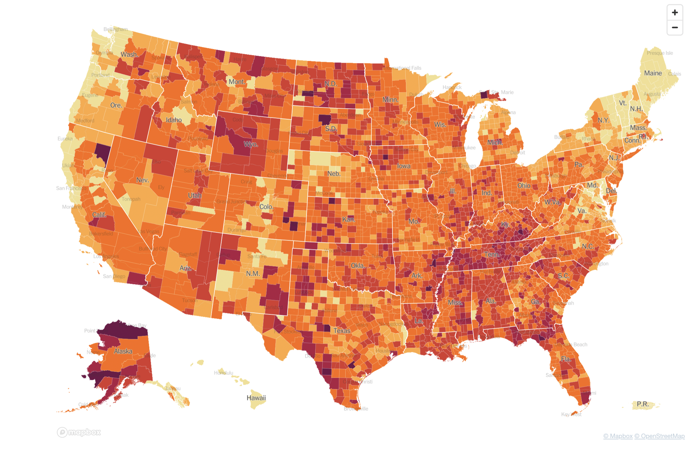
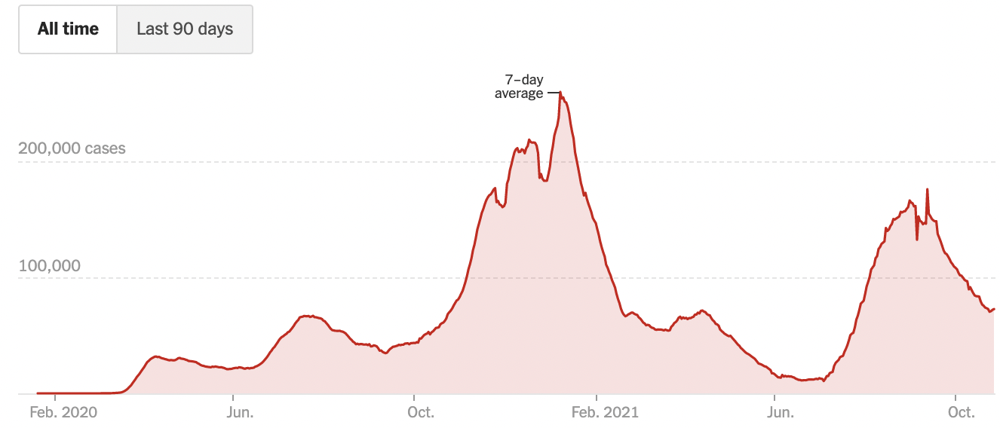
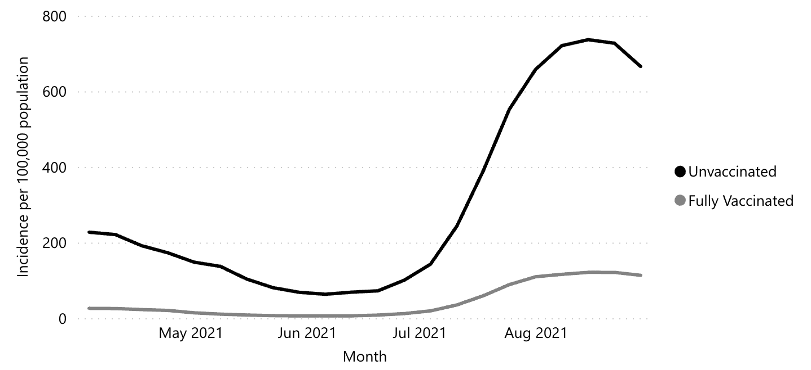
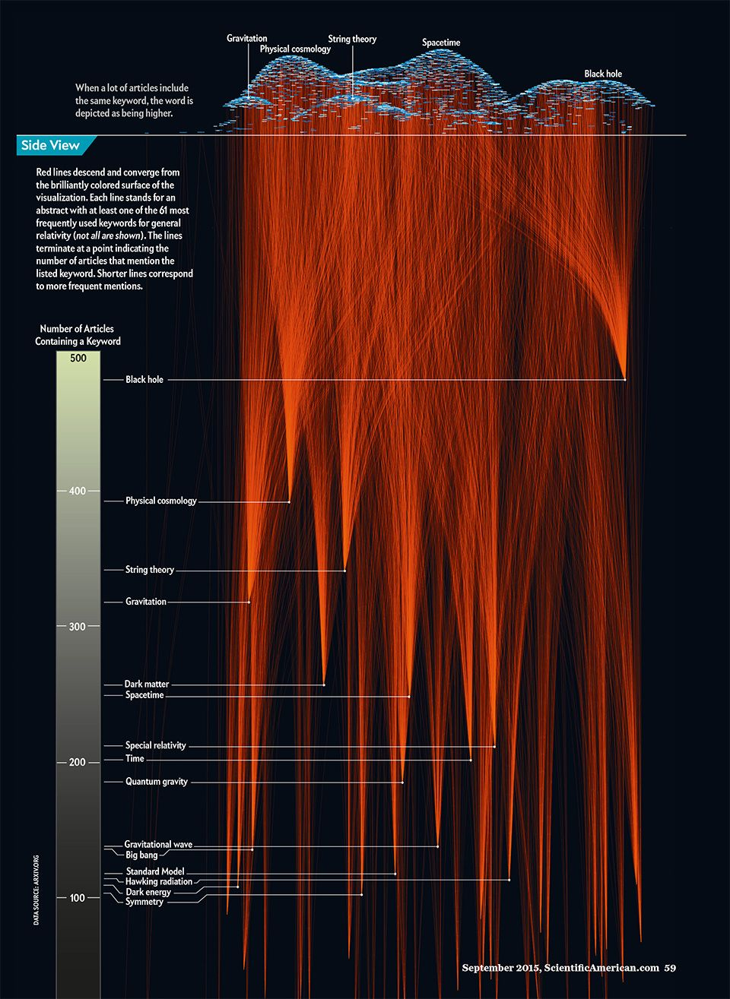
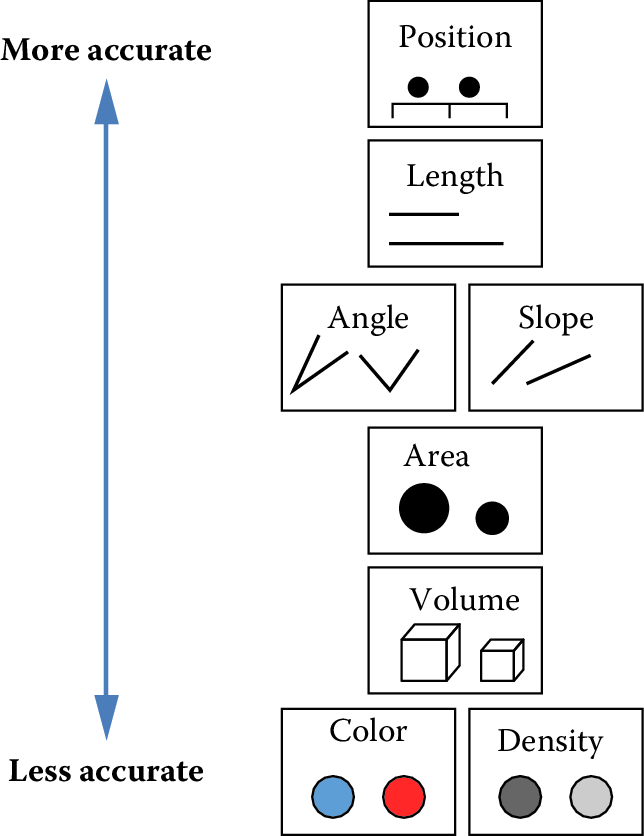
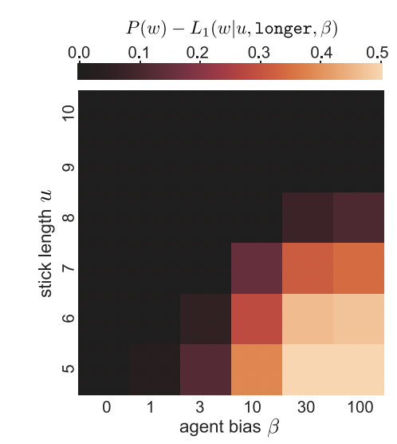
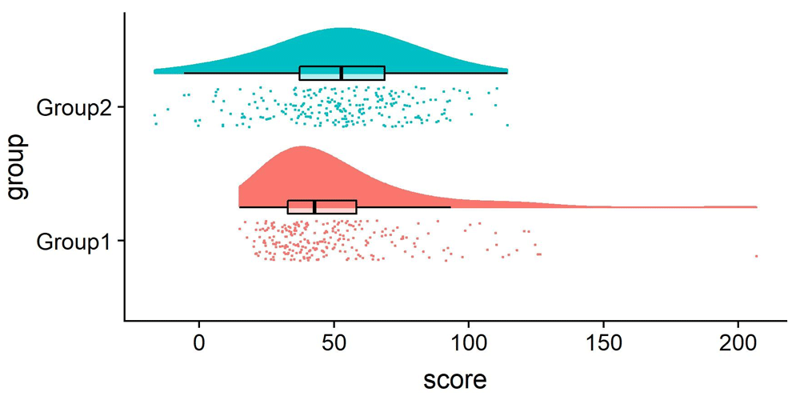
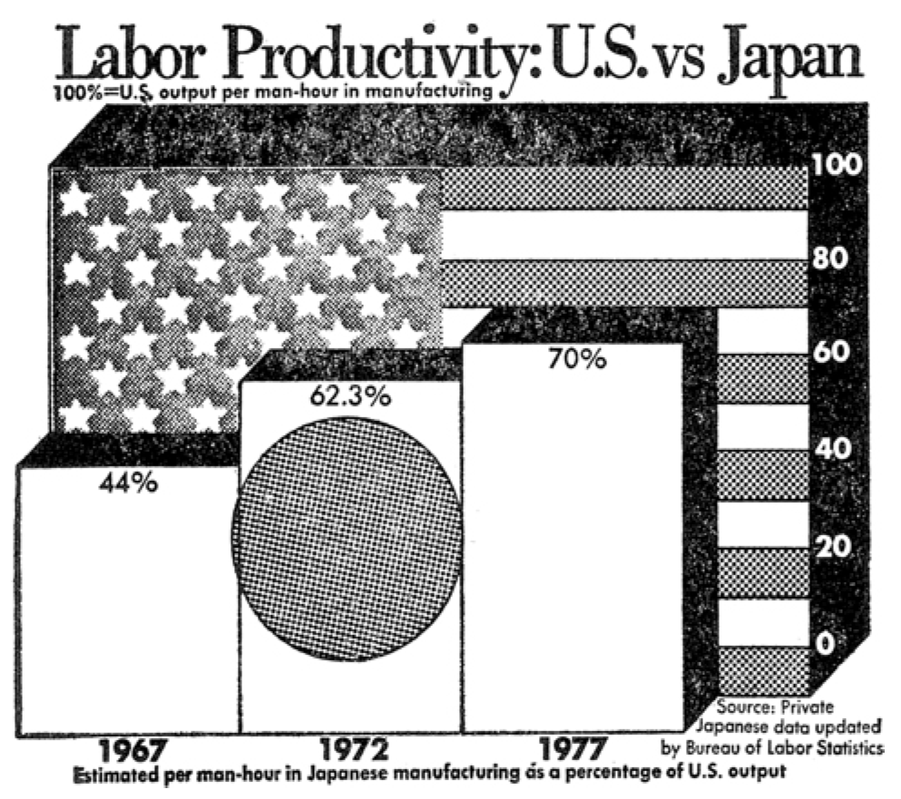
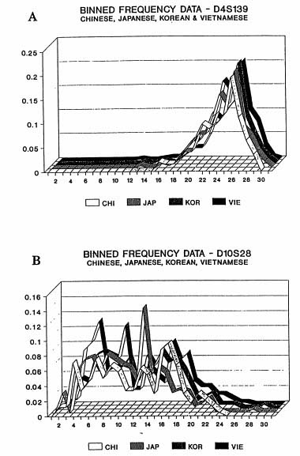
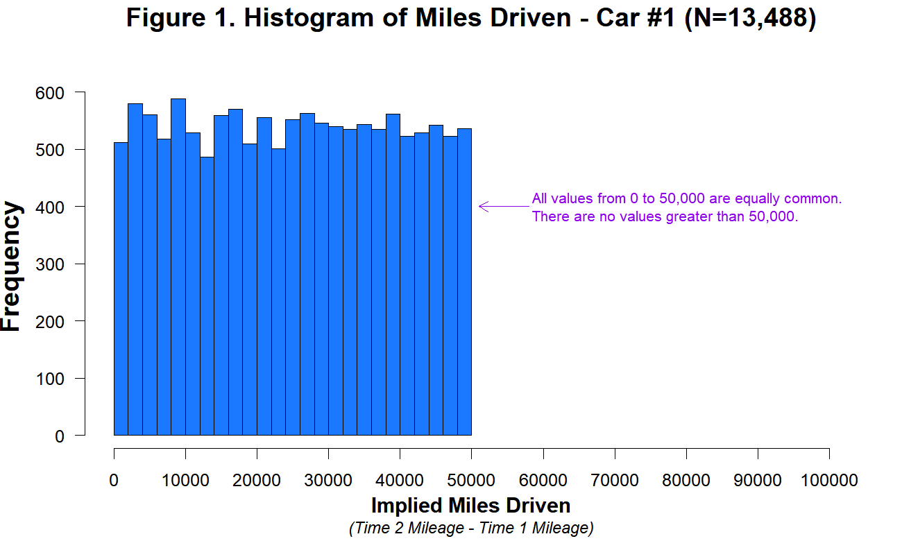

# Visualization {#viz}

::: {.box data-box="learning_goals"}
- Analyze the principles behind informative visualizations
- Incorporate visualization into an analysis workflow
- Learn to make "the design plot"
- Select different visualizations of variability and distribution
- Connect visualization concepts to measurement principles
:::

What makes visualizations so useful, and what role do they play in the toolkit of experimentology?
Simply put, data visualization is the act of "making the invisible visible." 
Our visual systems are remarkably powerful pattern detectors, and relationships that aren't at all clear when scanning through rows of raw data can immediately jump out at us when presented in an appropriate graphical form [@zacks2020designing].
Good visualizations aim to deliberately harness this power and put it to work at every stage of the research process, from the quick sanity checks we run when first reading in our data to the publication-quality figures we design when we are ready to communicate our findings.
Yet our powerful pattern detectors can also be a liability; if we're not careful, we can easily be fooled into seeing patterns that are unreliable or even misleading.
As psychology moves into an era of bigger data and more complex behaviors, we become increasingly reliant on **data visualization literacy** [@borner2019data] to make sense of what is going on.

::: {.box data-box="case_study" data-title="Mapping a pandemic"}

```{r viz-cholera, fig.cap="Mapping out a cholera epidemic (1854). Line shows region for which Broad Street pump is nearest.", boxfigure=TRUE}
knitr::include_graphics("images/viz/snow_cholera_voronoi.jpeg")
```

In 1854, a deadly outbreak of cholera was sweeping through London.
The scientific consensus at the time was that diseases like cholera spread through breathing poisonous and foul-smelling vapors, an idea known as the "miasma theory" [@halliday2001death].
An obstetrician and anesthesiologist named John Snow, however, had proposed an alternative theory: rather than spreading through foul air, he thought that cholera was spreading through a polluted water supply [@snow1855mode].
To make a public case for this idea, he started counting cholera deaths.
He marked each case on a map of the area, and indicated the locations of the water pumps for reference.
Furthermore, a line could be drawn representing the region that was closest to each water pump, a technique which is now known as a [Voronoi diagram](https://en.wikipedia.org/wiki/Voronoi_diagram).
The resulting illustration clearly reveals that cases clustered around an area called Golden Square, which received water from a pump on Broad Street (\@ref(fig:viz-cholera)).
Although the precise causal role of these maps in Snow's own thinking is disputed, and it is likely that he produced them well after the incident [@brody2000map], they have nonetheless played a significant role in the history of data visualization [@friendly2021history].
<!-- ^[Actually, the use of disease maps goes back even further! @seaman1798inquiry mapped an outbreak of yellow fever in New York City to argue that deaths clustered around a handful of waste sites. He turned out to be right, but for the wrong reasons! These waste sites were breeding grounds for mosquitoes, which were the real culprits. Coincidentally, Seaman is also known as the first to introduce vaccines to the United States. He vaccinated his children against smallpox and later organized a program to provide free vaccines to the public.] -->

Nearly two centuries later, as the COVID-19 pandemic swept through the world, governmental agencies like the [CDC](https://covid.cdc.gov/covid-data-tracker) produced maps of the outbreak that became much more familiar (Figure \@ref(fig:viz-covid)). 

```{r viz-covid, fig.cap="Map showing the known locations of cumulative coronavirus cases by share of the population in each county (reproduced from the New York Times)", boxfigure=TRUE}

```

These maps make abstract statistics visible: By assigning higher cumulative case rates to darker colors, we can see at a glance which areas have been most affected.
And we're not limited by the spatial layout of a map.
We're now also used to seeing the horizontal axis correspond to *time* and the vertical axis correspond to some value at that time.
Curves like the following, showing the 7-day average of new cases, allow us to see other patterns, like the *rate of change*.
Even though more and more cases accumulate every day, we can see at a glance the different "waves" of cases, and when they peaked (Figure \@ref(fig:viz-cases)). 

```{r viz-cases, fig.cap="7-day average of new reported COVID cases (reproduced from the New York Times)", boxfigure=TRUE}

```

While these visualizations capture purely descriptive statistics, we often want our visualizations to answer more specific questions.
For example, we may ask about the effectiveness of vaccinations: how do case rates differ across vaccinated and unvaccinated populations?
In this case, we may talk about "breaking out" a curve by some other variable, like vaccination status (Figure \@ref(fig:viz-cases2)). 

(ref:cases2-cap) Rates of COVID cases by vaccination status (reproduced from [`covid.cdc.gov`](https://covid.cdc.gov/covid-data-tracker/#rates-by-vaccine-status)).

```{r viz-cases2, fig.cap="(ref:cases2-cap)", boxfigure=TRUE}

```

From this visualization, we can see that unvaccinated individuals are about 6x more likely to test positive. At the same time, these visualizations were produced using *observational* data, which makes it challenging to draw causal inferences.
For example, people were not randomly assigned to vaccination conditions, and those who have avoided vaccinations may differ in other ways than those who sought out vaccinations.
Additionally, you may have noticed that these visualizations typically do not give a sense of the raw data, the sample sizes of each group, or uncertainty about the estimates. 
In this chapter, we will explore how to use visualizations in our own carefully controlled psychology experiments, which license stronger causal inferences.
:::

## Basic principles of (confirmatory) visualization

In this section, we begin by introducing a few simple guidelines to keep in mind when making informative visualizations in the context of experimental psychology.^[For the purposes of understanding the examples in this chapter, it should be sufficient to work through the tutorials on data manipulation and visualization in Appendices \@ref(tidyverse) and \@ref(ggplot).]
Remember that our needs may be distinct from other fields, such as journalism or public policy.
You may have seen beautiful and engaging full-page graphics with small print and a wealth of information.
The art of designing and producing these graphics is typically known as **infoviz** and should be distinguished from what we call **statistical visualization** [@gelman2013].

Roughly, infoviz aims to construct rich and immersive worlds to visually explore: a reader can spend hours pouring over the most intricate graphics and continue to find new and intriguing patterns.
**Statistical visualization**, on the other hand, aims to crisply convey the logic of a specific inference at a glance.
These visualizations are the production-ready figures that anchor the results section of a paper and accompany the key, pre-registered analyses of interest.
In this section, we review several basic principles of making statistical visualizations.
We then return below to the role of visualization in more exploratory analyses.

```{r viz-infoviz, fig.margin=TRUE, fig.cap = "Unlike statistical visualization, which aims to clearly expose the logic of an experiment at a glance, infoviz aims to provide a rich world of patterns to explore [reproduced from @infoviz]."}

```


### Principle 1: Show the design

There are so many different kinds of graphs (bar graphs, line graphs, scatter plots, and pie charts) and so many different possible attributes of those graphs (colors, sizes, line types).
How do we begin to decide how to navigate these decisions?
The first principle guiding good statistical visualizations is to *show the design* of your experiment. 

The first confirmatory plot you shuld have in mind for your experiment is the **design plot**.
Analogous to the "default model" in Chapter \@ref(models), the design plot should show the key dependent variable of the experiment, broken down by all of the key manipulations.
Critically, design plots should neither omit particular manipulations because they didn't yield an effect or include extra covariates because they seemed interesting after looking at the data.
Both of these steps are the visual analogue of p-hacking! Instead, the design plot is the "preregistered analysis" of your visualization: it illustrates a first look at the estimated causal effects from your experimental manipulations. In the words of @coppock2019, "visualize as you randomize"!^[It can sometimes be a challenge to represent the full pattern of manipulations from an experiment in a single plot. Below we give some tricks for maximizing the legible information in your plot. But if you have tried these and your design plot still looks crowded and messy, that could be an indication that your experiment is manipulating too many things at once!]

There are strong (unwritten) conventions about how your confirmatory analysis is expected to map onto graphical elements, and following these conventions can minimize confusion.
Start with the variables you manipulate, and make sure they are clearly visible.
Conventionally, the primary manipulation of interest (e.g. condition) goes on the x-axis, and the primary measurement of interest (e.g. responses) goes on the y-axis.
Other critical variables of interest (e.g. secondary manipulations, demographics) are then assigned to "visual variables" (e.g. color, shape, or size).

::: {.box data-box="code"}
The visualization library `ggplot` (see Appendix \@ref(ggplot)) makes the mapping of variables in the data to visual data. The first part of a ggplot call is an `aesthetics` layer:

```{r, eval=FALSE, echo=TRUE}
aes(
  x = ...,
  y = ...,
  color = ...,
  linetype = ...,
)
```

The aesthetics layer serves as a statement of how data are mapped to "marks" on the plot. This transparent mapping makes it very easy to explore different plot types by changing that `aes` statement, as we'll see below. 
:::

As an example, we will consider the data from @stiller2015 that we explored back in Chapter \@ref(models).
Because this experiment was a developmental study, the primary independent variable of interest is the age group of participants (ages 2, 3, or 4).
So age gets assigned to the horizontal (x) axis.
The dependent variable is accuracy: the proportion of trials that a participant made the correct response (out of 4 trials).
So accuracy goes on the vertical (y) axis.
Now, we have two other variables that we might want to show: the condition (experimental vs. control) and the type of stimuli (houses, beds, and plates of pasta).
When we think about it, though, only condition is central to exposing the design.
While we might be interested in whether some types of stimuli are systematically easier or harder than others, condition is more central for understanding the *logic* of the study.

### Principle 2: Facilitate comparison

```{r viz-hierarchy, fig.margin = TRUE, fig.cap = "Principles of visual perception can help guide visualization choices. Reproduced from @mackinlay1986automating (see also @cleveland1984graphical)"}

```

Now that you've mapped elements of your design to the figure's axes, how do you decide which graphical elements to display?
You might think: well, in principle, these assignments are all arbitrary anyway.
As long as we clearly label our choices, it shouldn't matter whether we use lines, points, bars, colors, textures, or shapes.
It's true that there are many ways to show the same data.
But being thoughtful about our choices can make it much easier for readers to interpret our findings.
The second principle of statistical visualizations is to *facilitate comparison* along the dimensions relevant to our scientific questions.
It is easier for our visual system to accurately compare the location of elements (e.g. noticing that one point is a certain distance away from another) than to compare their areas or colors (e.g. noticing that one point is bigger or brighter than another).
Figure \@ref(fig:viz-hierarchy) shows an ordering of visual variables based on how accurate our visual system is in making comparisons.

```{r viz-prepost1}
d <- read_csv("https://raw.githubusercontent.com/langcog/experimentology/main/data/tidyverse/stiller_scales_data.csv") |>
  mutate(age_group = cut(age, 2:5, include.lowest = TRUE),
         condition = factor(ifelse(condition == "Label", "Experimental", "Control")))
```

For example, we *could* start by plotting the accuracy of each age group as colors (Figure \@ref(fig:viz-prepost2)).

::: {.box data-box="code"}
To make this (bad) visualization, we used a `ggplot` function called `geom_tile()`.

```{r eval=FALSE, echo=TRUE}
d |>
  group_by(condition, age_group) |>
  summarise(rating = mean(correct)) |>
  ggplot(aes(x = age_group, y = condition, fill = rating)) +
    geom_tile()
```

`geom_tile()` is commonly used to make [heat maps](https://en.wikipedia.org/wiki/Heat_map): for each value of some pair of variables (x, y), it shows a color representing the magnitude of a third variable (z).
While a heat map is a silly way to visualize the @stiller2015 data, consider using `geom_tile()` when you have a pair of continuous variables, each taking a large range of values.
In these cases, bar plots and line plots tend to get extremely cluttered, making it hard to see the relationship between the variables.
Heat maps help these relationships to pop out as clear "hot" and "cold" regions.
For example, in @barnett2022, a heatmap was used to show a specific range of parameters where an effect of interest emerged (see Figure \@ref(fig:viz-heatmap)).

```{r viz-heatmap, fig.cap = "Heatmap showing a specific range of continuous parameters where an effect emerged [reproduced from @barnett2022].", boxfigure=TRUE}

```
:::

```{r viz-prepost2, fig.cap = "A first visualization of the Stiller et al. (2015) data."}
d |>
  group_by(condition, age_group) |>
  summarise(rating = mean(correct)) |>
  ggplot(aes(x = age_group, y = condition, fill = rating)) +
    geom_tile()
```

Or as sizes/areas (Figure \@ref(fig:viz-prepost3)).

::: {.box data-box="code"}
To make this (bad) visualization, we mapped the rating DV to the `size` element in our `aes()` call.

```{r eval=FALSE, echo=TRUE}
d |>
  group_by(condition, age_group) |>
  summarise(rating = mean(correct)) |>
  ggplot(aes(x = age_group, y = condition, size = rating)) +
    geom_point()
```
:::

```{r viz-prepost3, fig.cap = "Iterating on the Stiller data."}
d |>
  group_by(condition, age_group) |>
  summarise(rating = mean(correct)) |>
  ggplot(aes(x = age_group, y = condition, size = rating)) +
    geom_point()
```

These plots allow us to see that one condition is (qualitatively) bigger than others, but it's hard to tell how much bigger. 
Additionally, this way of plotting the data places equal emphasis on age and condition, but we may instead have in mind particular contrasts, like the *change* across ages and how that change differs across conditions.
An alternative is to show six bars: three on the left showing the 'experimental' phase and three on the right showing the 'control' phase.
Maybe the age groups then are represented as different colors, as in Figure \@ref(fig:viz-prepost4).

::: {.box data-box="code"}
We make bar plots using the `ggplot` function `geom_bar()`.
By default, it creates 'stacked' bar plots, where all values associated with the same x value (here, condition) get stacked up on top of one another.
Stacked bar plots can be useful if, for example, you're plotting proportions that sum up to 1, or want to show how some big count is broken down into subcategories.
It's also common to use `geom_area()` for this purpose, which connects adjacent regions.
But the more common bar plot used in psychology puts the bars next to one another, or 'dodges' them.
To accomplish this, we use the `position="dodge"` parameter:

```{r eval=FALSE, echo=TRUE}
d |>
  group_by(condition, age_group) |>
  summarise(rating = mean(correct)) |>
  ggplot(aes(x = condition, y = rating, fill = age_group)) +
    geom_bar(stat = "identity", position = "dodge")
```
:::

```{r viz-prepost4, fig.cap = "A bar graph of the Stiller data."}
d |>
  group_by(condition, age_group) |>
  summarise(rating = mean(correct)) |>
  ggplot(aes(x = condition, y = rating, fill = age_group)) +
    geom_bar(stat = "identity", position = "dodge")
```

This plot is slightly better: it's easier to compare the heights of bars than the 'blueness' of squares, and mapping age to color draws our eye to those contrasts.
However, we can do even better by noticing that our experiment was designed to test an *interaction*.
That statistic of interest is a difference of differences.
To what extent does the developmental change in performance on the experimental condition different from developmental change in performance on the control condition?
Some researchers have gotten proficient at reading off interactions from bar plots, but they also require a complex set of eye movements. 
We have to look at the pattern across the bars on the left, and then jump over to the bars on the right, and implicitly judge one difference against the other: the actual statistic isn't explicitly shown anywhere!
What could help facilitate this comparison?
Consider the line plot in Figure \@ref(fig:viz-prepost5). 

```{r viz-prepost5, fig.cap = "A line graph of the Stiller data promotes comparison."}
d |> 
  group_by(condition, age_group) |>
  summarise(rating = mean(correct)) |>
  ggplot(aes(x = age_group, y = rating, color = condition, group = condition)) +
    geom_point() +
    geom_line() +
    ylab("Proportion correct")
```

The interaction contrast we want to interpret is highlighted visually in this plot.
It is much easier to compare the slopes of two lines than mentally compute a difference of differences between four bars.
A few corollaries of this principle [see this helpful presentation from Karl Broman](https://www.biostat.wisc.edu/~kbroman/presentations/IowaState2013/graphs_combined.pdf):

* It is easier to compare values that are *adjacent* to one another. This is especially important when there are many different conditions included on the same plot. If particular sets of conditions are of theoretical interest, place them close to one another. Otherwise, sort conditions by a meaningful value (rather than alphabetically, which is usually the default for plotting software).

* When possible, color-code labels and place them directly next to data rather than in a separate legend. Legends force readers to glance back and forth to remember what different colors or lines mean. 

* When making histograms or density plots, it is challenging to compare distributions when they are placed side-by-side. Instead, facilitate comparison of distributions by vertically aligning them, or making them transparent and placed on the same axes.

* If the scale makes it hard to see important differences, consider transforming the data (e.g. taking the logarithm).

* When making bar plots, be very careful about the vertical y-axis. A classic "misleading visualization" mistake is to cut off the bottom of the bars by placing the endpoint of the y-axis at some arbitrary value near the smallest data point. This is misleading because people interpret bar plots in terms of the relative *area* of the bars (i.e. the amount of ink taken up by the bar), not just their absolute y-values. If the difference between data points is very small relative to the overall scale (e.g. means of 32 vs. 33 on a scale from 0 to 100), then using a scale with limits of 31 and 33 would make one bar look twice as big as the other! Conversely, if plotting means from Likert scales with a minimum value of 1, then starting the scale at 0 would shrink the effective difference! If you must use bars, use the natural end points of your measure (see Chapter \@ref(measurement)). Otherwise, consider dropping the bars and allowing the data points to 'float' with error bars.

* If a key variable from your design is mapped to color, choose the color scale carefully. For example, if the variable is binary or categorical, choose visually distinct colors to maximize contrast (e.g. black, blue, and orange). If the variable is ordinal or continuous, use a color gradient. If there is a natural midpoint (e.g. if some values are negative and some are positive), consider using a diverging scale (e.g. different colors at each extreme). Remember also that a portion of your audience may be color-blind. Palettes like [viridis](https://cran.r-project.org/web/packages/viridis/vignettes/intro-to-viridis.html) have been designed to be colorblind-friendly and also perceptually uniform (i.e. the perceived difference between 0.1 and 0.2 is approximately the same as the difference between 0.8 and 0.9). Finally, if the same manipulation or variable appears across multiple figures in your paper, keep the color mapping consistent: it is confusing if "red" means something different from figure to figure. 


### Principle 3: Show the data

Looking at older papers, you may be alarmed to notice how little information is contained in the graphs.
The worst offenders might show just two bars, representing average values for two conditions.
This kind of plot adds very little beyond a sentence in the text reporting the means, but it can also be seriously misleading.
It hides real variation in the data, making a noisy effect based on a few data points look the same as a more systematic one based on a larger sample.
Additionally, it collapses the *distribution* of the data, making a multi-modal distribution look the same as a unimodal one. 
The third principle of modern statistical visualization is to *show the data* and visualize variability in some form.

The most minimal form of this principle is to *always include error bars*.^[And be sure to tell the reader what the error bars represent -- a 95% confidence interval? a standard error of the mean? -- without this information, error bars are hard to interpret (see Depth box below).]
Error bars turn a purely descriptive visualization into an inferential one. 
They represent a minimal form of uncertainty about the possible statistics that might have been observed, not just the one that was actually observed. 
Figure \@ref(fig:viz-show-data1) shows the Stiller data with error bars. 
<!-- As such, they allow the viewer to interpret the means as *estimates*.  -->

::: {.box data-box="code"}
A common problem arises when we want to add error bars to a dodged bar plot.
Naively, we'd expect we could just dodge the error bars in the same way we dodged the bars themselves:

```{r eval=FALSE, echo=TRUE}
geom_bar(position = "dodge") +
geom_errorbar(aes(ymin = ci_lower, ymax = ci_upper), position = "dodge")
```

But this doesn't work! The rationale is kind of technical, but the width of the error bars is much narrower than the width of the bars, so we need to manually specify how much to dodge the error bars with the `position_dodge()` function:

```{r eval=FALSE, echo=TRUE}
geom_bar(position = position_dodge()) +
geom_errorbar(aes(ymin = ci_lower, ymax = ci_upper), 
              position = position_dodge(width = 0.9))
```

This does the trick!
:::

```{r viz-show-data1, fig.cap = "Error bars (95\\% CIs) added to the Stiller data line graph."}
d |> 
  group_by(condition, age_group) |>
  tidyboot::tidyboot_mean(correct) |>
  ggplot(aes(x = age_group, y = empirical_stat, color = condition, group = condition)) +
    geom_point() +
    geom_errorbar(aes(ymin = ci_lower, ymax = ci_upper), width = 0) +
    geom_line() +
    labs(y = "Mean Accuracy")
```

But we can do even better. 
By overlaying the distribution of the actual data points on the same plot, we can give the reader information not just about the statistical inferences but the underlying data supporting those inferences.
In the case of the @stiller2015 study, data points for individual trials are binary (correct or incorrect).
It's technically possible to show individual responses as dots at 0s and 1s, but this doesn't tell us much (we'll just get a big clump of 0s and a big clump of 1s).
The question to ask yourself when 'showing the data' is: what are the theoretically meaningful *units* of variation in the data?
This question is closely related to our discussion of mixed-effects models in Chapter \@ref(models), when we considered which random effects we should include.
Here, a reader is likely to wonder how much variance was found across *different children* in a given age group.
To show such variation, we aggregate to calculate an accuracy score for each participant.^[While participant-level variation is a good default, the relevant level of aggregation may differ across designs. For example, collective behavior studies may choose to show the data point for each *group*. This choice of unit is also important when generating error bars: if you have a small number of participants but many observations per participant, you are faced with a choice. You may either bootstrap over the flat list of all individual observation (yielding very small error bars), or you may first aggregate within participants (yielding larger error bars that account for the fact that repeated observations from the same participant are not independent).].

There are many ways of showing the resulting distribution of participant-level data.
For example, a **boxplot** shows the median (a horizontal line) in the center of a box extending from the lower quartile (25%) to the upper quartile (75%).
Lines then extend out to the biggest and smallest values (excluding outliers, which are shown as dots). Figure \@ref(fig:viz-show-data2) gives the boxplots for the Stiller data, which don't look that informative -- perhaps because of the coarseness of individual participant averages due to the small number of trials. 

::: {.box data-box="code"}
In `ggplot`, we can make box plots using the `geom_boxplot` command:

```{r eval=FALSE, echo=TRUE}
geom_boxplot(alpha = 0.8)
```

A common problem to run into is that `geom_boxplot` requires the variable assigned to `x` to discrete.
If you have discrete levels of a numeric variable (e.g. age groups), make sure you've actually converted that variable to a `factor`.
Otherwise, if it's still coded as `numeric`, `ggplot` will collapse all of the levels together!
:::

```{r viz-show-data2, fig.cap = "Boxplot of the Stiller data."}
d |>
group_by(condition, age_group, subid) |>
summarize(rating = mean(correct)) |>
  ggplot(aes(x = age_group, y = rating, color = condition)) +
    geom_boxplot(alpha = 0.8)
```

It is also common to show the raw data as jittered values with low transparency.
In Figure \@ref(fig:viz-show-data3), we jitter the points because many participants have the same numbers (e.g. 50%) and if they overlap it is hard to see how many points there are.


::: {.box data-box="code"}
Adding the jittered points is simple using `geom_jitter`, but we are starting to have a fairly complex plot so maybe it's worth taking stock of how we get there. 

To plot both *condition* means and *participant* means, we need to create two different data frames. Here `mss` is a data frame of means for each participant; `ms` is a data frame with means and confidence intervals *across* participants. For this purpose, we use the `tidyboot` package and the `tidyboot_mean` function, which gives us bootstrapped 95% confidence intervals for the means. 

```{r eval=FALSE, echo=TRUE}
mss <- d |> 
  group_by(condition, age_group, subid) |>
  summarize(rating = mean(correct)) 

ms <- mss |>
  group_by(condition, age_group) |>
  tidyboot::tidyboot_mean(rating) 
```

With these two dataframes in hand, we can now make our `ggplot`. 

```{r eval=FALSE, echo=TRUE}
ggplot(ms, 
       aes(x = age_group, y = empirical_stat, color = condition, group = condition)) +
    geom_pointrange(aes(ymin = ci_lower, ymax = ci_upper)) +
    geom_line() +
    geom_jitter(data = mss, aes(x = age_group, y = rating, color = condition),
                alpha = 0.25, width = 0.1) +
    ylab("mean response")
```

The most noteworthy aspect of this code is that the `geom_jitter` argument doesn't just take a different aesthetic, it also takes a different dataframe altogether! Mixing dataframes can be an important tool for creating complex plots.
:::

```{r viz-show-data3, fig.cap = "Jittered points representing the data distribution of the Stiller data."}
mss <- d |> 
  group_by(condition, age_group, subid) |>
  summarize(rating = mean(correct)) 

ms <- mss |>
  group_by(condition, age_group) |>
  tidyboot::tidyboot_mean(rating) 

ggplot(ms, 
       aes(x = age_group, y = empirical_stat, color = condition, group = condition)) +
    geom_pointrange(aes(ymin = ci_lower, ymax = ci_upper)) +
    geom_line() +
    geom_jitter(data = mss, aes(x = age_group, y = rating, color = condition),
                alpha = 0.25, width = 0.1) +
    ylab("mean response")
```

Perhaps the format that takes this principle the furthest is the so-called "raincloud plot" [@allen2019raincloud] shown in Figure \@ref(fig:viz-raincloud).
A raincloud plot combines the raw data (the "rain") with a smoothed density (the "cloud") and a boxplot giving the median and quartiles of the distribution. 

```{r viz-raincloud, fig.cap="Example of a raincloud plot, reproduced from @allen2019raincloud."}

# TODO: latex errors on this image for no apparent reason!
```


::: {.box data-box="depth" data-title="Visualizing uncertainty with error bars"}

One common misconception is that error bars are a measure of variance *in the data*, like the standard deviation of the response variable.
Instead, they typically represent a measure of precision extracted from the statistical model.
In older papers, for example, it was common to use the standard error of the mean (SEM; see Chapter \@ref(inference)).
Remember that this is not the standard deviation of the data distribution but of the *sampling distribution* of the mean that is being estimated. 
Given the central limit theorem, which tells us that this sampling distribution is asymptotically normal, it was straightforward to estimate the standard error analytically using the empirical standard deviation of the data divided by the square root of the sample size: `sd(x) / sqrt(length(x))`.
Error bars based on the SEM often looked misleadingly small, as they only represent a 68% interval of the sampling distribution and go to zero quickly as a function of sample size.
As a result, it became more common to show the 95\% confidence interval instead: [-1.96 $\times$ SEM, 1.96 $\times$ SEM].

While these analytic equations remain common, an increasingly popular alternative is to *bootstrap* confidence intervals.
A deep theoretical understanding of the bootstrap technique is outside the scope of this text, but you can think of it as a way of deriving a sampling distribution from your dataset using *simulations* instead of mathematical derivations about the properties of the sampling distribution.
The bootstrap is a powerfully generic technique, especially when you want to show error bars for summary statistics that are more complex than means, where we do not have such convenient asymptotic guarantees and "closed-form" equations.
For example, suppose you are working with a skewed response variable or a dataset with clear outliers, and you want to estimate medians and quartiles.  
Or suppose you want to estimate proportions from categorical data, or a more *ad hoc* statistic like the AUC (area underneath the curve) in a  hierarchical design where it is not clear how to aggregate across items or participants in a mixed-effects model. 
Analytic estimators of confidence intervals can in principle be derived for these statistics, subject to different assumptions, but it is often more transparent and reliable in practice to use the bootstrap. 
As long as you can write a code snippet to compute a value from a dataset, you can use the bootstrap. 

```{r viz-boot, fig.cap="Three different error bars for the Stiller data: bootstrapped 95\\% confidence intervals (left), standard error of the mean (middle), and analytically computed confidence intervals (right).", boxfigure=TRUE}
boot <- d |> 
  group_by(condition, age_group, subid) |>
  summarize(rating = mean(correct)) |>
  group_by(condition, age_group) |>
  tidyboot::tidyboot_mean(rating) |>
  select(-n, -mean) |>
  mutate(method = "bootstrapped 95% CI")

ci_sem <- d |>
  group_by(condition, age_group, subid) |>
  summarize(rating = mean(correct)) |>
  group_by(condition, age_group) |>
  summarise(empirical_stat = mean(rating), 
            sem = sd(rating)/sqrt(length(rating)),
            ci_lower = mean(rating) - sem,
            ci_upper = mean(rating) + sem) |>
  mutate(method = "standard error")

ci_ci <- ci_sem |>
  mutate(ci_lower = empirical_stat - 1.96 * sem,
         ci_upper = empirical_stat + 1.96 * sem) |>
  mutate(method = "analytic 95% CI")

bind_rows(boot, ci_sem, ci_ci) |>
  ggplot(aes(x = age_group, y = empirical_stat, 
             color = condition, group = condition)) +
    geom_point() +
    geom_errorbar(aes(ymin = ci_lower, ymax = ci_upper), width = 0) +
    geom_line() +
    facet_wrap(~ method) +
    labs(y = "mean response") +
    theme_few() +
    theme(aspect.ratio = 1)
```

As we can see, the bootstrapped 95% CI looks similar to the analytic 95% CI derived from the standard error, except the upper and lower limits are slightly asymmetric (reflecting outliers in one direction or another). 
Of course, the bootstrap is not a silver bullet and can be abused in particularly small samples. 
This is because the bootstrap is fundamentally limited to the sample we run it on. 
It can be expected to be reasonably accurate if the sample is reasonably representative of the population.
But at the end of the day, as they say, "there's no such thing as a free lunch."
In other words, we cannot magically pull more information out of a small sample without making additional assumptions about the data generating process.
:::

### Principle 4: Maximize information, minimize ink

Now that we have the basic graphical elements in place to show our design and data, it might seem like the rest is purely a matter of aesthetic preference, like choosing a pretty color scheme or font. Not so. 

There are well-founded principles to make the difference between an effective visualization and a confusing or obfuscating one.
Simply put, we should try to use the simplest possible presentation of the maximal amount of information: we should maximize the "data-ink ratio".
To calculate the amount of information shown, @tufte2001visual suggested a measure called the "data density index," the "numbers plotted per square inch".
The worst offenders have a very low density while also using a lot of excess ink (e.g., Figures \@ref(fig:viz-bad) and \@ref(fig:viz-bad2))

```{r viz-bad, fig.margin = TRUE, fig.cap = "This figure uses a lot to ink to show exactly three numbers, for a \"ddi\" of $0.2$ [This came from the Washington Post, 1978; see @wainer1984display for other examples]."}

```

```{r viz-bad2, fig.margin = TRUE, fig.cap = "This figure uses complicated 3D ribbons to compare distributions across four countries [from @roeder1994dna]. How could the same data have been presented more legibly?"}

```

The defaults in modern visualization libraries like `ggplot` prevent some of the worst offenses, but are still often suboptimal.
For example: consider whether the visual complexity introduced by the default grey background and grid lines in Figure \@ref(fig:viz-themes0) is justified, or whether a more minimal theme would be sufficient (see the [`ggthemes`](https://yutannihilation.github.io/allYourFigureAreBelongToUs/ggthemes/) package for a good collection of themes). 

```{r viz-themes0, fig.cap="Standard \"gray\" themed Stiller figure."}
ggplot(ms, aes(x = age_group, y = empirical_stat, 
             color = condition, group = condition)) +
    geom_point() +
    geom_line() +
    # geom_text_repel(aes(label = condition, colour = condition), 
    #                 data = . |> filter(age_group == "(4,5]")) +
    geom_errorbar(aes(ymin = ci_lower, ymax = ci_upper), width = 0) +
    geom_jitter(aes(x = age_group, y = rating, color = condition, fill = condition), alpha = 0.25, width = 0.05, data = mss) +
    labs(x = "Age Group", y = "Mean Accuracy") +
    theme_gray()
```
Figure \@ref(fig:viz-themes) shows a slightly more "styled" version of the same plot with labels directly on the plot and a lighter-weight theme. 


::: {.box data-box="code"}
To produce the plot below, we've added a few styling elements including:

* The nice and minimal `theme_few` from the `ggthemes` package.
* A corresponding color palette (`scale_colour_few`) from the same package. 
* Manual specification of the aspect ratio (`theme(aspect.ratio = 1)`).
* Direct labels using the `geom_text_repel` call from `ggrepel`. 

This last item is a bit trickier to implement. To do so, we select one set of points to label and feed these in as a filtered data frame. A few manual arguments customize the placement of the labels (you can spend hours tweaking this sort of thing by hand).

```{r eval=FALSE, echo=TRUE}
geom_text_repel(data = ms |> filter(age_group == "(3,4]"),
                aes(label = condition, colour = condition), 
                nudge_y = .1, nudge_x = .5, segment.color = NA)
```

:::

```{r viz-themes, fig.cap="Custom themed Stiller figure with direct labels."}
library(ggrepel)

ggplot(ms, aes(x = age_group, y = empirical_stat, 
             color = condition, group = condition)) +
    geom_point() +
    geom_line() +
    geom_text_repel(aes(label = condition, colour = condition), 
                    data = ms |> filter(age_group == "(3,4]"), 
                    nudge_y = .1, nudge_x = .5, segment.color = NA) +
    geom_errorbar(aes(ymin = ci_lower, ymax = ci_upper), width = 0) +
    geom_jitter(aes(x = age_group, y = rating, color = condition, fill = condition), alpha = 0.25, width = 0.05, data = mss) +
    labs(x = "Age Group", y = "Mean Accuracy") +
    scale_colour_few() +
    theme_few() +
    theme(aspect.ratio = 1, legend.position = "none") 
```


Here are a few final tips for making good confirmatory visualizations:

* Make sure the font size of all text in your figures is legible and no smaller than other text in your paper (e.g. 10pt). This change may require, for example, making the axis breaks sparser, rotating text, or changing the aspect ratio of the figure. 

* Another important tool to keep in your visualization arsenal is the **facet plot**.  When your experimental design becomes more complex, consider breaking variables out into a *grid* of facets instead of packing more and more colors and line-styles onto the same axis.  In other words, while higher information density is typically a good thing, you want to aim for the sweet spot before it becomes too dense and confusing. Remember Principle 2. When there is too much going on in every square inch, it is difficult to guide your readers eye to the comparisons that actually matter, and spreading it out across facets gives you additional control over the salient patterns.

* Sometimes these principles come into conflict, and you may need to prioritize legibility over, for example, showing all of the data. For example, suppose there is an outlier orders of magnitude away from the summary statistics. If the axis limits are zoomed out to show that point, then most of the plot will be blank space! It is reasonable to decide that it is not worth compressing the key statistical question of your visualization the bottom centimeter just to show one point. It may suffice to truncate the axes and note in the caption that a single point was excluded. 

* Fix the axis labels. A common mistake is to keep the default shorthand you used to name variables in your plotting software instead of more descriptive labels. Use consistent terminology for different manipulations in the main text and figures. If anything might be clear, explain it in the caption. 

* Different audiences may require different levels of specificity. Sometimes it is better to collapse over secondary variables (even if they are included in your statistical models) in order to control the density of the figure and draw attention to the key question of interest. 

## Exploratory visualization

So far in this chapter we have focused on principles of *confirmatory* data visualization: how to make production-quality figures that convey the key pre-registered analyses without hiding sources of variability or misleading readers about the reliability of the results.
Yet this is only one role that data visualization plays when doing science. 
An equally important role is called *exploratory visualization*: the more routine practice of understanding one's own data by visualizing it.
This role is analogous to the sense of exploratory data analyses discussed in Chapter \@ref(prereg).
We typically do not pre-register exploratory visualizations, and when we decide to include them in a paper they are typically in the service of a secondary argument (e.g., checking the robustness of an effect or validating that some assumption is satisfied).

This kind of visualization plays a ubiquitous role in a researcher's day-to-day activities.
While confirmatory visualization is primarily audience-driven and concerned with visual communication, exploratory visualization is first and foremost a "cognitive tool" for the researcher.
The first time we load in a new dataset, we start up a new feedback loop. 
We ask ourselves questions and answer them by making pictures. 
These pictures then raise further questions and are often our best tool for debugging our code.
In this section, we consider some best practices for exploratory visualization.

### Examining distributional information

```{r viz-anscombe, fig.margin = TRUE, fig.cap = "Anscombe's quartet [@anscombe1973graphs]."}
knitr::include_graphics("images/viz/viz_anscombe.png")
```

The primary advantage of exploratory visualization -- the reason it is uniquely important for data science -- is that it gives us access to holistic, distributional information that cannot be captured in any single summary statistic.
The most famous example is known as "Anscombe's quartet," a set of four datasets with identical statistics (Figure \@ref(fig:viz-anscombe)).
They have the same means, the same variances, the same correlation, the same regression line, and the same $R^2$ value. 
Yet when they are plotted, they reveal striking structural differences. 
The first looks like a noisy linear relationship -- the kind of idealized relationship we imagine when we imagine a regression line.
But the second is a perfect quadratic arc, the third is a perfectly noiseless line with a single outlier, and the fourth is nearly categorical: every observation except one shares exactly the same x-value.

If our analyses are supposed to help us distinguish between different data-generating processes, corresponding to different psychological theories, it is clear that these four datasets would correspond to dramatically different theories even though they share the same statistics.
Of course, there are arbitrarily many datasets with the same statistics, and most of these differences don't matter (this is why they are called "summary" statistics, after all!). 
Figure \@ref(fig:viz-datasaurus) shows just how bad things can get when we rely on summary statistics. 
When we operationalize a theory's predictions in terms of a single statistic (e.g., a difference between groups or a regression coefficient) we can lose track of everything else that may be going on.
Good visualizations force us to zoom out and take in the bigger picture.

```{r viz-datasaurus, fig.margin = TRUE, fig.cap = "Originally inspired by a figure constructed by [@datasaurus](http://www.thefunctionalart.com/2016/08/download-datasaurus-never-trust-summary.html) using the [drawMyData](http://robertgrantstats.co.uk/drawmydata.html) tool, we can actually construct an arbitrary number of different graphs with exactly the same statistics [@matejka2017same,@murray2021generating]. This set, known as the [The Datasaurus Dozen](https://www.autodesk.com/research/publications/same-stats-different-graphs), even has the same set of boxplots."}
knitr::include_graphics("images/viz/datasaurus.png")

```

### Data diagnostics

::: {.box data-box="accident_report" data-title="[Distributional] gorillas in our midst."}

Many data scientists don’t bother checking what their data looks like before proceeding to test specific hypotheses.
@yanai2020 cleverly designed an artificial dataset for their students to test for such blindness.
Each row of the dataset contained an individual's body mass index (BMI) and the number of steps they walked on a given day.
While the spreadsheet looked innocuous, the data was constructed such that simply plotting the raw data revealed a picture of a gorilla.
One group of 19 students was given an explicit set of hypotheses to test (e.g. about the relationship between BMI and steps).
Fourteen of these students failed to notice a gorilla, suggesting that they evaluated these hypotheses without ever visualizing their data.
Another group of 14 students were simply asked what, if anything, they could conclude (without being given explicit hypotheses).
More of these students apparently made the visualization, but five of them still failed to notice the gorilla (Figure \@ref(fig:viz-gorilla))!

```{r viz-gorilla, fig.cap="A dataset was constructed by @yanai2020 which revealed a picture of a gorilla when the raw data were plotted.", boxfigure=TRUE}
knitr::include_graphics("images/viz/gorilla.png")
```

While it may not be surprising that a group of students would take the shortest path to completing their assignment, similar concerns have been raised in much more serious cases concerning how experienced researchers could fail to notice obviously fraudulent data.
For example, when @datacolada made a simple histogram of the car mileage data reported in @shu2012signing [released publicly by @kristal2020signing], they were immediately able to observe that it followed a perfectly uniform distribution, truncated at exactly 50,000 miles (Figure \@ref(fig:viz-uniform)).
Given a little thought, this pattern should be extremely puzzling.
Over a given period of time, we would typically expect something more bell-shaped: a small number of people will drive very little (e.g., 1000 miles), a small number of people will drive a lot (e.g., 50,000 miles), and most people will fall between these tails.
So it is highly surprising to find exactly the same number of drivers in every mileage bin.
While further specialized analyses revealed further evidence of fraud (e.g. based on patterns of rounding and pairs of duplicated data points), this humble histogram was already enough to set off alarm bells.
A recurring regret raised by the co-authors of this paper is that they never thought to make this visualization before reporting their statistical tests.

```{r viz-uniform, fig.cap="A suspiciously uniform distribution abruptly cutting off at 50k miles. Ring the alarm!", boxfigure=TRUE}

```
:::

Our data are always messier than we expect.
There might be a bug in our coding scheme, a column might be mislabeled, or might contain a range of values that we didn't expect. 
Maybe our design wasn't perfectly balanced, or something went wrong with a particular participant's keyboard presses. Most of the time, it's not tractable to manually scroll through our raw data looking for such problems. Visualization is our first line of defense for the all-important process of running "data diagnostics." If there is a weird artifact in our data, it will pop out if we just make the right visualizations.

So which visualizations should we start with? The best practice is to always start by making histograms of the raw data. As an example, let's consider the rich and interesting dataset shared by Blake, McAuliffe, and colleagues [-@blake2015ontogeny] in their article "Ontogeny of fairness in seven societies." This article studies the emergence of children's reasoning about fairness -- both when it benefits them and when it harms them -- across cultures.

::: {.box data-box="code"}
If you want to follow along with this example at home, you can load the data from our repository!

```{r eval=FALSE, echo=TRUE}
d <- read_csv("https://raw.githubusercontent.com/langcog/experimentology/main/data/ontogeny_of_fairness.csv") |>
  mutate(trial_num = as.numeric(gsub(".(\\d+)", "\\1", trial)),
         trial_type = factor(eq.uneq,
                             levels = c("E","U"),
                             labels = c("Equal","Unequal")),
         condition = factor(condition,
                      levels = c("AI","DI"),
                      labels = c("Advantageous","Disadvantageous"))) |>
  arrange(country, condition, actor.id, trial_num)
```

:::

```{r viz-blake1}
d <- read_csv("data/ontogeny_of_fairness.csv") |>
  mutate(trial_num = as.numeric(gsub(".(\\d+)", "\\1", trial)),
         trial_type = factor(eq.uneq,
                             levels = c("E","U"),
                             labels = c("Equal","Unequal")),
         condition = factor(condition,
                      levels = c("AI","DI"),
                      labels = c("Advantageous","Disadvantageous")),
         age = floor(actor.age.years),
         reject = decision == "reject") |>
  arrange(country, condition, actor.id, trial_num)
```


In this study, pairs of children played the "inequity game": they sat across from one another and were given a particular allocation of snacks.
On some trials, each participant was allocated the same amount (Equal trials) and on some trials they were allocated different amounts (Unequal trials).
One participants was chosen to be the "actor" and got to choose whether to accept or reject the allocation: in the case of rejection, neither participant got anything.
The critical manipulation was between two forms of inequity.
Some pairs were assigned to the Disadvantageous condition, where the actor was allocated less than their partner on Unequal trials (e.g. 1 vs. 4).
Others were assigned to the Advantageous condition, where they were allocated more (e.g. 4 vs. 1).

The confirmatory **design plot** for this study would focus on contrasting developmental trajectories for Advantageous vs. Disadvantageous inequality.
However, this is a complex, multivariate dataset, including 866 pairs from different age groups and different testing sites across the world which used subtly different protocols.
How might we go about the process of exploratory visualization for this dataset?

### Plot data collection details

Let's start by getting a handle on some of the basic sample characteristics.
For example, how many participants were in each age bin (Figure \@ref(fig:viz-blake3))?

::: {.box data-box="code"}
Exploratory histograms are often a combination of an aggregation step and a plotting step. In the aggregation step, we make use of the convenience `count` function, which gives the number (`n`) of rows in a particular grouping. Here we `count` twice in order to get first one row per participant and then count the number of participants within each age group. 

```{r eval=FALSE, echo=TRUE}
ps_by_age <- d |>
  mutate(age = floor(actor.age.years)) |>
  count(age, actor.id) |>
  count(age) 
```

And then we plot using `ggplot`:

```{r eval=FALSE, echo=TRUE}
ggplot(ps_by_age, aes(x = age, y = n)) +
    geom_bar(stat = "identity") +
    xlim(0, 18) +
    ggthemes::theme_few()
```

An alternative (perhaps more elegant) workflow here would be to use a histogram:

```
ps_by_age <- d |>
  mutate(age = floor(actor.age.years)) |>
  count(age, actor.id) 
  
ggplot(ps_by_age, aes(x = age)) +
    geom_histogram(binwidth = 1)
```

Histograms are intended by `ggplot` to be for continuous data, however, and so they don't give the discrete bars that our earlier workflow did. 
:::


```{r viz-blake3, fig.cap="Participants by age in the Blake data."}
ps_by_age <- d |>
  count(age, actor.id) |>
  count(age) 

ggplot(ps_by_age, aes(x = age, y = n)) +
    geom_bar(stat = "identity") +
    xlim(0, 18) +
    ggthemes::theme_few()
```

How many participants were included from each country (Figure \@ref(fig:viz-blake5))?

::: {.box data-box="code"}
Here we are going to make things even terser and use a pipe chain that *includes* the ggplot, just so we are writing only a single call to produce our plot. It's up to you whether you think this enhances the readability of your code or decreases it. We find that it's sometimes useful when you don't plan on keeping the intermediate data frame for any other use than plotting.

```{r eval=FALSE, echo=TRUE}
d |>
  count(country, actor.id) |>
  count(country) |>
  mutate(country = fct_reorder(country, -n)) |>
  ggplot(aes(x = country, y = n)) +
    geom_bar(stat = "identity") 
```

If you use this technique, be careful to pipe (`|>` or `%>%`) between `tidyverse` operators but add (`+`) the `ggplot` operators!

The only other trick to point out here is that we use the `fct_reorder` call to order the levels of the `country` factor in descending order. This function is found in the very useful `forcats` package of the `tidyverse`, which contains all sorts of functions for working with factors.
:::

```{r viz-blake5, fig.cap="Participants by country in the Blake data."}
d |>
  count(country, actor.id) |>
  count(country) |>
  mutate(country = fct_reorder(country, -n)) |>
  ggplot(aes(x = country, y = n)) +
    geom_bar(stat = "identity") +
    ggthemes::theme_few()
```

Are ages roughly similar across each country (Figure \@ref(fig:viz-blake5))?

::: {.box data-box="code"}
This next plot simply combines the grouping factors of each of the last two plots, and uses `facet_wrap` to show a separate histogram by country: 

```{r eval=FALSE, echo=TRUE}
d |>
  mutate(age = floor(actor.age.years)) |>
  count(country, age, actor.id) |>
  count(country, age) |>
  mutate(country = fct_reorder(country, -n)) |>
  ggplot(aes(x = age, y = n)) +
    geom_bar(stat = "identity") +
    facet_wrap(~ country) +
    xlim(0, 18) 
```

:::

```{r viz-blake6, fig.cap="Age distribution across countries in the Blake data."}
d |>
  mutate(age = floor(actor.age.years)) |>
  count(country, age, actor.id) |>
  count(country, age) |>
  mutate(country = fct_reorder(country, -n)) |>
  ggplot(aes(x = age, y = n)) +
    geom_bar(stat = "identity") +
    facet_wrap(~ country) +
    xlim(0, 18) +
    ggthemes::theme_few() +
    theme(aspect.ratio = 1)
```

These exploratory visualizations help us read off some descriptive properties of the sample.
For example, we can see that age ranges differ somewhat across sites: the maximum age is 11 in India but 15 in Mexico.
We can also see that age groups are fairly imbalanced: in Canada, there are 18 11-year-olds but only 5 6-year-olds.

None of these properties are problematic, but seeing them gives us a degree of awareness that could shape our downstream analytic decisions.
For example, if we did not appropriately model random effects, our estimates would be dominated by the countries with larger sample sizes.
And if we were planning to compare specific groups of 6-year-olds (for some reason), this analysis would be underpowered.

### Explorating distributions

Now that we have a handle on the sample, let's get a sense of the dependent variable: the participant's decision to accept or reject the allocation.
Before we start taking means, let's look at how the "rejection rate" variable is distributed.
We'll aggregate at the participant level, and check the frequency of different rejection rates, overall (Figure \@ref(fig:viz-blake7)).

::: {.box data-box="code"}
Rejection rate is a continuous variable, so we switch to using a histogram in this case, choosing .05 as a reasonable bin width to see the distribution.

```{r eval=FALSE, echo=TRUE}
d |>
  filter(!is.na(eq.uneq)) |>
  group_by(actor.id) |>
  summarise(reject = mean(reject, na.rm=TRUE)) |>
  ggplot(aes(x = reject)) +
    geom_histogram(binwidth = .05)
```

:::

```{r viz-blake7, fig.cap="Rejection rates in the Blake data."}
d.indiv.rates <- d |>
  filter(!is.na(eq.uneq)) |>
  group_by(actor.id) |>
  summarise(reject = mean(reject, na.rm=TRUE))

d |>
  filter(!is.na(eq.uneq)) |>
  group_by(actor.id) |>
  summarise(reject = mean(reject, na.rm=TRUE)) |>
  ggplot(aes(x = reject)) +
    geom_histogram(binwidth = .05) +
    ggthemes::theme_few()
```

We notice that many participants (`r round(mean(d.indiv.rates$reject == 0),2)*100`%) never reject in the entire experiment.
This kind of "zero-inflated" distribution is not uncommon in psychology, and may warrant special consideration when designing the statistical model.
We also notice that there is clumping around certain values.
This clumping leads us to check how many trials each participant is completing (Figure \@ref(fig:viz-blake8)).

::: {.box data-box="code"}
This histogram is very similar to the ones above; however, we now `count` twice, first getting the trial counts for each participant and then counting how many times each count occurs overall!

```{r eval=FALSE, echo=TRUE}
d |>
  filter(!is.na(eq.uneq)) |>
  count(actor.id) |>
  count(n) |>
  ggplot(aes(x = n, y = nn)) +
    geom_bar(stat = "identity") +
    labs(x = "# trials", y = "proportion of participants") 
```

:::

```{r viz-blake8, fig.cap="Trials per participant in the Blake data."}
d |>
  filter(!is.na(eq.uneq)) |>
  count(actor.id) |>
  count(n) |>
  ggplot(aes(x = n, y = nn)) +
    geom_bar(stat = "identity") +
    labs(x = "# trials", y = "proportion of participants") +
    ggthemes::theme_few()
```

There's some variation here: most participants completed 17 trials, but some  participant completed 8 trials, and a small number of participants have 14 or 15.
Given the logistical complexity of large multi-site studies, it is common to have some changes in experimental protocol across data collection.
Indeed, looking at the supplement for the study, we see that while India and Peru had 12 trials, additional trials were added at the other sites.
In a design where the number of trials was careful controlled, seeing unexpected numbers here (like the 14 or 15 trial bins) are clues that something else may be going on in the data. In this case, it was a small number of trials with missing data. 
More generally, seeing this kind of signal in a visualization of our own data typically leads us to look up the participant IDs in these bins and manually inspect their data to see what might be going on.

<!-- You can also learn a lot from looking at *pairwise* relationships in datasets with multiple continuous predictors. -->
<!-- By making scatter plots of the different variables, you may notice that some are strongly correlated with one another, and might start to worry about whether this could cause problems in regression models trying to tease them apart. -->
<!-- You may also notice more complicated relationships; for example, one cloud of points that is strongly correlated, and another cloud of points that is not. -->
<!-- Reporting a single correlation and claiming a relationship might therefore be misleading. -->
<!-- Instead, we would want to be careful to break this relationship out by other variables and try to understand why there are two separate clouds. -->

### Hypothesis-driven exploration

Finally, we can make a few versions of the design plot that are broken out by different variables.
Let's start by just looking at the data from the largest site (Figure \@ref(fig:viz-blake9)).

::: {.box data-box="code"}
Here, we are using `geom_smooth()` to overlay regression trends over the raw data.
`geom_smooth()` takes a number of different options corresponding to different smoothing techniques.
Non-parametric smoothing can be a good choice for exploratory visualizations if you have a lot of data and want to make minimal assumptions about the form of the trend.

Here, however, we show the linear regression trend, `geom_smooth(method = "lm")`, which better corresponds to the predictions of the study and the statistical model being used (see Chapter \@ref(models)).
Other regression forms can be specified with the `formula` argument.
For example, we could show quadratic smoothing with `geom_smooth(method = "lm", formula = y ~ poly(x, 2))`.
The form of smoothing you use may differ across exploratory and confirmatory visualizations. 
In a confirmatory visualization --- if you are going to include a smoothing curve --- it is typically best to use the one specified by your statistical model, as the slopes will correspond to the inferences being testing.

We begin by making a summary dataset:

```{r eval=FALSE, echo=TRUE}
ms <- d |>
  filter(!is.na(reject)) |>
  group_by(country, trial_type, condition, age, actor.id) |>
  summarise(reject = mean(reject, na.rm=TRUE)) |>
  group_by(country, trial_type, condition, age) |>
  summarise(reject = mean(reject, na.rm=TRUE),
            n = n()) 
```

Then we can create the visualization (labels and styling omitted for clarity):

```{r eval=FALSE, echo=TRUE}
ggplot(filter(ms, country == "US"),
       aes(x = age, y = reject, col = country)) +
    geom_point(aes(size = n)) +
    facet_grid(trial_type ~ condition) +
    geom_smooth(method="lm", se = FALSE)
```

We often find it convenient to filter the summary dataset in the plotting call, so that we can reuse it again. 
:::

```{r viz-blake9, fig.cap="Rejection rates in the US data from Blake, plotted by age."}
ms <- d |>
  filter(!is.na(reject)) |>
  group_by(country, trial_type, condition, age, actor.id) |>
  summarise(reject = mean(reject, na.rm=TRUE)) |>
  group_by(country, trial_type, condition, age) |>
  summarise(reject = mean(reject, na.rm=TRUE),
            n = n()) 

ggplot(filter(ms, country == "US"),
       aes(x = age, y = reject, col = country)) +
    geom_point(aes(size = n)) +
    facet_grid(trial_type ~ condition) +
    geom_smooth(method="lm", se = FALSE) +
    ylab("Proportion offers rejected") +
    xlab("Age (years)") +
    ylim(c(0,1)) +
    ggthemes::theme_few() +
    ggthemes::scale_color_solarized()
```

Figure \@ref(fig:viz-blake9) is not a figure we'd put in a paper, but it helps us get a sense of the pattern in the data.
There appears to be an age trend that's specific to the Unequal trials, with rejection rates rising over time (compared to roughly even or decreasing rates in the Equal trials).
Meanwhile, rejection rates for the Disadvantageous group also seem slightly higher than those in the Advantageous group.
Now let's re-bin the data into two-year age groups so that individual point estimates are a bit more reliable, and add the other countries back in.^[Binning data is a trick that we often use for reducing complexity in a plot when data are noisy. It should be used with care, however, since different binning decisions can sometimes lead to different conclusions. Here we tried several binning intervals and decided that two-year age bins showed the underlying trends pretty well.]

::: {.box data-box="code"}
Despite the difference between the plot above and this one, the code to produce them is actually very similar. The only difference is the creation of the binned variable and a slight shift of aesthetic and faceting variables. 

```{r eval=FALSE, echo=TRUE}
ms <- d |>
  filter(!is.na(reject)) |>
  mutate(age_binned = floor(actor.age.years/2)*2) |>
  group_by(country, trial_type, condition, age_binned, actor.id) |>
  summarise(reject = mean(reject, na.rm=TRUE)) |>
  group_by(country, trial_type, condition, age_binned) |>
  summarise(reject = mean(reject, na.rm=TRUE),
            n = n()) 

ggplot(ms, aes(x = age_binned, y = reject, col = condition)) +
    geom_point(aes(size = n), alpha = .5) +
    facet_grid(trial_type ~ country) +
    geom_smooth(method="lm", se = FALSE)
```

:::

```{r viz-blake10, fig.cap="Rejection rates by age for all data in the Blake dataset."}

ms <- d |>
  filter(!is.na(reject)) |>
  mutate(age_binned = floor(actor.age.years/2)*2) |>
  group_by(country, trial_type, condition, age_binned, actor.id) |>
  summarise(reject = mean(reject, na.rm=TRUE)) |>
  group_by(country, trial_type, condition, age_binned) |>
  summarise(reject = mean(reject, na.rm=TRUE),
            n = n()) 

ggplot(ms, aes(x = age_binned, y = reject, col = condition)) +
    geom_point(aes(size = n), alpha = .5) +
    facet_grid(trial_type ~ country) +
    geom_smooth(method="lm", se = FALSE) +
    ylab("Proportion offers rejected") +
    xlab("Age (years)") +
    ylim(c(0,1)) +
    ggthemes::theme_few() +
    theme(aspect.ratio = 1) + 
    theme(legend.position = "bottom")
```

Figure \@ref(fig:viz-blake10) is now looking much closer to a quick-and-dirty version of a "design plot" we might include in a paper.
The DV (rejection rate) is on the y-axis, and the primary variable of interest (age) is on the x-axis. 
Other elements of the design (country and trial type) are mapped to color and facets, respectively.

### Visualization as debugging

The point of exploratory visualization is to converge toward a better understanding of what's going on in your data.
As you iterate through different exploratory visualizations, *stay vigilant*!
Think about what you expect to see before making the plot, then ask yourself whether you got what you expected.
You can think of this workflow as a form of "visual debugging".
You might notice a data point with an impossible value, such as an proportion greater than 1 or a reaction time less than 0.
Or you might notice weird clusters or striations, which might indicate heterogeneity in data entry (perhaps different coders used slightly different rubrics or rounded in different ways).
You might notice that an attribute is missing for some values, and trace it back to a bug reading in the data or merging data frames (maybe there was a missing comma in our `csv` file).
If you see anything that looks weird, track it down until you understand why it's happening.
Bugs that are subtle and invisible in other parts of the analysis pipeline will often pop out as red flags in visualizations.

## Chapter summary: Visualization

This chapter has given a short review of the principles of data visualization, especially focusing on the needs of experimental psychology, which are often quite different than those of other fields.
We particularly focused on the need to make visualization part of the experimenter's analytic workflow.
Picking up the idea of a "default model" from Chapter \@ref(models), we discussed a default "design plot" that reflects the key choices made in the experimental design.
Within this framework, we then discussed different visualizations of distribution and variability that better align our graphics with the principles of measurement and attention to raw data that we have been advocating throughout.

::: {.box data-box="discussion_questions"}
1. Choose a recent piece of research that you've heard about and try to sketch the "design plot" on with pencil and paper. What does and doesn't work? How does your sketch differ from the visualizations in the paper?

2. The "design plot" idea that we've discussed here can run into problems when an experimental design is too complex to show on a single plot. Imagine you had data from a trial of attention deficit hyperactivity disorder (ADHD) treatment that manipulated both whether a medication was given and whether patients received therapy in a crossed design. The researchers measured two different outcomes: parent report symptom severity and teacher report symptom severity in four different time-points (baseline, 3 months, 6 months, and 9 months). How could you show the data from such an experiment in a transparent way? 
:::


::: {.box data-box="readings"}
There are many good introductions to data visualization. Here are two social-science focused books whose advice we agree with and that also contain a lot of practical information and helpful R code for the same packages we use here.  

* Healy, K. (2019). *Data Visualization: A Practical Introduction*. Princeton University Press. Princeton University Press. Available free online at <https://socviz.co>.

* Wilke, C. O. (2019). *Fundamentals of Data Visualization*. O'Reilly Media. Available free online at <https://clauswilke.com/dataviz/>.

For a more classical treatment, see:

* Tukey, J. W. (1977). *Exploratory data analysis*. Pearson. 

* Tufte, E. R. (1997). *The Visual Display of Quantitative Information*. Graphics Press.
:::
