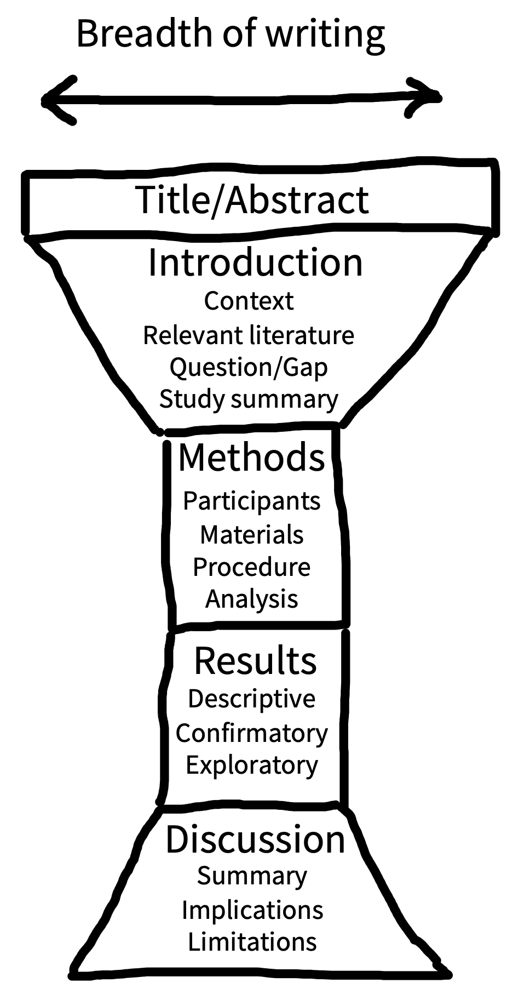

<!-- # (PART) Reporting and contextualizing {-} -->

# Writing {#writing}

::: {.learning-goals}
🍎 Learning goals: 

* Write clearly by being concise, using structure, etc...
* Write reproducibly by interleaving writing and analysis code
* Write responsibly by acknowledging limitations, correcting errors...
:::

All of the effort you put into designing and running an effective experiment will be wasted if you cannot clearly communicate what you did^[clarity of communication was one of the foundational principles of modern science. Alchemists had a habit of deliberately obscuring their work — sometimes even writing in cryptic codes. Francis Bacon and Robert Boyle pushed for transparency and clarity. Notoriously, Issac Newton (an alchemist turned scientist), continued to deliberately write in an obscure fashion in order to 'protect' his work. See Stephen Heard book chapter 1.]. Scientists usually share their research by writing journal articles. Writing is a powerful tool. Its a conversation that you contribute to only once, but it enables you to speak to a potentially infinite number of readers. So its important to get it right! In this chapter, you will learn how to write clearly, how to write reproducibily, and how to write responsibly. 

## Writing clearly

What is the purpose of writing? “Telepathy, of course” says Stephen King [@king]. The goal of writing is to transfer information from our mind to the reader's mind as effectively as possible. Unfortunately, writing clearly does not come naturally to most of us; it is craft we need to work at. There are no strict rules of clear writing, but there are some generally accepted guidelines and conventions that we will share with you here. 

Most importantly though, you learn to write by reading and, unsurprisingly, by writing. Just as you learned to talk by imitating the speech of your parents and teachers, you can learn to write by imitating what you read. Unfortunately, a lot of scientific writing is **not** very clear, so you will need to be selective in what you choose to mimic. Fortunately, as a reader, you will know good writing when you see it. It will feel like the writer is seamlessly transferring ideas from their mind to yours. When you come across writing like that, try to find more work by the same person and read that too. The more you read, the more you will develop a sense of what works well, and what does not. You may pick up bad habits as well as good ones (we sure have), but over time your writing will improve if you make a conscious effort to weed out the bad, and keep ahold of the good. 

* **Be explicit**. Say what you mean as directly as possible, don't leave it to the reader's imagination.

* **Be concrete**. Ideas are often easier to grasp when you provide examples. Use examples - sometimes your attempts to convey concepts to the reader may fail and leave them adrift, a concrete example gives the reader something to hold on to. Use figures and diagrams - for example, to describe a series of participant exclusions, use a flow diagram. If the journal limits the number of figures you can use, make use of the supplementary materials.

* **Be consistent**. Referring to the same concept using different words can confuse the reader. Define technical terms once and then use the same wording throughout the manuscript. For example, in everyday conversation, "replication" and "reproducibility" may sound like two different ways to refer to the same thing, but in scientific writing, these two concepts have different definitions so we should not use them interchangeably.

* **Define terminology**. Sticking with the example of "replication" and "reproducibility", some fields have a traditionally defined these terms in opposite ways!

* **Be concise**. Its much easier to hear someone shouting your name in an empty field than in a forest. Maximise the signal to noise ratio in your writing by omitting needless words and removing clutter [cite strunk and white]. For example, say **we investigated** rather than *we performed an investigation of* and say **if** rather than *in the event that*. Don't try to convey everything you know about a topic — a research report is not an essay. Decide what information you need to convey and focus only on that.

* **Use active voice**. Scientists have a peculiar habit of reporting their research in a way that avoids mentioning their own involvement. For example, its common to see phrases like "the data were analysed" or, worse, "an analysis of the data was carried out". These are examples of 'passive voice'. Scientists might write like this because it seems more objective, but that's just an illusion. Moreover, passive voice is often long-winded and ambiguous — the reader is left uncertain as to who or what analyzed the data. Was it the researchers? A statistician they recruited? Artificial intelligence? We think its better to use the 'active voice', where you clearly identify the relevant actor; in this example, you can say "we analyzed the data". Another common example is the phrase "it is believed that" which leaves the reader unsure as to who is doing the believing. Be explicit, for example, "we believe that" or "scientists believe that".

* **Adjust to your audience**. Most of us adjust our conversation style depending on who we're talking to — the same applies to good writing. Knowing your audience is more difficult with writing, because our part of the conversation is one-sided — we cannot see the reader and adjust accordingly. Nevertheless, we can make some educated guesses about who our readers might be. For example, if you are writing a review article for an interdisciplinary journal, you may need to pay more attention to explaining complex topics for a novice readership compared to writing a research article in a domain-specific journal.

* **Check your understanding**. Unclear writing can be a symptom of unclear thinking. If it doesn't make sense in your head, how will it ever make sense on the page? In fact, trying to communicate something in writing is an excellent way to probe your own understanding and expose weaknesses in your own arguments. So if you are finding it difficult to write clearly, take a step back and ask yourself **do I know what want to say**? If your thinking is unclear then you need to address that directly, for example by consulting a textbook or talk to your colleagues/advisor. Importantly, you must resist the temptation to mask unclear thinking in unclear writing, for example by being deliberately ambiguous (poss historical note here on alchemy). Sometimes, your thinking will be unclear simply because *nobody* understands the topic you are addressing. Indeed, we should expect that to happen; the whole point of research is to expand the frontiers of human knowledge, so naturally, you will find yourself working on the faultline of what is and what is not well understood. So if you have unresolveable uncertainty about something, say so explicitly, don't hide it in bad writing.

* **Use acronyms sparingly**. Its tempting to replace technical terminology with acronyms — why say "cognitive dissonance theory" when you can say "CDT"? Unfortunately, acronyms can increase the cognitive burden on the reader and can lead to misunderstandings^[@barnett2020  found that acronyms are widely used in research articles and argued that they are often a barrier to clear communication. Here is one example of text extracted from a 2019 publication to illustrate the point: "Applying PROBAST showed that ADO, B-AE-D, B-AE-D-C, extended ADO, updated ADO, updated BODE, and a model developed by Bertens et al were derived in studies assessed as being at low risk of bias.’]. For example, if you shorten "odds ratio" to "OR", the reader has to take the extra step of translating "OR" back to "odds ratio" every time they encounter it. The problem multiplies as you introduce more acronyms into your article. Worse, for some readers, "OR" tends to "operating room", not "odds ratio". Acronyms can be useful, but usually only when they are widely used and understood. For example, "magnetic resonance imaging" ("MRI") and "deoxyribonucleic acid" (DNA). At a minimum though, you should define all acronyms, even when they are likely to be familiar to most readers.

```{r imrad, fig.cap="Conventional structure of a research article. The main body of the article consists of Introduction, Methods, Results, and Discussion (IMRaD) sections. The body is preceded by the abstract — a summary that also follows the IMRaD structure, though not necessarily with explcit sub-headings. The abstract and the body are sandwiched in-between the front matter and back matter sections. The front matter contains the title, author names and author note^[What goes in the author note? You usually put the postal address of the corresponding author here, even though nobody ever writes to anybody anymore. Occassionally, you come across somewhat bizarre author notes, like this from an article by two people who both happened to be called Colin MacLeod: "Correspondence may be directed to either Colin MacLeod, one of whom is now at the Department of Psychology, University of Waterloo, Waterloo, Ontario, and the other of whom is at the Department of Psychology, Univeristy of Western Australia, Nedlands, Perth, Western Australia. Only we know which is which." @macleod2005]. Sometimes you also find statements about conflicts of interest, funding, and author contributions here too (though sometimes they are found in the back matter). The back matter includes acknowledgements and references. Reproduced from Hardwicke (2022; https://osf.io/nw93u/) under a CC-BY license.", fig.margin=TRUE}

```

* **Use structure**. Without structure, your reader would be left adrift in an ocean of complexity. Give them anchor points to hold on to. Academic writing is usually organised into a hierarchy of meaningful units: sections, paragraphs, sentences, and words. ^[Structure helps your reader, but it can also help you write. Start writing your article with section headings as a skeleton structure, then flesh it out, layer by layer. In each section, make a list of the key points you want to convey, these represent the first sentence of each paragraph (see P-E-E-L below). Then add the content of each paragraph.]

  + **Section structure**. Reading a scientific paper is not like reading a novel. Rather than reading from beginning to end, readers typically jump efficiently between sections to extract the information they need. This is possible because research articles typically follow the same conventional^[Some journals mix things up a bit, for example, putting the methods section at the end of the article or combining the results and discussion sections; however, most psychology journals tend to follow the guidance of the American Psychological Association, which recommends IMRaD.] structure (see Figure in side panel). The main body of the article includes four main sections: Introduction, Methods, Results, and Discussion (IMRaD)^[In the old old days, there were few conventions - scientists would often write letters to each other in order to share their latest findings. But as the number of scientists and studies increased, this approach became unsustainable. The IMRaD convention gained traction in the 1800s and emerged as the dominant approach in the mid-1900s as scientific productivity rapidly expanded in the post-war era. We think this is a big improvement, even if its nice to get a letter every now and again.]. This structure has a narrative logic: what's the knowledge gap? (introduction); how did you address it (methods); what did you find (results); what do the results mean? (discussion).

  + **Hourglass structure**. Its helpful to imagine that the body of your article has an 'hourglass' structure (see Figure in panel). At the start of the introduction, you should have a broad focus — provide the reader with the general context of your study. From there, the focus of the introduction should get increasingly narrow until you are describing the specific problem you will address and how you are going to address it. The methods and results sections are at the center of the hourglass because they are focused on your study alone. In the discussion section, the focus shifts from narrow to broad. Begin by summarising the results of your study, discuss limitations, then integrate the findings with existing literature and describe the practical and theoretical implications.
  
  + **Paragraph structure**. The 'P-E-E-L' (Point-Explain-Evidence-Link) structure is a helpful way to organise your paragraphs, particularly in the introduction and discussion sections. Each paragraph should convey one main idea, which you should state as clearly as possible in the first sentence. The core of the paragraph is dedicated to further explaining the point (perhaps with another 'E' — an example) and providing evidence. There's considerable flexibility here — you might provide several lines of evidence and the order of explain and evidence is interchangeable). Finally, take a couple of sentence to remind the reader of your main point and set up a link to the next paragraph. Think of it like a relay race where the baton (your argument) is passed seamlessly between paragraphs.
  
  + **Sentence structure**. Long, complex sentences can be confusing and difficult to process. On the other hand, if you only use short sentences your writing may sound like a monotonous robot. Don't try to cram too much information into the same sentence and vary the lengths to give your prose clarity and rhythm. Use sentence structure as a scaffold to support the reader's thinking. Start sentences with what the reader already knows before introducing new information. For example, write "To address the cognitive dissonance hypothesis, we compared performance in the experimental group and control group using a between-subjects t-test" rather than "We performed a between-subjects t-test comparing performance in the experimental and control groups to address the cognitive dissonance hypothesis." 

  + **Cross-referencing**. Research articles are packed with complex information and its easy for readers to get lost. A 'cross reference' is like a helpful signpost that tells readers where they can find relevant information. For example, you can refer the reader to data visualizations by cross referencing to figures or tables ("see Figure 1"), or methodological information in the supplementary information ("see Supplementary Information A"). You can also cross reference your research aims/hypotheses to remind readers how different methods, results, and inferences relate back to your research goals. For example, you could add separate sub-headings in your results section to address hypotheses A, B, and C.

* **Rewrite**. Think of the article you are writing as a garden. Your first draft is probably going to be an unruly mess of intertwined fronds and branches. Writing usually needs several rounds of pruning and sculpting before it reaches its most impressive form. You'll be amazed how often you find words to omit, terms you can define more precisely, or elaborate sentence structures you can simplify. ^[On the other hand, don't be paralysed by perfectionism. At some point its time to send the article to your co-authors for a fresh set of eyes.] 

* **Get feedback**. It can be difficult to judge if our own writing has achieved its telepathic goals. If possible, try to get feedback from a naive reader, preferably somebody from your target audience. 

* **The reader is (usually) right**. Its tempting to blame the reader when your writing fails. Criticism can sting, especially after spending many hours writing and rewriting. But if a reader has gone to the effort of sharing feedback with you, its probably a reasonable assumption that they've made a reasonable effort at understanding your writing. And if they didn't understand your writing, you need to fix it.

* **Have fun**. Scientific writing has a reputation for being dull, dry, *soulless*. Whilst its true that scientific writing is more constrained than fiction, there are still ways to surprise and entertain your reader with metaphor, alliteration, and even humour. As long as your writing is clear and accurate, we see no reason why you cant also make it enjoyable. Enjoyable articles are easier to read and more fun to write.

## Writing reproducibly

In previous chapters (cross-ref) you learned how results reported in research reports are often not reproducible — that is, they cannot be recreated by repeating the original analyses on the original data. Fortunately, there are number of tools and techniques that you can use to help you write reproducible research reports. The basic idea is to interleave your analysis code with the main text of your article.

### Why write reproducible papers?

There are three reasons to write reproducible papers. To be right, to be reproducible, and to be efficient. In more depth:

1. **To avoid errors.** Using an automated method for scraping APA-formatted stats out of PDFs, @nuijten2016 found that over 10% of p-values in published papers were inconsistent with the reported details of the statistical test, and 1.6% were what they called "grossly" inconsistent, e.g. difference between the p-value and the test statistic meant that one implied statistical significance and the other did not. Nearly half of all papers had errors in them. 

2. **To promote computational reproducibility.** Computational reproducibility means that other people can take your data and get the same numbers that are in your paper. Even if you don't have errors, it can still be very hard to recover the numbers from published papers because of ambiguities in analysis. Creating a document that literally specifies where all the numbers come from in terms of code that operates over the data removes all this ambiguity.

3. **To create spiffy documents that can be revised easily.** This is actually a really big neglected one for us. At least one of us used to tweak tables and figures by hand constantly, leading to a major incentive *never to rerun analyses* because it would mean re-pasting and re-illustratoring all the numbers and figures in a paper. That's a bad thing! It means you have an incentive to be lazy and to avoid redoing your stuff. And you waste tons of time when you do. In contrast, with a reproducible document, you can just rerun with a tweak to the code. You can even specify what you want the figures and tables to look like before you're done with all the data collection (e.g., for purposes of preregistraion or a registered report). 


- Minimize human error
- Makes provenance tracking easier (reconstructing how specific figures/tables were generated) 
- Makes formatting changes easier (e.g., MLA to APA; different journal formats) 
- Enables other researchers to run the same analyses with new data

Writing a reproducible manuscript allows researchers to generate results and figures via direct computation rather than having to manually copy them into the manuscript. 

- Literate programming (Knuth 1992): Instead of supporting code with documentation (e.g., code), reverse the emphasis by supporting documentation (e.g., your manuscript) with code (e.g., using R Markdown)

- Reproducible data analysis: anyone else should be able to run your script and obtain identical results
    - Defensive coding: assume errors are inevitable, include assert statements and sanity checks, catch incorrect inputs (Stodden et al. 2016)
    - Use free/open-source software when possible
    - Use version control (see Chapter 12 for conceptual overview, Appendix B for tutorial)
- Preserving the computational environment (e.g., Code Ocean), preserve package versions (e.g., renv for R, pip freeze for Python)

::: {.case-study}
🔬 Case study: Reinhart & Rogoff (2010) had a typo in their excel formula, contributing to widespread adoption of fiscal austerity policies. More broadly, there are likely cut and paste typos in half of published research (Nuijten et al. 2016)!
:::

### The reproducibiltiy-collaboration trade-off
There shouldn't be a trade-off, but unfornutately there often is. Firstly, the tools are not ideal (e.g., comments and tables in R Markdown). Secondly, our collaborators may be unfamiliar with R Markdown. Thirdly, journals often require a Word doc.

1. The fully reproducible approach: fully native Rmd editing with github (I don't mind this but others don't
like it)
2. The clunky best of both worlds approach: some version of your workflow
3. The reproducubility-lite approach fully google doc and do some generate/paste pieces of text and figures - can be risky if there's a lot of this

Zotero

## Writing responsibly

No study is perfect. Even the most rigorously designed research will have limitations and its your responsibility to convey these to the reader.

Its not your responsibility to never make a mistake. That would be an unrealistic expectation. However, it **is** your responsibility to minimize the likelihood of errors (by working reproducibily), help other scientists evaluate your research (by working transparently), and declare/correct errors when they are identified (by working responsibly).

Title - don't overclaim. Title should describe the research aim and method, rather than the result.

Discussion - don't feel the need to argue for a particular position / interpretation. It is a discussion section, not a debate section. It is not your job to convince your reader of a particular interpretation, it is your job to discuss the relative merits of different relevant interpretations. Similarly, you should be open about the limitations of your study - a limitation is a not necessarily a failing, they are inevitable - all studies are limited.

::: {.accident-report}
⚠️ Accident report: How (not) to write a research article. Daryl Bem’s infamous HARKING chapter encouraged people to tell a post-hoc story about data, but this practice is very problematic (Bem 1987). Contrast Bem and Gernsbacher (https://doi.org/10.1177/2515245918754485) guides to writing
:::

- show your work. Back in school, we all learned that getting the right answer is not enough, you need to demonstrate how you arrived at that answer in order to get full marks. The same expectation applies to research reports. Don't just tell the reader what you found, tell them how. That means providing all methodological details. Reporting guidelines can be a useful reminder of what's relevant and you can also refer back to your preregistration - its easy to forget the details. Advice on using supplementary materials - ok to use liberally, just do not use it to hide important info and don't let it be dumping ground, it should still be clear and concise. When describing the methods, try to convey the participants experience as clearly as possible - you could even provide a video (Heycke & Spitzer, 2019 recommend using screen capture software)

- cite responsibility. Science is a community cite others when building on their work. Read before you cite. The meaning of a citation is often implicit in the context - but make sure it is clear why your are citing e.g., is it empirical evidence to support a claim? A review of evidence? An idea or theory? A method? A counterargument? There are examples in Gernsbacher's article of citation misuse. Avoid selective citation. Evaluate and integrate evidence rather than simply listing studies that appear to support your argument. Remember every study has limitations.

- title. you want your title to attract readers, but don't oversell. If possible, include the research design in the title (e.g., "A cross-sectional study of X")

- open practices statement

- 21 word solution?

- separating exploratory and confirmatory

- The correction and retraction processes

- preregistration and deviation

- discussing limitations (vazire & hoekstra)

journal constraints may undermine your efforts to provide comprehensive methods details etc, but usually they are fine with your linking to supplementary information on OSF. That does not exclude leaving out important information from the main report. Many readers won't dig into the supplement so its your responsibility to make sure they are properly informed. If you feel journal constraints are undermining your ability to be transparent about your research, you should go to a different journal. (e.g., RSOS, Collabra Psychology)

### Authorship

There are two key decisions to make about authorship: (1) Who qualifies as an author? (2) What is the authorship order? 

<p> Why it matters/saving yourself the trouble </p>
<p> When to have the conversation </p>
<p> When to re-evaluate </p>
CREDIT - tenzing [@holcombe2020]

^[In 1975, physicist and mathematician Jack H. Hetherington wrote a paper he intended to submit to the journal *Physical Review Letters*. We're not sure why, but Hetherington wrote the paper in first person plural (i.e., referring to himself as 'we'). He subsequently discovered that the journal would not accept this for single-authored articles. These were the old days and Hetherington had painstakingly tapped out the article on his type writer, an exercise he was not keen to repeat. Instead, he opted for a less taxing solution and named his cat — a feline by the name of F.D.C Willard — as a coauthor. The paper was accepted and published [@hetherington1975]. We're not sure what the moral of this tale is, we just thought you would like to know.]

^[If you have find yourself in a situation where all authors have contributed equally, you may have to draw inspiration from historical examples and determine authorship order based on a 25 game croquet series [@hassell1974], rock, paper, scissors [@kupfer2004], or a brownie bake-off [@young1992]. Alternatively, you can adopt @lakens2018 method and randomize the order in R, the authors even share their code!]

### Disclosures
<p> Why it matters </p>
<p> Financial statements </p>
<p> Conflicts of interest </p>

### Generalizability Statements
<p> Purpose and why it matters </p>
<p> Important elements </p>
<p> Example statement </p>

### Dealing with Errors and post-publication critique

“If you hit a wrong note, it’s the next note that you play that determines if it’s good or bad.”

— Miles Davis


<p> Don't ignore it! </p>
<p> How to remedy it </p>
<p> Why it matters </p>

Acknowledge an error was made.
Describe the error.
Describe the implications of the error.
Describe what you have done to address the error.
Describe how the error occurred. 
Describe any changes you have introduce to your workflow to reduce the likelihood of a similar error occurring again

Acknowledge who identified the error (if they wish to be identified).

::: {.accident-report}
⚠️ Accident report: Julia Strand discovered a coding error in a key paper for her career at exactly the wrong time, but she took the plunge and corrected it (Julia Feld Strand 2020; Julia F. Strand, Brown, and Barbour 2019).
:::

A note on collaboration? (e.g., google docs, giving feedback on writing?)

## Chapter summary: Writing

In this chapter, you learned some key principles for writing clearly, writing reproducibily, and writing responsibly. 

::: {.exercise}
Find a writing buddy and exchange feedback on your next articles. Think consciously about how to improve each other's writing using the advice offered in this chapter.
:::

::: {.exercise}
Identify a published research article with openly available data and see if you can reproduce the analysis. You can find support for this exercise at the Social Science Reproduction Platform (https://www.socialsciencereproduction.org) or ReproHack (https://www.reprohack.org).
:::

## Further reading
Zinsser On Writing Well
Gernsbacher (2018) Writing Empirical Articles: Transparency, Reproducibility, Clarity, and Memorability

