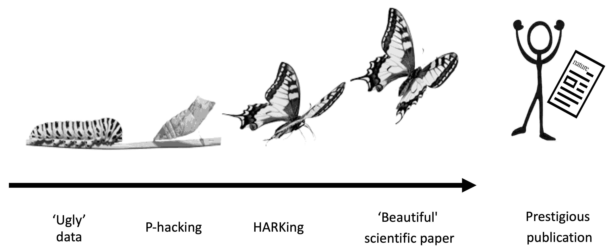
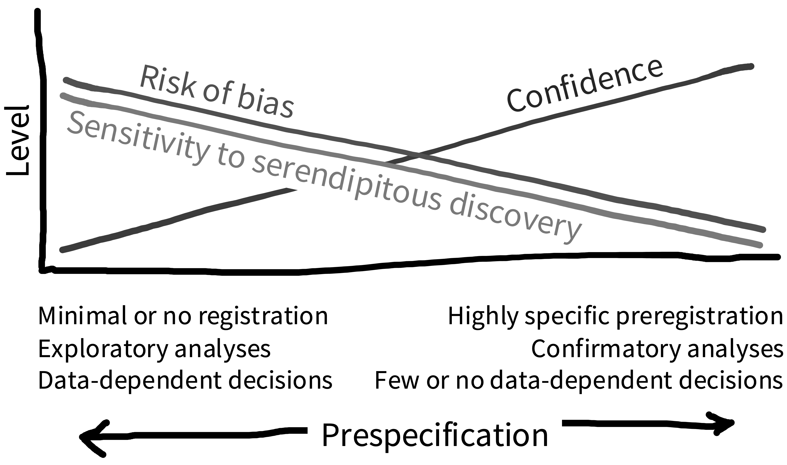

--- 
title: "Experimentology"
subtitle: "An Open Science Approach to Experimental Psychology Methods"
author: "Michael C. Frank, Mika Braginsky, Julie Cachia, Nicholas Coles, Tom Hardwicke, Robert Hawkins, Maya Mathur, and Rondeline Williams"

site: bookdown::bookdown_site
documentclass: book
classoption: twoside,symmetric

bibliography: experimentology.bib
csl: apa.csl
link-citations: yes
---

# {.unlisted .unnumbered}

Placeholder


## Introduction {-}
## What this book is and isn't about {-}
## How to use this book {-}
## Themes {-}
## What is open science, and why plan a book around it? {-}
## The software toolkit of the behavioral researcher (and of this book) {-}

<!--chapter:end:index.Rmd-->


# (PART) Preliminaries {-}
# Experiments and theories {#intro}

Placeholder


## What is an experiment, and why would you do one?
### Causal inference
### Randomization
## What is a theory? 
### Psychological theories
### Theory testing: Popper, Kuhn, and Lakatos, oh my!
### Models and theories 
## Theory testing in psychology
### "Risky" and informative tests
### Theories, frameworks, and paradigms
### Who (and what) are we theorizing about? 
## Experiments and Theories: Chapter summary

<!--chapter:end:001-intro.Rmd-->


# Replication and reproducibility  {#replication}

Placeholder


## Reproducibility
## Replication
### Conceptual frameworks for replication
### The meta-science of replication
## Causes of replication failure
### Context, moderators, and expertise
### P-hacking and publication bias
## Replication and theory building
### Reciprocity between replication and theory
### Necessary but not sufficient
### A "replication crisis"?

<!--chapter:end:002-replication.Rmd-->


# Ethics {#ethics}

Placeholder


## Ethical frameworks
### Consequentialist theories
### Deontological and virtue-based approaches
### Deontological principles for research
## Ethical responsibilities to research participants
### Institutional review boards
### Informed consent
### Debriefing participants
### Special considerations for vulnerable populations
## Ethical responsibilities in analysis and reporting of research 
## Ethical responsibilities to the broader scientific community
## Chapter summary: Ethics 

<!--chapter:end:003-ethics.Rmd-->


# (PART) Statistics {-}
# Estimation {#estimation}

Placeholder


## Estimating a quantity
### Maximum likelihood estimation
### Estimating variation in ratings
### Bayesian estimation
## Estimating and comparing effects
### Estimating the treatment effect 
### Measures of effect size
### Pros and cons of standardizing effect sizes
## Summary: Estimation

<!--chapter:end:004-estimation.Rmd-->


# Inference {#inference}

Placeholder


## Sampling variation
### Standard errors
### The central limit theorem
## From variation to inference
## Making inferences
### Bayes Factors
### *p*-values
### The Neyman-Pearson approach
## Inference and its discontents
### Problems with the interpretation of *p*
### Philosophical (and empirical) views of probability
## Estimating precision
### Confidence intervals
### Confidence in confidence intervals? 
## Chapter summary: Inference

<!--chapter:end:005-inference.Rmd-->


# Models {#models} 

Placeholder


## Inference and estimation for two-group designs
### Simple models of between-group differences
## Covariates

<!--chapter:end:006-models.Rmd-->


# (PART) Design and Planning {-}
# Measurement {#measurement}

Placeholder


## Reliability
### Measurement scales
### Reliability is relative
### Practical advice for computing reliability
## Validity
## How to select a good measure?
### What to measure? 
### Survey measures
## The temptation to measure lots of things
## Chapter summary

<!--chapter:end:007-measurement.Rmd-->


# Design of experiments {#design}

Placeholder


## Manipulation validity
### Threats to manipulation validity
### Confounding
### Removing nuisance confounds
## How to design a manipulation to test a theory.
### Design concepts
### Connecting with theory

<!--chapter:end:008-design.Rmd-->


# Sampling {#sampling}

Placeholder


<!--chapter:end:009-sampling.Rmd-->

```{r include=FALSE, cache=FALSE}
library(tidyverse)
library(glue)
library(knitr)
library(shiny)
library(metafor)
require(BayesFactor)
require(papaja)

opts_chunk$set(
  message = FALSE,
  warning = FALSE,
  error = FALSE,
  comment = "#>",
  collapse = TRUE,
  cache = TRUE,
  echo = FALSE,
  cache.lazy = FALSE,
  dev = "png",
  dpi = 300,
  out.width = "\\linewidth"
)
kable <- function(...) knitr::kable(..., booktabs = TRUE, linesep = "")

set.seed(42)

.font <- "Source Sans Pro"
theme_set(theme_bw(base_size = 14, base_family = .font))
theme_update(panel.grid = ggplot2::element_blank(),
             strip.background = ggplot2::element_blank(),
             legend.key = ggplot2::element_blank(),
             panel.border = ggplot2::element_blank(),
             axis.line = ggplot2::element_line(),
             strip.text = ggplot2::element_text(face = "bold"))
.grey <- "grey70"
.refline <- "dotted"
.coef_line <- element_line(colour = .grey, size = 0.1)

.pal <- ggthemes::ptol_pal
.scale_colour_discrete <- ggthemes::scale_colour_ptol
.scale_color_discrete <- .scale_colour_discrete
.scale_fill_discrete <- ggthemes::scale_fill_ptol

.scale_colour_continuous <- viridis::scale_colour_viridis
.scale_color_continuous <- .scale_colour_continuous
.scale_fill_continuous <- viridis::scale_fill_viridis

.scale_colour_numerous <- scale_colour_discrete
.scale_color_numerous <- .scale_colour_numerous
.scale_fill_numerous <- scale_fill_discrete

# from https://bookdown.org/yihui/rmarkdown-cookbook/font-color.html
colorize <- function(x, color) {
  if (knitr::is_latex_output()) {
    sprintf("\\textcolor{%s}{%s}", color, x)
  } else if (knitr::is_html_output()) {
    sprintf("<span style='color: %s;'>%s</span>", color,
            x)
  } else x
}
```
# Preregistration {#prereg}

::: {.learning-goals}
🍎 Learning goals: 

- Recognize the dangers of researcher degrees of freedom in "the garden of forking paths"
- Understand the differences between exploratory and confirmatory modes of research
- Learn how preregistration and other tools can reduce risk of bias and help others to evaluate your work by increasing transparency

:::

> When not planned beforehand, data analysis can approximate a projective technique, such as the Rorschach, because the investigator can project on the data his own expectancies, desires, or biases and can pull out of the data almost any ‘finding’ he may desire.
>
> `r tufte::quote_footer('--- Theodore X. Barber [-@barber1976]')`

> The first principle is that you must not fool yourself--and you are the easiest person to fool...After you've not fooled yourself, it's easy not to fool other scientists. You just have to be honest in a conventional way after that. 
>
> `r tufte::quote_footer('--- Richard Feynman [-@feynman1974]')`

This may surprise you coming from the authors of a textbook about research methods, but there is no single "correct" way to design and analyze an experiment[^1]. In fact, for most research decisions, there are many justifiable options. For example, will you stop data collection after 20, 200, or 2000 participants? Will you remove outlier values and how will you define them? Will you conduct subgroup analyses to see whether the results are affected by sex, or age, or some other factor? Consider a simplified, hypothetical case where you need to make five analysis decisions and have five justifiable options for each decision — this alone would result in 3125 (5^5) unique ways to analyze your data! In this chapter, we will find out why undisclosed flexibility in the design, analysis, reporting, and interpretation of experiments (also referred to as "researcher degrees of freedom"), can lead to scientists fooling themselves and fooling each other. We will also learn about how preregistration (and other tools) can be used to protect our research from bias and provide the transparency that other scientists need to properly evaluate and interpret our work.

[^1]: Though there are plenty of incorrect ways to design and analyse experiments and we hope we can help you to avoid these!

## Lost in a garden of forking paths

```{r forking-paths, fig.cap="Garden of forking paths (placeholder image I hacked together, replace with an illustration?)", fig.margin=TRUE}
knitr::include_graphics("images/prereg/forking-paths.png")
```

One way to visualize researcher degrees of freedom is as a vast decision tree or "garden of forking paths" [@gelman2014 Figure \@ref(fig:forking-paths)]. Each node represents a decision point and each branch represents a justifiable choice. Each unique pathway through the garden terminates in an individual result. Because scientific observations typically consist of both noise (random variation unique to this sample) and signal (regularities that will reoccur in other samples), some of these pathways will inevitably lead to results that are misleading (e.g., inflated effect sizes, exaggerated evidence, or false positives)[^2]. The more potential paths there are in the garden that you might explore, the higher the chance of encountering misleading results[^3]. Statisticians refer to this as a *multiplicity* problem. 

[^2]: The signal-to-noise ratio is worse in situations (alas, common in psychology) that involve small effect sizes, high variation, and large measurement errors [@ioannidis2005]. Researcher degrees of freedom may be constrained to some extent by strong theory [@oberauer2019], community methodological norms and standards, or replication studies, though these constraints may be more implicit than explicit, and can still leave plenty of room for flexible decision-making.

[^3]: In frequentist terminology, there is an increasing the chance of making a 'Type I error'.

As noted in Chapter \@ref(inference), multiplicity can be addressed to some extent with statistical countermeasures, like the Bonferroni correction; however, these adjustment methods need to account for every path that you *could have* taken [@gelman2014; @degroot2014]. When you navigate the garden of forking paths *during data analysis*, it is easy to forget, or even be unaware of every path that you could have taken, so these methods can longer be used effectively. Additionally, when a researcher navigates the garden of forking paths during data analysis, their decisions can be biased because they are receiving feedback on how different choices affect the results (*results-dependent* decision making). If a researcher is seeking a particular kind of result (which is likely - see Box 1), then they are more likely to follow the branches that steer them in that direction. You could think of this a bit like playing a game of "hot🔥! or cold☃️!" where hot🔥! indicates that the choice will move the researcher closer to a desirable overall result and cold☃️! indicates that the choice will move them further away. Each time the researcher reaches a decision point, they try one of the branches and get feedback on how that choice affects the results. If the feedback is hot🔥! then they take that branch. If the answer is cold☃️!, they try a different branch. If they reach the end of a complete pathway, and the results are cold☃️!, maybe they even retrace their steps and try some different branches earlier in the pathway. This strategy create a risk of bias[^4] because the results are being systematically skewed towards the researcher's preferences[^5] [@hardwicke2021b]. 

[^4]: We say "risk of bias" rather than just "bias" because in most scientific contexts, we do not have a known ground truth to compare the results to. So in any specific situation, we do not know the extent to which results-dependent analyses have actually biased the results.

[^5]: Another way to think of this is in terms of 'regression to the mean'. When a sample statistic is selected because it crosses some threshold (e.g., statistical significance), then it is more likely to provide a biased estimate that decreases upon subsequent measurement.

::: {.interactive}
Box 1. Only human: Cognitive biases and skewed incentives

There's a storybook image of the scientist as an objective, rationale, and dispassionate arbiter of truth [@veldkamp2017]. But in reality, scientists are only human: they have egos, career ambitions, and rent to pay! So even if we do want to live up to the storybook image, its important to acknowledge that our decisions and behaviour are also influenced by a range of cognitive biases and external incentives that can steer us away from that goal. Unfortunately, the allocation of funding, awards, and publication prestige is often based on the nature of research results rather than research quality [@smaldino2016; @nosek2012]. For example, many academic journals, especially those that are widely considered to be the most prestigious, appear to have a preference for novel, positive, and 'statistically significant' findings over incremental, negative, or null findings [@bakker2012]. There is also pressure to write articles with concise, coherent, and compelling narratives [@giner-sorolla2012]. This incentivizes scientists to be 'impressive' over being right and encourages questionable research practices. The process of iteratively p-hacking and HARKing one's way to 'beautiful' scientific paper has been dubbed "The Chrysalis Effect" [@oboyle2017 Figure \@ref(fig:chrysalis)].

```{r chrysalis, fig.cap="The Chrysalis Effect, when ugly truth becomes a beautiful fiction. Placeholder image - replace with illustration?", fig.margin=F}

```

:::

In the most egregious cases, a researcher may try multiple pathways until they obtain a desirable result[^6] and then *selectively report* that result, neglecting to mention that they have tried several other analysis strategies. You may remember an example of this when participants apparently became younger when they listened to "When I'm 64" by The Beatles in Chapter \@ref(ethics). Another nice example is when a group of enterprising researchers were able to 'discover' brain activity in a dead Atlantic Salmon by deliberately exploiting flexibility in the fMRI analysis pipeline [@bennett2009 Figure \@ref(fig:salmon)]. Deliberately taking advantage of researcher degrees of freedom and selectively reporting results is known by various names, like p-hacking, cherry picking, data dredging, and it is unethical because it involves hiding highly relevant information. But you should also be aware that results-dependent analysis incurs a risk of bias even if a researcher has good intentions, doesn't explicitly try multiple pathways, and honestly reports everything they did. For example, if each branch they took was hot🔥!, they may reach the result they desire at the end of the pathway without realizing that, had the results been different, they would have followed other pathways [@gelman2014; @degroot2014]. In other words, even though the researcher doesn't intend to deliberately hide anything, there is still undisclosed analytic flexibility - important context that is relevant to properly interpret the results. Its surprisingly easy to convince yourself after the fact that you made the decisions you did for principled reasons that had nothing to do with the results (see 'motivated reasoning', Box 1). In sum, engaging in results-dependent analysis increases the chances that you will fool yourself by inadvertently stumbling across misleading results - and if that analytic flexibility goes undisclosed, you may fool others too.

[^6]: "If you torture the data long enough, it will confess" [@good1972]

```{r salmon, fig.cap="By deliberately exploiting analytic flexibility in the processing pipeline of fMRI data, Bennet et al. (2009) were able to identify 'brain activity' in a dead Atlantic Salmon.", fig.margin=TRUE}
knitr::include_graphics("images/prereg/salmon.jpeg")
```

An important factor that we've not yet mentioned in detail, is that there is additional flexibility in how researchers *explain* research results. Any single result can be consistent with multiple different theories (this is known as the Duhem-Quine problem @duhem1954). We might call these "explanatory degrees of freedom". The practice of selecting or developing your hypothesis after seeing the study results has been called "Hypotheisizing After the Results are Known", or "HARKing" [@kerr1998]. HARKing is potentially problematic because it expands the garden of forking paths and helps to justify the use of various analytic degrees of freedom (Figure \@ref(fig:grid)). For example, you may come up with an explanation for why an intervention is effective in men but not in women in order to justify a post-hoc subgroup analysis based on sex (see Case Study). The extent to which HARKing is problematic is contested [for discussion see @hardwicke2021b], but we would argue that at the very least its important to be honest about whether hypotheses were developed before or after seeing research results.

```{r grid, fig.cap="A scientist exploring a grid of individual research results. The horizontal axis illustrates a simplified ‘garden of forking paths’: the many justifiable analysis specifications that the scientist can use to transform the data (D) into the evidence (E). The vertical axis illustrates that there may be several relevant theories (T), and hypotheses (H) derived from those theories, which could be constructed or selected and then confronted with the evidence. Thus, an unconstrained scientist can simultaneously exploit their analytic degrees of freedom and explanatory degrees of freedom to fit evidence to hypotheses and fit hypotheses to evidence in order to arrive at a study outcome that is more likely to align more with their preferences, but less likely to align with the truth. Caption is copied verbatim so needs editing. Shared under a CC-BY license, artwork by Viktor Beekman, concept by Tom Hardwicke and Eric-Jan Wagenmakers.", fig.margin=F}
knitr::include_graphics("images/prereg/grid.jpg")
```

But hang on a minute! Isn't it a good thing to seek out interesting results if they are there in the data? Shouldn't we "let the data speak"? The answer is yes[^7]! In fact, we have dedicated a whole chapter to exploratory data analysis (Chapter \@ref(eda)). The important thing to remember about exploratory research is that you need to (a) be aware of the increased risk of bias and calibrate your confidence in the results accordingly; (2) be honest with other researchers about your analysis strategy so they are also aware of the risk of bias and can calibrate *their* confidence in the results accordingly. Its important to understand the distinction between exploratory and confirmatory research modes[^8]. Confirmatory research involves making design and analysis decisions, *before* the results have been observed. In the next section, we will learn about how to do that using preregistration.

[^7]:Note that exploratory research is not the same as p-hacking, which is explicitly dishonest because it involves deliberately withholding information.

[^8]: In practice, an individual study may contain both exploratory and confirmatory aspects which is why we describe them as different 'modes'.

## Reducing bias, increasing transparency, and calibrating confidence with preregistration

Perhaps the easiest way to counter the problem of undisclosed researcher degrees of freedom outlined above, is to make research decisions before seeing the study results - a bit like planning your route through the garden of forking paths before you start your journey. A great way to do this is preregistration [@wagenmakers2012; @hardwicke2021b]. Preregistration involves declaring your research decisions in an online public registry before the data are inspected. Preregistration ensures that your decisions are results-independent, which reduces risk of bias arising from the issues described above. Preregistration also transparently conveys to others what you planned, helping them to determine the risk of bias and calibrate their confidence in the results. In other words, preregistration transparently provides the context needed to properly evaluate and interpret research. Preregistration does not require that you specify all research decisions in advance, only that you are transparent about what was planned, and what was not planned. This helps to make a distinction between which aspects of the research were exploratory and which were confirmatory (Figure \@ref(fig:continuum)). All else being equal, we should have more confidence in confirmatory findings, because there is a lower risk of bias. Exploratory analyses have a higher risk of bias, but they are also more sensitive to serendipitous (unexpected) discoveries. So exploratory and confirmatory research are both valuable activities, it is just important to differentiate them [@tukey1980]. Preregistration offers the best of both worlds by clearing separating one from the other.

```{r continuum, fig.cap="Preregistration clarifies where aspects of your research fall on a spectrum of exploratory and confirmatory modes of research. A preregistration is just a snapshot of your current thinking. If you have planned very little, your preregistration may not have much detail, but that's absolutely fine! The important thing is that preregistration transparently conveys what was planned (confirmatory) and what was not (exploratory). Increasing the amount of detail in your preregistration increases your protection against bias. Placeholder image, use better illustration?", fig.margin=F}

```

In addition to the benefits described above, preregistration may improve the quality of research by encouraging closer attention to study planning. We've found that it really helps facilitate communication between collaborators, and can catch addressable problems before time and resources are wasted on a poorly designed study. Detailed advanced planning can also create opportunities for useful community feedback, particularly in the context of Registered Reports, where dedicated peer reviewers will evaluate your study before its even begun (Box 2).

::: {.interactive}
Box 2. Preregistration and friends: A toolbox of countermeasures to address researcher degrees of freedom

NB - CURRENT TEXT VERY CLOSE TO HARDWICKE & WAGENMAKERS (2021) NEEDS EDITING

There are several useful tools that take can be used to address the problem of researcher degrees of freedom. In general, we would recommend that these tools are combined with preregistration, rather than used as a replacement [@hardwicke2021b].

**Robustness checks**. Whilst preregistration aims to constrain researcher degrees of freedom, robustness checks directly exploit them in order to evaluate their impact. Traditional sensitivity analyses may evaluate a few justifiable options for a single research decision92; however, recent approaches, variously known as “multiverse analysis”93, “vibration of effects”94, “specification curve”95, or “multimodel analysis”96, systematically assess the factorial intersection of multiple choices for multiple decisions, potentially resulting in tens of thousands of unique analysis specifications97–100. This is akin to simultaneously examining multiple cells in the array depicted in Figure 1, rather than a single prespecified cell. 

Some have argued  that systematic robustness checks render preregistration redundant71,101. However, the subjective choice of which specifications to examine or report90,102 means that robustness checks can introduce researcher degrees of freedom, creating an opportunity for selective reporting, and thereby increasing the risk of bias. Researchers can have the best of both worlds (Section 4.2) by preregistering their robustness checks.

**Blind analysis**. Issues arising during data collection such as attrition, missing data, randomisation failures, or unexpected data distributions may invalidate planned analyses. Blind analysis disguises information related to outcomes (e.g., by adding noise or shuffling variables) allowing the data to be inspected whilst ensuring decision-making remains outcome-independent103,104. Blind analysis is used in physics to address concerns about bias introduced by outcome-dependent analyses105–107. Blind analysis requires some technical expertise and can introduce bias if poorly implemented. Additionally, blind analysis does not prevent selective reporting, so should ideally be used in conjunction with preregistration.

**Hold-out sample**. Splitting a dataset can enable exploratory analyses in a ‘training’ sample followed by confirmatory analyses in a ‘test’ or ‘hold-out’ sample108. This approach requires a large sample size as splitting the data reduces statistical power. Preregistering the analyses intended for the hold-out sample ensures they are truly confirmatory.

**Preregistration of analysis scripts based on simulated data**. It requires some imagination to anticipate the details to include in an analysis plan69,109 and it can be difficult to communicate analysis specifications in prose110,111. This can be addressed by preregistering analysis scripts prepared using simulated data66.

**Standard Operating Procedures**. Maintaining a living document of default research decisions that is co-registered with each study could enhance preregistration efficiency112.

**Open lab notebooks**. Open lab notebooks could improve transparency throughout a research project113 and help track departures from the preregistration. Preregistration is similar to sharing the pages of your lab notebook which outline the study plan.

**Registered Reports**. Registered Reports are a journal article format that offers in-principle acceptance for publication before studies begin based on peer review of a prespecified study protocol87 (Figure \@ref(fig:reg-reports)). This radical departure from traditional publication practices promises the benefits of preregistration with enhanced protection against publication bias. Registered Reports may be most suitable for more confirmatory studies114. Related tools that could also mitigate publication bias involve combining standard preregistration with post-study results-blind peer review115 and encouraging results reporting in study registries (a mandate for some clinical trials, often ignored in practice116); however, the time investment and public accountability involved in Registered Reports may offer greater motivation for authors to report results even if they do not reflect their preferred outcome.

:::

```{r reg-reports, fig.cap="Registered Reports (https://www.cos.io/initiatives/registered-reports)", fig.margin=TRUE}
knitr::include_graphics("images/prereg/registered-reports.png")
```

::: {.case-study}
🔬 Case study: Undisclosed analytic flexibility in the wild 

NB this box was previously called "A tale of two RCTs" but I'm not sure why - there's only one RCT right?

A few years ago, one of us (Mike) was reading a paper [@berkowitz2015] and something seemed odd. The paper reported a randomized field experiment evaluating an educational app intended to increase children's math skills. According to the reported analysis, the app was a success. But the analysis had not been preregistered, and Mike found some of the analysis choices to be unusual. For example, the analysis had probed whether there was an effect of the app in particular subgroups, but neglected to evaluate whether there was an overall effect. Mike was concerned that the results were affected by undisclosed analytic flexibility and published a commentary consisting of alternative analyses that suggested the app was not effective [@frank2016]. The original authors responded that their analyses were entirely based on prior research and argued that the disagreement about how the data should be analyzed was "philosophical" [@berkowitz2016]. The problem here is that it is very difficult to know the extent to which the original analysis was influenced by the results. If the analysis plan had been preregistered, this would reduce the risk of bias and allow Mike and other readers to have more confidence in the reported results[^10}.

:::

[^10]: Its worth pointing out that preregistration cannot magically improve a poorly specified analysis. One aspect of the original analysis was straightforwardly erroneous (though the original authors dispute this) because it concluded that there was an effect in one group, but not in another, by testing the effect separately in those groups, and neglecting to test the interaction. This is a statistical fallacy, regardless of whether the analyses were preregistered [@gelman2006]. Nevertheless, preregistration would have provided transparency to enable a more informed scientific debate about the results without concern for whether they influenced by undisclosed analytic flexibility.

## How to preregister

Preregistration is actually pretty new to psychology, and there's still no standard way of doing it - you're already at the cutting edge[^9]! We recommend using the Open Science Framework (OSF) as this is one of the most popular registries in psychology and you can do lots of other useful things there to make your research transparent, like sharing data, materials, analysis scripts, and preprints. On the OSF it is possible to "register" any file you have uploaded. When you register a file, it creates a timestamped, read-only copy, with a dedicated link. You can add this link to articles reporting your research. One approach to preregistration is to write a protocol document that specifies the study rationale, aims or hypotheses, methods, and analysis plan, and register that (here's an example from one of our own studies: https://osf.io/2cnkq/). The OSF also has a collection of dedicated preregistration templates that you can use if you prefer. These templates are often tailored to the needs of particular types of research. For example, there are templates for general quantitative psychology research ["PRP-QUANT" @bosnjak2021], cognitive modelling [@cruwell2021], and secondary data analysis [@akker2019]. The OSF interface may change, but currently if you go to https://osf.io/registries/osf/new you can follow the steps to create a new registration.

[^9]: There's a much longer history of registering research in medicine [@dickersin2012] and preregistration has only recently started to gain traction in other disciplines like psychology [@nosek2018]. Its still very rare though; one study estimated that about 3% of psychology studies are preregistered [@hardwicke2021c].

Once you've preregistered your plan, you just go off and run the study and report the results, right? Well hopefully...but things might not turn out to be that straightforward. Its quite common to forgot to include something in your plan or to have to depart from the plan due to something unexpected. Preregistration can actually be pretty hard in practice [@nosek2019]! Don't worry though - remember that the primary goal of preregistration is transparency to enable others to evaluate and interpret our work. If you decide to depart from your original plan and conduct results-dependent analyses, then this may increase the risk of bias. But its important to know that so we can appropriately calibrate our confidence in the results. You may even be able to run both the planned and unplanned analyses as a robustness check (Box 2) to evaluate the extent to which this choice impacts the results.

When you report your study, it is important to distinguish between what was planned and what was not. If you ran a lot of results-dependent analyses, then it might be worth having separate exploratory and confirmatory results sections. If you mainly stuck to your original plan, with only minor departures, then you could include a table (perhaps in an appendix) that outlines these changes (for example, see Supplementary Information A of this article: https://doi.org/10.31222/osf.io/wt5ny)

<!-- TODO: Barriers to adoption of preregistration. -->
<!-- TODO: Limitations of the preregistration approach, especially with respect to iterative theory building (e.g., Navarro critique). -->

::: {.exercise}
P-hack your way to scientific glory! To get a feel for how results-dependent analyses might work in practice, have a play around with this app: https://projects.fivethirtyeight.com/p-hacking/
:::

::: {.exercise}
Preregister your next experiment! The best way to get started with preregistration is to have a go with your next study. Head over to https://osf.io/registries/osf/new and register your study protocol or complete one of the templates. 
:::

<!--chapter:end:010-prereg.Rmd-->


# (PART) Execution {-}
# Experimental strategy {#selection}

Placeholder


<!--chapter:end:011-selection.Rmd-->


# Data collection {#collection}

Placeholder


## The critical importance of piloting
## Data integrity checking
## Data collection online
## Manipulation checks
## Experimental practices, beliefs, and superstitions

<!--chapter:end:012-collection.Rmd-->


# Project management {#management}

Placeholder


## Project Management
### Organizing your project
### Versioning
### File names
## Data Management
### Save your raw data
### Document your data collection process
### Organize your data for later analysis (spreadsheet version)
### Organize your data for later analysis (software version)
### Document the format of your data
## Sharing Research Products
### What you can and can't share
### Where and how to share ("If you like it then you've gotta put a license on it")
## Chapter summary

<!--chapter:end:013-manangement.Rmd-->


# (PART) Analysis and Reporting {-}
# Visualization {#viz}

Placeholder


## Basic principles of visualization
### Show the design
### Facilitate comparison
### Maximize information, minimize ink
### ``Fix the axis labels''
## Exploratory visualization

<!--chapter:end:014-viz.Rmd-->


# Exploratory data analysis {#eda}

Placeholder


## Sensitivity Analysis
## Data exploration
## Exploratory modeling and theory-building

<!--chapter:end:015-eda.Rmd-->


# Reproducible writing {#writing}

Placeholder


## Writing 
## Reproducible manuscripts
## Publication Ethics
### Authorship
### Disclosures
### Generalizability Statements
### Post-publication Errors

<!--chapter:end:016-writing.Rmd-->


# Meta-analysis {#meta}

Placeholder


## The basics of evidence synthesis
### How *not* to synthesize evidence
### Combining results across studies using fixed-effect meta-analysis
### Limitations of fixed-effects meta-analysis
### Random-effects meta-analysis
### Reporting on heterogeneity
### Applied example
## Bias in meta-analysis
### Within-study biases
### Across-study biases
#### Applied example

<!--chapter:end:017-meta.Rmd-->

```{r include=FALSE, cache=FALSE}
library(tidyverse)
library(glue)
library(knitr)
library(shiny)
library(metafor)
require(BayesFactor)
require(papaja)

opts_chunk$set(
  message = FALSE,
  warning = FALSE,
  error = FALSE,
  comment = "#>",
  collapse = TRUE,
  cache = TRUE,
  echo = FALSE,
  cache.lazy = FALSE,
  dev = "png",
  dpi = 300,
  out.width = "\\linewidth"
)
kable <- function(...) knitr::kable(..., booktabs = TRUE, linesep = "")

set.seed(42)

.font <- "Source Sans Pro"
theme_set(theme_bw(base_size = 14, base_family = .font))
theme_update(panel.grid = ggplot2::element_blank(),
             strip.background = ggplot2::element_blank(),
             legend.key = ggplot2::element_blank(),
             panel.border = ggplot2::element_blank(),
             axis.line = ggplot2::element_line(),
             strip.text = ggplot2::element_text(face = "bold"))
.grey <- "grey70"
.refline <- "dotted"
.coef_line <- element_line(colour = .grey, size = 0.1)

.pal <- ggthemes::ptol_pal
.scale_colour_discrete <- ggthemes::scale_colour_ptol
.scale_color_discrete <- .scale_colour_discrete
.scale_fill_discrete <- ggthemes::scale_fill_ptol

.scale_colour_continuous <- viridis::scale_colour_viridis
.scale_color_continuous <- .scale_colour_continuous
.scale_fill_continuous <- viridis::scale_fill_viridis

.scale_colour_numerous <- scale_colour_discrete
.scale_color_numerous <- .scale_colour_numerous
.scale_fill_numerous <- scale_fill_discrete

# from https://bookdown.org/yihui/rmarkdown-cookbook/font-color.html
colorize <- function(x, color) {
  if (knitr::is_latex_output()) {
    sprintf("\\textcolor{%s}{%s}", color, x)
  } else if (knitr::is_html_output()) {
    sprintf("<span style='color: %s;'>%s</span>", color,
            x)
  } else x
}
```
# Conclusions {#conclusions}

::: {.learning-goals}
🍎 Learning goals: Synthesize and extend lessons from previous chapters.
:::

::: {.case-study}
🔬 Case study: How to run a study that doesn’t replicate, and how to design a study that doesn’t contribute to our knowledge. We report new empirical analysis of aggregate data from 10 years of Psych 251 (>100 replication projects), discussing empirical predictors of (non-)replicability
:::

Revisiting themes of precision, transparency, generalizability, bias-reduction

- Discuss the “crisis” narrative and reframe as one way into seeing the set of interlocking issues that keep behavioral research from contributing to cumulative theory.
- Collaboration as a way forward. Spotlight the Psychological Science Accelerator (Moshontz et al. 2018).

Concrete suggestions for building a cumulative research program

- This was a big book, and incorporating all of this advice into your research program may seem difficult or overwhelming.
- Start simple, and repeat: for building an empirical research program, you want to measure one thing well and then build on that measurement. 
- Internal replication as a critical way to check your own work. 
- Cumulativity as a key principle that you can model in your own work. 

<!--chapter:end:018-conclusions.Rmd-->


# (PART) Appendices {-}
# GitHub Tutorial {#git}

Placeholder


## Introduction {.unnumbered}
## 0. Review basic terminal commands {-}
## 1. Install git {.unnumbered}
### 1.1 Did you successfully install? {.unnumbered}
### 1.2 Other versions {.unnumbered}
### 1.3 Set your name and email address {.unnumbered}
## 2. Make a repo on GitHub, clone it to your computer {.unnumbered}
## 3. Make some commits {.unnumbered}
### 3.1 Update your README file {.unnumbered}
### 3.2 Add and commit changes to git {.unnumbered}
### 3.3 Add another file to the repo + commit it {.unnumbered}
## 4. Push your changes to GitHub {.unnumbered}
## 5. Make more changes to the repo {.unnumbered}
## 6. Rolling back to previous versions {.unnumbered}
## 7. What not to put on git {.unnumbered}
## Further Resources {.unnumbered}

<!--chapter:end:100-github.Rmd-->


# R Markdown Tutorial {#rmarkdown}

Placeholder


## Why write reproducible papers?
## Getting Started
## Structure of an R Markdown file
### Header
### Body text
### Code chunks
### Output formats
## Markdown syntax
## Headers, graphs, and tables
### Headers 
### Graphs
### Tables
### Statistics
## Writing APA-format papers
## Bibiographic management
## Collaboration 
## R Markdown: Chapter Summary

<!--chapter:end:101-rmarkdown.Rmd-->


# Tidyverse Tutorial {#tidyverse}

Placeholder


## Functions and Pipes
## Tidy data analysis
### Exploring and characterizing the dataset
### Filtering and mutating
### Standard descriptives using `summarise` and `group_by`
### More advanced combos
## Getting your data tidy
## Tidyverse: Chapter sumamry

<!--chapter:end:102-tidyverse.Rmd-->


# ggplot Tutorial {#ggplot}

Placeholder


## Exploring ggplot2 using `qplot`
## More complex with `ggplot`
## Facets
## Geoms
## Themes and plot cleanup
## Plot inheritance example
## Advanced plot exploration exercise
### Variable exploration
### Hypothesis-related exploration

<!--chapter:end:103-ggplot.Rmd-->


# Instructor's guide {#instructors}

Placeholder


## Introduction 
## Why Teach a Project-Based Course?
## Scenarios for different course layouts
### Student Level:
### Course Resources:
#### Teaching Assistants (or lack thereof)
#### Course Funding (or lack thereof)
## Logistics
### Course budget
### Course-related Institutional Review Board application
### Sample syllabus for a 10-week and 16-week version of the course

<!--chapter:end:104-instructors.Rmd-->

